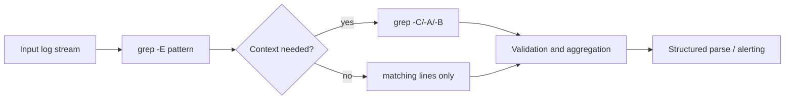
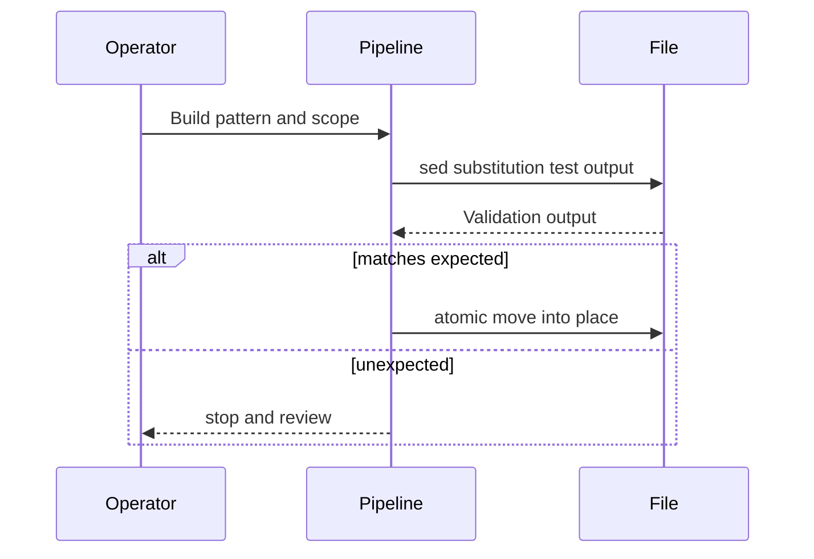
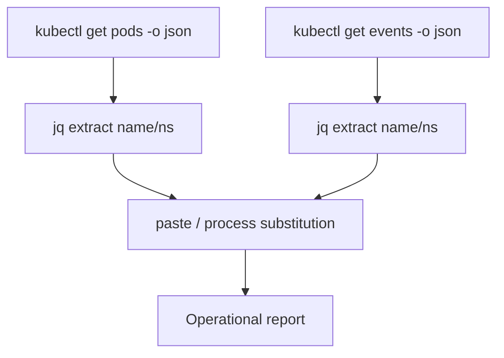

> **Shell Scripting** | Complexity: `[MEDIUM]` | This module focuses on dependable inspection, transformation, and reporting workflows that avoid silent operational drift.
>
> **Time to Complete**: 70–100 minutes (long-form read + hands-on exercise)

A running Kubernetes cluster is **not** required for this module. The Killercoda lab `linux-7.2-text-processing` is an Ubuntu host scenario with no cluster provided, and host text-processing — including every host success criterion in the hands-on exercises — completes on any Linux host without `kubectl`. Live `kubectl` commands are gated behind an explicit **Host-only vs cluster fork** at each live cluster block below.

- **Required**: Bash, `grep`, `sed`, `awk`, `sort`, `uniq`, `find`, `xargs`, and a Linux host or the linked lab
- **Optional (Kubernetes cluster path)**: `kubectl` access to a running cluster, for example a local [`kind`](https://kind.sigs.k8s.io/) cluster, for the gated JSON, process-substitution, and report examples

Before this module, the learner should be comfortable with Bash syntax, process basics, and simple command chaining. The goal is no longer one-liner memorization; it is operational precision. In real incidents, operators read uncertain data under uncertainty, so the reliability of text-processing commands is part of reliability engineering itself. You should be able to choose the parser with the right cost model, prove your transformations are safe, and produce evidence that can be replayed by another engineer during handoff.

Most text in operations is noisy because production has many producers, each with its own schema and formatting rhythm. Logs are often multi-line over time, manifests are nested documents, and cluster metadata may be huge JSON payloads that change shape across versions. The commands in this module let you handle all three classes in a single shell toolkit by separating concerns: discovery, extraction, shaping, aggregation, and validation.

The difference between an unstable runbook and a robust troubleshooting script is usually not complexity; it is a deliberate data contract. If a command can fail silently, produce partial output, or hide the reason for grouping and truncation, it is not robust enough for platform work. Text processing for SRE is a design discipline: treat every command as an operator with explicit input assumptions, and every pipeline as a reproducible claim with known boundaries.

## Learning Outcomes

After this module you can:

- Design and execute incident-safe pipelines with `grep`, `sed`, `awk`, `sort`, `uniq`, `xargs`, and `find` by selecting the parser that matches data shape and performance constraints. *(Host-only)*
- Parse, transform, and aggregate mixed structured and unstructured output with consistent semantics, explicit delimiters, and validation checks for missing values. *(Host-only)*
- Build Bash pipelines that remain reproducible under load, especially when commands are executed in parallel or when files contain spaces and special characters. *(Host-only)*
- Diagnose practical production incidents by identifying fragile parsing assumptions, regex blowups, portability traps, and truncation or ownership hazards. *(Host-only)*
- Produce operational reports from Kubernetes `kubectl` JSON and YAML-aware workflows for cluster operators. *(Cluster path — optional: live `kubectl` needs a running cluster; the JSON/`jq` reasoning works from the worked examples alone.)*

## Why This Module Matters

Operations and platform teams are judged by how quickly they separate noise from signal. Two teams can run the same command while disagreeing about root cause because one command output is sorted by one field, one parser normalizes whitespace differently, and one grep is acting on stale context windows. The module gives you one framework for avoiding that mismatch: identify record shape first, then choose a parser that does not distort it.

Consider a practical failure mode during outage triage. A pod crash wave appears in logs, but the first attempt is to `grep` for a message in command output copied into a temporary file. Without line context, a regex broad enough to match both HTTP clients and internal retries collapses multiple events into one bucket. That may produce a plausible report, but it may be wrong enough to delay control-plane interventions. A robust flow would first define where records begin and end, then isolate exact match boundaries with the right tool.

A second reason this module is foundational is that almost every platform automation relies on these primitives. GitHub Actions, Kubernetes controllers, and incident response scripts all build on shell pipelines and text streams. If your operators cannot distinguish between an in-place text edit and a structured parser, they may normalize critical content incorrectly while believing they have created a trustworthy output. This is how brittle automation starts: not from one big bug, but from repeated small assumptions that no one audited.

At this level, reliability is not measured by raw command count but by the predictability of outcomes under scale. The same pattern might work on one node and fail on two, not because the command changed, but because concurrency, locale, and character encoding changed. This module therefore emphasizes explicit flags, deterministic delimiters, and fail-aware command design.

## Did You Know

- **`grep` is fastest when the matching task stays text-native and bounded.** If you need nested field extraction, especially from structured payloads, switch away before you inherit escaping bugs.
- **`sed` does not understand JSON structure.** It works character by character on lines, so it can corrupt indentation-sensitive data if used blindly against nested documents.
- **`awk` arrays are not free.** They are excellent for bounded grouping, but memory usage grows with unique key cardinality and can become heavy on event IDs and random values.
- **`xargs` inherits delimiter behavior from input shape.** If your stream is not null-safe, filenames with spaces become multiple arguments and your command fan-out can operate on garbage.

## Grep Family for Rapid Record Discovery

`grep` remains the operator’s first filter because it is stable, quick to start, and conceptually simple: each line is a candidate, each pattern is tested, and matching lines emerge. The useful skill is not which flags exist, but where each flag changes risk.

The most common decision is literal versus regex matching. `grep` without extra flags behaves as basic regular expressions for many patterns, `-E` enables extended syntax with clearer token grouping, and `-F` is strict literal matching for operationally stable strings like host names, image tags, and fixed error tokens.

```bash
grep "Error" /var/log/system.log

grep -E "error|warning|critical" /var/log/system.log

grep -F "kube-system" /etc/kubernetes/manifests/*.yaml
```

For large patterns, `-P` enables PCRE, but you should treat it like a specialist mode: it supports more advanced constructs but can make pattern behavior less predictable across environments and more expensive with catastrophic backtracking on long lines.

```bash
grep -P "(?<!-)retry\s+count=[0-9]+" events.log

grep -P "[0-9]{4}-[0-9]{2}-[0-9]{2}" events.log
```

Context flags are where `grep` becomes evidence-focused. `-A`, `-B`, and `-C` add neighboring lines after, before, or around each match. The operational tradeoff is clear: context increases signal only when lines preserve temporal order. In high-concurrency logs, adjacent lines can be interleaved by multiple workers, so context is a hypothesis generator, not an absolute causal chain.

```bash
grep -n -A 2 -B 2 "CrashLoopBackOff" /var/log/kubelet.log

grep -n -C 3 "error" /var/log/kube-apiserver.log
```

> **Predict:** If a log file has 100 lines and exactly 3 match `"error"`, how many lines does `grep -C 3 "error"` print at most? Run the command on a small fixture to check your estimate.

Selective file traversal with `--include` and `--exclude` keeps scans realistic under incident pressure. A direct search across every file can silently include generated output, vendored content, and binaries, which increases run time and confuses outcomes when partial matches appear from unrelated files.

```bash
grep -R --include='*.log' --exclude='*.gz' "permission denied" /var/log/

grep -R --include='*.yml' --exclude-dir='.git' --exclude-dir='.terraform' "image:" /etc/kubernetes/
```

`-l` and `-L` separate existence checks from content checks. In compliance and security investigations, you often need file inventory first and deep inspection later. The safest approach is to produce a small candidate set, then inspect each file with a second pipeline that includes stronger normalization.

```bash
grep -l "privileged: true" /etc/kubernetes/**/*.yaml > /tmp/candidates.txt
xargs -r -a /tmp/candidates.txt -d '\n' -I{} sh -c 'echo "checking {}"; sed -n "1,80p" "{}"'

grep -L "deprecated" /etc/kubernetes/manifests/*.yaml
```

`-o` prints the matched text only, which is valuable for normalization and counting. Combined with `sort` and `uniq -c`, it becomes a low-friction frequency lens.

**Pause and predict:** Before you run the status-code pipeline below, will the output list codes in ascending or descending frequency order? Which command in the chain sets that order?

<details>
<summary>Check your prediction</summary>

Descending. The last `sort -nr` is a numeric reverse sort, so the largest count is first. `uniq -c` only attaches a count. The first `sort` groups identical codes so `uniq` can count them. It does not choose the order you read.

</details>

```bash
grep -o "[0-9]\{3\}" /var/log/access.log | sort | uniq -c | sort -nr | head -n 20
```



### Grep-family decision rule

Use plain `grep` or `grep -F` when you only need text presence and exact token behavior. Use `grep -E` for compact line-level alternatives, and reserve `grep -P` for targeted diagnostics. This is a direct incident optimization: minimize regex complexity unless your pattern cannot be expressed by plain or extended forms. Every extra token class increases both maintenance risk and runtime ambiguity.

## sed Essentials for Deterministic Editing and Extraction

`sed` is best used as a deterministic line transformer. It reads input, applies editing commands, and writes output in predictable sequence. In operational workflows, that predictability makes it ideal for normalization and redaction steps where you want minimal transformation and high auditability.

Substitution commands `s///` should be constrained by scope. The same replacement pattern applied globally (`g`) versus first-match-only can produce different results on config lines that appear in scripts, comments, and nested values. For operational output, always stage substitutions with `-e` when possible and validate with a dry run before in-place execution.

```bash
sed 's/\(^[[:space:]]*#\)//' settings.conf
sed -E 's/API\(([^)]+)\)/\1/' trace.txt
```

Addressing gives structure and prevents overreach. Target single lines, line ranges, or regex-bound ranges when you need to edit only a known block.

```bash
sed '1,3d' bootstrap.log
sed '100s/false/true/' bootstrap.log
sed '/^# START SNIPPET/,/^# END SNIPPET/d' deploy.sh
```

The `d`, `p`, `i`, and `a` commands are often enough for incident cleanup and reporting. `d` deletes, `p` prints selected lines, `i` inserts before a line, and `a` appends after. Combined with `-n`, you can build controlled extractions that behave like a minimal parser for known formats.

```bash
sed -n '1,25p' runtime.log
sed -n '/error/p' runtime.log
sed '/^$/d' runtime.log
sed '1i\# generated by incident triage run' report.txt
```

In-place behavior is the major portability and safety boundary for `sed`. GNU and BSD variants differ in the syntax and behavior of `-i`. The safest runbook style is to avoid default in-place edits in shared scripts unless backup strategy and ownership checks are explicit.

**Pause and predict:** You need a backup copy before `sed` rewrites `settings.conf`. Which of the two `-i` forms below writes `settings.conf.bak` on GNU sed, and which is the BSD form that takes an empty backup suffix?

<details>
<summary>Check your prediction</summary>

`sed -i.bak` is the GNU form that writes `settings.conf.bak` and then edits the original. `sed -i ''` is the BSD form: the next argument is an empty suffix, so there is no backup file. Swapping them is how a runbook deletes the argument that was meant to be the script, or skips the backup you thought you had.

</details>

```bash
sed -i.bak 's/timeout=30/timeout=60/' settings.conf
sed -i '' 's/timeout=30/timeout=60/' settings.conf
```

When in-place is mandatory, use a controlled staging method and verify the diff before moving into place, especially for files consumed by daemons.

```bash
cp settings.conf settings.conf.orig
sed 's/retry:\s*5/retry: 2/' settings.conf > /tmp/settings.conf
cmp -s settings.conf /tmp/settings.conf && echo unchanged || mv /tmp/settings.conf settings.conf
```



## awk Fundamentals: Record Logic, Math, and Aggregation

`awk` becomes the bridge between simple filtering and small analysis logic. It treats each record independently, splits fields, and lets you apply conditions and action blocks. The biggest advantage for operations is that you can aggregate while streaming, which often avoids intermediate files.

`BEGIN` and `END` let you bracket the run with deterministic setup and teardown. `BEGIN` is ideal for output headers and initialization. `END` gives final totals and audit summaries once all records are consumed. This is exactly the shape needed for operational reporting where stakeholders care about both details and totals.

```bash
awk 'BEGIN { print "pod phase status" } { print $1, $2 } END { print "done" }' pods.txt
```

Field handling is controlled by `FS`, and output shaping by `OFS`. This is where many operators make hidden assumptions about spacing. If logs change spacing, `FS='[[:space:]]+'` is safer than implicit defaults. `NF` and `$NF` make it easy to adapt to optional trailing tokens.

```bash
awk 'BEGIN { FS="[[:space:]]+"; OFS="\t" } { print $1, $(NF) }' server.log
awk -F: '{ print $1, $NF }' /etc/passwd
```

Conditional processing is straightforward: filter status codes, keep only rows that match thresholds, and route records based on field patterns. In operations, these conditions are the basis for incident heuristics and quality gates.

```bash
awk '$3 >= 500 { print $0 }' access.log
awk '$1 == "Running" { run++ } $1 == "Pending" { pending++ } END { print run, pending }' pod_statuses.txt
```

Numeric operations let you compute sums, averages, maxima, and histograms while data is still in a stream. This is faster than copying into spreadsheets and keeps context close to the source of truth.

```bash
awk '{ sum += $2 } END { if (NR > 0) print "avg_ms=", sum/NR }' latency.log
awk '{ if ($2 > 500) count += 1 } END { print count }' durations.txt
awk 'NR == 1 || $3 > max { max = $3 } END { print "max=", max }' requests.txt
```

Arrays are where `awk` shines for grouping. Use array keys like namespace or endpoint to count or sum without external joins. For large unbounded cardinalities, consider bounded fallbacks or periodic flush strategies to avoid memory pressure.

```bash
awk '{ by_status[$1]++ } END { for (k in by_status) print k, by_status[k] }' status_codes.txt
awk '{ namespace=$1; latency[$1]+=$3 } END { for (n in latency) print n, latency[n] }' ns_latency.tsv
awk '!seen[$2]++ { print $2 }' hosts.txt
```

`RS` and `OFS` can be tuned for records beyond plain line data, including CSV and multi-line sections. Use only when you control input shape, because too-broad separators can merge semantic boundaries.

```bash
awk 'BEGIN { RS="---"; ORS="\n\n"; OFS="," } NR > 1 { print $1, $2, $3 }' bundle.yaml
awk -F: 'BEGIN { OFS="\t" } { print $1, $2, $3 }' /etc/passwd
```

## cut, paste, sort, uniq, tr, head/tail, wc

After discovery and extraction, these utilities shape data without writing custom scripts. `cut` isolates known columns quickly, especially when field boundaries are guaranteed. It is simple, fast, and less brittle than regex when the position contract is fixed.

```bash
cut -d, -f1,3,5 nodes.csv
cut -d' ' -f1-3 /proc/loadavg
```

`paste` joins streams that are already aligned by line position, which is useful for side-by-side enrichment between two transformed streams. It is deterministic because it does not attempt joins, so order remains explicit.

```bash
paste <(cut -d',' -f1 deployments.csv) <(cut -d',' -f4 deployments.csv)
paste -d'\t' namespaces.txt nodes.txt cpu.txt
```

`sort` and `uniq -c` are a classic frequency pair, and their order dependence is often misunderstood. To get stable counts by category, sort first and aggregate second, then optionally sort in reverse numeric mode for top results.

```bash
grep -oE '"phase": "[A-Za-z]+"' /var/log/pods.json | sed 's/"//g' | sort | uniq -c | sort -nr | head
cut -d' ' -f1 events.log | sort | uniq -c | sort -nr
```

`tr` handles simple normalization steps such as case conversion, whitespace compression, and control-character removal. It is often the right first step before `awk` or `jq`-driven JSON shaping.

```bash
tr '[:upper:]' '[:lower:]' < /var/log/app.log | tr -s '[:space:]' ' '
tr -d '\r' < windows.txt > unix.txt
```

`head`, `tail`, and `wc` are lightweight validators. Use them to set expectations before and after transformation, not only at the end of command chains.

```bash
wc -l /var/log/kube-scheduler.log /var/log/kube-controller-manager.log
head -n 30 /var/log/syslog

tail -f /var/log/kubelet.log
```

## jq for JSON and yq for YAML Workloads

> **Host-only vs cluster fork:** This section uses `kubectl` and needs a running Kubernetes cluster. Pick your path before running anything:
>
> - **Killercoda lab / local Linux host:** The linked lab `linux-7.2-text-processing` is an Ubuntu host scenario without a cluster. Complete the host `grep`/`awk`/`yq` exercises there and read the live `kubectl` pipelines as a worked example — nothing here is required for the host path.
> - **Optional cluster path:** If you have a local [`kind`](https://kind.sigs.k8s.io/) cluster or an existing cluster with `kubectl` access, run the commands below live on it.
> - **Skip-as-read:** Without a cluster, read the commands and outputs as illustrative examples; pod names, namespaces, and cluster responses below are illustrative, and a live cluster will differ.

For Kubernetes and API-like payloads, `jq` should be the first parser. Unlike regex, it preserves JSON type semantics and lets you build selection, mapping, and reporting steps with explicit field paths. This avoids the fragile behavior of line-based matching against serialized objects.

```bash
kubectl get pods -A -o json | jq '.items[].metadata.name'
kubectl get nodes -o json | jq -r '.items[] | "\(.metadata.name)\t\(.status.capacity.cpu)\t\(.status.capacity.memory)"'
```

Use conditionals and selectors to build reports with predictable shape. For incident workflows, a stable report format is as important as accurate counts, because downstream tooling may parse this output automatically.

```bash
kubectl get pods -A -o json | jq -r '.items[] | select(.status.phase != "Running") | "\(.metadata.namespace)\t\(.metadata.name)\t\(.status.phase)"'
kubectl get nodes -o json | jq '.items[] | {name: .metadata.name, addresses: .status.addresses}'
```

`map`, `select`, and constructors are used to normalize and emit targeted structures. Instead of outputting raw JSON objects, convert to either concise NDJSON-like lines or tab-separated reports that can be reused in dashboards.

```bash
kubectl get pods -A -o json | jq -r '.items[] | [ .metadata.namespace, .metadata.name, .status.phase ] | @tsv'
kubectl get pods -A -o json | jq '[.items[] | {namespace: .metadata.namespace, name: .metadata.name, image: .spec.containers[0].image}]'
```

`yq` performs the same style of structured transforms for YAML when policy files, Helm values, and manifests become part of triage. Use it for explicit key access, array navigation, and scripted checks, not for freeform replacements.

```bash
yq '.spec.template.spec.containers[].name' deployment.yaml
yq '.metadata.labels["app.kubernetes.io/name"]' kustomization.yaml
yq '.spec.template.spec.containers | map(.image)' deployment.yaml
```

The most important anti-pattern is switching between `jq` and `yq` semantics without validating output format at each step. A YAML parser flag mismatch can silently produce different shapes, and your next command may be reading a transformed representation instead of source data.

```bash
kubectl get configmap config-a -o yaml | yq '.data | keys' | jq -R -s .
```

## find and xargs: Discovery at Scale

`find` narrows scope before transformation, and is often where production pipelines are won or lost. Using `-name`, `-path`, `-type`, `-mtime`, and `-size` turns file traversal into a controlled query language.

```bash
find /var/log -type f -name '*.log' -size -20M -mtime -7 -print0 > /tmp/log_inputs
find /etc -type f \( -name '*.yml' -o -name '*.yaml' \) -print
find . -type f -path './.git/*' -prune -o -name '*.md' -print
```

`xargs` is the execution adapter. `-n` sets how many arguments each spawned command consumes, `-P` controls concurrency, and `-I` enables explicit placeholder replacement for each item. Correct choices prevent overloading APIs or shells while maximizing throughput.

```bash
find /tmp/reports -name '*.txt' -print0 | xargs -0 -n 8 echo batch:
xargs -a pods.txt -I{} echo pod:{}
```

> **Host-only vs cluster fork:** The `kubectl` examples below need a running Kubernetes cluster. Pick your path before running anything:
>
> - **Killercoda lab / local Linux host:** The linked lab `linux-7.2-text-processing` is an Ubuntu host scenario without a cluster. The `find`/`xargs` host examples above complete without a cluster — read the `kubectl` lines as illustrative argument-construction examples; nothing here is required for the host path.
> - **Optional cluster path:** If you have a local [`kind`](https://kind.sigs.k8s.io/) cluster or an existing cluster with `kubectl` access, run the `kubectl` commands below live on it.
> - **Skip-as-read:** Without a cluster, read the `kubectl` commands as illustrative examples; pod names below are illustrative, and a live cluster will differ.

```bash
xargs -a pod-names.txt -n 1 kubectl delete pod
```

`--null` (or `-0`) is the critical safety switch for whitespace. Without it, names and paths containing spaces break into multiple arguments and can run against wrong resources.

> GNU/BSD portability note: `xargs --null`, `--max-args`, `-r`, `-a`, and `-d` are not consistently supported across BSD `xargs`, so validate available flags in mixed environments.

```bash
printf '%s\0' "pod one" "pod two" | xargs -0 -I{} kubectl get pod "{}"
```

`--max-args` complements `-n` by expressing batch size while preserving readability. In incident automation, use lower batches for cluster control APIs to reduce API throttling.

```bash
printf '%s\0' pod-a pod-b pod-c pod-d | xargs --null --max-args=2 kubectl get pod -n default --
touch file1 file2 file3 file4 file5
```

`find -exec` and `xargs` are alternatives with meaningful differences. `-exec ... +` can be faster and preserves `find`-to-command boundaries without extra process handoffs. `xargs` gives you cleaner separation between discovery and action and is often easier to test in staged mode.

```bash
find /var/log -name '*.log' -size +5M -exec wc -l {} +
find /var/log -name '*.log' -size +5M -print0 | xargs -0 wc -l
```

## rg and Modern Parsing of Large Streams

`rg` is often preferable for large repositories because of defaults around ignore patterns and better ergonomics, but it is not a replacement for every `grep` use. The practical choice is data size, expected formats, and host compatibility.

```bash
rg --line-number "(error|timeout)" /var/log
rg -n --glob '*.log' --context 2 "failed" /var/log
rg --no-ignore-vcs --hidden --glob '*.yml' "serviceAccountName"
```

For compressed streams, modern flows use explicit decompression and null-safe handling. `rg --search-zip` is convenient when supported, and `zgrep` can be used where available for compressed archives.

```bash
zgrep -n -E "Unhandled|Error" /var/log/archive/2026-05-*.gz
rg --search-zip "permission denied" /var/log/audit/*.gz
```

Performance comparisons should be operational, not only microbenchmarks. On clean text trees, `rg` is generally faster and more ergonomic. On constrained environments or strict POSIX constraints, classic `grep -R` plus explicit include/exclude may be safer.

```bash
/usr/bin/time -p rg "panic" /var/log
/usr/bin/time -p grep -RIn --exclude-dir=.git "panic" /var/log
```

## Process Substitution and Multi-source Pipelines

> **Host-only vs cluster fork:** The `kubectl` commands in this section need a running Kubernetes cluster. Pick your path before running anything:
>
> - **Killercoda lab / local Linux host:** The linked lab `linux-7.2-text-processing` is an Ubuntu host scenario without a cluster. Complete host process-substitution with local files (`join`, `paste` of text files) and read the `kubectl` pipelines as a worked example — nothing here is required for the host path.
> - **Optional cluster path:** If you have a local [`kind`](https://kind.sigs.k8s.io/) cluster or an existing cluster with `kubectl` access, run the commands below live on it.
> - **Skip-as-read:** Without a cluster, read the commands and outputs as illustrative examples; pod names, job names, and cluster responses below are illustrative, and a live cluster will differ.

Process substitution connects independent command outputs without temporary files. It is ideal for joins, parallel extraction, and side-by-side report columns.

```bash
paste <(kubectl get nodes -A -o json | jq -r '.items[].metadata.name') \
      <(kubectl get nodes -A -o json | jq -r '.items[].status.capacity.cpu')
```

When you need exact comparison between two sources, process substitution avoids manual file choreography.

```bash
diff <(kubectl get pods -A -o name) <(kubectl get deployment -A -o name)
join <(sort pods.txt) <(sort expected_pods.txt)
```

For maximum portability, combine these patterns with `mktemp` fallback scripts in environments where process substitution is unavailable, so operators get deterministic behavior rather than shell-dependent failure.

```bash
tmp_a=$(mktemp)
tmp_b=$(mktemp)
trap 'rm -f "$tmp_a" "$tmp_b"' EXIT
kubectl get pods -A -o json | jq -r '.items[] | "\(.metadata.namespace)\t\(.metadata.name)"' > "$tmp_a"
kubectl get jobs -A -o json | jq -r '.items[] | "\(.metadata.namespace)\t\(.metadata.name)"' > "$tmp_b"
cat "$tmp_a" "$tmp_b" > /tmp/combined.txt
```



## Real-World Incident Patterns to Prevent

A recurring incident is parsing kubectl table output without `-o json`. Table format depends on default columns, namespace width, and tool output tuning. In an SRE setting, this causes accidental joins across wrong fields and missed anomalies. Prefer JSON extraction and report-oriented formatting at the source.

> **Host-only vs cluster fork:** The live `kubectl` fences in this section need a running Kubernetes cluster. Pick your path before running anything:
>
> - **Killercoda lab / local Linux host:** The linked lab `linux-7.2-text-processing` is an Ubuntu host scenario without a cluster. Complete the host `grep`/`sed`/`awk` incident patterns there and read the `kubectl` table-vs-JSON examples as a worked example — nothing here is required for the host path.
> - **Optional cluster path:** If you have a local [`kind`](https://kind.sigs.k8s.io/) cluster or an existing cluster with `kubectl` access, run the commands below live on it.
> - **Skip-as-read:** Without a cluster, read the commands and outputs as illustrative examples; pod names, namespaces, and cluster responses below are illustrative, and a live cluster will differ.

```bash
kubectl get pods -n platform | awk '{print $1, $2, $3, $4}'
# Fragile: column order and spacing can change
kubectl get pods -A -o json | jq -r '.items[] | [ .metadata.namespace, .metadata.name, .status.phase ] | @tsv'
```

A second failure is regex blowup in large logs. PCRE should not be your first pass when patterns are broad and strings are long. Start with literal or bounded alternatives and narrow with short filters before applying advanced assertions.

```bash
grep -P '(a+)+$' /var/log/app.log
# can explode on pathological input

grep -F "error" /var/log/app.log | rg -o 'tx_id=[a-z0-9-]+'
```

Another practical risk is in-place edits on shared files with `sed -i`. In operational contexts, that can briefly replace file metadata while readers are open. If you must rewrite config used by services, stage and validate first, then move.

```bash
sed -i 's/old/new/g' /etc/systemd/system/my.service
echo verify && systemctl cat my.service
```

Locale also matters in numeric comparisons. `LC_ALL=C` can improve predictability and speed for large, fixed-format logs, while language-dependent collation and class matching become inconsistent across hosts.

```bash
awk '{ if ($8 > 1000) print }' stats.log
LC_ALL=C awk '{ if ($8 > 1000) print }' stats.log
```

`jq` for YAML conversions is a subtle mistake zone when multi-document behavior changes. YAML inputs can carry arrays and maps with indentation-sensitive semantics. If conversion output shape changes, your following filter may silently select wrong fields.

```bash
yq -o=json '.items[]' values.yaml | jq '.name'
# wrong if shape changes or conversion wraps data differently
```

Every incident report should end with a validation step that verifies report shape and sample lines. The command can produce evidence quickly, but the evidence must be checkable by the next person with no assumptions left behind.

```bash
kubectl get pods -A -o json \
  | jq -r '.items[] | [.metadata.namespace, .metadata.name, .status.phase] | @tsv' \
  | sort -u > /tmp/pod_phase.tsv
wc -l /tmp/pod_phase.tsv
awk 'NF != 3 { print "bad_line", NR }' /tmp/pod_phase.tsv
```

## Common Mistakes

| Pattern | Why this fails in operations | Safer replacement |
|---|---|---|
| Parsing kubectl tables with fixed columns | Column boundaries change with output width, context, and version | Use `kubectl -o json` plus `jq` projections |
| Using `sed -i` without backup on live files | File identity, watchers, and ownership can change mid-edit | Stage to temp file, validate diff, then move atomically |
| Running `grep -P` with broad expressions on huge logs | Regex engines can spend unbounded time on pathological matches | Use `grep`/`rg` with bounded patterns first, then apply PCRE only on narrowed streams |
| Assuming `uniq -c` works on unsorted input | Duplicates split across the stream are counted separately | Sort before `uniq -c` or use `awk` group aggregation |
| Ignoring whitespace in `xargs` pipelines | Paths and IDs with spaces become split tokens and corrupt command arguments | Use `-print0` and `--null` consistently |
| In-place `sed` portability issues between GNU and BSD | Empty extension rules differ and cause unexpected behavior or failures | Keep explicit backup style and test on target shell family |
| Cleaning compressed logs with plain `grep` on `.gz` files | Output is compressed and cannot be searched as intended | Use `gzip -dc`, `--search-zip`, or equivalent decompression path |

## Quiz

<details>
<summary>Which command chain best matches the goal: parse Kubernetes pod phases into a stable operational report?</summary>

A) `kubectl get pods -A | sort`  \
B) `kubectl get pods -A -o json | jq -r '.items[] | "\\(.metadata.namespace)\\t\\(.metadata.name)\\t\\(.status.phase)"'`  \
C) `awk '{print $1,$2}'` on pod table output  \
D) `grep -o Running` and redirect

**Answer:** B

**Why:** This path uses explicit JSON projection with stable keys before formatting, avoiding fragile table parsing and preserving operational meaning for downstream aggregation.
</details>

<details>
<summary>How should you reduce risk when parsing mixed structured and unstructured data in one pipeline?</summary>

A) Run all commands with `-P` by default.  \
B) Normalize structure with one command and parse only once after boundaries are explicit.  \
C) Remove all headers and parse remaining lines with `awk`.  \
D) Use `sed -i` for every line type.

**Answer:** B

**Why:** Mixed data is most reliable when each stage makes boundaries explicit and the pipeline uses one parser per known structure, avoiding repeated assumptions across line and document boundaries.
</details>

<details>
<summary>Which practice best preserves reproducibility for Bash pipelines during live remediation?</summary>

A) Always write temporary files without checks and overwrite final output directly.  \
B) Stage data transformations, validate output shape, and control parallelism with explicit flags.  \
C) Use one process with no separators and pipe everything to `cat`.  \
D) Avoid `wc`, `head`, and `tail` since they are optional.

**Answer:** B

**Why:** Reproducibility needs explicit checkpoints, consistent separators, and bounded concurrency, so every run can be replayed and verified by a second operator.
</details>

<details>
<summary>During incident triage, which sequence best catches production-grade parsing issues?</summary>

A) Parse with `sed` only, then alert.  \
B) Use `rg`, then trust first match lines.  \
C) Validate tool suitability first, then parse with scoped flags, and finally measure memory/performance impact.  \
D) Convert everything to plain text and avoid structured parsers.

**Answer:** C

**Why:** Real incident workflows need matching tool choice, scope, and validation, especially for regex cost and portability risks that appear only on production-sized inputs.
</details>

<details>
<summary>Which statement is correct for producing platform reports from cluster data?</summary>

A) Use plain table output whenever quick decisions are needed.  \
B) Use YAML and JSON parsers to emit structured records and then summarize with deterministic transforms.  \
C) Use only grep counts.  \
D) Use no validation and archive raw output only.

**Answer:** B

**Why:** Structured sources should remain structured until the report layer, so field extraction and report formatting stay deterministic and machine-consumable.
</details>

<details>
<summary>Which `xargs` pairing is most robust for filenames and object names with spaces?</summary>

A) `find ... -print | xargs rm`  \
B) `find ... -print0 | xargs --null`  \
C) `find ... | xargs -0`  \
D) `find ... -exec echo {} \;`

**Answer:** B

**Why:** `-print0` and `--null` keep argument boundaries stable, preventing accidental splitting and wrong targets.
</details>

<details>
<summary>How do you guard against command-line blowups while still searching large logs?</summary>

A) Apply one broad PCRE on full logs as the first command.  \
B) Filter with fast exact or bounded patterns first, then run heavier regex only on reduced input.  \
C) Always use maximum parallelism to finish faster.  \
D) Use `sed` without boundaries for speed.

**Answer:** B

**Why:** Progressive narrowing reduces input size and avoids expensive regex evaluation on unrelated lines while preserving signal.
</details>

## Hands-On Exercises

- [ ] *(Cluster path — optional)* Generate a reproducible Kubernetes operational report from JSON and verify sorting and readiness status columns with expected output. Needs `kubectl` on a running cluster; on the host-only path, read the JSON/`jq` section as a worked example instead.

> **Host-only vs cluster fork:** This exercise uses `kubectl` and needs a running Kubernetes cluster. Pick your path before running anything:
>
> - **Killercoda lab / local Linux host:** The linked lab `linux-7.2-text-processing` is an Ubuntu host scenario without a cluster. Skip this optional report and complete the host log-parsing exercises below — nothing here is required for the host path.
> - **Optional cluster path:** If you have a local [`kind`](https://kind.sigs.k8s.io/) cluster or an existing cluster with `kubectl` access, run the commands below live on it.
> - **Skip-as-read:** Without a cluster, read the commands and outputs as illustrative examples; pod names, namespaces, and readiness values below are illustrative, and a live cluster will differ.

```bash
kubectl get pods -A -o json \
  | jq -r '.items[] | [ .metadata.namespace, .metadata.name, .status.phase, ([.status.conditions[]? | select(.type=="Ready") | .status][0] // "Unknown") ] | @tsv' \
  | awk -F '\t' 'NF != 4 { print "MALFORMED:", $0 > "/dev/stderr"; next } 1' \
  | sort -k1,1 -k2,2 > /tmp/platform_pod_health.tsv
wc -l /tmp/platform_pod_health.tsv
head -n 5 /tmp/platform_pod_health.tsv
```

Verifiable output: file exists, line count is non-zero, and the first rows show namespace, pod, phase, readiness columns.
For a 2-pod fixture with one missing Ready condition, expected readiness output should include:
`default	p2	Pending	Unknown`.

- [ ] Validate mixed structured and unstructured parsing by splitting log records, converting, and producing top endpoint offenders from structured access data. *(Host-only — required)*

```bash
mkdir -p /tmp/log_scan
cat > /tmp/access.log <<'EOF'
203.0.113.10 - - [10/May/2026:10:00:01 +0000] "GET /api/v1/health HTTP/1.1" 200 512
203.0.113.10 - - [10/May/2026:10:00:02 +0000] "GET /api/v1/health HTTP/1.1" 404 128
198.51.100.20 - - [10/May/2026:10:00:03 +0000] "POST /api/v1/users HTTP/1.1" 403 300
198.51.100.21 - - [10/May/2026:10:00:04 +0000] "GET /api/v1/orders HTTP/1.1" 500 64
198.51.100.22 - - [10/May/2026:10:00:05 +0000] "GET /api/v2/auth HTTP/1.1" 200 256
203.0.113.11 - - [10/May/2026:10:00:06 +0000] "POST /api/v1/orders HTTP/1.1" 503 88
203.0.113.12 - - [10/May/2026:10:00:07 +0000] "GET /api/v1/orders HTTP/1.1" 500 90
198.51.100.23 - - [10/May/2026:10:00:08 +0000] "GET /api/v2/auth HTTP/1.1" 401 110
203.0.113.13 - - [10/May/2026:10:00:09 +0000] "GET /api/v1/health HTTP/1.1" 503 77
198.51.100.24 - - [10/May/2026:10:00:10 +0000] "POST /api/v1/cart HTTP/1.1" 200 450
EOF
awk 'NF == 10 && match($0, /"([A-Z]+) ([^ ]+) [^"]+" ([0-9]{3}) /, m) {
  if (m[3] >= 400) {
    endpoints[m[2]]++
  }
}
END {
  for (endpoint in endpoints) {
    printf "%6d %s\n", endpoints[endpoint], endpoint
  }
}' /tmp/access.log | sort -k1,1nr -k2 > /tmp/endpoint_outliers.tsv
cat /tmp/endpoint_outliers.tsv
```
Expected output is deterministic because this fixture is fixed; `/tmp/endpoint_outliers.tsv` should contain numeric frequency counts with the highest-volume endpoint patterns listed first:
```text
     3 /api/v1/orders
     2 /api/v1/health
     1 /api/v1/users
     1 /api/v2/auth
```

- [ ] Process compressed historical logs with null-safe pipelines, then confirm matched incident markers exist per file. *(Host-only — required)*

```bash
mkdir -p /tmp/log_scan/input /tmp/log_scan/output
cat <<'EOF' > /tmp/log_scan/input/node-a.log
node-a startup complete
Failed exception while processing request
all good
EOF
gzip -c /tmp/log_scan/input/node-a.log > /tmp/log_scan/input/node-a.log.gz

cat <<'EOF' > /tmp/log_scan/input/node-b.log
Request Timeout contacting upstream
Timeout while waiting for response
Failed dependency
EOF
gzip -c /tmp/log_scan/input/node-b.log > /tmp/log_scan/input/node-b.log.gz

cat <<'EOF' > /tmp/log_scan/input/node-c.log
normal health check
permission denied for operation
EOF
gzip -c /tmp/log_scan/input/node-c.log > /tmp/log_scan/input/node-c.log.gz

shopt -s nullglob
hits=0
for f in /tmp/log_scan/input/*.gz; do
  file_hits="$(gzip -dc "$f" | rg -c "Failed|Timeout|permission denied" || true)"
  if [[ "$file_hits" =~ ^[0-9]+$ ]]; then
    hits=$((hits + file_hits))
  fi
done
if [ "$hits" -gt 0 ]; then
  echo "hits=$hits" > /tmp/log_scan/output/summary.txt
else
  echo "no_hits" > /tmp/log_scan/output/summary.txt
fi
cat /tmp/log_scan/output/summary.txt
```
Expected output should be deterministic for this fixed fixture: `/tmp/log_scan/output/summary.txt` reports `hits=5` when incident markers are present, or `no_hits` otherwise:
```text
hits=5
```

## Deep-Dive Playbook: Evidence-first Text Pipelines

Incident-grade text processing starts by making every stage explicit in terms of purpose, input constraints, and failure behavior. A parser that changes meaning is still a parser, so teams should treat each command as a contract. The contract says what shape enters, what shape leaves, what assumptions are tolerated, and what can fail visibly. A robust flow documents those assumptions directly in command structure by using explicit delimiters, scope filters, and checkpoints. This changes command writing from ad hoc problem solving to disciplined engineering, because you can now rerun the same pipeline and explain each stage without relying on context that only the first operator remembers.

Start with the source classification step. If data is plain text output where each line already represents a record, `grep`, `awk`, and `cut` should be your first choice for discovery and field handling. If data is deeply structured, avoid treating it as plain text and parse with `jq` or `yq`. In practice, this is where many teams lose time: they spend effort adjusting ad hoc regex after a false assumption instead of making one explicit transformation boundary and validating it. Once the boundary is fixed, the remaining transforms are usually routine.

A practical way to operationalize this is the triage ladder. First, reduce volume with the cheapest safe predicate. Second, normalize boundaries and separators. Third, parse into a stable form. Fourth, aggregate and sort. Fifth, produce a report with explicit counts and sanity checks. This sequence is stable across logs, API responses, and manifest audits because each step reduces uncertainty before it increases complexity. If an intermediate step has zero output or an unexpectedly small output, stop and debug that stage rather than continue with downstream commands that can no longer be trusted.

When reviewing output for evidence, do not skip validation at each boundary. For example, after a `grep` pass, verify that line counts are expected. After field extraction, verify column counts or required tokens. After a JSON query, verify node count or schema invariants. Without these checkpoints, each command may be technically correct in isolation and still produce a misleading final report. In platform operations, the trust burden is highest at the final report stage, so this staged validation protects everyone reading the result.

One useful habit is naming each stage in a short comment inside complex scripts or command notes. Even if you do not commit full scripts here, command blocks should still show a tiny preface like "selection", "projection", or "aggregation". That lets another engineer identify the stage quickly and confirm the contract. Consistent stage naming also helps when a peer reviews command logs during incident retrospectives, because the team can map symptoms to pipeline logic and correct a stage instead of blaming earlier evidence.

When handling kubectl-related workflows, avoid command output from default table format unless human viewing is the sole objective. Table columns are presentation-oriented and can drift with API server version, column width, and context. The robust pattern is always JSON-first for machine use: `kubectl ... -o json` and then `jq` extraction. This preserves semantics and lets you aggregate across namespaces, nodes, and statuses without re-parsing whitespace. If you need a quick human glance, you can then produce a compact text report from that same normalized output.

For line-based tools, remember that performance changes with locale and input encoding. `LC_ALL=C` is not just an optimization habit; it is also an interpretation habit. It prevents locale-dependent collation differences from changing regex classes and sort order in ways that are difficult to reproduce across nodes. If a command behaves differently across hosts, compare locale and shell variants before changing logic. In many postmortems, logic did not fail, but interpretation did.

Another core rule: do not run high-impact edits without dry-run style verification. If you must edit text files with `sed`, run substitution first into a new file and diff that output against source. Even when `sed` is not in-place, command substitution can still produce misleading changes due line ending and encoding differences. A short diff before moving files to their final location costs little and prevents long rollback conversations.

For commands that fan out actions, prefer deterministic chunking. `xargs -n` constrains argument groups, while `-P` sets concurrency. High fan-out with zero control can trigger API throttling, file lock contention, and misleading partial results. In production, treat `xargs` as a workload scheduler and tune it for target systems, not local machine speed. If one API object fails repeatedly, chunking can isolate failing identifiers quickly for targeted retry.

A reliable text pipeline also keeps path handling safe. Null-delimited streams are standard for commands that may include spaces. This matters especially when filenames contain environment-generated tokens, namespaces with spaces, or JSON exports containing escaped whitespace. If a team ever sees mysterious "No such file or directory" while loops appear correct, they should inspect delimiter handling before logic. The fix is usually `-print0` + `--null`, not more regex.

Structured reporting should include stable separators from first generation onward. A useful pattern is tab-separated fields from JSON via `@tsv`, then downstream `awk`, `sort`, and `uniq` with explicit field indexes. This gives low-friction reuse in dashboards and chat summaries while keeping transformation minimal. If a value unexpectedly contains tabs, choose alternate delimiters and quote or encode fields before output. Reliability increases when parsing and reporting are both explicit.

`sort` and `uniq -c` remain useful at scale, but not as naive one-liners. A robust flow sorts normalized output immediately after extraction and only then counts duplicates. If you count before normalization, minor formatting drift can produce false top offenders and wrong remediation priority. If the same value appears in multiple forms due whitespace or uppercase differences, normalize case and whitespace before counting. For security and reliability use cases, wrong ranking can send response teams to the wrong host first.

Command composition with process substitution is underused in many team runbooks. It lets you compare outputs and run side-by-side checks without temporary artifacts. This is important for reproducibility because temp files can become stale and are often forgotten. A process-substitution diff that compares current and expected resource names, for example, highlights drift immediately. If the diff is empty, you confirm expected parity quickly.

For large archives and compressed logs, make decompression explicit and traceable. Do not assume command output type from extension alone. A reliable pipeline should decompress into streams only where parser choice is known, then immediately filter and capture counts. If every command in a loop has its own decompression behavior, failures become harder to diagnose. Shared helper snippets reduce this variation and make each command predictable.

Another operational anti-pattern is mixing shell syntax and parser syntax in the same mental model. `grep`, `awk`, and `jq` have different escaping rules, quoting conventions, and failure modes. When a team porting a command into automation treats them as interchangeable, escape mistakes happen and debugging turns expensive. Keep each command as a separate transform stage and test stage-level behavior with small inputs first. This is especially true for JSON filters with dots in field names or special characters.

For incident escalation, convert each handoff into reusable outputs with checksums, counts, and metadata. A single report file with line counts, top offenders, and missing-value counts is more actionable than a raw stream because it provides auditable context. If a new team member joins the on-call shift, they can reason from the report structure and reproduce the commands if needed. Operational clarity reduces cognitive load exactly when shift handover needs speed and precision.

Do not underestimate the maintenance burden of command pipelines over time. A command that is robust today can become brittle when cluster versions change or log formats evolve. Include comment notes that capture command intent and expected upstream format versions. When output format changes, you then replace one stage rather than the entire procedure. This lowers regression risk in shared runbooks and keeps teams from discovering breakage during outages.

For repeated investigations, pre-build parameter blocks. For example, keep a list of namespaces, label patterns, namespaces under maintenance, and alert thresholds outside command bodies. Then reuse those inputs in all discovery commands. Parameterization makes the same script easier to execute in staging and production while keeping logic stable. It also reduces accidental edits inside critical commands during incident pressure.

When you build complex command chains, consider the observability of failure. If one stage fails silently due empty input, downstream commands may still print output that looks non-empty. Make each stage fail fast where possible with guards that verify required fields and non-empty streams. This improves trust in all later steps and prevents false confidence from empty-but-successful pipelines.

A practical example pattern is a four-stage runbook: discover candidate objects with `find` or API query, constrain with predicates, transform with `jq`/`awk`, and verify with counts and sample rows. If any stage exits unexpectedly, you stop and send the checkpoint output to the next operator. This approach is slower than running one command directly, but it is dramatically faster during real incidents because the first failure points to the stage, not the symptom.

Avoid command-line cleverness for novelty value during high-stress events. A small increase in readability or deterministic ordering usually saves minutes when teams need to reuse outputs, and minutes matter more than elegance when pages are firing. Prefer explicit control over terse cleverness. In text operations, clarity is a direct reliability feature.

When producing final operational reports from cluster state, include both status and confidence signals. For example, include counts by phase, a sample of non-running resources, and a missing-value check for any field that could be absent in unusual object states. This reduces the chance that a missing field gets interpreted as a successful all-green state. The point is not just to answer "what happened" but to answer "how sure is this output".

Finally, keep your pipeline artifacts portable. When commands rely on GNU-only behavior or system-dependent options, note that dependency explicitly. If a playbook is used across mixed shells, fallback paths should be documented. That documentation prevents teams from running a command on one platform and failing on another while expecting identical results. Robustness in text processing includes portability documentation as a first-class requirement.


## Evidence Templates for Cluster Operations

A useful template for cluster-safe text investigation starts with metadata intent before command execution. Write the objective in one sentence and the required certainty level in one line, then list command stages with expected sample output for each stage. This template prevents "analysis drift" during response because each team member can see whether they are checking the same artifact. When the incident lasts long enough that shifts change, that shared template is often the difference between coherent handoff and duplicated work.

For each stage, include three validation outputs: count, sample line, and structural check. Count confirms volume. A sample line confirms field shape. Structural checks confirm the parser saw expected keys and field counts. For line-based output this can be as simple as a `wc -l` and `awk` field count check. For JSON, a sample list and object cardinality check with `length` are usually sufficient. For YAML, print explicit keys before doing destructive edits.

In SRE operations, a command that has no validation is a command that silently accumulates risk. Example: extracting endpoints with `cut` is cheap, but only safe when delimiter and column counts are confirmed each run. If an upstream release changes one line format, you should fail at extraction and alert, not produce a merged report. This is why stage validation is not extra ceremony; it is an engineering control.

For kubectl-driven command chains, include namespace scoping and context controls at the top of each block so readers can immediately confirm they are looking at the right environment. If a test script is run from the wrong context, text parsers still produce output, and that output can look perfectly plausible while being irrelevant. Add context, namespace, and API call boundaries into command preambles for clarity.

Concurrency should also be documented, not only configured. If you choose `xargs -P 4`, note why that concurrency level is safe for your cluster API and what backoff policy you expect if throttled. Teams often increase parallelism under pressure, but without a plan, that can increase API failures and lengthen recovery. A reproducible incident playbook should keep concurrency as a documented assumption.

A common failure during remediation is mixing cleanup and triage into one pipeline. Keep immutable evidence generation distinct from mutation stages. For example, gather pod readiness and restart counts first. Only after evidence is stored do you remove or restart resources. This sequencing gives you a rollback point and a defensible timeline, and it reduces the chance of losing the exact context that prompted the action.

When generating operational reports from JSON, include status buckets and exception buckets. If one field is missing in a minority of objects, report it explicitly rather than dropping those rows. This is especially important with newer Kubernetes fields that are optional or version-gated. Missing values are often signals, not noise, because version drift can be operationally meaningful.

Whitespace and encoding hygiene deserves its own checkpoint because many pipelines fail late instead of early. Normalize case, line endings, and delimiter expectations before heavy transforms. `tr` can handle most formatting cleanup quickly, but pair it with validation so you do not accidentally normalize legitimate values. The goal is consistency in parser input, not aggressive mutation of data semantics.

For archived and mixed logs, adopt an archive policy and test it against both one-line and multi-line patterns. Decompress and parse with explicit commands, then archive the extracted incident lines separately for postmortem reproducibility. If the archive fails, there is no incident log to support analysis, and if the archive succeeds but parsing differs, your parser assumptions were likely wrong at a delimiter or escape stage.

Before handing over the final report, create a short interpretation section that explicitly names what was observed, what was assumed, and what should be verified next. This is not fluff; it preserves the boundary between evidence and recommendation. With high-volume infrastructure incidents, that boundary can prevent teams from converting provisional observations into irreversible actions without sufficient confidence.


## Readiness Checklist Before Incident Use

If this module is used in an active incident, run a quick readiness pass before the first command. Confirm shell and host-tool availability first; `kubectl` context and API permissions apply only on the optional cluster path. Then verify that temporary output locations are writable and that expected cleanup policies are clear. This pre-flight prevents avoidable delays where the tooling itself becomes part of the incident. A reliable text-processing workflow assumes the environment is prepared before parsing starts. Host log parsing does not need a cluster.

Set explicit failure criteria for each stage before entering production execution. For each command group, decide what output size is plausible and what shape means a valid parse. If an output count is zero, decide if that is an expected condition or a pipeline break. This guardrail protects operators from treating command failures as normal states. Reproducible investigations include these criteria because they document not only what success looks like, but what warning signals require stop-and-investigation behavior.

During run execution, capture three artifacts automatically: the raw transformed input snapshot list, the normalized report output, and a command log with key options and timestamps. That triad gives enough context for post-incident debriefs and enables others to rerun exactly the same flow later. Even if the output is short-lived, the triad gives enough evidence for accountability and follow-up action.

After execution, perform a structured review: verify counts, confirm that key statuses are represented, and sample at least one item from each non-empty output section. Confirm that commands using parallelism did not hide resource contention, and that all expected namespaces or paths were scanned. If any stage exceeded expected bounds, add explicit notes in the incident thread, including which stage should be tuned. This is one of the most practical differences between a strong runbook and a fragile script collection.

Finally, archive the minimal evidence and retire temporary files. If you used process substitution, capture key command output once into a deterministic file. If you used temporary files, clean them immediately with predictable retention and ownership policy. This operational hygiene keeps evidence available for follow-up while preventing stale artifacts from affecting future incidents. With these practices, text processing remains a trusted operational primitive, not a historical liability.

- [ ] I named a failure layer and a next action for each frozen pipeline-layer card before opening the reveal.

A sort flag, a `sed -i` suffix, a kubectl table, and a first-pass regex can each look like the right tool and still be the wrong layer. These cards freeze four transcripts so you can name the layer before you look.

**Card A: Frequency list, wrong end.** The status-code report leads with the rare codes. The pipeline is `grep -o`, `sort`, `uniq -c`, `sort`, `head`.

<details>
<summary>Check your prediction</summary>

Failure layer: the last `sort` is not `-nr`. Next action: put the numeric reverse sort after `uniq -c`, not before it.

</details>

**Card B: Backup missing after sed.** The runbook used `sed -i ''` on a GNU host. `settings.conf` changed. `settings.conf.bak` was never written.

<details>
<summary>Check your prediction</summary>

Failure layer: BSD empty-suffix syntax on GNU sed. Next action: use `-i.bak` on GNU, and confirm the backup file exists before you leave the host.

</details>

**Card C: Columns drifted.** `kubectl get pods | awk '{print $3}'` used to be the phase. After a client upgrade it is a different field. The report still looks tidy.

<details>
<summary>Check your prediction</summary>

Failure layer: table layout, not awk. Next action: take `-o json` and name the fields, then compare one row to the table you used to trust.

</details>

**Card D: First pass is PCRE.** A huge log is searched with `grep -P '(a+)+$'` before any literal filter. The command is still running.

<details>
<summary>Check your prediction</summary>

Failure layer: catastrophic backtracking on the full file. Next action: stop it, filter with `grep -F` first, and only then run a bounded pattern on the reduced stream.

</details>

## Next Module

- [Module 7.3: Practical Scripts](../module-7.3-practical-scripts/)

## Sources

- [sed man page](https://man7.org/linux/man-pages/man1/sed.1.html)
- [awk man page](https://man7.org/linux/man-pages/man1/awk.1p.html)
- [grep man page](https://man7.org/linux/man-pages/man1/grep.1.html)
- [find man page](https://man7.org/linux/man-pages/man1/find.1.html)
- [xargs man page](https://man7.org/linux/man-pages/man1/xargs.1.html)
- [sort man page](https://man7.org/linux/man-pages/man1/sort.1.html)
- [cut man page](https://man7.org/linux/man-pages/man1/cut.1.html)
- [tr man page](https://man7.org/linux/man-pages/man1/tr.1.html)
- [jq manual](https://jqlang.github.io/jq/manual/)
- [yq documentation](https://mikefarah.gitbook.io/yq/)
- [ripgrep performance notes](https://blog.burntsushi.net/ripgrep/)
- [kubectl jsonpath reference](https://kubernetes.io/docs/reference/kubectl/jsonpath/)
