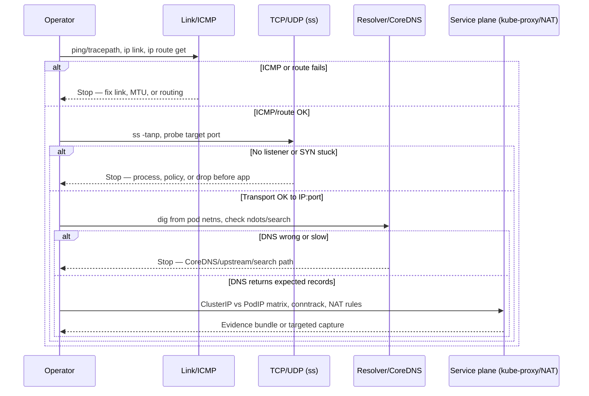

> **Linux Troubleshooting** | Complexity: `[COMPLEX]`
> 
> **Time to Complete**: 50–80 minutes (long-form read + hands-on exercise)

## Prerequisites

Before starting this module, confirm you already understand the Linux protocol stack and basic Kubernetes networking objects.
- **Required**: [Module 3.1: TCP/IP Essentials](/linux/foundations/networking/module-3.1-tcp-ip-essentials/)
- **Required**: [Module 6.3: Process Debugging](/linux/operations/troubleshooting/module-6.3-process-debugging/)
- **Helpful**: [Module 5.2: CPU & Scheduling](/linux/operations/performance/module-5.2-cpu-scheduling/)

## Learning Outcomes

After completing this module, you will be able to:

- **Trace** ICMP, TCP/UDP, DNS, and Kubernetes service-plane failures using a fixed layer-by-layer workflow instead of ad hoc command sprawl.
- **Interpret** `ss`, `ip route get`, `ip neigh`, packet captures, and conntrack counters to locate the exact failure boundary between host, CNI, kube-proxy, and application sockets.
- **Design** bounded `tcpdump` captures and offline `tshark` filters that prove whether bytes reached a listener, were dropped by policy, or never left a namespace.
- **Compare** kube-proxy iptables versus IPVS datapaths and explain how DNAT, SNAT, and conntrack entries should align with EndpointSlices on Kubernetes 1.35+ clusters.
- **Reproduce** MTU blackholes, conntrack table exhaustion, and CoreDNS search-path amplification in kind so postmortems reference evidence, not guesses.

## Why This Module Matters

**Hypothetical scenario:** At 03:40 during a regional incident, checkout latency spikes while CPU graphs stay flat. Application logs blame “upstream timeouts,” the ingress team insists TLS is healthy, and someone proposes restarting kube-proxy on every node because “that fixed it last time.” Twenty minutes later the cluster is noisier, SSH sessions on two nodes flicker, and nobody can answer a simple question: did the client’s SYN packet reach the pod listener, or did it die in overlay MTU, a full conntrack table, or a resolver search storm?

Network outages punish confident narratives. `ping` succeeding does not prove TCP handshakes work. CoreDNS pods being Ready does not prove a pod’s `ndots:5` search list is sane. A Service object with endpoints does not prove kube-proxy programmed the mode you think you run. The expensive mistake is attributing a transport failure to application code, or a DNS failure to kube-proxy, because the first command an operator ran happened to return plausible text.

This module teaches diagnosis as falsification. Each layer—ICMP reachability, transport sockets, DNS naming, then Kubernetes virtual IPs and NAT—gets one primary tool family and a clear “if this passes, move on; if it fails, stop and own this layer.” That discipline keeps production changes small: you capture routes, neighbors, socket state, and a short pcap before anyone flushes firewall state or restarts dataplane daemons.

The workflow also matches how platform teams actually work under time pressure. You will compare host context and pod network namespace context, because CNI overlays routinely make host routes look perfect while pod egress fails. You will treat conntrack as a finite resource that can drop **new** flows while old SSH sessions survive—exactly the pattern that looks like “random backend flapping.” By the end, you should be able to hand another engineer five sentences, three command outputs, and one pcap filename that pin the boundary without asking them to repeat your entire scrollback.

Operators who debug only from application dashboards often re-learn the same lesson: the kernel exposes cheaper truth than aggregated metrics. A spike in `SYN-SENT` on a node may never appear as a red panel in your APM tool, yet it explains user timeouts precisely. Likewise, a CoreDNS `NXDOMAIN` storm from `ndots` search expansion may look like “the app cannot connect to the database” when the app never reached the database IP at all.

This module assumes you will practice the sequence until it feels boring. Boring during practice means reliable during outages. The Killercoda lab linked in the module metadata mirrors these steps; use it after the hands-on sections here if you want a guided environment with checkpoints.

## Core Section 1: Diagnose by Layer (ICMP → Transport → DNS → Service Plane)

Every incident gets the same entry point. Split the symptom by protocol responsibility before mixing tools. ICMP and interface state answer “can this host emit and receive IP frames toward the next hop?” TCP and UDP socket state answer “did a listener exist and did the handshake progress?” DNS answers “did the client learn the addresses it will dial?” Only after those three planes are characterized do you inspect ClusterIP DNAT, kube-proxy mode, and conntrack translation for Kubernetes service traffic.

The sequence is intentional. Skipping straight to `tcpdump` on `any` often wastes minutes and captures credentials. Skipping DNS while TCP to an IP works wastes hours chasing kube-proxy when the app never learned the right address. Skipping socket inspection while packets look fine on the wire sends you to firewall dumps when the process simply never bound the port.



Write the failing layer on the incident ticket before running the next command. If step two fails, step four is noise until you explain why transport should still be investigated.

| Layer | Primary question | Example falsification command |
|-------|------------------|------------------------------|
| ICMP / route | Can this namespace reach the next hop toward the destination? | `ip route get <dst>` then `ping -c 2 <dst>` |
| Transport | Is a listener present and is handshake progressing? | `ss -tan dst <dst>:<port>` |
| DNS | Did the client learn the intended address? | `dig +search +time=2 <name>` from the pod |
| Service plane | Does virtual IP translation match current endpoints? | ClusterIP vs PodIP `curl` matrix + NAT inspection |

**Active learning prompt:** A pod reaches `8.8.8.8` with `curl` but times out calling `https://payments.default.svc.cluster.local`. List the three layers you would prove healthy **in order**, and name one command per layer that could falsify your current guess.

### Worked example: Narrow “works by IP, fails by name” in one pass

Suppose `curl -m 3 https://10.96.0.15:443` succeeds from a debug pod but `curl -m 3 https://kubernetes.default.svc.cluster.local` times out. IP reachability and likely transport toward the ClusterIP are already plausible; your next work belongs in DNS, not kube-proxy.

```bash
# From the failing pod (netshoot or app container)
kubectl exec -n default deploy/netshoot -- cat /etc/resolv.conf
kubectl exec -n default deploy/netshoot -- dig +time=2 +tries=1 kubernetes.default.svc.cluster.local
kubectl exec -n default deploy/netshoot -- dig +time=2 +tries=1 kubernetes.default.svc.cluster.local @kube-dns.kube-system.svc.cluster.local
```

If the direct Service FQDN query succeeds but short names fail, suspect `ndots` and `search` expansion before touching iptables. If both fail while `dig @8.8.8.8` works, suspect CoreDNS upstream or NetworkPolicy to kube-dns, not application TLS.

Document each command’s scope in your notes: `host`, `netns`, destination IP or name, and timestamp. During bridge calls, that single habit prevents arguing about results gathered from different namespaces.

## Core Section 2: ICMP, Routes, and Transport Sockets

### Link and ICMP baselines

Start with interface admin state, selected source address, and deterministic routing for the destination under test. `ip route get` is faster than mentally parsing full tables during a bridge call.

```bash
ip -br addr show
ip route get 8.8.8.8
ip route get 10.96.0.1 from 10.244.1.5 iif eth0
ping -c 4 -W 2 10.96.0.1
ping -c 3 -M do -s 1472 10.244.2.10
ping -c 3 -M do -s 1400 10.244.2.10
```

Use DF-sized probes deliberately when overlays advertise MTU 1450 on tun/vxlan interfaces while node NICs remain 1500. A classic blackhole shows small pings succeeding and large TCP transfers hanging with retransmits—often misreported as database slowness.

`tracepath` combines hop discovery with PMTU hints; `mtr` helps when loss is intermittent rather than absolute.

```bash
tracepath -n 10.244.2.10
mtr -rwzc 30 10.244.2.10
```

### `ss` as the transport truth lens

`ss` reads socket tables via netlink and remains usable at high connection counts. Treat states as trends: rising `SYN-SENT` without `ESTABLISHED` implies drops or no listener; rising `CLOSE-WAIT` often points to application shutdown discipline, not external routing.

```bash
ss -tulnp
ss -tan state syn-sent
ss -tan sport = :8080
ss -tan dst 10.244.2.10:443
```

Process columns (`-p`) require privileges matching `/proc` access—typically root on the node or `CAP_SYS_ADMIN` in the target namespace. Without them, socket rows still appear but PIDs may be hidden, which is easy to misread as “nothing listening.”

For Kubernetes, run parallel checks on the node and inside the pod network namespace:

```bash
CONTAINER_ID=$(kubectl get pod -n default -l app=target -o jsonpath='{.items[0].status.containerStatuses[0].containerID}' | sed 's|.*://||')
PID=$(sudo crictl inspect "$CONTAINER_ID" | jq .info.pid)
sudo nsenter -t "$PID" -n ss -tanp
```

Compare with the service Endpoints before concluding kube-proxy is broken:

```bash
kubectl get endpointslices -n default -l kubernetes.io/service-name=target -o wide
```

**Active learning prompt:** `ss -tan` on a node shows `LISTEN` on `0.0.0.0:8080`, but a cluster client still times out. Name two namespaces or dataplane boundaries where the listener could exist yet the client path never reaches it.

### Path discovery when ICMP is filtered

Many clouds and corporate networks rate-limit or drop ICMP TTL-exceeded messages. A silent `traceroute` does **not** prove the path is broken. Use TCP-shaped probes when policy blocks ICMP but application traffic uses TCP:

```bash
traceroute -n -T -p 443 10.244.2.10 2>/dev/null || tracepath -n 10.244.2.10
tcptraceroute -n -p 443 10.244.2.10 2>/dev/null || true
```

Interpret hop silence carefully: if the final destination still answers `ss` and bounded `tcpdump` shows SYN/SYN-ACK exchange, middle-hop silence may be cosmetic. If the final destination never completes handshake while SYN repeats in capture, treat transport or policy as failed regardless of traceroute aesthetics.

### Host versus pod checks on kind

```bash
# Host (kind node container)
docker exec netdebug-control-plane ip route get 10.244.1.5
docker exec netdebug-control-plane ping -c 2 10.244.1.5

# Pod network namespace
kubectl exec -n default deploy/netshoot -- ip route get 10.244.1.5
kubectl exec -n default deploy/netshoot -- ping -c 2 10.244.1.5
```

When host ping works and pod ping fails, your incident owns CNI routing, network policy, or interface choice—not “the internet is down.” When both fail identically, move down the stack toward physical uplink or cloud security groups before editing Deployments.

### UDP and QUIC-shaped symptoms

UDP has no connection state in `ss` comparable to TCP’s handshake, so “UDP works” often means only that something responded once. DNS, DHCP-like bootstrap traffic, and QUIC (HTTP/3) may fail independently of TCP checks.

```bash
ss -u -a
kubectl exec deploy/netshoot -- dig +time=2 +tries=1 @kube-dns.kube-system.svc.cluster.local kubernetes.default.svc.cluster.local
kubectl exec deploy/netshoot -- nc -u -w 2 10.244.2.10 53 </dev/null; echo "nc_udp_exit=$?"
```

If TCP to port 443 succeeds but UDP/53 fails, suspect DNS policy or conntrack timeouts on DNS flows before replacing ingress controllers. If both TCP and UDP fail toward the same pod IP, return to routing and overlay MTU before blaming application protocols.

## Core Section 3: DNS, `ndots`, CoreDNS, and NodeLocal DNSCache

DNS failures masquerade as “network down” because applications report generic dial errors. Separate **reachability to the resolver** from **answer quality** (`NOERROR`, `NXDOMAIN`, timeout).

```bash
kubectl exec -n default deploy/netshoot -- cat /etc/resolv.conf
kubectl exec -n default deploy/netshoot -- dig +time=2 +tries=1 mysvc.default.svc.cluster.local
kubectl exec -n default deploy/netshoot -- dig +time=2 +tries=1 mysvc
kubectl exec -n default deploy/netshoot -- dig +time=2 +tries=1 mysvc.default.svc.cluster.local @kube-dns.kube-system.svc.cluster.local
```

`ndots:5` (common in generated pod resolv.conf) is the **dot threshold**, not a query multiplier by itself: when a name has **fewer than five** dots, the resolver tries each `search`-list suffix **before** the absolute query. A default pod search list has three cluster suffixes (`<namespace>.svc.cluster.local`, `svc.cluster.local`, `cluster.local`), so a single-label lookup like `doesnotexist` becomes four candidate FQDNs × two record types (A + AAAA) = **eight** DNS queries before a final `NXDOMAIN` (use a name that genuinely does not exist — `kubernetes` itself resolves at the first cluster suffix because `kubernetes.default.svc.cluster.local` is the API service). A typo like `curl payments` therefore amplifies latency and conntrack load even when the “right” FQDN would have answered immediately.

`dig +trace` walks delegation from the root downward and **does not apply** `/etc/resolv.conf` `search` or `ndots` behavior. It is excellent for public-zone debugging and misleading for in-cluster names—never use it alone to prove pod resolver health.

CoreDNS logs and upstream timeouts remain the control plane signal when queries reach the cluster DNS Service but answers lag:

```bash
kubectl -n kube-system get pods -l k8s-app=kube-dns -o wide
kubectl -n kube-system logs -l k8s-app=kube-dns --tail=100 --since=5m
kubectl -n kube-system get svc kube-dns -o yaml
```

**NodeLocal DNSCache** (optional DaemonSet) binds a link-local listener (often `169.254.20.10`) on each node so pods avoid extra hop hairpins to cluster DNS. When enabled, pod `nameserver` lines point at that cache IP. Symptoms include fast answers for cached names but confusing upstream behavior if the cache’s upstream list diverges from CoreDNS Service endpoints—debug both the cache listener and CoreDNS, not only one hop.

Official Kubernetes 1.35 guidance for cluster DNS and troubleshooting lives in the Service/DNS concepts and the dedicated debugging task doc—use those when correlating `resolv.conf` with API objects.

### Upstream and policy failures

When CoreDNS returns `SERVFAIL` or times out, split the path:

```bash
kubectl -n kube-system get endpoints kube-dns -o wide
POD_IP=$(kubectl -n kube-system get pod -l k8s-app=kube-dns -o jsonpath='{.items[0].status.podIP}')
kubectl run -n default dns-check --rm -it --restart=Never --image=nicolaka/netshoot -- curl -s "http://${POD_IP}:8080/health"
kubectl run -n default dns-upstream --rm -it --restart=Never --image=nicolaka/netshoot -- \
  dig +time=2 +tries=1 @kube-dns.kube-system.svc.cluster.local kubernetes.default.svc.cluster.local
```

NetworkPolicy blocking egress from `kube-system` or blocking pod→DNS traffic presents as widespread “app can’t resolve” while node-level `dig @8.8.8.8` still works from the host. Confirm policies with `kubectl describe networkpolicy -A` before editing CoreDNS ConfigMaps.

### Negative answers versus timeouts

| Symptom | Typical meaning | Next command |
|---------|-----------------|--------------|
| `NXDOMAIN` quickly | Name truly absent or wrong search suffix | `dig` FQDN; check Service/ExternalName |
| Repeated timeouts | Resolver unreachable, policy drop, or overload | `dig @kube-dns`; CoreDNS logs; `ss -u` to :53 |
| Intermittent slow | `ndots` search amplification or upstream cache miss | Compare short vs FQDN; watch CoreDNS metrics |

## Core Section 4: Packet Capture with Bounded `tcpdump`

Capture when socket tables and routing disagree with user-visible failures. Always choose the **interface that actually carries the flow**: `cni0`, `vxlan.calico`, `veth*` peer, or the pod namespace via `nsenter`, not blindly `any` on busy nodes.

```bash
# Host bridge toward pod CIDR — adjust interface to your CNI
sudo tcpdump -i cni0 -nn -c 200 host 10.244.2.10 and port 443

# Pod namespace — replace PID with container runtime PID
sudo nsenter -t "$PID" -n tcpdump -i eth0 -nn -c 200 host 10.244.2.10 and tcp port 443 -w /tmp/pod-flow.pcap
```

Unfiltered captures on high-traffic nodes fill disks and may record sensitive payloads. Prefer host + port + protocol predicates; add `-w` only after a short live view confirms the filter hits traffic.

Modern libpcap defaults usually capture full snap length without needing `-s 0`; the flag remains common in runbooks and is harmless on Ubuntu 24.04.

Offline review ties packets back to `ss` timelines:

```bash
tcpdump -r /tmp/pod-flow.pcap -nn
tshark -r /tmp/pod-flow.pcap -Y 'tcp.flags.syn==1 && tcp.flags.ack==0'
tshark -r /tmp/pod-flow.pcap -Y 'dns.flags.response==1'
```

> **Warning:** `conntrack -F` and `iptables -F` destroy **host-wide** state. They can terminate your SSH session, reset unrelated production flows, and erase the evidence you still need. Never use them as a first remediation. Snapshot read-only state (`iptables-save`, `conntrack -S`, pcaps) and agree on blast radius with another operator first.

### Filter cookbook (copy into runbooks)

| Goal | Example filter |
|------|----------------|
| SYN-only handshake | `'tcp[tcpflags] & (tcp-syn\|tcp-ack) == tcp-syn'` |
| DNS queries | `'udp port 53'` |
| Pod to Service ClusterIP | `host 10.96.0.20 and port 443` |
| Drop SSH noise | `not port 22` combined with your host predicate |

Save files with timestamps: `/tmp/incident-$(date +%Y%m%d-%H%M)-svc.pcap`. Postmortems without filenames force the next responder to re-capture under fire.

## Core Section 5: Routes, Neighbors, and Namespace Parity

`ip route get` shows which source address, interface, and next hop the kernel **will** use for a hypothetical packet. Compare host versus pod namespace answers for the same destination; divergence is expected with overlays but must be explained.

```bash
ip route get 10.244.2.10
sudo nsenter -t "$PID" -n ip route get 10.244.2.10
ip neigh show dev cni0
ip neigh show dev vxlan.calico 2>/dev/null || true
```

After CNI restarts or node reboots, stale neighbor (ARP/NDP) entries can point at old MAC addresses while control plane objects look fresh. If `ping` eventually succeeds after retries but `ip neigh` was incomplete early, capture neighbor events while reproducing.

Policy routing and multiple tables matter on nodes running advanced CNIs:

```bash
ip rule list
ip route show table all | sed -n '1,80p'
```

List visible network namespaces when debugging sidecars and hostNetwork pods:

```bash
ip netns list
ls -l /var/run/netns/
```

### Reverse-path filtering (`rp_filter`)

Asymmetric routing through overlays or multi-homed nodes can interact badly with strict reverse-path filtering. Symptom: packets arrive, replies leave a different interface, and the kernel drops replies.

```bash
sysctl net.ipv4.conf.all.rp_filter
sysctl net.ipv4.conf.default.rp_filter
for iface in eth0 cni0 flannel.1 vxlan.calico; do
  sysctl net.ipv4.conf."$iface".rp_filter 2>/dev/null || true
done
```

Do not disable `rp_filter` cluster-wide without evidence. Compare a failing node with a healthy peer during the same incident window.

### Sidecar and shared-network-namespace cases

Init containers and sidecars share the pod network namespace. A listener on `127.0.0.1` in the sidecar is reachable only from containers in that same namespace—not from another pod elsewhere in the cluster. Application charts that put TLS proxies in sidecars frequently confuse teams who test Service ClusterIPs but omit loopback scope.

When a pod has `hostNetwork: true`, its sockets appear in the host namespace; `kubectl exec` into a non-hostNetwork debug pod will not reproduce the same `ss` output. Always match the network mode of the failing workload.

## Core Section 6: kube-proxy, NAT, and conntrack on Kubernetes 1.35+

ClusterIPs are virtual destinations. kube-proxy programs Linux forwarding—iptables, nftables backends, or IPVS depending on cluster configuration. The debugging mistake is inspecting iptables chains while the cluster runs IPVS (or vice versa).

```bash
kubectl -n kube-system get configmap kube-proxy -o yaml | grep -E 'mode:|ipvs'
kubectl -n kube-system get ds kube-proxy -o wide
```

### ASCII: ClusterIP DNAT and conntrack binding

```text
 Pod client                         Node (kube-proxy)                    Backend pod
 10.244.1.9                         ┌─────────────────────────────┐      10.244.2.37
     │                              │ PREROUTING / OUTPUT          │
     │  dst 10.96.0.15:443          │  DNAT → 10.244.2.37:8443   │
     ├─────────────────────────────►│  conntrack NEW entry         ├────► listener :8443
     │                              │  reply SNAT uses entry       │
     │◄─────────────────────────────┤  (must match EndpointSlice)  │
     │                              └─────────────────────────────┘

 If EndpointSlice changes but stale DNAT/conntrack remains → successful
 health checks elsewhere, intermittent 503s or SYN timeouts here.
```

Validate the three-hop matrix whenever Service traffic misbehaves:

1. DNS name → ClusterIP (control plane)
2. ClusterIP:port → kube-proxy translation (dataplane)
3. PodIP:targetPort directly (bypasses virtual IP)

```bash
SVC=kubernetes
kubectl get svc -n default "$SVC" -o wide
kubectl get endpointslices -n default -l kubernetes.io/service-name="$SVC" -o yaml | sed -n '1,60p'
EP=$(kubectl get endpointslices -n default -l kubernetes.io/service-name="$SVC" -o jsonpath='{.items[0].endpoints[0].addresses[0]}')
kubectl run -n default netcheck --rm -it --restart=Never --image=nicolaka/netshoot -- \
  sh -lc "curl -m3 -sS -o /dev/null -w '%{http_code}\n' https://${EP}:443 || true"
```

### conntrack saturation

The connection tracker stores state for NATed and tracked flows. When `nf_conntrack_count` approaches `nf_conntrack_max`, **new** flows may be dropped while established SSH or long-lived gRPC streams continue—creating “random” user impact.

```bash
sysctl net.netfilter.nf_conntrack_max net.netfilter.nf_conntrack_count
sudo conntrack -S
sudo conntrack -L -p tcp --dport 443 2>/dev/null | head -20
```

Read-only inspection is safe; flushing is not. Kernel sysctl documentation describes timeout and bucket tuning; size changes belong in change control with memory headroom validated on canary nodes.

For iptables-mode clusters, correlate `KUBE-SVC` / `KUBE-SEP` chains with EndpointSlice addresses. For IPVS mode, inspect `ipvsadm -Ln` instead of hunting DNAT rules that do not exist.

```bash
sudo iptables-save -t nat | grep -E 'KUBE-SVC|KUBE-SEP' | head -40
sudo ipvsadm -Ln 2>/dev/null | head -40 || echo "ipvsadm not installed or not IPVS mode"
```

Overlay MTU 1450 versus NIC 1500 still appears here as TCP blackholes **after** DNAT succeeds—always correlate with DF ping probes on the same path.

### iptables mode versus IPVS mode (operator comparison)

| Question | iptables mode | IPVS mode |
|----------|---------------|-----------|
| Primary inspection tool | `iptables-save -t nat`, `KUBE-*` chains | `ipvsadm -Ln` |
| Failure after Endpoint churn | Stale DNAT rules or conntrack | Stale real servers / scheduler state |
| Typical mis-debug action | `iptables -L` on wrong table | Searching `KUBE-SVC` chains that do not exist |
| Load-balancing behavior | Probabilistic iptables rules | Scheduler (rr, lc, dh, etc.) |

Kubernetes 1.35 documents virtual IPs and proxy implementations in the reference networking section—use that when explaining to application teams why ClusterIP is not a pingable host on the LAN.

### Read-only firewall snapshots before any change

```bash
sudo iptables-save > "/tmp/iptables-$(date +%s).save"
sudo nft list ruleset > "/tmp/nft-$(date +%s).txt" 2>/dev/null || true
```

Compare failing and healthy nodes with `diff -u` on NAT table excerpts focused on the Service CIDR and pod CIDR involved. Broad “restart kube-proxy everywhere” without diffs destroys the very chains you needed to compare.

## Incident Evidence Bundles (copy/paste for on-call)

Package these artifacts before escalating or rolling back:

1. **Route/neighbor slice** — `ip route get <dst>` on host and in pod netns; `ip neigh show` for the egress interface.
2. **Socket slice** — `ss -tanp` (or `-ulnp` for DNS) filtered to relevant ports.
3. **DNS slice** — `resolv.conf`, `dig` FQDN, `dig` short name, CoreDNS log excerpt with timestamps.
4. **Capture slice** — one pcap ≤ few MB with documented filter and interface.
5. **NAT/conntrack slice** — `conntrack -S`, count vs max, optional `iptables-save`/`ipvsadm` excerpt for the Service.

Five minutes assembling this bundle saves an hour of repeated commands when shifts change. It also satisfies audit questions about why a rollback was safe.

### When to stop capturing and change something

Change controls exist because some actions are irreversible in practice. Acceptable **first** mutations after evidence: scale down a retry storm, temporarily raise `nf_conntrack_max` on a canary node, add a narrow NetworkPolicy allow rule you can remove, or cordon a single bad node. Unacceptable **first** mutations: flushing all iptables/nft rules, `conntrack -F` on shared infrastructure, or deleting CNI interfaces without understanding pod churn impact.

## Did You Know?

- `ss -p` may omit process names without sufficient privilege, even when sockets exist—always note whether the command ran as root in the correct network namespace.
- `dig +trace` intentionally bypasses `search` and `ndots` in `/etc/resolv.conf`, so it cannot reproduce pod resolver behavior by itself.
- NodeLocal DNSCache can answer from a node-local cache IP while CoreDNS upstreams are unhealthy, producing “DNS works for some names only” patterns during partial outages.
- conntrack table exhaustion often preserves long-lived SSH sessions while new HTTP connections fail, which looks like application instability rather than kernel resource pressure.

## Common Mistakes

| Mistake | Why it happens | How to fix it |
|---------|----------------|---------------|
| Running `tcpdump` on the wrong interface (`any` on a busy node, or host NIC instead of pod veth) | Quick defaults feel convenient | Identify the egress interface with `ip route get` and capture on that interface or inside `nsenter -n` |
| Capturing without host/port filters on production nodes | Fear of missing packets | Bound with `host x and port y`, low `-c`, and write pcaps only after a live filter hits |
| Expecting `ss -p` process names as an unprivileged user | `-p` needs access to `/proc` for mapping | Re-run with appropriate privileges in the **target** namespace, or infer from ports and `kubectl exec` |
| Using `dig +trace` to debug in-cluster short names | Trace ignores `search`/`ndots` | Test with explicit FQDNs and the pod’s configured `nameserver`; compare `dig +search` behavior |
| Ignoring conntrack table fullness because CPU is low | Drops affect only new flows | Watch `nf_conntrack_count` vs `nf_conntrack_max` and `conntrack -S` drop counters during spikes |
| Inspecting iptables NAT chains on an IPVS-mode cluster (or ignoring NodeLocal DNSCache bypass) | Mode or cache path mismatch from outdated runbooks | Read `kube-proxy` `mode` first; query link-local cache IP and `kube-dns` Service separately |
| Tuning application replicas for overlay MTU issues (1500 vs 1450) | Large TCP segments blackhole when PMTU ICMP is filtered | Validate with DF pings and `tracepath`; fix tunnel MTU or TCP MSS clamp at the right layer |
| Keeping stale ARP/NDP entries after CNI daemon restarts | Neighbor cache not refreshed immediately | Compare `ip neigh` during failure vs after controlled flush on the affected interface |

## Quiz

Each question describes a production-shaped scenario. Answer with the **next** command or inspection layer—not a generic “check the network.”

**1.** A pod can `curl -m 2 http://1.1.1.1` but `curl -m 2 http://127.0.0.1:8080` to its sidecar times out. The sidecar container listens on `127.0.0.1:8080` only. Which command in the **app container’s network namespace** best shows whether anything arrived at port 8080?

<details><summary>Show answer</summary>

Run `ss -tan sport = :8080` (or `ss -ltn sport = :8080`) inside the app container namespace, optionally paired with a short `tcpdump -i lo port 8080` capture. Routing to `127.0.0.1` stays on loopback; if `ss` shows no SYN received and the capture is empty, the client never reached the sidecar listener—check you are curling from the correct container and not from a different network namespace.

</details>

**2.** ClusterICMP: Nodes can ping pod CIDR gateways, but `curl https://10.96.0.20` from a pod hangs while `curl --resolve svc:443:10.244.2.5 https://svc` works. Where should you focus after confirming DNS returns the ClusterIP?

<details><summary>Show answer</summary>

Focus on kube-proxy dataplane translation and conntrack for ClusterIP→Endpoint DNAT, not CoreDNS. Compare `iptables-save -t nat` or `ipvsadm -Ln` with current EndpointSlices; verify no stale NAT/conntrack entries after recent rollouts.

</details>

**3.** After lowering a kind node’s eth0 MTU to 1450, large uploads to a pod on another node hang while small `curl` bodies succeed. Which two checks confirm PMTU/blackhole behavior fastest?

<details><summary>Show answer</summary>

Use DF ping probes (`ping -M do -s 1472` then smaller sizes) on the path and `tracepath` to the pod IP. Pair with a short `tcpdump` showing large TCP segments without progressing payload ACKs. Fix overlay/tunnel MTU or MSS clamp—not random kube-proxy restarts.

</details>

**4.** `conntrack -S` reports `insert_failed` increasing while `nf_conntrack_count` ≈ `nf_conntrack_max`. SSH to the node still works. What is the most likely user-visible symptom for new web connections?

<details><summary>Show answer</summary>

New TCP connections time out or fail intermittently while established flows (like SSH) continue. Mitigate retry storms first, then raise/table-tune conntrack with measured peaks—avoid `conntrack -F` without an maintenance window.

</details>

**5.** A pod’s `dig payments` times out but `dig payments.default.svc.cluster.local` returns immediately. `resolv.conf` shows `ndots:5` and `search default.svc.cluster.local svc.cluster.local cluster.local`. What happened?

<details><summary>Show answer</summary>

Short names expanded through multiple search domains before the absolute query, amplifying load and latency. Test with FQDNs, adjust application names, or fix `ndots`/search policy deliberately—do not blame kube-proxy when IP-based calls still work.

</details>

**6.** You capture on `eth0` and see SYNs toward a pod IP, but `ss` inside the pod namespace shows no listener on the target port. The Deployment manifest exposes containerPort 8080 and Service port 80. What is the highest-confidence next check?

<details><summary>Show answer</summary>

Confirm the process listens on the **containerPort** inside the pod (`ss -ltnp` via `kubectl exec`), not only that the Service object exists. Service ports map to `targetPort`; missing listeners explain SYNs without handshake completion despite correct routing.

</details>

**7.** `dig +trace cluster.local` from a pod shows unexpected public delegation, but `dig @kube-dns.kube-system.svc.cluster.local kubernetes.default.svc.cluster.local` is fine. Is CoreDNS broken?

<details><summary>Show answer</summary>

Not necessarily—`+trace` ignores pod `search`/`ndots` and is the wrong tool for in-cluster names. Trust resolver-specific queries using the pod’s configured `nameserver` line and CoreDNS logs.

</details>

**8.** After a CNI daemon restart on one node, only pods on that node fail east-west while north-south works. `ip neigh show dev cni0` lists `FAILED` for a peer pod IP. What should you verify before rewriting application code?

<details><summary>Show answer</summary>

Refresh L2/L3 neighbor state: compare `ip neigh` and interface counters on both ends, reproduce with `ping` + `arping`/`ndisc` as appropriate, and capture on the veth pair. Stale ARP after CNI restarts is a common one-node pattern.

</details>

## Hands-On Exercise: Three Incident Classes in kind

Use a disposable kind cluster on Ubuntu 24.04 (kind v0.24+). Export a workspace and tear down when finished. Parts A and B build **evidence bundles** that work on default single-node kind v1.35; they do not require multi-node clusters or sysctl values the kernel rejects. Never run conntrack or MTU experiments on production nodes without change control.

If you already run a personal kind cluster, set `KIND_CLUSTER` instead of creating `netdebug`. The commands below assume a single control-plane node named `${KIND_CLUSTER:-netdebug}-control-plane`; adjust `docker ps` filters to match your environment.

```bash
export WORKDIR=/tmp/netdebug-lab-$$
mkdir -p "$WORKDIR"
kind create cluster --name netdebug 2>/dev/null || kind get clusters | grep -q netdebug
kubectl cluster-info --context kind-netdebug
kubectl config use-context kind-netdebug
```

Deploy a long-lived netshoot pod once so later steps avoid image pull delays:

```bash
kubectl create deployment netshoot --image=nicolaka/netshoot -- sleep infinity
kubectl wait --for=condition=available deploy/netshoot --timeout=180s
```

### Part A: MTU mismatch evidence bundle (single-node kind)

Goal: collect the command outputs you would attach when you **suspect** an overlay or tunnel MTU blackhole—PMTU, interface MTU, and DF-probe behavior toward a pod IP.

> **Why not lower the kind node’s `eth0` MTU?** On default **single-node** kind v1.35, east-west pod traffic stays on local veth/CNI paths and does **not** traverse the node’s `eth0`. Reviewers verified that lowering node `eth0` to 1450 still allows `ping -s 1400` and `curl` to the pod IP. Production blackholes usually need a **cross-node** overlay hop or a tunnel MTU smaller than the TCP MSS path. This lab produces the evidence artifact instead of forcing that failure here.

Deploy a simple server target (skip if you already created it):

```bash
kubectl create deployment mtu-demo --image=nginx --port=80 2>/dev/null || true
kubectl expose deployment mtu-demo --port=80 2>/dev/null || true
kubectl wait --for=condition=available deploy/mtu-demo --timeout=120s
POD_IP=$(kubectl get pod -l app=mtu-demo -o jsonpath='{.items[0].status.podIP}')
```

From `netshoot`, capture link state, PMTU discovery, and a DF ping sweep (save this block for your runbook):

```bash
kubectl exec deploy/netshoot -- sh -lc "
  echo '=== eth0 link + offload flags ==='
  ip -br link show eth0
  ip link show eth0 | head -1
  ethtool -k eth0 2>/dev/null | head -8 || echo 'ethtool not available'
  echo '=== tracepath PMTU ==='
  tracepath -n $POD_IP
  echo '=== ping -M do sweep (payload sizes) ==='
  for sz in 600 1200 1400 1472; do
    echo \"--- size=\$sz ---\"
    ping -c 1 -M do -s \$sz $POD_IP || true
  done
  echo '=== route toward pod ==='
  ip route get $POD_IP
"
```

On single-node kind you should see `pmtu 1500` and successful DF pings in the sweep—that is expected. In a real incident, compare a failing size against `tracepath` output and tunnel interface MTUs on **both** ends of the overlay path.

Optional (lab only, when you have node `docker exec` access): lower the **server pod’s** `eth0` MTU inside its network namespace, then re-run the sweep. Some kernels report `Message too long` or stall large TCP while small probes still work:

```bash
NODE=$(docker ps --filter "name=${KIND_CLUSTER:-netdebug}-control-plane" -q)
CONTAINER_ID=$(kubectl get pod -l app=mtu-demo -o jsonpath='{.items[0].status.containerStatuses[0].containerID}' | sed 's|containerd://||')
PID=$(docker exec "$NODE" sh -c "crictl inspect \"$CONTAINER_ID\" | jq .info.pid")
docker exec "$NODE" nsenter -t "$PID" -n ip link set dev eth0 mtu 1450
# re-run the kubectl exec netshoot block above; restore: nsenter ... ip link set dev eth0 mtu 1500
```

- [ ] You saved `ip link` / `ethtool -k eth0` output for the client pod toward the target.
- [ ] You captured `tracepath` PMTU and a `ping -M do -s <size>` sweep with at least two payload sizes recorded.
- [ ] You captured `ip route get` toward the pod IP from the client pod netns.
- [ ] You can explain why overlay/tunnel MTU must stay consistent end-to-end (MSS clamping), and why single-node kind may not show a blackhole even when production does.

### Part B: conntrack pressure under load (observe counters)

Goal: record how `nf_conntrack_count` moves during a burst of new flows and how to read `conntrack -S` on kind v1.35—without sysctl values the kernel rejects.

> **Warning:** Do **not** run `conntrack -F` on shared hosts.
>
> **Why not set `nf_conntrack_max=512`?** On kind v1.35 nodes (`nf_conntrack_buckets=262144` at module load), `sysctl -w net.netfilter.nf_conntrack_max=512` returns **Invalid argument**, and lowering `nf_conntrack_buckets` is also rejected. A flood on the default table therefore will **not** show `insert_failed` in a short lab—but the **count-versus-max** trend is the same signal you watch in production before drops appear.

```bash
NODE=$(docker ps --filter "name=${KIND_CLUSTER:-netdebug}-control-plane" -q)
docker exec "$NODE" sysctl net.netfilter.nf_conntrack_max net.netfilter.nf_conntrack_buckets net.netfilter.nf_conntrack_count
docker exec "$NODE" conntrack -S 2>/dev/null | head -5
```

Generate many short-lived connections (run in one terminal):

```bash
kubectl run -n default flood --rm -it --restart=Never --image=nicolaka/netshoot -- \
  sh -lc 'for i in $(seq 1 800); do curl -m1 -s http://mtu-demo.default.svc >/dev/null & done; wait; echo done'
```

While the flood runs, sample the table in another terminal:

```bash
watch -n1 "docker exec \"$NODE\" sysctl net.netfilter.nf_conntrack_count"
```

After the flood completes:

```bash
docker exec "$NODE" sysctl net.netfilter.nf_conntrack_count net.netfilter.nf_conntrack_max
docker exec "$NODE" conntrack -S 2>/dev/null | grep -E 'insert_failed|drop' || docker exec "$NODE" conntrack -S 2>/dev/null | head -8
docker exec "$NODE" ss -s | head -15
```

- [ ] You recorded baseline `nf_conntrack_max`, `nf_conntrack_buckets`, and `nf_conntrack_count` before the flood.
- [ ] `nf_conntrack_count` rose during the burst (note the approximate peak and its ratio to `nf_conntrack_max`).
- [ ] You captured `conntrack -S` output and can name which counters (`insert_failed`, `drop`, `early_drop`) prove **new** flow loss when the table is full—even if this lab node stayed below saturation.
- [ ] You can explain why existing long-lived flows (SSH-like) can continue while new HTTP connections fail once the table is exhausted.

Optional observation: during the flood, run `kubectl exec deploy/netshoot -- ss -tan state syn-sent | wc -l` to correlate user-visible hangs with client socket state.

### Part C: CoreDNS search-path amplification (`ndots:5`)

Goal: show how a short unqualified name fans out through the pod `search` list and how to observe it with resolver-aware tools.

> **Tooling note:** Plain `dig doesnotexist` does **not** apply the pod `search` list—only `dig +search` or libc lookups (`getent hosts`) do. CoreDNS does **not** log queries unless the `log` plugin is enabled in the Corefile.

Enable query logging for this lab only (back up first; revert after the exercise):

```bash
kubectl -n kube-system get configmap coredns -o yaml > "$WORKDIR/coredns-backup.yaml"
# Add a `log` line immediately under `.:53 {` in the Corefile, then apply:
kubectl -n kube-system edit configmap coredns
kubectl -n kube-system rollout restart deployment/coredns
kubectl -n kube-system rollout status deployment/coredns --timeout=120s
```

The edited stanza should look like `.:53 {` followed by `log` on the next indented line (keep existing `errors`, `kubernetes`, and `forward` plugins).

Resolver behavior from a throwaway pod:

```bash
kubectl run -n default dns-lab --rm -it --restart=Never --image=nicolaka/netshoot -- \
  sh -lc 'cat /etc/resolv.conf; echo ---; time dig +search +tries=1 +time=2 doesnotexist; echo ---; time getent hosts doesnotexist 2>&1; echo ---; time dig +tries=1 +time=1 doesnotexist.default.svc.cluster.local'
```

Compare with explicit cluster FQDN (one round trip when the name exists):

```bash
kubectl run -n default dns-lab2 --rm -it --restart=Never --image=nicolaka/netshoot -- \
  sh -lc 'dig +tries=1 +time=1 kubernetes.default.svc.cluster.local; dig +search +tries=1 +time=1 kubernetes'
```

Optional: count UDP/53 queries with `tcpdump` while `getent` runs (expect up to eight queries for a missing single-label name with default `search` + A/AAAA):

```bash
kubectl run -n default dns-cap --rm -it --restart=Never --image=nicolaka/netshoot -- \
  sh -lc 'timeout 6 tcpdump -i eth0 -nn port 53 & sleep 1; getent hosts doesnotexist; wait'
```

Tail CoreDNS **after** enabling the `log` plugin:

```bash
kubectl -n kube-system logs -l k8s-app=kube-dns --tail=50 --since=2m
```

- [ ] You captured pod `resolv.conf` showing `ndots` and `search` lines.
- [ ] You ran `dig +search` or `getent hosts` (not bare `dig`) for a short name and saw slower failure than the explicit FQDN path.
- [ ] With the `log` plugin enabled, CoreDNS logs show multiple `NXDOMAIN` lines for the search-suffixed names (or you captured equivalent `tcpdump` evidence).
- [ ] You can recommend FQDN use or deliberate `ndots`/search policy instead of blaming application HTTP stacks.

Optional extension: create a custom Pod with `dnsConfig` to lower `ndots` for one deployment and compare query volume in CoreDNS logs—this mirrors how platform teams test fixes without cluster-wide changes.

```bash
cat <<'EOF' | kubectl apply -f -
apiVersion: v1
kind: Pod
metadata:
  name: dns-ndots-test
  namespace: default
spec:
  containers:
  - name: c
    image: nicolaka/netshoot
    command: ["sleep", "3600"]
  dnsConfig:
    options:
    - name: ndots
      value: "2"
EOF
kubectl exec dns-ndots-test -- dig +search +tries=1 +time=1 payments
```

- [ ] You compared default pod DNS options with a lowered `ndots` pod (optional).

### Cleanup

```bash
kind delete cluster --name netdebug
rm -rf "$WORKDIR"
```

- [ ] You deleted the kind cluster and removed temporary files.
- [ ] You reverted the CoreDNS `log` plugin patch (if applied) and no lab MTU or sysctl experiments remain on shared workstations.

### Reflection (post-lab)

Write three sentences answering: which layer falsified your first guess in each part (MTU, conntrack, DNS)? If you had only one minute left on a bridge call, which single command from each part would you re-run? Keep those answers in your team runbook—future you will not remember the details under stress.

## Next Module

Continue to [Module 7.1: Bash Fundamentals](/linux/operations/shell-scripting/module-7.1-bash-fundamentals/) to automate these diagnostics into reusable checks and incident scripts.

Bridge from [Module 6.3: Process Debugging](../module-6.3-process-debugging/): when `ss` shows a listening socket but the process `wchan` in `/proc` suggests endless `do_epoll_wait`, combine this module’s capture path with process-level `strace` on the same PID in the same network namespace.

Bridge from [Module 3.1: TCP/IP Essentials](/linux/foundations/networking/module-3.1-tcp-ip-essentials/): reuse the conntrack and Service virtual-IP mental model from that module when interpreting kube-proxy evidence here—this lesson focuses on operational command loops, not re-deriving the packet lifecycle.

Keep a personal cheat sheet of interface names your clusters use (`cni0`, `flannel.1`, `vxlan.calico`, etc.) so capture commands in this module need only destination edits during incidents.

Record your cluster’s kube-proxy mode in the same cheat sheet before the first outage.

## Sources

- [ss(8) — Linux manual page](https://man7.org/linux/man-pages/man8/ss.8.html)
- [tcpdump(8) — Linux manual page](https://man7.org/linux/man-pages/man8/tcpdump.8.html)
- [ip-route(8) — Linux manual page](https://man7.org/linux/man-pages/man8/ip-route.8.html)
- [ip-neighbour(8) — Linux manual page](https://man7.org/linux/man-pages/man8/ip-neighbour.8.html)
- [conntrack(8) — Ubuntu 24.04 manual page](https://manpages.ubuntu.com/manpages/noble/en/man8/conntrack.8.html) — documents `conntrack -L`, `-S`, and the danger of `-F` on shared hosts
- [conntrack-tools manual — netfilter.org](https://conntrack-tools.netfilter.org/manual.html) — project reference for userspace connection tracking utilities
- [nf_conntrack sysctl documentation — kernel.org](https://docs.kernel.org/networking/nf_conntrack-sysctl.html)
- [DNS for Services and Pods — Kubernetes 1.35](https://v1-35.docs.kubernetes.io/docs/concepts/services-networking/dns-pod-service/)
- [Debugging DNS resolution — Kubernetes 1.35](https://v1-35.docs.kubernetes.io/docs/tasks/administer-cluster/dns-debugging-resolution/)
- [Services — Kubernetes 1.35](https://v1-35.docs.kubernetes.io/docs/concepts/services-networking/service/)
- [Virtual IPs and Service proxies — Kubernetes 1.35](https://v1-35.docs.kubernetes.io/docs/reference/networking/virtual-ips/)
