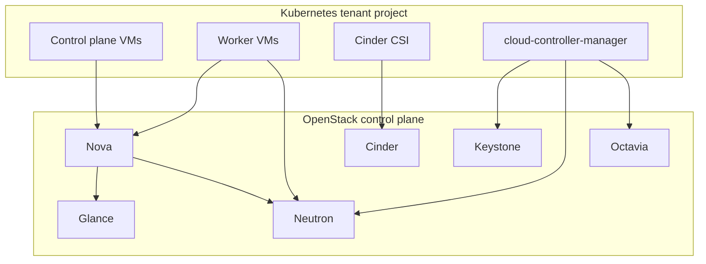
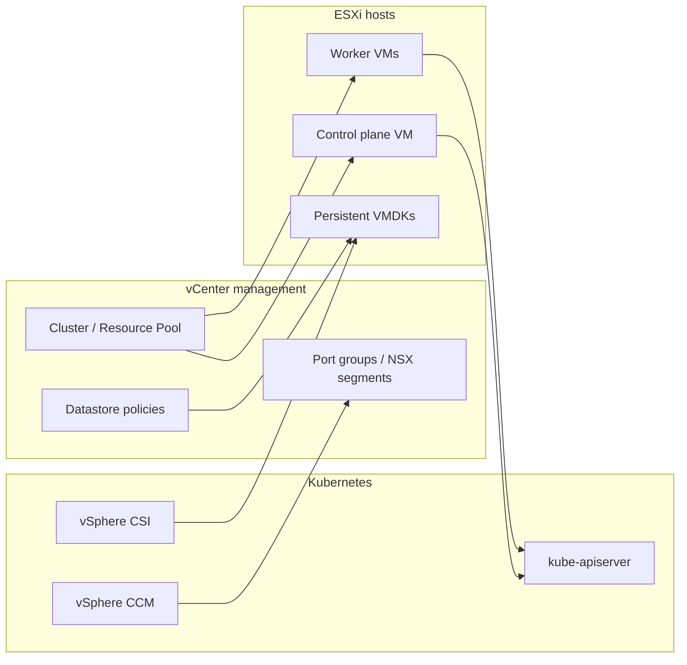
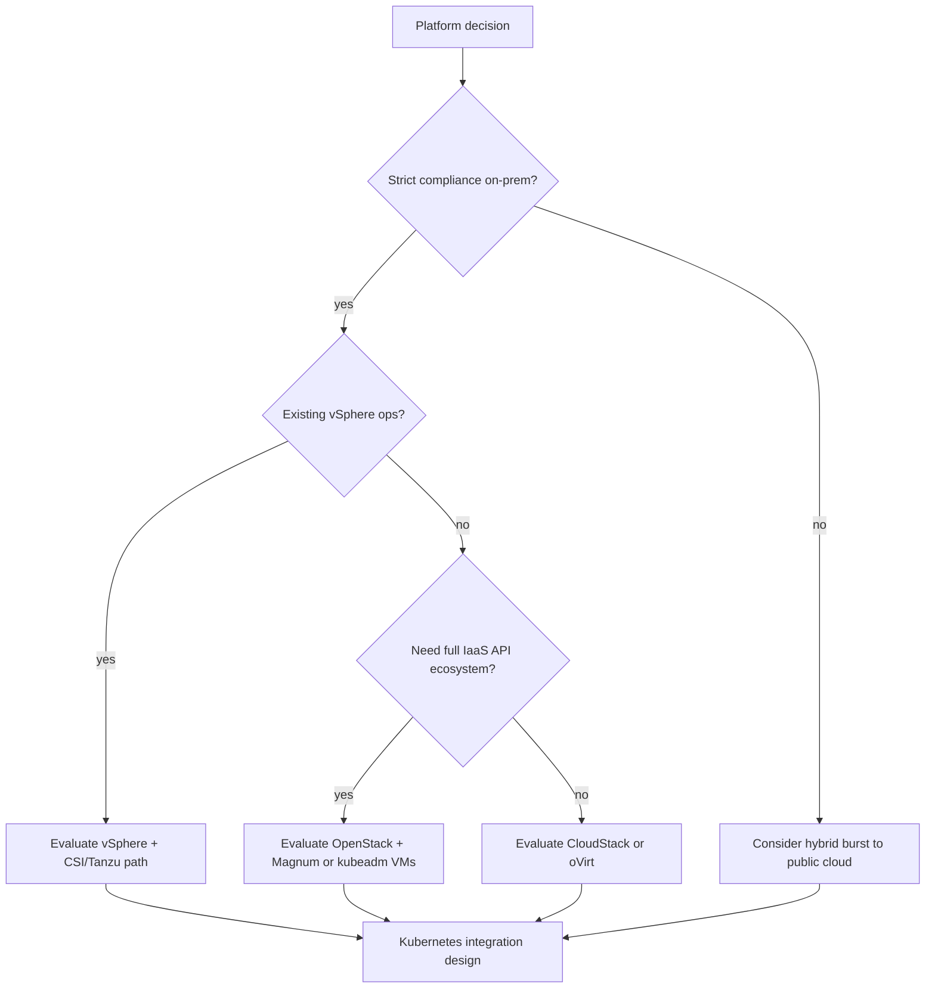

> **On-Premises Multi-Cluster** | Complexity: `[MEDIUM]` | Time: 45-55 min | Covers OpenStack, VMware, CloudStack, oVirt, Kubernetes integration, and operational dependencies for private cloud platforms.

## Prerequisites

Before starting this module, you should understand why organizations run Kubernetes on premises and how bare-metal provisioning differs from cloud APIs.
- **Required**: [Module 1.1: The Case for On-Premises](../../planning/module-1.1-case-for-on-prem/)
- **Required**: [Module 2.4: Declarative Bare Metal](../../provisioning/module-2.4-declarative-bare-metal/)
- **Helpful**: Basic familiarity with hypervisors, VLANs, and `kubectl` cluster administration

## Learning Outcomes

After completing this module, you will be able to connect private cloud control planes to the Kubernetes lifecycle decisions your platform team makes every week.
- **Map** OpenStack services including Nova, Neutron, Keystone, Glance, Cinder, and Swift to the infrastructure contracts Kubernetes expects on private cloud.
- **Compare** VMware vSphere, Apache CloudStack, and oVirt across lifecycle, networking, storage, identity, and multi-tenancy axes that determine operational cost.
- **Design** Kubernetes node pools on private cloud virtual machines using kubeadm, Ansible automation, and CSI drivers for Cinder or vSphere datastores.
- **Evaluate** when an on-premises private cloud platform delivers better economics, compliance posture, or latency than a public hyperscaler for regulated workloads.
- **Integrate** IPAM, DHCP, DNS, Octavia, and NSX-T load balancing into a cluster design so Service and Ingress objects resolve reliably on your network.

## Why This Module Matters: Abstraction Without Losing the Metal

Hypothetical scenario: a regional healthcare provider runs three production Kubernetes clusters on bare metal because leadership wanted to avoid virtualization licensing. During a firmware campaign, engineers drain nodes manually, reschedule pods by hand, and still miss maintenance windows because storage rebuilds take days. When a storage shelf fails, recovery depends on spare parts lead times and tribal knowledge about partition layouts rather than API calls. The platform team spends most of its calendar on hardware toil instead of improving tenant onboarding, backup policies, or upgrade safety.

That pattern is common when teams treat private infrastructure as “just Linux on servers” without a cloud control plane. A private cloud platform introduces a stable API for virtual machines, networks, volumes, images, and identity. The hypervisor or equivalent layer handles live migration, snapshot rollback, and hardware fault isolation while Kubernetes continues to schedule pods against node objects that look familiar. The tradeoff is real: you inherit another distributed system with its own upgrades, quotas, and failure domains, and you must staff engineers who understand both the cloud API and the cluster API. Platform engineering maturity therefore includes fluency in two parallel control planes, not only kubectl expertise. Treat private IaaS literacy as a core hiring requirement alongside cluster administration certifications and on-call shadowing.

This module teaches the architectural vocabulary you need before choosing VMware, OpenStack, CloudStack, or oVirt as the layer beneath your clusters. You will not memorize every project name in the OpenStack map; instead you will learn which service owns compute, networking, storage, and authentication so integration decisions make sense. You will also see how Kubernetes lands on private cloud through two common patterns: virtual machines plus kubeadm or Ansible, and vendor container platforms such as Tanzu or OpenShift that embed Kubernetes lifecycle into the virtualization stack. Hands-on steps assume a Kubernetes 1.35 cluster and use the full `kubectl` command name in shell examples for clarity.

## OpenStack Architecture and Core Services

OpenStack is a collection of cooperating services that present a cloud-style API on top of your data center. Operators usually deploy it with a distribution or reference architecture, then tenants consume Nova for compute, Neutron for software-defined networking, Keystone for authentication, Glance for machine images, Cinder for block storage, and Swift for object storage. Magnum and other add-ons can provision Kubernetes, but many platform teams still prefer kubeadm on Nova instances because it keeps the cluster lifecycle in Kubernetes-native tooling they already operate.

Keystone sits at the center of every API call because it issues tokens, maps users to projects, and enforces service catalogs. When the Kubernetes cloud provider for OpenStack creates a LoadBalancer Service, it authenticates against Keystone, discovers the endpoint for Octavia or the legacy LBaaS integration, and acts within the project quota you configured. Misconfigured Keystone endpoints are a frequent root cause of cloud-controller loops that never attach floating IPs or security groups, so treat identity availability as part of cluster readiness rather than a side quest for the IAM team.

Nova schedules virtual machine instances onto hypervisors, typically KVM on Linux hosts, and exposes flavors that describe vCPU, RAM, and ephemeral disk profiles. For Kubernetes worker nodes, flavors should mirror the pod density you plan: undersized flavors create noisy neighbors on the hypervisor, while oversized flavors waste capacity if the kubelet cannot pack pods efficiently. Nova also interacts with scheduling filters and aggregates when you segregate GPU hosts, storage-heavy hosts, or compliance-tainted zones, which is how you express “these nodes may run PHI workloads” without hard-coding hostnames in Kubernetes labels.

Neutron provides networks, subnets, routers, security groups, and advanced overlays such as VLAN, VXLAN, or Geneve depending on your ML2 plugin configuration. Kubernetes nodes need stable L2 or L3 connectivity to the control plane, to your container registry, and to corporate DNS resolvers. Many on-premises designs place node NICs on tenant networks while keeping the Kubernetes API on a management network with stricter ACLs. The cloud provider can wire Service type LoadBalancer to Neutron ports, but only if address pools, provider networks, and security group rules were designed together with the cluster CIDR plan rather than added after go-live.

Glance stores bootable images that Nova consumes during instance creation. Platform teams often maintain golden images with hardened SSH settings, auditing agents, and preinstalled container runtime packages so kubeadm or Ansible runs finish quickly. Swift offers durable object storage for backups, Helm chart mirrors, or log archives when you do not want those objects on POSIX volumes. Cinder provides persistent block volumes that map cleanly to Kubernetes PersistentVolumeClaims when you install the Cinder CSI driver and storage classes with the right availability zone hints.

Magnum clusters illustrate the alternative Kubernetes-on-OpenStack path where a COE template provisions masters and minions as Nova instances with Neutron networks already wired. Magnum suits teams that want OpenStack-native lifecycle APIs, but you must track Magnum and Kubernetes version matrices (and whether your deployment uses the Heat- or CAPI-based driver—the legacy Heat driver is deprecated in favor of Cluster API drivers). When Magnum lags behind upstream Kubernetes, platform teams fall back to kubeadm on self-managed networks while still using Cinder and Octavia through the cloud provider, which is why this module emphasizes service ownership over any single installer.



Security groups act as stateful firewalls around instance ports; node security groups must allow kubelet and CNI tunnel traffic between members (and etcd peer/client traffic on control-plane nodes) while denying arbitrary clients to kubelet 10250. Document required rules in Git beside cluster templates so auditors can diff rule changes during penetration test remediations instead of discovering ad hoc holes opened during late-night incidents.

Operational teams should also plan upgrades across the OpenStack control plane independently from Kubernetes minor version bumps. A broken Neutron agent rolling upgrade can strand new node joins while existing workloads keep running, which looks like a Kubernetes failure even though the kubelet is healthy. Document dependency order: Keystone and Galera or PostgreSQL backing stores first, then API services, then hypervisor agents, then Kubernetes cloud provider credentials rotation.

Placement and Nova scheduling share responsibility for where instances land when you enable resource providers for PCI passthrough, NVMe tiers, or CPU pinning. Kubernetes workloads that request isolated cores may need Nova flavors with extra specs and matching host aggregates, otherwise the scheduler places VMs on hosts that cannot satisfy pod guarantees after kubelet admission. Heat and Terraform templates often wrap Nova, Neutron, and Cinder calls so platform engineers treat cluster infrastructure as versioned code; keep template repositories beside Kubernetes GitOps repos so reviewers see networking and compute changes in one pull request.

Horizon dashboards help operators who prefer GUIs, but production Kubernetes teams still automate with the OpenStack CLI or Gophercloud clients embedded in Cluster API providers. Audit logs from Keystone and the messaging bus underpin compliance evidence when regulators ask who created a floating IP or detached a volume. Retain those logs with the same retention policy you apply to Kubernetes audit logs, because investigations span both APIs when an attacker pivots from a compromised cloud account into etcd backups stored on Swift.

Swift ring architecture matters when you offload etcd snapshots, Velero backups, or Helm chart mirrors to object storage instead of POSIX mounts. Erasure coding and region placement affect restore time objectives more than Kubernetes backup operators expect, especially when cross-region replication was never tested. Cinder backends range from Ceph RBD to NetApp drivers; each combination exposes different snapshot semantics that CSI must translate into Kubernetes VolumeSnapshot objects without surprising application owners during rollback drills.

## VMware vSphere Foundations for Kubernetes

VMware vSphere remains the default enterprise hypervisor in many data centers because it couples mature lifecycle tooling with ecosystem integrations for backup, replication, and storage arrays. vCenter Server centralizes inventory, permissions, clusters, resource pools, and distributed switches, while ESXi hosts run the actual virtual machines. For Kubernetes, the important primitives are datastore-backed virtual disks, port groups or NSX segments, content libraries for templates, and vSphere zones when you stretch clusters across failure domains.

vSphere storage policies express redundancy and performance expectations that downstream CSI drivers surface as StorageClasses. The vSphere CSI driver provisions persistent volumes by creating VMDKs on datastores you expose to the cluster, and it respects policy tags when teams standardize on vSAN or fiber channel LUNs. Snapshot and clone workflows matter for backup operators who integrate Velero or vendor appliances, because inconsistent snapshot quiescing still ruins restore drills even when Kubernetes etcd backups are perfect.

Networking on vSphere historically meant distributed virtual switches and VLAN-backed port groups, while modern deployments adopt NSX-T for overlay networking, micro-segmentation, and load balancing as a service. Kubernetes Ingress controllers or Service type LoadBalancer integrations can target NSX-T load balancers when the cloud provider or supervisor cluster publishes virtual IPs on the correct tier-1 gateway. DNS records for those VIPs must be automated through your IPAM toolchain, otherwise developers file tickets for “random IPs” that change every redeploy.

NSX-T segments can align with Kubernetes namespace boundaries when security policy mandates default-deny east-west traffic. Implementing that alignment requires coordination between NSX security groups and NetworkPolicy objects so neither side contradicts the other during incidents. Start with observability namespaces and progressively tighten rules after you verify logging and DNS still flow through approved proxies.

Tanzu Kubernetes Grid and vSphere with Tanzu represent the container-native path: Kubernetes control planes run as VMs or supervisor pods depending on edition, and lifecycle management shifts into VMware tooling rather than raw kubeadm scripts. That reduces toil when your organization already standardized on vSphere operations, but it also ties upgrade windows to VMware compatibility matrices and licensing bundles that changed materially after the Broadcom acquisition. Teams that only need Kubernetes without the full Tanzu portfolio often provision Ubuntu or RHEL VMs with Terraform and kubeadm, then integrate the vSphere cloud provider and CSI driver manually for a smaller blast radius.



Capacity planning on vSphere still begins with physical cores and memory, but effective scheduling also tracks vCPU oversubscription ratios, ballooning, and storage latency on shared arrays. Kubernetes requests and limits do not replace hypervisor-level reservations when multiple clusters share the same vSphere cluster. Treat noisy neighbor incidents as a two-layer problem: cgroup throttling inside the guest and resource pool shares outside the guest.

Distributed Resource Scheduler and High Availability clusters change maintenance stories for Kubernetes nodes because vMotion can evacuate VMs before ESXi enters maintenance mode if admission control and resource headroom allow. Platform runbooks should state whether kubelet drains are mandatory before vMotion or whether automated migration is trusted for worker pools only. Control plane etcd members need stricter rules than stateless workers because storage latency spikes during uncoordinated moves can trigger leader election storms.

Content libraries distribute OVF templates for worker nodes with cloud-init scripts that register instances to Ansible inventory groups. Tagging VMs with cluster name, role, and environment gives finance chargeback reports that map Kubernetes node labels back to cost centers. vSphere with Tanzu supervisor clusters add another ownership boundary: platform teams manage supervisors while application teams receive namespaces, yet underlying VI admins still control datastore capacity and distributed switch MTU settings that break pods when misconfigured.

## CloudStack, oVirt, and Alternative Private Cloud Stacks

Apache CloudStack targets organizations that want an Apache-licensed cloud management plane with a smaller service surface than full OpenStack. It presents zones, pods, clusters, primary storage, secondary storage, and system VMs that implement routing and console proxy functions. Kubernetes integration typically means launching instances through CloudStack’s compute service and attaching volumes through its disk offerings, then installing the CloudStack CSI driver (csi.cloudstack.apache.org); in-tree cloud providers are removed in modern Kubernetes.

CloudStack networking models include basic zones with flat networking and advanced zones with VLAN-isolated guest networks and virtual routers. The choice affects how you carve Service CIDRs and whether pod networks can reach corporate RFC1918 space without NAT hairpins. Because CloudStack clusters often serve managed service providers, quota and account isolation features map naturally to tenant namespaces in Kubernetes when you align project IDs with cloud accounts.

oVirt is the upstream community KVM-management project; Red Hat Virtualization (RHV) was its downstream commercial distribution (now reaching end-of-life), with OpenShift Virtualization as the successor for RHV workloads. oVirt centers on datacenters, clusters, hosts, storage domains, and logical networks managed through the Engine API. Kubernetes nodes run as oVirt VMs with disks on NFS, iSCSI, or Fibre Channel domains depending on performance needs.

Harvester and other hyperconverged platforms blur the line between virtualization and Kubernetes by shipping both layers together. This module mentions them because decision makers compare them against vSphere and OpenStack, yet the integration patterns for Kubernetes still reduce to reliable VM networking, persistent disks, and a cloud provider that understands the platform API. Evaluate these alternatives when your team size cannot operate a dozen OpenStack projects but you still need multi-tenant VM APIs better than manual vCenter clicks.

When comparing CloudStack and oVirt to OpenStack, measure operator headcount and upgrade risk alongside feature checklists. OpenStack offers finer-grained extension points and a vast ecosystem, while CloudStack and oVirt optimize for faster time to a working private IaaS at the cost of narrower third-party integrations. None of these choices remove the need for disciplined IPAM and DNS; they only change which GUI or API issues your addresses.

oVirt hosted engine deployments place the management VM itself on the cluster being managed, which simplifies small footprints but concentrates risk during storage outages. Plan backup of the engine database and understand how Kubernetes node VMs depend on logical networks defined in the engine, because a mistaken network label change can isolate every kubelet simultaneously. CloudStack administrators should monitor system VM disk growth; neglected console proxy volumes have filled clusters that otherwise had ample tenant capacity.

## Comparing Private Cloud Platforms Across Key Axes

Platform selection should be a structured comparison rather than a vendor slide deck impression. Lifecycle covers how you patch hypervisors, rotate certificates, expand clusters, and roll back failed upgrades without orphaning Kubernetes nodes. Networking spans tenant isolation, load balancer integration, MTU consistency end to end, and whether pod CNI overlays conflict with the underlay MTU on Geneve or VXLAN tunnels. Storage examines block performance, snapshot consistency, encryption at rest, and whether CSI drivers are supported by your Kubernetes version. Identity asks how cloud accounts map to corporate SSO groups and whether service accounts for cloud controllers can be short-lived. Multi-tenancy evaluates quotas, noisy neighbor controls, and chargeback data for finance stakeholders.

| Axis | OpenStack | VMware vSphere | CloudStack | oVirt |
|------|-----------|----------------|------------|-------|
| Lifecycle | Distinct service upgrades; high automation potential | Mature vCenter workflows; Tanzu adds K8s lifecycle | Zone/pod/cluster upgrades; smaller surface | Engine upgrades; KVM-focused |
| Networking | Neutron overlays, provider VLANs, Octavia LB | DVSwitch/VLAN; NSX-T for LB and segmentation | Guest networks via VR; VLAN pods | Logical networks on KVM bridges |
| Storage | Cinder + Swift; broad backend drivers | vSAN/VMDK policies via CSI | Primary/secondary storage tiers | Storage domains on shared LUN/NFS |
| Identity | Keystone domains/projects | SSO + vCenter RBAC | Accounts/domains | Engine users/groups |
| Multi-tenancy | Projects/quotas per tenant | Resource pools/folders | Accounts/isolation | Datacenters/clusters |

Use the table as a scorecard workshop, not a winner-takes-all ranking. A hospital may accept VMware licensing because backup teams already certified vSphere snapshots, while a telecom lab may prefer OpenStack because Neutron plugins integrate with their existing MPLS tooling. Kubernetes homogenizes the application layer, but it does not homogenize the operational skills you must hire.



Document non-functional requirements beside the scorecard: RPO and RTO for etcd, maximum concurrent node drains, supported Kubernetes versions, and whether GPU or SR-IOV passthrough is mandatory. Those constraints eliminate options faster than philosophical debates about open source purity.

Lifecycle comparisons should include certificate rotation cadence: Keystone Fernet keys, vCenter machine SSL, and Kubernetes apiserver certificates all expire on different clocks. Missing one rotation window surfaces as mysterious cloud provider auth failures or kubectl TLS errors during otherwise routine maintenance. Build a unified calendar with owners per layer so platform on-call is not surprised by a Sunday Keystone rotation that invalidates cloud.conf secrets mounted in kube-system.

## When Private Cloud Beats Hyperscaler Economics and Control

Public hyperscalers excel at elastic consumption, global backbone capacity, and managed control planes that shrink day-one staffing needs. Private cloud platforms win different races. Regulated industries often require data locality, air-gapped recovery, or contractual prohibitions on specific foreign regions, and owning the stack makes audit evidence chain to internal change tickets instead of vendor attestations alone. Steady-state workloads with predictable CPU and RAM footprints can cost less on owned hardware after three to five year depreciation cycles, especially when egress charges would dominate a SaaS architecture.

Latency-sensitive systems such as factory floor aggregators, trading adjacent analytics, or clinical imaging pipelines benefit when VMs and Kubernetes nodes sit on the same campus network as sensors and PACS archives. A hyperscaler region hundreds of milliseconds away cannot match that topology without expensive dedicated links. Private cloud also helps when you must integrate with legacy VLAN services, hardware security modules, or mainframe-era messaging buses that will never receive public endpoints.

The counterarguments matter too. Private cloud shifts capex and facilities burden onto your balance sheet, and understaffed platforms become fragile regardless of software choice. If your organization cannot maintain spare hardware, monitor power and cooling, and practice restore drills, managed Kubernetes in a public cloud may still be safer. Hybrid models use private cloud for stable cores and burst to public cloud for seasonal demand, provided ingress and identity federation are designed upfront rather than bolted on after an audit finding.

Cost models should include labor: virtualization administrators, storage engineers, network architects, and the Kubernetes platform team. Licensing for vSphere, Red Hat subscriptions, or commercial OpenStack distributions can exceed hardware when sockets are counted aggressively. Open source stacks reduce license line items but rarely eliminate expert headcount. Compare total cost per usable gibibyte of persistent storage and per vCPU month, not only per socket license quote.

Sovereignty and export-control narratives often push regulated tenants toward private cloud even when hyperscaler regions exist in-country, because contractual language still forbids foreign legal discovery paths or requires keys to remain in customer-controlled HSMs. Document which party operates hypervisor patches, disk destruction, and forensic imaging when a laptop theft occurs in a satellite office. Those answers belong in the architecture decision record beside Kubernetes RBAC diagrams.

Burst capacity to public cloud remains compatible with private cloud cores when you standardize identity, container images, and GitOps repositories across both. The expensive mistakes appear when private DNS zones, private container registries, and private load balancers cannot be reached from burst environments without re-architecting CIDR plans. Plan egress NAT, firewall approvals, and secrets replication before marketing announces hybrid agility.

## Kubernetes on Private Cloud Virtual Machines

The most portable pattern provisions Linux VMs on your private cloud, then bootstraps Kubernetes with kubeadm, k3s, or a distribution such as RKE2 depending on compliance needs. Ansible playbooks or Terraform plus cloud-init glue together image selection, network attachment, disk layout, and join tokens. This keeps cluster customization in Git repositories your platform team already reviews, and it avoids locking lifecycle to a single vendor console unless you consciously choose Tanzu or OpenShift.

Ansible inventories should tag hosts with `k8s_role`, `cluster_name`, and `openstack_availability_zone` or `vsphere_cluster` so playbooks attach volumes and security groups consistently. Idempotent tasks for containerd configuration, kernel modules, and swap disabling prevent drift between the first control plane and late-joining workers added during scale events. Store group variables beside Helm values so reviewers see both OS baseline and cluster add-ons in one change request.

Container-native distributions on VMware or OpenShift on oVirt/RHV invert the emphasis: the vendor pipeline certifies Kubernetes versions against a narrow matrix of hypervisor builds. You gain guided upgrades and opinionated networking integrations at the expense of flexibility when you need bleeding-edge CSI features or custom admission webhooks on day one. Many enterprises run hybrid operations: management clusters on Tanzu or OpenShift while tenant clusters stay kubeadm on OpenStack for cost-sensitive divisions.

Cluster API can treat private cloud VMs as machines when providers exist for your environment, aligning node lifecycle with GitOps the same way CAPM3 does for bare metal. Whether you use Cluster API or Ansible, standardize hostnames, NTP, container runtime versions, and kubelet cgroup driver settings before the first production workload lands. The cloud provider component registers nodes with provider IDs, sets routes if needed, and reconciles load balancers; without it, Services stay `<pending>` despite healthy pods.

Worker scaling should respect cloud quotas and IP address consumption. Autoscaler integrations need Nova or vSphere APIs that can create instances faster than pods accumulate, and they need pre-baked images to avoid thirty-minute apt installs during incidents. Store join tokens and bootstrap secrets in vaults with rotation policies; baking long-lived tokens into golden images has caused full-cluster compromises when an image leaked to a less trusted project.

Red Hat OpenShift on RHV or oVirt inherits similar VM dependencies while adding Operator lifecycle for cluster components. VMware Tanzu Kubernetes Grid clusters provision through Tanzu Mission Control Self-Managed (TMC-SM) or standalone management clusters depending on edition—the Tanzu Mission Control SaaS offering reached end-of-life on 2025-11-15, with Broadcom directing customers to TMC-SM—yet both paths still require compatible vSphere versions and NSX configurations documented in VMware interoperability matrices. Choose container-native paths when your organization values vendor-supported upgrade highways; choose kubeadm on Nova or vSphere VMs when you need maximum customization and already employ Ansible expertise.

The Kubernetes cloud provider documentation describes how provider IDs, routes, and load balancers reconcile per platform. On OpenStack, install the external cloud-controller-manager chart with correct `cloud.conf` secrets referencing Keystone application credentials scoped to the tenant project. On vSphere, enable the CPI and CSI with paravirtual or full feature sets matching your vCenter permissions model. Skipping either leaves LoadBalancer Services `<pending>` and provider IDs unset, which wastes days of CNI debugging.

## IPAM, DHCP, and DNS Dependencies

Private Kubernetes clusters fail in boring ways when address management is tribal knowledge. IPAM defines which CIDRs belong to nodes, pods, services, load balancers, and management appliances, and it must coordinate with corporate routers that may not accept arbitrary BGP advertisements from your CNI. DHCP pools for Nova or vSphere port groups should exclude addresses you statically assign to control plane members, etcd hosts, or registry mirrors. Duplicate assignments produce split-brain symptoms that look like Kubernetes networking bugs but are simply Layer 3 collisions.

DNS underpins nearly every join and pull operation. Nodes must resolve the Kubernetes API DNS name or VIP, container registries, OIDC issuers, and external webhooks. Forward and reverse records should be automated when load balancers or Octavia listeners change IPs, otherwise TLS validations fail mid-upgrade. Run conditional forwarding for cluster.local only inside the cluster; do not poison enterprise resolvers with unpublished zones.

DHCP options can inject NTP and DNS server lists for guest VMs, yet Kubernetes pod DNS still flows through CoreDNS unless you run hostNetwork pods. Document which resolvers upstream clusters use during disaster recovery when you restore etcd to a DR site with different resolver views. Time skew breaks TLS and service account token validation, so treat NTP as part of cluster networking readiness alongside MTU checks.

Design reviews should include a single diagram of CIDRs, VLAN IDs, VRFs, and firewall zones with arrows showing kube-apiserver, kubelet, registry, and worker-to-control-plane paths. Reviewers from networking teams catch impossible routes early when the diagram exists; without it, platform engineers argue about CNI choices while the real blocker is a missing static route.

Corporate IPAM tools such as NetBox or commercial equivalents should become the system of record for Kubernetes Service CIDRs, pod CIDRs, NodePort ranges, and LoadBalancer VIP pools. Automate allocation through CI pipelines that reject overlapping prefixes before Terraform applies Nova network creation. DHCP reservations for control plane members should reference the same IPAM object IDs so decommissioning a cluster frees addresses instead of leaking orphaned leases that block the next deployment.

## CSI Storage and Load Balancer Integration

Persistent workloads need CSI drivers that understand your private cloud’s block storage API. The Cinder CSI controller creates volumes from storage classes that name availability zones, volume types, and encryption settings compatible with your Ceph, NetApp, or SAN backends. The vSphere CSI driver binds PersistentVolumeClaims to VMDKs and honors datastore policies for replication factors. Install CSI snapshot classes when backup products expect volume snapshots consistent with application quiescing hooks.

Storage performance troubleshooting spans both layers: kubelet volume mount errors may indicate Cinder quota exhaustion while application latency may trace to array contention on the SAN. Monitor attach/detach storms during rolling updates when StatefulSets recycle many pods simultaneously. Set allowedTopologies on StorageClasses so zonal pods land where data already lives, especially on OpenStack cells or vSphere clusters stretched across sites.

Load balancers connect Kubernetes Services to clients outside the pod network. OpenStack Octavia implements LBaaS listeners backed by amphorae VMs or containers depending on driver configuration, and the cloud provider allocates VIPs from provider address pools you must size for peak Service count. VMware NSX-T load balancing offers similar VIP programming with health checks that track NodePort endpoints or container endpoints when integrated through supervisor or cloud provider paths.

Ingress controllers remain necessary for HTTP routing even when LoadBalancer Services exist, because north-south TLS termination, WAF integration, and path-based routing rarely belong inside the cloud LB alone. Coordinate ports: NodePort ranges, hostNetwork ingress daemons, and provider LB health check protocols must align with security team allow lists. Document whether floating IPs are drawn from public or internal pools so firewall teams write correct rules before go-live.

The CNCF landscape lists CSI drivers and backup tools certified for various platforms; use it to shortlist supported combinations before committing to a storage vendor. Cinder CSI Helm charts parameterize secret names, topology keys, and attachment timeouts that must match your OpenStack release. vSphere CSI requires vCenter roles with least privilege on datastore folders and tag categories; overly broad administrator accounts violate segregation of duties audits.

Octavia health monitors should probe NodePort or pod IP targets consistently with kube-proxy mode and whether you run externalTrafficPolicy Local for source IP preservation. NSX-T health checks face similar choices when ingress controllers terminate TLS on nodes while the load balancer forwards encrypted or plain traffic. Misaligned health checks mark all backends down, triggering cascading failures when operators restart ingress pods during upgrades.

Multitenancy on private cloud maps Kubernetes namespaces to OpenStack projects or vSphere folders with quota objects that cap RAM, instances, and volumes. Chargeback exports from cloud billing databases should include labels applied during VM provisioning so finance can attribute November growth to a specific product line. Without chargeback, private cloud costs look opaque and leadership reopens hyperscaler evaluations based on sticker prices alone.

## Operational Realities: Capacity Planning and Hardware Sourcing

Private cloud platforms do not remove physics; they hide it behind APIs until supply chain delays expose the illusion. Capacity planning tracks CPU sockets, RAM, storage IOPS, and network oversubscription per rack, then maps growth forecasts to purchase orders with lead times measured in quarters not minutes. Maintain spare nodes or empty hypervisor capacity for rolling firmware, because filling clusters to ninety-five percent utilization guarantees that Kubernetes cordon and drain operations cannot place evacuated pods.

Hardware sourcing intersects with vendor support matrices: NIC firmware versions validated for NSX, disk models certified for vSAN, and SSD endurance ratings for Ceph journals. Standardize SKUs where possible so Ansible templates and OpenStack flavors stay stable. Heterogeneous racks complicate scheduling aggregates and confuse autoscalers that assume uniform instance types.

Monitoring should span hypervisor health, storage array latency, switch buffer drops, and Kubernetes control plane metrics in one on-call rotation playbook. Incidents often cascade: a storage latency spike causes etcd fsync warnings, which trigger apiserver timeouts, which convince Horizontal Pod Autoscaler to scale apps that cannot schedule because Nova has no free RAM. Run game days that fail a top-of-rack switch or a Cinder backend to verify backups and traffic failover paths before executives ask for proof.

Expose OpenStack and vSphere metrics into the same Prometheus stack that scrapes kube-state-metrics so Grafana dashboards correlate rising `etcd_disk_backend_commit_duration_seconds` with Cinder latency or vSAN congestion. Alert on Nova `COMPUTE_FULL` style conditions and vSphere cluster DRS imbalance before Kubernetes schedulers start failing pod creation with opaque `0/N nodes available` messages that frustrate application teams.

Finally, align procurement with software roadmaps. Buying servers optimized for GPU inference while your private cloud standardizes on general-purpose two-socket hosts wastes budget; conversely, starving control plane nodes of RAM to save cost creates brittle etcd clusters that never survive a noisy neighbor VM migration. Treat private cloud as a product with a roadmap, not a one-time install.

Facilities teams belong in cluster design reviews because power density per rack limits how many GPU or storage-heavy nodes you can add without cooling upgrades. Track mean time to obtain replacement NICs, drives, and entire servers in the same spreadsheet you use for Kubernetes version skew. When lead times exceed etcd recovery point objectives, invest in warm spare hardware or stretch clusters across halls with independent power feeds.

Runbooks should list which private cloud API degrades when a top-of-rack switch fails: Nova may still schedule while Neutron provider networks cannot attach, or vCenter may stay up while a single vSAN fault domain loses quorum. Kubernetes symptoms during those events include DaemonSets that cannot mount volumes and Jobs that cannot pull images from registries on isolated VLANs. Training on-call engineers to traverse the stack top-down prevents misdiagnosing application bugs when the underlay is partial.

Governance workshops produce better outcomes when application owners see a single slide connecting their namespace quotas to underlying cloud quotas and physical capacity. Transparency converts “Kubernetes is broken” tickets into capacity conversations early. Publish a quarterly platform newsletter with upgrade windows for OpenStack, vSphere, and Kubernetes so product teams plan releases around maintenance rather than surprise freeze requests from infra.

## Did You Know?

- **OpenStack began as NASA Nebula and Rackspace collaboration in 2010** - The modular service design you see in Keystone and Nova reflects that federated origin rather than a single monolithic hypervisor.
- **Octavia replaced Neutron LBaaS v1 with a dedicated load-balancer service** - Modern OpenStack Kubernetes integrations should target Octavia drivers instead of deprecated appliance models.
- **The vSphere CSI driver superseded in-tree vSphere volume plugins** - Clusters on Kubernetes 1.35 rely on CSI for persistent disks and snapshot APIs that in-tree code no longer implements.
- **CloudStack system VMs provide routing and console access** - Those hidden VMs consume cluster capacity and must be patched during maintenance windows just like tenant workloads.

## Common Mistakes

| Mistake | Why It Happens | How to Fix It |
|---------|----------------|---------------|
| Deploying Kubernetes before IPAM and DNS plans exist | Teams rush to a working `kubectl` moment | Publish CIDR, VLAN, and DNS diagrams; automate records for API and LoadBalancer VIPs |
| Using undersized OpenStack flavors for etcd nodes | Cost saving copied from stateless apps | Give control plane VMs fast disks, low latency networks, and reserved RAM |
| Skipping cloud provider or CSI installation | Belief that Kubernetes “just runs on VMs” | Install cloud-controller-manager and Cinder or vSphere CSI before production Services |
| Treating private cloud like unlimited hyperscaler capacity | No quota visibility in finance reviews | Enforce Nova and vSphere quotas; tie namespaces to cloud projects |
| Ignoring MTU mismatch on overlay networks | Default 1500 everywhere | Set consistent MTU on Neutron, CNI tunnel, and physical switches |
| One giant vSphere cluster for every environment | Simplicity without blast radius control | Separate management, production, and sandbox clusters with resource pools |
| Neglecting Octavia or NSX-T address pool sizing | Small pools work in labs | Size VIP pools for peak Services plus headroom; monitor allocation metrics |
| Manual hardware tracking spreadsheets | Procurement outside platform team | Integrate asset tags with OpenStack host aggregates or vSphere folders |

## Quiz

<details><summary>Question 1: A LoadBalancer Service stays pending on OpenStack while pods are Ready. Keystone logs show successful authentication. What component should you investigate next, and why?</summary>

Investigate Neutron and Octavia next because the cloud-controller-manager must create ports and listeners after Keystone issues a token. Authentication alone does not allocate VIPs or attach security groups. Check provider network connectivity, Octavia amphora health, and quota for load balancers and floating IPs. Pending Services with healthy pods usually indicate reconciliation failure in the networking or LBaaS path rather than kube-proxy.

</details>

<details><summary>Question 2: Why do platform teams still provision Kubernetes with kubeadm on Nova instances instead of only using Magnum?</summary>

kubeadm keeps cluster lifecycle in Kubernetes-native tooling, GitOps repos, and existing upgrade playbooks the team already operates. Magnum couples cluster versions to OpenStack release cadence and operator expertise some organizations lack. kubeadm on VMs also simplifies mixed environments where the same automation targets vSphere and OpenStack with different cloud providers but identical bootstrap steps.

</details>

<details><summary>Question 3: A StatefulSet on vSphere reports volume attachment timeouts. Storage policy on the datastore is correct. What cross-layer cause should you check?</summary>

Check vSphere CSI driver health, CNS permissions, and whether allowedTopologies match the node’s zone labels. Also verify datastore latency and SCSI reservation conflicts on the array because Kubernetes events may only show attach retries while the hypervisor or SAN rejects operations. Attachment timeouts often involve provider-side quota or zoning rather than application bugs.

</details>

<details><summary>Question 4: When does private cloud typically beat hyperscaler economics for Kubernetes workloads?</summary>

Private cloud wins for steady, predictable capacity where owned hardware amortizes over years and egress charges would dominate public designs. Regulated data locality and air-gapped requirements also favor on-premises stacks when public regions cannot satisfy policy. The answer is wrong if it ignores labor and facilities cost, because understaffed private clouds become expensive incident factories.

</details>

<details><summary>Question 5: Which OpenStack service owns machine images, and which schedules running VMs?</summary>

Glance owns images; Nova schedules running VMs. Confusing them leads to debugging boot failures in the wrong API. Cinder provides block volumes, Swift provides objects, and Keystone provides tokens. Kubernetes node provisioning depends on Glance images referenced by Nova flavors.

</details>

<details><summary>Question 6: Why must DHCP pools exclude Kubernetes control plane VIPs and registry addresses?</summary>

DHCP duplicates cause nodes to join the wrong API endpoint or pull from rogue mirrors. Static infrastructure addresses should sit outside dynamic pools and appear in IPAM documentation. DNS records must reference the same stable addresses or VIPs load balancers expose. Otherwise TLS and join token validation fail unpredictably.

</details>

<details><summary>Question 7: How do CloudStack advanced zones differ from basic zones for Kubernetes networking?</summary>

Advanced zones isolate guest networks with virtual routers and VLANs, while basic zones use simpler flat networking. Kubernetes clusters needing tenant isolation and corporate RFC1918 routing usually require advanced zone patterns. Basic zones suit labs but break when multiple teams need separate L3 domains and quotas.

</details>

## Hands-On Practical Exercises

**Objective**: Build intuition for private cloud APIs, networking dependencies, and Kubernetes bootstrap on virtual machines without requiring a production data center allocation.

**Environment**: A Linux workstation with 16 GiB RAM and nested virtualization enabled, or access to a lab OpenStack tenant. Exercise 3 requires either Vagrant with libvirt or a DevStack all-in-one VM.

### Exercise 1: Map OpenStack Services to Cluster Dependencies

Use the public OpenStack API quick start documentation to list endpoints for Keystone, Nova, Neutron, Glance, and Cinder in a lab cloud or DevStack deployment.

```bash
# After sourcing openrc for your project:
openstack endpoint list --interface public -c "Service Name" -c URL
openstack quota show "$(openstack project list -f value -c ID | head -1)"
openstack network list
openstack flavor list
```

- [ ] I documented which endpoint URL maps to identity, compute, networking, image, and block storage.
- [ ] I recorded project quotas for instances, cores, RAM, volumes, and load balancers.
- [ ] I identified at least one provider network or floating IP pool usable for Kubernetes nodes.

<details><summary>Expected analysis</summary>

Healthy labs show Keystone on port 5000, Nova on 8774, Neutron on 9696, Glance on 9292, and Cinder on 8776 with small URL variations per distribution. Quotas explain why large kubeadm clusters fail even when hypervisors have spare capacity. Network lists reveal whether you must request a provider network before booting nodes.

</details>

### Exercise 2: Validate DNS and IPAM Preconditions

Before installing Kubernetes, confirm resolvers and routes from a throwaway VM on the same network as future nodes.

```bash
# On a lab instance or Vagrant libvirt guest:
ip -br addr
ip route
resolvectl status 2>/dev/null || cat /etc/resolv.conf
ping -c 2 "$(grep nameserver /etc/resolv.conf | awk 'NR==1{print $2}')"
curl -sI https://docs.openstack.org/ | head -3
```

- [ ] I verified default gateway and MTU on the node NIC match the network design diagram.
- [ ] I confirmed DNS resolves an external name and the future Kubernetes API hostname you plan to use.
- [ ] I recorded CIDR overlap checks between pod, service, and corporate LAN ranges.

<details><summary>Expected analysis</summary>

Failures here predict kubelet join errors and ImagePullBackOff long before CSI or CNI misconfigurations appear. MTU mismatches on overlay networks show up as partial TLS handshakes or etcd timeouts. Document results in your runbook template.

</details>

### Exercise 3: Bootstrap a kubeadm Control Plane on a Private-Cloud VM

Provision one control plane VM with Vagrant libvirt or an OpenStack DevStack instance, then initialize Kubernetes 1.35.

**Prerequisite (Ubuntu 24.04 hosts):** On a fresh `generic/ubuntu2404` guest, disable swap, load `br_netfilter` with forwarding sysctl, and configure containerd for `SystemdCgroup = true` before `kubeadm init` ([kubeadm install checklist](https://kubernetes.io/docs/setup/production-environment/tools/kubeadm/install-kubeadm/)).

```bash
# Example Vagrantfile snippet (libvirt):
# Vagrant.configure("2") do |config|
#   config.vm.box = "generic/ubuntu2404"
#   config.vm.provider :libvirt do |v|
#     v.memory = 4096
#     v.cpus = 2
#   end
# end
# vagrant up && vagrant ssh

sudo swapoff -a && sudo sed -i '/ swap / s/^/#/' /etc/fstab
sudo modprobe br_netfilter
echo 'net.bridge.bridge-nf-call-iptables=1' | sudo tee -a /etc/sysctl.d/k8s.conf
echo 'net.ipv4.ip_forward=1' | sudo tee -a /etc/sysctl.d/k8s.conf
sudo sysctl --system

sudo apt-get update
sudo apt-get install -y apt-transport-https ca-certificates curl gnupg
sudo mkdir -p /etc/apt/keyrings
curl -fsSL https://pkgs.k8s.io/core:/stable:/v1.35/deb/Release.key | sudo gpg --dearmor -o /etc/apt/keyrings/kubernetes-apt-keyring.gpg
echo 'deb [signed-by=/etc/apt/keyrings/kubernetes-apt-keyring.gpg] https://pkgs.k8s.io/core:/stable:/v1.35/deb/ /' | sudo tee /etc/apt/sources.list.d/kubernetes.list
sudo apt-get update
sudo apt-get install -y containerd kubelet kubeadm kubectl
sudo mkdir -p /etc/containerd
containerd config default | sudo tee /etc/containerd/config.toml
sudo sed -i 's/SystemdCgroup = false/SystemdCgroup = true/' /etc/containerd/config.toml
sudo systemctl restart containerd
sudo kubeadm init --pod-network-cidr=10.244.0.0/16
mkdir -p "$HOME/.kube"
sudo cp -i /etc/kubernetes/admin.conf "$HOME/.kube/config"
sudo chown "$(id -u):$(id -g)" "$HOME/.kube/config"
kubectl get nodes
kubectl apply -f https://github.com/flannel-io/flannel/releases/latest/download/kube-flannel.yml
```

- [ ] I initialized a control plane VM on libvirt or OpenStack and joined nothing else yet.
- [ ] `kubectl get nodes` reports the control plane Ready after CNI installation.
- [ ] I captured `kubeadm token` rotation steps for future workers in my notes.

<details><summary>Expected analysis</summary>

A single-node control plane proves bootstrap automation, not production HA. DevStack or Vagrant labs omit Octavia and CSI, so treat LoadBalancer and PVC tests as follow-on work. The exercise still validates that private-cloud VM networking and DNS were correct before adding workers.

</details>

## Next Module

Continue to [Module 5.2: Multi-Cluster Control Planes](../module-5.2-multi-cluster-control-planes/) to compare vCluster, Kamaji, and dedicated control plane strategies once your private cloud foundation can supply reliable VMs, networks, and disks.

## Learner Check

> **Pause and predict**: your OpenStack cloud can boot instances quickly, yet Kubernetes Services of type LoadBalancer stay pending forever. Which two services would you inspect first, and what misconfiguration often explains the symptom? After Keystone auth, inspect **Neutron and Octavia**—the cloud controller must create ports and listeners on the correct provider network with available addresses from the load balancer subnet pool (Octavia owns the LB VIP/listener path).

## Sources

- <https://docs.openstack.org/api-quick-start/>
- <https://docs.openstack.org/install-guide/>
- <https://docs.openstack.org/neutron/latest/>
- <https://docs.openstack.org/keystone/latest/>
- <https://docs.vmware.com/en/VMware-vSphere/index.html>
- <https://docs.cloudstack.apache.org/>
- <https://www.ovirt.org/documentation/>
- <https://github.com/kubernetes/cloud-provider-openstack>
- <https://github.com/kubernetes-sigs/vsphere-csi-driver>
- <https://docs.openstack.org/octavia/latest/>
- <https://kubernetes.io/docs/concepts/architecture/cloud-controller/>
- <https://www.cncf.io/projects/>
