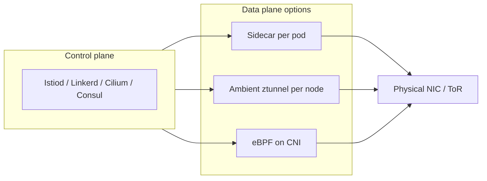
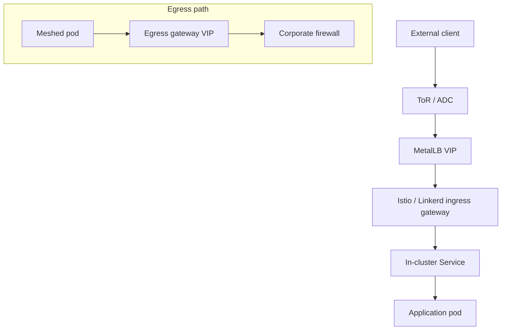
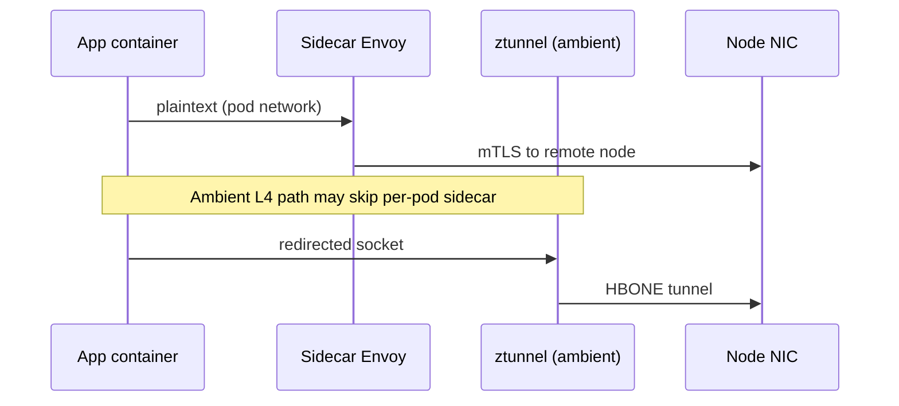

> **Complexity**: `[ADVANCED]` | Time: 90–120 minutes
>
> **Prerequisites**: [Module 3.3: Load Balancing Without Cloud](../module-3.3-load-balancing/), [Module 3.5: Cross-Cluster Networking](../module-3.5-cross-cluster-networking/)

---

## Learning Outcomes

After completing this module, you will be able to:

1. **Evaluate** sidecar, ambient (ztunnel + waypoint), and CNI-integrated service mesh datapaths for bare-metal latency, memory, and failure-domain tradeoffs.
2. **Configure** mesh ingress and egress on bare metal using MetalLB or NodePort, including `externalTrafficPolicy: Local` and ToR-aware VIP placement.
3. **Diagnose** mesh outages caused by clock drift, `nf_conntrack` exhaustion, certificate rotation skew, and observability cardinality on physical nodes.
4. **Design** multi-mesh footprints that combine Istio, Linkerd, Cilium Service Mesh, or Consul Connect without fighting kube-proxy IPVS versus eBPF datapaths.
5. **Implement** node-level `sysctl` tuning and safe maintenance workflows (`kubectl cordon`, `drain`, `uncordon`) under heavy sidecar connection churn.

---

## Why This Module Matters

Hypothetical scenario: a platform team completes a successful cloud migration playbook and replays it on a three-site bare-metal fleet running Kubernetes **1.35**. Application pods are healthy, Prometheus shows green, and GitOps syncs complete—but customer-facing APIs return intermittent `503` responses while internal `kubectl port-forward` tests still succeed. The post-incident timeline reveals three independent gaps: `LoadBalancer` Services for the Istio ingress gateway stayed `<pending>` because no bare-metal LB controller was installed; worker nodes silently dropped packets once `nf_conntrack` tables filled after Envoy sidecars doubled connection counts; and two racks lost NTP sync, causing strict mTLS handshakes to fail with `certificate is not yet valid` even though Istiod continued issuing certificates on schedule.

Cloud-managed Kubernetes hides those integration points behind provider load balancers, hypervisor clock sync, and pre-tuned connection-tracking defaults. On bare metal you own the full vertical stack: ToR routing to VIPs, kernel sysctl headroom, mesh certificate lifecycles, and the choice between iptables/IPVS kube-proxy and eBPF kube-proxy replacement. This module teaches you to deploy and operate service meshes where there is no cloud abstraction to absorb misconfiguration—and to choose between classic sidecar injection and newer ambient or CNI-native meshes when density and latency dominate.

---

## Did You Know

- Istio **1.31.x** supports Kubernetes **1.32–1.36** per the official supported-releases matrix.
- Linkerd **2.20** ships a Rust micro-proxy (not Envoy) and documents automatic mTLS between meshed pods once the control plane and identity anchors are installed.
- Cilium can deliver mesh features—including L7 policy and mutual TLS—by attaching eBPF programs at the CNI layer instead of injecting a proxy per pod.
- A Kubernetes `LoadBalancer` Service on bare metal remains `<pending>` until a controller such as MetalLB assigns and advertises a routable VIP.

---

## Section 1: Service Mesh Primer—Control Plane, Data Plane, and Trust

A **service mesh** splits responsibilities between a **control plane** (configuration, identities, certificates, discovery) and a **data plane** (proxies or kernel programs that encrypt, route, and observe traffic). On bare metal the control plane is usually etcd-backed Kubernetes APIs plus mesh-specific controllers such as Istiod, Linkerd’s destination/identity components, Cilium’s operator, or Consul servers with Connect enabled. Unlike managed cloud offerings that host control planes for you, every etcd backup, API server upgrade, and admission webhook failure on physical clusters directly pauses mesh configuration pushes—plan HA for control-plane nodes and separate worker pools for data-plane DaemonSets so rolling OS patches on application workers do not starve istiod or identity services running on the same machines.

Mesh features cluster into **security** (mTLS, authorization), **traffic management** (retries, timeouts, traffic splitting), and **telemetry** (metrics, logs, traces). Bare-metal operators feel security and telemetry first: mTLS breaks when clocks drift; telemetry breaks when Prometheus disks fill. Traffic management features are powerful but increase config cardinality—introduce retries and outlier detection only after baseline golden signals exist, otherwise on-call chases Envoy config dumps while the underlying issue is still a pending LoadBalancer or exhausted conntrack table.

Understanding **HBONE** (HTTP-Based Overlay Network Environment) matters for Istio ambient: it is the secure tunnel format between ztunnel instances, not a replacement for corporate TLS on north-south ingress. Waypoints terminate HBONE when L7 processing is required. Training materials should diagram HBONE separately from classic sidecar mTLS so engineers do not misconfigure gateways assuming ambient removes the need for ingress certificates entirely.

The data plane is where architectural choices matter for physical networks. **Sidecar meshes** inject a proxy container beside each application pod and redirect traffic with iptables or CNI rules. **Ambient meshes** move L4 encryption and routing to per-node proxies (Istio’s **ztunnel**) and add optional **waypoint** proxies for L7 policy where needed. **CNI-integrated meshes** push interception into eBPF maps on the host, reducing per-pod overhead but coupling mesh upgrades to CNI rollouts.

Trust is established through workload identities and short-lived certificates. Istio uses SPIFFE-compatible identities issued by Istiod; Linkerd’s identity controller mints TLS credentials anchored in a trust root you bootstrap at install time; Cilium integrates with SPIRE or its own certificate machinery depending on configuration; Consul Connect uses the **Connect CA** (built-in or external) to sign Envoy proxy certificates. On bare metal, all of these chains assume **accurate time**—use `chronyd` on every node and alert on clock offset before debugging proxy configs.



Pause and predict: if the control plane is available but every pod-to-pod TLS handshake fails simultaneously, would you inspect proxy route tables first, or verify node time synchronization and certificate `notBefore`/`notAfter` windows across the fleet?

Enterprise platforms usually standardize one primary mesh per cluster and isolate exceptions by namespace or cluster boundary rather than mixing two datapaths on the same node without documentation. When compliance requires Consul Connect on legacy VMs while Kubernetes runs Linkerd, treat the Kubernetes cluster as a single trust domain with explicit gateway federation rather than double-injecting proxies into the same pod network namespace.

---

## Section 2: Bare-Metal Ingress and Egress—MetalLB, NodePort, and Source IP

Kubernetes does not implement `type: LoadBalancer` by itself. The API creates a Service object; something else must allocate an external IP and program the network. On bare metal that “something” is commonly **MetalLB** (L2 ARP/NDP or BGP), **kube-vip**, or static NodePort publishing combined with external load balancers outside the cluster.

For mesh **ingress gateways** (Istio ingressgateway, Linkerd’s ingress mode, Envoy Gateway, or Cilium Gateway), the pattern is:

1. Deploy gateway pods (often on edge-tainted nodes).
2. Expose them with `type: LoadBalancer` and `externalTrafficPolicy: Local`.
3. Let MetalLB assign a VIP from an `IPAddressPool` your ToR switches route toward the announcing nodes.
4. Configure HTTP/TCP routes via Gateway API or mesh-specific CRDs (`Gateway`, `VirtualService`, etc.).

`externalTrafficPolicy: Local` matters on bare metal because the default `Cluster` policy can SNAT client traffic through arbitrary nodes, hiding the true client IP from Envoy access logs and breaking IP-based rate limits. With `Local`, only nodes running a gateway endpoint receive traffic, preserving source IP at the cost of uneven load distribution if gateway pods are imbalanced.

When MetalLB is not available, **NodePort** remains valid: publish the gateway Service as NodePort and point an external HAProxy or hardware ADC at node IPs. Document which ports are exposed (default NodePort range **30000–32767**) and firewall rules on ToR switches. Egress to corporate networks often needs an **egress gateway** with a dedicated VIP and SNAT so upstream firewalls see a stable allowlisted address rather than arbitrary pod CIDRs.

BGP mode MetalLB (see MetalLB configuration documentation) advertises `/32` or `/128` Service IPs from nodes that host endpoints. On spine-leaf fabrics this integrates cleanly with Module 3.2 BGP lessons: ToR switches learn the VIP as a host route, and `externalTrafficPolicy: Local` ensures only nodes with gateway pods attract traffic for that Service. L2 mode is simpler for lab clusters but concentrates ARP ownership on one node per VIP—acceptable in kind, risky at high throughput without planning fail-over seconds.

Document a **north-south matrix** in your platform runbook: VIP owner, gateway namespace, TLS termination point (gateway vs application), and whether corporate clients hit MetalLB directly or an external ADC that re-encrypts to the mesh. Ambiguous termination points are a frequent source of double-TLS bugs where clients see one certificate while Envoy presents another on the backend hop.



For **egress**, Istio `ServiceEntry` plus egress gateway deployments mirror ingress patterns: allocate a dedicated LoadBalancer IP, route only approved external hosts through the gateway, and SNAT to the VIP. Linkerd and Cilium provide different egress primitives, but the bare-metal constraint is identical—without SNAT, upstream teams see unpredictable pod IPs from node CIDRs and reject flows.

---

## Section 3: Istio on Bare Metal—Sidecar Mode and Ambient Mode

### Sidecar Istio (Envoy per pod)

Classic Istio installs **istiod** plus injected **Envoy** sidecars. Init containers or CNI plugins program redirection so application traffic flows App → Envoy → remote Envoy → App. On bare metal this triples TCP flows and stresses `nf_conntrack` and ephemeral ports. Mitigations include Istio `Sidecar` resources that limit egress hosts (avoid pushing every service in the cluster to every proxy), right-sized proxy CPU/memory requests, and node sysctl tuning (covered later).

Example `Sidecar` scoping for a namespace that should talk only to same-namespace services unless declared:

```yaml
apiVersion: networking.istio.io/v1
kind: Sidecar
metadata:
  name: default
  namespace: payments
spec:
  egress:
    - hosts:
        - "./*"
        - "istio-system/*"
```

Pair scoping with **PeerAuthentication** policies staged from `PERMISSIVE` to `STRICT` during migrations. Jumping directly to `STRICT` on bare metal without verifying every client pod is injected causes opaque TLS failures that look like application bugs. Use progressive namespaces: mesh `staging` completely, observe metrics, then promote policies to `production` racks.

Istio’s **1.31** line rides Envoy **v1.39** per the supported Envoy table—when kernel tuning and Envoy filter complexity interact (Wasm plugins, large route configs), profile p99 latency on representative hardware identical to production NICs, not only on kind clusters with bridged Docker networks.

For Kubernetes **1.35** labs and production, align on a supported Istio line—**1.31.x** explicitly lists **1.35** as supported. Pin Helm charts and sample manifests to that minor release (for example `release-1.31` sample URLs), not floating `master` branches.

### Ambient Istio (ztunnel + waypoint)

Production ambient rollouts on bare metal should stage **ztunnel** DaemonSets across all workers, verify HBONE connectivity between nodes in the same L2 domain, then enable namespace labels that enroll workloads. Skipping staged ztunnel readiness produces partial redirection where some pods still bypass encryption. Waypoint deployment can follow per team: platform services with complex HTTP fault injection receive waypoints first; stateful TCP services may remain on ztunnel-only paths longer.

**Ambient mode** separates L4 and L7:

- **ztunnel** runs as a DaemonSet on each node, provides HBONE-encapsulated mTLS between workloads, and uses redirection documented in Istio’s ambient architecture guides.
- **Waypoint** proxies are optional per-namespace or per-service Envoy instances that apply L7 policies when you need HTTP routing comparable to sidecars—without injecting a proxy beside every app container by default.

Ambient fits high-density bare-metal fleets where sidecar memory dominates node budgets, provided kernels and CNI plugins support the redirection model. You still need ingress gateways (or Gateway API resources) for north-south traffic and MetalLB (or equivalent) to publish VIPs.

| Concern | Sidecar Istio | Ambient Istio |
| :--- | :--- | :--- |
| Memory per pod | Higher (Envoy per pod) | Lower at L4 (shared ztunnel) |
| L7 features | Full Envoy per pod | Requires waypoint proxy |
| iptables churn | Per-pod rules | Node-level redirection |
| Upgrade blast radius | Rolling sidecars | ztunnel + waypoints |

**Upgrade ordering** on bare metal should follow Istio’s supported control-plane/data-plane skew rules: the control plane may be one minor version ahead of data planes, but data planes must not outrun istiod. Use revisions or canary namespaces to roll ztunnel DaemonSets before enabling ambient redirection on production namespaces. Capture pre-upgrade snapshots of `istioctl proxy-status` and gateway endpoint counts so rollback is measurable rather than anecdotal.

Gateway API adoption (Istio’s getting-started guides for ambient and sidecar modes) reduces bespoke Ingress YAML over time, but bare-metal teams still manage the underlying `Service` type and MetalLB pools manually. When mixing Gateway API with classic `Gateway`/`VirtualService`, keep one source of truth for hostnames and TLS credentials to avoid drift between API versions during migration windows.

---

## Section 4: Linkerd on Bare Metal—Identity, TLS Bootstrap, and Multi-Cluster Mirror

Linkerd’s data plane is the **linkerd-proxy** (Rust), not Envoy. Installation splits into **control plane** namespaces (`linkerd`, `linkerd-viz`, etc.) and **data plane injection** via namespace annotations (`linkerd.io/inject=enabled`) or admission webhooks.

**TLS bootstrap** begins with a trust anchor (cluster-scoped root) and an issuer certificate. Production bare-metal runbooks store roots in HSM-backed or offline CAs, rotate issuers deliberately, and verify `linkerd identity` components before rolling workers. Automatic mTLS applies to meshed pods without application code changes—unmeshed pods remain plaintext unless policy blocks them.

**Multi-cluster** Linkerd uses **service mirroring**: the `linkerd-multicluster` extension links clusters and mirrors exported services so DNS names like `service.namespace.svc.cluster.remote` resolve to mirrored Services locally. Gateway pods (also exposed via MetalLB or NodePort on bare metal) carry cross-cluster traffic. Mirror semantics are **pull-oriented**—the importing cluster watches exported services; plan firewall rules for API server reachability and gateway paths between sites.

Linkerd **2.20** documentation is the current stable doc set for features such as automatic mTLS and multicluster tasks. Before upgrading production clusters to Kubernetes **1.35**, validate the Linkerd release notes for your chosen version—upstream support matrices move independently from Istio’s. Linkerd **2.20** lists Kubernetes **1.31–1.35**.

Resource planning for Linkerd on physical nodes is simpler than large Envoy fleets but not zero: budget proxy CPU for TLS on high-QPS services and ensure `linkerd-destination` and `linkerd-identity` components are HA across control-plane nodes. For observability, `linkerd viz` adds another control-plane consumer—size Prometheus retention on bare-metal disks explicitly; tracing every request without sampling can fill NVMe arrays during load tests.

Multicluster gateways on bare metal mirror Istio’s VIP problem: expose gateway Services via MetalLB pools reachable from peer sites, restrict firewall rules to gateway node labels, and test failover by cordoning one gateway node while mirroring controllers reconcile endpoints on survivors.

**Identity rotation drill:** quarterly, rotate Linkerd trust anchors or issuers in a staging cluster mirroring production chrony and MetalLB settings. Document wall-clock time to complete rotation and the longest TLS error window observed. Bare-metal teams that skip drills discover anchor expiry only when monitoring lacks cert-expiry alerts on mesh CAs themselves—only on public ingress certs.

---

## Section 5: Cilium Service Mesh—mTLS on the CNI Data Path

If Cilium is already your CNI—especially in **kube-proxy-free** mode with eBPF replacing iptables/IPVS—adding an iptables-heavy sidecar mesh can create **double redirection** and difficult-to-debug packet paths. **Cilium Service Mesh** (see Cilium’s servicemesh documentation) integrates ingress gateways, L7 policy, and mutual TLS using Envoy where required, while leveraging eBPF for efficient capture and identity-aware policy at the node.

Encryption options include WireGuard for transport and mesh-style certificates for L7 services. On bare metal BGP fabrics, Cilium’s native routing avoids extra overlays when PodCIDRs are announced to ToR switches; mesh features must respect the same MTU headroom you engineered in Modules 3.1–3.3.

Choosing Cilium mesh versus Istio/Linkerd is often an operational decision: one upgrade pipeline, one observability map (`hubble`), and consistent policy CRDs—versus best-of-breed L7 routing from Istio. Hybrid stacks are possible but expensive; prefer one primary mesh per cluster unless compliance mandates isolation per namespace.

When WireGuard encryption is already enabled for Cluster Mesh (Module 3.5), decide whether mesh mTLS duplicates transport security or adds application-layer identity. Many teams disable redundant encryption after threat modeling; others keep both for compliance zones. Document the decision per cluster class (edge factory vs core datacenter) so auditors see intentional layering rather than accidental double crypto.

Hubble flows help debug bare-metal drops that look like mesh faults but are actually MTU blackholes or BGP flaps—always compare Hubble drop reasons with ToR interface counters before restarting proxies.

---

## Section 6: Consul Connect—Connect CA and Envoy Sidecars

**HashiCorp Consul Connect** attaches Envoy sidecars (or transparent proxies) to workloads based on Consul service catalog entries. The **Connect CA** signs proxy certificates; you can use Consul’s built-in CA or integrate external PKI. On Kubernetes, Consul Helm charts inject connect-inject annotations and coordinate with Consul servers running on VMs or in-cluster.

Connect shines when the organization already standardizes on Consul for service discovery and intentions across VMs and Kubernetes. Bare-metal Kubernetes still needs published gateway addresses—Consul ingress gateways follow the same MetalLB/NodePort constraints as Istio. Intentions (service-to-service ACLs) replace some Istio `AuthorizationPolicy` patterns but require Consul API fluency.

The **Connect CA** can remain Consul’s built-in provider or integrate with HashiCorp Vault and other PKI endpoints documented under Connect CA configuration. Rotation events must be coordinated with Envoy hot restart behavior on gateway nodes; schedule CA rollovers during maintenance windows with extra gateway replicas so north-south paths survive proxy restarts. For Kubernetes, connect-inject annotations should be standardized in Pod templates just like Istio injection labels—ad-hoc injection leads to “partially meshed” namespaces that pass health checks but bypass mTLS on new Deployments.

---

## Section 7: Operational Realities—Capacity, Latency, Rotation, and Observability Cost

**Sidecar capacity sizing**: budget **50–150 MiB** baseline memory per Envoy sidecar plus spikes during config pushes; high-cardinality clusters without `Sidecar` scoping can exceed **500 MiB** per proxy. CPU scales with TLS crypto and L7 filters—measure p95 proxy latency, not only application latency.

**Latency overhead**: expect **1–3 ms** per hop for mTLS sidecars on modern hardware; ambient L4 paths often reduce per-request overhead when L7 waypoints are absent. Measure with `istio-proxy` admin ports or Linkerd’s tap/viz metrics before accepting vendor benchmarks.

**mTLS rotation**: Istio typically issues short-lived workload certificates (on the order of hours). Rotation storms after control-plane upgrades can spike CPU; stagger revisions and use canary control planes. Linkerd and Consul have their own rotation intervals—document `notAfter` alerting in Prometheus regardless of mesh flavor.

**Observability cost**: distributed traces and per-request metrics explode cardinality on bare-metal fleets without tail sampling. Gate Prometheus labels (`source_workload`, `destination_service`) and prefer RED metrics dashboards over full span capture unless storage is provisioned.

**Safe node maintenance**: never simulate maintenance by scaling Deployments to `replicas: 0` unless you intend to stop workloads. The safe sequence is `kubectl cordon NODE`, `kubectl drain NODE --ignore-daemonsets --delete-emptydir-data`, perform maintenance, then `kubectl uncordon NODE`. Mesh DaemonSets (ztunnel, Cilium agents) usually remain—plan PDBs and surge capacity so draining edge gateway nodes does not drop all north-south traffic.

Build an **observability budget** per cluster class: sidecar meshes export thousands of metric series per pod; bare-metal Prometheus instances without remote write/sharding fail during the first mesh upgrade. Prefer native histograms or aggregated dashboards (request rate, errors, duration) at the Service level, and sample traces at 1–5% unless regulatory mandates require more. Log volumes from Envoy access logs can exceed application logs—centralize retention policies before enabling verbose access logs on ingress gateways facing the public Internet.

Certificate rotation deserves runbooks independent of vendor: record issuers, TTL, grace periods, and alert thresholds at 50% TTL remaining. During istiod upgrades, watch for spikes in `citadel` or workload secret write rates; on Linkerd, monitor identity service latency; on Consul, monitor CA sign failures. Physical nodes with TPM or secure boot policies may delay kubelet restarts after reboot—factor that into maintenance SLAs so mesh proxies resync before traffic returns.

---

## Section 8: Datapath Choice on Bare Metal—kube-proxy IPVS versus eBPF

**kube-proxy in iptables mode** scales poorly on dense bare-metal nodes—rule churn slows updates. **IPVS mode** improves load-balancing performance for Services but still centralizes state in kube-proxy. **Cilium kube-proxy replacement** programs service backends in eBPF maps, reducing latency and preserving client IP in more paths—pairs naturally with Cilium mesh.

When Istio sidecars run atop IPVS kube-proxy, verify `istio-cni` or init-container redirection compatibility with your CNI vendor matrix. Ambient Istio expects compatible CNIs and kernels that support redirection features documented for ztunnel.

| Datapath | Strength on bare metal | Mesh pairing caution |
| :--- | :--- | :--- |
| iptables kube-proxy | Ubiquitous, well understood | Sidecar iptables stacks deeply |
| IPVS kube-proxy | Better Service LB at scale | Mind conntrack + sidecar doubles |
| eBPF kube-proxy replacement | Lowest per-packet overhead | Align with Cilium/ambient meshes |

**IPVS tuning** on bare-metal workers includes raising `net.ipv4.vs.conntrack` modules where applicable and ensuring connection sync daemons run when using IPVS in active-active gateway designs—otherwise flows blackhole after failover. **eBPF** paths shift debugging to `bpftool`, Hubble, and kernel tracepoints; train on-call engineers on those tools before disabling kube-proxy in production.



---

## Section 9: When Sidecar Wins versus Ambient or Sidecarless

**Choose sidecars** when you need per-pod L7 policy everywhere, mature WASM/extensibility, or team expertise with Envoy filters and Istio APIs across hundreds of microservices—with budget for memory and sysctl tuning.

**Choose ambient (ztunnel + waypoint)** when pod density and RAM costs dominate, most traffic is east-west L4 mTLS, and L7 policy can be scoped to namespaces via waypoints rather than every pod.

**Choose CNI-integrated mesh** when Cilium (or another eBPF CNI) is non-negotiable, BGP underlay is already live, and you want one datapath team owning packets end to end.

**Choose Linkerd** when you want opinionated simplicity, Rust proxy efficiency, and fast install paths on smaller clusters without Envoy’s full complexity tax.

**Choose Consul Connect** when hybrid VM/Kubernetes service catalog and intentions already live in Consul.

**Factory edge versus core datacenter:** edge clusters on constrained hardware often favor Linkerd or ambient Istio to preserve RAM for application pods, while core datacenters with larger nodes may run full sidecar Istio for rich L7 policy. Edge sites still need MetalLB L2 pools or BGP advertisements understood by local ToR switches—do not assume corporate ADCs understand pod CIDRs without SNAT.

**Regulated environments:** dual-control observability (mesh metrics plus network taps) may be mandatory. Bare-metal taps on mirror ports can validate mesh mTLS independent of proxy-reported metrics—budget switch mirror capacity when auditors require packet evidence.

Run a **decision workshop** before procurement: capture peak pod density per rack, average east-west RPS, regulatory needs for L7 inspection, existing CNI (Cilium BGP vs Calico vs kube-router), and staff skills. Sidecar meshes win when L7 policy authors outnumber platform engineers; ambient wins when node RAM is the bottleneck; Cilium wins when the organization already committed to eBPF dataplanes and Hubble-centric operations.

---

## Practitioner Gotchas

### 1. Pending ingress during otherwise healthy rollouts

**Context:** GitOps reports synced, pods ready, but customers timeout. `kubectl get svc -n istio-ingress` shows `<pending>` external IPs.

**Fix:** Install or repair MetalLB pools and advertisements; confirm ToR routes include the pool CIDR. Until resolved, document temporary NodePort access only for break-glass—not as the production architecture.

### 2. Ambient enabled without waypoints for HTTP policy

**Context:** Security mandates path-based routing; teams disable sidecars but never deploy waypoints.

**Fix:** Label namespaces requiring L7 and deploy waypoint proxies per Istio ambient guidance; verify ztunnel metrics show HBONE while HTTP routes attach to waypoints.

### 3. Linkerd trust anchor expiry surprise

**Context:** One year after install, all meshed traffic fails though Kubernetes is healthy.

**Fix:** Calendar anchor and issuer rotation before expiry; practice rotation in staging with the same bare-metal chrony configuration as production.

### 4. Observability cluster competes with etcd

**Context:** Prometheus and tracing stores run on control-plane nodes already hosting Istiod and Linkerd control planes.

**Fix:** Move observability to dedicated workers or remote storage; cap cardinality and retention; never treat “more labels” as free on bare-metal NVMe.

---

## Platform Comparison—Istio, Linkerd, Cilium, and Consul on Bare Metal

| Dimension | Istio (sidecar / ambient) | Linkerd 2.20 | Cilium Service Mesh | Consul Connect |
| :--- | :--- | :--- | :--- | :--- |
| Proxy technology | Envoy (per pod or waypoint) | linkerd2-proxy (Rust) | Envoy where needed + eBPF | Envoy sidecars |
| K8s 1.35 alignment | Supported on Istio 1.31.x matrix | Supported on Linkerd 2.20 matrix (1.31–1.35) | Follow Cilium LTS matrix | Follow Consul K8s chart matrix |
| Ingress on bare metal | Gateway / Gateway API + MetalLB | Multicluster/gateway Services + MetalLB | Cilium Gateway + BGP/LB | Consul ingress gateway + MetalLB |
| Multi-cluster | Multi-primary / remote secrets patterns | Service mirroring extension | Cluster Mesh (Module 3.5) | WAN federation + intentions |
| Ops complexity | Highest flexibility | Lowest baseline | Tied to CNI lifecycle | Tied to Consul estate |

Use this table in architecture reviews—not as a vendor scorecard but to force explicit answers about who owns the CNI, who owns certificates, and where VIPs live on the physical network. A row without an owner column in your internal docs is a production incident waiting for a change window.

**Integration with Module 3.3 load balancing:** any mesh ingress Service still depends on MetalLB pools, kube-vip, or external ADCs documented earlier. **Integration with Module 3.5 cross-cluster:** mesh multi-cluster features assume underlying connectivity (Submariner, Cilium Cluster Mesh, or routed PodCIDRs) already works; meshes do not fix blackholed underlays.

**Integration with Module 3.4 DNS and certificates:** mesh workloads still need resolvable Kubernetes DNS names; corporate PKI for north-south ingress often flows through cert-manager while east-west stays on mesh CAs—document trust stores separately so operators do not import the wrong CA bundle into istiod when fixing public TLS only.

---

## Troubleshooting Playbook—Ordered Checks for Mesh Incidents

When a bare-metal mesh incident starts, resist jumping to random proxy restarts. The following sequence mirrors field order-of-operations and maps to the learning outcomes for diagnosis and implementation.

**Step 1 — North-south path:** Confirm ingress `Service` has an assigned external IP or NodePort, MetalLB speaker pods are ready, and ToR routes include the VIP. From outside the cluster, traceroute to the VIP and tcpdump on a gateway node’s external interface to see SYN arrival. If SYNs never arrive, the problem is still load balancing or routing—not Istio routes.

**Step 2 — Time and certificates:** On failing nodes, run chrony sources and compare `date` across control plane and workers. Inspect workload certificate secrets in the namespace (`istio.io` or Linkerd labels) and verify `notBefore`/`notAfter` against current UTC. Control plane health without valid leaf certs still yields TLS failures.

**Step 3 — Conntrack and ports:** Compare `nf_conntrack_count` to `nf_conntrack_max` on gateway-heavy nodes during peak. Check `ss -s` for `TIME_WAIT` saturation on proxies. If counts track mesh rollout timelines, sysctl and scoping fixes precede application profiling.

**Step 4 — Datapath consistency:** Enumerate whether kube-proxy mode matches on all nodes, whether Cilium kube-proxy replacement is enabled everywhere, and whether ambient ztunnel DaemonSets cover all workers scheduled for meshed namespaces. Mixed modes show up as “works on rack A, fails on rack B” patterns.

**Step 5 — Configuration push:** For Istio, `istioctl proxy-status` and `istioctl analyze`; for Linkerd, `linkerd check` and tap; for Cilium, `cilium status` and Hubble flows. Correlate config push delays with etcd or API server latency spikes on bare-metal control planes.

**Step 6 — Observability sanity:** Validate Prometheus scrape targets for proxies are up but cardinality has not exploded. If only legacy dashboards fail while kube-state-metrics is fine, the incident may be storage—not mesh data plane.

Document findings in the incident ticket with layer numbers so post-incident reviews improve runbooks instead of repeating heroics.

---

## Capacity Planning Worksheet—Sidecars, ztunnel, and Observability

Use this worksheet during design reviews; numbers are starting points—replace with your measured profiles on identical hardware.

**Per-node sidecar memory (Istio/Consul Envoy):** estimate `N_pods × 80 MiB` baseline plus 20% headroom for config pushes. A node with 50 meshed pods may need 4–5 GiB just for proxies before application memory.

**Per-node ambient memory:** budget `ztunnel` DaemonSet limits × 1 (one per node) plus waypoints scheduled on that node. Waypoints behave like concentrated Envoy instances—size them like small ingress gateways if many L7 policies attach to the same node.

**CPU for TLS:** 1–2 millicores per idle connection is misleading under burst; measure during peak RPS with hardware crypto acceleration enabled on NICs if available. Bare-metal clusters without AES-NI pay higher CPU tax on mTLS-heavy microservices.

**Ingress gateway replicas:** at minimum two gateway pods on distinct failure domains (racks or power feeds) with MetalLB sharing the same VIP via `externalTrafficPolicy: Local`. Scale gateways horizontally before enlarging single proxy CPU—large single proxies restart slowly during config dumps.

**Prometheus cardinality:** model `active_time_series ≈ pods × ports × labels`. Mesh labels multiply quickly. Remote-write to Thanos or Mimir with downsampling matches Module 5.7 observability guidance for multi-cluster fleets.

**Disk:** Envoy access logs at info level on busy ingress gateways can write hundreds of megabytes per minute to emptyDir volumes—stream logs off-node or disable verbose access logging except during investigations.

Capture worksheet results in your internal architecture decision record so capacity additions (RAM per worker, conntrack sysctl, MetalLB pool size) are funded before mesh enablement—not after the first outage.

**Rolling upgrades across bare-metal racks** should interleave mesh control-plane upgrades with worker drains: never upgrade istiod, identity, and every gateway in the same maintenance window without at least N-1 gateway capacity on surviving racks. For ambient meshes, treat ztunnel upgrades like CNI DaemonSet rollouts—watch new pods become Ready on each node before deleting old ztunnel pods if your platform requires manual validation on strict change boards.

**Change-board language** that helps executives approve sysctl and MetalLB work: “We are not adding a new application; we are making the existing Kubernetes Service type `LoadBalancer` actually receive traffic on physical networks, and we are reserving kernel connection table capacity for the proxies that security policy already mandates.” That framing prevents mesh projects from being deferred as “optional observability” when they are prerequisites for mTLS compliance.

**Lab versus production parity:** kind clusters validate YAML and controller interactions but understate NIC driver performance and conntrack limits. Promote configurations only after a staging rack with the same kernel, CNI, and MetalLB mode as production signs off on the worksheet numbers above.

**Security review checkpoints** before production mesh cutover should include: all meshed namespaces listed, CA rotation owners assigned, break-glass unmeshed namespaces documented, MetalLB pool CIDRs approved by network architects, and firewall rules opened only to gateway node labels—not entire worker subnets. Bare-metal security teams often approve pod CIDRs but forget that VIPs attract north-south traffic to specific nodes that must be hardened like traditional DMZ hosts.

**Performance acceptance tests** should record baseline latency without mesh, with mesh at `PERMISSIVE`, and with `STRICT` mTLS on identical hardware. Publish acceptable overhead thresholds (for example, sub-5% p99 regression on critical payment APIs) so later policy changes do not erode SLOs silently. Include a conntrack utilization graph in the test report—leadership understands “kernel table fullness” better after seeing a correlated spike with mesh enablement.

---

## Common Mistakes

| Mistake | Why it hurts on bare metal | Fix |
| :--- | :--- | :--- |
| Leaving ingress `LoadBalancer` Services pending | No cloud controller assigns VIPs; north-south traffic never arrives | Install MetalLB or kube-vip; verify pool CIDRs match ToR routes |
| Omitting `externalTrafficPolicy: Local` | Extra hops and SNAT hide client IPs from mesh gateways | Set `Local` on ingress Services; balance gateway pods across edge nodes |
| Ignoring NTP/chrony on workers | mTLS certs appear expired or not yet valid | Monitor clock offset; fix stratum reachability before rotating mesh CAs |
| Default global sidecar routing | Every proxy learns all services; RAM spikes | Apply Istio `Sidecar` egress scoping; limit export sets in Linkerd |
| Stacking iptables meshes on eBPF CNIs | Double redirection and dropped packets | Pick Cilium mesh or isolate CNI features per vendor matrix |
| `nf_conntrack` defaults | Sidecars multiply flows; silent packet drops | Raise `nf_conntrack_max`; shorten `tcp_timeout_time_wait` thoughtfully |
| Using `replicas: 0` as “cordon” | Stops apps abruptly; not the same as node drain | Use `kubectl cordon` → `drain` → maintenance → `uncordon` |
| Floating `latest` mesh manifests | Breaks upgrades and voids support matrices | Pin Istio/Linkerd/Cilium/Consul versions to tested combos with K8s **1.35** |

---

## Further Reading (Curriculum Links)

- [Module 3.3: Load Balancing Without Cloud](../module-3.3-load-balancing/) — MetalLB, kube-vip, and kube-proxy modes that precede mesh ingress.
- [Module 3.5: Cross-Cluster Networking](../module-3.5-cross-cluster-networking/) — Cluster Mesh and tunnels that mesh multi-cluster builds upon.
- [Module 3.4: DNS & Certificate Infrastructure](../module-3.4-dns-certs/) — Corporate PKI and cert-manager patterns for north-south TLS.

---

## Quiz

### Question 1

You deploy Istio ingress gateways on bare-metal Kubernetes **1.35** with `type: LoadBalancer`, but `EXTERNAL-IP` stays `<pending>` while pods run normally. What is the most direct fix?

<details>
<summary>Answer</summary>

Install a bare-metal load balancer implementation such as MetalLB or kube-vip so the Service receives a routable VIP and your ToR switches can forward traffic to gateway nodes. Kubernetes does not provision external load balancers without a controller. Changing mTLS modes or sidecar injection will not assign an IP.

</details>

### Question 2

After mesh rollout, nodes log `nf_conntrack: table full, dropping packet` during peak traffic. Envoy sidecars are enabled. Which remediation best addresses the root cause?

<details>
<summary>Answer</summary>

Sidecars increase connection counts per logical flow, exhausting conntrack buckets. Increase `net.netfilter.nf_conntrack_max` and review timeout sysctl values on workers, combined with Istio `Sidecar` scoping to reduce unnecessary east-west traffic. Scaling application replicas alone does not shrink conntrack entries created by proxies.

</details>

### Question 3

Platform metrics show TLS errors `certificate is not yet valid` on one rack only, while Istiod logs are clean. What bare-metal-specific cause should you investigate first?

<details>
<summary>Answer</summary>

Clock skew on affected workers. Bare-metal nodes without reliable chrony synchronization drift relative to the certificate issuance clock, causing strict mTLS validation to fail even when the control plane operates correctly. Fix NTP before reissuing certificates.

</details>

### Question 4

You want L7 HTTP routing in Istio ambient mode without injecting Envoy beside every application container. Which component provides L7 policy in the ambient architecture?

<details>
<summary>Answer</summary>

Waypoint proxies. ztunnel handles L4 mTLS and HBONE encapsulation per node; waypoints apply L7 rules where needed. Skipping waypoints while expecting full HTTP routing yields incomplete policy enforcement.

</details>

### Question 5

A team already runs Cilium in kube-proxy-free eBPF mode with BGP to ToR switches. They plan to add iptables-based Istio sidecars to every pod. What is the primary architectural risk?

<details>
<summary>Answer</summary>

Conflicting redirection layers (eBPF CNI plus iptables sidecar captures) that increase latency and drop packets. Prefer Cilium Service Mesh or ambient/Istio-CNI combinations validated in the vendor matrix instead of stacking uncoordinated datapaths.

</details>

### Question 6

Linkerd service mirroring is configured between two bare-metal clusters, but imported DNS names never appear. Firewalls allow gateway traffic. What conceptual mistake is most common?

<details>
<summary>Answer</summary>

Expecting push-based export without completing multicluster link credentials and mirrored service creation on the importing cluster. Mirroring is pull-oriented: ensure the link is established, services are exported, and the importing cluster’s mirror controller is healthy before debugging application pods.

</details>

### Question 7

Ingress logs show all clients as node internal IPs despite MetalLB VIPs working. Which Service field likely needs correction?

<details>
<summary>Answer</summary>

`externalTrafficPolicy` is probably `Cluster`, causing SNAT through non-gateway nodes. Set `externalTrafficPolicy: Local` on the ingress Service and ensure gateway pods run on nodes receiving ToR traffic for that VIP.

</details>

### Question 8

You must patch worker kernel packages during business hours with minimal mesh disruption. Which sequence is operationally safe?

<details>
<summary>Answer</summary>

`kubectl cordon NODE`, then `kubectl drain NODE --ignore-daemonsets --delete-emptydir-data`, perform maintenance, verify gateway capacity on remaining nodes, then `kubectl uncordon NODE`. Scaling Deployments to zero is not equivalent to cordon/drain and causes uncontrolled application outages.

</details>

---

## Hands-On Exercise: Mesh Ingress, Linkerd Identity, and Kernel Headroom

Complete all three exercises. Use Kubernetes **1.35** client tooling against clusters pinned to the same minor version. Commands assume `kind`, `kubectl`, `helm`, and `istioctl`/`linkerd` CLIs are installed on your workstation.

- [ ] Exercise 1: Deploy Istio **1.31** ingress on kind with MetalLB and verify north-south routing through the gateway VIP.
- [ ] Exercise 2: Install Linkerd **2.20** on a separate kind cluster and confirm identity/mTLS between two meshed pods.
- [ ] Exercise 3: Apply mesh-oriented `sysctl` settings and observe `nf_conntrack` utilization under controlled connection load.

### Exercise 1: Istio Sidecar Ingress with MetalLB on kind

```bash
cat <<'EOF' > kind-mesh.yaml
kind: Cluster
apiVersion: kind.x-k8s.io/v1alpha4
name: mesh-istio
nodes:
  - role: control-plane
  - role: worker
  - role: worker
EOF

kind create cluster --config kind-mesh.yaml --image kindest/node:v1.35.0
kubectl wait --for=condition=Ready nodes --all --timeout=180s

kubectl apply -f https://raw.githubusercontent.com/metallb/metallb/v0.14.9/config/manifests/metallb-native.yaml
kubectl wait --namespace metallb-system --for=condition=Available deployment/controller --timeout=180s
kubectl -n metallb-system rollout status daemonset/speaker --timeout=180s
```

```bash
KIND_SUBNET_CIDR=$(docker network inspect kind -f '{{(index .IPAM.Config 0).Subnet}}')
KIND_PREFIX=$(echo "${KIND_SUBNET_CIDR%/*}" | awk -F. '{print $1 "." $2 "." $3}')
cat <<EOF | kubectl apply -f -
apiVersion: metallb.io/v1beta1
kind: IPAddressPool
metadata:
  name: mesh-pool
  namespace: metallb-system
spec:
  addresses:
    - ${KIND_PREFIX}.200-${KIND_PREFIX}.230
---
apiVersion: metallb.io/v1beta1
kind: L2Advertisement
metadata:
  name: mesh-l2
  namespace: metallb-system
EOF
```

```bash
helm repo add istio https://istio-release.storage.googleapis.com/charts
helm repo update
helm install istio-base istio/base -n istio-system --create-namespace --version 1.31.0 --wait
helm install istiod istio/istiod -n istio-system --version 1.31.0 --wait
helm install istio-ingress istio/gateway -n istio-ingress --create-namespace \
  --version 1.31.0 \
  --set service.externalTrafficPolicy=Local \
  --wait

kubectl create namespace demo
kubectl label namespace demo istio-injection=enabled
kubectl apply -f https://raw.githubusercontent.com/istio/istio/release-1.31/samples/httpbin/httpbin.yaml -n demo
kubectl wait -n demo --for=condition=Ready pod -l app=httpbin --timeout=180s
kubectl get pods -n demo

cat <<'EOF' | kubectl apply -f -
apiVersion: networking.istio.io/v1
kind: Gateway
metadata:
  name: httpbin-gateway
  namespace: demo
spec:
  selector:
    istio: ingress
  servers:
    - port:
        number: 80
        name: http
        protocol: HTTP
      hosts:
        - "*"
---
apiVersion: networking.istio.io/v1
kind: VirtualService
metadata:
  name: httpbin
  namespace: demo
spec:
  hosts:
    - "*"
  gateways:
    - httpbin-gateway
  http:
    - match:
        - uri:
            prefix: /status
      route:
        - destination:
            host: httpbin
            port:
              number: 8000
EOF

INGRESS_IP=$(kubectl -n istio-ingress get svc istio-ingress -o jsonpath='{.status.loadBalancer.ingress[0].ip}')
curl -sS -o /dev/null -w "HTTP %{http_code}\n" "http://${INGRESS_IP}/status/200"
```

Expected: httpbin pods show `2/2` containers (app + sidecar). The curl command returns HTTP `200` via the MetalLB-assigned ingress VIP.

### Exercise 2: Linkerd 2.20 Identity on a Dedicated kind Cluster

Linkerd **2.20** maps to the **edge** channel (`edge-26.9.1`); OSS stable install artifacts are deprecated—use `LINKERD2_VERSION` when bootstrapping the CLI.

```bash
kind create cluster --name mesh-linkerd --image kindest/node:v1.35.0
kubectl wait --for=condition=Ready nodes --all --timeout=180s

curl -sL https://run.linkerd.io/install | LINKERD2_VERSION=edge-26.9.1 sh
export PATH=$PATH:$HOME/.linkerd2/bin
linkerd check --pre
linkerd install --crds | kubectl apply -f -
linkerd install | kubectl apply -f -
linkerd check

kubectl create namespace echo
kubectl annotate namespace echo linkerd.io/inject=enabled
kubectl -n echo create deployment a --image=nicolaka/netshoot -- sleep 3600
kubectl -n echo create deployment b --image=nginxdemos/nginx-hello --port=8080
kubectl -n echo expose deployment b --port=8080
kubectl -n echo wait --for=condition=Available deployment/a --timeout=120s
kubectl -n echo wait --for=condition=Available deployment/b --timeout=120s

linkerd viz install | kubectl apply -f -
linkerd check
POD=$(kubectl -n echo get pod -l app=a -o jsonpath='{.items[0].metadata.name}')
kubectl -n echo exec "$POD" -- curl -sS -o /dev/null -w "%{http_code}\n" http://b.echo.svc.cluster.local:8080/
```

Expected: meshed pods show proxy containers; `linkerd check` passes; curl from `a` to `b` returns HTTP `200` (nginx-hello demo page) with mTLS established—use `linkerd viz tap deploy/b -n echo` to observe TLS metadata.

### Exercise 3: Sysctl and Conntrack Headroom for Mesh Nodes

```bash
cat <<'EOF' | sudo tee /etc/sysctl.d/99-mesh-bare-metal.conf
net.netfilter.nf_conntrack_max = 1048576
net.netfilter.nf_conntrack_tcp_timeout_time_wait = 10
net.ipv4.ip_local_port_range = 1024 65535
net.ipv4.tcp_tw_reuse = 1
net.core.somaxconn = 65535
net.ipv4.tcp_max_syn_backlog = 65535
EOF
sudo sysctl --system

sysctl net.netfilter.nf_conntrack_max
cat /proc/sys/net/netfilter/nf_conntrack_count
```

On a worker hosting mesh proxies, compare `nf_conntrack_count` before and after a load test against an in-cluster Service. Document utilization percentage and schedule raises before counts approach `nf_conntrack_max`. Do **not** enable `net.ipv4.tcp_tw_recycle` (removed in modern kernels and unsafe behind NAT).

For maintenance drills on a real node (not kind), practice:

```bash
NODE=worker-01.example.internal
kubectl cordon "$NODE"
kubectl drain "$NODE" --ignore-daemonsets --delete-emptydir-data --timeout=300s
# perform kernel or NIC maintenance
kubectl uncordon "$NODE"
```

### Exercise 1 troubleshooting notes

If `curl` to the ingress VIP hangs from your laptop but works inside the cluster, your workstation may lack routes to the kind Docker subnet—add a host route or run curl from a pod on the cluster network. If Envoy returns `404`, verify the `Gateway` selector `istio: ingress` matches labels on the gateway deployment installed by the `istio/gateway` Helm release `istio-ingress` (chart **1.31.0** trims the release prefix and labels pods `istio: ingress`). If MetalLB never assigns an IP, confirm the `IPAddressPool` range sits inside the docker `kind` network CIDR discovered earlier.

### Exercise 2 troubleshooting notes

`linkerd check` failures often trace to missing `kube-api-access` or CoreDNS not ready on fresh kind clusters—wait for node Ready before install. If curl between deployments fails, confirm both deployments live in a namespace with `linkerd.io/inject=enabled` and that proxies appear beside application containers. Multicluster mirroring is out of scope for this exercise but uses the same bare-metal VIP constraints when you extend the lab.

### Exercise 3 interpretation guide

Sustained `nf_conntrack_count` above 70% of `nf_conntrack_max` under normal load—not during a synthetic stress test—signals you should raise limits or reduce mesh connection fan-out before production promotion. Combine sysctl changes with application keep-alive tuning; long-lived gRPC streams through double sidecars multiply entries differently than short HTTP/1.1 calls.

---

## Learner Check

Before closing the module, confirm you can explain—in your own words—how traffic crosses the physical boundary from a ToR switch into a meshed pod without cloud load balancers, how ambient ztunnel differs from a classic sidecar hop, and which three kernel or time-sync signals you would check first when mTLS fails only on one rack. If any answer hand-waves “the mesh is broken,” revisit Sections 2, 7, and the troubleshooting playbook until the layers are separable.

> **Pause and predict**: Your bare-metal fleet runs Kubernetes **1.35** with MetalLB BGP mode and Istio ambient ztunnel. North-south latency is acceptable, but east-west HTTP retries spike after Cilium kube-proxy replacement was enabled on half the workers only. Which three configuration layers would you compare before blaming application code—and why? Start with whether kube-proxy replacement is consistent on every node, because mixed IPVS/iptables and eBPF paths split conntrack behavior. Next compare Istio ambient redirection with Cilium eBPF programs for mark and cgroup conflicts. Finally verify chrony offsets and certificate lifetimes, because partial upgrades often coincide with maintenance windows that disturb NTP on unmaintained racks.

---

## Next Module

Next, continue to [Module 6.1: Physical Security & Air-Gapped Environments](../security/module-6.1-air-gapped/) to begin the Security & Compliance section — the networking, storage, and multi-cluster branches all converge here. (To review this branch first, see the [Networking track overview](../).)

---

## Sources

- https://istio.io/latest/docs/releases/supported-releases/
- https://istio.io/latest/docs/ops/ambient/architecture/
- https://istio.io/latest/docs/ops/ambient/getting-started/
- https://istio.io/latest/docs/reference/config/networking/sidecar/
- https://linkerd.io/2.20/overview/
- https://linkerd.io/2.20/features/automatic-mtls/
- https://linkerd.io/2.20/tasks/multicluster/
- https://linkerd.io/2.20/tasks/install-helm/
- https://docs.cilium.io/en/stable/network/servicemesh/
- https://docs.cilium.io/en/stable/network/kubernetes/kubeproxy-free/
- https://developer.hashicorp.com/consul/docs/connect
- https://developer.hashicorp.com/consul/docs/connect/ca
- https://metallb.universe.tf/configuration/
- https://kubernetes.io/docs/concepts/services-networking/service/
- https://kubernetes.io/docs/reference/networking/virtual-ips/
- https://kubernetes.io/docs/tasks/administer-cluster/safely-drain-node/
- https://www.envoyproxy.io/docs/envoy/latest/intro/intro

---

## Closing Notes

Service mesh on bare metal is primarily a platform integration discipline: VIPs, kernel tables, clocks, and CNI datapaths must be correct before Envoy or ztunnel configuration matters. Treat mesh projects as extensions of Modules 3.3 and 3.5 rather than isolated security add-ons, and pin versions against Kubernetes **1.35** support matrices for every component you deploy. When in doubt, measure conntrack and clock skew before rewriting VirtualServices—the physical layer still wins arguments on bare metal. Keep a printed sysctl snippet with your MetalLB pool diagram in the on-call runbook so midnight responders do not guess kernel limits under pressure.
