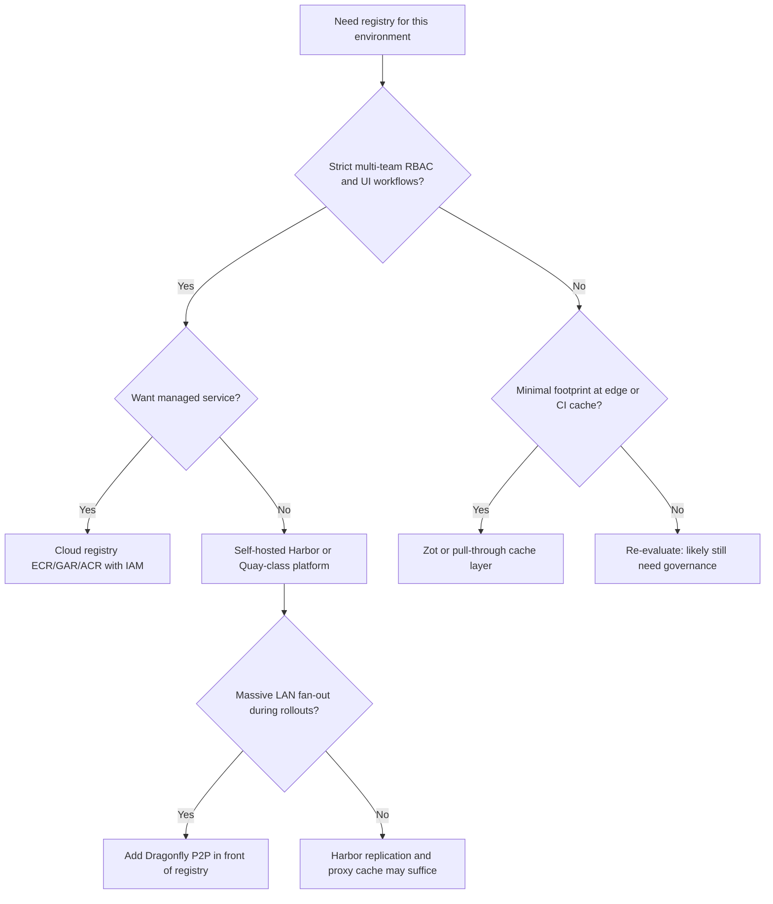

> **Toolkit Track** | Complexity: `[COMPLEX]` | Time: 50-60 minutes | Kubernetes: 1.35+

## What You'll Be Able to Do

After completing this module, you will be able to:

- **Deploy** Harbor with a production-oriented topology and configure project-based access control for multi-team environments
- **Implement** automated vulnerability scanning and image signing workflows that match how production registries enforce supply-chain policy
- **Configure** replication and proxy-cache rules so images exist where clusters need them without treating a public registry as your runtime dependency
- **Integrate** Harbor with Kubernetes admission policy so only approved, signed, and scanned images from your registry can run

## Why This Module Matters

**Hypothetical scenario:** A platform team schedules a routine application rollout on a Monday morning across roughly fifty Kubernetes nodes. The manifest is correct, CI produced a new image tag, and the deployment controller begins a rolling update. Ten nodes pull the image successfully, then the remainder enter `ImagePullBackOff` because the upstream registry throttles anonymous or free-tier pulls. Half the fleet runs the previous version while half cannot start Pods at all, which creates version skew, confused health checks, and an outage measured in hours rather than minutes. The team did not fail at Kubernetes; they failed at treating someone else's registry quota as production infrastructure.

Every container your cluster runs was resolved from a registry address, even when that address is implicit in a short image name like `nginx:1.27`. In production, "where images live" is not a convenience question. It is a reliability, security, and governance question. A self-hosted OCI registry gives you control over pull rate, data residency, audit evidence, vulnerability gates, signing requirements, and retention rules. Harbor is one mature open-source implementation of that capability: a batteries-included registry platform with projects, RBAC, scanning, replication, proxy cache, retention, and OCI artifact support. It is not the only option. [Module 13.2: Zot](../module-13.2-zot/) covers the minimal OCI-native path; managed services such as Amazon ECR, Google Artifact Registry, and Azure Container Registry cover the cloud-operated path. This module teaches the durable registry spine using Harbor as the running example because its feature set makes the governance concepts visible in one place.

The durable lesson is capability design, not product preference. When your security team asks how you know an image is safe to run, you should be able to answer with evidence: it was built by an authorized pipeline, stored in a registry you control, scanned against a current vulnerability database, optionally signed, referenced by digest in the deployment manifest, and blocked at admission time if policy fails. Harbor helps you implement several of those controls at the registry layer; Kubernetes policy tools handle enforcement at the cluster boundary. Together they form a supply-chain posture that survives upstream rate limits, network partitions, and auditor questions about provenance.

## 1. Understand the OCI Registry Substrate Harbor Implements

Before you configure projects or scanners, you need a clear mental model of what a registry actually stores. The Open Container Initiative defines two specifications that matter daily: the [Distribution Specification](https://github.com/opencontainers/distribution-spec/blob/main/spec.md) describes the HTTP API clients use to push and pull content, and the [Image Specification](https://github.com/opencontainers/image-spec/blob/main/spec.md) describes how manifests, configuration blobs, and filesystem layers relate. Harbor's registry component speaks that Distribution API. The Harbor core service adds authentication, authorization, project metadata, webhooks, replication jobs, and policy. That separation is why troubleshooting often splits into "can the client reach `/v2/`?" versus "does this user have push permission on this project?"

A container image in OCI terms is not one file. It is a manifest that points to a configuration blob and one or more layer blobs, each addressed by a cryptographic digest. When you `docker push`, the client uploads missing blobs, then uploads a manifest that ties them together. When you `docker pull`, the client fetches the manifest for a tag or digest, then fetches each referenced blob. Tags are human-friendly names; digests are content identity. [Kubernetes documentation on images](https://kubernetes.io/docs/concepts/containers/images/) emphasizes that tags can move while digests identify exact content, which is why mature promotion workflows record digests in manifests and incident response searches by digest rather than by a mutable `latest` pointer.

Registries also store OCI artifacts beyond traditional container images. Helm charts pushed as OCI artifacts, Software Bill of Materials (SBOM) documents, Cosign signatures, and Notation signature bundles can live in the same repository namespace when tooling and registry policy allow it. Harbor documents user-defined OCI artifact types so administrators can extend management to additional media types. The practical consequence is that "registry governance" is no longer only about container images. Your retention, replication, scanning, and signing policies must account for the evidence artifacts your compliance program expects to find next to an image digest.

Self-hosting earns its keep when you need predictable pull performance behind your firewall, air-gapped or intermittently connected sites, strict data residency, or policy gates that must execute before an image ever reaches a node. A public registry can remain an upstream source while your Harbor instance becomes the authoritative mirror your clusters actually use. That pattern decouples developer convenience ("pull from Docker Hub during build") from production safety ("nodes only pull from `harbor.internal`").

## 2. Map Harbor's Architecture to Operational Responsibility

Harbor is a multi-component system, which is the tradeoff you accept versus a single-process registry like Zot. The nginx front door terminates TLS and routes traffic. The core service owns the REST API, authentication integration, project configuration, and robot account issuance. The registry service stores OCI blobs and manifests. The portal provides the administrative UI. The job service runs asynchronous work: replication, garbage collection, retention sweeps, and scan scheduling. PostgreSQL stores metadata; Redis supports job queues and caching; object storage or a filesystem holds blob content; Trivy performs vulnerability analysis when enabled.

```ascii
HARBOR REQUEST AND CONTROL PLANES
──────────────────────────────────────────────────────────────────────────────

 Clients (docker, containerd, helm, cosign)
                    │
                    ▼
            ┌───────────────┐
            │  Proxy / TLS  │
            └───────┬───────┘
                    │
      ┌─────────────┼─────────────┐
      ▼             ▼             ▼
 ┌─────────┐  ┌───────────┐  ┌─────────┐
 │  Core   │  │ Registry  │  │ Portal  │
 │ API/RBAC│  │ OCI blobs │  │   UI    │
 └────┬────┘  └───────────┘  └─────────┘
      │
      ▼
 ┌──────────┐   ┌────────┐   ┌──────────────┐
 │Job Svc   │   │ Trivy  │   │ PostgreSQL   │
 │repl/GC   │   │ scanner│   │ metadata     │
 └──────────┘   └────────┘   └──────────────┘
```

When a push succeeds but a project webhook never fires, you might have a registry path problem or a core configuration problem, and the logs live in different places. When replication stalls, the job service queue and target registry credentials are the first suspects. When scans never appear, verify Trivy connectivity and project auto-scan settings before you assume the image lacks packages. Operations teams that document "which component owns which symptom" recover faster than teams that treat Harbor as a black box labeled "registry."

Production Harbor on Kubernetes typically deploys via the [official Helm chart](https://helm.goharbor.io/) documented in [Deploying Harbor with High Availability via Helm](https://goharbor.io/docs/2.15.0/install-config/harbor-ha-helm/). High availability means more than multiple portal pods. Durable production posture usually externalizes PostgreSQL and Redis, uses shared object storage for registry blobs, and fronts the installation with a load balancer or ingress controller that preserves large upload bodies. The install documentation also covers HTTPS configuration, internal TLS between components, and lifecycle reconfiguration. Treat those documents as the source of truth for version-specific settings rather than copying values from a blog post tied to an older release.

> **Landscape snapshot — as of 2026-09. This changes fast; verify against vendor docs before relying on specifics.**

| Fact | Current snapshot |
|------|------------------|
| Harbor docs version used here | 2.15.x |
| CNCF status | Graduated — confirmed on the [CNCF Harbor project page](https://www.cncf.io/projects/harbor/) |
| Default bundled scanner | Trivy — see [Harbor vulnerability scanning administration](https://goharbor.io/docs/2.15.0/administration/vulnerability-scanning/) |
| Signing options in Harbor | Cosign and Notation workflows are supported; verify current UI and version notes in Harbor release documentation |
| Minimal OCI peer called out in this sub-track | [Zot](../module-13.2-zot/) |
| P2P distribution peer module | [Dragonfly](../module-13.3-dragonfly/) for fan-out in front of a registry |

| Capability | Harbor | Zot | Quay / Red Hat Quay | OCI Distribution (upstream) | Cloud (ECR / GAR / ACR) |
|------------|--------|-----|---------------------|----------------------------|-------------------------|
| OCI Distribution API | Yes | Yes | Yes | Reference implementation | Yes |
| Project / namespace RBAC | Yes | Limited / config-based | Yes | No | IAM / org policies |
| Vulnerability scanning | Built-in adapters (Trivy default) | Extension-based | Integrated scanning features | No | Vendor scanners |
| Signing / trust artifacts | Cosign / Notation support | Tool-driven OCI artifacts | Signing integrations | No | Vendor signing helpers |
| Replication / mirroring | First-class rules | Sync extension | Replication features | No | Cross-region replication |
| Proxy / pull-through cache | Yes | Yes | Yes | No | Upstream pull-through patterns |
| Retention + GC | Yes | GC settings | Yes | GC tooling separate | Lifecycle policies |
| Self-hosted | Yes | Yes | Yes | Yes | Managed service |

## 3. Design Projects, RBAC, and Identity for Multi-Tenant Registries

Harbor organizes content into projects. A project is more than a name prefix in an image reference. It is the boundary where you set public versus private visibility, member roles, robot accounts, vulnerability thresholds, tag immutability, retention policies, webhooks, and quotas. The image reference `harbor.example.com/team-backend/api-server:v2` encodes registry host, project name, repository name, and tag. Many policy decisions are made at the project layer before anyone debates individual tags.

Harbor assigns project-scoped roles such as Guest, Developer, Maintainer, and Project Admin. Guests pull; Developers push; Maintainers manage tags and members; Project Admins configure project policies. System-level administrators configure authentication sources and global defaults. Harbor supports local database users, LDAP, and OIDC according to [Configure Authentication](https://goharbor.io/docs/2.15.0/administration/configure-authentication/). The durable design pattern is to map your organization's identity provider groups to Harbor roles rather than maintaining a parallel user database that drifts every quarter.

Robot accounts exist because human credentials do not belong in CI pipelines. A robot account receives a token scoped to explicit projects and actions such as push, pull, or artifact read. When a pipeline only needs to push `team-backend/api-server`, grant only that repository path. When a deployment controller only needs pull access to `production/**`, grant read without delete. Robot account compromise is still serious, but narrow scope limits blast radius and makes audit logs easier to interpret. Harbor documents robot creation under [Create Robot Accounts](https://goharbor.io/docs/2.15.0/working-with-projects/project-configuration/create-robot-accounts/).

Public projects can be useful for shared base images, but "public inside Harbor" still means inside your organization unless you deliberately expose the registry to the internet. Private production projects should default to auto-scan on push, severity thresholds aligned with your risk appetite, and immutability on release tags so a compromised pipeline cannot overwrite an existing `v1.4.0` manifest. [Tag immutability rules](https://goharbor.io/docs/2.15.0/working-with-projects/working-with-images/create-tag-immutability-rules/) protect against accidental or malicious overwrites by rejecting pushes that collide with protected tag patterns.

Multi-team registries fail socially before they fail technically. If every team shares one project because "it is easier," you lose accountability. If every team gets a separate project but nobody owns retention, storage costs climb silently until finance notices. A workable model assigns each team or product line a project, uses robot accounts per pipeline, maps OIDC groups to roles, and documents which project is authoritative for production promotion. Harbor supplies the controls; your organization supplies the naming and ownership conventions.

## 4. Shift Vulnerability Discovery Left with Registry Scanning

Running containers without knowing their CVE exposure is a gamble you only notice during an incident. Registry scanning moves discovery earlier: when an image lands in the registry, not after it is already running on hundreds of nodes. Harbor integrates pluggable scanners and ships Trivy as the default option documented in [Vulnerability Scanning](https://goharbor.io/docs/2.15.0/administration/vulnerability-scanning/). Trivy inspects OS packages and language dependencies, compares them against vulnerability data sources, and returns severity summaries Harbor can display and enforce.

Project configuration allows automatic scan on push and optional prevention of pulls when severity exceeds a threshold. The combination is powerful. Auto-scan ensures new content receives a report without a human clicking "scan" in the UI. Pull prevention ensures Kubernetes (or any client) cannot retrieve an image that violates your policy, which turns the registry into an enforcement gate. Be deliberate about thresholds. Blocking on every Medium CVE during early development can stall iteration; allowing Critical CVEs in a `production` project defeats the purpose. Align thresholds with environment: permissive in `sandbox`, strict in `production`.

Scan results attach to a specific artifact digest. If a team retags a fixed image, the digest and its scan report move together. If they rebuild and push the same tag, the digest changes and the scan must run again. This is why promotion workflows should reference digests in deployment manifests for production, while tags remain acceptable for fast-moving development branches. When security teams ask for remediation evidence, export the digest, scan timestamp, and CVE list rather than a mutable tag name.

Scanner currency matters as much as scanner presence. Trivy downloads vulnerability databases on a schedule Harbor configures. Air-gapped environments need a plan to update those databases without internet access. Scanning also consumes CPU and memory; large images queued during busy CI hours can lengthen push-to-ready time. Monitor scan queue depth via Harbor metrics and size Trivy resources accordingly. A registry that scans everything but never blocks anything is only decoration; a registry that blocks without giving developers actionable reports creates shadow processes where teams bypass policy.

## 5. Bind Image Signing and Trust to Admission Policy

Scanning answers "what vulnerabilities are present?" Signing answers "who published this content and was it tampered with after publication?" Modern supply-chain practice treats signatures as OCI artifacts associated with an image digest. [Cosign](https://docs.sigstore.dev/cosign/signing/overview/) from the Sigstore project is widely used to sign container images and store signatures in the same registry. [Notation](https://notaryproject.dev/docs/) implements the Notary Project conventions for signing and verification. Harbor can store and surface these artifacts so operators can require signatures before deployment.

Harbor does not replace Kubernetes admission control. The durable pattern is registry plus admission: Harbor stores trusted images and signature artifacts; an admission webhook or policy engine such as OPA Gatekeeper or Kyverno enforces rules at deploy time. Typical policies require images to come from `harbor.example.com/production/**`, require a Cosign signature from an approved key or certificate, and optionally require an SBOM artifact for production namespaces. When any check fails, the API server rejects the Pod before a kubelet pulls non-compliant content.

Signing workflows belong in CI immediately after a successful build and vulnerability gate. The pipeline builds an image, pushes to Harbor, waits for scan results, signs the digest that passed policy, and records the digest in the deployment manifest. Verification happens on the cluster during admission, not by trusting a tag name in a spreadsheet. Key management is the hard part: store signing keys in a KMS or CI secret manager, rotate on schedule, and never reuse personal laptop keys as organization trust roots.

Trust is only as strong as the references you enforce. If deployments still allow `image: nginx:latest` from a public registry, signing policy on Harbor images can be bypassed by a rushed hotfix. Narrow allowed registries, require digests for production, and test denial cases regularly. A policy that never rejects a bad Pod is untested theory.

## 6. Distribute Images with Replication, Proxy Cache, and P2P Preconditions

Clusters in multiple regions, factory floors, or disaster recovery sites need images without every node reaching a single distant registry. Harbor addresses distribution with replication rules and proxy projects. [Configuring Replication](https://goharbor.io/docs/2.15.0/administration/configuring-replication/) supports push-based replication from a primary Harbor to a secondary Harbor or compatible registry, and pull-based synchronization from upstream registries into Harbor. Push replication suits active disaster recovery where you want artifacts copied after CI promotes them. Pull replication suits mirroring selected upstream content on a schedule.

Proxy cache mode lets Harbor act as a pull-through registry for an upstream such as Docker Hub or a vendor registry. The first pull fetches content upstream; subsequent pulls from any client in your environment hit local storage. This reduces upstream rate limiting risk and improves latency. It does not magically make offline sites resilient unless the content they need was pulled before the outage. Critical images still require pre-warming or scheduled replication for true offline readiness.

Retention interacts with distribution. [Create Tag Retention Rules](https://goharbor.io/docs/2.15.0/working-with-projects/working-with-images/create-tag-retention-rules/) identify which tags remain eligible for keep; artifacts that do not match any retention rule become candidates for deletion during retention runs. Retention is not the same as garbage collection. Deleting a tag removes a name reference; [Garbage Collection](https://goharbor.io/docs/2.15.0/administration/garbage-collection/) reclaims unreferenced blobs from storage. Operators need both: retention to cap tag sprawl, garbage collection to reclaim disk after deletes and retention sweeps. Schedule GC during maintenance windows on large installations because registry performance can degrade while blobs are reclaimed.

For massive fan-out inside a single site—thousands of nodes pulling the same multi-gigabyte image during a rollout—registry bandwidth can still bottleneck. [Module 13.3: Dragonfly](../module-13.3-dragonfly/) covers peer-to-peer distribution in front of a registry. Harbor even documents [P2P preheat](https://goharbor.io/docs/2.15.0/administration/p2p-preheat/) integration to seed P2P networks. The design pattern is complementary: Harbor remains authoritative storage; Dragonfly reduces repeated full pulls across the LAN.

## 7. Deploy and Operate Harbor for Production-Like Environments

Development teams often start Harbor with Docker Compose using the offline installer described in [Harbor Installation and Configuration](https://goharbor.io/docs/2.15.0/install-config/). That path is valuable for learning, but production teams typically move to Kubernetes and Helm for rolling upgrades and replicated components. The Helm chart exposes values for ingress, external database, external Redis, storage classes, resource limits, and metrics integration. Before you install, read [installation prerequisites](https://goharbor.io/docs/2.15.0/install-config/installation-prereqs/) and plan TLS trust: cluster nodes and CI runners must trust Harbor's certificate chain or pulls fail with TLS errors that look like application bugs.

Storage planning prevents painful migrations later. Local PVCs are simple for labs; S3-compatible object storage scales better for large blob volumes and HA registry backends. PostgreSQL holds users, projects, policies, and job metadata—lose it without backups and you rebuild governance from scratch even if blobs survive. Redis loss is less catastrophic but disrupts queued jobs until restored. Document backup and restore drills that include both database dumps and blob store consistency checks.

Upgrades require reading [Upgrading Harbor](https://goharbor.io/docs/2.15.0/administration/upgrade/) release notes for the target version. Harbor maintains a migration path for the database schema between minor versions, but skipping multiple major versions without intermediate steps is a common source of failed upgrades. Staging environments that mirror production auth integrations and scanner adapters catch breaking changes before they touch the registry your entire company pulls from.

Monitoring turns component architecture into actionable signals. Harbor exposes Prometheus metrics from core, registry, and jobservice endpoints documented under [Metrics](https://goharbor.io/docs/2.15.0/administration/metrics/). Track push and pull rates, storage usage, scan queue depth, replication failures, and GC duration. Alert on sustained replication errors and on disk usage trends that predict retention misconfiguration. A registry outage is a fleet-wide outage because no new Pods start without images.

## 8. Walk Through a Worked Harbor Pipeline End to End

Imagine a service team shipping `payment-api` through GitHub Actions. The pipeline checks out code, builds a container image, logs into Harbor with a robot account scoped to `team-payments`, and pushes `harbor.internal/team-payments/payment-api:main-abc1234`. Harbor receives the push, stores blobs, fires a webhook optional for ticketing, and queues a Trivy scan because auto-scan is enabled on the project. The pipeline polls the Harbor API vulnerabilities endpoint or relies on a subsequent CI stage to fail if Critical CVEs appear.

After the scan passes, Cosign signs the digest promoted to `harbor.internal/production/payment-api@sha256:…` using a key stored in the CI secret manager. The deployment manifest for Kubernetes references that digest, not a floating tag. An admission policy verifies registry prefix, signature, and optionally SBOM presence. Only then does the kubelet pull from Harbor. If someone attempts to deploy an unsigned image built on a laptop, admission rejects it even if the image somehow reached the cluster network.

Operators configure replication from `harbor.internal` to `harbor-dr.internal` for disaster recovery, and a proxy project mirrors approved upstream base images so developers do not hammer public registries from every build agent. Retention keeps the last ten `main-*` build tags and the last five release tags matching `v*`, while immutability prevents overwrite of `v*` releases. Weekly garbage collection recovers space from deleted feature branches. This story is not unique to Harbor; it is the durable registry lifecycle with Harbor as the concrete control plane.

Contrast that with the minimal path in [Module 13.2: Zot](../module-13.2-zot/): a single-process OCI registry excels when you need local mirroring without a database or enterprise UI, but you will assemble more governance yourself. Contrast with cloud registries when your organization prefers managed durability and IAM integration over self-operated Postgres and Redis. Harbor sits in the self-hosted, feature-rich peer group—not as a universal default, but as a strong fit when multiple teams need shared policy on one platform.

## 9. Connect Harbor to CI/CD Without Turning Pipelines Into Registry Admins

Continuous integration is where registry policy succeeds or silently fails. A pipeline that can push anywhere in Harbor will eventually push somewhere unsafe. A pipeline that cannot read scan status will ship vulnerable digests while dashboards look green. The durable integration pattern keeps credentials narrow, waits for asynchronous registry work, and promotes by digest rather than by tag inheritance.

Most CI systems interact with Harbor through three touchpoints: `docker login` or `crane auth login` with a robot account, `docker push` or `buildx build --push` to publish artifacts, and Harbor's REST API to read scan summaries or webhook-driven events. GitHub Actions, GitLab CI, and Jenkins differ in syntax, but the registry contract is identical. Login should use secrets stored in the CI vault, not repository variables visible to every fork. Push should target a single project namespace per service. Scan gating should query the artifact digest that was just pushed, because Harbor attaches results to digest, not to the commit SHA in your git repository unless you encode that relationship in tags deliberately.

Webhook notifications let Harbor inform external systems when push, pull, scan, or quota events occur. A webhook can open a ticket when Critical CVEs appear on a `production` project, or trigger a downstream promotion pipeline when scans complete. Webhooks do not replace admission policy; they coordinate human and automation workflows around the registry. Configure retry expectations and authenticate webhook receivers, because a noisy webhook endpoint that always returns errors will train operators to ignore failures.

Cache-from-registry patterns in build tools reduce CI time by reusing layers already stored in Harbor. When build caches live in the same project as release images, separate repositories or retention rules so cache churn does not delete release artifacts. Some teams use `library/buildcache/**` with aggressive retention while `production/**` uses immutability and long retention on `v*` tags. The naming convention is organizational, but Harbor enforces whatever boundaries you encode in projects and retention scopes.

Promotion between projects can be implemented as separate push steps with different robot credentials, replication rules that copy only signed artifacts, or manual UI promotion for smaller teams. The anti-pattern is retagging the same digest into `production` without re-scanning or re-signing when policy requires fresh evidence. If your change management rules say production must have a scan less than seven days old, enforce that in CI by reading scan timestamps from the API, not by assuming a moved tag inherited compliance.

## 10. Troubleshoot Harbor Like a Platform Engineer

Registry incidents feel like application outages because they are application outages. When Pods fail with `ImagePullBackOff`, operators often blame Kubernetes first. Split the failure: authentication to Harbor, manifest existence, blob availability, project pull prevention for CVEs, network path, and TLS trust each produce similar symptoms with different fixes. A structured runbook saves hours.

Start from the client error string. `unauthorized` usually means expired robot tokens, wrong project permissions, or clock skew affecting JWT validation. `manifest unknown` means the tag does not exist in that repository or project typo—remember Harbor includes the project in the path. `403` on pull after a successful push often means vulnerability prevention thresholds or deployment policies blocked the artifact. TLS errors on nodes point to missing CA certificates in `/etc/containerd/certs.d` or `/etc/docker/certs.d` rather than Harbor core bugs.

On the server, check `/api/v2.0/health` and component health endpoints before diving into pod logs. If health is degraded, identify whether database connectivity, Redis, registry storage, or Trivy is failing. Core logs show authentication and authorization decisions. Registry logs show blob mount and manifest serve paths. Job service logs show replication, retention, and GC task failures. Trivy adapter logs show scanner timeouts on large images.

For performance complaints, distinguish latency from throughput. Small images with many tags hurt metadata queries; huge images hurt push and scan duration. Replication lag shows up as DR site missing recent digests even though primary pushes succeed. Proxy cache misses show up as repeated upstream pulls in registry logs. Metrics from [Harbor metrics](https://goharbor.io/docs/2.15.0/administration/metrics/) help you correlate user reports with queue depth and storage trends.

Restore drills deserve the same seriousness as etcd restores. Practice recovering PostgreSQL metadata and blob storage together, then verify that a known digest can be pulled and that robot accounts still authenticate. Teams that backup blobs but not the database recover files they cannot map to projects and policies. Teams that backup the database but not blobs see manifests referencing missing layers. Harbor is a system; partial recovery is a subtle failure mode.

## 11. Compare Harbor to Peers Without Ranking Them

Tool selection should be capability tradeoff analysis, not brand loyalty. Harbor and Red Hat Quay both target organizations that want self-hosted governance with projects, scanning, and replication. Zot targets operators who want OCI distribution with minimal moving parts and are willing to assemble policy elsewhere. Cloud registries trade operational burden for IAM integration and managed durability. The OCI Distribution project remains the protocol reference implementation operators study when debugging wire-level behavior.

Harbor's sweet spot is a platform team supporting many internal product groups on shared Kubernetes estates. You need LDAP or OIDC integration, per-team projects, centralized scanning, replication to DR, and a UI security champions can browse without kubectl access. Zot's sweet spot is edge caches, CI pull-through, and labs where a single config file and one process beat a Helm release with seven Deployments. Running Harbor at every edge site often fails staffing reality; running only Zot at headquarters often fails audit questions about centralized policy evidence.

Cloud registries make sense when your organization already standardized on a cloud IAM model and does not want to operate Postgres for registry metadata. Hybrid models are common: build in cloud CI, promote into Harbor for on-premises clusters, or mirror cloud registry content into Harbor for air-gapped factories. The mistake is assuming hybrid sync is free. Replication bandwidth, credential rotation, and digest consistency across environments still require design.

When comparing scanners, remember Harbor abstracts the scanner adapter while your compliance program owns the SLA for database freshness and false positives. Trivy is the default worked example in Harbor docs, but the architectural lesson is pluggable scanning: swapping scanners should not require retraining every developer on a new UI if project policies remain consistent. Signing is similar: Cosign and Notation differ in tooling ergonomics, but the registry stores OCI artifacts and Kubernetes admission verifies them.

Use the Rosetta table in section 2 as a living document. When a new registry enters your evaluation, add a column and score capabilities you actually require—OIDC, replication filters, OCI artifacts, metrics, immutability, proxy cache—rather than marketing checklists. A column that is empty for every required row is a fast disqualifier. A column that is strong on distribution but weak on policy tells you where companion tools must sit in the architecture.

## Patterns and Anti-Patterns

**Patterns that age well**

**Project-per-team with environment promotion.** Give each team its own Harbor project for builds, then promote digests into a restricted `production` project with stricter scanning, immutability, and pull policies. This keeps experimental tags away from production admission rules while preserving a clear audit trail.

**Robot accounts with least privilege.** Issue one robot per pipeline with push-only on the repositories that pipeline owns. Separate read-only robots for deployment controllers. Revoke and rotate tokens on the same schedule as other CI secrets.

**Scan-on-push plus severity gates in production.** Automate scanning for every artifact, but tune severity blocking per project. Development projects surface CVEs without blocking pushes; production projects block pulls that exceed agreed severities.

**Proxy cache for approved upstreams.** Mirror sanctioned base images through Harbor proxy projects so CI and clusters do not depend on external rate limits at deploy time. Pair with a list of allowed upstream registries.

**Replication with tested failover drills.** Configure a secondary Harbor and run quarterly drills that promote pulls to the secondary endpoint. Replication jobs that never fail over operationally are vanity configuration.

**Anti-patterns that cause outages**

**Using personal credentials in CI.** User accounts tied to offboarding processes break pipelines silently or leave excessive privileges when the user is gone. Robot accounts exist to prevent exactly this.

**Tag-only production references.** Promoting `latest` or movable tags without digest pinning makes rollbacks ambiguous and breaks the link between scan reports and running Pods.

**Retention without garbage collection.** Deleting tags frees names, not disk. Operators who configure aggressive retention but never schedule GC wonder why storage bills remain flat.

**Treating proxy cache as offline backup.** Pull-through cache only contains content someone already requested. Sites that lose connectivity still need pre-replicated or pre-warmed digests.

**Single-node Harbor for company-wide production.** Without external database, shared blob storage, and load-balanced ingress, any maintenance window becomes a fleet-wide pull outage.

**Scanner installed but never enforced.** CVE reports that nobody acts on train teams to ignore dashboards. Pair scanning with CI or pull gates and documented remediation SLAs.

## Decision Framework

Use the following decision flow when choosing registry shape for a new environment. It compares capabilities, not vendor winners.



| Question | If yes, lean toward | If no, lean toward |
|----------|---------------------|--------------------|
| Multiple teams need isolated policies on one platform | Harbor or Quay-class self-hosted registry | Zot plus external policy tooling |
| You must operate air-gapped with full UI governance | Harbor with replication and offline scanner DB updates | Cloud registry unlikely |
| Edge site has one small node and intermittent staff | Zot mirror | Full Harbor stack |
| Compliance requires signed digests and admission enforcement | Harbor plus Cosign plus admission policy | Any registry without signing workflow is incomplete |
| Primary pain is upstream rate limits | Harbor or Zot proxy cache | Direct public pulls |
| Primary pain is thousand-node simultaneous pulls | Add Dragonfly P2P | Registry scaling alone |

## 12. Plan Capacity, Upgrades, and Security Boundaries Deliberately

Registry capacity planning is boring until it is catastrophic. Blob storage grows with image size multiplied by push frequency multiplied by retention window. Metadata growth tracks tags and artifacts more than layers. Scanner load tracks image count and maximum image size during business hours. Replication multiplies egress when every promotion copies full layers to a secondary site. Start with conservative quotas per project and tune upward with measured data rather than unlimited defaults that encourage "push every commit forever" behavior.

Network planning matters for CI clusters that build inside Kubernetes. In-cluster builders pulling base images from an external registry during every pipeline run can saturate egress and trigger upstream throttles. Point builders at Harbor proxy projects or internal mirrors so base layers download once per day, not once per pipeline minute. For nodes pulling application images, ensure image pull secrets are attached to service accounts rather than copied into every namespace by hand, because drift between namespaces is a common reason one team succeeds while another reports "registry down."

Upgrade planning should begin in a staging Harbor that mirrors production authentication, scanner adapters, and storage backend class. Read release notes for API deprecations that might break automation scripts hitting `/api/v2.0` endpoints. Helm upgrades should pin chart versions explicitly rather than floating to latest on every maintenance window. Take database backups before schema migrations and verify you can restore to a test namespace before touching production metadata.

Security boundaries extend beyond TLS. Restrict who can create new projects globally, because uncontrolled project sprawl becomes undeletable history. Audit robot account creation the same way you audit cloud IAM keys. Enable audit log forwarding described in Harbor administration docs when your SIEM expects registry events. Separate admin duties: the team that can change vulnerability thresholds should not be the only team that can delete audit logs. Harbor provides knobs; your separation-of-duties model provides meaning.

Finally, document the allowed image contract for application teams in one page: approved registry hostnames, required signature types, maximum CVE severities per environment, how to request new upstream mirrors, and how to request robot accounts. Harbor implements the contract; developers comply more reliably when the contract is short, published, and testable with a single example pipeline they can copy. Platform engineering success looks like boring Monday rollouts—because the registry, scanner, signer, and admission layers already agreed the digest was safe before the rollout started.

When you review an architecture diagram that shows Kubernetes at the center and Harbor off to the side, invert the mental picture for supply-chain discussions. The registry is upstream of every Pod spec that references a container image. If Harbor is slow, misconfigured, or unreachable, no amount of cluster autoscaling fixes application delivery. That is why registry changes belong in the same change advisory board as control plane upgrades, and why on-call runbooks for platform teams should include registry health checks alongside etcd and API server checks. Treat those checks as first-class production signals, not optional nice-to-haves you add only after the first registry outage. A five-minute weekly registry smoke test—push, scan, pull, and admission deny on a deliberate bad digest—pays for itself the first time it catches a broken robot token before a fleet-wide rollout does.

## Did You Know?

- **Harbor reached CNCF Graduated status in June 2020 (graduation announced 2020-06-23).** The [CNCF Harbor project page](https://www.cncf.io/projects/harbor/) lists Harbor among graduated projects, which indicates a mature governance and adoption trajectory within the foundation—not a guarantee that every feature you need is enabled in your installation without configuration.
- **Trivy replaced Clair as Harbor's default scanner path.** Harbor's administration documentation for [vulnerability scanning](https://goharbor.io/docs/2.15.0/administration/vulnerability-scanning/) describes pluggable scanners with Trivy as the common default, which matters when you size scanner workers and plan offline database updates.
- **Tag deletion and blob deletion are different events.** Removing a tag does not immediately free storage; [garbage collection](https://goharbor.io/docs/2.15.0/administration/garbage-collection/) reclaims unreferenced layers after retention and delete operations have run.
- **Harbor supports P2P preheat integrations.** The [P2P preheat](https://goharbor.io/docs/2.15.0/administration/p2p-preheat/) administration page documents how Harbor can seed Dragonfly or similar networks—useful when LAN fan-out, not registry storage, is the bottleneck.

## Common Mistakes

| Mistake | Problem | Solution |
|---------|---------|----------|
| HTTP registry in production | Credentials and layers traverse the network unprotected | Terminate TLS with trusted certificates on ingress or Harbor proxy |
| Default admin password left unchanged | Trivial compromise of global configuration | Change admin password during install; prefer SSO for humans |
| No project quotas | One team fills shared storage | Apply [project quotas](https://goharbor.io/docs/2.15.0/administration/configure-project-quotas/) per team |
| Skipping immutability on release tags | Compromised CI can overwrite a known release name | Apply [tag immutability](https://goharbor.io/docs/2.15.0/working-with-projects/working-with-images/create-tag-immutability-rules/) on `v*` patterns |
| Replication configured but never tested | Failover day discovers firewall or credential drift | Run scheduled test pulls from the secondary registry |
| Blocking pulls without developer-visible scans | Teams circumvent policy with emergency exceptions | Expose scan results in CI logs and tie thresholds to documented SLAs |
| Running GC on huge registries at peak hours | Pull latency spikes during blob sweeps | Schedule GC in maintenance windows and monitor `harbor_gc_completion_time_seconds` |
| Using Harbor as sole offline strategy without pre-warm | Proxy cache misses during outage block deploys | Pre-replicate or preheat critical digests before disconnect windows |

## Quiz

<details>
<summary>1. A rolling update stalls halfway: some nodes pulled `harbor.internal/production/api:v2` and others show `ImagePullBackOff` with rate-limit errors pointing at a public registry. What architectural mistake likely occurred?</summary>

The deployment still references a public upstream registry or an image path that resolves outside Harbor, so part of the fleet depended on upstream rate limits instead of the self-hosted registry. Correct the image reference to the Harbor production project, ensure pull secrets and admission policies allow only the internal registry, and verify proxy cache or replication actually contains the promoted digest. Production nodes should not need outbound access to a throttled public registry during rollout.
</details>

<details>
<summary>2. CI pushes successfully to `team-backend/api-server:build-442` but the pipeline fails when querying scan results. The image appears in the UI without CVE data. What Harbor project settings and components should you verify first?</summary>

Confirm the target project has **Automatically scan images on push** enabled in [project configuration](https://goharbor.io/docs/2.15.0/working-with-projects/project-configuration/), verify the Trivy adapter is healthy and can reach vulnerability databases, and inspect job service logs for queued scan failures. Push success only proves registry storage; scanning is asynchronous and can fail independently when scanner pods are undersized or offline.
</details>

<details>
<summary>3. Security asks you to ensure only signed images run in `production`, but Harbor already scans images. What additional controls belong in the pipeline and cluster?</summary>

Add Cosign or Notation signing in CI after scan gates pass, store signatures as OCI artifacts in Harbor, pin deployment manifests to digests, and enforce registry prefix plus signature verification in an admission policy. Scanning alone does not prove publisher identity or detect post-push tampering if tags move; signing plus admission closes that gap.
</details>

<details>
<summary>4. You configured replication from primary Harbor to a DR Harbor, but the DR site still cannot deploy during a primary outage. Replication jobs show success. What operational gaps should you investigate?</summary>

Replication success does not automatically repoint clusters. DR kubeconfigs and image references may still target the primary hostname, DNS may not fail over, or only a subset of projects is replicated. Run drills that pull from the DR hostname, document digest promotion procedures, and verify credentials and TLS trust on the DR endpoint independent of primary uptime.
</details>

<details>
<summary>5. Storage growth remains high after you deleted hundreds of old feature-branch tags. Retention rules are active. Why?</summary>

Tag deletion and retention free references, not necessarily disk space. Unreferenced blobs remain until [garbage collection](https://goharbor.io/docs/2.15.0/administration/garbage-collection/) runs successfully. Schedule GC, monitor duration metrics, and confirm retention jobs actually executed for the intended repositories.
</details>

<details>
<summary>6. A developer insists on using their user account token in GitHub Actions because robot accounts are "too much overhead." What risk are they accepting?</summary>

User tokens inherit broader lifecycle and permission coupling: offboarding breaks pipelines, passwords rotate unpredictably, and audit trails mix human and automation actions. Robot accounts provide scoped, revocable credentials designed for CI with explicit project and action limits. The operational overhead of robot setup is smaller than an outage from a disabled user account.
</details>

<details>
<summary>7. Your platform needs a registry at a warehouse edge with one small server and no DBA. Harbor is proposed. What peer capability should you evaluate first and why?</summary>

Evaluate [Zot](../module-13.2-zot/) or another minimal OCI registry because Harbor's multi-component footprint (PostgreSQL, Redis, job service, scanner) may exceed edge staffing and hardware. If governance requirements still demand Harbor features, place a full Harbor at headquarters and use replication or Zot caching at the edge rather than operating full Harbor on the smallest site.
</details>

<details>
<summary>8. Admission policy requires images from `harbor.internal/production/**` but a hotfix Pod using `docker.io/library/nginx:1.27` still schedules. What failed?</summary>

Admission policy is missing, misconfigured, or not enrolled on the namespace. Harbor controls what it stores and serves; Kubernetes admission enforces what may run. Verify the webhook or policy engine is active, test a deliberate bad image in a staging cluster, and ensure emergency break-glass processes still route through signed internal mirrors rather than public bypass.
</details>

## Hands-On Exercise: Deploy Harbor and Secure a Pipeline

Deploy Harbor on a local Kubernetes cluster with Helm, create a secured project, push and scan an image, and verify policy-oriented configuration. The commands below follow Harbor 2.15 documentation patterns; adjust hostnames and passwords for your lab.

### Step 1: Create a kind cluster and install Harbor

```bash
cat <<EOF | kind create cluster --name harbor-lab --config -
kind: Cluster
apiVersion: kind.x-k8s.io/v1alpha4
nodes:
- role: control-plane
  extraPortMappings:
  - containerPort: 30080
    hostPort: 30080
EOF

helm repo add harbor https://helm.goharbor.io
helm repo update
kubectl create namespace harbor

cat <<EOF > harbor-values.yaml
expose:
  type: nodePort
  tls:
    enabled: false
  nodePort:
    ports:
      http:
        nodePort: 30080
externalURL: http://127.0.0.1:30080
harborAdminPassword: "Harbor12345"
persistence:
  enabled: true
trivy:
  enabled: true
EOF

helm install harbor harbor/harbor --namespace harbor -f harbor-values.yaml
kubectl -n harbor wait --for=condition=ready pod --all --timeout=600s
curl -s http://127.0.0.1:30080/api/v2.0/health | jq .
```

### Step 2: Create project, robot account, push and inspect scan

```bash
curl -X POST "http://127.0.0.1:30080/api/v2.0/projects" \
  -H "Content-Type: application/json" -u "admin:Harbor12345" \
  -d '{"project_name":"secure-apps","metadata":{"public":"false","auto_scan":"true","prevent_vul":"true","severity":"high"}}'

docker login 127.0.0.1:30080 -u admin -p Harbor12345
docker pull nginx:1.27
docker tag nginx:1.27 127.0.0.1:30080/secure-apps/demo:1.27
docker push 127.0.0.1:30080/secure-apps/demo:1.27

sleep 30
curl -s -u admin:Harbor12345 \
  "http://127.0.0.1:30080/api/v2.0/projects/secure-apps/repositories/demo/artifacts/1.27" | jq '.scan_overview'
```

### Success Criteria

- [ ] Harbor API health endpoint returns healthy status
- [ ] `secure-apps` project exists with auto-scan enabled
- [ ] Demo image push succeeds and scan overview appears in the API response
- [ ] You can explain which Harbor component owns scanning versus blob storage

### Cleanup

```bash
kind delete cluster --name harbor-lab
rm -f harbor-values.yaml
```

## Sources

- [Harbor 2.15 Documentation](https://goharbor.io/docs/2.15.0/) — Versioned entry point for installation, administration, and project workflows used throughout this module.
- [Harbor Installation and Configuration](https://goharbor.io/docs/2.15.0/install-config/) — Prerequisites, installer flow, HTTPS, and Helm-oriented deployment pointers.
- [Deploying Harbor with High Availability via Helm](https://goharbor.io/docs/2.15.0/install-config/harbor-ha-helm/) — HA topology expectations when running Harbor on Kubernetes.
- [Configure Authentication](https://goharbor.io/docs/2.15.0/administration/configure-authentication/) — Database, LDAP, and OIDC authentication modes for enterprise identity integration.
- [Vulnerability Scanning](https://goharbor.io/docs/2.15.0/administration/vulnerability-scanning/) — Scanner adapters and Trivy integration defaults.
- [Configuring Replication](https://goharbor.io/docs/2.15.0/administration/configuring-replication/) — Push and pull replication between Harbor and compatible registries.
- [Configure Proxy Cache](https://goharbor.io/docs/2.15.0/administration/configure-proxy-cache/) — Pull-through caching behavior for upstream registries.
- [Create Tag Retention Rules](https://goharbor.io/docs/2.15.0/working-with-projects/working-with-images/create-tag-retention-rules/) — How retention selects artifacts to keep and discard.
- [Garbage Collection](https://goharbor.io/docs/2.15.0/administration/garbage-collection/) — Reclaiming unreferenced blobs after tag deletion and retention.
- [Create Robot Accounts](https://goharbor.io/docs/2.15.0/working-with-projects/project-configuration/create-robot-accounts/) — Scoped automation credentials for CI/CD pipelines.
- [Harbor GitHub Repository](https://github.com/goharbor/harbor) — Upstream source, releases, and issue tracking for the Harbor project.
- [CNCF Harbor Project Page](https://www.cncf.io/projects/harbor/) — CNCF maturity status and project metadata.
- [OCI Distribution Specification](https://github.com/opencontainers/distribution-spec/blob/main/spec.md) — Registry HTTP API that Harbor implements for push and pull.
- [OCI Image Specification](https://github.com/opencontainers/image-spec/blob/main/spec.md) — Manifest, layer, and digest model underlying container images.
- [Cosign Signing Overview](https://docs.sigstore.dev/cosign/signing/overview/) — Signing images and storing signatures in OCI registries.
- [Notation Documentation](https://notaryproject.dev/docs/) — Notary Project signing and verification concepts supported by Harbor workflows.
- [Trivy Documentation](https://trivy.dev/) — Default scanner engine Harbor commonly uses for CVE detection.
- [Module 13.2: Zot](../module-13.2-zot/) — Minimal OCI-native registry peer covered in this sub-track for contrast.

## Next Module

Continue to [Module 13.2: Zot](../module-13.2-zot/) for the minimal OCI-native registry path when governance weight should stay low, then [Module 13.3: Dragonfly](../module-13.3-dragonfly/) when distribution fan-out—not registry policy—is the dominant bottleneck.
