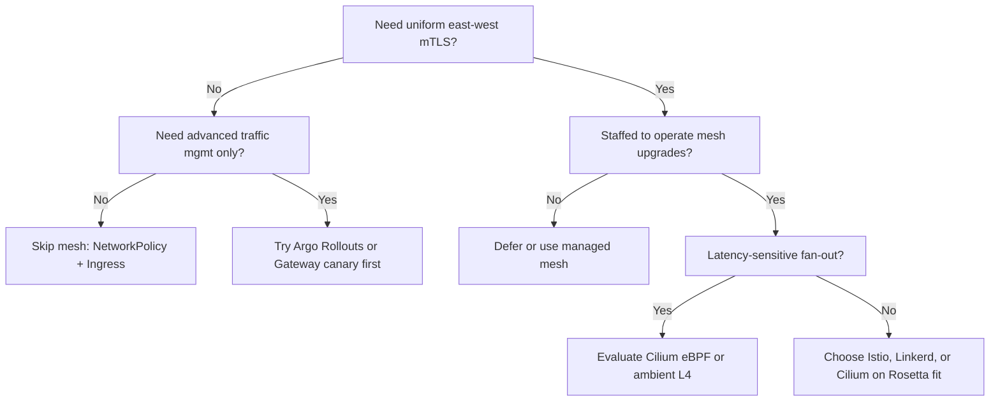

> **Complexity**: `[COMPLEX]` | **Time to Complete**: 60 minutes

---

## Prerequisites

Before starting this module, you should have completed:
- [Module 5.1: Cilium](../module-5.1-cilium/)
- Kubernetes Services and Ingress
- Basic understanding of proxies and TLS

---

## What You'll Be Able to Do

After completing this module, you will be able to:

- **Deploy Istio or Linkerd service mesh with mTLS, traffic management, and observability features**
- **Configure traffic splitting, circuit breaking, and retry policies for resilient microservice communication**
- **Implement service mesh authorization policies for zero-trust inter-service security**
- **Compare Istio, Linkerd, and Cilium service mesh approaches for different operational complexity levels**

## Why This Module Matters

**Hypothetical scenario:** A compliance audit finds east-west traffic inside a Kubernetes cluster still uses plaintext HTTP while ingress terminates TLS correctly. Application teams estimate months to embed certificates and retry logic into many services written in different languages. A platform team introduces mesh capabilities namespace by namespace, starting with PERMISSIVE mutual TLS and moving to STRICT once every caller sits behind the dataplane. The finding closes because encryption and identity become platform defaults rather than per-service science projects.

A service mesh is infrastructure that sits between your microservices and the network, offering consistent encryption, routing, resilience, and telemetry without rewriting application code. The pattern separates business logic from cross-cutting network concerns so platform teams can enforce policy once and every service inherits the same behavior regardless of language or framework.

Every mesh has two cooperating layers. The control plane is the brain: it discovers services, distributes configuration, and issues short-lived certificates. The data plane is the muscle: proxies or kernel programs intercept traffic and apply what the control plane decided. When you change a retry policy or tighten mTLS, you edit control-plane objects; data-plane components pick up the change through a configuration protocol such as xDS.

> **The Air-Traffic Analogy**
>
> The control plane is the tower issuing routes and certificates; the data plane is the fleet executing those instructions on every hop. Applications stay passengers focused on business logic while infrastructure handles the radar, separation, and emergency divert rules.

---

## The Mesh Value Proposition

The sidecar pattern became the default data-plane shape because it works with any application binary. An init container or CNI hook redirects pod traffic through a colocated proxy such as Envoy or Linkerd2-proxy. That transparency is powerful, but it is not free: every meshed pod runs an extra container, consumes memory and CPU, adds another hop on the network path, and must be upgraded whenever the mesh version changes.

Sidecarless designs respond to those costs. Istio ambient mode moves bulk encryption and routing to a per-node Layer 4 tunnel called ztunnel, then attaches optional Layer 7 waypoint proxies only where HTTP semantics matter. Cilium pushes policy and observability into the Linux kernel with eBPF, avoiding per-pod proxies for many flows. Linkerd keeps a lightweight Rust micro-proxy per pod but optimizes aggressively for minimal overhead. All three approaches are CNCF Graduated projects—you compare capabilities and tradeoffs, not marketing labels.

```
┌─────────────────────────────────────────────────────────────────┐
│              WITHOUT SERVICE MESH: INCONSISTENT APPS             │
├─────────────────────────────────────────────────────────────────┤
│  Service A (Java)          Service B (Go)                        │
│  ├── Custom retries        ├── Different retry library         │
│  ├── Maybe mTLS              ├── Plain HTTP                      │
│  └── Own tracing           └── Different trace format          │
│  Result: every team reinvents networking differently             │
└─────────────────────────────────────────────────────────────────┘

┌─────────────────────────────────────────────────────────────────┐
│              WITH SERVICE MESH: SHARED DATAPLANE                 │
├─────────────────────────────────────────────────────────────────┤
│  Apps implement business logic only                              │
│  Proxies or eBPF enforce mTLS, retries, metrics uniformly        │
└─────────────────────────────────────────────────────────────────┘
```

Traffic management is where a mesh earns operational respect beyond encryption. Request routing lets you send traffic to specific versions based on headers, paths, or weights. Traffic splitting implements canary and blue-green releases by shifting percentages between subsets without redeploying clients. Retries and timeouts absorb transient failures; circuit breaking and outlier detection stop hammering unhealthy backends before cascading failures spread across the graph.

### Control Plane and Data Plane in Practice

In Istio you express routing with VirtualService and subsets in DestinationRule. In Linkerd you often use ServiceProfile and TrafficSplit resources. With Gateway API and GAMMA, HTTPRoute objects attach directly to Kubernetes Services for east-west rules, converging ingress and mesh vocabulary. The durable lesson is identical: declare intent in the platform layer, measure impact in golden signals, and roll forward in small increments rather than flipping 100% at once.

When istiod or Linkerd controllers push updates, proxies acknowledge new listeners, clusters, and routes through xDS-style APIs. Applications rarely notice the change unless you alter routing weights during a canary. That separation of concerns is the core value proposition: network behavior becomes declarative configuration reviewed in pull requests instead of scattered library versions compiled into every binary.

---

## Traffic Management for Resilience

Retries look simple until you confront idempotency. A mesh retrying a POST that partially succeeded can duplicate side effects, so platform teams pair retry policies with timeout budgets and application-level idempotency keys. Circuit breaking complements retries by ejecting endpoints that accumulate consecutive errors, giving them time to recover while healthy replicas carry load. Fault injection then validates that your combination of retries, timeouts, and breakers actually behaves as designed before customers discover gaps during a real outage.

Mutual TLS upgrades cluster networking from encrypted pipes to authenticated identities. Regular TLS proves the server to the client; mTLS requires both sides to present certificates so a backend knows which Kubernetes service account initiated the call. Meshes typically integrate SPIFFE-style identities, issuing short-lived SVIDs rotated automatically instead of baking long-lived certs into every deployment manifest.

PeerAuthentication (Istio) or equivalent mesh settings define whether plaintext is tolerated during migration. PERMISSIVE mode accepts both cleartext and mTLS while you roll out sidecars; STRICT mode rejects unencrypted connections. Authorization policies layer on top, allowing only specific identities, methods, and paths. That combination implements a zero-trust east-west posture: compromise of one pod no longer grants implicit trust to every other service on the flat cluster network.

### Request Routing and Traffic Splitting

Canary releases shift weight between DestinationRule subsets or TrafficSplit backends while error budgets and latency metrics gate promotion. Blue-green patterns map to 0/100 weights with quick rollback by restoring previous VirtualService manifests from Git history.

```yaml
apiVersion: networking.istio.io/v1
kind: VirtualService
metadata:
  name: reviews-canary
spec:
  hosts:
    - reviews
  http:
    - route:
        - destination:
            host: reviews
            subset: v1
          weight: 90
        - destination:
            host: reviews
            subset: v2
          weight: 10
```

### Retries, Timeouts, and Circuit Breaking

```yaml
apiVersion: networking.istio.io/v1
kind: VirtualService
metadata:
  name: ratings-resilience
spec:
  hosts:
    - ratings
  http:
    - route:
        - destination:
            host: ratings
      timeout: 10s
      retries:
        attempts: 3
        perTryTimeout: 3s
        retryOn: gateway-error,connect-failure,refused-stream,5xx
---
apiVersion: networking.istio.io/v1
kind: DestinationRule
metadata:
  name: reviews-circuit-breaker
spec:
  host: reviews
  trafficPolicy:
    outlierDetection:
      consecutive5xxErrors: 5
      interval: 30s
      baseEjectionTime: 30s
```

Proxies sit on the request path, so they observe every call with uniform labels: source, destination, response code, latency histograms, and bytes transferred. Those golden signals feed Prometheus-style metrics without instrumenting each language stack differently. Distributed tracing propagates trace context headers consistently, stitching spans across services even when some teams forgot to add OpenTelemetry SDKs to legacy binaries.

---

## Security: Mutual TLS and Authorization

Service graphs—Kiali for Istio, Linkerd Viz, Hubble for Cilium—turn metrics into topology you can reason about during incidents. When latency spikes, the graph shows whether the regression sits on an edge, inside a fan-out hub, or at a single degraded destination. The mesh does not replace application logging, but it gives platform engineers a shared, hop-by-hop view that application teams alone rarely export consistently.

Understanding the data-plane evolution helps you pick an architecture that matches your latency budget and operational appetite. Classic sidecars offer maximum Layer 7 flexibility at the cost of per-pod resources. Ambient mode amortizes encryption across nodes and adds waypoints surgically. eBPF dataplanes reduce userspace hops for many policies but still require clear stories for HTTP semantics and upgrades. No single shape wins every workload; high fan-out hubs and batch workers often deserve different treatment within the same cluster.

```yaml
apiVersion: security.istio.io/v1
kind: PeerAuthentication
metadata:
  name: default
  namespace: production
spec:
  mtls:
    mode: PERMISSIVE
---
apiVersion: security.istio.io/v1
kind: AuthorizationPolicy
metadata:
  name: backend-authz
  namespace: production
spec:
  selector:
    matchLabels:
      app: backend
  action: ALLOW
  rules:
    - from:
        - source:
            principals:
              - cluster.local/ns/production/sa/frontend
      to:
        - operation:
            methods: ["GET", "POST"]
            paths: ["/api/*"]
```

Verify mutual TLS with mesh-specific tooling such as `istioctl authn tls-check` or Linkerd's `linkerd viz edges` to confirm edges show locked icons before declaring STRICT mode in production.

---

## Observability from the Proxy

Gateway API began as a north-south ingress story, yet service mesh users wanted the same Route objects for east-west traffic. The GAMMA initiative defines how HTTPRoute and GRPCRoute attach to Services instead of Gateways when a mesh is the implementation. Implementations including Istio, Linkerd, and Cilium participate at varying maturity levels, but the direction is clear: one declarative routing vocabulary spanning ingress controllers and meshes.

Adopt a mesh when multiple teams need uniform mTLS, progressive delivery, and telemetry without shipping duplicate libraries in Java, Go, Python, and Node. Defer when a handful of services only needs canary rollouts—Argo Rollouts or Ingress-level splitting may suffice. Treat mesh complexity as a tax you pay for consistency at scale; if you cannot staff upgrades, debugging, and certificate incidents, lighter NetworkPolicy plus ingress hardening may be the honest answer for your maturity level.

Golden signals—latency, traffic, errors, and saturation—should be charted per dependency edge so regressions surface during canaries rather than after full cutover. Distributed traces need consistent propagation headers enforced at the dataplane when legacy services omit SDK configuration.

---

## Data-Plane Evolution: Sidecar, Ambient, and eBPF

Hypothetical scenario: during a compliance audit, assessors discover that east-west traffic inside a Kubernetes cluster remains plaintext even though ingress TLS is configured correctly. Application teams estimate months of work to embed certificates and retry logic into dozens of services written in different languages. A platform team introduces a mesh namespace by namespace, enabling PERMISSIVE mTLS first, then STRICT once sidecars or ambient nodes cover every caller. The audit finding closes not because security theater improved, but because identity and encryption became infrastructure defaults.

The checkout path in high-traffic retail platforms often fans out to many downstream calls for inventory, tax, fraud, and payments. Meshing such a hub multiplies proxy overhead on every hop, so architects either exclude the hub, collapse calls via aggregation, or move to a sidecarless dataplane for bulk encryption. Load testing must include meshed paths at peak multiplier, not just average weekday traffic, because memory limits that suffice at 1× traffic may exhaust sidecar buffers at 8×.

Control-plane availability is a hidden dependency: if istiod or Linkerd controllers are unavailable, existing proxies often keep last-known-good config, but new pods may fail injection or certificate issuance. Run control-plane components like any other tier-one service—with pod disruption budgets, multi-replica deployments, and alerts on certificate mint failures. Disaster recovery plans should document how to disable injection quickly if a bad config propagates cluster-wide.

Sidecar deployments remain appropriate when you require rich per-pod Layer 7 policy and your team accepts the resource bill. Ambient mode suits clusters seeking mTLS everywhere with waypoints only on services that need HTTP routing. Cilium's eBPF dataplane appeals when you already standardize on Cilium CNI and want sidecar-free encryption plus Hubble visibility.

---

## Gateway API, GAMMA, and Mesh Convergence

Multi-cluster mesh scenarios extend identity and routing across administrative boundaries. Istio ambient mode gained multi-cluster capabilities in 2026 releases; Linkerd offers multicluster linking with mirrored services; Cilium leverages cluster mesh for policy and connectivity. The durable requirement is consistent trust domains: SPIFFE trust bundles must align, and blast radius must be bounded so a misconfigured export in one cluster cannot open lateral movement everywhere.

```yaml
apiVersion: gateway.networking.k8s.io/v1
kind: HTTPRoute
metadata:
  name: reviews-route
spec:
  parentRefs:
    - kind: Service
      name: reviews
      port: 9080
  rules:
    - backendRefs:
        - name: reviews-v2
          port: 9080
```

East-west HTTPRoute attachment to Services is the hallmark GAMMA pattern; ingress continues to bind Routes to Gateway objects. Consult implementation-specific guides because merge rules and status conditions differ slightly between Istio, Linkerd, and Cilium controllers.

---

## Landscape snapshot — as of 2026-09. This changes fast; verify against vendor docs before relying on specifics.

Istio latest supported release line in September 2026 is **1.31.0** (with the 1.30.x patch stream at **1.30.4**; 1.28 reached EOL 2026-07-01 and 1.29 support ends 2026-10-12). Ambient mode reached GA in **Istio 1.24** (late 2024) with stable ztunnel, waypoint proxies, and policy APIs; 2026 releases added ambient multi-cluster features and Gateway API inference extensions per Istio release notes. Linkerd publishes **stable 2.20** open-source docs (Buoyant Enterprise for Linkerd tracks enterprise-2.20.x with semantic versioning) plus faster-moving **edge** builds such as edge-26.9.1 for early features. Cilium service mesh continues on the current Cilium stable / docs default track (the 1.20.x line)—confirm your CNI chart version before enabling mesh APIs.

### Service Mesh Rosetta

| Durable capability | Istio | Linkerd | Cilium |
|--------------------|-------|---------|--------|
| Data-plane model | Envoy sidecar by default; ambient ztunnel + optional waypoint | Rust linkerd2-proxy sidecar | eBPF kernel dataplane; sidecar-free option |
| mTLS identity | SPIFFE via istiod | SPIFFE via control plane | SPIFFE integrated with Cilium identity |
| L7 traffic management | VirtualService, DestinationRule; Gateway API (incl. GAMMA) | ServiceProfile, TrafficSplit; Gateway API Mesh profile | CiliumNetworkPolicy L7; Gateway API support |
| Multi-cluster | Multi-primary and ambient multi-cluster (2026) | Multicluster linking / mirroring | ClusterMesh |
| Sidecar vs sidecarless | Both sidecar and ambient sidecarless paths | Sidecar micro-proxy | Sidecar-free eBPF; optional Envoy where needed |
| eBPF usage | Optional via CNI partners; ambient ztunnel | Not eBPF-based dataplane | Native eBPF throughout |

Egress control is frequently the reason teams revisit mesh policy after ingress is solved. ServiceEntry and equivalent constructs declare external dependencies explicitly, letting you apply mTLS inside and controlled egress outside. Without that visibility, applications phone home to unknown endpoints and auditors rightfully ask who approved each path.

---

## Operational Depth: Production Considerations

Connection pool limits in DestinationRule protect backends from retry storms, yet overly aggressive pools can throttle legitimate bursts during marketing events. Tune pools using historical peak concurrency per dependency, then revalidate after major catalog or pricing changes.

Waypoints in ambient mode concentrate Layer 7 policy at logical boundaries—often a namespace or service account—rather than at every pod. That reduces resource churn but requires explicit placement decisions: missing a waypoint means HTTP policies simply do not execute even though ztunnel still encrypts traffic.

Cilium service mesh leverages the same eBPF programs that enforce network policy, meaning identity labels on pods drive both firewall rules and mesh authentication. Teams already running Cilium for CNI should evaluate mesh features before introducing a second dataplane, though they must confirm HTTP-level needs are met without Envoy sidecars.

Linkerd's Rust micro-proxy prioritizes safety and predictable latency over maximal extensibility. Buoyant stewards the project and publishes stable enterprise releases on a semantic versioning cadence; open-source edge builds exist for early adopters. Evaluate proxy memory on your smallest pod size class—what is negligible on a 2 GiB JVM service may dominate a 64 MiB function-style container.

Istio's ambient GA arrived in version 1.24 with stable ztunnel, waypoint, and policy APIs; subsequent releases refined multi-cluster ambient and Gateway API inference extensions. Pin documentation snapshots by date because minor releases ship monthly and behavior under edge-case combinations (dual-stack, multi-network interfaces) continues to mature.

AuthorizationPolicy default-deny patterns mirror Kubernetes RBAC philosophy: start explicit, log denials, widen only with evidence. Implicit allow-all mesh configs satisfy demos but fail zero-trust reviews because any compromised identity inherits carte blanche.

Telemetry cardinality explodes when every pod emits unique label combinations. Platform teams standardize on destination_service, response_code, and source_workload labels while avoiding unbounded path labels unless sampling strategies exist.

Upgrade sequencing matters: control plane first, data plane second, validation gates between namespaces. Skipping verification after bumping istiod while proxies lag versions is a common source of cryptic xDS rejections in Envoy logs.

NetworkPolicy and mesh policy are complementary, not redundant. NetworkPolicy restricts who may connect at L3/L4; mesh authorization inspects identity and HTTP semantics at L7. Relying on only one layer leaves gaps attackers can traverse after compromising a permitted pod.

Service mesh interfaces historically included the SMI spec; Gateway API GAMMA now carries much of the portable routing intent. Prefer APIs your chosen implementation documents as supported rather than assuming every example port cleanly between vendors.

Debugging mesh incidents benefits from a checklist: verify injection labels, confirm secrets issued, inspect proxy config dump, compare VirtualService or HTTPRoute precedence, then examine application logs. Jumping straight to disabling mTLS often hides the underlying misconfiguration that will return on the next rollout.

Cost models should include control-plane nodes, sidecar memory tax, observability storage, and engineer training. A mesh that saves developer library work but doubles node spend may still be worthwhile when compliance mandates uniform encryption; the opposite is also true for small staging clusters.

Batch and streaming workloads with long-lived connections behave differently under outlier detection than stateless REST microservices. Tune ejection thresholds so brief GC pauses do not drain an entire replica set from load balancing.

GitOps fits mesh configuration well: VirtualServices and HTTPRoutes live in Git, roll through pull requests, and sync via controllers. Emergency break-glass procedures still belong in runbooks for when Git is unavailable during an outage.

Testing mTLS migration with PERMISSIVE mode requires telemetry proving plaintext share trends to zero before flipping STRICT. Dashboards should chart percentage of mutual connections per namespace rather than relying on a single successful curl test.

High-cardinality service graphs become unreadable without namespace scoping and request rate filters. Train on-call engineers to start investigations scoped to affected namespaces before attempting cluster-wide graph renders that time out in the browser.

Proxy access logs complement metrics during incidents but can overwhelm logging pipelines at full sampling. Use structured logs with adjustable sampling defaults, raising fidelity temporarily when debugging a specific edge.

Language-specific gRPC and HTTP/2 settings interact with mesh retries; double-check that retry budgets respect server max concurrent streams to avoid amplifying overload during partial failures. Platform teams should validate this behavior in staging before promoting the same configuration to production traffic.

Identity federation across clouds requires aligning trust domains and DNS for service discovery. Document which cluster issues certificates for which spiffe IDs before enabling cross-cluster routes in production.

Minimal clusters running three services rarely justify mesh control planes; a well-scoped Ingress plus NetworkPolicy plus centralized logging often meets the same risk profile with fewer moving parts.

Platform onboarding should include a mesh sandbox namespace where engineers inject faults and observe breaker behavior without touching production catalogs. Platform teams should validate this behavior in staging before promoting the same configuration to production traffic.

Document kill switches: namespace labels disabling injection, ambient mode off-ramps, and Helm values pinning last-known-good control-plane versions. Platform teams should validate this behavior in staging before promoting the same configuration to production traffic.

SLO definitions for mesh-managed services must account for added proxy latency in error budgets; otherwise product teams blame application regressions for infrastructure overhead. Platform teams should validate this behavior in staging before promoting the same configuration to production traffic.

Vendor-managed meshes on EKS, GKE, or AKS shift upgrade responsibility but not architectural understanding—you still own identity, routing rules, and blast radius. Platform teams should validate this behavior in staging before promoting the same configuration to production traffic.

HTTPRoute weight splits for canaries require metric gates: promote traffic only when error rate and latency remain within SLO during the partial shift window. Platform teams should validate this behavior in staging before promoting the same configuration to production traffic.

SPIFFE IDs encode trust domain and workload identity; authorization rules should reference principals, not IP addresses that churn with every rollout. Platform teams should validate this behavior in staging before promoting the same configuration to production traffic.

Sidecar startup order ensures iptables or eBPF redirection is ready before application containers accept traffic; readiness probes must reflect mesh availability, not only app health. Platform teams should validate this behavior in staging before promoting the same configuration to production traffic.

Mesh policies do not replace secrets management; they protect data in motion while Vault or cloud KMS still protect data at rest and bootstrap trust. Platform teams should validate this behavior in staging before promoting the same configuration to production traffic.

Observability backends should retain enough history to compare pre-mesh and post-mesh latency distributions when leadership asks whether complexity paid off. Platform teams should validate this behavior in staging before promoting the same configuration to production traffic.

Run game days that disable a waypoint or ztunnel node to validate node-level failure does not violate availability targets for stateless tiers. Platform teams should validate this behavior in staging before promoting the same configuration to production traffic.

Prefer progressive namespace meshing aligned with team ownership boundaries rather than big-bang cluster-wide injection that mixes unrelated blast radii. Platform teams should validate this behavior in staging before promoting the same configuration to production traffic.

Keep a roster of services exempt from mesh with written rationale—high fan-out hubs, legacy binary protocols, or hardware-adjacent agents—reviewed quarterly. Platform teams should validate this behavior in staging before promoting the same configuration to production traffic.

Align mesh rollout with CI pipelines so new services inherit injection labels and policy templates automatically instead of relying on ticket-driven follow-up. Platform teams should validate this behavior in staging before promoting the same configuration to production traffic.

Translate auditor questions into demonstrable controls: show mTLS status checks, authorization denials logged, and canary rollback executed under timed drill conditions. Platform teams should validate this behavior in staging before promoting the same configuration to production traffic.

When comparing Istio, Linkerd, and Cilium, score operational complexity alongside feature breadth: a richer API surface helps only if your team will maintain those objects under on-call pressure.

Ambient and eBPF options reduce per-pod tax but introduce new expertise requirements—node-level dataplane debugging differs from kubectl exec into Envoy admin ports. Platform teams should validate this behavior in staging before promoting the same configuration to production traffic.

Gateway API conformance profiles include Mesh; verify your chosen implementation documents which profile version it passes before standardizing HTTPRoute examples from tutorials. Platform teams should validate this behavior in staging before promoting the same configuration to production traffic.

Inference extensions in recent Istio releases illustrate how mesh dataplanes evolve beyond traditional microservices toward model-serving paths—watch vendor release notes for dataplane impacts even if you do not serve models today.

Linkerd stable releases track Kubernetes versions explicitly; confirm compatibility tables before upgrading cluster minor versions and mesh versions in the same change window. Platform teams should validate this behavior in staging before promoting the same configuration to production traffic.

Cilium ClusterMesh plus service mesh features can unify policy across clusters; plan identity and IP address overlap carefully to avoid ambiguous routing decisions. Platform teams should validate this behavior in staging before promoting the same configuration to production traffic.

Document expected proxy memory per thousand requests per second for your workload class after baseline load tests; use those numbers in Vertical Pod Autoscaler recommendations. Platform teams should validate this behavior in staging before promoting the same configuration to production traffic.

Treat mesh configuration like firewall rules: periodic audits removing stale VirtualServices prevent mysterious traffic blackholes months after services decommission. Platform teams should validate this behavior in staging before promoting the same configuration to production traffic.

Success criteria for mesh adoption include measurable reduction in bespoke retry libraries, improved mTLS coverage percentages, and faster incident isolation using service graphs—not merely installing control planes without adoption evidence. Platform teams should validate this behavior in staging before promoting the same configuration to production traffic.

Finally, revisit the mesh adoption decision annually: clusters that outgrow mesh complexity sometimes consolidate, while clusters that mature operationally may finally justify mesh after earlier deferrals when staffing and compliance requirements catch up to the pattern. Platform teams should validate this behavior in staging before promoting the same configuration to production traffic.

Warm-up sidecar or ambient dataplane caches before cutting over marketing traffic so TLS session establishment and route propagation complete under realistic concurrency rather than cold-start latencies misleading your rollback decision during the first minutes of a canary.

Pair mesh rollout with service catalog metadata recording which teams own authorization policies for each API surface, preventing orphaned VirtualServices when reorganizations rename namespaces but Git repositories retain stale hosts entries pointing at deleted services.

Treat mesh upgrade windows like Kubernetes upgrades: read release notes for breaking changes to PeerAuthentication defaults, validate in a clone cluster mirroring production CRD counts, and snapshot etcd backups even though mesh config lives in Kubernetes API objects under your GitOps repository.

Document how batch cron jobs interact with STRICT mTLS when they run outside meshed namespaces; injectors skip those namespaces unless labels demand it, and auditors will ask why a nightly reconciliation job still speaks plaintext to a meshed API.

Align probe paths with authorization policies so kubelet health checks hitting /healthz from the node network namespace are not accidentally classified as unauthorized east-west traffic when you enable deny-by-default rules copied from production hardening guides.

Use destination rule connection limits to protect databases from mesh retry amplification when an upstream service marks transient errors retryable; without pool caps, a single flaky API can multiply queries against shared PostgreSQL primaries by an order of magnitude.

Evaluate ambient mode when memory overhead blocks pod density on cost-optimized node types; ztunnel amortizes encryption across pods on the same node while waypoints appear only on services whose HTTP routing rules justify Layer 7 inspection costs.

Compare Linkerd when your pod size classes are small and your feature needs center on mTLS, golden metrics, and simple splits rather than exhaustive Envoy filter chains; the Rust proxy footprint stays predictable across languages you do not control.

Leverage Cilium when Hubble already provides flow visibility for CNI policy and you want mesh authentication without doubling dataplanes; confirm gRPC and HTTP L7 policies required by security actually exist in your chart version before committing.

Integrate external authorization when JWT validation belongs at the mesh edge rather than duplicated in every framework; OAuth2 introspection or custom gRPC ext_authz filters centralize token policy while application code consumes trusted headers cautiously with defense in depth.

Schedule quarterly reviews of exempted services because organizational memory fades and new engineers mesh namespaces without reading historical rationale, reintroducing latency multiplication on hubs that were deliberately excluded two years earlier during a Black-Friday-scale incident response.

Publish dashboards comparing p99 latency before and after mesh per service tier so leadership sees tradeoffs transparently; hiding overhead erodes trust when product teams discover added hop latency during their own profiling sessions unrelated to platform announcements.

Require pull request reviewers for mesh routes to include a platform engineer who validates precedence, subset existence, and mTLS mode interactions; application developers understand business paths while platform reviewers catch missing DestinationRule subsets that blackhole canary traffic silently.

Model failure domains for control plane components across availability zones; a single-zone istiod deployment saves cost until that zone degrades and new pod scheduling cannot obtain certificates while incident traffic spikes demand horizontal scaling that injection would enable.

Capture packet captures sparingly when mesh and application disagree on TLS errors; start with proxy config dumps and access logs before tcpdump because encrypted payloads rarely reveal policy mistakes visible in Envoy cluster health or Istio analyze output.

Align service naming with VirtualService hosts so cluster DNS names, Kubernetes Service objects, and route hosts stay consistent; typos between reviews.default.svc.cluster.local and reviews.prod cause subtle partial migrations where only some clients hit meshed routes.

Use fault injection in staging to prove circuit breakers eject bad endpoints before production chaos; injecting delay without verifying outlier detection gives false confidence that resilience exists because retries succeed on healthy replicas while unhealthy ones still receive blind round-robin share.

Document maximum safe header sizes for your mesh implementation when applications embed large JWT or tracing baggage; proxies enforce limits distinct from application servers and return 431 responses that look like application bugs in centralized logging if labels omit mesh attribution.

Plan certificate rotation drills because short-lived SVIDs renew automatically until they do not; simulate istiod outage and verify proxies continue with cached roots and that alerts fire when issuance lag exceeds thresholds defined in your SLO documents for identity infrastructure.

Coordinate mesh adoption with API versioning strategy so canary weights align with semantic version routes; mixing header-based canaries with weight splits without documentation yields situations where mobile clients on old app versions hit v2 backends incompatible with their payload shapes.

Expose mesh metrics through the same Prometheus federation model as application metrics so on-call engineers need not context-switch between siloed observability stacks during incidents that span both Envoy 503 rates and JVM heap exhaustion on the same dependency graph edge.

Train security reviewers to read SPIFFE IDs in authorization policies rather than IP-based rules inherited from pre-Kubernetes era playbooks; meshed identity is the enforcement primitive while IPs remain ephemeral and meaningless for zero-trust acceptance criteria in modern audits.

Validate IPv6 dual-stack behavior if your cluster enables it mid-migration; mesh redirection and ztunnel binding assumptions differ from IPv4-only labs and deserve explicit test cases before declaring STRICT coverage complete across both address families in production namespaces.

Consider managed mesh offerings when staffing constraints exceed feature appetite; Google GKE ASM, AWS App Mesh, and similar products shift upgrade toil but still require your team to understand routes, identity, and blast radius because misconfigurations remain yours regardless of who ships the control-plane binaries.

Rehearse rollback of a bad VirtualService during game days by restoring Git commits and measuring time-to-recovery; teams that only practice forward rollout discover during real incidents that they lack permissions or pipeline paths to revert mesh config as quickly as application deployments.

Separate staging mesh trust domains from production so mis-issued certificates during testing never validate in production identities; SPIFFE trust bundle wiring deserves the same rigor as TLS certificates on public websites even though east-west traffic feels internal to engineers accustomed to flat networks.

Apply pod disruption budgets to waypoint and ingress gateways because node drains during cluster upgrades otherwise evict concentrated Layer 7 capacity that many namespaces share, creating correlated failures unrelated to application release cadence but timed with infrastructure maintenance windows.

Capture baseline retry rates before enabling mesh-wide automatic retries; if applications already retry aggressively, mesh-level retries multiply attempts and can trigger downstream rate limits that appear as new incidents attributed incorrectly to recent mesh adoption rather than compounded retry policy.

Use namespace labels as the primary injection switch but document exceptions in a central registry; ad hoc pod annotations for inject false without registry entries become mysteries during the next platform engineer rotation when unexplained plaintext edges appear in service graph visualizations during compliance scans.

Evaluate HTTPRoute port matching carefully under GAMMA because attaching routes to Services with multiple ports routes ambiguity into merge conflicts; explicit port references in parentRefs prevent accidentally steering gRPC traffic with HTTP rules intended for a different listener on the same Service object.

Treat mesh as complementary to API gateways at the edge: north-south gateways handle external clients, east-west mesh handles service-to-service policy, and overlap should be deliberate rather than two independent teams configuring conflicting timeouts on the same user journey without coordination meetings.

Instrument canary analysis with business metrics, not only RED metrics, because error rates can look fine while checkout conversion drops when latency crosses human patience thresholds; mesh traffic splits make technical promotion easy without guaranteeing product outcomes unless product metrics gate weight increases.

Store mesh CA roots and rotation procedures in disaster recovery documentation alongside etcd restore steps; rebuilding a cluster without understanding how istiod or Linkerd identity issuers re-bootstrap leaves you with pods that cannot authenticate even when applications deploy successfully from unchanged container images.

Review upstream dependency SLAs when configuring aggressive outlier detection; ejecting endpoints quickly helps your SLO but may violate vendor guidance for shared multi-tenant APIs that rate-limit rapid reconnect patterns triggered by aggressive ejection and immediate re-admission cycles on the same pods.

Align mesh project selection workshops with concrete scenarios drawn from your architecture review backlog rather than generic feature matrices; teams decide faster when comparing how each CNCF Graduated option handles your actual egress broker, payment fan-out, or multi-cluster failover story with recorded non-functional requirements.

Celebrate de-meshing when complexity exceeds value; platforms mature by removing layers as well as adding them, and retiring an unused control plane after consolidating services is a sign of architectural honesty rather than admission of failure if documentation captures why the tax no longer pays off for the teams involved.

---

## Patterns and Anti-Patterns

### Patterns That Work

| Pattern | Why it helps |
|---------|--------------|
| Namespace-scoped rollout | Limits blast radius while teams learn injection and policies |
| PERMISSIVE before STRICT mTLS | Lets legacy clients connect while sidecars deploy |
| Metric-gated canaries | Promotes traffic only when error budgets stay green |
| Explicit egress ServiceEntry | Documents external dependencies for auditors |
| GitOps-managed routes | Makes rollback a revert, not improvisation |

### Anti-Patterns to Avoid

| Anti-Pattern | Why it hurts | Better approach |
|--------------|--------------|-----------------|
| Cluster-wide injection day one | Breaks system components | Exclude kube-system; mesh app namespaces incrementally |
| Ignoring proxy resource limits | OOM under load | Size from load tests; set memory/CPU requests |
| Meshing high-fanout hubs | Latency multiplies | Exclude, aggregate calls, or use sidecarless L4 |
| Authorization allow-all defaults | Fails zero-trust reviews | Default deny with explicit ALLOW rules |
| No emergency disable procedure | Long outages during bad configs | Document injection off labels and backups |

### Decision Framework



Header-based routing enables progressive exposure of features to internal testers before external customers, but it also creates footguns when caches or intermediaries strip headers. Document required headers in runbooks and validate behavior under realistic client libraries, not only curl from a debug pod.

---

## Did You Know?

- **CNCF Graduation**: Istio (July 2023), Linkerd (July 2021), and Cilium (October 2023) are all CNCF Graduated projects—peers with different dataplane philosophies rather than a single vendor winner.

- **Ambient GA milestone**: Istio maintainers announced ambient mode general availability in Istio 1.24, marking ztunnel, waypoint, and core APIs stable for production ambient deployments.

- **Linkerd proxy engineering**: Linkerd's data plane uses a purpose-built Rust micro-proxy rather than Envoy, a design choice Buoyant documents for safety and minimal overhead.

- **GAMMA convergence**: The Gateway API GAMMA initiative defines attaching HTTPRoute objects directly to Services for east-west mesh routing, aligning ingress and mesh configuration vocabularies.

---

## Common Mistakes

| Mistake | Impact | Solution |
|---------|--------|----------|
| Enabling mesh cluster-wide immediately | System pods fail injection | Start with one application namespace |
| Not excluding kube-system | DNS and control components break | Label system namespaces inject=disabled |
| STRICT mTLS on day one | Legacy clients fail silently | Use PERMISSIVE until coverage metrics hit 100% |
| Default sidecar resources | Proxy OOM during traffic spikes | Set explicit CPU/memory from load tests |
| Too many overlapping routes | Config precedence fights | Consolidate rules; document ownership |
| Ignoring proxy metrics | App blamed for mesh issues | Alert on 5xx and latency from proxy stats |
| Meshing high-fanout services | Latency multiplies per hop | Exclude hubs or redesign aggregation |
| Skipping kill-switch drills | Long incidents during bad rollouts | Practice disabling injection under timebox |

---

## Quiz

<details>
<summary>1. What roles do the data plane and control plane play in a service mesh?</summary>

The control plane discovers services, distributes configuration, and issues certificates without touching application bytes directly. The data plane—sidecar proxies, ztunnel nodes, or eBPF programs—intercepts live traffic and enforces mTLS, routing, retries, and telemetry. Deploying Istio or Linkerd successfully requires both layers healthy: istiod or Linkerd controllers plus injected or ambient dataplane components. When either layer fails, symptoms differ: control-plane outages block new certificates while existing proxies may continue last-known-good routes.
</details>

<details>
<summary>2. How do traffic splitting, retries, and circuit breaking work together for resilient microservice communication?</summary>

Traffic splitting sends only a fraction of requests to a new version while metrics guard promotion. Retries absorb transient network blips or brief 503 responses with bounded attempts and per-try timeouts so callers do not hang indefinitely. Circuit breaking via outlier detection ejects replicas that accumulate consecutive errors, preventing retry storms from overwhelming a degraded dependency. Together they implement progressive delivery plus failure containment—the configure traffic splitting, circuit breaking, and retry policies outcome this module emphasizes.
</details>

<details>
<summary>3. Why implement mesh authorization policies after enabling mTLS?</summary>

Mutual TLS proves which identity connects, but authorization decides whether that identity may perform specific operations on a path. AuthorizationPolicy objects default to implicit deny once you opt into deny-by-default patterns, allowing only listed principals and methods. This implements zero-trust east-west posture: encryption without authorization still lets any compromised meshed identity call any backend. Pair STRICT mTLS with explicit ALLOW rules and audit logs for denials.
</details>

<details>
<summary>4. How do Istio, Linkerd, and Cilium differ in operational complexity and dataplane shape?</summary>

Istio offers sidecar and ambient paths with broad traffic APIs and corresponding operational surface. Linkerd ships a minimal Rust sidecar focused on core mesh features with lower per-pod overhead. Cilium integrates mesh into an eBPF kernel dataplane attractive when Cilium is already your CNI. Compare them on Rosetta capabilities—mTLS, L7 routing, multi-cluster, sidecarless options—not popularity claims. Pick the smallest feature set that meets requirements your team can run during on-call weekends.
</details>

<details>
<summary>5. When should you choose PERMISSIVE instead of STRICT mutual TLS?</summary>

PERMISSIVE mode accepts both plaintext and mTLS while sidecars or ambient nodes roll out, letting unmigrated clients function during transition. Monitor metrics until plaintext share reaches zero, then switch PeerAuthentication to STRICT. Jumping to STRICT immediately often breaks batch jobs or namespaces without injection enabled. Treat PERMISSIVE as a measured migration stage with explicit exit criteria, not a permanent compliance posture.
</details>

<details>
<summary>6. What latency risk does meshing a high-fanout checkout service create?</summary>

Each meshed hop adds proxy processing and TLS work; a checkout flow calling dozens of downstream services multiplies that overhead. Under peak traffic, sidecars may also contend for memory unless sized correctly. Mitigations include excluding the hub from injection, collapsing downstream calls, adopting ambient L4 encryption with selective waypoints, or moving bulk encryption to eBPF. Load tests must simulate peak fan-out, not average single-dependency calls.
</details>

<details>
<summary>7. How does GAMMA change Gateway API usage for east-west traffic?</summary>

GAMMA specifies attaching HTTPRoute or GRPCRoute parentRefs to Kubernetes Services instead of Gateways when configuring mesh implementations. That lets teams reuse Route objects for in-cluster routing while Gateways remain north-south entry points. Merge rules still apply when multiple Routes bind the same Service, so coordinate namespace owners to avoid conflicting weights. Verify your implementation's Mesh conformance profile before porting tutorials verbatim.
</details>

<details>
<summary>8. What is the difference between a VirtualService and a DestinationRule in Istio?</summary>

VirtualService defines routing logic—matches, weights, faults, retries, and timeouts—for traffic headed to a host. DestinationRule defines subsets (version labels), connection pools, load-balancing algorithms, and outlier detection for traffic arriving at destinations. Canaries typically pair a VirtualService weight split with DestinationRule subsets naming v1 and v2. Understanding both objects prevents misconfigured precedences where routing points to subsets that do not exist.
</details>

---

## Hands-On Exercise

Deploy Istio on a learning cluster, enable strict mutual TLS for the default namespace, shift reviews traffic with a canary VirtualService, and confirm edges in Kiali or equivalent tooling.

```bash
curl -L https://istio.io/downloadIstio | ISTIO_VERSION=1.31.0 sh -
cd istio-1.31.0
export PATH=$PWD/bin:$PATH
istioctl install --set profile=demo -y
kubectl label namespace default istio-injection=enabled --overwrite
kubectl apply -f samples/bookinfo/platform/kube/bookinfo.yaml
kubectl apply -f samples/addons/prometheus.yaml
kubectl apply -f samples/addons/kiali.yaml
```

Enable STRICT mTLS and verify:

```bash
kubectl apply -f - <<EOF
apiVersion: security.istio.io/v1
kind: PeerAuthentication
metadata:
  name: default
  namespace: default
spec:
  mtls:
    mode: STRICT
EOF
istioctl authn tls-check $(kubectl get pod -l app=productpage -o jsonpath='{{.items[0].metadata.name}}').default productpage.default.svc.cluster.local
```

Apply a 90/10 canary on reviews, generate traffic, and open Kiali:

```bash
kubectl apply -f samples/bookinfo/networking/destination-rule-reviews.yaml
kubectl apply -f - <<EOF
apiVersion: networking.istio.io/v1
kind: VirtualService
metadata:
  name: reviews
spec:
  hosts: [reviews]
  http:
    - route:
        - destination:
            host: reviews
            subset: v1
          weight: 90
        - destination:
            host: reviews
            subset: v2
          weight: 10
EOF
for i in $(seq 1 50); do kubectl exec deploy/productpage -c productpage -- curl -sS http://productpage:9080/productpage >/dev/null; done
istioctl dashboard kiali
```

### Success Criteria

- [ ] Bookinfo pods show injected proxy containers ready alongside application containers
- [ ] `istioctl authn tls-check` reports OK with STRICT mutual TLS for productpage
- [ ] Kiali or metrics show weighted traffic split toward reviews v2 near ten percent
- [ ] You can document steps to disable injection on a namespace if a bad config deploys

When you finish, remove Bookinfo and the demo control plane with `kubectl delete -f samples/bookinfo/platform/kube/bookinfo.yaml` followed by `istioctl uninstall --purge -y` so the learning cluster returns to a clean state without leftover mutating webhooks or CRDs that might surprise the next module exercise.

---

## Sources

- [Istio Documentation](https://istio.io/latest/docs/)
- [Istio Ambient Mode Overview](https://istio.io/latest/docs/ops/ambient/)
- [Announcing Istio 1.24 — Ambient GA](https://istio.io/latest/news/releases/1.24.x/announcing-1.24/)
- [Announcing Istio 1.31.0](https://istio.io/latest/news/releases/1.31.x/announcing-1.31/)
- [Linkerd Overview](https://linkerd.io/2.20/overview/)
- [Linkerd Releases](https://github.com/linkerd/linkerd2/releases)
- [Cilium Service Mesh](https://docs.cilium.io/en/stable/network/servicemesh/)
- [CNCF Istio Project](https://www.cncf.io/projects/istio/)
- [CNCF Linkerd Project](https://www.cncf.io/projects/linkerd/)
- [CNCF Cilium Project](https://www.cncf.io/projects/cilium/)
- [Gateway API GAMMA Initiative](https://gateway-api.sigs.k8s.io/docs/mesh/gamma/)
- [Gateway API Mesh Overview](https://gateway-api.sigs.k8s.io/docs/mesh/mesh-overview/)
- [SPIFFE Documentation](https://spiffe.io/docs/latest/spiffe-about/overview/)

---

## Next Module

Continue to [Scaling & Reliability Toolkit](/platform/toolkits/developer-experience/scaling-reliability/) to learn about Karpenter for node autoscaling, KEDA for event-driven scaling, and Velero for backup and disaster recovery.
