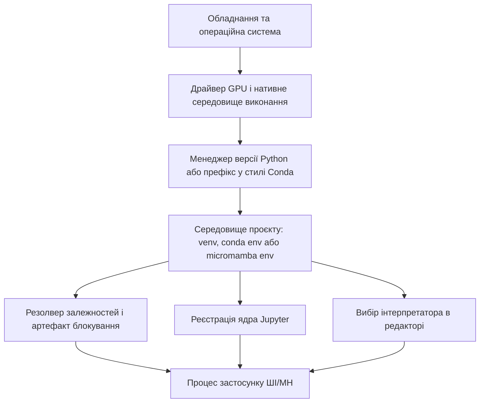
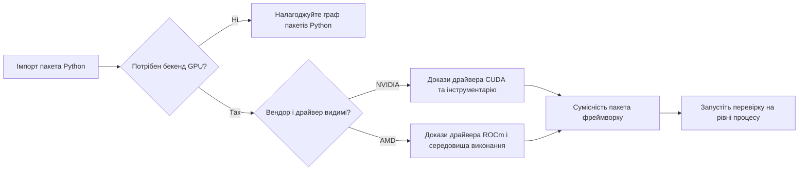

> **Трек «Інженерія ШІ/МН»** | Складність: `[ШВИДКИЙ]` | Час: 2-3 години
>
> **Передумови**: робоча станція, якою ви керуєте, доступ до термінала, встановлений Git і дозвіл встановлювати інструменти розробки

## Результати навчання

Наприкінці цього модуля ви зможете:

- **Проаналізувати** середовище робочої станції ШІ/МН, розділяючи володіння інтерпретатором, ізоляцію пакетів, нативні бібліотеки середовища виконання, виявлення редактора та ядра ноутбуків.
- **Порівняти** `pyenv` плюс `venv`, Conda та micromamba як стратегії середовища для навантажень із пріоритетом Python, компільованої науки та GPU.
- **Спроєктувати** робочий процес залежностей із `pip-tools`, `uv` або PDM, який дає відтворювані встановлення без випадкового змішування менеджерів пакетів.
- **Діагностувати** розбіжності імпорту, `PYTHONPATH`, ядра Jupyter та інтерпретатора Visual Studio Code за доказами з активного процесу, а не лише з підказок оболонки.
- **Реалізувати** план налаштування з урахуванням GPU, який фіксує, чи NVIDIA CUDA або AMD ROCm належать хосту, середовищу в стилі Conda, чи стеку коліс Python.

## Чому цей модуль важливий

Середовище ШІ/МН — це не тека зі зручними скриптами. Це контракт між операційною системою, інтерпретатором Python, встановленими пакетами, компільованими нативними бібліотеками, ядрами ноутбуків і редактором, який запускає ваш код. Документація `venv` у Python описує віртуальні середовища як ізольовані середовища Python, а Python Packaging User Guide навчає встановлювати пакети всередині віртуальних середовищ, щоб не ділити стан залежностей з іншими проєктами. Якщо ці межі не явні, перша помилка імпорту моделі може виглядати як проблема моделі, коли справжній дефект — процес, запущений під чужим інтерпретатором. ([Python venv](https://docs.python.org/3/library/venv.html), [PyPA: Installing packages using virtual environments](https://packaging.python.org/en/latest/guides/installing-using-pip-and-virtual-environments/))

Найдорожчі збої середовища рідко драматичні на початку. Ноутбук може тихо продовжувати використовувати вчорашнє ядро, Visual Studio Code може аналізувати інший інтерпретатор, ніж термінал, або глобальний `PYTHONPATH` може поставити локальний пакет попереду того, який ви хотіли перевірити. Python документує `PYTHONPATH` як змінну середовища, що доповнює шлях пошуку модулів, IPython документує явне встановлення ядра для Jupyter, а Visual Studio Code документує вибір інтерпретатора та виявлення локального для робочої області середовища. Ці три факти роблять налагодження середовища задачею доказів, а не суперечкою про смак. ([Python command line and environment](https://docs.python.org/3/using/cmdline.html#envvar-PYTHONPATH), [IPython kernel install](https://ipython.readthedocs.io/en/stable/install/kernel_install.html), [VS Code Python environments](https://code.visualstudio.com/docs/python/environments))

Рішення оператора — обрати найменшу систему середовища, що покриває саме той ризик, який у вас є. Чистому сервісу Python зазвичай потрібні один інтерпретатор, одне віртуальне середовище і один файл блокування або компільованих вимог. Науковому навантаженню з компільованими бібліотеками можуть знадобитися Conda або micromamba, бо ці інструменти керують не-Python пакетами як частиною середовища. Робочій станції з GPU також може знадобитися встановлення NVIDIA CUDA або AMD ROCm на рівні хоста, перш ніж пакети Python зможуть надійно використовувати обладнання. ([pyenv](https://github.com/pyenv/pyenv), [Conda environment management](https://docs.conda.io/projects/conda/en/latest/user-guide/tasks/manage-environments.html), [micromamba user guide](https://mamba.readthedocs.io/en/latest/user_guide/micromamba.html), [NVIDIA CUDA installation guide for Linux](https://docs.nvidia.com/cuda/cuda-installation-guide-linux/), [AMD ROCm installation for Linux](https://rocm.docs.amd.com/projects/install-on-linux/en/latest/))

Ставтеся до цього модуля як до стандарту налаштування для решти треку. Ви не намагаєтеся запам’ятати кожен прапорець інструмента. Ви вчитеся відповідати на питання володіння перед запуском команд: яка програма володіє версією Python, яка програма володіє розв’язанням залежностей, який шар володіє бібліотеками GPU, який процес володіє ядром ноутбука і які файли варто комітити. Правила ігнорування Git і специфікації пакування Python важливі, бо відтворюване середовище — це частково дисципліна контролю версій, частково дисципліна середовища виконання. ([Git ignore](https://git-scm.com/docs/gitignore), [PyPA: Externally managed environments](https://packaging.python.org/en/latest/specifications/externally-managed-environments/))

## Мапа меж середовища

Почніть із малювання межі перед вибором інструмента. Процес Python імпортує модулі зі сконфігурованого шляху пошуку інтерпретатора, завантажує встановлені пакети зі свого середовища і може завантажувати нативні бібліотеки, які постачає операційна система, префікс у стилі Conda або компоненти середовища виконання, запаковані в `wheel`. Модуль `venv` у Python створює ізольоване середовище для пакетів Python, але він не встановлює драйвер GPU і не замінює стек пристроїв операційної системи хоста. І NVIDIA, і AMD документують роботу зі встановленням на Linux поза звичайним встановленням пакетів Python, тож збій імпорту GPU може лежати нижче за віртуальне середовище навіть тоді, коли `pip list` виглядає правильно. ([Python venv](https://docs.python.org/3/library/venv.html), [NVIDIA CUDA installation guide for Linux](https://docs.nvidia.com/cuda/cuda-installation-guide-linux/), [AMD ROCm installation for Linux](https://rocm.docs.amd.com/projects/install-on-linux/en/latest/))



Читайте діаграму знизу вгору, коли налагоджуєте, і згори вниз, коли встановлюєте. Під час встановлення підтримка обладнання та драйвера має бути забезпечена, перш ніж середовище проєкту зможе використовувати прискорення. Під час налагодження доказом є запущений процес застосунку, тож спершу доведіть, який інтерпретатор, шлях імпорту та нативні бібліотеки він бачить. Ця звичка запобігає типовій помилці змінювати оболонку, тоді як процес, що падає, насправді є ядром Jupyter, засобом запуску тестів або мовним сервером редактора з іншим середовищем. ([Python command line and environment](https://docs.python.org/3/using/cmdline.html#envvar-PYTHONPATH), [IPython kernel install](https://ipython.readthedocs.io/en/stable/install/kernel_install.html), [VS Code Python environments](https://code.visualstudio.com/docs/python/environments))

Мапа меж також пояснює, чому жоден менеджер середовища не є завжди правильним. `venv` чудово ізолює пакети Python, але він не розв’язує системні компілятори, встановлення драйвера GPU чи спільні не-Python бібліотеки. Conda і micromamba можуть керувати пакетами всередині префікса середовища, включно з багатьма компільованими пакетами, але ця сила також означає, що їх не варто недбало змішувати з чужим розв’язанням `pip`, якщо ви не задокументували порядок і причину. `pyenv` може дати версію інтерпретатора, якою володіє користувач, але проєкту все одно потрібен `venv` або інша межа середовища для залежностей. ([Python venv](https://docs.python.org/3/library/venv.html), [pyenv](https://github.com/pyenv/pyenv), [Conda environment management](https://docs.conda.io/projects/conda/en/latest/user-guide/tasks/manage-environments.html), [micromamba user guide](https://mamba.readthedocs.io/en/latest/user_guide/micromamba.html))

Надійний крок оператора — записати межу як метадані проєкту. Файл `.python-version` може сказати `pyenv`, якого інтерпретатора очікує каталог, файл блокування або компільованих вимог може сказати інсталяторам, який граф пакетів було перевірено, а закомічене налаштування редактора може вказати колегам на локальне для робочої області середовище без вбудованого абсолютного шляху, прив’язаного до машини. Git має ігнорувати локальні каталоги середовищ і файли секретів, але має відстежувати файли, які описують, як відтворити середовище. ([pyenv](https://github.com/pyenv/pyenv), [pip-tools](https://pip-tools.readthedocs.io/en/latest/), [uv](https://docs.astral.sh/uv/), [PDM](https://pdm-project.org/latest/), [Git ignore](https://git-scm.com/docs/gitignore))

## Вибір власника версії Python

Володіння версією Python відповідає на одне питання: коли термінал у цьому проєкті каже `python`, який інтерпретатор йому дозволено мати на увазі? Стандартна бібліотека Python дає вам `venv` для ізоляції пакетів, але віртуальне середовище створюється з уже наявного інтерпретатора. Якщо на робочій станції кілька версій Python, вам усе одно потрібне ясне джерело базового інтерпретатора перед створенням середовища. `pyenv` заповнює цю роль для багатьох робочих станцій розробників, обираючи встановлені версії Python на оболонку, глобально або на каталог. ([Python venv](https://docs.python.org/3/library/venv.html), [pyenv](https://github.com/pyenv/pyenv))

Використовуйте `pyenv` плюс `venv`, коли проєкт має пріоритет Python і ви хочете прибрати менеджер пакетів операційної системи зі свого графа залежностей. Інтерпретатор приходить із `pyenv`, пакети проєкту живуть у `.venv`, а резолвер записує блокування або компільований артефакт залежностей, яким можуть скористатися колеги. Це тримає ланцюг володіння коротким: `pyenv` володіє версією інтерпретатора, `venv` володіє ізоляцією, а обраний інструмент пакування володіє розв’язанням. ([pyenv](https://github.com/pyenv/pyenv), [Python venv](https://docs.python.org/3/library/venv.html), [PyPA: Installing packages using virtual environments](https://packaging.python.org/en/latest/guides/installing-using-pip-and-virtual-environments/))

Не використовуйте Python операційної системи як пісочницю пакетів проєкту. Сучасні дистрибутиви Linux можуть позначити своє встановлення Python як кероване ззовні, і PyPA документує цю поведінку, щоб менеджери пакетів, специфічні для Python, знали не змінювати інтерпретатор, яким володіє операційна система. Це межа захисту, а не незручність. Якщо команда вимагає підвищених привілеїв, щоб установити звичайну залежність проєкту, зупиніться і створіть середовище проєкту замість того, щоб навчати системний інтерпретатор про ваш експеримент зі ШІ. ([PyPA: Externally managed environments](https://packaging.python.org/en/latest/specifications/externally-managed-environments/), [PyPA: Installing packages using virtual environments](https://packaging.python.org/en/latest/guides/installing-using-pip-and-virtual-environments/))

Описаний нижче bootstrap використовує `pyenv` лише для вибору інтерпретатора і використовує `venv` для середовища проєкту. Точний патч-реліз Python має відповідати політиці підтримки вашої команди, але форма рішення стабільна: задайте версію, створіть середовище з того інтерпретатора, активуйте його, оновіть інструменти інсталятора, а тоді встановлюйте через один шлях резолвера. ([pyenv](https://github.com/pyenv/pyenv), [Python venv](https://docs.python.org/3/library/venv.html))

```bash
mkdir -p ai-env-lab
cd ai-env-lab

pyenv install --skip-existing 3.12.8
pyenv local 3.12.8
python -m venv .venv
source .venv/bin/activate
# Windows: .venv\Scripts\activate

python -m pip install --upgrade pip
python -c "import sys; print(sys.prefix); print(sys.version)"
```

Команда перевірки важливіша за префікс підказки. Підказки оболонки можна налаштувати, повторно використати або ввести в оману всередині терміналів редактора. Префікс середовища виконання і версія Python описують контекст інтерпретатора, який використовує запущений процес, і це ті самі докази, які потрібні, коли ноутбук, засіб запуску тестів або мовний сервер поводиться інакше, ніж термінал. Правило просте: доводьте процес, а не підказку. ([Python command line and environment](https://docs.python.org/3/using/cmdline.html#envvar-PYTHONPATH), [VS Code Python environments](https://code.visualstudio.com/docs/python/environments))

## Вибір `venv`, Conda або Micromamba

Рішення про менеджер середовища має починатися з найтвердішої залежності в проєкті. Якщо проєкт — це API-сервіс, обв’язка оцінювання або застосунок пошуку, який залежить здебільшого від коліс Python, `pyenv` плюс `venv` зазвичай найлегша межа для аудиту. Якщо проєкту потрібен узгоджений стек компільованих наукових бібліотек, запакованих через канали Conda, Conda або micromamba можуть зменшити дрейф нативних бібліотек. Якщо проєкту потрібні і пакети Python, і пакети середовища виконання GPU всередині префікса середовища, інструменти в стилі Conda можуть бути розумним власником, але драйвер хоста все одно лишається поза цим префіксом. ([Python venv](https://docs.python.org/3/library/venv.html), [Conda environment management](https://docs.conda.io/projects/conda/en/latest/user-guide/tasks/manage-environments.html), [micromamba user guide](https://mamba.readthedocs.io/en/latest/user_guide/micromamba.html), [NVIDIA CUDA installation guide for Linux](https://docs.nvidia.com/cuda/cuda-installation-guide-linux/))

| Стратегія | Обирайте, коли | Уникайте, коли | Головний доказ |
|---|---|---|---|
| `pyenv` плюс `venv` | Проєкт має пріоритет Python, а пакети здебільшого з PyPI | Вам потрібен один інструмент, щоб розв’язати не-Python нативні пакети всередині префікса середовища | Python документує `venv`; PyPA документує встановлення пакетів у віртуальному середовищі |
| Conda | Середовище має нести Python плюс компільовані пакети з каналів Conda | Вам потрібна лише проста пісочниця пакетів Python і мінімальна поверхня інструментів | Conda документує іменовані середовища та файли середовищ |
| micromamba | Ви хочете середовища, сумісні з Conda, з меншим автономним клієнтом | Ваша команда стандартизується на повному CLI Conda і навчальних матеріалах | micromamba документує створення та активацію середовищ |

Практична помилка — змішувати ці стратегії, не призначивши володіння. Встановити пакет через Conda, потім оновити ту саму залежність через `pip`, потім перегенерувати блокування третім інструментом — означає створити середовище, яке ніхто не може пояснити. Є легітимні випадки, коли `pip` встановлює в середовище Conda, але це має бути задокументований виняток після розв’язання Conda, а не звичка, яка ховає, який резолвер востаннє торкався середовища. Документація Conda і micromamba подає створення середовища як керований префікс, тож ставтеся до цього префікса як до системи з одним головним власником. ([Conda environment management](https://docs.conda.io/projects/conda/en/latest/user-guide/tasks/manage-environments.html), [micromamba user guide](https://mamba.readthedocs.io/en/latest/user_guide/micromamba.html), [PyPA: Installing packages using virtual environments](https://packaging.python.org/en/latest/guides/installing-using-pip-and-virtual-environments/))

Обирайте `pyenv` плюс `venv` для ранньої інженерії ШІ з пріоритетом API, бо там менше рухомих частин. Ви можете прочитати `.python-version`, оглянути `.venv`, скомпілювати або заблокувати вимоги і відтворити встановлення на другій машині стандартними інструментами пакування Python. Це правильний типовий вибір, коли ваша найтвердіша проблема — поведінка застосунку, а не збирання нативних бібліотек. Він також чисто відображається на продакшен-контейнери пізніше, бо залежності проєкту відокремлені від інструментів рівня робочої станції. ([pyenv](https://github.com/pyenv/pyenv), [Python venv](https://docs.python.org/3/library/venv.html), [PyPA: Installing packages using virtual environments](https://packaging.python.org/en/latest/guides/installing-using-pip-and-virtual-environments/))

Обирайте Conda або micromamba, коли середовище насправді є науковим середовищем виконання, а не лише набором пакетів Python. Якщо лабораторія залежить від компільованих числових пакетів, спільних нативних бібліотек або пакетів, розповсюджуваних через канали Conda, дозволити солверу Conda володіти середовищем може бути відтворюваніше, ніж розкидати припущення про компілятор і бібліотеки по файлах старту оболонки. micromamba дає менший клієнт із семантикою середовищ, сумісною з Conda, тож він корисний, коли ви хочете модель середовища без великого базового встановлення. ([Conda environment management](https://docs.conda.io/projects/conda/en/latest/user-guide/tasks/manage-environments.html), [micromamba user guide](https://mamba.readthedocs.io/en/latest/user_guide/micromamba.html))

Правильна відповідь може змінюватися між модулями. Модуль обробки тексту може використовувати `venv`, бо кожна залежність — `wheel` Python. Модуль GPU може використовувати інструменти в стилі Conda, якщо лабораторія навмисно вчить нативні пакети рівня середовища. Продакшен-сервіс може повернутися до `venv`, бо розгорнутий образ фіксує системні пакети окремо від пакетів Python. Зріла звичка — не вірність одному менеджеру; це зробити межу явною перед першим встановленням. ([Python venv](https://docs.python.org/3/library/venv.html), [Conda environment management](https://docs.conda.io/projects/conda/en/latest/user-guide/tasks/manage-environments.html), [micromamba user guide](https://mamba.readthedocs.io/en/latest/user_guide/micromamba.html))

## Розв’язання залежностей і артефакти блокування

Встановлення пакета — це рішення резолвера, а не подія завантаження. Резолвер обирає сумісний граф із обмежень версій, і артефакт, який він записує, стає доказом, що колега може відтворити той самий граф. Посібник пакування PyPA документує встановлення пакетів у віртуальних середовищах, а `pip-tools`, `uv` і PDM документують різні робочі процеси перетворення наміру проєкту на встановлені пакети. Обирайте один робочий процес на репозиторій, якщо план міграції не каже інакше. ([PyPA: Installing packages using virtual environments](https://packaging.python.org/en/latest/guides/installing-using-pip-and-virtual-environments/), [pip-tools](https://pip-tools.readthedocs.io/en/latest/), [uv](https://docs.astral.sh/uv/), [PDM](https://pdm-project.org/latest/))

| Вибір інструмента | Рішення оператора | Добрий артефакт | Основа джерела |
|---|---|---|---|
| `pip-tools` | Тримати прості файли вимог, компілюючи транзитні фіксації з невеликих вхідних файлів | `requirements.in` і згенерований `requirements.txt` | Документація `pip-tools` описує робочі процеси compile і sync |
| `uv` | Використовувати швидкий сучасний інструментарій, який може керувати проєктами, віртуальними середовищами та файлами блокування | `pyproject.toml` і `uv.lock` | Документація `uv` описує робочі процеси проєкту та блокування |
| PDM | Використовувати метадані проєкту і робочий процес у стилі PEP 517/518 з артефактом блокування | `pyproject.toml` і `pdm.lock` | Документація PDM описує керування проєктом і блокування |

Використовуйте `pip-tools`, коли команда хоче мало церемонії і пряму видимість файлів вимог. Оператор записує людські обмеження у вхідний файл, компілює повний граф, переглядає отримані фіксації і синхронізує середовище зі згенерованого файла. Цей робочий процес легко пояснити під час рецензування коду, бо вхід виражає намір, а компільований вихід виражає перевірений граф залежностей. ([pip-tools](https://pip-tools.readthedocs.io/en/latest/), [PyPA: Installing packages using virtual environments](https://packaging.python.org/en/latest/guides/installing-using-pip-and-virtual-environments/))

```bash
cat > requirements.in <<'EOF'
ipykernel
numpy
pandas
python-dotenv
EOF

python -m pip install pip-tools
pip-compile requirements.in
pip-sync requirements.txt
```

Використовуйте `uv`, коли проєкт виграє від швидкого створення, блокування, синхронізації та виконання інструментів під одним інтерфейсом. Це не робить `uv` морально кращим за `pip-tools`; це змінює поверхню володіння. Якщо `uv` володіє блокуванням, команда має рецензувати й комітити `uv.lock`, запускати `uv sync` як стандартний шлях встановлення і уникати ручного редагування встановлених пакетів за спиною блокування. ([uv](https://docs.astral.sh/uv/))

```bash
uv init --bare
uv venv .venv
uv add ipykernel numpy pandas python-dotenv
uv sync
```

Використовуйте PDM, коли репозиторій уже організовано навколо метаданих `pyproject.toml` і файла блокування рівня проєкту. Цінність PDM найсильніша, коли проєкту потрібен робочий процес, орієнтований на пакування, а не лише компілятор вимог. Те саме операційне правило: якщо PDM володіє блокуванням, не дозволяйте іншому резолверу змінювати середовище без оновлення артефакту проєкту, яким користуватимуться колеги. ([PDM](https://pdm-project.org/latest/), [PyPA: Externally managed environments](https://packaging.python.org/en/latest/specifications/externally-managed-environments/))

Артефакти блокування — це не згенероване сміття. Це придатний до рецензування запис графа залежностей у певний момент часу. Комітьте їх, коли проєкт очікує повторюваних встановлень, і перегенеровуйте їх свідомо, коли приймаєте оновлення залежностей. Ігноруйте локальний каталог середовища, бо він містить специфічні для машини бінарники та шляхи; комітьте файли, які пояснюють, як його перебудувати. Правила ігнорування Git — це правила шаблонів шляхів, тож перевірте файл ігнорування, перш ніж припускати, що `.venv` або `.env` виключено. ([Git ignore](https://git-scm.com/docs/gitignore), [pip-tools](https://pip-tools.readthedocs.io/en/latest/), [uv](https://docs.astral.sh/uv/), [PDM](https://pdm-project.org/latest/))

```bash
cat > .gitignore <<'EOF'
.venv/
.env
.ipynb_checkpoints/
__pycache__/
EOF

git check-ignore -v .venv .env
```

## Володіння середовищем виконання GPU: CUDA та ROCm

Підтримка GPU додає другий граф залежностей під Python. Віртуальне середовище Python може встановлювати пакети, які викликають прискорені бібліотеки, але воно не може змусити зникнути непідтримуваний драйвер, відсутній дозвіл на пристрій або відсутнє нативне середовище виконання. Посібник CUDA від NVIDIA документує методи встановлення інструментарію на Linux, включно з пакетами дистрибутива та встановленням через runfile, а посібник ROCm від AMD документує варіанти встановлення на Linux і пакети середовища виконання. Покладіть ці факти рівня хоста в запис налаштування, перш ніж звинувачувати резолвер Python. ([NVIDIA CUDA installation guide for Linux](https://docs.nvidia.com/cuda/cuda-installation-guide-linux/), [AMD ROCm installation for Linux](https://rocm.docs.amd.com/projects/install-on-linux/en/latest/))



Для систем NVIDIA розрізняйте драйвер, CUDA Toolkit і пакети Python, які споживають CUDA. Посібник зі встановлення CUDA стверджує, що інструментарій можна встановити через пакети, специфічні для дистрибутива, або незалежний від дистрибутива runfile, і документує типовий шлях інструментарію runfile під `/usr/local/cuda-<version>` (для обраного релізу інструментарію) із символічним посиланням `/usr/local/cuda` для цього релізу. Він також документує налаштування `PATH` і `LD_LIBRARY_PATH` для встановлень через runfile. Це означає, що нотатка проєкту має фіксувати, чи CUDA прийшла із системних пакетів, шляху runfile, пакетів Conda чи коліс Python, бо кожен вибір змінює місце, де ви оглядаєте збої. ([NVIDIA CUDA installation guide for Linux](https://docs.nvidia.com/cuda/cuda-installation-guide-linux/))

Для систем AMD розрізняйте пакети середовища виконання ROCm і пакети Python, які викликають бібліотеки з підтримкою ROCm. Документація AMD зі встановлення на Linux описує варіанти встановлення ROCm, нативне встановлення пакетів, пакети середовища виконання та післяінсталяційне налаштування шляхів, як-от `/opt/rocm-<version>/bin` і шляхи бібліотек ROCm. Якщо імпорт Python не бачить GPU, перше питання — чи середовище виконання ROCm і доступ до пристрою видимі процесу, а не чи клітинку ноутбука перезапускали достатньо разів. ([AMD ROCm installation for Linux](https://rocm.docs.amd.com/projects/install-on-linux/en/latest/), [AMD ROCm post-installation](https://rocm.docs.amd.com/projects/install-on-linux/en/latest/install/post-install.html))

| Шлях обладнання | Чим володіє Python | Чим володіє хост або префікс середовища | Перші докази, які зібрати |
|---|---|---|---|
| Розробка лише на CPU | Пакети Python, ядра, інтерпретатор редактора | Python операційної системи лише як база, якщо ви його обираєте | префікс середовища виконання, список пакетів, артефакт блокування |
| NVIDIA CUDA через встановлення на хості | Пакет фреймворку Python і код проєкту | Драйвер, шлях інструментарію, шлях лінкера, доступ до пристрою | метод встановлення CUDA, `PATH`, `LD_LIBRARY_PATH`, видимість драйвера |
| NVIDIA CUDA через середовище в стилі Conda | Пакети Python плюс пакети CUDA рівня середовища, де їх обрано | Драйвер хоста і доступ до пристрою лишаються поза env | файл середовища Conda або micromamba плюс докази драйвера |
| AMD ROCm через встановлення на хості | Пакет фреймворку Python і код проєкту | Пакети середовища виконання ROCm, шляхи ROCm, дозволи на пристрій | набір пакетів ROCm, вибір шляху `/opt/rocm`, видимість середовища виконання |

Не встановлюйте інструменти GPU лише тому, що туторіал їх містить. Перші модулі цього треку можуть працювати лише на CPU і з пріоритетом API, тож стек, специфічний для GPU, може додати режими відмови ще до того, як додасть навчальну цінність. Коли прискорення справді потрібне, встановлюйте з підтримуваного вендором шляху для вашого дистрибутива і записуйте цей шлях поруч із нотатками налаштування проєкту. Ноутбук, який каже «CUDA недоступна», легше діагностувати, коли ви знаєте, чи CUDA має приходити з `/usr/local/cuda`, префікса Conda чи бандла коліс. ([NVIDIA CUDA installation guide for Linux](https://docs.nvidia.com/cuda/cuda-installation-guide-linux/), [AMD ROCm installation for Linux](https://rocm.docs.amd.com/projects/install-on-linux/en/latest/))

Використовуйте перевірку на рівні процесу після встановлення. Команда оболонки може довести, що бінарник існує, тоді як процес Python доводить, чи ваше середовище може імпортувати пакет і бачити потрібне середовище виконання. Фіксуйте обидва шари в звітах про дефекти, бо вони відповідають на різні питання. У середовища може бути правильний граф пакетів Python, поки середовище виконання хоста відсутнє, або середовище виконання хоста може бути здоровим, поки ядро ноутбука вказує на застаріле середовище. ([Python command line and environment](https://docs.python.org/3/using/cmdline.html#envvar-PYTHONPATH), [IPython kernel install](https://ipython.readthedocs.io/en/stable/install/kernel_install.html), [NVIDIA CUDA installation guide for Linux](https://docs.nvidia.com/cuda/cuda-installation-guide-linux/), [AMD ROCm post-installation](https://rocm.docs.amd.com/projects/install-on-linux/en/latest/install/post-install.html))

```bash
python - <<'PY'
import os
import sys

print("prefix:", sys.prefix)
print("version:", sys.version.split()[0])
print("pythonpath:", os.environ.get("PYTHONPATH", "unset"))
print("path_head:", os.environ.get("PATH", "").split(":")[:5])
PY

nvidia-smi || true
nvcc --version || true
rocminfo | grep -i "Marketing Name:" || true
```

Команди перевірки використовують `|| true`, бо цей модуль не припускає, що в кожного учня встановлено обидва стеки вендорів. Мета — зібрати докази, не зупиняючи решту bootstrap. На машині лише з CPU відсутні `nvidia-smi`, відсутній `nvcc` або відсутній `rocminfo` — очікувані. На робочій станції з GPU та сама відсутність каже, який шар оглядати, перш ніж змінювати пакети Python. ([NVIDIA CUDA installation guide for Linux](https://docs.nvidia.com/cuda/cuda-installation-guide-linux/), [AMD ROCm post-installation](https://rocm.docs.amd.com/projects/install-on-linux/en/latest/install/post-install.html))

## Шлях імпорту, ядра та вирівнювання редактора

`PYTHONPATH` — потужний запасний люк, бо Python документує його як спосіб доповнити типовий шлях пошуку модулів. Це також поширене джерело хибних результатів, бо змінна впливає на будь-який сумісний процес, який її успадковує. Якщо робоча станція глобально експортує каталог проєкту через `PYTHONPATH`, імпорти можуть розв’язуватися з локальних файлів джерела замість встановленого пакета, який ви хотіли перевірити. Зріла відповідь — скинути широкі значення `PYTHONPATH` і встановлювати проєкт навмисно, а не додавати шляхи, доки імпорт не «заведеться». ([Python command line and environment](https://docs.python.org/3/using/cmdline.html#envvar-PYTHONPATH))

Найшвидша діагностика шляху імпорту — короткий зонд Python із поверхні запуску, яка падає. Запустіть його в терміналі, всередині ядра ноутбука і з будь-якого завдання редактора, яке поводиться інакше. Порівняйте префікс, поточний робочий каталог і перші кілька записів `sys.path`. Якщо ці значення різняться, у вас проблема вирівнювання середовища ще до дефекту застосунку. ([Python command line and environment](https://docs.python.org/3/using/cmdline.html#envvar-PYTHONPATH), [IPython kernel install](https://ipython.readthedocs.io/en/stable/install/kernel_install.html), [VS Code Python environments](https://code.visualstudio.com/docs/python/environments))

```python
import os
import sys
from pathlib import Path

print("prefix:", sys.prefix)
print("base_prefix:", sys.base_prefix)
print("cwd:", Path.cwd())
print("PYTHONPATH:", os.environ.get("PYTHONPATH", "unset"))
print("sys.path head:")
for entry in sys.path[:8]:
    print("  ", entry)
```

Jupyter додає ще одну межу середовища, бо документ ноутбука — це не процес ядра. IPython документує встановлення специфікації ядра з бажаного середовища, включно з ім’ям середовища та відображуваним ім’ям, яке покаже Jupyter. Зареєструйте ядро зсередини середовища, яке хочете використовувати, потім оберіть це іменоване ядро в інтерфейсі ноутбука. Якщо пакет імпортується в терміналі, але не в ноутбуці, доведіть виконуваний файл ядра, перш ніж перевстановлювати пакети. ([IPython kernel install](https://ipython.readthedocs.io/en/stable/install/kernel_install.html), [Python venv](https://docs.python.org/3/library/venv.html))

```bash
source .venv/bin/activate
python -m pip install ipykernel
python -m ipykernel install --user --name ai-env-lab --display-name "Python (ai-env-lab)"
```

На контейнерах або спільних машинах `python -m ipykernel install --sys-prefix ...` — портативніша альтернатива, бо вона записує kernelspec у префікс активного середовища замість каталогу даних Jupyter користувача.

Visual Studio Code додає іншу межу, бо редактор, інтегрований термінал, засіб запуску тестів, зневаджувач і мовний сервер можуть кожен показувати стан середовища Python. Документація Python для VS Code описує вибір інтерпретатора через палітру команд і виявлення локальних для робочої області каталогів `.venv`. Комітьте портативні налаштування робочої області лише коли вони уникають шляхів, прив’язаних до машини, і віддавайте перевагу іменам тек середовища на кшталт `.venv`, які розширення може виявити в робочій області. ([VS Code Python environments](https://code.visualstudio.com/docs/python/environments))

```json
{
  "python.defaultInterpreterPath": "${workspaceFolder}/.venv/bin/python",
  "python.terminal.activateEnvironment": true
}
```

Не довіряйте зеленому підсвічуванню редактора як доказу, що виконання в середовищі виконання вирівняне. Статичний аналіз може бачити один інтерпретатор, тоді як зовнішній термінал, сервер Jupyter або засіб запуску завдань використовує інший. Коли тест поводиться інакше між командним рядком і кнопкою редактора, зберіть той самий зонд префікса середовища виконання з обох шляхів і порівняйте їх. Це перетворює розмиту скаргу «VS Code зламаний» на конкретну розбіжність між сконфігурованим виявленням інтерпретатора і запуском процесу. ([VS Code Python environments](https://code.visualstudio.com/docs/python/environments), [Python command line and environment](https://docs.python.org/3/using/cmdline.html#envvar-PYTHONPATH))

Файли облікових даних є частиною гігієни середовища, навіть якщо вони не є менеджерами залежностей. Проєкту можуть знадобитися ключі API, шляхи до наборів даних або URL кінцевих точок під час локальної розробки, але ці значення не варто комітити. Закомітьте приклад файла, який називає потрібні змінні без секретів, ігноруйте справжній локальний файл і зробіть так, щоб застосунок явно падав, коли потрібна змінна відсутня. Документація ігнорування Git — джерело поведінки правила виключення, тож перевіряйте ігноровані шляхи замість припускати, що шаблон спрацював. ([Git ignore](https://git-scm.com/docs/gitignore))

```bash
cat > .env.example <<'EOF'
OPENAI_API_KEY=
ANTHROPIC_API_KEY=
DATASET_ROOT=
EOF

touch .env
git check-ignore -v .env
```

## Відтворюваний робочий процес bootstrap

Найбезпечніший перший робочий процес проєкту навмисно нудний. Оберіть власника інтерпретатора, створіть одне середовище проєкту, оберіть один резолвер, зареєструйте ядро ноутбука з того середовища і вкажіть редактор на той самий інтерпретатор. Не встановлюйте інструменти GPU, альтернативні менеджери пакетів або глобальні змінні оболонки, доки в проєкту немає навантаження, яке їх виправдовує. Це створює базову лінію, де пізніші збої мають менше можливих причин. ([Python venv](https://docs.python.org/3/library/venv.html), [pip-tools](https://pip-tools.readthedocs.io/en/latest/), [IPython kernel install](https://ipython.readthedocs.io/en/stable/install/kernel_install.html), [VS Code Python environments](https://code.visualstudio.com/docs/python/environments))

```bash
mkdir -p ai-env-lab
cd ai-env-lab

pyenv install --skip-existing 3.12.8
pyenv local 3.12.8
python -m venv .venv
source .venv/bin/activate
# Windows: .venv\Scripts\activate

python -m pip install --upgrade pip pip-tools
cat > requirements.in <<'EOF'
ipykernel
numpy
pandas
python-dotenv
EOF
pip-compile requirements.in
pip-sync requirements.txt

python -m ipykernel install --user --name ai-env-lab --display-name "Python (ai-env-lab)"
python -c "import sys; print(sys.prefix)"
```

На контейнерах або спільних машинах замініть `--user` на `--sys-prefix`, щоб kernelspec лишався всередині префікса активного середовища.

Після того як базова лінія працює, додавайте складність по одній межі за раз. Якщо потрібні Conda або micromamba, створіть окрему гілку нотаток налаштування, а не мутуйте робочий процес `venv` на місці. Якщо потрібні CUDA або ROCm, записуйте шлях встановлення вендора, докази середовища виконання і сумісність пакетів Python окремо від залежностей застосунку. Якщо потрібен Jupyter, зареєструйте ядро з середовища після встановлення залежностей. Кожен додатковий шар має лишати докази, які може перевірити колега. ([Conda environment management](https://docs.conda.io/projects/conda/en/latest/user-guide/tasks/manage-environments.html), [micromamba user guide](https://mamba.readthedocs.io/en/latest/user_guide/micromamba.html), [NVIDIA CUDA installation guide for Linux](https://docs.nvidia.com/cuda/cuda-installation-guide-linux/), [AMD ROCm installation for Linux](https://rocm.docs.amd.com/projects/install-on-linux/en/latest/))

Мінімальний запис проєкту має відповідати на п’ять питань. Яку версію Python має використовувати проєкт? Який каталог середовища або ім’я середовища містить залежності? Який резолвер володіє графом залежностей? Яке ядро ноутбука та інтерпретатор редактора вказують на середовище? Які файли ігноруються, бо вони є локальним станом або секретами? Ці питання операційно корисні, бо вони прямо відображаються на режими відмови, які ви побачите далі на треку. ([pyenv](https://github.com/pyenv/pyenv), [Git ignore](https://git-scm.com/docs/gitignore), [VS Code Python environments](https://code.visualstudio.com/docs/python/environments))

Коли bootstrap падає, не починайте з перевстановлення всього. Зафіксуйте команду, шлях виконуваного файла, префікс середовища, артефакт пакета, ім’я ядра ноутбука і докази GPU, якщо вони доречні. Потім вирішіть, яка межа хибна. Перевстановлення виправдане лише після того, як ви можете назвати власника, який створив поганий стан. Ця дисципліна перетворює налаштування середовища з фольклору на інженерію. ([Python command line and environment](https://docs.python.org/3/using/cmdline.html#envvar-PYTHONPATH), [IPython kernel install](https://ipython.readthedocs.io/en/stable/install/kernel_install.html), [NVIDIA CUDA installation guide for Linux](https://docs.nvidia.com/cuda/cuda-installation-guide-linux/), [AMD ROCm post-installation](https://rocm.docs.amd.com/projects/install-on-linux/en/latest/install/post-install.html))

## Робочий процес аудиту середовища

Використовуйте цей робочий процес щоразу, коли дві поверхні запуску не згодні. Поверхнею запуску може бути термінал, ядро ноутбука, завдання редактора, зневаджувач або запланована задача. Починайте з поверхні, яка падає, а не з тієї, яка успішна. Процес, що падає, містить докази, які вам потрібні. Документація середовища Python робить це практичним, бо процес може повідомити свій префікс, версію, шлях імпорту та успадковані змінні середовища. ([Python command line and environment](https://docs.python.org/3/using/cmdline.html#envvar-PYTHONPATH))

По-перше, зафіксуйте контекст середовища виконання. Надрукуйте префікс Python, базовий префікс, поточний робочий каталог, `PYTHONPATH` і перші записи `sys.path`. Тримайте цей вивід поруч із точною командою або клітинкою ноутбука, яка впала. Цей крок каже, чи процес усередині задуманого середовища, чи він успадкував широкий шлях імпорту, і чи локальний код джерела затінює встановлений пакет. ([Python command line and environment](https://docs.python.org/3/using/cmdline.html#envvar-PYTHONPATH), [Python venv](https://docs.python.org/3/library/venv.html))

По-друге, зафіксуйте артефакт резолвера. Якщо проєкт використовує `pip-tools`, порівняйте встановлене середовище з компільованим файлом вимог. Якщо він використовує `uv`, ставтеся до `uv.lock` як до власника графа. Якщо він використовує PDM, огляньте метадані проєкту і файл блокування PDM. Не лагодьте середовище іншим резолвером, доки не вирішите мігрувати проєкт. ([pip-tools](https://pip-tools.readthedocs.io/en/latest/), [uv](https://docs.astral.sh/uv/), [PDM](https://pdm-project.org/latest/))

По-третє, перевірте, чи менеджер середовища відповідає артефакту. Каталог `.venv` поруч із файлом середовища Conda може бути легітимним під час міграції, але підозрілий, коли жодна нотатка цього не пояснює. Середовище micromamba і файл `requirements.txt` можуть співіснувати, але команді все одно потрібна одна задокументована послідовність встановлення. Conda і micromamba обидва подають середовища як керовані префікси, тож префікс заслуговує на іменованого власника. ([Conda environment management](https://docs.conda.io/projects/conda/en/latest/user-guide/tasks/manage-environments.html), [micromamba user guide](https://mamba.readthedocs.io/en/latest/user_guide/micromamba.html))

По-четверте, аудитуйте реєстрацію ноутбука окремо від встановлення пакетів. Ноутбук може лишатися приєднаним до старого ядра після того, як ви перебудували середовище. IPython документує встановлення ядра як конкретну дію, яка записує специфікацію ядра з ім’ям і відображуваним ім’ям. Якщо ноутбук не може імпортувати пакет, який термінал може імпортувати, огляньте обране ядро, перш ніж встановлювати пакет знову. ([IPython kernel install](https://ipython.readthedocs.io/en/stable/install/kernel_install.html))

По-п’яте, аудитуйте виявлення редактора як окрему межу. Visual Studio Code може виявляти локальні для робочої області теки `.venv`, але вручну обраний інтерпретатор усе одно може вказувати кудись інде. Мовний сервер редактора може аналізувати одне середовище, тоді як завдання термінала запускає інше. Зафіксуйте обраний інтерпретатор, потім запустіть той самий зонд префікса середовища виконання через шлях редактора. Відмінності тут пояснюють багато хибних попереджень імпорту і хибних падінь тестів. ([VS Code Python environments](https://code.visualstudio.com/docs/python/environments))

По-шосте, аудитуйте видимість GPU лише після того, як межа Python ясна. Для NVIDIA запишіть, чи система використовує пакети дистрибутива, шлях інструментарію runfile, пакети Conda чи інший задокументований шлях. Для AMD запишіть метод встановлення ROCm і післяінсталяційні налаштування шляхів, які відкривають інструменти та бібліотеки ROCm. Шар GPU не варто вгадувати лише з винятку Python. ([NVIDIA CUDA installation guide for Linux](https://docs.nvidia.com/cuda/cuda-installation-guide-linux/), [AMD ROCm installation for Linux](https://rocm.docs.amd.com/projects/install-on-linux/en/latest/), [AMD ROCm post-installation](https://rocm.docs.amd.com/projects/install-on-linux/en/latest/install/post-install.html))

По-сьоме, огляньте гігієну контролю версій перед комітом виправлення. Каталог середовища — локальний стан. Файл блокування або компільованих вимог зазвичай є доказом проєкту. Файл секретів — локальний стан. Файл прикладу конфігурації може бути доказом проєкту, якщо містить імена без значень. Правила ігнорування Git ґрунтуються на шаблонах, тож перевірте шлях, який маєте намір виключити, перш ніж довіряти стану репозиторію. ([Git ignore](https://git-scm.com/docs/gitignore))

По-восьме, змінюйте лише одну межу на спробу ремонту. Якщо ви перестворюєте середовище, змінюєте ядро, перемикаєте інтерпретатор редактора і встановлюєте CUDA за один прохід, наступний збій не матиме чистого пояснення. Дисципліноване виправлення змінює одного власника, записує результат, а тоді повторно тестує з поверхні запуску, яка падає. Це повільніше для однієї команди і швидше для інциденту, бо лишає простежувальну причину. ([Python venv](https://docs.python.org/3/library/venv.html), [IPython kernel install](https://ipython.readthedocs.io/en/stable/install/kernel_install.html), [VS Code Python environments](https://code.visualstudio.com/docs/python/environments))

По-дев’яте, пишіть нотатки середовища як рішення, а не як транскрипт кожної команди. Корисна нотатка каже, що `pyenv` володіє версією Python, `.venv` володіє ізоляцією пакетів, `pip-tools` володіє графом залежностей, а іменоване ядро Jupyter запускає ноутбуки. Слабка нотатка каже лише, що налаштування встановили вчора. Майбутнім операторам потрібні володіння і докази, а не пам’ять. ([pyenv](https://github.com/pyenv/pyenv), [Python venv](https://docs.python.org/3/library/venv.html), [pip-tools](https://pip-tools.readthedocs.io/en/latest/), [IPython kernel install](https://ipython.readthedocs.io/en/stable/install/kernel_install.html))

По-десяте, відокремлюйте міграцію від ремонту. Перехід від `venv` до micromamba може бути правильним рішенням, коли навантаження виростає в компільовані нативні пакети. Ця зміна має оновити нотатки налаштування, файли середовищ, ядра ноутбуків, налаштування редактора та інструкції з очищення разом. Вона не повинна з’являтися як тихе виправлення однієї помилки імпорту. Середовища в стилі Conda сильні, бо володіють більшою частиною середовища виконання, і ця сила заслуговує на явну межу міграції. ([Conda environment management](https://docs.conda.io/projects/conda/en/latest/user-guide/tasks/manage-environments.html), [micromamba user guide](https://mamba.readthedocs.io/en/latest/user_guide/micromamba.html))

По-одинадцяте, тримайте шляхи лише на CPU і готові до GPU окремо в ранніх навчальних проєктах. Шлях лише на CPU доводить Python, пакети, ноутбуки та вирівнювання редактора без змінних середовища виконання вендора. Шлях, готовий до GPU, додає драйвер, інструментарій, середовище виконання і докази шляху бібліотек. Змішування цих шляхів занадто рано робить відсутній пакет схожим на проблему обладнання, або відсутній драйвер — на проблему резолвера Python. ([NVIDIA CUDA installation guide for Linux](https://docs.nvidia.com/cuda/cuda-installation-guide-linux/), [AMD ROCm installation for Linux](https://rocm.docs.amd.com/projects/install-on-linux/en/latest/), [Python venv](https://docs.python.org/3/library/venv.html))

По-дванадцяте, зробіть щасливий шлях легким для повторення. Колега має мати змогу клонувати репозиторій, прочитати нотатку середовища, створити очікуване середовище, синхронізувати залежності із задокументованого артефакту, зареєструвати ядро і запустити зонд перевірки. Якщо їм потрібна ваша історія оболонки, середовище ще не є операційною документацією. Джерела в цьому модулі важливі, бо кожну межу можна перевірити проти первинного довідника інструмента, а не проти приватної звички. ([PyPA: Installing packages using virtual environments](https://packaging.python.org/en/latest/guides/installing-using-pip-and-virtual-environments/), [Git ignore](https://git-scm.com/docs/gitignore), [VS Code Python environments](https://code.visualstudio.com/docs/python/environments))

Для спільних репозиторіїв робіть дрейф середовища видимим під час рецензування. Зміна залежності має пояснювати, який резолвер її створив і чому змінився файл блокування або компільованих вимог. Зміна ядра ноутбука має називати середовище, на яке вона цілиться. Налаштування редактора має уникати особистого домашнього каталогу. Ці деталі малі, але вони не дають рецензентам приймати стан, прив’язаний до машини, як дизайн проєкту. ([pip-tools](https://pip-tools.readthedocs.io/en/latest/), [uv](https://docs.astral.sh/uv/), [PDM](https://pdm-project.org/latest/), [VS Code Python environments](https://code.visualstudio.com/docs/python/environments))

Для соло-проєктів пишіть ті самі нотатки для свого майбутнього «я». Проблеми середовища часто повертаються після оновлення операційної системи, патч-релізу Python або перезапуску сервера ноутбуків. Короткий запис власника інтерпретатора, власника резолвера, імені ядра і власника середовища виконання GPU перетворює той майбутній ремонт на огляд. Без нотатки ви знову відкриватимете налаштування методом спроб і помилок. ([pyenv](https://github.com/pyenv/pyenv), [Python venv](https://docs.python.org/3/library/venv.html), [IPython kernel install](https://ipython.readthedocs.io/en/stable/install/kernel_install.html))

Для навчальних лабораторій віддавайте перевагу найменш дивному типовому вибору. Учневі не мають знадобитися Conda, micromamba, CUDA, ROCm і налаштування, специфічне для редактора, перш ніж він зможе виконати першу вправу. Почніть із безпечної для CPU ізоляції Python, потім представляйте багатші менеджери середовищ, коли навантаження їх справді потребує. Така послідовність тримає увагу на концепції, яку викладають, а не на випадковій складності налаштування. ([PyPA: Installing packages using virtual environments](https://packaging.python.org/en/latest/guides/installing-using-pip-and-virtual-environments/), [Conda environment management](https://docs.conda.io/projects/conda/en/latest/user-guide/tasks/manage-environments.html), [micromamba user guide](https://mamba.readthedocs.io/en/latest/user_guide/micromamba.html))

Для прототипів, наближених до продакшену, тримайте локальну зручність поза контрактом середовища виконання. Глобальний псевдонім оболонки, широкий `PYTHONPATH` або вручну обраний інтерпретатор редактора можуть допомогти одній робочій станції, але вони не визначають розгортуваний сервіс. Проєкт має сказати, як розв’язуються залежності, як подається конфігурація і які припущення про нативне середовище виконання існують. Усе інше — особистий стан робочої станції. ([Python command line and environment](https://docs.python.org/3/using/cmdline.html#envvar-PYTHONPATH), [Git ignore](https://git-scm.com/docs/gitignore), [NVIDIA CUDA installation guide for Linux](https://docs.nvidia.com/cuda/cuda-installation-guide-linux/))

Для розслідувань GPU записуйте також негативні докази. «На цьому лептопі пристрій NVIDIA не очікується» — корисний контекст. «ROCm не встановлено на цій робочій станції лише з CPU» не дає рецензенту ганятися за недоречними командами. Інструменти вендора мають з’являтися в записі налаштування лише коли проєкт очікує апаратного прискорення. Інакше їхня відсутність — не збій. ([NVIDIA CUDA installation guide for Linux](https://docs.nvidia.com/cuda/cuda-installation-guide-linux/), [AMD ROCm installation for Linux](https://rocm.docs.amd.com/projects/install-on-linux/en/latest/))

Для очищення середовища прибирайте застарілі точки запуску після міграції. Видаленого `.venv` недостатньо, якщо старе ядро Jupyter усе ще на нього вказує. Нового середовища micromamba недостатньо, якщо Visual Studio Code усе ще запускає старий інтерпретатор. Очищення має включати ядра, налаштування редактора, артефакти резолвера і нотатки налаштування. Мета — один активний шлях, а не кілька напівробочих спогадів. ([IPython kernel install](https://ipython.readthedocs.io/en/stable/install/kernel_install.html), [VS Code Python environments](https://code.visualstudio.com/docs/python/environments), [micromamba user guide](https://mamba.readthedocs.io/en/latest/user_guide/micromamba.html))

Для кожного ремонту завершуйте відтворенням із чистої оболонки. Активуйте лише задокументоване середовище, синхронізуйте залежності із задокументованого артефакту, оберіть задокументоване ядро і запустіть задокументований зонд. Якщо процес успішний лише всередині вчорашнього термінала, ремонт не завершено. Відтворюваність означає, що інший процес може дотримуватися того самого контракту і потрапити в те саме середовище. ([Python venv](https://docs.python.org/3/library/venv.html), [pip-tools](https://pip-tools.readthedocs.io/en/latest/), [uv](https://docs.astral.sh/uv/), [PDM](https://pdm-project.org/latest/))

## Чи знали ви?

1. Модуль `venv` у Python записує метадані середовища в `pyvenv.cfg`, що допомагає інструментам зрозуміти зв’язок між середовищем і його базовим інтерпретатором. ([Python venv](https://docs.python.org/3/library/venv.html))
2. Специфікація зовні керованих середовищ PyPA існує, щоб менеджери пакетів Python уникали зміни інтерпретатора, яким володіє менеджер пакетів операційної системи. ([PyPA: Externally managed environments](https://packaging.python.org/en/latest/specifications/externally-managed-environments/))
3. Інструментарій Python у Visual Studio Code шукає локальні для робочої області теки `.venv`, тож узгоджене ім’я теки середовища може зменшити конфігурацію на кожного розробника. ([VS Code Python environments](https://code.visualstudio.com/docs/python/environments))
4. Посібник CUDA для Linux документує і шлях пакетів дистрибутива, і шлях встановлення через runfile, тому дві машини можуть обидві мати CUDA, виставляючи різні докази файлової системи. ([NVIDIA CUDA installation guide for Linux](https://docs.nvidia.com/cuda/cuda-installation-guide-linux/))

## Типові помилки

| Помилка | Чому так стається | Операційний наслідок | Краще рішення оператора |
|---|---|---|---|
| Встановлення в системний Python | У оболонки вже є `python` і `pip` | Пакети проєкту стикаються з інтерпретатором, яким володіє операційна система | Створіть середовище проєкту і тримайте встановлення пакетів усередині нього |
| Недбале змішування Conda і `pip` | Відсутній пакет встановлюють найближчою командою | Граф середовища більше не має одного ясного власника резолвера | Нехай Conda або micromamba розв’яже спочатку, потім задокументуйте будь-який виняток `pip` |
| Довіра до підказки оболонки | Підказка каже `.venv`, тож процес вважають правильним | Завдання редактора і ноутбуки можуть усе ще запускати інший інтерпретатор | Друкуйте префікс і версію середовища виконання з процесу, який падає |
| Глобальний `PYTHONPATH` | Попередньому проєкту потрібен був обхід імпорту | Непов’язані проєкти випадково імпортують локальні файли джерела | Скиньте широкий `PYTHONPATH` і встановлюйте пакети навмисно |
| Забуті ядра Jupyter | Середовище термінала активували перед запуском ноутбуків | Клітинки ноутбука виконуються під старим або глобальним ядром | Зареєструйте й оберіть іменоване ядро із середовища проєкту |
| Жорстко прошиті шляхи редактора | Локальний файл налаштувань зберігає домашній каталог одного користувача | Колеги успадковують зламані налаштування інтерпретатора | Використовуйте відносні до робочої області налаштування інтерпретатора або виявлення редактора |
| Ставлення до CUDA або ROCm як до проблем `pip` | Падіння імпорту з’являється всередині Python | Пропускають докази драйвера хоста, інструментарію, середовища виконання або шляху | Доведіть видимість середовища виконання вендора, перш ніж змінювати пакети Python |
| Коміт локального стану | `.venv`, `.env` або контрольні точки ноутбука випадково потрапляють у staging | Секрети або бінарники, прив’язані до машини, потрапляють у контроль версій | Перевірте `.gitignore` через `git check-ignore -v` перед комітом |

## Вікторина

**Q1.** Колега повідомляє, що `import pandas` працює в інтегрованому терміналі, але падає в ноутбуці, відкритому з того самого репозиторію. Які докази варто зібрати, перш ніж перевстановлювати будь-який пакет?

<details>
<summary>Відповідь</summary>

Зберіть префікс середовища виконання ядра ноутбука, версію Python і перші кілька записів `sys.path`, потім порівняйте їх із процесом термінала. Ймовірний дефект — розбіжність ядра Jupyter, а не відсутній пакет у середовищі, яке працювало в терміналі. Зареєструйте ядро із задуманого середовища проєкту і оберіть це іменоване ядро в інтерфейсі ноутбука.

</details>

**Q2.** Проєкт використовує `pyenv local 3.12.8`, каталог `.venv` і `requirements.txt`, згенерований `pip-tools`. Розробник потім встановлює кілька наукових пакетів через Conda в тому самому репозиторії, бо туторіал використовував Conda. Яку проблему дизайну він увів?

<details>
<summary>Відповідь</summary>

Він увів суперницьких власників середовища. У початковому дизайні `pyenv` володів версією інтерпретатора, `venv` володів ізоляцією, а `pip-tools` володів розв’язанням залежностей. Додавання Conda без плану міграції створює другий резолвер і другу модель середовища, тож команда більше не може сказати, який артефакт відтворює перевірений граф пакетів.

</details>

**Q3.** На вашій робочій станції є GPU NVIDIA, `nvidia-smi` працює, але пакет Python усе ще повідомляє, що CUDA недоступна. Чому зміна пакетів Python — не перший крок?

<details>
<summary>Відповідь</summary>

`nvidia-smi` доводить частину шару драйвера хоста, але не доводить, який шлях CUDA Toolkit, шлях лінкера, префікс середовища або збірка пакета Python бачить процес. Спершу запишіть виконуваний файл Python, середовище пакетів, метод встановлення CUDA, доречні змінні шляху і діагностику імпорту на рівні процесу. Змінюйте пакети Python лише після того, як знаєте, яка межа насправді хибна.

</details>

**Q4.** Учень задає `PYTHONPATH` у файлі старту оболонки, щоб кожен проєкт міг імпортувати локальний каталог утиліт. Пізніше тести в новому проєкті проходять локально, але падають у безперервній інтеграції. Який найімовірніший урок про середовище?

<details>
<summary>Відповідь</summary>

Локальний процес успадкував шлях імпорту, якого не було в безперервній інтеграції. Python документує `PYTHONPATH` як спосіб доповнити шлях пошуку модулів, тож глобальне значення може ховати відсутнє встановлення пакета або неправильний макет проєкту. Краще виправлення — прибрати широку змінну і встановити пакет або явно налаштувати тестове середовище.

</details>

**Q5.** Команді потрібен швидкий прототип із пріоритетом API без компільованого наукового стека і без вимоги локального GPU. Чи має перше налаштування використовувати `pyenv` плюс `venv`, Conda чи micromamba?

<details>
<summary>Відповідь</summary>

Використовуйте `pyenv` плюс `venv`, якщо команда не має окремого стандарту, який каже інакше. Найтвердіша залежність — звичайна ізоляція пакетів Python, тож менша межа легша для аудиту. Conda або micromamba стають привабливішими, коли середовище має володіти не-Python пакетами, компільованими бібліотеками або пакетами каналів Conda як частиною відтворюваного середовища виконання.

</details>

**Q6.** Visual Studio Code показує червоні попередження імпорту для пакетів, які успішно запускаються, коли тести стартують із термінала. Що варто оглянути в конфігурації редактора?

<details>
<summary>Відповідь</summary>

Огляньте обраний інтерпретатор Python і порівняйте його з префіксом середовища виконання та версією Python процесу тестів. VS Code може виявляти каталоги `.venv` робочої області і також дозволяє явний вибір інтерпретатора, але мовний сервер може аналізувати інший інтерпретатор, ніж той, який використовує термінал. Вкажіть редактор на середовище робочої області або використайте портативне налаштування робочої області, яке розв’язується в `.venv`.

</details>

## Практична вправа

Виконайте цю вправу в новому одноразовому репозиторії, щоб докази середовища було легко оглянути й відкинути. Мета — не встановити найбільший стек ШІ. Мета — довести, що термінал, резолвер залежностей, ядро ноутбука, редактор і правила ігнорування описують ту саму межу проєкту.

- [ ] Створіть новий каталог проєкту і ініціалізуйте Git, щоб правила ігнорування можна було перевірити через `git check-ignore -v`.
- [ ] Оберіть, чи цей проєкт використовує `pyenv` плюс `venv`, Conda чи micromamba, і напишіть одне речення, яке пояснює найтвердішу залежність, що визначила вибір.
- [ ] Якщо використовуєте `pyenv` плюс `venv`, створіть `.python-version`, створіть `.venv`, активуйте його і надрукуйте префікс середовища виконання зі середовища.
- [ ] Оберіть рівно один робочий процес резолвера з `pip-tools`, `uv` або PDM, потім створіть і закомітьте артефакт залежностей, який відтворює граф пакетів.
- [ ] Додайте `.venv/`, `.env`, `.ipynb_checkpoints/` і `__pycache__/` до `.gitignore`, потім доведіть, що `.env` і `.venv` ігноруються.
- [ ] Зареєструйте ядро Jupyter із середовища проєкту з відображуваним ім’ям, яке містить ім’я проєкту.
- [ ] Налаштуйте Visual Studio Code або обраний редактор використовувати той самий інтерпретатор, потім запустіть зонд префікса середовища виконання зі шляху редактора.
- [ ] Огляньте `PYTHONPATH` із запущеного процесу і приберіть будь-яке широке глобальне значення, яке не потрібне проєкту.
- [ ] На обладнанні NVIDIA запишіть метод встановлення CUDA, очікуваний шлях інструментарію і вивід `nvidia-smi` або `nvcc --version`; на обладнанні AMD запишіть метод встановлення ROCm і докази `rocminfo`.
- [ ] Напишіть коротку нотатку `ENVIRONMENT.md`, яка називає власника інтерпретатора, власника середовища, власника резолвера, ім’я ядра ноутбука, інтерпретатор редактора, ігноровані локальні файли і будь-якого власника середовища виконання GPU.

## Наступний модуль

Продовжуйте до [Модуля 1.2: Основи домашньої ШІ-станції](./module-1.2-home-ai-workstation-fundamentals/). Наступний модуль використовує цю дисципліну меж середовища, щоб вирішити, які обмеження обладнання важливі для локальних навантажень ШІ і які експерименти мають лишатися лише на CPU, з пріоритетом API або з хмарною підтримкою.

## Джерела

- [Python venv](https://docs.python.org/3/library/venv.html) — Первинний довідник Python про поведінку віртуального середовища, створення, нотатки активації та метадані `pyvenv.cfg`.
- [Python command line and environment](https://docs.python.org/3/using/cmdline.html#envvar-PYTHONPATH) — Первинний довідник Python про `PYTHONPATH` і поведінку середовища процесу.
- [PyPA: Installing packages using virtual environments](https://packaging.python.org/en/latest/guides/installing-using-pip-and-virtual-environments/) — Офіційний посібник пакування Python зі встановлення пакетів усередині віртуальних середовищ.
- [PyPA: Externally managed environments](https://packaging.python.org/en/latest/specifications/externally-managed-environments/) — Офіційна специфікація PyPA для інтерпретаторів, якими керує зовнішній менеджер пакетів.
- [pyenv](https://github.com/pyenv/pyenv) — Первинна документація проєкту для вибору версій Python глобально, на оболонку та на каталог.
- [Conda environment management](https://docs.conda.io/projects/conda/en/latest/user-guide/tasks/manage-environments.html) — Офіційна документація Conda зі створення, керування, експорту та видалення середовищ.
- [micromamba user guide](https://mamba.readthedocs.io/en/latest/user_guide/micromamba.html) — Офіційна документація micromamba для автономного керування середовищами, сумісними з Conda.
- [pip-tools](https://pip-tools.readthedocs.io/en/latest/) — Офіційна документація зі компіляції та синхронізації файлів вимог.
- [uv](https://docs.astral.sh/uv/) — Офіційна документація робочих процесів проєкту, середовища та блокування uv.
- [PDM](https://pdm-project.org/latest/) — Офіційна документація PDM з керування проєктами Python і залежностями.
- [NVIDIA CUDA installation guide for Linux](https://docs.nvidia.com/cuda/cuda-installation-guide-linux/) — Офіційний посібник NVIDIA щодо методів встановлення CUDA Toolkit, шляхів і змінних середовища.
- [AMD ROCm installation for Linux](https://rocm.docs.amd.com/projects/install-on-linux/en/latest/) — Офіційна документація AMD щодо варіантів встановлення ROCm на Linux.
- [AMD ROCm post-installation](https://rocm.docs.amd.com/projects/install-on-linux/en/latest/install/post-install.html) — Офіційна документація AMD щодо шляху ROCm, шляху бібліотек і перевірки середовища виконання.
- [IPython kernel install](https://ipython.readthedocs.io/en/stable/install/kernel_install.html) — Офіційна документація IPython зі реєстрації ядер для Jupyter.
- [VS Code Python environments](https://code.visualstudio.com/docs/python/environments) — Офіційна документація Visual Studio Code щодо виявлення середовищ Python і вибору інтерпретатора.
- [Git ignore](https://git-scm.com/docs/gitignore) — Офіційна документація Git щодо поведінки шаблонів ігнорування та пріоритету файлів ігнорування.
