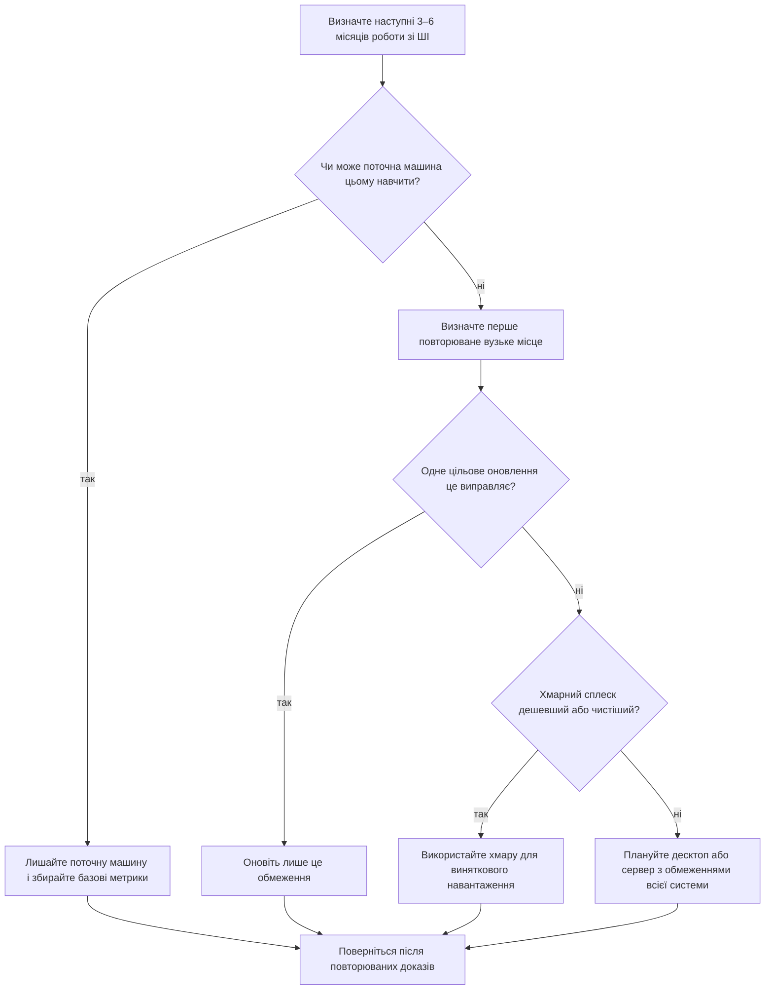

> **Трек «Інженерія ШІ/МН»** | Складність: `[MEDIUM]` | Час: 2-3 години
>
> **Передумови**: Модуль 1.1 завершено, базова впевненість у командах термінала, встановленні пакетів, читанні специфікацій системи та готовність фіксувати докази перед оновленням обладнання

---

## Результати навчання

Наприкінці цього модуля ви зможете:

- **Оцінити**, чи лептоп, десктоп або невеликий домашній сервер доречний для конкретного навчального навантаження зі ШІ.
- **Порівняти** обмеження CPU, RAM, VRAM, сховища, теплового режиму, живлення та мережі як системні компроміси, а не як ізольовані деталі.
- **Спроєктувати** поетапний план домашньої ШІ-станції, який підтримає наступні 3–6 місяців роботи без зайвих покупок.
- **Діагностувати** типові вузькі місця станції, зіставляючи симптоми на кшталт повільного завантаження моделі, збоїв, тротлінгу та помилок нестачі пам’яті з імовірними причинами.
- **Обґрунтувати**, коли локальне обладнання є правильним інструментом, а коли коротке хмарне використання є раціональнішим інженерним вибором.

---

## Чому цей модуль важливий

*(Майя — гіпотетичний ілюстративний учень, не задокументований інцидент.)* У Майї був спроможний лептоп, новий інтерес до локальних ШІ-помічників для коду і закладка з кошиком дорогих комплектуючих. Вона вважала, що покупка зробить навчання серйозним. Тоді її перший місяць роботи виявився здебільшого середовищами Python, викликами API, ноутбуками, робочими процесами Git і читанням документації моделей. Великий GPU, який вона майже купила, простоював би, тоді як справжнє тертя йшло від переповненого системного диска і нестачі пам’яті для ноутбуків із важким браузером.

Ця історія постійно повторюється в інженерії ШІ. Люди купують заради статусу, таблиць бенчмарків або знімків у соцмережах, перш ніж зрозуміти власне навантаження. Результат — не лише витрачені гроші. Це ще й витрачена увага, бо учень, який бореться з теплом, шумом, драйверами, поганою схемою розміщення сховища і нестабільними встановленнями пакетів, не вивчає поведінку моделі, потік даних, оцінювання чи дисципліну розгортання.

Домашня ШІ-станція — це не мініатюрний датацентр. Це навчальний інструмент. Мета — зробити повторювані експерименти дешевими, приватними і достатньо швидкими, щоб ітерувати щодня. Тож правильний дизайн залежить від роботи, яку ви справді зробите незабаром: побудова застосунків з пріоритетом API, невеликий локальний інференс, ембединги й пошук, ноутбуки, легке донавчання або сервіси, які мають бути завжди доступні.

Цей модуль навчає мислити про обладнання як про інженерне рішення, а не як про список покупок. Ви навчитеся міркувати від навантаження до вузького місця, від вузького місця до оновлення і від оновлення до поетапного плану. Навичка старшого рівня — не назвати найпотужніший компонент. Це знати, яке обмеження важливе першим, яке може почекати і яке навантаження має покинути дім і піти в хмару.

---

## Основний зміст

### 1. Починайте з навантаження, а не з обладнання

Найнадійніший спосіб прийняти погане рішення про станцію — почати з каталогу комплектуючих. Обладнання стає змістовним лише тоді, коли його пов’язано із задачею. GPU, чудовий для одного учня, може бути зайвим для іншого, а лептоп, який на папері виглядає слабким, може бути цілком достатнім для інженерії з пріоритетом API.

Практична розмова про станцію починається з часового вікна. Запитайте, що потрібно зробити за наступні 3–6 місяців, а не що ви теоретично могли б зробити колись. Захист від майбутнього звучить відповідально, але необмежений захист від майбутнього перетворює кожне рішення на привід витратити зайве. В інженерії корисний план має обмежений горизонт, відоме навантаження і вимірюване вузьке місце.

Для цього модуля ставтеся до домашньої роботи зі ШІ як до набору сімейств навантажень. Розробка з пріоритетом API залежить здебільшого від швидкодії CPU, RAM, місця на диску і чистого середовища розробника. Локальний інференс сильно залежить від VRAM, а RAM і сховище йдуть одразу за нею. Генерація з доповненням пошуком (RAG) залежить від RAM, сховища, пропускної здатності ембедингів і надійних локальних сервісів. Донавчання додає тиск на VRAM, ріст чекпоінтів, теплове навантаження і довшу тривалість задач.

Центральне питання — не «Чи може ця машина запускати ШІ?». Майже будь-яка сучасна машина може брати участь в інженерії ШІ, якщо навантаження обрано добре. Сильніше питання: «Яке навантаження зі ШІ на цій машині стане болісним першим, і чи варто це біль виправляти локально?» Таке формулювання веде до кращих рішень, бо спрямовує увагу на повторюване тертя, а не на уявний престиж.

**Пауза і прогноз:** Якщо двоє учнів кажуть «мені потрібна машина для ШІ», але один планує будувати інструменти з підтримкою API, а інший — щодня запускати квантизовані локальні ВММ, яке обмеження обладнання розійдеться першим? Запишіть відповідь до читання наступного абзацу, потім перевірте, чи ви назвали вузьке місце, специфічне для навантаження, а не загальне «більше потужності».

Учня з пріоритетом API можуть спершу зупинити RAM, безлад середовищ пакетів, місце на диску або загальна ергономіка розробки. Учень локальних ВММ набагато ймовірніше вдариться спочатку в VRAM, потім у системну RAM і сховище. Та сама фраза, «ШІ-станція», ховає різні системні проблеми. Ваша робота — виявити конкретну системну проблему до того, як витрачати гроші.

| Родина навантажень | Первинне вузьке місце | Вторинне вузьке місце | Локальна придатність |
|---|---|---|---|
| Застосунки ШІ з пріоритетом API | RAM, швидкодія CPU, надійність середовища | сховище, мережа | відмінна на більшості сучасних лептопів |
| Локальні моделі-помічники для коду | VRAM, RAM | сховище, тепловий режим | реалістично на десктопах і деяких лептопах |
| Експерименти з ембедингами та RAG | RAM, сховище, пропускна здатність ембедингів | прискорення CPU або GPU | дуже реалістично на одній машині |
| Дослідження даних із важкими ноутбуками | RAM, сховище | CPU, накладні витрати браузера | реалістично, якщо пам’ять не голодує |
| Інференс квантизованих ВММ | VRAM | RAM, сховище, тепловий режим | реалістично з правильним одним GPU |
| Невелике донавчання в стилі LoRA | VRAM, сховище | RAM, тривалість задачі | реалістично на вибраних десктопах з одним GPU |
| Навчання великих моделей | пропускна здатність кількох GPU, storage fabric, бюджет | операційні накладні витрати | зазвичай хмара або лабораторна інфраструктура |

Ця таблиця навмисно ставить навантаження першим. Вона запобігає типовій помилці ставитися до всієї роботи зі ШІ як до однієї й тієї самої проблеми обладнання. Учень, який будує функції з підтримкою API, може зробити відмінний прогрес без локальних інвестицій у GPU. Учень, який вивчає локальний інференс, має набагато раніше дбати про розмір моделі, квантизацію, довжину контексту і ємність VRAM.

Корисна звичка — описати наступне навантаження одним реченням. Наприклад: «Наступні 4 місяці я будуватиму застосунки ШІ з пріоритетом API і запускатиму невеликі ноутбуки». Інший учень може написати: «Наступні 6 місяців я запускатиму локальні моделі для коду, збудую невелику систему RAG і перевірю один легкий робочий процес донавчання». Ці два речення ведуть до різних машин, різних оновлень і різних рішень щодо хмари.

### 2. П’ять обмежень, які справді мають значення

Домашня ШІ-станція — це система, а не купа деталей. GPU може бути зірковим компонентом, але він не врятує машину з недостатньою RAM, повільним сховищем, нестабільним тепловим режимом, слабким живленням або поганою схемою оновлень. Старші інженери міркують про весь шлях від набору даних до завантаження моделі, до циклу інференсу чи навчання і до збереження артефактів.

П’ять обмежень, які мають найбільше значення, — це VRAM, системна RAM, сховище, тепловий режим і живлення або фізичне розширення. CPU, мережа і підтримка операційної системи також важливі, але вони зазвичай стають вирішальними після того, як зрозумілі первинні п’ять. Цей розділ будує ментальну модель, яка потім дає змогу діагностувати симптоми.

```ascii
+----------------------+        +----------------------+        +----------------------+
|      Ваша задача      |        |   Перше обмеження    |        |    Типовий симптом   |
+----------------------+        +----------------------+        +----------------------+
| Завантажити локальну ВММ | -----> | VRAM                 | -----> | модель не вміщається |
| Попередньо обробити набір | -----> | системна RAM         | -----> | підкачка або збої    |
| Зберегти чекпоінти    | -----> | ємність/швидкість NVMe | -----> | повільні прогони, диск повний |
| Ганяти задачі годинами | -----> | тепло/потік повітря  | -----> | тротлінг, шум       |
| Пізніше оновити GPU   | -----> | PSU/PCIe/місце в корпусі | -----> | потрібна перебудова |
+----------------------+        +----------------------+        +----------------------+
```

Діаграма показує, чому дизайн станції не розв’язується однією покупкою. Кожна задача навантажує іншу частину машини. Якщо оптимізувати лише компонент із найкращим маркетингом, усе одно можна отримати ненадійну станцію.

#### VRAM: перша тверда стіна для локальних моделей

VRAM — це пам’ять, фізично приєднана до GPU. Для сучасної локальної роботи з моделями вона часто є першою твердою стіною, бо модель або вміщається комфортно, вміщається з компромісами, або не вміщається корисним чином. Коли не вміщається, система може зменшити довжину контексту, знизити розмір батча, [застосувати сильнішу квантизацію, щоб зменшити вимоги до пам’яті](https://huggingface.co/docs/transformers/en/quantization/bitsandbytes), відкотитися на повільніші шляхи пам’яті або впасти з помилками нестачі пам’яті.

VRAM впливає на розмір моделі, вибір квантизації, [розмір батча](https://huggingface.co/docs/transformers/v4.53.3/en/perf_train_gpu_one), довжину послідовності і на те, чи реалістичне невелике донавчання. У розробника, який запускає крихітну локальну модель для доповнення коду, інші потреби, ніж у того, хто перевіряє інференс із довшим контекстом, батчі ембедингів або адаптацію в стилі LoRA. Ключ — ставитися до VRAM як до планування ємності, а не як до трофейного числа.

Корисна помилка початківця, якої варто уникати, — порівнювати GPU лише за сирими обчисленнями. Обчислення мають значення після того, як навантаження вміщається. Якщо модель, контекст і батч не вміщаються в пам’ять, теоретична швидкість стає другорядною. Це схоже на швидку вантажівку, яка не може повезти вантаж, який вам треба перевезти.

Саме тому розмір локальних ВММ часто починається з ємності пам’яті, а не з пікових математичних чисел. NVIDIA вказує для GeForce RTX 4090 [24 ГБ пам’яті GDDR6X](https://www.nvidia.com/en-us/geforce/graphics-cards/40-series/rtx-4090/), тоді як таблиця характеристик станційного класу RTX A6000 вказує [48 ГБ пам’яті GDDR6 з ECC](https://www.nvidia.com/en-us/products/workstations/rtx-a6000/). Рішення оператора — не «A6000 краща» і не «4090 швидша». Рішення — чи цільова модель, довжина контексту, поведінка батча і толерантність до вживаного станційного обладнання роблять 48 ГБ VRAM ціннішими за швидкість і ціну споживчого GPU. Учень, який знову і знову впирається в нестачу пам’яті за прийнятних налаштувань квантизації, має проблему ємності пам’яті. Учень, чиї цільові моделі вміщаються комфортно, може більше дбати про вартість, тепловий режим, підтримку ПЗ і щоденну зручність.

Apple Silicon змінює формулювання, але не питання ємності. Apple вказує системи Mac mini M4 з [конфігураціями уніфікованої пам’яті до 64 ГБ на M4 Pro](https://support.apple.com/en-us/121555) і системи MacBook Pro M4 Max з [конфігураціями уніфікованої пам’яті до 128 ГБ](https://support.apple.com/en-us/121553). Уніфіковану пам’ять спільно використовують CPU, GPU, операційна система, застосунки і середовище виконання моделі, тож її не варто читати як те саме, що виділена VRAM на дискретному GPU. Корисне питання все одно операційне: після того як ОС, браузер, редактор, ноутбуки і сервіси забрали свою частку, чи лишається навантаженню моделі достатньо пам’яті, щоб працювати передбачувано?

Для навчання думайте смугами, а не точними назвами продуктів. Низька VRAM підходить для невеликих квантизованих моделей, експериментів і розуміння робочого процесу. Середня VRAM робить локальний інференс набагато комфортнішим і зменшує кількість компромісів. Вища VRAM на одній карті — це місце, де [вибрані експерименти з донавчанням на одній машині починають ставати практичними, особливо з квантизацією і методами з ефективними параметрами](https://arxiv.org/abs/2305.14314).

**Пауза і прогноз:** Модель успішно завантажується з коротким запитом, але та сама модель падає або стає нестабільною, коли ви збільшуєте довжину контексту і розмір батча. Яке обмеження варто дослідити першим і чому швидкість CPU, ймовірно, не є першим підозрюваним?

Перший підозрюваний — VRAM, бо [довжина контексту і розмір батча безпосередньо збільшують тиск на пам’ять](https://huggingface.co/docs/trl/en/reducing_memory_usage). Швидкість CPU може впливати на затримку, попередню обробку і частини конвеєра, але описаний симптом — це відмова ємності за більшого сліду пам’яті моделі. Добре діагностування починається зі зіставлення симптому з ресурсом, який навантажується.

#### Системна RAM: друга стіна, що формує комфорт

Системна RAM — це пам’ять, яку використовують операційна система, ноутбуки, процеси Python, браузери, локальні бази даних, векторні сховища, задачі попередньої обробки та операції моделі на боці CPU. Вона менш ефектна за VRAM, але визначає, чи станція відчувається стабільною під час справжнього навчання. Багато учнів її недооцінюють, бо таблиці характеристик і відео з бенчмарками часто фокусуються на GPU.

RAM має значення щоразу, коли робота полишає GPU або оточує GPU. Попередня обробка наборів даних, розбиття документів на фрагменти, конвеєри ембедингів, експерименти в ноутбуках, локальні стеки сервісів і документація в браузері — усе це споживає пам’ять. Якщо машина починає підкачку на диск, досвід може стати болісно повільним, навіть якщо сам GPU спроможний.

Для учня занадто мала RAM створює складене тертя. Ви закриваєте вкладки браузера, щоб запустити ноутбуки, зупиняєте локальні сервіси, щоб завантажити модель, або перезапускаєте процеси після того, як тиск пам’яті спричиняє нестабільність. Кожен обхід перериває цикл навчання. Машина зі збалансованою RAM часто навчає краще, бо учень може тримати відкритими документацію, код, ноутбуки, логи і сервіси одночасно.

Не ставтеся до RAM як до двійкового «пройшло / не пройшло». Менший обсяг може бути робочим для навчання з пріоритетом API і легких ноутбуків. Помірний обсяг — комфортний мінімум для серйозної локальної розробки ШІ. Більший обсяг стає привабливим, коли разом працюють кілька сервісів, підтримуються локальні векторні бази, попередньо обробляються більші набори даних або виконується робота, важка для CPU.

#### Сховище: обмеження, яке росте тихо

Робочі процеси ШІ створюють і дублюють великі файли. Ваги моделей, файли токенізаторів, набори даних, ембединги, векторні індекси, шари контейнерів, кеші пакетів, вивід ноутбуків, [чекпоінти донавчання, логи оцінювання та артефакти експериментів — усі змагаються за місце](https://huggingface.co/docs/transformers/v4.55.4/trainer). Проблеми зі сховищем часто приходять пізніше за проблеми з RAM, тож учні недооцінюють їх у момент покупки.

Швидке сховище NVMe має значення для продуктивності, а не лише для гордості бенчмарків. Повільне сховище перетворює створення середовища, завантаження моделі, читання наборів даних, запис чекпоінтів і операції з контейнерами на повторювані затримки. Якщо кожен експеримент починається з очікування, ціна — не лише час. Це втрачена частота ітерацій.

До NVMe варто ставитися як до активного робочого простору для ваг моделей, наборів даних, кешів і чекпоінтів, а не як до прикраси в таблиці характеристик. Ядро Linux документує NVMe як окрему підсистему сховища з поведінкою драйвера хоста і політиками пристроїв, тому системи Linux показують пристрої NVMe інакше, ніж старіші диски SATA, в інструментах інвентарю на кшталт `lsblk` і шляхів `/dev/nvme*` ([документація NVMe на kernel.org](https://docs.kernel.org/nvme/index.html)). Для учня практичне рішення просте: тримайте ваги моделей і ріст артефактів на швидкому сховищі з достатнім вільним місцем, щоб операційна система, менеджери пакетів і тимчасові файли не воювали з експериментом.

Здорова схема розміщення відокремлює операційну систему від великих артефактів ШІ, коли це можливо. Це не завжди вимагає кількох дисків у перший день, але вимагає планування. Залиште достатньо вільного місця на системному диску для менеджерів пакетів, кешів, тимчасових файлів і оновлень. Розмістіть завантажені моделі, набори даних, чекпоінти та індекси там, де вони можуть рости, не загрожуючи ОС.

Урок сховища простий: припускайте ріст. Перше завантаження моделі цікаве. Десята модель, три набори даних, повторювані чекпоінти і шари контейнерів стають планом ємності. Станція, яка в іншому є достатньою, може стати ненадійною, коли системний диск постійно заповнений.

#### Тепловий режим і шум: справжній тест — тривале навантаження

Навантаження ШІ часто тривають довше за звичайні задачі десктопа. Лептоп або компактний десктоп може добре показати короткий бенчмарк, але знижувати частоту під час повторюваного інференсу, ембедингів великого корпусу або кількагодинного прогону донавчання. Тривале навантаження показує, чи машина справді корисна для навчання.

Для однієї домашньої сесії LoRA тиск сховища може прийти раніше за тепло; тепловий режим стає вирішальним, коли прогони повторюються або тривають годинами.

Тепловий режим — не косметика. Тепло впливає на частоти, стабільність, ресурс компонентів, шум вентиляторів і на те, чи можна ділити кімнату з машиною під час довгої задачі. Станція, яка технічно швидка, але занадто гучна, щоб працювати, поки ви вчитесь, — поганий навчальний інструмент. Тиха стабільна система, що працює на передбачуваній швидкості, часто перемагає потужнішу систему, яка постійно знижує частоту.

Охолодження також змінює рішення про оновлення. Оновлення GPU може вимагати кращого потоку повітря в корпусі, сильнішого блока живлення, більшого кліренсу або інших кривих вентиляторів. Якщо ігнорувати ці супутні зміни, оновлення може погіршити щоденний досвід. Урок — оцінювати операційне середовище, а не лише деталь.

Діагностика тепла практична. Якщо продуктивність починається високо, а потім падає за хвилини, підозрюйте тепло або ліміти живлення. Якщо вентилятори постійно ревуть і в кімнаті стає дискомфортно, машина може не підходити вашому способу життя, навіть якщо бенчмарки виглядають добре. Інженерні рішення включають людські обмеження, бо людьми оперується система.

#### Живлення, PCIe і фізичне розширення: шляхи оновлення проєктують рано

Багато збірок початківців провалюються, бо шлях оновлення припускали, а не спроєктували. Майбутній GPU може потребувати більше живлення, більше фізичного місця, більше охолодження і відповідний слот PCIe. Додаткове сховище може потребувати вільних слотів M.2 або відсіків для дисків. Швидша мережа може потребувати місця для розширення. Малий корпус може бути елегантним, але непрощаючим.

Запас блока живлення — це не лише про загальну потужність у ватах. Якість, роз’єми, поведінка на перехідних навантаженнях, ефективність і схема прокладання кабелів також мають значення. Система, яка ледве підтримує сьогоднішні компоненти, може бути крихкою завтра. Для навчальних станцій стабільне живлення є частиною надійності.

Схема PCIe має значення, бо фізичні слоти можуть конфліктувати з товщиною GPU, картами захоплення, адаптерами сховища або мережевими картами. Деякі материнські плати вимикають певні слоти, коли встановлено кілька дисків. Ці деталі легко ігнорувати, доки не прийде оновлення, яке не вміщається електрично або фізично.

Звичка старшого рівня — читати платформу як мапу оновлень. Перш ніж купувати десктоп або вживану робочу станцію, запитайте, що можна розширити без заміни ядра. Якщо відповідь «майже нічого», машина все одно може бути доброю, але до неї варто ставитися як до фіксованого приладу, а не як до довгострокової розширюваної станції.

| Обмеження | Що воно контролює | Здорове проєктне питання | Типовий симптом, коли замале |
|---|---|---|---|
| VRAM | вміщення моделі, контекст, батч, життєздатність донавчання | Чи вміщаються цільова модель і контекст без відчайдушних компромісів? | помилки нестачі пам’яті або сильні відкати швидкості |
| Системна RAM | ноутбуки, попередня обробка, сервіси, робота на боці CPU | Чи можу я тримати звичне навчальне середовище відкритим під час навантаження? | підкачка, збої, тиск вкладок браузера, зависання задач |
| Сховище | моделі, набори даних, кеші, чекпоінти, контейнери | Чи може ріст артефактів відбуватися, не заповнюючи системний диск? | повільні завантаження, невдалі встановлення, постійне прибирання |
| Тепловий режим | тривала продуктивність і зручність | Чи може ця машина ганяти задачу годинами в моїй кімнаті? | тротлінг, шум вентиляторів, нестабільні частоти |
| Живлення і PCIe | шлях оновлення і стабільність | Чи платформа підтримає наступний реалістичний компонент? | несподівані перебудови, проблеми з роз’ємами, немає кліренсу слота |
| CPU | попередня обробка, оркестрація, робота без GPU | Чи CPU годує конвеєр для мого навантаження? | недовикористаний GPU, повільна підготовка даних, мляві інструменти |
| Мережа | завантаження, віддалене сховище, хмарні робочі процеси | Чи можу я переміщувати моделі й набори даних без постійного очікування? | повільні витяги, невдалі синхронізації, незручна віддалена робота |

### 3. Три практичні архетипи станції

Більшість домашніх налаштувань ШІ потрапляють у три архетипи: спершу лептоп, десктоп з одним GPU і невеликий домашній сервер або вживана робоча станція. Це не жорсткі категорії. Це патерни рішень. Архетип каже, які сильні сторони ви купуєте і які межі мусите прийняти.

Налаштування «спершу лептоп» — точка старту з найменшим тертям. Воно портативне, уже доступне багатьом учням і цілком достатнє для розробки з пріоритетом API, середовищ Python, ноутбуків, документації, робочих процесів Git і невеликих локальних експериментів. Головні слабкості — теплові межі, обмежена оновлюваність, менші варіанти сховища і часто обмежена VRAM.

Десктоп з одним GPU зазвичай є найкращою довгостроковою цінністю для учня для локального інференсу, ембедингів, RAG і перших спроб донавчання. Він дає краще охолодження, легше розширення сховища, стабільнішу тривалу продуктивність і чистіший шлях оновлення. Компроміс у тому, що він не портативний і все одно не розв’язує навчання масштабу датацентру.

Невеликий домашній сервер або вживана робоча станція корисні, коли задачі мають працювати безперервно, сервіси мають лишатися доступними або навчання, важке для сховища, стає важливим. Він може хостити векторні бази, сервери моделей, відстеження експериментів або фонові конвеєри. Компроміси — шум, споживання живлення, обслуговування, місце й операційна складність.

| Архетип | Найкраще для | Сильні сторони | Межі |
|---|---|---|---|
| Спершу лептоп | кодування API, ноутбуки, малі моделі, подорожі | уже є, портативний, простий старт | теплові межі, слабкий шлях оновлення, обмежене тривале навантаження |
| Десктоп з одним GPU | локальний інференс, RAG, ембединги, легке донавчання | найкраща цінність для учня, розширюваний, стабільний під навантаженням | стаціонарний, усе ще обмежений однією машиною |
| Невеликий домашній сервер або вживана станція | сервіси завжди доступні, фонові задачі, лабораторії, важкі для сховища | безперервні експерименти, самостійний хостинг, розділення обов’язків | шум, споживання живлення, операційні накладні витрати |
| Хмарний сплеск у парі з локальною машиною | рідкісні великі задачі за межами домашніх лімітів | немає локального тепла, доступ до більшого обладнання, плата за використання | сюрпризи вартості, повторюваність налаштування, тертя передачі даних |

Для більшості серйозних учнів локального ШІ десктоп з одним GPU є найкращим типовим шляхом оновлення після того, як лептоп стає обмежувальним. Це не означає, що кожен учень має купувати його негайно. Це означає, що якщо повторюваний локальний інференс, ембединги і експерименти з донавчанням стають центральними для навчання, форма десктопа розв’язує більше обмежень одразу, ніж тонкий лептоп.

Лептоп лишається цінним навіть після того, як у картині з’являється десктоп. Багато інженерів використовують лептоп для коду, документації, Git, віддаленого доступу і легких ноутбуків, тоді як десктоп обробляє важчі локальні прогони. Такий поділ може бути ергономічнішим, ніж змушувати одну машину бути ідеальною в усьому.

Домашній сервер зазвичай має з’явитися пізніше. Якщо ви ще не запускали локальний інференс, не контейнеризували сервіс, не підтримували середовище Python і не керували локальним векторним сховищем на одній машині, лабораторія з кількох машин додає складність раніше, ніж дає розуміння. Спершу вивчіть уроки одного вузла, потім додайте інфраструктуру «завжди доступно», коли саме операційне навчання стає метою.

```ascii
+-----------------------+       +-------------------------+       +-------------------------+
|   Етап 1: лептоп       |       |   Етап 2: десктоп       |       |   Етап 3: домашній сервер |
+-----------------------+       +-------------------------+       +-------------------------+
| Застосунки API        | ----> | локальний інференс      | ----> | сервіси завжди доступні  |
| ноутбуки              |       | ембединги              |       | сталість векторної БД    |
| Git і інструменти     |       | експерименти RAG       |       | фонові задачі            |
| малі експерименти     |       | легке донавчання       |       | патерни віддаленого доступу |
+-----------------------+       +-------------------------+       +-------------------------+
        лишайте, якщо вистачає           оновлюйте, коли повторювані          додавайте лише коли урок —
        для наступного навантаження      вузькі місця доведені               саме експлуатація сервісу
```

Ця прогресія не обов’язкова, але вона корисний типовий шлях. Вона уникає пастки починати зі складної домашньої лабораторії, перш ніж ви знаєте, які навантаження заслуговують там працювати. Кожен етап заробляє наступний, виявляючи справжнє обмеження.

### 4. Правила розміру, які старіють добре

Рекомендації щодо обладнання старіють швидко. Конкретні моделі, ціни і наявність змінюються, але обмеження навантажень лишаються впізнаваними. Стійкі правила розміру фокусуються на ємності пам’яті, рості сховища, тепловій поведінці і гнучкості оновлень замість удавати, що одна поточна деталь є постійною відповіддю.

Для RAM почніть із питання, скільки речей має бути відкрито під час навчання. Система з малою пам’яттю може впоратися зі сфокусованою роботою з пріоритетом API, але стає тісною, коли разом працюють ноутбуки, браузери, локальні бази, процеси моделей і інструменти контейнерів. Комфортна система учня лишає запас для звичайної багатозадачності, поки експерименти йдуть.

Для VRAM запитайте, який клас моделі, рівень квантизації, довжину контексту і поведінку батча ви очікуєте. Невеликі локальні моделі й експерименти можуть терпіти нижчу VRAM. Комфортний локальний інференс потребує більше місця, щоб кожен прогін не був компромісом. Донавчання, навіть параметроефективне, піднімає вимогу вище, бо стан оптимізатора, активації, довжина послідовності і чекпоінти впливають на поведінку пам’яті.

Для сховища плануйте і ємність, і швидкість. Системний диск не має жити постійно майже повним. Артефакти ШІ мають мати місце рости. Якщо машина підтримує додатковий диск NVMe, це оновлення може бути одним із найкращих покращень продуктивності для учня, який регулярно завантажує моделі й набори даних.

Для теплового режиму оцінюйте тривалу поведінку, а не пікову. Машина, що добре показує короткий тест, усе одно може бути поганою станцією, якщо знижує частоту, стає галасливою або перегрівається під час довшого прогону. Має значення ваш розклад навчання: машина в спальні, спільній квартирі чи малому офісі має задовольняти практичні обмеження шуму й тепла.

Для планування оновлень задокументуйте, що можна змінити пізніше. Деякі лептопи майже фіксовані. Деякі десктопи можуть прийняти більше RAM, сховища і більший GPU з помірними зусиллями. Деякі вживані робочі станції мають пропрієтарні блоки живлення або незвичні схеми розміщення, що обмежують оновлення. Дешева вживана система може бути відмінною, але лише якщо її обмеження збігаються з вашим планом.

| Ресурс | Смуга входу в навчання | Комфортна локальна смуга | Важча домашня смуга |
|---|---|---|---|
| RAM | достатньо для роботи з пріоритетом API і легких ноутбуків | достатньо для ноутбуків, сервісів, ембедингів і браузера разом | достатньо для багатосервісних стеків і важчої попередньої обробки |
| VRAM | малі квантизовані моделі й вивчення робочого процесу | комфортний інференс із меншою кількістю компромісів | вибране донавчання на одній карті і довші контексти |
| Сховище | один швидкий диск із дисциплінованим прибиранням | окреме місце для моделей, наборів даних, кешів і проєктів | кілька швидких дисків або окреме сховище артефактів |
| Охолодження | короткі задачі й легкі локальні експерименти | тривалий інференс і ембединги без сильного тротлінгу | повторювані довгі задачі з передбачуваним шумом і теплом |
| Живлення | безпечно підтримує поточні компоненти | лишає запас для одного реалістичного оновлення | підтримує майбутній план GPU, сховища й охолодження |

Зауважте, що таблиця уникає точних назв продуктів. Це навмисно. Ваша мета — не запам’ятати фіксовану збірку. Ваша мета — класифікувати, чи машина є вхідною, комфортною чи важкою для вашої справжньої роботи.

**Перевірка рішення:** Уявіть, що у вас вистачає грошей або на більше RAM, або на більший SSD, або на кращий GPU, але не на всі три. Ноутбуки повільні, бо система йде в підкачку, коли разом працюють вкладки браузера, векторна база і попередня обробка. Яке оновлення має бути першим і які докази це підтримують?

Правильне перше оновлення, ймовірно, RAM, якщо машина це підтримує. Симптом — тиск пам’яті під час багатозадачності і попередньої обробки, а не відмова вміщення моделі. Кращий GPU може стати в пригоді пізніше, але він не розв’язує перше повторюване вузьке місце. Так планування оновлень на доказах запобігає купівлі заради престижу.

### 5. Локально, хмара чи гібрид: компроміс вартості й контролю

Локальне обладнання дає приватність, повторюваність, негайний доступ і стабільне особисте середовище. Воно відмінне для щоденної ітерації, малих і середніх експериментів, діагностики, вивчення інструментарію і побудови інтуїції про поведінку моделі. Воно також дає вам відповідальність за тепло, шум, живлення, драйвери, сховище і відмови обладнання.

Хмарне обладнання дає сплеск ємності, доступ до більших GPU, легші експерименти з обладнанням, якого ви не можете мати, і можливість припинити платити, коли робота закінчується. Воно відмінне для рідкісних великих задач, тестів, що перевищують локальну ємність, і експериментів, чутливих до часу. Воно також вводить облік вартості, передачу даних, відтворюваність віддаленого середовища, ліміти облікового запису і рішення безпеки.

Гібридна стратегія часто є найраціональнішою. Використовуйте локальне обладнання для повторюваних навчальних циклів і хмарне — для рідкісного масштабу. Це тримає щоденну практику дешевою і швидкою, уникаючи фантазії, що домашня машина мусить задовольняти кожне можливе майбутнє навантаження.

Ключове економічне питання — ступінь використання. Локальна покупка має сенс, коли машину використовуватимуть достатньо часто, щоб виправдати володіння, обслуговування, живлення і альтернативну вартість. Хмара має сенс, коли навантаження рідкісне, сплескове, занадто велике для дому або легше ізолювати віддалено.

Приватність також має значення. Локальна робота може тримати особисті документи, пропрієтарний код і експериментальні набори даних на вашій машині. Хмарна робота все ще може бути безпечною, але потребує навмисної конфігурації. Для ранніх учнів найпростіший безпечний робочий процес може бути локальна розробка з обережно обраними хмарними сплесками для нечутливих або належно підготовлених навантажень.

| Рішення | Обирайте, коли | Уникайте, коли | Інженерний ризик |
|---|---|---|---|
| Лишатися зі стратегією «спершу лептоп» | наступне навантаження важке на API або легке локальне | повторювані локальні вузькі місця вже ясні | недооцінка майбутніх потреб у сховищі й RAM |
| Купити або зібрати десктоп з одним GPU | повторюваний локальний інференс, RAG або донавчання є центральними | навантаження рідкісне, сплескове або невизначене | витратити зайве до вимірювання обмежень |
| Додати домашній сервер | сервіси завжди доступні є частиною навчальної мети | основи однієї машини ще не опановані | операційні накладні витрати ховають урок ШІ |
| Використовувати хмарні сплески | великі задачі рідкісні або тепло/шум неприйнятні | робота постійна і передбачувана локально | дрейф вартості і дрейф середовища |
| Використовувати гібрид | щоденна ітерація локальна, тести масштабу рідкісні | ви не можете чисто керувати двома середовищами | неузгоджені залежності і рух артефактів |

Ризик гібриду — дрейф середовища. Якщо локальне і хмарне середовища відрізняються занадто сильно, результати стає важко відтворити. Пізніші модулі покривають відтворювані середовища Python, CUDA і ROCm, бо рішення про обладнання і відтворюваність ПЗ пов’язані. Потужна станція з хаотичними середовищами все одно є слабкою навчальною платформою.

### 6. Читати симптоми як інженер

Старший інженер не діагностує обладнання вгадуванням. Він зіставляє симптоми з ресурсами, збирає докази і змінює одну річ за раз. Ця звичка особливо важлива в роботі зі ШІ, бо багато відмов спочатку виглядають схоже. Збій може бути VRAM, RAM, розбіжністю драйвера, вичерпанням сховища, тепловою нестабільністю або поганим середовищем пакетів.

Почніть із запису навантаження і симптому. Модель відмовила під час завантаження, під час довших запитів, під час пакетної обробки, під час запису чекпоінтів чи після години роботи? Момент часто вказує на обмеження. Відмови під час завантаження часто вказують на VRAM або сховище. Погіршення з часом часто підказує тепловий режим, витоки пам’яті або ріст диска. Відмови під час попередньої обробки часто вказують на системну RAM або обробку даних на боці CPU.

Потім зберіть факти системи з самої машини. Не покладайтеся лише на маркетингові специфікації чи пам’ять. Команди нижче призначені для інвентарю, а не для бенчмаркінгу. Деякі команди працюють лише на платформі або обладнанні, яке їх підтримує, тож ставтеся до відсутнього виводу як до інформації, а не як до паніки.

```bash
# Linux: collect basic workstation inventory.
uname -a
lscpu | sed -n '1,20p'
free -h
df -h
lsblk -o NAME,SIZE,TYPE,MOUNTPOINT
lspci | grep -Ei 'vga|3d|display' || true
nvidia-smi --query-gpu=name,memory.total,driver_version --format=csv || true
amd-smi static || rocm-smi --showproductname --showmeminfo vram || true
```

```bash
# macOS: collect basic workstation inventory.
uname -a
sysctl -n machdep.cpu.brand_string
sysctl -n hw.memsize
df -h
system_profiler SPDisplaysDataType
system_profiler SPNVMeDataType
```

Команди інвентарю самі по собі проблему не розв’язують. Вони дають базову лінію: загальну пам’ять, вільне сховище, ідентичність GPU, видимість драйвера і схему дисків. Коли ви знаєте базову лінію, можете порівняти її з навантаженням, яке відмовило.

Для систем Linux з GPU NVIDIA `nvidia-smi` корисний під час навантаження, бо показує використання пам’яті, ступінь використання, температуру і відомості про живлення. Для систем не-NVIDIA використовуйте інструменти постачальника, доступні для платформи, монітори активності операційної системи і логи застосунків. Принцип той самий: дивіться на ресурс, поки навантаження працює.

```bash
# Linux with NVIDIA GPU: observe resource pressure during a run.
watch -n 2 nvidia-smi
```

NVIDIA документує `nvidia-smi` як інтерфейс моніторингу і керування, який може звітувати назву продукту, версію драйвера, приєднані GPU, пам’ять кадрів, живлення, температуру і поля ступеня використання ([документація NVIDIA nvidia-smi](https://docs.nvidia.com/deploy/nvidia-smi/index.html)). AMD документує AMD SMI як поточного наступника ROCm SMI для керування GPU AMD, тоді як старіші системи ROCm можуть усе ще надавати команди `rocm-smi` ([документація AMD SMI](https://rocm.docs.amd.com/projects/amdsmi/en/latest/)). Звичка оператора — записати, який інструмент є на машині, а потім дивитися на пам’ять, живлення і температуру під час навантаження, яке справді відмовило.

```bash
# Linux with AMD GPU: observe resource pressure during a run.
watch -n 2 amd-smi monitor || watch -n 2 rocm-smi
```

```bash
# Linux: observe memory and disk pressure during a run.
free -h
df -h .
uptime
```

```bash
# macOS: observe memory and disk pressure during a run.
vm_stat
df -h .
uptime
```

Добрий діагноз з’єднує докази з дією. Якщо пам’ять GPU насичена і модель відмовляє, коли контекст росте, зменшіть контекст, використайте меншу модель, змініть квантизацію або пізніше оберіть GPU з більшою VRAM. Якщо системна пам’ять насичена під час попередньої обробки, зменшіть розмір батча, потоково читайте дані, закрийте паралельні сервіси або додайте RAM, якщо можливо. Якщо сховище повне, перемістіть артефакти і переспроєктуйте схему розміщення сховища перед купівлею обчислень.

Найгірший діагноз — «машина погана». Ця фраза ховає обмеження. Замініть її тестованим твердженням: «Це навантаження насичує VRAM, коли довжина контексту зростає», або «Цей ноутбук плюс векторна база штовхає системну пам’ять у підкачку», або «Записи чекпоінтів повільні, бо артефакти живуть на тому самому майже повному системному диску». Тестовані твердження ведуть до цільових виправлень.

### 7. Розібраний приклад: план станції для конкретного учня

*(Джордан — гіпотетичний ілюстративний учень, не задокументований інцидент.)* Джордан — розробник ПЗ, який хоче витратити наступні 6 місяців на вивчення інженерії ШІ вдома. Бюджет обмежений, уже є недавній лептоп із помірною RAM, і його спокушає збірка десктопа з одним GPU. Запланована робота — розробка застосунків з пріоритетом API в перший місяць, локальні ембединги й експерименти RAG до третього місяця і один невеликий експеримент донавчання в стилі LoRA ближче до кінця періоду.

Перший крок — визначити, чому вже може навчити поточний лептоп. Розробка з пріоритетом API, пакування Python, робочі процеси Git, ноутбуки, оцінювання підказок і базовий дизайн сервісів не потребують локального GPU. Джордану не варто купувати десктоп, перш ніж з’ясувати, чи може він підтримувати чисті середовища, надійно запускати ноутбуки і добре структурувати проєкти. Ці навички безпосередньо переносяться на майбутній десктоп.

Другий крок — передбачити перше ймовірне вузьке місце. Для першого місяця RAM і сховище ймовірніші за GPU. Якщо на лептопі обмежене вільне місце, кеші пакетів, ноутбуки і набори даних можуть створити тертя рано. Якщо RAM помірна, але не щедра, навчання з важким браузером плюс ноутбуки може стати некомфортним. Правильна дія — виміряти ці межі під час справжньої роботи.

Третій крок — спроєктувати поетапний план замість однієї великої покупки. Етап один лишає лептоп, прибирає схему розміщення сховища і записує справжній тиск пам’яті під час побудови проєктів з пріоритетом API. Етап два додає хмарні сплески лише якщо конкретний експеримент перевищує лептоп. Етап три розглядає десктоп з одним GPU, якщо Джордан достатньо часто запускає локальні моделі, ембединги і експерименти з донавчанням, щоб виправдати володіння.

Четвертий крок — обрати пріоритети десктопа, якщо докази підтримують покупку. Джордану варто пріоритезувати достатню VRAM для цільових локальних моделей, достатню системну RAM, щоб тримати сервіси й ноутбуки відкритими, швидке сховище NVMe для моделей і чекпоінтів, надійне охолодження і блок живлення з реалістичним запасом. Не варто витрачати весь бюджет на GPU і лишати решту машини крихкою.

Фінальна рекомендація — не «купуй» чи «не купуй». Вона умовна: лишайте лептоп для роботи з пріоритетом API зараз, вимірюйте тиск RAM і сховища, використовуйте хмару для будь-якого рідкісного великого прогону і купуйте або збирайте десктоп лише коли локальний інференс і RAG стають повторюваною щотижневою роботою. Це рішення поважає послідовність навчання і уникає перетворення невизначеної майбутньої амбіції на негайну вартість.

```ascii
+----------------------------+       +----------------------------+       +----------------------------+
| Наступне навантаження Джордана |       | Докази, які зібрати        |       | Рішення                   |
+----------------------------+       +----------------------------+       +----------------------------+
| Застосунки з пріоритетом API | ----> | RAM, диск, середовище     | ----> | спершу лишати лептоп      |
| Експерименти RAG           | ----> | ріст сховища, RAM, швидкість | ----> | оновити сховище або десктоп |
| Спроба невеликого донавчання | ----> | потреба VRAM, тривалість задачі | ----> | десктоп або хмарний сплеск |
+----------------------------+       +----------------------------+       +----------------------------+
```

Цей розібраний приклад навмисно консервативний. Консервативний не означає полохливий. Це означає, що кожна покупка запускається доказами з навчального шляху. Старший інженер може захистити план, бо кожен етап називає навантаження, ймовірне вузьке місце, вимірювання і наступну дію.

### 8. Побудова фреймворку рішень, який можна повторно використовувати

Повторно використовуваний фреймворк — це послідовність запитань. По-перше, чи може поточна машина навчити наступній концепції? Якщо так, лишайте її і вчіться. По-друге, якщо не може, яке перше повторюване вузьке місце: VRAM, RAM, сховище, тепловий режим, живлення чи час? По-третє, чи можна це вузьке місце виправити однією цільовою зміною? По-четверте, якщо ні, чи короткий хмарний прогін дешевший і чистіший за локальну перебудову? По-п’яте, лише тоді розглядайте більшу станцію або шлях сервера.

Ця послідовність працює, бо відокремлює навчальні цілі від цілей володіння. Багато людей насолоджуються обладнанням, і в цьому немає нічого поганого. Помилка — удавати, що кожне бажання обладнання є вимогою навчання. Фреймворк допомагає чесно сказати, які рішення служать навчальній програмі, а які — хобі.

Фреймворк також захищає від передчасного кластера. Домашній кластер може навчити мережі, оркестрації, надійності сервісів, сховища і операцій. Він також може поховати учня під обслуговуванням, перш ніж той зрозуміє робочий процес ШІ на одному вузлі. Якщо мета модуля явно не є інфраструктурними операціями, одна надійна машина зазвичай є кращою першою класною кімнатою.

Користуйтеся наведеним нижче потоком рішень, коли відчуваєте бажання оновитися. Не пропускайте крок вимірювання. Якщо ви не можете назвати вузьке місце з доказів, ви ще не готові стверджувати, що оновлення необхідне.



Потік навмисно повільний. Він змушує довести проблему перед зміною системи. Ця дисципліна цінна за межами обладнання. Той самий спосіб мислення з’являється в плануванні ємності, реагуванні на інциденти, плануванні Kubernetes, дизайні платформи MLOps і контролі вартості.

### 9. Специфіка обладнання без перетворення цього на список покупок

Вибір CPU має значення, але не однаковим чином для кожного навантаження. Розробка з пріоритетом API, ноутбуки, попередня обробка, перетворення даних, стиснення і оркестрація використовують CPU. Локальний інференс ВММ може бути домінантним для GPU, але CPU все одно готує дані, керує процесами і координує конвеєр. Дико незбалансована система може лишити дорогу ємність GPU чекати на повільну підготовку даних.

Ставтеся до інвентарю CPU як до підказки конвеєра, а не як до табло. На Linux `lscpu` звітує відомості про архітектуру CPU з sysfs, `/proc/cpuinfo` та інших бібліотек, специфічних для архітектури, що робить його корисним першим інвентарним кроком, а не бенчмарком продуктивності ([посібник lscpu](https://www.man7.org/linux/man-pages/man1/lscpu.1.html)). Якщо GPU недовикористаний, тоді як попередня обробка, токенізація, розпакування або завантаження даних зайняті на хості, перше виправлення може бути батчування, потокове читання, кешування або робота зі схемою розміщення даних перед будь-якою новою покупкою GPU.

Кількість ядер допомагає, коли навантаження розпаралелюються, але швидкодія одного потоку все одно впливає на комфорт розробника. Встановлення пакетів, редактори, ноутбуки і багато скриптів виграють від жвавих ядер. Для учнів збалансований CPU зазвичай кращий, ніж гонитва за екстремальною деталлю, що змушує до компромісів в охолодженні, шумі чи бюджеті.

Канали пам’яті і розширюваність мають значення, бо оновлення RAM легші на одних платформах, ніж на інших. Лептоп із розпаяною пам’яттю може бути замкнений назавжди. Десктоп із вільними слотами пам’яті може адаптуватися, коли навантаження ростуть. Перед покупкою перевірте, чи рекламована ємність пам’яті — це встановлений обсяг, максимально підтримуваний обсяг, чи конфігурація, яка вимагає заміни наявних модулів.

Вибір GPU має починатися з сумісності екосистеми ПЗ. Багато бібліотек ШІ сьогодні найлегші на NVIDIA CUDA, але інші платформи можуть бути розумними залежно від підтримки фреймворків, операційної системи, формату моделі і навантаження. Важлива звичка початківця — перевірити інструментарій, який ви маєте намір використовувати, перед купівлею обладнання. Швидший непідтримуваний шлях не швидший, якщо ви тижнями боретеся з сумісністю.

Сховище має включати і простір активних проєктів, і простір артефактів. Простір активних проєктів тримає код, середовища, ноутбуки і поточні набори даних. Простір артефактів тримає завантажені моделі, чекпоінти, векторні індекси, логи і шари контейнерів. Якщо вони ділять один малий диск, прибирання стає частиною кожного уроку. Якщо їх сплановано окремо, станція відчувається спокійніше.

Мережа стає релевантною, коли моделі, набори даних і артефакти рухаються між локальними машинами або хмарними системами. Сильне інтернет-з’єднання допомагає із завантаженнями, але якість локальної мережі має значення, якщо пізніше додасте домашній сервер. Не проєктуйте робочий процес, важкий для мережі, доки він не потрібен, але уникайте виборів, які зроблять майбутнє переміщення файлів болісним.

Вибір операційної системи впливає на підтримку драйверів, поведінку пакетів, схему файлової системи і ресурси для діагностики. Linux поширений в інженерії ШІ, бо багато інструментів його припускають, сервери на ньому працюють, і документація GPU часто його цілить. macOS може бути відмінним для розробки і деяких робочих процесів локального інференсу. Windows може працювати, особливо з робочими процесами на базі WSL, але треба бути навмисним щодо шляхів, драйверів і меж середовищ.

Найкраща станція — та, чиї обмеження ви розумієте. Якщо ви знаєте, чому її спроєктовано, що вона може, чого не може і коли ви переглянете рішення, тоді навіть скромне налаштування може бути відмінним. Якщо ви цього не знаєте, дороге налаштування все одно може бути поганим учителем.

---

## Чи знали ви?

- **Квантизація змінює розмову про пам’ять**: [Подання моделей з нижчою точністю можуть вмістити більші моделі на меншому обладнанні](https://huggingface.co/docs/transformers/en/quantization/bitsandbytes), але вони також можуть змінити швидкість, поведінку точності та підтримувані операції, тож це компроміс, а не магія.
- **Ріст чекпоінтів може здивувати учнів**: Експерименти з донавчанням можуть створювати повторювані чекпоінти, логи і [файли адаптерів](https://huggingface.co/docs/peft/en/developer_guides/checkpoint), тож планування сховища має значення навіть тоді, коли сама модель уже вміщається.
- **Тривала продуктивність відрізняється від пікової**: Машина може виглядати вражаюче в короткому бенчмарку і все одно бути поганою навчальною станцією, якщо тепло або шум роблять довгі прогони неприємними.
- **Хмарне і локальне обладнання є комплементами**: Багато сильних навчальних налаштувань використовують локальні машини для щоденної ітерації і хмарне обладнання лише для рідкісних задач, що перевищують домашні обмеження.

---

## Типові помилки

| Помилка | Що йде не так | Кращий крок |
|---|---|---|
| Купувати заради хайпу моделі замість наступних 3–6 місяців роботи | Машина дорога, але мало використовується, бо учень здебільшого робить API, ноутбуки й інструменти | Спершу визначте наступне навантаження, потім купуйте лише коли з’являються повторювані вузькі місця |
| Ставитися до лептопів і десктопів як до взаємозамінних | Учень очікує портативність лептопа і тривалу продуктивність десктопа від одного пристрою | Вирішіть, що важливіше на цьому етапі: портативність чи довгі локальні навантаження |
| Витратити весь бюджет на GPU | RAM, сховище, охолодження і живлення стають слабкими ланками, що роблять систему нестабільною | Бюджетуйте станцію як повну систему, а не як GPU із залишками |
| Ігнорувати ріст сховища | Завантаження моделей, набори даних, кеші пакетів, контейнери і чекпоінти заповнюють системний диск | Плануйте швидке сховище артефактів рано і тримайте диск ОС здоровим |
| Будувати домашню лабораторію з кількох вузлів занадто рано | Операційні накладні витрати ховають навчальну мету ШІ і створюють занадто багато режимів відмови | Опануйте одну надійну машину, перш ніж додавати складність сервісів і мережі |
| Плутати ШІ домашнього масштабу з продакшен-інфраструктурою ШІ | Учень очікує поведінку навчання масштабу датацентру від однієї домашньої машини | Ставтеся до домашнього обладнання як до платформи навчання й ітерації, а не як до мініатюрного продакшен-кластера |
| Ігнорувати тепловий режим і шум | Довгі задачі знижують частоту, вентилятори відволікають, і машиною неприємно користуватися | Оцініть тривале навантаження, потік повітря в корпусі, обмеження кімнати й охолодження перед оновленням |
| Обирати локальне обладнання, коли хмарні сплески дешевші | Рідкісні великі задачі штовхають до надмірної локальної покупки, яка більшість місяця простоює | Використовуйте хмару для рідкісного масштабу і локальне обладнання для повторюваної щоденної практики |

---

## Вікторина

**Q1.** У вашої команди є один сучасний лептоп із помірною RAM і без виділеного GPU з високою VRAM. Наступні 4 місяці робота — застосунки ШІ з підтримкою API, оцінювання підказок, робочі процеси Git і кілька невеликих ноутбуків. Колега стверджує, що купівля потужного десктопного GPU зараз «зробить команду серйозною». Яке рішення ви б рекомендували і які докази зібрали б перед тим, як його переглянути?

<details>
<summary>Відповідь</summary>

Лишайте налаштування «спершу лептоп» зараз і збирайте докази про тиск RAM, ріст сховища, надійність середовища пакетів і продуктивність ноутбуків. Описане навантаження не є переважно локальним інференсом моделі чи донавчанням, тож великий GPU навряд чи є першим обмеженням. Перегляньте рішення про десктоп лише після того, як повторювані локальні навантаження покажуть, що VRAM або тривалі обчислення GPU блокують прогрес.

</details>

**Q2.** Ви можете завантажити квантизовану локальну модель із коротким запитом, але процес падає або стає нестабільним, коли ви збільшуєте довжину контексту і запускаєте більші батчі. Ступінь використання CPU не особливо високий, і на сховищі достатньо вільного місця. Яке обмеження варто дослідити першим і яке пом’якшення можна спробувати перед купівлею обладнання?

<details>
<summary>Відповідь</summary>

Досліджуйте VRAM першою, бо довжина контексту і розмір батча збільшують тиск пам’яті моделі. Перед купівлею обладнання спробуйте меншу модель, сильніше налаштування квантизації, коротший контекст, менший розмір батча або іншу конфігурацію інференсу. Якщо ці пом’якшення знову і знову роблять навантаження неприйнятним, тоді GPU з більшою VRAM може бути виправданим.

</details>

**Q3.** Учень хоче одночасно запускати локальні ембединги, векторну базу, документацію в браузері, ноутбуки і невеликий вебсервіс. У GPU є невикористана ємність, але машина різко сповільнюється і починає підкачку. Яке оновлення або перепроєктування найкраще узгоджене з міркуванням модуля?

<details>
<summary>Відповідь</summary>

Найбільш узгоджене виправлення — спершу розв’язати тиск системної RAM: або додати RAM, якщо платформа це підтримує, або зменшити кількість одночасних сервісів і розміри батчів. Симптом не є переважно ємністю GPU, бо GPU не насичений. Навантаження оточує GPU процесами, важкими для пам’яті, тож системна RAM є ймовірним першим вузьким місцем.

</details>

**Q4.** На вашій станції достатньо VRAM для локальної моделі і достатньо RAM для ноутбуків, але завантаження моделей, збірки контейнерів, записи чекпоінтів і читання наборів даних повільні. Системний диск майже повний і також тримає моделі, проєкти, контейнери і чекпоінти. Що варто змінити, перш ніж звинувачувати GPU?

<details>
<summary>Відповідь</summary>

Переспроєктуйте сховище, перш ніж звинувачувати GPU. Додайте або звільніть швидке сховище NVMe, перемістіть великі артефакти геть від системного диска, де можливо, і тримайте достатньо вільного місця для кешів, тимчасових файлів, менеджерів пакетів і оновлень. Симптоми вказують на ємність і швидкість сховища, а не на обчислення моделі.

</details>

**Q5.** Група хоче негайно побудувати домашню лабораторію з трьох машин, бо асоціює інженерію ШІ з продакшен-інфраструктурою. Вони ще не запускали локальний інференс, не контейнеризували сервіс моделі і не підтримували векторне сховище на одній машині. Як ви маєте скерувати їхній наступний крок?

<details>
<summary>Відповідь</summary>

Скеруйте їх спершу опанувати одну надійну машину. Одна машина може навчити керуванню середовищем, завантаженню моделі, ноутбукам, векторним сховищам, контейнерам, основам сервінгу і діагностиці вузьких місць. Лабораторія з кількох вузлів корисна пізніше, коли метою навчання є експлуатація сервісів і поведінка інфраструктури, але в цьому сценарії вона занадто рано додає складність, яка відволікає від мети.

</details>

**Q6.** У вас квартира, де тепло і шум вентиляторів є головними обмеженнями. Найбільші задачі трапляються лише кілька разів на місяць, а щоденна робота — легка розробка і ноутбуки. Локальне оновлення десктопа було б дорогим і галасливим. Яку архітектуру ви б рекомендували?

<details>
<summary>Відповідь</summary>

Рекомендуйте гібридний підхід: лишайте локальне обладнання для щоденної розробки і використовуйте хмарні сплески для рідкісних великих задач. Навантаження рідкісне, а локальне середовище має сильні обмеження тепла й шуму, тож володіння більшим обладнанням не є автоматично раціональним. Головна осторога — керувати вартістю хмари, рухом даних і відтворюваністю середовища.

</details>

**Q7.** Вживана робоча станція виглядає недорогою і потужною, але має пропрієтарний блок живлення, обмежений кліренс корпусу, мало вільних варіантів сховища і неясну підтримку GPU. Учень каже, що «оновить пізніше». Як би ви оцінили це твердження?

<details>
<summary>Відповідь</summary>

Ставтеся до заяви про оновлення скептично, доки платформу не нанесено на мапу. Перевірте роз’єми живлення, запас живлення, схему слотів PCIe, кліренс GPU, слоти сховища, охолодження, максимуми пам’яті і сумісність драйверів. Якщо ці межі тісні, станція все одно може бути корисною як фіксований прилад, але її не варто купувати як розширювану довгострокову платформу ШІ.

</details>

**Q8.** Десктоп швидко запускає локальний інференс перші кілька хвилин, потім сповільнюється, вентилятори стають гучними, а температури ростуть. Пам’ять і сховище виглядають прийнятними. Яку категорію проблеми це підказує і як учню її підтвердити?

<details>
<summary>Відповідь</summary>

Це підказує теплове або пов’язане з живленням зниження частоти під тривалим навантаженням. Учень має моніторити температури, частоти, споживання живлення і продуктивність під час довшого прогону за допомогою інструментів платформи: утиліт моніторингу GPU, моніторів активності операційної системи або інструментів постачальника. Якщо продуктивність падає, коли тепло росте, покращте потік повітря, поведінку вентиляторів, схему корпусу або тривалість навантаження, перш ніж припускати, що GPU занадто слабкий.

</details>

---

## Практична вправа

Мета: провести аудит машини, яка у вас уже є, визначити перше реалістичне вузьке місце для наступного навантаження зі ШІ і обрати план «лишати, оновити, хмара або гібрид» на основі доказів.

### Крок 1. Визначте навантаження до читання специфікацій

Напишіть один абзац, що описує ваші наступні 3–6 місяців роботи з інженерії ШІ. Використовуйте конкретну мову на кшталт «застосунки ШІ з пріоритетом API», «локальні моделі для коду», «експерименти RAG», «дослідження даних із важкими ноутбуками», «невелике донавчання в стилі LoRA» або «локальні сервіси завжди доступні». Не пишіть «робота зі ШІ» як усю відповідь, бо це ховає рішення.

- [ ] Я описав наступні 3–6 місяців роботи одним абзацом.
- [ ] Я назвав щонайменше одну родину навантажень із модуля.
- [ ] Я уникав вибору обладнання до того, як назвати навантаження.

### Крок 2. Визначте свій поточний архетип

Класифікуйте поточне налаштування як «спершу лептоп», десктоп з одним GPU, невеликий домашній сервер або вживана робоча станція, спершу хмара або гібрид. Потім напишіть одне речення, яке пояснює, чому цей архетип пасує до фактичного використання. Лептоп, підключений до хмарних GPU, — це гібридний робочий процес, а не слабкий десктоп.

- [ ] Я класифікував поточне налаштування в архетип.
- [ ] Я написав одне речення, яке пояснює класифікацію.
- [ ] Я зазначив, що важливіше: портативність, тривале навантаження чи експлуатація сервісів завжди доступних.

### Крок 3. Зберіть факти системи з машини

Запустіть блок команд, що відповідає вашій платформі. Збережіть вивід у нотатках. Якщо команда недоступна або нерелевантна, запишіть цей факт замість того, щоб ставитися до нього як до провалу.

```bash
# Linux
uname -a
lscpu | sed -n '1,20p'
free -h
df -h
lsblk -o NAME,SIZE,TYPE,MOUNTPOINT
lspci | grep -Ei 'vga|3d|display' || true
nvidia-smi --query-gpu=name,memory.total,driver_version --format=csv || true
```

```bash
# macOS
uname -a
sysctl -n machdep.cpu.brand_string
sysctl -n hw.memsize
df -h
system_profiler SPDisplaysDataType
system_profiler SPNVMeDataType
```

- [ ] Я записав відомості про CPU, RAM, сховище і GPU, де вони доступні.
- [ ] Я записав вільне місце на активному диску проєкту.
- [ ] Я зазначив, чи інструментарій GPU видимий операційній системі.
- [ ] Я записав невідомі замість того, щоб здогадуватися.

### Крок 4. Перетворіть сирі специфікації на обмеження

Створіть короткий підсумок обмежень у такому форматі:

```text
Workload:
Archetype:
Likely first bottleneck:
Evidence:
Second likely bottleneck:
Keep, upgrade, cloud, or hybrid:
Next action:
```

Важлива частина — зв’язок між доказами і рішенням. Твердження на кшталт «мені потрібен кращий GPU» занадто розмите. Краще твердження: «Локальний інференс моделі відмовляє, коли контекст росте, і пам’ять GPU насичена, тож VRAM є першим вузьким місцем».

- [ ] Я назвав імовірне перше вузьке місце.
- [ ] Я зв’язав вузьке місце із симптомом або вимірюванням.
- [ ] Я назвав друге вузьке місце, яке варто моніторити пізніше.
- [ ] Я уникав описувати всю машину просто як «добру» чи «погану».

### Крок 5. Зіставте симптоми з виправленнями

Скористайтеся таблицею нижче, щоб зіставити те, що ви спостерігаєте, з імовірною дією. Якщо симптому ще немає, оберіть «лишати поточну машину і збирати докази», а не вигадувати проблему.

| Симптом | Ймовірне обмеження | Перше виправлення, яке спробувати |
|---|---|---|
| модель відмовляє, коли росте контекст або батч | VRAM | менша модель, нижчий контекст, сильніша квантизація, менший батч |
| ноутбуки повільні, поки браузер і сервіси відкриті | системна RAM | закрити паралельні процеси, зменшити кількість сервісів, додати RAM, якщо підтримується |
| встановлення, завантаження моделей і чекпоінти повільні | сховище | звільнити місце, перемістити артефакти, додати швидке сховище NVMe |
| продуктивність падає за кілька хвилин | тепловий режим або живлення | моніторити температури, покращити потік повітря, зменшити тривале навантаження |
| деталь оновлення не вміщається або бракує роз’ємів | корпус, PCIe, живлення | переспроєктувати план платформи перед покупкою |
| рідкісні великі задачі перевищують локальну ємність | масштаб навантаження | використати хмарний сплеск із контролем вартості й середовища |

- [ ] Я зіставив щонайменше один симптом з імовірним обмеженням.
- [ ] Я обрав перше виправлення, яке цілить саме це обмеження.
- [ ] Я не обрав більший GPU для симптому, який не стосується GPU.
- [ ] Я задокументував, які докази змінили б моє рішення.

### Крок 6. Зробіть поетапний план

Напишіть поетапний план із трьома контрольними точками: зараз, після одного місяця доказів і після першого повторюваного вузького місця. Кожна контрольна точка має включати правило рішення. Наприклад: «Якщо локальний інференс моделі стає щотижневою роботою і VRAM насичена після змін квантизації, планувати десктоп з одним GPU». Інший приклад: «Якщо єдині великі задачі щомісячні, лишатися зі стратегією «спершу лептоп» і використовувати хмарні сплески».

- [ ] Я написав рішення «зараз».
- [ ] Я написав контрольну точку доказів на один місяць.
- [ ] Я написав правило рішення для першого повторюваного вузького місця.
- [ ] Я включив хмару як опцію замість припускати, що кожна проблема потребує локального володіння.

### Крок 7. Сформулюйте фінальну рекомендацію

Напишіть один фінальний абзац у такому форматі: «Для наступного етапу я оберу `лишати поточну машину`, `зробити одне цільове оновлення`, `зібрати або купити десктоп з одним GPU`, `додати коробку завжди доступну пізніше` або `використовувати гібридні хмарні сплески`, бо...» Абзац має назвати навантаження, вузьке місце і докази.

- [ ] Моя рекомендація називає конкретну опцію.
- [ ] Моя рекомендація називає навантаження.
- [ ] Моя рекомендація називає перше вузьке місце.
- [ ] Моя рекомендація ґрунтується на виміряних або спостережених обмеженнях.
- [ ] Моя рекомендація уникає купівлі заради престижу.

### Критерії успіху

- [ ] Ви можете ясно назвати архетип станції і наступні 3–6 місяців навантаження зі ШІ.
- [ ] Ви записали фактичні відомості про RAM, GPU, сховище і базову систему з машини.
- [ ] Ви можете назвати перше ймовірне вузьке місце для задуманого навантаження.
- [ ] Ви можете пояснити, чому інше привабливе оновлення має почекати.
- [ ] Ви обрали один раціональний наступний крок: лишати, цільове оновлення, план десктопа, сервер пізніше, хмарний сплеск або гібрид.
- [ ] Ваше рішення ґрунтується на доказах, а не на найбільшому компоненті, який ви можете собі дозволити.

---

## Наступний модуль

- [Відтворювані середовища Python, CUDA та ROCm](./module-1.3-reproducible-python-cuda-rocm-environments/)
- [Ноутбуки, скрипти та макети проєктів](./module-1.4-notebooks-scripts-project-layouts/)

## Джерела

- [huggingface.co: bitsandbytes](https://huggingface.co/docs/transformers/en/quantization/bitsandbytes) — Документація Transformers про bitsandbytes явно каже, що квантизація зменшує вимоги до пам’яті і полегшує вміщення великих моделей на обмеженому обладнанні.
- [arxiv.org: 2305.14314](https://arxiv.org/abs/2305.14314) — Стаття QLoRA показує, що квантизоване донавчання в стилі LoRA може зменшити використання пам’яті достатньо, щоб зробити донавчання на одному GPU здійсненним.
- [huggingface.co: perf train gpu one](https://huggingface.co/docs/transformers/v4.53.3/en/perf_train_gpu_one) — Офіційний посібник Transformers з навчання на GPU прямо каже, що розмір батча впливає на використання пам’яті і що життєздатний розмір батча залежить від GPU і типу даних.
- [huggingface.co: reducing memory usage](https://huggingface.co/docs/trl/en/reducing_memory_usage) — Посібник TRL з пам’яті явно каже, що великі значення `max_length` можуть різко підняти використання пам’яті і спричинити помилки OOM.
- [huggingface.co: trainer](https://huggingface.co/docs/transformers/v4.55.4/trainer) — Документація Transformers Trainer явно описує каталоги чекпоінтів і вбудовану поведінку логування навчання.
- [huggingface.co: checkpoint](https://huggingface.co/docs/peft/en/developer_guides/checkpoint) — Посібник PEFT про чекпоінти прямо документує, що `save_pretrained()` зберігає файли адаптера і конфігурацію окремо від базової моделі.
- [nvidia.com: RTX 4090 specifications](https://www.nvidia.com/en-us/geforce/graphics-cards/40-series/rtx-4090/) — NVIDIA вказує GeForce RTX 4090 з 24 ГБ пам’яті GDDR6X і публікує специфікації CUDA-ядер і частот.
- [nvidia.com: RTX A6000 specifications](https://www.nvidia.com/en-us/products/workstations/rtx-a6000/) — NVIDIA вказує станційний GPU RTX A6000 з 48 ГБ пам’яті GDDR6 з ECC.
- [nvidia.com: nvidia-smi documentation](https://docs.nvidia.com/deploy/nvidia-smi/index.html) — NVIDIA документує `nvidia-smi` як System Management Interface для моніторингу і керування підтримуваними GPU NVIDIA.
- [amd.com: AMD SMI documentation](https://rocm.docs.amd.com/projects/amdsmi/en/latest/) — AMD документує AMD SMI як наступника ROCm SMI для робочих процесів керування GPU AMD.
- [apple.com: Mac mini 2024 technical specifications](https://support.apple.com/en-us/121555) — Apple вказує варіанти конфігурації уніфікованої пам’яті та SSD для Mac mini M4 і M4 Pro.
- [apple.com: MacBook Pro 2024 technical specifications](https://support.apple.com/en-us/121553) — Apple вказує конфігурації уніфікованої пам’яті M4 Pro і M4 Max, варіанти GPU і пропускну здатність пам’яті.
- [kernel.org: NVMe subsystem documentation](https://docs.kernel.org/nvme/index.html) — Документація ядра Linux описує підсистему NVMe і політику драйвера хоста.
- [man7.org: lscpu manual](https://www.man7.org/linux/man-pages/man1/lscpu.1.html) — Сторінка посібника Linux пояснює, що `lscpu` збирає відомості про архітектуру CPU з sysfs, `/proc/cpuinfo` та бібліотек, специфічних для архітектури.
