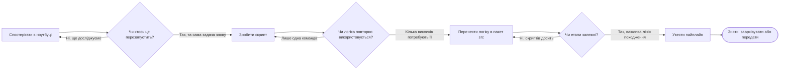

> **Трек «Інженерія ШІ/МН»** | Складність: `[MEDIUM]` | Час: 2-3 години
>
> **Передумови**: модулі 1.1–1.3 завершені

---

## Що ви зможете робити

Наприкінці цього модуля ви зможете:

- оцінити, чи задача належить у ноутбук, скрипт, повторно використовуваний пакет або пайплайн, з огляду на відтворюваність, співпрацю й операційний ризик
- рефакторити безладну логіку ноутбука в структурований проєкт із повторно використовуваними модулями, скриптами командного рядка, відокремленими даними й контрольованими виводами
- налагоджувати типові збої переходу «ноутбук → проєкт»: прихований стан, скопійовану попередню обробку, шумні артефакти й незаписані зміни конфігурації
- спроєктувати стартовий макет проєкту ШІ, який підтримує дослідження сьогодні й лишає ясний шлях до тестів, автоматизації та передачі в продакшен
- обґрунтувати рішення щодо контролю версій і керування артефактами, щоб колеги могли відтворити результати, не перетворюючи репозиторій на звалище згенерованих файлів

Цей модуль не про те, щоб ноутбуки виглядали професійно. Він про те, де має жити кожен вид роботи, щоб експерименти витримували контакт з іншими людьми, пізніші повторні запуски й очікування продакшену.

---

## Чому цей модуль важливий

*(Майя — гіпотетичний ілюстративний учень, не задокументований інцидент.)* Майя приєдналася до невеликої команди ШІ за два тижні до демо для замовника. Модель уже виглядала перспективно, ноутбук мав привабливі графіки, і всі вважали, що важка частина позаду. Потім вона спробувала перезапустити проєкт зі свіжого клону.

Перший запуск упав, бо ноутбук очікував локальний файл, який ніколи не комітили. Другий завершився, але дав інші метрики, бо одну клітинку попередньої обробки виконали днями раніше з трохи іншим правилом. Третій згенерував графік, але ніхто не міг сказати, чи він з поточної моделі, з моделі минулого тижня, чи з вручну відредагованого CSV.

Модель не була першою точкою відмови. Нею була структура проєкту. Команда ставилася до ноутбука як до надійної системи, хоча насправді це був запис дослідження, змішаний із прихованим станом, тимчасовими файлами й скопійованою логікою.

Така історія типова в інженерії ШІ та МН. Ноутбук може допомогти відкрити корисну ідею, але він сам по собі не дає відтворюваної задачі навчання, рецензованої бібліотеки попередньої обробки чи процесу оцінювання, готового до розгортання.

Професійні проєкти ШІ потребують навмисного шляху від дослідження до повторюваності. Вам не потрібен корпоративний інструментарій у перший день, але потрібні межі, які роблять намір видимим: ноутбуки для мислення, скрипти для повторюваних запусків, пакети для повторно використовуваної логіки й пайплайни для оркестрованих робочих процесів.

Старша звичка — не уникати ноутбуків. Старша звичка — знати, коли ноутбук закінчив свою роботу і коли її треба підвищити до коду, який інша людина може запустити, рецензувати, протестувати й якому може довіряти.

---

## Ментальна модель: чотири режими роботи

Робота зі ШІ змінює форму, коли невизначеність зменшується. На старті ви часто питаєте: «Що в цих даних?» або «Чи ця ідея дає якийсь сигнал?» Пізніше питаєте: «Чи можемо запустити це знову?» і «Чи може інша система залежати від цього виводу?» Це різні питання, і їм пасують різні режими роботи.

Ноутбук найкращий, коли наступна корисна дія залежить від того, що ви щойно спостерігали. Ви запускаєте запит, оглядаєте графік, змінюєте припущення й пробуєте знову. Цей цикл зворотного зв’язку сильний, бо тримає дослідження близько до доказів.

Скрипт найкращий, коли корисну дію треба повторювати без ручного виконання клітинок. Вам потрібна команда, яка приймає параметри, читає очікувані входи, пише очікувані виводи й поводиться так само після перезапуску ядра або на машині колеги.

Пакет найкращий, коли кільком ноутбукам або скриптам потрібна та сама логіка. Завантаження наборів даних, інженерія ознак, форматування промптів, обчислення метрик і обгортки інференсу не варто копіювати між файлами, бо скопійована логіка стає неузгодженою логікою.

Пайплайн найкращий, коли робота має кілька залежних етапів і важливе відстеження артефактів. Прийняття даних, валідація, перетворення, навчання моделі, оцінювання результату й публікація артефактів — це не просто команди; це робочий процес із залежностями й наслідками.

```text
+-----------------+        +-----------------+        +----------------------------+        +--------------------+
| Режим ноутбука  |        | Режим скрипта   |        | Режим пакета               |        | Режим пайплайна    |
| дослідити сигнал| -----> | повторити запуск| -----> | повторно використати логіку| -----> | оркеструвати       |
| оглянути дані   |        | задати параметри|        | протестувати поведінку     |        | відстежувати виводи|
+-----------------+        +-----------------+        +----------------------------+        +--------------------+
        |                          |                                |                                 |
        v                          v                                v                                 v
   "Що відбувається?"         "Запустити знову."           "Використовувати безпечно."            "Експлуатувати."
```

Стрілки — це не рейтинг зрілості, де ноутбуки дитячі, а пайплайни просунуті. Вони показують, як відповідальність зміщується, коли проєкт стає менш невизначеним і більш спільним.

Самостійний навчальний проєкт може лишатися переважно в режимах ноутбука й скрипта. Командний проєкт, який живить наступний сервіс, зазвичай має перенести ключову логіку в пакети й робочі процеси. Правильна відповідь залежить від ризику, а не від моди.



Діаграма корисна, бо перетворює розмиту архітектурну розмову на операторське рішення. Питання не «Який інструмент професійніший?». Питання: «Яку відповідальність уже набула ця робота і який режим роботи робить ту відповідальність достатньо явною для наступної людини?»

**Зупиніться і подумайте:** якщо ваш поточний проєкт ШІ зникне з пам’яті й лишиться лише репозиторій Git, які кроки інша людина зможе перезапустити, не питаючи вас, у якому порядку виконували клітинки ноутбука?

Це питання показує межу між дослідженням і інженерією. Якщо відповідь — «майже жодних», наступне покращення — не складніший інструмент; це ясніший макет проєкту й менша кількість повторно використовуваного коду, винесеного з клітинок.

---

## Почніть просто: що куди належить

Макет проєкту — це засіб комунікації. Він каже майбутнім читачам, що можна редагувати, що можна перезапускати, що було згенеровано і до чого варто ставитися обережно. Доброму стартовому макету не потрібно багато тек, але ті теки, які є, мають щось означати.

```text
my-ai-project/
├── README.md
├── pyproject.toml
├── notebooks/
│   ├── 01-exploration.ipynb
│   └── 02-error-analysis.ipynb
├── src/
│   └── my_project/
│       ├── __init__.py
│       ├── data.py
│       ├── features.py
│       ├── train.py
│       ├── evaluate.py
│       └── inference.py
├── configs/
│   ├── train-baseline.yaml
│   └── eval-local.yaml
├── data/
│   ├── raw/
│   ├── interim/
│   └── processed/
├── outputs/
│   ├── figures/
│   ├── predictions/
│   └── reports/
└── tests/
    ├── test_features.py
    └── test_metrics.py
```

Найважливіша межа — між джерельним і згенерованим матеріалом. Файли під `src/` виражають поведінку проєкту і їх варто рецензувати як код. Файли під `outputs/` з’являються після запуску коду і їх зазвичай треба відтворювати, а не редагувати вручну.

Друга важлива межа — між сирими й обробленими даними. Сирі дані варто трактувати як вхідний доказ. Оброблені дані — похідний артефакт, який зазвичай можна відтворити, якщо відомі код перетворення і версія входу.

Третя важлива межа — між ноутбуками й повторно використовуваним кодом. Ноутбук може імпортувати функції, будувати графіки й пояснювати висновки, але не має бути єдиним місцем, де живе критична для бізнесу попередня обробка чи логіка оцінювання.

Корисний макет полегшує помітити помилки. Якщо хтось кладе `final_predictions_v2_actual.csv` поруч із `train.py`, сам каталог каже, що файл не на своєму місці. Якщо все лежить у кореневій теці, проєкт такого зворотного зв’язку не дає.

**Активна перевірка:** уявіть, що колега відкриває репозиторій і хоче змінити правило нормалізації тексту. У макеті вище, куди їм дивитися спочатку і яких файлів уникати ручного редагування?

Найкраща відповідь: повторно використовувана логіка нормалізації має жити під `src/my_project/`, імовірно в `features.py` або спорідненому модулі. Їм не варто вручну правити згенеровані файли під `outputs/`, бо ці файли мають з’являтися від команд, а не від латок руками.

---

## Режим ноутбука: для відкриття, не для залежності

Ноутбуки чудові, коли робота інтерактивна. Можна завантажити невеликий зразок, оглянути пропущені значення, побудувати розподіл, випробувати промпт або порівняти виводи моделі, тримаючи спостереження поруч із кодом. Саме ця близькість робить ноутбуки цінними навіть у зрілих інженерних командах.

Небезпека в тому, що ноутбуки змушують тимчасовий стан відчуватися постійним. Змінна може існувати, бо ви виконали вже видалену клітинку. Dataframe може містити стовпці, породжені попередньою версією перетворення. Графік може малюватися з файла, який є лише на вашому лептопі.

Файл ноутбука виглядає лінійним, але історія виконання може бути нелінійною. Ця розбіжність створює класичний збій: «У мене працює, коли я запускаю клітинки так, як пам’ятаю, але ніхто інший не може це відтворити».

Здоровий ноутбук має вузьку роль. Він імпортує стабільну логіку, обирає невеликий експеримент, візуалізує або пояснює результат і записує міркування. Він не ховає єдину реалізацію попередньої обробки, навчання, оцінювання чи поведінки розгортання.

Добрий вміст ноутбука включає дослідницькі запити, графіки, таблиці порівняння метрик, спроби промптів, ручний аналіз помилок і короткі пояснювальні проходження. Ці дії виграють від інтерактивності й анотацій, бо учень або практик ще формує судження.

Поганий вміст ноутбука включає фінальну логіку навчання, критичну для розгортання попередню обробку, скопійовані продакшен-функції, великі закомічені виводи, ручні залежності від порядку клітинок і приховані записи файлів, які жодна команда не документує. Ці дії потребують повторюваності більше, ніж інтерактивності.

Практичний тест простий: якщо результат треба запустити знову точно й йому мають довіряти інші люди, він не повинен жити лише в ноутбуці. Його можна викликати з ноутбука, але повторно використовувана поведінка має жити там, де її можна протестувати й запустити поза ноутбуком.

Ця відмінність важлива навіть для малих проєктів. Один ноутбук стає некерованим, щойно в ньому змішані завантаження даних, очищення, інженерія ознак, підгонка моделі, оцінювання, візуалізація й звітування. Проблема не в кількості рядків; проблема в неясній відповідальності.

---

## Режим скрипта: перетворіть повторювану роботу на команди

Скрипт — це обіцянка, що задачу можна повторити без людської пам’яті. Команда має казати, що вона робить, через аргументи, конфігурацію, входи й виводи. Колезі не треба знати, яку клітинку ви запустили першою.

Скрипти особливо корисні, коли експеримент треба перезапустити зі зміненими параметрами. Скрипт навчання може приймати шлях до конфігурації. Скрипт оцінювання може приймати файл прогнозів і писати звіт метрик. Скрипт попередньої обробки може читати сирі дані й видавати оброблені.

Скрипт не мусить бути складним. Насправді перший скрипт часто має бути нудним. Його робота — викликати повторно використовувані функції в правильному порядку, перевірити очевидні входи й записати виводи в передбачувані місця.

```python
# src/my_project/features.py
from __future__ import annotations


def normalize_text(value: str) -> str:
    """Normalize text for a small baseline experiment."""
    return " ".join(value.strip().lower().split())


def build_features(rows: list[str]) -> list[dict[str, object]]:
    """Turn raw text rows into simple features that a script or notebook can reuse."""
    features = []
    for row in rows:
        cleaned = normalize_text(row)
        features.append(
            {
                "text": cleaned,
                "character_count": len(cleaned),
                "word_count": len(cleaned.split()),
            }
        )
    return features
```

```python
# src/my_project/run_features.py
from __future__ import annotations

import json
from pathlib import Path

from my_project.features import build_features


PROJECT_ROOT = Path(__file__).resolve().parents[2]
INPUT_PATH = PROJECT_ROOT / "data" / "raw" / "sample.txt"
OUTPUT_PATH = PROJECT_ROOT / "outputs" / "reports" / "features_preview.jsonl"


def main() -> None:
    rows = INPUT_PATH.read_text(encoding="utf-8").splitlines()
    features = build_features(rows)

    OUTPUT_PATH.parent.mkdir(parents=True, exist_ok=True)
    with OUTPUT_PATH.open("w", encoding="utf-8") as handle:
        for item in features:
            handle.write(json.dumps(item) + "\n")

    print(f"Wrote {len(features)} rows to {OUTPUT_PATH}")


if __name__ == "__main__":
    main()
```

```bash
PYTHONPATH=src .venv/bin/python src/my_project/run_features.py
```

Тут `PYTHONPATH=src` — лише скорочення до встановлення для проєкту, який ще не встановлено. Щойно пакет має редаговане встановлення, запускайте команду без цього префікса середовища.

Функція в `features.py` — повторно використовувана логіка. Скрипт у `run_features.py` — виконуваний робочий процес. Ноутбук може імпортувати ту саму функцію для огляду, але більше не володіє єдиною копією перетворення.

Зауважте, що скрипт пише в `outputs/reports/`, а не поруч із файлом джерела. Цей один вибір полегшує рецензію, бо зміни джерела й згенеровані результати не змагаються за увагу в одному каталозі.

Також зауважте, що шляхи виводяться з розташування скрипта, а не жорстко прив’язані до машини одного розробника. Це робить скрипт портативнішим і уникає режиму відмови «працює лише на моєму лептопі».

**Зупиніться і подумайте:** якщо цей скрипт видав неправильний `word_count`, де ви виправите помилку і як уникнете окремого виправлення в трьох ноутбуках?

Помилка належить у `src/my_project/features.py`, бо саме там живе повторно використовувана поведінка. Щойно функцію виправлено там, скрипти й ноутбуки, які її імпортують, отримують ту саму корекцію замість розходитись.

---

## Режим пакета: дайте спільній логіці дім

Режим пакета починається, коли ви перестаєте ставитися до файлів Python як до випадкових помічників і починаєте ставитися до них як до невеликої бібліотеки проєкту. Бібліотеку не треба публікувати на PyPI. Їй потрібні лише стабільні імена, ясні відповідальності й поведінка, яку можна протестувати.

Пакет дає колегам спільний словник. Замість «скопіюй клітинки очищення з другого ноутбука» можна сказати «використай `build_features()` із `my_project.features`». Зміна звучить дрібно, але перетворює процес на основі пам’яті на інтерфейс.

Межа пакета також допомагає вирішити, що заслуговує тестів. Дослідницькі клітинки з графіками можуть не потребувати тестів, але нормалізація тексту, розбиття наборів даних, обчислення метрик і форматування промптів часто потребують. Якщо ці функції впливають на поведінку моделі або повідомлені результати, їм треба більше, ніж візуальний огляд.

```text
src/my_project/
├── __init__.py
├── data.py          # читати й валідувати вхідні набори даних
├── features.py      # перетворити сирі приклади на входи, готові для моделі
├── metrics.py       # обчислювати числа оцінювання узгоджено
├── train.py         # оркестрація навчання й логіка збереження моделі
├── evaluate.py      # оркестрація оцінювання й створення звіту
└── inference.py     # обгортка прогнозу для демо або сервісів
```

Добрий макет пакета йде за відповідальностями, а не за іменами інструментів. Уникайте файлів на кшталт `utils.py`, які стають шухлядою для непов’язаних функцій. Функція, що читає дані, належить біля завантаження даних. Функція, що обчислює метрики, належить біля оцінювання.

Для проєктів початківця кількох модулів досить. Для роботи старшого рівня та сама ідея масштабується в ясніші інтерфейси: об’єкти наборів даних, схеми конфігурації, обгортки моделей, звіти оцінювання й адаптери розгортання. Принцип не змінюється; повторно використовувана поведінка потребує стабільного дому.

Пакет не повинен ховати кожну деталь за абстракцією. Передчасна абстракція може ускладнити малий проєкт. Переносьте код у пакет, коли з’являється тиск повторного використання, тестів або рецензії, а не тому, що кожна клітинка ноутбука негайно має стати класом.

Корисне правило рішення — стежити за другою копією. Перша версія помічника може жити в ноутбуці, поки ви вчитеся. Коли іншому ноутбуку чи скрипту потрібна та сама логіка, витягніть її, перш ніж дві копії еволюціонують по-різному.

---

## Метадані проєкту: `pyproject.toml` як контракт

Щойно повторно використовуваний код живе під `src/`, репозиторію потрібен невеликий контракт проєкту. Цим контрактом зазвичай є `pyproject.toml`, бо Python Packaging User Guide описує його як місце, де проєкт заявляє вимоги системи збірки й метадані проєкту: ім’я, вимоги до версії Python, залежності, необов’язкові залежності та точки входу. Важлива звичка — не запам’ятати кожен ключ. Звичка — знати, які вибори належать у метадані, які — у конфігурацію часу виконання, а які не належать у жоден із файлів. ([PyPA: Writing your pyproject.toml](https://packaging.python.org/en/latest/guides/writing-pyproject-toml/), [PyPA: pyproject.toml specification](https://packaging.python.org/en/latest/specifications/pyproject-toml/))

Для проєкту «ноутбук → скрипт» `pyproject.toml` має відповісти на три практичні питання. Який пакет має бути імпортованим із `src/`? Яких версій Python і бібліотек часу виконання очікує проєкт? Які додаткові залежності розробки дають колезі запустити ноутбуки, тести й лінтери, не здогадуючись із вашої історії оболонки? Ці відповіді роблять налаштування середовища рецензованим у Git замість прихованого в довгій послідовності одноразових команд встановлення.

```toml
[build-system]
requires = ["setuptools>=69"]
build-backend = "setuptools.build_meta"

[project]
name = "notebook-refactor-demo"
version = "0.1.0"
requires-python = ">=3.12"
dependencies = [
  "pandas>=2.2",
  "scikit-learn>=1.5",
]

[project.optional-dependencies]
dev = [
  "jupyterlab>=4",
  "pytest>=8",
  "ruff>=0.5",
]

[tool.setuptools.packages.find]
where = ["src"]

[tool.pytest.ini_options]
pythonpath = ["src"]
testpaths = ["tests"]
```

Макет `src` — не прикраса. Setuptools документує виявлення пакетів для проєктів `src-layout`, і цей макет допомагає запобігти випадковому імпорту з кореня репозиторію, який ховає помилки пакування. Якщо проєкт встановлюється чисто, а тести імпортують `my_project` через те саме ім’я пакета, яке використовують ноутбуки й скрипти, ви тестуєте ту форму проєкту, яку запускатимуть колеги, а не щасливий локальний шлях. ([Setuptools: Package Discovery and Namespace Packages](https://setuptools.pypa.io/en/latest/userguide/package_discovery.html))

```bash
.venv/bin/python -m pip install -e ".[dev]"
.venv/bin/python -m pytest
```

Після цього встановлення `PYTHONPATH=src` більше не потрібен; пакет імпортується за іменем в активному середовищі.

Не перетворюйте `pyproject.toml` на щоденник експериментів. Пороги моделі, знімки наборів даних, варіанти промптів і шляхи звітів зазвичай належать в аргументи команд або файли конфігурації, бо вони змінюються від запуску до запуску. Імена пакетів, підтримувані версії Python і налаштування інструментів розробки належать у `pyproject.toml`, бо вони описують середовище проєкту. Це розділення тримає метадані стабільними, водночас дозволяючи експериментам варіюватися.

---

## Гігієна залежностей: оберіть одне джерело істини

Гігієна залежностей — це операційне рішення раніше, ніж рішення про інструменти. Команда потрапляє в халепу, коли одна людина редагує `requirements.txt`, інша запускає `uv add`, третя використовує `pdm add`, а сервер ноутбуків містить пакети, яких ніколи немає в репозиторії. Виправлення — обрати одне джерело істини для прямих залежностей, одну політику lock-файла або компільованого артефакта й одну задокументовану команду встановлення. Модуль `venv` у Python підтримує ізольовані середовища, але ізоляція допомагає лише якщо середовище можна відтворити з файлів, які проєкт справді відстежує. ([Python venv](https://docs.python.org/3/library/venv.html))

| Вибір інструментарію | Джерело істини залежностей | Артефакт відтворюваності | Добре операторське використання |
|---|---|---|---|
| Робочий процес проєкту `uv` | `pyproject.toml`, керований через `uv add` і споріднені команди проєкту | `uv.lock` записує розв’язане середовище | Найкраще, коли команда хоче швидку синхронізацію проєкту й робочий процес, керований lock-файлом |
| Робочий процес PDM | `pyproject.toml`, керований через `pdm add` і групи залежностей | `pdm.lock` записує розв’язане середовище | Найкраще, коли команда вже стандартизується на керуванні проєктами PDM |
| Робочий процес `pip-tools` | `requirements.in`, `pyproject.toml` або подібні вхідні файли | скомпільований `requirements.txt` від `pip-compile` | Найкраще, коли розгортання або політика платформи очікує зафіксовані файли вимог |

Таблиця — не рейтинг. Це попередження проти змішаної власності. uv документує залежності проєкту в `pyproject.toml` і синхронізацію проєкту через власний робочий процес. PDM документує керування залежностями через метадані проєкту й групи. pip-tools документує `pip-compile` як команду, що компілює зафіксований вивід вимог із входів вищого рівня. Кожен підхід може бути дисциплінованим, коли команда дотримується його послідовно. Кожен стає плутаним, коли згенеровані файли редагує інший робочий процес вручну. ([uv: Managing Dependencies](https://docs.astral.sh/uv/concepts/projects/dependencies/), [PDM: Manage Dependencies](https://pdm-project.org/latest/usage/dependency/), [pip-tools: pip-compile](https://pip-tools.readthedocs.io/en/stable/reference/pip-compile/))

```bash
# uv-owned project
uv add pandas scikit-learn
uv sync
# (use uv run <command> for one-off commands in the managed environment)

# PDM-owned project
pdm add pandas scikit-learn
pdm install

# pip-tools-owned project
.venv/bin/pip-compile requirements.in -o requirements.txt
.venv/bin/pip-sync requirements.txt
```

Для роботи з великою часткою ноутбуків гігієна залежностей також захищає інтерпретацію. Метрика моделі може змінитися, бо змінилися дані, код або версія бібліотеки. Якщо стан залежностей не задокументовано, команда може годинами налагоджувати поведінку моделі, тоді як справжня різниця — тихо оновлений парсер, токенізатор, бібліотека dataframe або пакет оцінювання. Чистий проєкт записує рішення про залежності біля коду, щоб повторні запуски перевіряли ту саму гіпотезу в тій самій межі середовища.

---

## Конфігурація: відділіть вибори від коду

Експерименти ШІ часто різняться параметрами, а не поведінкою. Ви можете змінити ім’я моделі, вхідний файл, зерно розбиття, шаблон промпту, кількість епох навчання, поріг або шлях виводу. Якщо кожна зміна вимагає редагування джерельного коду, експерименти стає важко порівнювати.

Файли конфігурації роблять вибори явними. Вони дають запустити той самий код із різними налаштуваннями й зберегти умови, за яких з’явився вивід. Це особливо важливо, коли результати обговорюють на рецензіях або в звітах.

```yaml
# configs/train-baseline.yaml
data:
  input_path: data/processed/train.jsonl
  validation_path: data/processed/validation.jsonl

model:
  name: baseline-logistic-regression
  random_seed: 13

training:
  max_examples: 5000
  text_field: text
  label_field: label

outputs:
  report_path: outputs/reports/train-baseline.json
  predictions_path: outputs/predictions/train-baseline.jsonl
```

Файл конфігурації не автоматично кращий за аргументи командного рядка. Малі скрипти можуть використовувати аргументи безпосередньо. Щойно запуск потребує кількох пов’язаних налаштувань, файл конфігурації стає легшим для рецензії й збереження.

Глибша думка в тому, що вибори експерименту не мають ховатися в редагованих клітинках. Якщо результат залежить від порога `0.72`, випадкового зерна або конкретного знімка входу, ця залежність має бути видимою в команді або конфігурації, якою результат отримано.

Для серйозної роботи збережіть копію фактично застосованої конфігурації поруч зі звітом виводу. Ця практика значно полегшує пізніші порівняння, бо артефакт несе доказ того, як його отримали.

```text
outputs/
└── reports/
    ├── train-baseline.json
    └── train-baseline.config.yaml
```

Конфігурація також зменшує соціальне тертя. Рецензент може обговорити, чи поріг має сенс, не читаючи весь скрипт, а колега може перезапустити експеримент, не шукаючи змінених літералів у ноутбуці.

---

## Гігієна даних і виводів

Проєкти ШІ генерують безлад швидше за більшість програмних проєктів. Один полудень може видати сирі експорти, очищені набори даних, закешовані ембедінги, файли прогнозів, знімки екрана, графіки, звіти метрик, контрольні точки моделей і контрольні точки ноутбуків.

Безлад стає небезпечним, коли згенеровані файли не відрізнити від джерельних. Колега може вручну відредагувати вивід. Рецензія може зосередитися на сотнях змінених рядків метаданих ноутбука. Скрипт може випадково прочитати вчорашній оброблений файл замість сьогоднішнього сирого входу.

Окремі каталоги зменшують цей ризик, даючи кожному файлу роль. Сирі дані належать під `data/raw/`. Проміжні перетворення можуть жити під `data/interim/`. Оброблені набори, готові для моделі, можуть жити під `data/processed/`. Згенеровані графіки, прогнози й звіти належать під `outputs/`.

```text
data/
├── raw/
│   └── customer-feedback-2026-04-20.csv
├── interim/
│   └── feedback-cleaned.jsonl
└── processed/
    ├── train.jsonl
    └── validation.jsonl

outputs/
├── figures/
│   └── label-distribution.png
├── predictions/
│   └── baseline-validation.jsonl
└── reports/
    └── baseline-metrics.json
```

Цей макет не вирішує, що комітити в Git. Він лише вирішує, куди речі належать. Рішення контролю версій і далі залежать від розміру, чутливості, відтворюваності та політики команди.

Невеликий зразок даних для тестів може належати в Git. Великий сирий експорт із чутливими полями — ні. Згенерований звіт метрик для релізу можна зберегти навмисно. Тимчасовий графік із дослідження, ймовірно, комітити не варто.

Виводи ноутбуків потребують особливої уваги. Клітинки виводу можуть зробити ноутбуки величезними, шумними й важкими для рецензії. Якщо ноутбук задумано як навчальний матеріал, кілька малих виводів можуть допомогти. Якщо це журнал експерименту, розгляньте зняття громіздких виводів і зберігання важливих артефактів окремо.

Чистий репозиторій має описувати, як відтворити важливі артефакти. Він не повинен дзеркалити кожен артефакт, який проєкт коли-небудь видав. Різниця — дисципліна, а не мінімалізм.

**Активна перевірка:** ваш pull request включає змінений скрипт навчання, згенерований PNG, закешований файл ембедінгів і JSON-звіт метрик. Які файли ви попросили б команду рецензувати як джерело, а які трактувати як артефакти, що потребують явної причини для коміту?

Скрипт навчання — джерело, і його варто рецензувати безпосередньо. Згенерований PNG, закешовані ембедінги й звіт метрик — артефакти; вони можуть бути корисними, але кожен потребує причини бути закоміченим замість відтвореним задокументованою командою.

---

## Опрацьований приклад: від безладного ноутбука до структурованого проєкту

*(Гіпотетичний навчальний приклад, не записаний запуск і не інцидент продакшену.)* Тепер ми перетворимо невеликий безладний ноутбук на підтримуваний проєкт. Мета — не створити ідеальну архітектуру. Мета — показати рішення по порядку, щоб ви могли застосувати те саме міркування до більших проєктів ШІ.

Припустімо, ноутбук почався як швидкий експеримент класифікації тексту. Він завантажує приклади, очищає текст, створює прості ознаки, обчислює фейкову оцінку для демонстрації й пише прогнози. Весь експеримент працює лише тому, що автор пам’ятає порядок клітинок.

```python
# notebooks/01-messy-experiment.ipynb cell
import json
from pathlib import Path

rows = [
    "  Great docs but setup was slow  ",
    "Model failed on my short examples",
    "  clean output and helpful walkthrough ",
]

cleaned = []
for row in rows:
    cleaned.append(" ".join(row.strip().lower().split()))

features = []
for text in cleaned:
    features.append(
        {
            "text": text,
            "word_count": len(text.split()),
            "character_count": len(text),
        }
    )

predictions = []
for item in features:
    label = "positive" if "great" in item["text"] or "helpful" in item["text"] else "needs_review"
    predictions.append({"text": item["text"], "label": label})

Path("final_outputs").mkdir(exist_ok=True)
with open("final_outputs/preds.jsonl", "w", encoding="utf-8") as handle:
    for prediction in predictions:
        handle.write(json.dumps(prediction) + "\n")
```

Це правдоподібний перший ноутбук. Він не поганий тому, що існує; він поганий, якщо стає єдиною реалізацією. Правило очищення, створення ознак, правило міток, вхідні дані й місце виводу — усі вони замкнені в одній дослідницькій клітинці.

Крок перший — визначити відповідальності. Ноутбук зараз обробляє вхід даних, нормалізацію тексту, побудову ознак, логіку прогнозу й запис артефактів. Ці відповідальності змінюються з різних причин, тож не мають лишатися сплутаними.

```text
Карта відповідальностей безладної клітинки
+----------------------+------------------------------------------+-----------------------------+
| Відповідальність     | Поточне місце                            | Кращий дім                  |
+----------------------+------------------------------------------+-----------------------------+
| зразок входу         | жорстко заданий список у ноутбуці         | data/raw/sample.txt         |
| нормалізація         | цикл усередині ноутбука                   | src/my_project/features.py  |
| побудова ознак       | цикл усередині ноутбука                   | src/my_project/features.py  |
| правило прогнозу     | цикл усередині ноутбука                   | src/my_project/inference.py |
| запис виводу         | запис файла з ноутбука                    | повторюваний скрипт        |
| візуальний огляд     | ноутбук                                   | ноутбук                    |
+----------------------+------------------------------------------+-----------------------------+
```

Крок другий — створити скелет проєкту. Структура дає кожній відповідальності місце призначення, перш ніж ми переносимо код. Це запобігає тому, щоб витягання стало ще однією купою випадкових файлів.

```bash
mkdir -p my-ai-project/{notebooks,src/my_project,data/raw,outputs/predictions,outputs/reports,tests}
touch my-ai-project/src/my_project/__init__.py
printf "  Great docs but setup was slow  \nModel failed on my short examples\n  clean output and helpful walkthrough \n" > my-ai-project/data/raw/sample.txt
```

Крок третій — перенести повторно використовувану логіку ознак у модуль. Ми ще не змінюємо поведінку. Ми зберігаємо поведінку, даючи їй стабільне ім’я й дім.

```python
# src/my_project/features.py
from __future__ import annotations


def normalize_text(value: str) -> str:
    return " ".join(value.strip().lower().split())


def build_features(rows: list[str]) -> list[dict[str, object]]:
    output = []
    for row in rows:
        text = normalize_text(row)
        output.append(
            {
                "text": text,
                "word_count": len(text.split()),
                "character_count": len(text),
            }
        )
    return output
```

Крок четвертий — перенести поведінку прогнозу в інший модуль. У реальному проєкті це може викликати навчену модель або кінцеву точку ВММ. Тут вона лишається простою, щоб головним уроком була структура проєкту.

```python
# src/my_project/inference.py
from __future__ import annotations


def predict_label(text: str) -> str:
    positive_markers = {"great", "helpful", "clean"}
    words = set(text.split())
    if words & positive_markers:
        return "positive"
    return "needs_review"


def predict_rows(features: list[dict[str, object]]) -> list[dict[str, object]]:
    predictions = []
    for item in features:
        text = str(item["text"])
        predictions.append({"text": text, "label": predict_label(text)})
    return predictions
```

Крок п’ятий — створити повторюваний скрипт, який з’єднує частини. Скрипт читає з `data/raw/`, викликає повторно використовуваний код і пише згенеровані прогнози під `outputs/`. Ноутбук більше не володіє контрактом виконання.

```python
# src/my_project/run_baseline.py
from __future__ import annotations

import json
from pathlib import Path

from my_project.features import build_features
from my_project.inference import predict_rows


PROJECT_ROOT = Path(__file__).resolve().parents[2]
INPUT_PATH = PROJECT_ROOT / "data" / "raw" / "sample.txt"
OUTPUT_PATH = PROJECT_ROOT / "outputs" / "predictions" / "baseline.jsonl"


def main() -> None:
    rows = INPUT_PATH.read_text(encoding="utf-8").splitlines()
    features = build_features(rows)
    predictions = predict_rows(features)

    OUTPUT_PATH.parent.mkdir(parents=True, exist_ok=True)
    with OUTPUT_PATH.open("w", encoding="utf-8") as handle:
        for prediction in predictions:
            handle.write(json.dumps(prediction) + "\n")

    print(f"Wrote {len(predictions)} predictions to {OUTPUT_PATH}")


if __name__ == "__main__":
    main()
```

Крок шостий — оновити ноутбук так, щоб він імпортував проєкт, а не дублював логіку. Ноутбук лишається корисним, бо може оглядати виводи й пояснювати рішення. Він більше не єдиний спосіб отримати результати.

```python
# notebooks/01-exploration.ipynb cell
from my_project.features import build_features
from my_project.inference import predict_rows

rows = [
    "  Great docs but setup was slow  ",
    "Model failed on my short examples",
    "  clean output and helpful walkthrough ",
]

features = build_features(rows)
predictions = predict_rows(features)
predictions
```

Крок сьомий — запустити проєкт чистою командою. Колега має змогти клонувати репозиторій, встановити залежності й запустити скрипт, не знаючи історії ноутбука.

```bash
cd my-ai-project
.venv/bin/python src/my_project/run_baseline.py
cat outputs/predictions/baseline.jsonl
```

Крок восьмий — додати невеликий тест навколо витягнутої логіки. Цей тест не про ідеальне покриття. Він захищає поведінку, яка раніше була схована в клітинці й тепер спільна для скриптів і ноутбуків.

```python
# tests/test_features.py
from my_project.features import build_features, normalize_text


def test_normalize_text_collapses_space_and_lowercases() -> None:
    assert normalize_text("  Helpful   Walkthrough  ") == "helpful walkthrough"


def test_build_features_counts_words_after_normalization() -> None:
    rows = ["  Clean output  "]
    assert build_features(rows) == [
        {
            "text": "clean output",
            "word_count": 2,
            "character_count": 12,
        }
    ]
```

Перетворення змінило проєкт конкретним чином. Ноутбук і далі підтримує дослідження, але повторювана поведінка тепер живе в модулях і скриптах. Виводи генеруються в передбачуваному каталозі. Тест захищає повторно використовувану логіку перетворення.

Старший урок: рефакторинг із ноутбука має бути поступовим. Не ставте дослідження на паузу на тиждень, щоб збудувати грандіозний фреймворк. Витягніть логіку, яку повторюють, якій довіряють або яку ділять, а тоді лишіть ноутбук зосередженим на спостереженні й інтерпретації.

---

## Перетворення ноутбука на скрипт

Інструменти перетворення допомагають перейти міст від дослідження до повторюваності, але вони не вирішують, що є продакшен-кодом. Документація Jupyter з форматування й перетворення вказує на nbconvert для перетворення документів ноутбуків, а nbconvert документує перетворення з командного рядка у форму скрипта. Той експортований скрипт — корисний доказ, бо показує поточний порядок ноутбука простим текстом. Він не автоматично є чистою програмою навчання, бо клітинки ноутбука все ще можуть змішувати імпорти, графіки, припущення markdown, тимчасові змінні й приховані вибори файлової системи. ([Jupyter: Formatting and Conversion](https://docs.jupyter.org/en/latest/projects/conversion.html), [nbconvert Usage](https://nbconvert.readthedocs.io/en/latest/usage.html))

```bash
mkdir -p converted
jupyter nbconvert --to script notebooks/01-exploration.ipynb --output-dir converted
head -160 converted/01-exploration.py
```

Використовуйте nbconvert, коли потрібен одноразовий витяг або знімок аудиту того, що ноутбук зараз містить. Наступний крок усе одно — людське судження. Функції, що визначають повторно використовувану поведінку, переходять у `src/my_project/`. Команди, які мають запускатися з чистої оболонки, стають скриптами. Побудова графіків і інтерпретація можуть лишитися в ноутбуці. Це не дає перетворенню стати механічним звалищем, де кожна клітинка стає постійною лише тому, що інструмент її експортував.

Jupytext розв’язує іншу задачу. Його робочий процес парних ноутбуків тримає файл `.ipynb` у парі з текстовим поданням, наприклад Python у percent-форматі або Markdown. Це може полегшити рецензію коду, бо колеги можуть оглядати текстову форму, водночас відкриваючи ноутбук інтерактивно. Найкорисніше, коли ноутбук лишається живим документом дослідження, а команда хоче рецензованих змін, не вдаючи, що ноутбук уже став скриптом. ([Jupytext: Paired Notebooks](https://jupytext.readthedocs.io/en/latest/paired-notebooks.html))

```bash
jupytext --set-formats ipynb,py:percent notebooks/01-exploration.ipynb
jupytext --sync notebooks/01-exploration.ipynb
git status --short notebooks/
```

Безпечна послідовність підвищення коротка. По-перше, перезапустіть ядро й проженіть ноутбук згори вниз, щоб експортований текст відображав реальний шлях виконання, а не стару пам’ять ядра. По-друге, експортуйте або спаруйте ноутбук, щоб поточний стан був рецензованим. По-третє, перенесіть повторювану або довірену поведінку в `src/`, додайте скрипт для повторюваного виконання й замініть копії в ноутбуці імпортами. По-четверте, додайте тест навколо поведінки, що впливає на результати. Якщо якийсь крок падає, збій — інформація про прихований стан, який ноутбук маскував.

| Ситуація | Кращий хід інструмента | Інженерне рішення |
|---|---|---|
| Потрібен одноразовий текстовий знімок наявного ноутбука | Експортувати через nbconvert | Рецензуйте експортований порядок, потім витягніть лише повторно використовувану поведінку |
| Ноутбук лишається активним, але diff занадто шумний | Спарувати з Jupytext | Тримайте дослідження інтерактивним, рецензуючи кодоподібні зміни в тексті |
| Результат треба запускати щодня або він живить інший сервіс | Написати скрипт і функції пакета | Ставтеся до ноутбука як до інспектора, а не як до контракту виконання |

Не вимірюйте успіх відсутністю ноутбуків. Вимірюйте успіх тим, чи проєкт може пояснити, який ноутбук дослідницький, який скрипт перезапускає результат, який модуль володіє спільною поведінкою, яка конфігурація записує вибори запуску і який шлях артефактів містить згенерований вивід. Це пояснення перетворює роботу в ноутбуці на інженерну роботу.

---

## Точки рішення: коли підвищувати роботу

Найважча частина — не знати, що скрипти й пакети існують. Найважча частина — вирішити, коли поточна форма вже недостатня. Підвищення має ґрунтуватися на терті й ризику.

Переходьте від ноутбука до скрипта, коли задачу треба запускати повторно, коли параметри треба змінювати системно, коли її має запустити інша людина або коли результат використовують для порівняння. Повторення — сигнал, що ручне виконання клітинок стає зобов’язанням.

Переходьте від скрипта до пакета, коли кільком скриптам чи ноутбукам потрібна та сама логіка, коли поведінці потрібні тести або коли важливі імена й інтерфейси. Спільна логіка без спільного дому — місце, де починається тонкий дрейф проєкту.

Переходьте від пакета до пайплайна, коли є кілька залежних кроків, коли артефактам потрібна лінія походження, коли задачі треба планувати або коли збої треба ізолювати за етапами. Пайплайн — не просто більший скрипт; він записує форму робочого процесу.

```text
Посібник із рішень
+-----------------------------+-----------------------------+------------------------------+
| Сигнал                      | Ризик, якщо ігнорувати      | Наступний хід                |
+-----------------------------+-----------------------------+------------------------------+
| Часто потрібен повторний запуск | помилки ручного порядку клітинок | створити скрипт         |
| Логіку скопійовано двічі    | неузгоджена поведінка       | витягти модуль пакета        |
| Параметри правлять у коді   | неясна історія експериментів | використати аргументи або конфіг |
| Багато залежних етапів      | часткові, невідстежені запуски | увести пайплайн           |
| Виводи важко порівнювати    | ненадійні висновки          | стандартизувати шляхи виводу |
| Потрібна передача           | залежність від незадокументованого знання | задокументувати команди й макет |
+-----------------------------+-----------------------------+------------------------------+
```

Не підвищуйте роботу лише тому, що так виглядає професійніше. Ноутбук із ясним призначенням може бути кращим за надбудований фреймворк. Один скрипт може бути кращим за пайплайн, коли є лише один етап і немає проблеми лінії походження артефактів.

З іншого боку, не ховайтеся за простотою, коли проєкт уже спільний. Якщо троє людей редагують той самий ноутбук, копіюють клітинки між експериментами й вручну перейменовують файли виводу, проєкт уже переріс чистий режим ноутбука.

Добре інженерне рішення називає і вартість, і ризик. «Ми тримаємо це в ноутбуці, бо питання ще дослідницьке» — захищенно. «Ми тримаємо продакшен-попередню обробку в ноутбуці, бо її ще ніхто не переніс» — ні.

---

## Контроль версій: рецензуйте проєкт, а не уламки

Git чудово рецензує джерельний код і текстову конфігурацію. Він менш приємний для великих наборів даних, бінарних артефактів, громіздких виводів ноутбуків, закешованих ембедінгів, контрольних точок моделей і згенерованих зображень. Однакове ставлення до всіх файлів погіршує рецензії.

Відстежуйте файли, що описують, як працює проєкт: джерельний код, тести, конфігурацію, легку документацію, визначення залежностей і малі приклади даних, коли це безпечно й корисно. Ці файли допомагають іншій людині зрозуміти й відтворити поведінку.

Уникайте відстеження файлів, які великі, чутливі, згенеровані або легко відтворювані, якщо немає навмисної причини. Сирі дані замовників, контрольні точки моделей, тимчасові прогнози, контрольні точки ноутбуків і проміжні кеші зазвичай потребують сховища артефактів або інструкцій відтворення замість комітів Git.

`.gitignore` — частина дизайну проєкту. Він документує, які згенеровані шляхи мають лишатися поза звичайною рецензією. Файл має бути достатньо конкретним, щоб ловити типовий безлад, не ховаючи випадково джерельні файли.

```text
# generated outputs
outputs/
*.log

# notebook internals
.ipynb_checkpoints/

# local environment
.venv/
.env

# common caches
__pycache__/
.pytest_cache/
```

Будьте обережні з широкими правилами ігнорування. Ігнорувати всі файли `data/` може бути доречно для чутливих проєктів, але це також може сховати малі зразкові фікстури, потрібні для тестів. Кращий патерн часто — ігнорувати великі підкаталоги, явно дозволяючи безпечні приклади.

Diff ноутбуків потребує особливої уваги. JSON-файли ноутбуків містять метадані, лічильники виконання й виводи, які можуть домінувати в рецензії, бо документація nbformat визначає ноутбуки як структуровані JSON-документи з клітинками, метаданими й виводами. Інструменти на кшталт diff, обізнаного з ноутбуками, і зняття виводів існують, бо звичайні текстові diff для ноутбуків часто занадто шумні. ([nbformat: Notebook Format](https://nbformat.readthedocs.io/en/latest/format_description.html), [nbdime](https://github.com/jupyter/nbdime), [nbstripout](https://github.com/kynan/nbstripout))

Проєкт має швидко відповідати на три питання рецензії: Яка поведінка змінилася? Які вибори експерименту змінилися? Які артефакти з’явилися після запуску проєкту? Якщо pull request не може відповісти на ці питання, макет і звички контролю версій потребують покращення.

---

## Від звичок початківця до звичок старшого практика

Початківець часто питає: «Куди покласти це, щоб запустилося?» Це розумне стартове питання, але його недостатньо, щойно від роботи залежать інші люди. Старший практик питає: «Де це має жити, щоб наступна зміна була безпечнішою?»

Різниця з’являється в малих виборах. Початківець копіює клітинку очищення в другий ноутбук. Старший витягує правило очищення, перш ніж копії розійдуться. Початківець зберігає `new_final_results.csv` у кореневій теці. Старший пише виводи в передбачуваний шлях командою, яка може їх відтворити.

Старші звички також видно в іменуванні. `run_baseline.py` каже колезі, як виконати базовий варіант. `features.py` каже, де живуть перетворення. `outputs/predictions/baseline.jsonl` каже, що файл згенеровано і що він представляє.

Це не бюрократія заради себе. Ясна структура зменшує когнітивне навантаження під час налагодження. Коли метрика змінюється несподівано, ви можете окремо оглянути конфігурацію, джерельний код, вхідні дані й згенеровані виводи замість шукати приховані причини в довгому ноутбуці.

Добра структура проєкту також робить співпрацю менш особистою. Замість просити початкового автора згадати, що сталося, команда може оглянути команди, модулі, конфіги й артефакти. Проєкт несе більше власного пояснення.

Найкращі інженери ШІ зберігають швидкість дослідження, водночас будуючи з нього шляхи виходу. Вони використовують ноутбуки, щоб швидко вчитися, скрипти — щоб надійно перезапускати, пакети — щоб ділити поведінку, і пайплайни, коли проблемою стає координація.

---

## Чи знали ви?

1. [Файли ноутбуків — структуровані JSON-документи, а не просто скрипти Python з додатковими коментарями.](https://nbformat.readthedocs.io/en/latest/format_description.html) Саме тому звичайні текстові diff можуть бути шумними і чому [інструменти diff, обізнані з ноутбуками](https://github.com/jupyter/nbdime), корисні в спільних проєктах.

2. [Посібник PyPA з `pyproject.toml`](https://packaging.python.org/en/latest/guides/writing-pyproject-toml/) трактує метадані проєкту й залежності як декларації проєкту, тому зміни залежностей належать у рецензовані файли, а не лише в історію термінала.

3. [Парні ноутбуки Jupytext](https://jupytext.readthedocs.io/en/latest/paired-notebooks.html) дають ноутбуку зберегти інтерактивну форму, тоді як текстове подання дає рецензентам чистіший вигляд кодоподібних змін.

4. [Документація Git `gitignore`](https://git-scm.com/docs/gitignore) описує ігноровані файли як навмисно невідстежувані, і саме ця ментальна модель потрібна для згенерованих виводів, кешів і локальних середовищ.

---

## Типові помилки

| Помилка | Що йде не так | Кращий хід |
|---|---|---|
| Тримати всю логіку всередині ноутбуків | прихований стан і невідтворювані запуски роблять передачу крихкою | перенесіть повторно використовувану попередню обробку, навчання й оцінювання в `src/` |
| Змішувати дані, код і виводи в одній теці | учасники не можуть сказати, що є джерелом, а що згенерованим матеріалом | розділіть каталоги за призначенням, перш ніж проєкт виросте |
| Відстежувати кожен вивід у Git | pull request стають шумними, а репозиторії роздуваються | відстежуйте джерело й навмисні приклади, а не кожен згенерований артефакт |
| Використовувати ноутбуки для кроків, критичних для продакшену | поведінка розгортання залежить від ручного порядку клітинок і локальної пам’яті | створюйте скрипти для повторюваного виконання й рецензованої передачі |
| Копіювати код між ноутбуками | малі виправлення потрапляють в одну копію, а інші зберігають стару поведінку | централізуйте спільний код, щойно з’являється другий користувач |
| Редагувати параметри безпосередньо всередині джерельного коду | історію експериментів важко відновити й порівняти | перенесіть вибори запуску в аргументи команд або файли конфігурації |
| Писати скрипти, що залежать від локальних абсолютних шляхів | колеги не можуть запустити проєкт зі свого клону | виводьте шляхи з кореня проєкту й документуйте команду |
| Створювати пайплайн до розуміння робочого процесу | команда підтримує оркестрацію навколо нестабільних припущень | почніть зі скриптів, потім пайплайніть етапи, які справді повторювані |

---

## Вікторина

**Q1.** У вашої команди є ноутбук, який навчає модель, пише прогнози й видає графік для щотижневого огляду. Після перезапуску ядра ноутбук проходить згори вниз, але видає інші метрики, бо раніше прихований стан dataframe зник. Що змінити першим і чому?

<details>
<summary>Відповідь</summary>

Перенесіть повторно використовувану попередню обробку, навчання й оцінювання з ноутбука в модулі та повторюваний скрипт. Безпосередня проблема — прихований стан ноутбука, тож виправлення — створити шлях виконання, який не залежить від запам’ятованого порядку клітинок. Ноутбук може й далі візуалізувати результат, але довірена поведінка має жити в коді, який можна запустити з чистого процесу.

</details>

**Q2.** Репозиторій містить `train.py`, `raw_export.csv`, `plot_new.png`, `predictions_final.jsonl` і два ноутбуки — усі в кореневій теці. Новий колега не може сказати, які файли є входами, які джерелом, а які згенеровані. Спроєктуйте кращий макет для цієї ситуації.

<details>
<summary>Відповідь</summary>

Покладіть джерельний код під `src/`, ноутбуки під `notebooks/`, сирі дані під `data/raw/`, а згенеровані графіки чи прогнози під `outputs/figures/` і `outputs/predictions/`. Мета — не косметична організація; мета — зробити намір файла видимим. Щойно макет розділяє відповідальності, рецензенти можуть зосередитися на змінах джерела й трактувати згенеровані артефакти як виводи з явними причинами для збереження.

</details>

**Q3.** Ви помічаєте ту саму клітинку очищення тексту, скопійовану в три ноутбуки й один скрипт навчання. Виправлення помилки вже застосовано лише в одній копії. Який рефакторинг виконати і який ризик він зменшує?

<details>
<summary>Відповідь</summary>

Витягніть логіку очищення в повторно використовувану функцію під пакетом проєкту, наприклад `src/my_project/features.py`, і імпортуйте її з ноутбуків і скрипта. Це зменшує ризик розходження, бо є одна реалізація, яку можна виправити й протестувати. Це також дає поведінці стабільне ім’я, полегшуючи майбутні рецензії й налагодження.

</details>

**Q4.** Менеджер продукту просить щоденні запуски оцінювання з різними значеннями порога, щоб команда могла порівнювати звіти виводу в часі. Поточний процес вимагає редагувати клітинку ноутбука перед кожним запуском. До якого режиму роботи це має рухатися?

<details>
<summary>Відповідь</summary>

Перенесіть оцінювання в режим скрипта з аргументами командного рядка або файлами конфігурації для значень порога. Щоденне повторюване виконання й системні зміни параметрів — сигнали, що ручні правки ноутбука вже недоречні. Звіти варто писати в передбачувані шляхи виводу, щоб порівняння ґрунтувалися на відтворюваних запусках.

</details>

**Q5.** Ваш pull request включає нову функцію оцінювання, оновлений файл конфігурації, великий згенерований файл прогнозів, зміни метаданих ноутбука й звіт метрик. Рецензент каже, що diff важко оглянути. Як вирішити, що належить у PR?

<details>
<summary>Відповідь</summary>

Функція оцінювання й файл конфігурації — зміни рівня джерела і зазвичай належать у PR. Великий файл прогнозів, шум метаданих ноутбука й згенерований звіт потребують явного обґрунтування, бо це артефакти. Якщо звіт важливий, задокументуйте команду, що його відтворює, або комітьте лише легкий навмисний артефакт згідно з політикою команди.

</details>

**Q6.** Колега хоче негайно ввести оркестратор робочого процесу, бо проєкт пізніше може стати орієнтованим на продакшен. Сьогодні є один дослідницький ноутбук і немає стабільного контракту попередньої обробки. Як ви оцінили б цю пропозицію?

<details>
<summary>Відповідь</summary>

Я б відклав оркестратор і спочатку витяг би стабільну логіку в скрипти й модулі пакета. Пайплайн корисний, коли повторювані етапи й залежності артефактів зрозумілі. Уводити оркестрацію надто рано може заморозити нестабільні припущення й додати вартість підтримки, перш ніж команда знатиме, який робочий процес справді потребує координації.

</details>

**Q7.** Наступний сервіс залежить від обробленого набору даних, створеного ноутбуком. Сервіс зламався, бо хтось змінив правило очищення в ноутбуці, але не оновив документацію. Яка структурна зміна запобігла б цьому класу збоїв?

<details>
<summary>Відповідь</summary>

Перенесіть правило очищення в рецензований джерельний код, запускайте його через повторюваний скрипт попередньої обробки й зберігайте відповідну конфігурацію або команду, використану для набору даних. Додайте тести навколо поведінки очищення, якщо від неї залежить наступний сервіс. Ключова зміна — зробити контракт попередньої обробки видимим і рецензованим замість схованого в дослідницьких клітинках.

</details>

**Q8.** Експеримент виріс до п’яти залежних кроків: прийняти сирі файли, провалідувати їх, побудувати ознаки, навчити модель і опублікувати артефакти оцінювання. Різні колеги запускають різні кроки вручну, і ніхто не знає, які виводи належать разом. Який наступний архітектурний хід?

<details>
<summary>Відповідь</summary>

Це добрий сигнал рухатися до режиму пайплайна. Проблема вже не в одній повторюваній команді; це координація залежних етапів і їхніх артефактів. Пайплайн може зробити порядок етапів, входи, виводи й збої явними, щоб команда могла відтворювати повні запуски, а не вручну зшивати часткові результати.

</details>

---

## Практична вправа

**Мета:** перетворити невеликий експеримент «спочатку ноутбук» на структурований проєкт, який розділяє дослідження, повторно використовуваний код, повторювані команди, дані й згенеровані виводи.

Для цієї вправи вам не потрібна справжня модель. Сенс — потренувати рішення архітектури проєкту, а не оптимізувати прогнозну якість. Використовуйте прості текстові приклади нижче, щоб зосередитися на структурі й відтворюваності.

- [ ] Створіть стартовий макет проєкту з окремими домами для ноутбуків, джерельного коду, сирих даних, згенерованих прогнозів, згенерованих звітів і тестів.

```bash
mkdir -p notebook-refactor-demo/{notebooks,src/my_project,data/raw,outputs/predictions,outputs/reports,tests}
touch notebook-refactor-demo/src/my_project/__init__.py
touch notebook-refactor-demo/README.md
find notebook-refactor-demo -maxdepth 3 -type d | sort
```

- [ ] Додайте метадані проєкту, щоб пакет `src/` можна було встановити, а тести імпортували його за іменем.

```bash
cat > notebook-refactor-demo/pyproject.toml <<'EOF'
[build-system]
requires = ["setuptools>=69"]
build-backend = "setuptools.build_meta"

[project]
name = "notebook-refactor-demo"
version = "0.1.0"
requires-python = ">=3.12"
dependencies = []

[project.optional-dependencies]
dev = [
  "pytest>=8",
]

[tool.setuptools.packages.find]
where = ["src"]

[tool.pytest.ini_options]
pythonpath = ["src"]
testpaths = ["tests"]
EOF

(cd notebook-refactor-demo && .venv/bin/python -m pip install -e ".[dev]")
```

- [ ] Додайте сирий вхідний файл під `data/raw/` замість жорстко задавати єдину копію даних усередині ноутбука.

```bash
cat > notebook-refactor-demo/data/raw/sample.txt <<'EOF'
  Great docs but setup was slow
Model failed on my short examples
  clean output and helpful walkthrough
EOF
```

- [ ] Створіть повторно використовуваний код ознак під `src/my_project/features.py`, щоб нормалізація й побудова ознак більше не були замкнені в клітинках ноутбука.

```python
from __future__ import annotations


def normalize_text(value: str) -> str:
    return " ".join(value.strip().lower().split())


def build_features(rows: list[str]) -> list[dict[str, object]]:
    output = []
    for row in rows:
        text = normalize_text(row)
        output.append(
            {
                "text": text,
                "word_count": len(text.split()),
                "character_count": len(text),
            }
        )
    return output
```

- [ ] Створіть повторно використовуваний код прогнозу під `src/my_project/inference.py`, щоб правило міток мало одну реалізацію.

```python
from __future__ import annotations


def predict_label(text: str) -> str:
    positive_markers = {"great", "helpful", "clean"}
    if set(text.split()) & positive_markers:
        return "positive"
    return "needs_review"


def predict_rows(features: list[dict[str, object]]) -> list[dict[str, object]]:
    predictions = []
    for item in features:
        text = str(item["text"])
        predictions.append({"text": text, "label": predict_label(text)})
    return predictions
```

- [ ] Створіть повторюваний скрипт під `src/my_project/run_baseline.py`, який читає сирі дані, викликає повторно використовуваний код і пише згенеровані прогнози під `outputs/`.

```python
from __future__ import annotations

import json
from pathlib import Path

from my_project.features import build_features
from my_project.inference import predict_rows


PROJECT_ROOT = Path(__file__).resolve().parents[2]
INPUT_PATH = PROJECT_ROOT / "data" / "raw" / "sample.txt"
OUTPUT_PATH = PROJECT_ROOT / "outputs" / "predictions" / "baseline.jsonl"


def main() -> None:
    rows = INPUT_PATH.read_text(encoding="utf-8").splitlines()
    predictions = predict_rows(build_features(rows))

    OUTPUT_PATH.parent.mkdir(parents=True, exist_ok=True)
    with OUTPUT_PATH.open("w", encoding="utf-8") as handle:
        for prediction in predictions:
            handle.write(json.dumps(prediction) + "\n")

    print(f"Wrote {len(predictions)} predictions to {OUTPUT_PATH}")


if __name__ == "__main__":
    main()
```

- [ ] Запустіть скрипт чистою командою й переконайтеся, що вивід з’являється в каталозі згенерованого виводу, а не поруч із джерельним кодом.

```bash
cd notebook-refactor-demo
.venv/bin/python src/my_project/run_baseline.py
cat outputs/predictions/baseline.jsonl
```

- [ ] Додайте заповнювач ноутбука, який пояснює його роль як дослідження й огляду, а не єдиного шляху виконання.

```bash
cat > notebooks/01-exploration-notes.md <<'EOF'
# Exploration Notes

Use this notebook or note file to inspect sample rows, display generated predictions, and explain observations.

Do not keep the only copy of normalization, feature-building, prediction, or output-writing logic here.
EOF
```

- [ ] Додайте невеликий тест для витягнутої поведінки ознак, щоб рефакторинг мав базову страховку.

```python
from my_project.features import build_features, normalize_text


def test_normalize_text_collapses_spaces_and_lowercases() -> None:
    assert normalize_text("  Helpful   Walkthrough  ") == "helpful walkthrough"


def test_build_features_counts_words_after_normalization() -> None:
    assert build_features(["  Clean output  "])[0]["word_count"] == 2
```

- [ ] Перезапустіть скрипт двічі й підтвердіть, що проєкт не залежить від порядку клітинок ноутбука чи прихованої пам’яті ядра.

```bash
.venv/bin/python src/my_project/run_baseline.py
.venv/bin/python src/my_project/run_baseline.py
find src data outputs notebooks tests -maxdepth 3 -type f | sort
```

Критерії успіху:

- [ ] Проєкт має окремі каталоги `notebooks/`, `src/`, `data/`, `outputs/` і `tests/`.
- [ ] Сирі вхідні дані живуть під `data/raw/`, а не всередині єдиної клітинки ноутбука.
- [ ] Повторно використовувана логіка ознак і прогнозу живе під `src/my_project/`.
- [ ] Скрипт командного рядка видає прогнози під `outputs/predictions/`.
- [ ] Ноутбук або заповнювач ноутбука пояснює спостереження й імпортує логіку замість володіти шляхом виконання.
- [ ] Скрипт можна повторно запускати чистою командою оболонки.
- [ ] Принаймні один тест захищає поведінку, яка раніше була схована в коді ноутбука.
- [ ] Ви можете пояснити, які файли є джерелом, які входами, а які згенерованими артефактами.

Після вправи порівняйте свій результат з опрацьованим прикладом цього модуля. Точні імена файлів можуть різнитися, але відповідальності мають бути розділені так само: дослідження лишається інтерактивним, повторно використовувана логіка отримує ім’я, повторюване виконання стає командою, а згенеровані файли йдуть у передбачувані шляхи виводу.

---

## Наступний модуль

- [Розробка, нативна для ШІ](../ai-native-development/) — наступна фаза типового маршруту: внесіть локальні моделі й кодування з допомогою ШІ у щоденний робочий процес.

Необов’язкові пізніші заглиблення (після фаз 1–4):
- [Домашні RAG-системи](../vector-rag/module-1.6-home-scale-rag-systems/)
- [Від ноутбуків до продакшену для МН/ВММ](../mlops/module-1.11-notebooks-to-production-for-ml-llms/)

## Джерела

- [Cookiecutter Data Science](https://github.com/drivendataorg/cookiecutter-data-science) — Надає широко використовуваний довідковий макет проєкту для розділення коду, даних, ноутбуків і виводів.
- [nbstripout](https://github.com/kynan/nbstripout) — Безпосередньо підтримує пораду модуля щодо гігієни контролю версій, знімаючи виводи ноутбуків і шумні метадані.
- [nbformat.readthedocs.io: format description.html](https://nbformat.readthedocs.io/en/latest/format_description.html) — Документація nbformat явно описує офіційний формат Jupyter Notebook і його визначену JSON-схемою структуру верхнього рівня.
- [github.com: nbdime](https://github.com/jupyter/nbdime) — Проєкт nbdime безпосередньо документує команди diff і злиття, обізнані з ноутбуками, підтримуючи твердження, що існує спеціалізований інструментарій рецензії ноутбуків.
- [Jupyter: Formatting and Conversion](https://docs.jupyter.org/en/latest/projects/conversion.html) — Визначає інструментарій перетворення ноутбуків в екосистемі проєкту Jupyter, включно з nbconvert.
- [nbconvert Usage](https://nbconvert.readthedocs.io/en/latest/usage.html) — Документує перетворення ноутбуків із командного рядка, включно з робочими процесами експорту скриптів.
- [Jupytext Paired Notebooks](https://jupytext.readthedocs.io/en/latest/paired-notebooks.html) — Документує парування ноутбуків `.ipynb` із текстовими форматами для синхронізованої рецензії.
- [PyPA: Writing your pyproject.toml](https://packaging.python.org/en/latest/guides/writing-pyproject-toml/) — Документує практичні декларації метаданих проєкту, залежностей, необов’язкових залежностей і точок входу.
- [PyPA: pyproject.toml specification](https://packaging.python.org/en/latest/specifications/pyproject-toml/) — Надає контекст специфікації пакування для `pyproject.toml`.
- [Setuptools: Package Discovery and Namespace Packages](https://setuptools.pypa.io/en/latest/userguide/package_discovery.html) — Документує виявлення пакетів, включно з макетом `src`, використаним у прикладах модуля.
- [Python venv](https://docs.python.org/3/library/venv.html) — Документує ізольовані віртуальні середовища Python і те, як встановлені пакети обмежені ними.
- [uv: Managing Dependencies](https://docs.astral.sh/uv/concepts/projects/dependencies/) — Документує керування залежностями проєкту uv через метадані проєкту й синхронізацію.
- [PDM: Manage Dependencies](https://pdm-project.org/latest/usage/dependency/) — Документує керування залежностями PDM і групи залежностей.
- [pip-tools: pip-compile](https://pip-tools.readthedocs.io/en/stable/reference/pip-compile/) — Документує компіляцію зафіксованих вимог із вхідних файлів залежностей.
- [Git: gitignore](https://git-scm.com/docs/gitignore) — Документує навмисно невідстежувані файли й поведінку шаблонів ігнорування для згенерованих шляхів.
