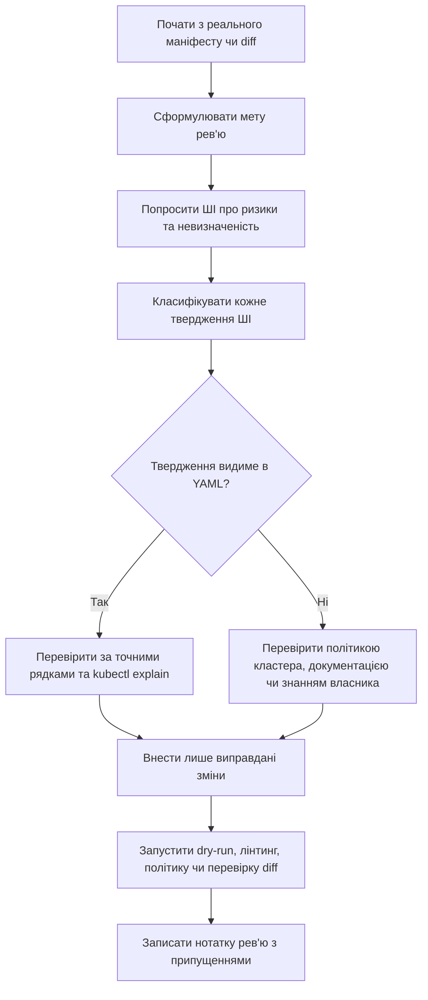

> **Складність**: `[MEDIUM]`
>
> **Час на проходження**: 50-70 хв
>
> **Передумови**: маніфести Kubernetes, Deployment, Service, проби, запити ресурсів та базові навички роботи з `kubectl`

---

## Що ви зможете зробити

- Оцінювати відгук ШІ щодо YAML Kubernetes, класифікуючи підтверджені висновки, припущення та питання для перевірки, специфічні для кластера, перш ніж приймати будь-яку правку.
- Проєктувати обмежені промпти для рев'ю, що включають точний маніфест, мету рев'ю, формат виводу та правила невизначеності для платформної роботи на Kubernetes 1.35+.
- Діагностувати рев'ю маніфесту, простежуючи кожне твердження ШІ до доказів у YAML, документації Kubernetes, поведінки політики або реальної перевірки кластера.
- Порівнювати робочі процеси "спочатку генерація", "спочатку рев'ю" та "орієнтований на diff", а потім обирати безпечніший підхід для рев'ю продакшен-маніфестів.
- Впроваджувати стислу нотатку рев'ю, яка фіксує прийняті зміни, відхилені пропозиції, залишкові припущення та докази перевірки за кожним рішенням.

## Чому цей модуль важливий

Гіпотетичний сценарій: команда платформи готує звичайний рол-аут у четвер удень. Застосунок виглядає пересічно: Deployment, Service, ConfigMap і кілька значень Helm, які пережили вже кілька попередніх релізів. Старший інженер зайнятий на іншому дзвінку через інцидент, молодший інженер намагається допомогти, а ШІ-асистента попросили перевірити YAML, бо diff більший, ніж очікувалося, і ніхто не хоче пропустити дрібну операційну деталь.

Асистент відповідає впевнено. Він каже, що маніфест готовий до продакшену, рекомендує кілька на вигляд нешкідливих правок форматування і пропускає той факт, що Deployment не має проби готовності. Під час рол-ауту поди починають приймати трафік ще до того, як застосунок прогріє кеші й підключиться до низхідної залежності. Кластер зробив рівно те, що просив YAML; процес рев'ю провалився, бо довірився плавному підсумку замість того, щоб примусово вимагати доказів, невизначеності та перевірки в обговоренні.

Цей сценарій — не застереження проти використання ШІ в платформній роботі. Це застереження проти використання ШІ без системи рев'ю. Конфігурація Kubernetes — це виконуваний операційний намір, а не документація, бо одне-єдине поле може змінити те, як тече трафік, як плануються поди, як виконуються процеси всередині контейнерів, як контролер допуску оцінює об'єкт і як поширюються збої під час рол-ауту. ШІ може зробити це рев'ю кращим, але лише коли людський рецензент зберігає володіння маніфестом і ставиться до асистента як до ще одного рецензента, чиї твердження треба перевіряти.

Цей модуль вчить робочого процесу "спочатку рев'ю" для рев'ю YAML Kubernetes за участі ШІ. Ви й далі використовуватимете ШІ, але обмежуватимете завдання, вимагатимете позначення невизначеності, класифікуватимете кожне твердження, перевірятимете операційні заяви й вестимете письмовий слід того, чому зміну прийняли чи відклали. Мета — не зробити так, щоб ШІ писав YAML Kubernetes швидше. Мета — зробити так, щоб ваша команда перевіряла, ставила питання й пояснювала YAML Kubernetes із більшою дисципліною, ніж дає швидкий людський перегляд чи необмежений промпт.

> **Заглибтеся:** Про контракти промптів, роздільники та патерни промптингу, орієнтовані на рев'ю, за межами платформного YAML, див. [Основи промптів](/ai/ai-engineering-foundations/module-1.1-prompt-fundamentals/).

## Мислення рев'ю: ШІ — рецензент, а не власник

Найбезпечніша відправна точка — проста ментальна модель: людина володіє маніфестом, а ШІ допомагає його перевіряти. Це означає, що асистенту не дозволено вигадувати відсутній контекст, мовчки припускати стандартні значення політики чи перетворювати розпливчастий запит на продакшен-рекомендацію. Рецензент може порушувати занепокоєння, ставити питання й пояснювати компроміси, але власник має перевіряти і вирішувати. Ця модель звучить суворо, проте це та сама вимога, яку ви вже маєте до людського рев'ю коду для інфраструктурних змін.

Промпти "спочатку генерація" спокусливі, бо швидко видають файл, який виглядає завершеним. Промпт на кшталт "згенеруй продакшен-готові Deployment і Service" здається продуктивним, особливо коли результат має коректні відступи й знайомі поля. Проблема в тому, що типовий вивід зазвичай відображає типові припущення, а не контролери допуску вашого кластера, мітки простору імен, класи середовища виконання, налаштування Pod Security, мережеві політики, політики образів, патерни трафіку чи цілі сервісу. YAML, що виглядає зрілим, усе одно може бути неправильним для середовища, де він буде запущений.

Промпти "спочатку рев'ю" починаються з реального матеріалу. Ви надаєте фактичний маніфест або рендерений diff, зазначаєте, яке саме рев'ю вам потрібне, і просите модель відокремити видимі проблеми від припущень. Цей зсув перетворює асистента з творчого генератора на обмежений інструмент аналізу. Він також змушує вас читати YAML достатньо уважно, щоб знати, про що ви запитуєте, — і це одна з прихованих переваг такого робочого процесу.

```ascii
+----------------------+        +-----------------------+        +----------------------+
| YAML, що належить    | -----> | Обмежене рев'ю ШІ      | -----> | Людська перевірка    |
| людині (реальний     |        | ризики + питання       |        | документація + пере- |
| маніфест)             |        |                         |        | вірка кластера        |
+----------------------+        +-----------------------+        +----------------------+
          |                                |                                |
          v                                v                                v
+----------------------+        +-----------------------+        +----------------------+
| Мета рев'ю           |        | Позначки невизначеності|        | Перевірене рішення   |
| рол-аут/безпека/тощо |        | підтверджено/можливо   |        | змінити чи не міняти |
+----------------------+        +-----------------------+        +----------------------+
```

Уявіть рев'ю ШІ як запрошення ще одного інженера до рев'ю коду. Ви б не прийняли "виглядає добре" від людського рецензента щодо ризикованої продакшен-зміни без доказів. Ви б очікували, що вони вкажуть на точні рядки, пояснять режими збою, відрізнять впевненість від підозри й поставлять питання, коли їм бракує контексту. Той самий стандарт застосовується до ШІ-асистента, навіть коли його відповідь вигладжена й швидка.

Тому хороший промпт для рев'ю просить про ризики, а не лише про покращення. Покращення можуть перетворитися на список непов'язаних пропозицій, багато з яких додають складність, не розв'язуючи реальної проблеми. Слово "ризик" спрямовує рев'ю на операційні наслідки: невдале планування, небезпечну поведінку під час рол-ауту, несподівані привілеї, відсутню спостережуваність, зламаний вибір Service чи відхилення політикою. Слово "ризик" також нагадує рецензенту, що кожна прийнята зміна має знижувати конкретний режим збою.

Мислення рев'ю також захищає навчання. Якщо модель дає правильну відповідь, але інженер її не розуміє, команда лише передала мислення на аутсорс. Якщо модель пояснює ризик, а інженер його перевіряє, команда покращує і маніфест, і судження оператора. Це і є стійка цінність ШІ в платформній роботі: не заміна рев'ю, а спосіб зробити рев'ю явнішим і придатним для навчання.

| Робочий процес | Що робить ШІ | Головний ризик | Безпечніше застосування |
|---|---|---|---|
| Спочатку генерація | Створює новий YAML із широкого запиту | Типові стандартні значення виглядають продакшен-готовими | Використовуйте лише для чернеток чи прикладів, після формулювання обмежень |
| Спочатку рев'ю | Перевіряє реальний YAML щодо вузької мети | Рецензент усе ще може пропустити контекст | Використовуйте для продакшен-рев'ю з перевіркою |
| Орієнтований на diff | Порівнює старий і новий маніфести | Може ігнорувати незмінений успадкований ризик | Використовуйте, коли важливий вплив рол-ауту |
| Орієнтований на політики | Перевіряє відповідність відомим стандартам | Може неправильно описати поведінку політики | Використовуйте разом з інструментами допуску чи політик |
| Орієнтований на пояснення | Перекладає YAML простою мовою | Може звучати правильно, оминаючи режими збою | Використовуйте для онбордингу, потім перевіряйте твердження |

Зупиніться і спрогнозуйте: порівняйте ці два промпти, перш ніж читати далі. "Покращ цей YAML" і "Перевір цей точний Deployment на ризики рол-ауту, ресурсів та безпеки; відокрем підтверджені висновки від припущень; не вигадуй полів". Який промпт безпечніший для рев'ю продакшен-Deployment і який конкретний режим збою знижує безпечніший промпт?

Другий промпт безпечніший, бо обмежує завдання, визначає виміри рев'ю й вимагає, щоб невизначеність була видимою. Перший промпт просить модель вирішити, що означає "покращити", а це запрошує стилістичні коментарі, непотрібні зміни й впевнені рекомендації, які можуть не пасувати вашому середовищу. У платформній роботі розпливчасті промпти створюють розпливчасту відповідальність. Безпечніший промпт не гарантує правильну відповідь, але дає людському рецензенту відповідь, яку можна перевірити.

## Робочий процес рев'ю YAML

Сильне рев'ю YAML за участі ШІ має послідовність. Порядок має значення, бо кожен крок знижує конкретний режим збою. Якщо ви просите рекомендації до того, як сформулювали мету рев'ю, модель може оптимізувати під стиль замість ризику. Якщо ви вносите правку до перевірки, ви можете замінити одну проблему іншою. Якщо ви перевіряєте без запису припущень, наступний рецензент не знатиме, які рішення були специфічними для кластера, а які були видимі прямо в маніфесті.



Перший крок — почати з реального маніфесту чи цільового diff. Модель не може перевірити операційний намір, якого вона не бачить. Якщо ваш промпт лише описує робоче навантаження в прозі, асистенту доводиться заповнювати прогалини припущеннями, а ці припущення часто стають прихованими дефектами. Скопіювати точний YAML — це більше роботи, але це тертя корисне, бо воно закріплює рев'ю за реальністю і не дає асистенту критикувати маніфест, який існує лише в його відповіді.

Другий крок — сформулювати мету рев'ю. Deployment можна перевіряти на безпеку рол-ауту, стан безпеки, передбачуваність планування, доступність сервісу, сумісність, узгодженість найменувань, спостережуваність чи відповідність політикам. Запит на все це одразу може перевантажити і модель, і людського рецензента, тож обирайте виміри, що відповідають зміні. Невелика зміна проби не повинна запускати необмежене переписування кожного поля безпеки та ресурсів у файлі.

Третій крок — попросити про ризики та невизначеність. Модель не повинна просто пропонувати правки. Вона має сказати вам, що підтверджено з YAML, що правдоподібне, але не доведене, і яке питання треба закрити, перш ніж зміна стане безпечною. Так ви зберігаєте різницю між "у маніфесті немає проби готовності" і "застосунку, ймовірно, потрібен довший час запуску". Перше твердження видиме; друге потребує доказів про робоче навантаження.

Четвертий крок — класифікувати кожне твердження. Твердження, що вказує на відсутнє поле, часто можна перевірити прямо в YAML. Твердження про поведінку допуску, ідентичність середовища виконання, мережеву досяжність чи готовність робочого навантаження зазвичай потребує зовнішніх доказів. Якість рев'ю на рівні senior приходить зі знання, з яким типом твердження ви маєте справу, бо кожен тип твердження вимагає іншого шляху перевірки.

П'ятий крок — вносити правки лише для виправданих змін. Саме тут провалюються багато робочих процесів зі ШІ. Асистент може порекомендувати десять змін, але продакшен-рев'ю має приймати лише ті зміни, що розв'язують реальний ризик і мають шлях перевірки. "Так порадив асистент" — не причина змінювати інфраструктуру. Мінімальні, виправдані правки легше перевіряти, легше відкочувати й легше пояснити під час подальшого розбору інциденту.

Останній крок — зафіксувати рішення. Коротка нотатка рев'ю допомагає наступному інженеру зрозуміти, які ризики підтверджено, які припущення лишаються і які перевірки виконано. Ця нотатка особливо корисна, коли пізніший інцидент запитує, чому команда обрала саме таку пробу, запит ресурсів, налаштування безпеки чи стратегію рол-ауту. Нотатка рев'ю — не паперова робота заради самої себе; це допоміжний засіб пам'яті для операційних рішень.

| Крок | Питання рецензента | Докази для збору | Типовий провал за пропуску |
|---|---|---|---|
| Перевірити вхідні дані | Який точний YAML чи diff перевіряємо? | Маніфест, рендерений вивід Helm або збірка Kustomize | ШІ перевіряє уявну конфігурацію |
| Визначити мету | Який вимір ризику важливий зараз? | Рол-аут, безпека, ресурси, політика, доступність | Рев'ю стає розмитою порадою |
| Промптити ШІ | Який формат має мати відповідь? | Підтверджено, можливо, питання, компроміси | Впевненість і здогадки змішуються |
| Класифікувати твердження | Твердження видиме чи контекстуальне? | Рядок YAML, документація, політика, команда кластера | Можливі проблеми стають припущеними дефектами |
| Перевірити | Яка команда чи джерело це підтверджує? | `kubectl explain`, dry-run, diff, тест політики | Вигладжений текст заміняє докази |
| Внести правку | Які зміни виправдані? | Мінімальна правка маніфесту з обґрунтуванням | Непов'язані поля просочуються у зміну |
| Зафіксувати | Що має знати наступний рецензент? | Нотатка рев'ю з припущеннями | Майбутні супровідники повторюють те саме міркування |

Робочий процес рев'ю — не бюрократія заради себе. Це спосіб зробити невизначеність явною до того, як вона стане продакшен-поведінкою. Kubernetes не запитає, чи був відсутній запит навмисним, чи привілейований контейнер випадковим, чи шлях проби насправді відповідає застосунку. Рецензент має запитати до моменту застосування, і ШІ корисний лише тоді, коли допомагає рецензенту ставити кращі питання.

Перш ніж застосовувати цей процес на реальному коді, потренуйтеся класифікувати одне твердження. Припустімо, ШІ-рев'ю каже: "Цей Deployment буде відхилено вашим кластером, бо йому бракує `runAsNonRoot: true`". Ще не вирішуйте, чи гарна ця рекомендація. Спершу класифікуйте твердження: яка частина видима в YAML, а яка потребує перевірки, специфічної для кластера?

Видима частина — чи містить маніфест `runAsNonRoot: true` в контексті безпеки пода чи контейнера. Твердження про відхилення не видиме в YAML. Воно залежить від політики допуску, міток простору імен, режиму допуску Pod Security чи іншого контролера, такого як Kyverno, OPA Gatekeeper або ValidatingAdmissionPolicy. Це означає, що твердження треба перевірити щодо фактичного кластера чи джерела політики, перш ніж записувати його як дефект.

## Розібраний приклад: від розпливчастого YAML до рев'ю на основі доказів

Розібраний приклад робить робочий процес конкретним. Маніфест нижче достатньо коректний, щоб виглядати пересічно, але має кілька цілей для продакшен-рев'ю. Суть не в тому, що кожне робоче навантаження має використовувати точно ті самі налаштування. Суть у тому, щоб навчитися, як ШІ-асистент може допомогти виявити ризики, поки людський рецензент усе ще перевіряє й вирішує. Тримайте цю різницю в голові, читаючи приклад, бо деякі рекомендації доречні лише тоді, коли їхні припущення правдиві.

```yaml
apiVersion: apps/v1
kind: Deployment
metadata:
  name: config-review-demo
  labels:
    app: config-review-demo
spec:
  replicas: 2
  selector:
    matchLabels:
      app: config-review-demo
  template:
    metadata:
      labels:
        app: config-review-demo
    spec:
      containers:
        - name: web
          image: nginx:1.27
          ports:
            - containerPort: 80
          resources:
            limits:
              cpu: "500m"
              memory: "256Mi"
```

Слабкий промпт просить асистента "зробити це продакшен-готовим". Такий промпт приховує намір рецензента й запрошує модель додавати поля, які можуть не відповідати робочому навантаженню. Він також ускладнює перевірку відповіді, бо кожна пропозиція приходить як частина одного широкого пакета покращень. Сильніший промпт обмежує рев'ю конкретними вимірами й просить модель показати невизначеність.

```text
Перевір цей Deployment Kubernetes на операційні ризики.

Зосередься на:
- безпеці рол-ауту
- поведінці готовності та живучості
- передбачуваності планування ресурсів
- контексті безпеки контейнера

Не вигадуй поля. Якщо твердження залежить від поведінки робочого навантаження,
політики кластера чи організаційних стандартів, скажи про це прямо.

Поверни:
1. підтверджені занепокоєння, видимі в YAML
2. можливі занепокоєння, що потребують перевірки
3. питання, на які я маю відповісти, перш ніж змінювати маніфест
4. мінімальні зміни, варті розгляду, з компромісами
```

Корисна відповідь має визначити, що не налаштовано жодної проби готовності, тож готовність до трафіку рол-ауту не можна вивести з перевірок готовності Kubernetes. Вона має помітити, що ліміти ресурсів існують, а запитів немає, що впливає на передбачуваність планування, бо запити — це сигнал резервування для планувальника. Вона також має помітити, що явного контексту безпеки немає, уникаючи водночас непідтвердженого твердження, що кластер точно відхилить под. Саме таке поєднання занепокоєння й стриманості ви й тренуєте рев'ю видавати.

Та сама відповідь має уникати перебільшень. Наприклад, вона не повинна стверджувати, що проба живучості обов'язкова для кожного сервісу, бо погано спроєктована проба живучості може перезапускати повільний, але здоровий застосунок. Вона не повинна припускати правильний шлях готовності, не знаючи застосунку. Вона не повинна стверджувати, що `nginx:1.27` заборонений, якщо тільки в організації немає політики тегів чи політики образів, яка це каже. Перебільшення — не дрібна стилістична проблема; воно може змусити команди правити YAML з причин, які вони не можуть обґрунтувати.

Тепер рецензент класифікує висновки. "Проби готовності не існує" — видиме в YAML. "Шлях проби готовності має бути `/healthz`" — не видиме, бо шлях залежить від застосунку. "Запитів ресурсів не існує" — видиме. "Запит CPU має бути `100m`" — це рекомендація щодо розміру, яка залежить від замірів робочого навантаження, цілей сервісу та ємності кластера. Крок класифікації перетворює вигладжену відповідь моделі на придатну для перевірки інженерну роботу.

| Твердження ШІ | Класифікація | Як перевірити | Якість рішення |
|---|---|---|---|
| Проба готовності не налаштована | Підтверджено з YAML | Пошук у маніфесті та `kubectl explain` | Сильна основа для обговорення рев'ю |
| Трафік може дістатися подів до того, як застосунок готовий | Правдоподібний операційний ризик | Підтвердити поведінку запуску застосунку та маршрутизацію Service | Потребує контексту робочого навантаження |
| Ліміти ресурсів існують без запитів | Підтверджено з YAML | Оглянути блок `resources` | Сильна основа для обговорення планування |
| Запит CPU має бути `100m` | Потребує перевірки | Перевірити метрики, навантажувальні тести чи стандарт команди | Не приймати наосліп |
| Явного контексту безпеки немає | Підтверджено з YAML | Оглянути контексти безпеки пода й контейнера | Сильна основа для обговорення безпеки |
| Кластер відхилить цей под | Потребує перевірки | Перевірити Pod Security, Kyverno, Gatekeeper чи журнали допуску | Не стверджувати без доказів |

Мінімально переглянутий маніфест міг би додати пробу готовності, запити ресурсів і контекст безпеки. Ці зміни — не магічні стандартні значення. Це приклади виправданих змін, які рецензент усе одно налаштує під реальне робоче навантаження. Шлях готовності має існувати в образі контейнера. Значення запитів мають відображати спостережене використання чи базову лінію команди. Контекст безпеки має відповідати тому, як зібрано образ і як простір імен примусово застосовує політику.

```yaml
apiVersion: apps/v1
kind: Deployment
metadata:
  name: config-review-demo
  labels:
    app: config-review-demo
spec:
  replicas: 2
  selector:
    matchLabels:
      app: config-review-demo
  template:
    metadata:
      labels:
        app: config-review-demo
    spec:
      securityContext:
        runAsNonRoot: true
        seccompProfile:
          type: RuntimeDefault
      containers:
        - name: web
          image: nginx:1.27
          ports:
            - containerPort: 80
          readinessProbe:
            httpGet:
              path: /
              port: 80
            initialDelaySeconds: 5
            periodSeconds: 10
          resources:
            requests:
              cpu: "100m"
              memory: "128Mi"
            limits:
              cpu: "500m"
              memory: "256Mi"
          securityContext:
            allowPrivilegeEscalation: false
            capabilities:
              drop:
                - ALL
```

Цей переглянутий YAML кращий, лише якщо його припущення правдиві. Якщо образу потрібен root, `runAsNonRoot: true` може завадити запуску. Якщо застосунок повертає успіх на `/` до того, як залежності готові, проба готовності може давати хибну впевненість. Якщо значення запитів занизькі, планувальник може розмістити поди надто щільно й створити ризик "шумного сусіда". ШІ може виявити компроміс, але не може скасувати потребу в знанні робочого навантаження.

Перевірка починається з нативних для Kubernetes перевірок. Повна команда `kubectl` показана в кожному виконуваному блоці shell, бо приклади copy-paste мають працювати в скриптах і неінтерактивних оболонках. Багато інженерів інтерактивно використовують короткий псевдонім, але приклади модуля не повинні покладатися на псевдоніми, коли мета — відтворюване рев'ю. Вивід команди менш важливий за саму звичку: перевіряти форму поля, побудову об'єкта й поведінку політики окремо.

```bash
kubectl apply --dry-run=client -f deployment-reviewed.yaml
kubectl get -f deployment-reviewed.yaml --dry-run=client -o yaml
kubectl explain deployment.spec.template.spec.containers.readinessProbe
kubectl explain deployment.spec.template.spec.containers.resources.requests
kubectl explain deployment.spec.template.spec.securityContext
```

Клієнтський dry-run перевіряє синтаксис і побудову об'єкта, але не доводить, що робоче навантаження здорове. `kubectl explain` підтверджує форму поля й документацію, але не доводить, що обрані значення правильні. Ця різниця важлива: валідація каже вам, чи прийме Kubernetes поле, тоді як рев'ю вирішує, чи виражає це поле правильний операційний намір. Ставтеся до кожної команди як до одного джерела доказів, а не як до фінального штампу коректності.

Нотатка рев'ю має бути короткою й конкретною. Хороша нотатка каже, що маніфест тепер має пробу готовності, бо в оригінальному Deployment не було воріт готовності перед трафіком Service. Вона каже, що запити ресурсів додано, щоб зробити намір планування явним, хоча точні значення потребують замірів. Вона каже, що контекст безпеки без root додано як покращення стану безпеки, хоча сумісність образу треба перевірити в середовищі, що запускає контейнер.

Зупиніться і спрогнозуйте: оберіть один спосіб, яким переглянутий маніфест міг би зазнати невдачі, навіть якщо YAML коректний, а рекомендація ШІ звучала розумно. Оберіть готовність, ресурси або контекст безпеки. Потім запишіть докази, які вам знадобляться, щоб підтвердити чи спростувати ваш прогноз, перш ніж читати наступний абзац.

Одна можлива відповідь — `runAsNonRoot: true` може зазнати невдачі, якщо образ контейнера стартує з UID `0` і не визначає користувача без root. Інша — проба готовності може бути технічно коректною, але семантично слабкою, якщо `/` повертає успіх до того, як застосунок готовий до реального трафіку. Третя — запити можуть бути надто низькими для робочого навантаження, через що поди опиняться на вузлах, де пізніше конкуруватимуть за CPU чи пам'ять. Кожна відповідь корисна лише тоді, коли включає крок перевірки.

## Проєктування промптів, що обмежують модель

Проєктування промптів — це не про хитре формулювання. У платформній інженерії проєктування промптів — це про звуження простору, у якому модель може робити непідтверджені припущення. Безпечний промпт дає асистенту достатньо контексту, щоб перевірити реальний об'єкт, водночас обмежуючи вивід доказами, невизначеністю й компромісами. Мета — не створити ідеальне заклинання; мета — зробити відповідь рев'ю легшою для людської перевірки.

Сильний промпт для рев'ю маніфесту має п'ять частин. Він включає точний YAML чи рендерений diff, мету рев'ю, відомий контекст кластера чи політики, формат виводу та правило невизначеності. Якщо однієї з цих частин бракує, модель часто заповнить прогалину типовою порадою про Kubernetes. Типова порада може бути корисною під час навчання, але вона небезпечна, коли видається за специфічну для середовища.

```ascii
+-----------------------+
| Безпечний промпт для  |
| рев'ю                  |
+-----------------------+
| 1. Точний YAML чи diff |
| 2. Мета рев'ю          |
| 3. Відомий контекст    |
| 4. Структура виводу    |
| 5. Правило невизначе-  |
|    ності               |
+-----------------------+
            |
            v
+-----------------------+
| Відповідь, придатна   |
| для перевірки          |
+-----------------------+
| підтверджені            |
| занепокоєння            |
| можливі занепокоєння    |
| кроки перевірки         |
| питання про компроміси  |
+-----------------------+
```

Точний YAML чи diff запобігає галюцинованим полям. Мета рев'ю каже асистенту, чи пріоритезувати рол-аут, безпеку, планування, доступність чи відповідність політиці. Відомий контекст запобігає тому, щоб типові рекомендації перекривали реальні обмеження, наприклад організацію, що вимагає дайджестів образів, чи простір імен, що примусово застосовує обмежений Pod Security. Структура виводу полегшує перевірку відповіді. Правило невизначеності каже моделі, що "невідомо з цього маніфесту" — прийнятна й очікувана відповідь.

Найпоширеніша помилка промптингу — просити модель одночасно рецензувати й переписувати за один прохід. Це змішує діагностику з лікуванням. Безпечніше спочатку попросити висновки й питання, а потім, після їх перевірки, попросити мінімальну правку. Це не дає рецензенту перетворити кожну пропозицію на зміну і полегшує колегам оцінку кінцевої правки.

| Елемент промпту | Слабка версія | Сильна версія | Чому це важливо |
|---|---|---|---|
| Вхідні дані | "Ось мій застосунок" | "Ось рендерений YAML Deployment" | Рев'ю має закріплюватися на конкретній конфігурації |
| Мета | "Покращ це" | "Перевір ризики рол-ауту й планування" | Вузькі цілі дають дієві висновки |
| Контекст | "Продакшн-кластер" | "Kubernetes 1.35+, обмежений простір імен, політика образів Kyverno" | Контекст запобігає типовим порадам |
| Вивід | "Скажи мені про проблеми" | "Підтверджено, можливо, питання, команди перевірки" | Структурований вивід легше перевіряти |
| Невизначеність | "Будь впевненим" | "Скажи, коли твердження потребує перевірки" | Явна невизначеність запобігає хибній авторитетності |
| Час правки | "Виправ зараз" | "Не переписуй, поки висновки не класифіковано" | Діагностика лишається окремо від змін |

Промпт рівня senior також запитує про відсутність доказів. Наприклад, "Які ризики неможливо визначити лише з цього маніфесту?" часто цінніший за "Що не так?". Модель тоді може вказати, що не може знати патернів трафіку, поведінки запуску, політик допуску, ідентичності користувача образу, налаштувань PodDisruptionBudget, селекторів Service чи того, чи підтримує застосунок коректне завершення роботи. Ці відсутні факти скеровують людського рецензента до наступного кроку перевірки.

Продакшн-промпт для рев'ю має уникати запиту на абсолютну коректність. Маніфести Kubernetes повні контекстуальних рішень. Проба живучості може захищати або шкодити. Ліміт CPU може зменшити ефект "шумного сусіда" або обмежити чутливий до затримок застосунок. Контекст безпеки без root може покращити стан безпеки або розкрити проблему збірки образу. Асистент має пояснювати компроміси, а не вдавати, що кожне поле має одне універсально найкраще значення.

Ось придатний для повторного використання патерн промпту для рев'ю Deployment. Ви можете адаптувати виміри рев'ю, але зберігайте розділення між підтвердженими висновками, можливими занепокоєннями та питаннями. Формат навмисно докладний, бо трохи повторювана відповідь рев'ю легша для перевірки, ніж вигладжений абзац, що змішує докази з здогадками.

```text
Перевір маніфест Kubernetes нижче як інженер платформи.

Контекст середовища:
- Цільова версія Kubernetes: 1.35+
- Розглядай це як продакшен-навантаження, якщо YAML не доводить протилежне.
- Не припускай поведінки політики допуску, якщо вона тут не вказана.

Виміри рев'ю:
- безпека рол-ауту
- передбачуваність планування
- безпека середовища виконання
- доступність сервісу
- поля, що можуть бути застарілими, некоректними чи оманливими

Правила:
- Не вигадуй поля, яких немає.
- Цитуй або вказуй шлях YAML для кожного підтвердженого занепокоєння.
- Відокремлюй підтверджені занепокоєння від можливих.
- Для кожного можливого занепокоєння назви потрібну перевірку.
- Не створюй переписаний маніфест, якщо про це не попросили явно.

Поверни:
1. однопараграфний підсумок того, що робить маніфест
2. підтверджені занепокоєння, видимі в YAML
3. можливі занепокоєння, що потребують зовнішньої перевірки
4. питання для власника робочого навантаження
5. мінімальні наступні перевірки за допомогою kubectl чи інструментів політики
```

Коли запитуєте правку, використовуйте другий промпт, що звужує завдання. Другий промпт має посилатися лише на перевірені висновки, а не знову відкривати весь маніфест для творчого покращення. Це віддзеркалює хороше людське рев'ю: спочатку обговорити проблему, потім застосувати найменшу зміну, що її розв'язує. Другий промпт — також корисний захист від дрейфу асистента, коли модель додає непов'язані поля просто тому, що зараз перебуває в "режимі переписування".

```text
Використовуючи лише підтверджені висновки нижче, запропонуй мінімальну правку YAML.

Підтверджені висновки:
- У Deployment немає readinessProbe.
- Ліміти ресурсів присутні, але запити ресурсів відсутні.
- Контекст безпеки пода чи контейнера не визначено.

Правила:
- Не додавай непов'язаних полів.
- Поясни один операційний компроміс для кожної зміни.
- Познач будь-яке значення, яке треба налаштувати за доказами робочого навантаження.
- Якщо зміна може зламати образ контейнера, скажи, як це перевірити.
```

Цей двоетапний патерн промптингу вчить модель поводитися як рецензент, а не як генератор. Він також вчить людину розділяти етапи мислення. Це розділення — один із найсильніших захистів проти технічного боргу, спричиненого промптами, коли YAML обростає полями, бо асистент їх запропонував, а ніхто не пам'ятає чому. Коли діагностика й правка розділені, рев'ю може відхилити зміну, що звучить добре, не втрачаючи корисного висновку, який до неї привів.

Спробуйте перед тим, як рухатися далі: переформулюйте своїми словами промпт "Зроби цей файл значень Helm безпечним і надійним". Ваша переформулювання має згадувати точні вхідні дані, виміри рев'ю, структуру виводу та невизначеність. Якщо ваша переформулювання просить ШІ негайно видати фінальний YAML, перепишіть її так, щоб рев'ю йшло першим.

Кращий промпт міг би звучати так: "Перевір цей точний рендерений маніфест і значення Helm, що його породили, на ризики безпеки й надійності. Відокрем підтверджені занепокоєння від припущень, назви будь-яку політику кластера, яку треба перевірити, і поверни питання, перш ніж пропонувати зміни". Формулювання може відрізнятися, але структура має робити докази й невизначеність видимими. Головний хід — не сама фраза; це рішення відкласти правку, поки висновки не класифіковано.

## Перевірка тверджень ШІ на відповідність реальності Kubernetes

Перевірка — це те місце, де рев'ю за участі ШІ стає платформною інженерією, а не автозавершенням. Модель може вказати вам на ймовірні ризики, але істина Kubernetes походить зі схем API, поведінки контролерів, політики допуску, поведінки робочого навантаження та реального кластера. Рецензенту потрібно знати, який інструмент перевірки пасує якому твердженню. Використання неправильного інструменту може створити хибну впевненість, бо успішна перевірка синтаксису не доводить, що ендпоінт готовності осмислений чи що виняток з політики прийнятний.

Твердження про форму поля зазвичай перевіряють за допомогою `kubectl explain`, інструментів, що знають схему, dry-run apply чи серверної валідації. Наприклад, якщо асистент пропонує поле під `securityContext`, ви можете запитати Kubernetes, куди це поле належить. Це виявляє поширений режим збою ШІ: розміщення коректного поля на неправильному рівні. Це також виявляє застарілі приклади, що використовують поля зі старіших версій API або розміщують налаштування рівня контейнера на рівні пода.

```bash
kubectl explain deployment.spec.template.spec.securityContext
kubectl explain deployment.spec.template.spec.containers.securityContext
kubectl explain deployment.spec.template.spec.containers.readinessProbe
kubectl apply --dry-run=client -f deployment-reviewed.yaml
```

Твердження про політику кластера потребує доказів політики. Якщо ШІ каже, що маніфест порушує Pod Security, Kyverno, Gatekeeper, ValidatingAdmissionPolicy чи внутрішнє правило допуску, рецензент має перевірити фактичне джерело політики або серверний dry-run у цільовому просторі імен. Клієнтський dry-run не може довести поведінку допуску, бо допуск відбувається на шляху API-сервера. Навіть серверний dry-run слід тлумачити обережно, бо результат залежить від простору імен і кластера, на які ви цілитеся.

```bash
kubectl apply --dry-run=server -n platform-review -f deployment-reviewed.yaml
kubectl get ns platform-review --show-labels
kubectl get validatingadmissionpolicy
kubectl get validatingwebhookconfiguration
```

Твердження про поведінку робочого навантаження потребує доказів робочого навантаження. Шлях проби готовності не є правильним лише тому, що існує в YAML. Застосунок має повертати успіх лише тоді, коли безпечно приймати трафік. Запити ресурсів не є правильними лише тому, що присутні. Вони мають спиратися на метрики, навантажувальні тести, базові лінії команди чи відомі робочі діапазони. Саме тут рецензент має принести знання, якого асистент не має.

Твердження про ризик рол-ауту потребує розуміння контролерів. Deployment використовує стратегію рол-ауту, щоб замінювати поди, намагаючись зберегти доступність, але точний ризик залежить від реплік, готовності, налаштувань surge, бюджетів переривань і поведінки запуску застосунку. ШІ-асистент може визначити відсутню пробу, але рецензент має продумати шлях рол-ауту. Deployment із двома репліками без осмисленого сигналу готовності все одно може створити видиму для користувачів відмову, якщо обидва нові поди повідомляють про готовність до того, як зможуть обслуговувати реальні запити.

```ascii
+-------------------------+       +-------------------------+       +-------------------------+
| Контролер Deployment    | ----> | ReplicaSet створює поди | ----> | Service надсилає трафік |
| бажаний стан змінюється |       | ворота готовності важливі|       | лише на готові ендпоінти|
+-------------------------+       +-------------------------+       +-------------------------+
            |                                  |                                  |
            v                                  v                                  v
+-------------------------+       +-------------------------+       +-------------------------+
| maxSurge/maxUnavailable |       | результат readinessProbe |       | видима для користувача |
| контролюють заміну      |       | контролює доступність    |       | поведінка залежить від |
|                          |       |                           |       | здоров'я застосунку    |
+-------------------------+       +-------------------------+       +-------------------------+
```

Діаграма показує, чому проба готовності — не просто позначка. Під час рол-ауту Kubernetes потребує сигналу, що новий под здатен приймати трафік. Без цього сигналу готовність пода може стати надто грубою для реальної готовності застосунку. Зі слабким сигналом Kubernetes може отримати хибне заспокоєння. Поле має значення, бо воно бере участь у робочому процесі контролера, і якість сигналу визначає, чи захищає цей процес користувачів, чи лише виглядає завершеним.

Той самий принцип перевірки застосовується до запитів ресурсів. Відсутній запит не завжди одразу ламає deployment, але послаблює передбачуваність планування. Планувальник використовує запити, щоб вирішити, куди помістити поди. Ліміти по-іншому впливають на примусове обмеження під час виконання. ШІ-рев'ю часто згадує "додай ресурси", але рецензент має запитати, яку частину управління ресурсами покращують і які значення виправдані. Запит, скопійований із типового прикладу, може бути гіршим за відкладену рекомендацію з планом замірів.

| Тип твердження | Приклад твердження ШІ | Джерело перевірки | Рішення рецензента |
|---|---|---|---|
| Структура YAML | "`allowPrivilegeEscalation` належить до контексту безпеки контейнера" | `kubectl explain` і валідація за схемою | Прийняти розміщення поля, якщо схема підтверджує |
| Поведінка допуску | "Цей простір імен відхилить контейнери з root" | Серверний dry-run та перевірка політики | Вважати невідомим, доки політика не підтвердить |
| Поведінка контролера | "Готовність впливає на доступність рол-ауту" | Документація Kubernetes і тестування рол-ауту | Оцінювати з урахуванням реплік і стратегії |
| Поведінка робочого навантаження | "Ендпоінт `/healthz` доводить готовність" | Документація застосунку, тестове середовище, підтвердження власника | Перевірити, перш ніж покладатися |
| Розмір ємності | "Використай запит CPU `100m`" | Метрики, навантажувальний тест, базова лінія команди | Налаштуй, не копіюй наосліп |
| Стан безпеки | "Скинь Linux-можливості за замовчуванням" | Стандарт безпеки й тест сумісності образу | Обирай мінімальні привілеї, коли це сумісно |

Рецензент рівня senior спокійно каже "ми ще не знаємо". Це не слабкість. Це правильна відповідь, коли твердження залежить від даних, яких маніфест не містить. ШІ має допомагати вам швидше знаходити ці невідомі, а не ховати їх за впевненою прозою. Найкраща відповідь рев'ю часто містить і підтверджений висновок з YAML, і питання, на яке треба відповісти, перш ніж правка буде завершена.

Оберіть шлях перевірки, перш ніж братися за команди. Ваш ШІ-асистент каже: "Цей маніфест некоректний, бо `seccompProfile` розміщено не там". Яким шляхом перевірки скористатися першим: навантажувальним тестуванням, `kubectl explain`, серверним dry-run чи перевіркою логів застосунку? Вирішіть до того, як прочитаєте відповідь, і поясніть, чому інші шляхи менш прямі.

Першою перевіркою мають бути `kubectl explain` чи валідація за схемою, бо твердження стосується розміщення поля й форми API. Серверний dry-run теж може допомогти, але він може змішувати валідацію схеми з поведінкою допуску. Навантажувальне тестування й логи застосунку корисні для поведінки робочого навантаження, а не для того, щоб вирішити, куди в маніфесті належить поле Kubernetes. Вибір правильного шляху перевірки утримує рев'ю сфокусованим і знижує шум.

## Рев'ю рівня senior: контекст, компроміси та командна практика

Рецензенти-початківці часто запитують: "Цей YAML коректний?". Рецензенти рівня senior запитують: "Яку операційну обіцянку дає цей YAML, і чи може платформа її дотримати?". Коректний YAML усе одно може створити ненадійні системи. Deployment може пройти валідацію і все одно спрямовувати трафік зарано, планувати непередбачувано, працювати з надмірними привілеями, ламати вибір Service чи порушувати внутрішній стандарт релізу. Якість рев'ю зростає, коли кожне поле пов'язане з обіцянкою, яку воно дає.

ШІ найкорисніший у середині цього ланцюжка міркувань. Він може допомогти пояснити, що зазвичай означає поле, порівняти дві версії маніфесту й запропонувати питання, які має поставити рецензент. Він менш надійний на краях: у знанні саме вашого кластера з одного боку і в ухваленні остаточних продакшен-рішень з іншого. Тримайте модель у середині, де вона прискорює мислення, не привласнюючи повноважень.

Патерн senior-рівня — пов'язувати кожне поле YAML із режимом збою. Проба готовності пов'язана з безпекою трафіку. Запити ресурсів пов'язані з плануванням і плануванням ємності. Контекст безпеки пов'язаний з ідентичністю процесу й привілеями. Мітки та селектори пов'язані з тим, чи знаходять контролери й Service поди, якими мають керувати. Змінні середовища й ConfigMap пов'язані з дрейфом конфігурації середовища виконання. Коли в поля є режим збою, рецензент може вирішити, чи знижує запропонована зміна ризик, чи лише додає видимість зрілості.

Переглядаючи згенерований чи змінений ШІ YAML, звертайте особливу увагу на непотрібні поля. Більше YAML автоматично не означає більшої зрілості. Зайві поля збільшують вартість супроводу, можуть конфліктувати зі стандартними значеннями платформи й перетворитися на скопійований карго-культ. Мінімальний маніфест, що виражає навмисні рішення, зазвичай безпечніший за багатослівний маніфест, який ніхто не може пояснити. Питання рев'ю не "чи додав асистент найкращі практики?", а "чи виражає кожне прийняте поле рішення, яке ми можемо обґрунтувати?".

Командна практика важлива, бо впровадження ШІ змінює звички рев'ю. Якщо один інженер приватно використовує ШІ й вставляє вигладжений маніфест у PR, інші рецензенти можуть бачити фінальний YAML без невизначеності, що його породила. Кращий командний робочий процес включає нотатку рев'ю ШІ в опис PR чи запис зміни. Ця нотатка має сказати, які висновки прийнято, відхилено чи залишено для подальшого опрацювання. Вона також має назвати будь-який факт про кластер чи робоче навантаження, який неможливо було довести лише з YAML.

Хороша нотатка рев'ю не довга. Це може бути коротка таблиця з твердженням, доказом, рішенням і залишковим припущенням. Дисципліна — у фіксації міркування, а не у створенні паперової роботи. Коли пізніше трапляється інцидент, цей запис допомагає команді побачити, чи була відмова невідомим ризиком, відхиленою рекомендацією чи припущенням, яке ніколи не перевіряли. Це особливо корисно для проб, налаштувань ресурсів і контекстів безпеки, де поле може бути синтаксично коректним, але семантично неправильним.

| Поле нотатки рев'ю | Хороший запис | Слабкий запис |
|---|---|---|
| Твердження | "У Deployment немає readinessProbe" | "ШІ сказав, що готовність погана" |
| Доказ | "Підтверджено пошуком у маніфесті та `kubectl explain`" | "Виглядає правильно" |
| Рішення | "Додати пробу готовності через ендпоінт, що належить застосунку" | "Додано пробу" |
| Припущення | "Ендпоінт повертає успіх лише після готовності залежностей" | "Має бути нормально" |
| Подальші кроки | "Перевірити в staging-рол-ауті перед продакшеном" | "Спостерігати" |

Зрілий робочий процес за участі ШІ також визначає, де ШІ не має права вирішувати. Наприклад, модель не повинна обирати продакшен-запити ресурсів без метрик. Вона не повинна вирішувати, що виняток з політики прийнятний. Вона не повинна схвалювати підвищення привілеїв. Вона не повинна об'єднувати ризикований рол-аут лише тому, що YAML проходить dry-run. Ці рішення належать людям і командному процесу, навіть коли асистент надає корисний контекст.

Є ще одна звичка senior-рівня: попросіть модель покритикувати власні межі. Промпт на кшталт "Що ти не можеш визначити з цього маніфесту?" часто розкриває відсутній контекст, який звичайне рев'ю могло б проглянути. Відповідь може згадати селектори Service, фактичного користувача образу, політики допуску, PodDisruptionBudget, форму трафіку, час запуску чи те, чи підтримує застосунок коректне завершення роботи. Це не збої моделі; це підказки для кращих доказів.

Використовуйте ШІ, щоб робити обговорення рев'ю кращими. Молодший інженер може попросити асистента пояснити маніфест простою мовою перед командним рев'ю. Старший інженер може попросити його згенерувати чекліст питань для перевірки. Керівник платформи може попросити його порівняти diff зі стандартами команди. У кожному випадку остаточне судження й далі спирається на докази, а команда стає кращою в поясненні, чому маніфест має працювати в продакшені.

## Патерни й антипатерни

Найнадійніший патерн — обмежене рев'ю перед генерацією. Використовуйте його, коли маніфест уже існує, зміна прямує до реального середовища або команді потрібен обґрунтований слід рішень. Рецензент надає маніфест, виміри рев'ю, відомий контекст і правила виводу, а потім просить асистента про висновки й питання. Це працює, бо закріплює модель на спостережуваних вхідних даних і відкладає правки, доки команда не класифікує ризики.

Другий сильний патерн — рев'ю, орієнтоване на diff. Використовуйте його, коли Helm, Kustomize чи інструмент GitOps створює рендерений маніфест "до і після". Асистент має порівнювати операційно значущі зміни, а не просто підсумовувати найбільший візуальний diff. Додавання проби готовності, зміна селектора, видалення запиту ресурсів і переміщення простору імен можуть з'явитися в тому самому рев'ю, і моделі потрібен структурований вивід, щоб людський рецензент бачив, які зміни змінюють поведінку рол-ауту, маршрутизацію, планування чи допуск.

Третій сильний патерн — нотатки рев'ю, пов'язані з доказами. Використовуйте його, коли рев'ю дає правку чи продакшен-рекомендацію. Нотатка має пов'язувати кожну прийняту зміну з видимим висновком, командою перевірки, джерелом чи залишковим припущенням. Це масштабується краще за приватні стенограми чату, бо колегам не потрібно перечитувати всю розмову зі ШІ; їм потрібні твердження, докази, рішення та прогалини.

Найпоширеніший антипатерн — "від промпту одразу до правки". Рецензент просить асистента "виправити" маніфест, приймає повністю переписаний файл YAML, а потім переглядає згенерований файл, ніби це джерело істини. Це ризиковано, бо правка може містити непов'язані зміни, вигаданий контекст чи правдоподібні стандартні значення, яких ніхто не просив. Краща альтернатива — спочатку попросити висновки, перевірити їх і запросити мінімальну правку лише для прийнятих висновків.

Інший антипатерн — "ясновидіння щодо політики". Асистент стверджує, що маніфест пройде чи не пройде політику кластера, хоча промпт не включав мітки простору імен, конфігурацію допуску чи визначення політик. Команди потрапляють у цю пастку, бо відповідь звучить операційно конкретно. Виправлення — вимагати, щоб твердження про політику мали шлях доказів, як-от серверний dry-run, мітки простору імен, стандарти Pod Security, політику Kyverno, обмеження Gatekeeper чи визначення ValidatingAdmissionPolicy.

Тихіший антипатерн — накопичення найкращих практик. Асистент продовжує додавати проби, ліміти, мітки, анотації, поля безпеки, поширення за топологією, бюджети переривань і хуки життєвого циклу, бо кожне з них можна виправдати окремо. Результат — багатослівний маніфест зі слабким володінням. Кращий патерн — навмисний мінімалізм: залишати поля, що виражають реальні операційні рішення, відкладати поля, чиї припущення ще не відомі, і фіксувати, чому кожна прийнята зміна належить у файлі.

## Рамка рішень

Вибір правильного робочого процесу зі ШІ залежить від ризику, який ви намагаєтеся знизити. Якщо вам треба навчити початківця, що робить маніфест, доречний ШІ, орієнтований на пояснення, але не варто розглядати пояснення як схвалення. Якщо вам треба перевірити продакшен-зміну, безпечніший ШІ "спочатку рев'ю" чи орієнтований на diff, бо він починається з реального YAML і видимої невизначеності. Якщо вам потрібна впевненість щодо політики, модель може допомогти сформулювати питання, але докази мають надходити з Kubernetes, інструментів допуску чи самого джерела політики.

Використовуйте ШІ "спочатку генерація" лише тоді, коли вивід явно є чернеткою, прикладом чи навчальним каркасом. Для продакшен-роботи за ШІ "спочатку генерація" має йти той самий процес рев'ю, що й для написаного людиною YAML, бо згенерований YAML не має особливого авторитету. Використовуйте ШІ "спочатку рев'ю", коли у вас уже є маніфест і ви хочете знайти ризики. Використовуйте ШІ, орієнтований на diff, коли одиниця рев'ю — це сама зміна. Використовуйте ШІ, орієнтований на політики, коли ви самі надаєте політику й просите модель зіставити поля маніфесту з пунктами політики, продовжуючи водночас перевіряти фактичним інструментом.

| Ситуація | Безпечніший робочий процес | Потрібні докази | Умова зупинки |
|---|---|---|---|
| Навчання того, що робить маніфест | Рев'ю, орієнтоване на пояснення | Шляхи YAML і офіційна документація | Зупинитися до того, як розглядати пояснення як схвалення |
| Рев'ю продакшен-Deployment | Робочий процес "спочатку рев'ю" | Підтверджені висновки, питання, dry-run, вхід власника | Зупинитися до внесення правок за неперевіреними припущеннями |
| Рев'ю зміни Helm | Робочий процес, орієнтований на diff | Рендерені старий і новий маніфести | Зупинитися, коли незмінений успадкований ризик відокремлено від нового |
| Перевірка стану безпеки | Робочий процес, орієнтований на політики | Докази Pod Security, Kyverno, Gatekeeper чи допуску | Зупинитися до твердження про відхилення без доказів політики |
| Вибір значень ресурсів | Розмір, що належить людині, з питаннями від ШІ | Метрики, навантажувальні тести, базові лінії | Зупинитися до копіювання типових значень |
| Написання нотатки для PR | Нотатка рев'ю, пов'язана з доказами | Твердження, доказ, рішення, припущення | Зупинитися, коли інший рецензент може перевірити міркування |

У разі сумніву обирайте робочий процес, що зберігає найбільше доказів і робить найменше припущень. Швидка відповідь, що приховує невизначеність, дорого коштує пізніше. Трохи повільніше рев'ю, що позначає невизначеність, легше покращити, легше навчити й легше обґрунтувати. Рамка рішень не покликана сповільнювати кожну дрібну зміну; вона покликана не давати впевненій прозі заміняти якісне інженерне судження.

## Чи знали ви?

- **Готовність — це сигнал трафіку, а не таймер запуску**: проба готовності каже Kubernetes, чи має контейнер отримувати трафік через Service та ендпоінти. Налаштування лише `initialDelaySeconds` без осмисленої умови готовності може приховати проблеми з часом запуску замість того, щоб моделювати реальну готовність.
- **Запити та ліміти ресурсів відповідають на різні питання**: запити впливають на планування, бо описують зарезервовану ємність, тоді як ліміти обмежують використання під час виконання для підтримуваних ресурсів. ШІ-рев'ю, що просто каже "додай ресурси", неповне, якщо не пояснює, яку проблему планування чи виконання розв'язують ці значення.
- **Контексти безпеки пода й контейнера пов'язані, але не ідентичні**: деякі налаштування безпеки можна розмістити на рівні пода, тоді як інші належать рівню контейнера. Саме тому розміщення поля слід перевіряти за інформацією зі схеми Kubernetes, а не довіряти згенерованому прикладу.
- **Серверний dry-run бачить більше, ніж клієнтський dry-run**: клієнтський dry-run може виявити локальні проблеми побудови об'єкта, але серверний dry-run проходить через шлях API-сервера й може розкрити поведінку допуску. Він усе одно не доводить, що застосунок здоровий, тож доповнює, а не замінює тестування рол-ауту.

## Типові помилки

| Помилка | Чому вона трапляється | Як її виправити |
|---|---|---|
| Просити ШІ "покращити цей YAML" без мети рев'ю | Модель обирає власне визначення покращення й може зосередитися на стилі, багатослівності чи типових найкращих практиках | Сформулюйте вимір рев'ю, наприклад безпеку рол-ауту, стан безпеки, передбачуваність планування чи відповідність політиці |
| Ставитися до кожного занепокоєння ШІ як до підтвердженого дефекту | Можливі ризики перетворюються на непотрібні зміни, і маніфест відходить від відомої поведінки робочого навантаження | Класифікуйте кожне твердження як підтверджене з YAML, таке, що потребує перевірки, відхилене чи відкладене з обґрунтуванням |
| Дозволяти ШІ переписувати до розуміння висновків | Рецензент втрачає зв'язок між проблемою, доказом і правкою | Спочатку проведіть прохід рев'ю, потім запросіть мінімальну правку лише для перевірених висновків |
| Довіряти назвам полів без перевірки розміщення | Коректний на вигляд YAML може розміщувати поле на неправильному рівні чи використовувати поле, яке не застосовується до об'єкта | Використовуйте `kubectl explain`, dry-run, валідацію за схемою й офіційну документацію, щоб перевірити форму поля |
| Припускати, що модель знає політику допуску | Асистент не може вивести ваші мітки простору імен, механізми політик, винятки чи режим примусового виконання лише з маніфесту | Перевіряйте серверний dry-run, визначення політик, мітки простору імен і події допуску в цільовому середовищі |
| Копіювати типові шляхи проб чи значення ресурсів | Маніфест може стати синтаксично кращим, усе ще неправильно відображаючи готовність застосунку чи потреби в ємності | Прив'язуйте проби до семантики застосунку, а значення ресурсів — до замірів чи базових ліній команди |
| Пропускати нотатку рев'ю після допомоги ШІ | Пізніші рецензенти не можуть визначити, які рекомендації перевірено, відхилено чи прийнято як припущення | Фіксуйте твердження, доказ, рішення й залишкову невизначеність в описі PR чи запису зміни |

## Тест

<details>
<summary>Q1. Ваша команда перевіряє Deployment, згенерований ШІ-асистентом. YAML проходить клієнтський dry-run, але не має проби готовності, а асистент каже: "Рол-аут має бути безпечним, бо є дві репліки". Як оцінити відгук ШІ та відповісти в рев'ю?</summary>

Дві репліки самі по собі не доводять безпеку рол-ауту. Відсутня проба готовності — підтверджений висновок з YAML, тоді як твердження про безпеку залежить від поведінки готовності застосунку, стратегії рол-ауту, маршрутизації Service і, можливо, обмежень переривань. Сильна відповідь мала б попросити зафіксувати ризик готовності, перевірити відповідні поля за допомогою `kubectl explain` чи інспекції маніфесту та запитати власника робочого навантаження, який сигнал доводить, що застосунок може приймати трафік, перш ніж вирішувати щодо дизайну проби.

</details>

<details>
<summary>Q2. Молодший інженер просить ШІ "зробити цей маніфест безпечним", і асистент додає кілька полів безпеки. Потім контейнер не запускається в staging, бо очікував роботи з root. Який крок рев'ю пропущено і як ви перепроєктували б обмежені промпти для рев'ю для цього робочого процесу?</summary>

Пропущеним кроком була перевірка сумісності робочого навантаження й образу до прийняття правки. Безпечніший робочий процес — спочатку попросити ШІ про підтверджені занепокоєння безпеки, можливі занепокоєння й питання, а потім перевірити, чи може образ працювати з користувачем без root і скинутими привілеями. Лише після цього рецензент має запросити мінімальну правку з явними компромісами та планом перевірки в staging.

</details>

<details>
<summary>Q3. Ваше ШІ-рев'ю каже, що Deployment буде відхилено обмеженим Pod Security, бо йому бракує `runAsNonRoot: true`. Мітки простору імен не включено в промпт. Що варто класифікувати як підтверджене, що лишається невизначеним і яку перевірку ви провели б, щоб діагностувати рев'ю маніфесту?</summary>

Це підтверджено лише в тому, що маніфест видимо не має `runAsNonRoot: true` чи іншого релевантного контексту безпеки. Твердження про відхилення лишається невизначеним, бо режим примусового застосування простору імен і конфігурація допуску зовнішні щодо маніфесту. Рецензенту слід оглянути мітки простору імен, застосовні політики допуску й скористатися серверним dry-run у цільовому просторі імен, перш ніж стверджувати про відхилення.

</details>

<details>
<summary>Q4. Модель пропонує додати запит CPU `100m` і запит пам'яті `128Mi` до кожного контейнера, бо "це безпечні стандартні значення". Ваша команда веде чутливі до затримок сервіси з нерівномірним трафіком. Як правильно порівняти цю пропозицію з робочим процесом розміру, що належить людині?</summary>

Наявність запитів — це обґрунтоване занепокоєння щодо планування, але точні значення потребують доказів робочого навантаження. Рецензенту слід ставитися до чисел як до заповнювачів, порівняти їх із метриками, навантажувальними тестами, історичним використанням, цілями сервісу й базовими лініями команди, а потім обрати значення, що виражають реальний намір планування. Сліпе прийняття типових значень може спричинити недостатнє резервування, погане розміщення чи оманливе планування ємності.

</details>

<details>
<summary>Q5. Під час рев'ю PR інженер додає вивід ШІ з дванадцятьма рекомендаціями без розрізнення видимих висновків і припущень. Ви — рецензент. Яку зміну ви запросите, перш ніж обговорювати правку YAML?</summary>

Попросіть інженера реорганізувати вивід ШІ на підтверджені занепокоєння, можливі занепокоєння, що потребують перевірки, відхилені пропозиції та відкриті питання. Правку не варто оцінювати як пакет рекомендацій ШІ, поки кожне твердження не матиме доказів. Це зберігає зв'язок між рядком маніфесту, операційним ризиком, шляхом перевірки й прийнятою зміною.

</details>

<details>
<summary>Q6. Ваша команда порівнює два рендерені маніфести Helm. Нова версія додає пробу готовності, видаляє запити ресурсів і змінює мітки Service. Підсумок ШІ зосереджується лише на доданій пробі й каже, що зміна покращує надійність. Що пропустило рев'ю, орієнтоване на diff?</summary>

Рев'ю пропустило повний вплив diff. Додавання проби готовності може покращити безпеку трафіку, але видалення запитів послаблює передбачуваність планування, а зміна міток Service може вплинути на те, чи дістається трафік до призначених подів. Рев'ю, орієнтоване на diff, має порівнювати всі операційно значущі зміни, а не лише ту, що звучить корисно.

</details>

<details>
<summary>Q7. ШІ-асистент рекомендує пробу живучості для застосунку, що іноді призупиняється під час дорогих міграцій запуску. YAML коректний, але попередні інциденти включали цикли перезапуску під час повільного старту. Яке питання рецензент має поставити, перш ніж прийняти рекомендацію?</summary>

Рецензенту слід запитати, чи здатна проба живучості відрізнити постійно нездоровий процес від тимчасово повільного запуску. Також варто розглянути проби запуску, час проб і поведінку здоров'я, специфічну для застосунку. Коректна проба живучості може погіршити надійність, якщо перезапускає контейнери, які відновилися б без втручання.

</details>

## Практична вправа

Мета: використати ШІ як обмеженого рецензента маніфестів, а потім перевірити його твердження нативними для Kubernetes перевірками й письмовою нотаткою рев'ю. Ви можете використати будь-якого ШІ-асистента, але ціль оцінювання — ваш процес і докази, а не вправність асистента.

- [ ] Створіть файл `deployment.yaml` із початковим маніфестом нижче. Маніфест навмисно має цілі для рев'ю щодо готовності, запитів ресурсів і контексту безпеки, але поки не правте його.

```yaml
apiVersion: apps/v1
kind: Deployment
metadata:
  name: ai-yaml-review-demo
  labels:
    app: ai-yaml-review-demo
spec:
  replicas: 2
  selector:
    matchLabels:
      app: ai-yaml-review-demo
  template:
    metadata:
      labels:
        app: ai-yaml-review-demo
    spec:
      containers:
        - name: web
          image: nginx:1.27
          ports:
            - containerPort: 80
          resources:
            limits:
              cpu: "500m"
              memory: "256Mi"
```

- [ ] Підтвердьте, що `kubectl` працює у вашому середовищі, потім перевірте початковий маніфест повною назвою команди, щоб вправа лишалася придатною для скриптів.

```bash
kubectl version --client
kubectl apply --dry-run=client -f deployment.yaml
```

- [ ] Прочитайте маніфест вручну перед використанням ШІ. Запишіть три цілі рев'ю в чорнову нотатку: безпека рол-ауту, передбачуваність планування та безпека середовища виконання. Цей крок не дає асистенту визначати мету рев'ю за вас.

```bash
grep -nE 'readinessProbe|livenessProbe|resources|requests|limits|securityContext' deployment.yaml || true
kubectl explain deployment.spec.template.spec.containers
```

- [ ] Надішліть точний маніфест ШІ-асистенту з цим обмеженим промптом. Поки не просіть переписаний маніфест, бо перший прохід — для класифікації й міркування.

```text
Перевір цей Deployment Kubernetes на операційні ризики.

Зосередься на:
- безпеці рол-ауту
- поведінці готовності та живучості
- передбачуваності планування ресурсів
- контексті безпеки під час виконання

Не вигадуй поля. Якщо твердження залежить від поведінки робочого навантаження,
політики кластера чи організаційних стандартів, скажи про це прямо.

Поверни:
1. підтверджені занепокоєння, видимі в YAML
2. можливі занепокоєння, що потребують зовнішньої перевірки
3. питання, на які я маю відповісти, перш ніж змінювати цей маніфест
4. команди перевірки чи джерела доказів для кожного занепокоєння
```

- [ ] Оцініть відгук ШІ, класифікувавши вивід у таблицю з чотирма колонками: твердження, класифікація, доказ і рішення. Принаймні одне твердження має бути позначене як "потребує перевірки", бо жоден маніфест не містить усіх фактів про кластер чи робоче навантаження.

```bash
grep -nE 'readinessProbe|resources|requests|securityContext|runAsNonRoot|allowPrivilegeEscalation' deployment.yaml || true
kubectl explain deployment.spec.template.spec.containers.readinessProbe
kubectl explain deployment.spec.template.spec.containers.resources
kubectl explain deployment.spec.template.spec.securityContext
kubectl explain deployment.spec.template.spec.containers.securityContext
```

- [ ] Створіть `deployment-reviewed.yaml` лише після класифікації тверджень. Додайте пробу готовності, запити ресурсів і мінімальний стан безпеки, якщо ваше рев'ю це виправдовує. Використайте приклад нижче як відправну точку, але коригуйте лише тоді, коли можете пояснити компроміс.

```yaml
apiVersion: apps/v1
kind: Deployment
metadata:
  name: ai-yaml-review-demo
  labels:
    app: ai-yaml-review-demo
spec:
  replicas: 2
  selector:
    matchLabels:
      app: ai-yaml-review-demo
  template:
    metadata:
      labels:
        app: ai-yaml-review-demo
    spec:
      securityContext:
        runAsNonRoot: true
        seccompProfile:
          type: RuntimeDefault
      containers:
        - name: web
          image: nginx:1.27
          ports:
            - containerPort: 80
          readinessProbe:
            httpGet:
              path: /
              port: 80
            initialDelaySeconds: 5
            periodSeconds: 10
          resources:
            requests:
              cpu: "100m"
              memory: "128Mi"
            limits:
              cpu: "500m"
              memory: "256Mi"
          securityContext:
            allowPrivilegeEscalation: false
            capabilities:
              drop:
                - ALL
```

- [ ] Перевірте форму поля й побудову об'єкта. Якщо у вас є доступ до одноразового простору імен у реальному кластері, запустіть там і серверний dry-run, щоб виявити поведінку допуску; якщо ні, зафіксуйте, що перевірка допуску ще очікує.

```bash
kubectl apply --dry-run=client -f deployment-reviewed.yaml
kubectl get -f deployment-reviewed.yaml --dry-run=client -o yaml
kubectl diff --server-side=false -f deployment-reviewed.yaml || true
```

- [ ] Поставте ШІ друге, вужче питання, яке пояснює компроміси, не пропонуючи нових полів. Це допоможе перевірити, чи зрозумілі зміни, а не просто скопійовані.

```text
Поясни операційний компроміс кожної зміни в deployment-reviewed.yaml.

Правила:
- Не пропонуй додаткових полів.
- Відокрем те, що відомо з YAML, від того, що залежить від поведінки робочого навантаження.
- Для готовності, ресурсів і контексту безпеки назви по одному кроку перевірки.
```

- [ ] Впровадьте нотатку рев'ю з назвою `ai-yaml-review-note.md` із чотирма розділами: підтверджені висновки, прийняті зміни, відхилені чи відкладені пропозиції та припущення, що потребують перевірки кластера чи робочого навантаження. Нотатка має бути достатньо короткою для опису PR, але достатньо конкретною, щоб інший рецензент міг її перевірити.

- [ ] Підтвердьте, що ваш фінальний процес рев'ю відповідає критеріям успіху нижче. Якщо якийсь пункт не виконано, перегляньте промпт, перевірку чи маніфест, перш ніж вважати вправу завершеною.

Критерії успіху:
- [ ] Оригінальний і переглянутий маніфести обидва проходять `kubectl apply --dry-run=client`.
- [ ] Кожне твердження ШІ класифіковано як підтверджене, таке, що потребує перевірки, відхилене чи відкладене.
- [ ] Принаймні одну команду перевірки використано для проб, ресурсів і контексту безпеки.
- [ ] Переглянутий маніфест не містить непов'язаних полів, доданих лише тому, що їх запропонував ШІ.
- [ ] Нотатка рев'ю визначає принаймні одне припущення, яке неможливо довести лише з YAML.
- [ ] Фінальне рішення пояснює, чому кожна прийнята зміна покращує безпеку рол-ауту, передбачуваність планування чи безпеку середовища виконання.

## Джерела

- [Kubernetes: Liveness, Readiness, and Startup Probes](https://kubernetes.io/docs/concepts/configuration/liveness-readiness-startup-probes/)
- [Kubernetes: Configure a Security Context for a Pod or Container](https://kubernetes.io/docs/tasks/configure-pod-container/security-context/)
- [Kubernetes: Resource Management for Pods and Containers](https://kubernetes.io/docs/concepts/configuration/manage-resources-containers/)
- [Kubernetes API Concepts: Dry Run](https://kubernetes.io/docs/reference/using-api/api-concepts/#dry-run)
- [Kubernetes: Deployments](https://kubernetes.io/docs/concepts/workloads/controllers/deployment/)
- [Kubernetes: Services](https://kubernetes.io/docs/concepts/services-networking/service/)
- [Kubernetes: Labels and Selectors](https://kubernetes.io/docs/concepts/overview/working-with-objects/labels/)
- [Kubernetes: Pod Security Standards](https://kubernetes.io/docs/concepts/security/pod-security-standards/)
- [Kubernetes: Validating Admission Policy](https://kubernetes.io/docs/reference/access-authn-authz/validating-admission-policy/)
- [kubectl explain reference](https://kubernetes.io/docs/reference/kubectl/generated/kubectl_explain/)
- [Kyverno documentation](https://kyverno.io/docs/introduction/)
- [OPA Gatekeeper documentation](https://open-policy-agent.github.io/gatekeeper/website/docs/)

## Наступний модуль

Перейдіть до [ШІ для усунення несправностей і сортування інцидентів у Kubernetes](../module-1.2-ai-for-kubernetes-troubleshooting-and-triage/), щоб потренуватися використовувати ШІ для розслідування інцидентів, не дозволяючи асистенту переважати докази кластера.
