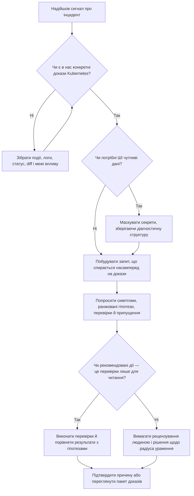

> **ШІ для Kubernetes та платформної роботи** | Складність: `[MEDIUM]` | Час: 40-55 хв
>
> **Передумови**: базові поняття про робочі навантаження Kubernetes, знайомство з `kubectl` і Модуль 1.1 цього треку

---

## Результати навчання

- Діагностувати збої розгортання (rollout) у Kubernetes, відокремлюючи симптоми, гіпотези та перевірені причини, перш ніж просити в ШІ рекомендації.
- Створювати запити (prompts) до ШІ, побудовані насамперед на доказах: подіях Kubernetes, логах, стані ресурсів, відмінностях у маніфестах, межах впливу та негативних доказах.
- Оцінювати згенеровані ШІ плани тріажу, ранжуючи гіпотези за впевненістю, вартістю перевірки, радіусом ураження та операційним ризиком.
- Впроваджувати робочий процес усунення несправностей «людина + ШІ», який зберігає за людиною відповідальність за збір доказів, продакшен-рішення та кінцеву дію.

## Чому цей модуль важливий

Гіпотетичний сценарій: продакшен-Deployment у просторі імен `payments` зависає під час рутинного оновлення образу. Старі поди й далі обслуговують трафік, нові поди так і не переходять у стан `Ready`, канал інциденту заповнюється уривчастими спостереженнями, і хтось вставляє в ШІ-асистента фразу «кластер зламався», бо команда хоче швидкої допомоги. Саме в цю мить ШІ може або заспокоїти розслідування, або зробити його ще хаотичнішим — залежно від того, чи надає оператор докази, чи запрошує модель здогадуватися.

Усунення несправностей у Kubernetes — одна з найцінніших сфер застосування ШІ, бо інциденти породжують забагато тексту, щоб одна людина могла охайно прочитати його під тиском. Події, логи, історія розгортань, квоти ресурсів, стан вузлів, збої проб (probe) і відмінності в маніфестах надходять одночасно, і складність тут не в запам'ятовуванні кожної команди, а у вирішенні, який сигнал змінює наступне рішення. ШІ може стиснути ці сигнали, запропонувати кандидатів на причину і допомогти побудувати чіткіший план наступної перевірки, але він не може знати стан вашого кластера, якщо ви йому цього не надасте.

Ризик у тому, що вправна відповідь може здаватися підтвердженим діагнозом, навіть якщо це лише збіг зі знайомим шаблоном. Модель, яка бачила тисячі публічних постів про DNS, збої OOMKill та проблеми з витягуванням образів, може запропонувати саме ці пояснення ще до того, як з'явиться достатньо доказів, а вишукане формулювання може приховати різницю між правдоподібним і доведеним. У цьому модулі ви навчитеся використовувати ШІ як організатора розслідування, а не як авторитет, що обходить докази Kubernetes.

Практична мета проста: зберегти виграш у швидкості, не дозволяючи моделі перебрати на себе продакшен-рішення. Ви навчитеся будувати запити, які відокремлюють симптоми від гіпотез, просити розрізняльні перевірки замість загальних списків команд і оцінювати рекомендації за радіусом ураження, перш ніж щось запускати. Наприкінці модуля ШІ має допомагати вам мислити чіткіше під час тріажу, а не заливати вас командами, які лише створюють ілюзію активності під час інциденту.

## Починайте з доказів, а не з тривоги

Найслабший запит про усунення несправностей зазвичай водночас і найщиріший емоційно: «Мій кластер зламався. Що робити?» Це речення передає терміновість, але майже не дає моделі операційного контексту. Оскільки в запиті немає ні простору імен, ні назви ресурсу, ні потоку подій, ні часу розгортання, ні меж впливу, ні опису недавньої зміни, модель змушена заповнювати цю прогалину загальними шаблонами Kubernetes, а не доказами з конкретного інциденту.

Сильніший запит починається з фактів, які допомогли б і людині-рецензенту. Він називає робоче навантаження, описує спостережуваний збій, включає вікно зміни й наводить точний вивід, який уже видав Kubernetes. Цей зсув важливий, бо ШІ набагато краще впорядковує докази, ніж відкриває докази, яких ніколи не бачив, а різниця між корисною гіпотезою і небезпечним здогадом часто зводиться до одного пропущеного рядка події.

Слабкий запит зазвичай стискає весь інцидент до тривоги і не дає моделі жодних доказів для аналізу:

> «Мій кластер зламався. Що робити? Нам потрібне швидке рішення, і я не знаю, з чого почати шукати.»

Корисний запит теж передає терміновість, але дає моделі факти Kubernetes, які можна перевірити:

> «Розгортання Deployment зависло. Нові поди залишаються в стані `Pending`. Ось події подів, дані про місткість вузлів і відповідну різницю в специфікації (spec diff).»

ШІ працює набагато краще, коли отримує точні повідомлення про помилки, вивід подій, логи, відмінності в маніфестах, часові рамки та межі впливу. Без цих вхідних даних він може за замовчуванням скотитися до найпоширеніших публічних пояснень замість найімовірнішої причини саме у вашому середовищі. Тому перша навичка оператора — це пакування доказів, а не креативність у формулюванні запитів.

«Галюцинація впевненості» виникає тоді, коли модель називає причину без доказів, потрібних для її підтвердження. Наприклад, под у стані `Pending` можуть блокувати нестача CPU, незадоволений node selector, taint без відповідного toleration, ліміт квоти, відсутній PersistentVolume або обмеження планувальника, створене правилами topology spread. Якщо в запиті сказано лише «Pending», впевнена відповідь про будь-яку з цих причин — це не діагноз; це неперевірена гіпотеза, вимовлена вишуканим голосом.

Розгляньмо невеликий приклад, який показує ціну здогадів. Розпливчастий запит каже: «Мій под у Pending. Виправ це», — і ШІ-асистент відповідає послідовністю дій з обслуговування вузлів, бо припускає проблему на боці робочого вузла. Реальний вивід `kubectl describe pod`, який не був наданий, каже: `0/10 nodes are available: 10 Insufficient cpu`; drain вузлів лише додасть метушні до проблеми місткості, замість того щоб її розв'язати.

Відповідальність платформного інженера — запобігти саме такому збою, ставлячись до ШІ як до швидкого молодшого слідчого, якому обов'язково потрібно показати матеріали справи. Ви ж не попросили б колегу-людину рекомендувати продакшен-дію, не побачивши подій, логів та останньої зміни, — тож не просіть цього і в моделі. Звичка ставити докази на перше місце перетворює ШІ з джерела впевненого шуму на інструмент, що скорочує шлях від симптому до перевіреної причини.

Найпростіший шаблон збору доказів — зібрати достатньо даних, щоб описати зміну, симптом, межі впливу, докази й обмеження. Не потрібно вставляти в модель увесь кластер цілком, але потрібно достатньо сигналу, щоб вона могла розрізнити схожі між собою причини. У Kubernetes це зазвичай означає ідентичність ресурсу, недавню різницю в специфікації, поточний статус, повідомлення подій, відповідні логи, контекст вузла чи квоти та один-два приклади того, що все ще працює.

```bash
kubectl rollout status deployment/api -n payments
kubectl get pods -n payments -l app=api -o wide
kubectl describe pod -n payments -l app=api
kubectl get events -n payments --sort-by=.lastTimestamp
kubectl diff -f deployment.yaml
kubectl describe quota -n payments
```

Перш ніж це запускати: який вивід ви очікуєте побачити, щоб відрізнити проблему планування від проблеми запуску контейнера? Якщо под так і не отримує призначення на вузол, у центрі розслідування опиняються планувальник і місткість кластера; якщо под призначено, але він постійно перезапускається, важливішими стають контейнер, проби, конфігурація та середовище виконання. Цей крок із прогнозуванням допомагає помітити, коли докази суперечать першій версії, яка склалася у вас в голові.

До доказів належать і негативні докази — тобто факти, які виключають привабливі пояснення. Якщо один Service може з того самого вузла дістатися бази даних, а інший — ні, масштабний збій мережі на рівні вузла стає менш імовірним. Якщо старі поди залишаються здоровими, а нові — падають, повний збій кластера менш імовірний, ніж зміна, пов'язана саме з цим розгортанням, і модель варто повідомити про цю межу ще до того, як вона ранжує гіпотези.

Наведений нижче пакет для тріажу — корисний шаблон, бо він розглядає ШІ як читача доказів, а не як заміну їх збору. Він використовує найбезпечнішу форму запиту й додає рівно стільки структури, скільки потрібно, щоб запобігти узагальненій відповіді. Заключна вимога просить ранжовані гіпотези та перевірки, що зменшують невизначеність, — це змушує модель показати хід міркувань, а не одразу стрибати до виправлення.

```text
Допоможи мені провести тріаж цієї проблеми з розгортанням у Kubernetes.

Факти:
- простір імен: payments
- deployment: api
- старі поди здорові
- нові поди у стані Pending
- проблема почалася після зміни образу та ресурсів

Докази:
- вивід pod describe:
  [вставити]
- підсумок доступної місткості вузла (node allocatable):
  [вставити]
- diff деплойменту:
  [вставити]

Поверни:
1. симптоми
2. найсильніші гіпотези, ранжовані за доказами
3. наступні 3 перевірки, які найбільше зменшать невизначеність
4. що поки не варто вважати доведеним
```

Фраза «що поки не варто вважати доведеним» цінніша, ніж здається на перший погляд. Інциденти породжують упередження закріплення (anchoring bias), бо перше правдоподібне пояснення відчувається продуктивним — особливо коли воно збігається з тим, що команда вже колись бачила. Прохання до ШІ перелічити недоведені припущення змушує зробити паузу перед дією і може показати, чи спирається модель на докази з вашого пакета, чи заповнює прогалини поширеним «фольклором» про Kubernetes.

Моделі також варто ставити завдання відрізняти доказ від висновку (inference). Доказ — це подія `FailedScheduling`, рядок логу про те, що процес не може прив'язатися до порту, або запис в історії розгортань, що показує зміну запиту на ресурси. Висновок — це коли модель каже, що запит, імовірно, перевищив доступний CPU, процес, імовірно, втратив capability, або readiness-проба, ймовірно, запустилася зарано; корисний висновок обов'язково повинен вказувати назад на доказ, який зробив його правдоподібним.

Це розрізнення варто практикувати ще до збою, бо воно змінює те, як команда розмовляє в каналі інциденту. Замість «ШІ знайшов кореневу причину» кажіть «ШІ поставив вичерпання квоти на перше місце, бо потік подій показує невдале планування, а diff об'єкта Deployment збільшив запити на ресурси». Це формулювання трохи довше, але воно зберігає ланцюжок від спостереження до інтерпретації і полегшує іншому інженеру можливість оскаржити наступний крок.

## Побудуйте рамку тріажу, перш ніж просити виправлення

Сильна рамка тріажу відповідає на шість запитань ще до того, як хтось запустить команду виправлення: що змінилося, що зламалося, які межі впливу, які докази вже є, які гіпотези узгоджуються з цими доказами і які перевірки найкраще розрізнять ці гіпотези. Ця рамка корисна і з ШІ, і без нього, але з ШІ вона особливо потужна, бо обмежує відповідь моделі саме тим розслідуванням, яке ви фактично проводите. Вона також дає команді спільну мову для рецензування виводу моделі.

Використовуйте таку форму:

1. Що змінилося?
2. Що зламалося?
3. Які межі впливу?
4. Які докази ми вже маємо?
5. Які три найімовірніші гіпотези?
6. Які перевірки найкраще їх розрізняють?

Перше запитання, «що змінилося», не дає розслідуванню перетворитися на екскурсію по кожній підсистемі Kubernetes. Розгортання, у якому змінилися лише тег образу та запити на ресурси, має спершу схиляти розслідування в бік доступності образу, місткості планувальника, поведінки запуску та будь-якої політики, яку запускає нова специфікація. Це не доводить провину саме цих ділянок, але дає моделі розумну стартову карту.

Друге й третє запитання тримають радіус ураження на видноті. «Нові поди в одному Deployment у стані Pending» — це набагато вужча проблема, ніж «усі робочі навантаження в пулі вузлів зазнають збоїв DNS», і ця різниця визначає і терміновість, і ризик дії. Якщо ШІ знає, що старий ReplicaSet і далі обробляє запити, а непов'язані робочі навантаження здорові, він має уникати глобальних рекомендацій із виправлення, доки докази їх не підтвердять.

Четверте запитання змушує модель працювати від даних, а не від «відчуттів». Kubernetes уже й так розповідає багато чого через статус об'єктів, події, умови (conditions), повідомлення контролерів і недавні зміни, але під тиском ці сигнали легко прочитати в неправильному порядку. Модель може підсумувати довгий вивід `describe` чи потік подій, але їй потрібен сирий матеріал у запиті, бо вона не може опитати ваш кластер інтуїцією.

П'яте й шосте запитання створюють диференціальну діагностику, а не звалище команд. Розрізняльна перевірка (discriminating check) — це дія, яка змістовно розділяє дві чи більше правдоподібних причин, наприклад порівняння подій пода зі станом квоти, коли под перебуває в `Pending`. Мета — запитати «яка одна перевірка найбільше зменшить невизначеність?», а не «які двадцять команд виглядають по-кубернетесному?»

Ось простий план розслідування для розгортання, у якому нові поди нездорові, а старі й далі обслуговують трафік:

```text
+--------------------------+     +--------------------------+     +--------------------------+
| Спостережуваний симптом  | --> | Пакет доказів            | --> | Ранжовані гіпотези       |
| Нові поди не Ready       |     | події, логи, diff        |     | місткість, образ, проба  |
+--------------------------+     +--------------------------+     +--------------------------+
             |                              |                              |
             v                              v                              v
+--------------------------+     +--------------------------+     +--------------------------+
| Межа впливу              | --> | Розрізняльна перевірка   | --> | Рішення людини про дію   |
| старі поди й далі здорові|     | одна перевірка на гілку  |     | rollback, patch, wait    |
+--------------------------+     +--------------------------+     +--------------------------+
```

Ця діаграма навмисно закінчується рішенням людини про дію. ШІ може допомогти ранжувати гілки, але продакшен-дія залишається за оператором, бо лише оператор може зважити вплив на бізнес, правила заморожування змін (change freeze), безпечність rollback, тиск SLO та ризик погіршити систему. Цей поділ обов'язків — не показний консерватизм; це спосіб не дати імовірнісному асистенту перетворитися на некерований контур управління.

Зупиніться й спрогнозуйте: якщо старі поди здорові, нові — у `Pending`, а diff об'єкта Deployment лише збільшив запити на CPU, яка гіпотеза має піднятися в рейтингу, а яка — опуститися? Місткість планувальника має піднятися, бо симптом з'являється ще до старту контейнера, тоді як теорії про DNS і readiness-пробу мають опуститися, доки докази не покажуть, що нові поди потрапили на вузол і запустили контейнер. Мета не в тому, щоб негайно довести версію про місткість, а в тому, щоб зробити наступну перевірку точною.

Коли просите в ШІ наступні перевірки, вимагайте прив'язати кожну перевірку до конкретної гілки. Наприклад: «Перевір квоту, бо ліміт простору імен може блокувати планування, навіть коли місткість вузла є», або «Перевір селектори вузлів, бо нова специфікація може вимагати мітки, яких немає в жодного доступного вузла». Якщо рекомендована команда не прив'язана до жодної гілки, це, можливо, просто «зайнятість заради зайнятості» — а вона коштовна під час інцидентів, бо забирає увагу.

Моделі також варто дати завдання виносити руйнівні дії або дії з великим радіусом ураження в окремий розділ. Такі команди, як видалення подів, перезапуск контролерів, drain вузлів чи зміна запитів на ресурси, можуть бути виправданими в правильному інциденті, але вони не повинні з'являтися як перші кроки без доказів і плану rollback. Хороша відповідь ШІ в тріажі пояснює, чому перевірка безпечна, яку невизначеність вона зменшує і яка дія піде далі, якщо перевірка підтвердить гілку.

## Ранжуйте гіпотези, потім перевіряйте їх

Найбезпечніша ментальна модель — це драбина з чотирьох рівнів: симптом, правдоподібна причина, перевірена причина і підтверджена причина. Симптом — це те, про що повідомляє Kubernetes, наприклад под, застряглий у `Pending`, чи контейнер у `CrashLoopBackOff`. Правдоподібна причина — це гілка, яка відповідає симптому; за перевіреною причиною стоїть результат перевірки; а підтверджена причина пояснює спостережуваний збій і витримує порівняння з конкурентними гілками.

ШІ найкорисніший саме в середині цієї драбини. Він може згенерувати правдоподібні причини, які ви могли б пропустити, ранжувати їх за наданими доказами і запропонувати перевірки, що перетворюють невизначеність на інформацію. Він не повинен перестрибувати від симптому одразу до впевненості, і непідкріплену фразу на кшталт «це точно DNS» варто сприймати як дефект процесу, а не як корисну відповідь.

Причина в тому, що вправність моделі — не те саме, що доступ до причинності. Публічний корпус містить безліч постів, де збої Kubernetes пов'язані з DNS, збоями OOMKill, витягуванням образів, проблемами CNI та неправильною конфігурацією проб, тож моделі легко відтворити саме ці пояснення. Ваш же кластер може падати через те, що правило topology spread, квота простору імен, політика допуску (admission policy) чи новий запит на ресурси створили конкретне обмеження планувальника, яке рідше трапляється в публічних прикладах.

Ранжування, зважене на доказах, протидіє цьому упередженню, вимагаючи від моделі оцінити кожну гіпотезу за двома практичними осями: впевненість на основі наданих доказів і вартість перевірки. Перевірку з низькими зусиллями та помірною впевненістю часто варто провести раніше за інвазивну перевірку з дещо вищою впевненістю, бо тріаж винагороджує зменшення невизначеності за хвилину. Саме тому швидкий перегляд квоти чи подій може на початку інциденту переграти складне трасування мережі.

| Гіпотеза | Доказ на її підтримку | Швидка розрізняльна перевірка | Вартість перевірки | Дія в разі підтвердження |
| --- | --- | --- | --- | --- |
| Запити на ресурси перевищують доступну місткість | Нові поди в `Pending` після зміни ресурсів | Перевірити події планувальника і allocatable вузла | Низька | Зменшити запит, масштабувати місткість або rollback |
| Образ неможливо витягнути | У diff з'явився новий тег образу | Переглянути події пода на предмет помилок pull | Низька | Виправити тег, автентифікацію реєстру або політику образів |
| Readiness-проба відхиляє нову збірку | Поди стартують, але так і не стають Ready | Порівняти логи контейнера і події проб | Низька | Патчити пробу, конфігурацію застосунку або rollback |
| SecurityContext блокує запуск процесу | Налаштування безпеки змінилися разом із розгортанням | Перевірити логи та помилки середовища виконання | Середня | Скоригувати capability, порт або налаштування файлової системи |
| NetworkPolicy блокує залежність | Лише нова версія падає на викликах до залежності | Перевірити межі політики з ефемерного debug-пода | Середня | Патчити політику або перенаправити трафік |

Ця таблиця не замінює судження, але надає відповіді ШІ форму, яку можна перевірити. У кожному рядку є причина, перевірка і межа дії, тож ви можете відкинути рядки, які не відповідають доказам. Якщо модель повертає список без такої структури, попросіть її переписати список у вигляді таблиці гіпотез, перш ніж щось запускати.

Запит, керований обмеженнями (constraint-driven prompt), — корисний шаблон ескалації, коли узагальнена відповідь надто широка. Він повідомляє моделі, що вже виключено, називає технологічний контекст і запитує про дві конкретні гілки. Важлива частина — те, що запит містить негативні докази, бо вони проріджують дерево гіпотез і не дають моделі повторювати перевірки, які команда вже провела.

```text
[Контекст: поди застрягли в CrashLoopBackOff після оновлення ConfigMap]

Обмеження:
- Ми вже перевірили синтаксис ConfigMap; це валідний YAML.
- Це НЕ OOMKill; використання пам'яті стабільне на рівні 12MB.
- НЕ пропонуй 'kubectl logs', бо бінарник падає раніше, ніж встигає написати щось у stdout.

Конкретне питання:
З огляду на те, що бінарник написаний на Go і ми нещодавно оновили 'securityContext',
чи може це бути помилка 'filesystem-read-only' або відсутня можливість (capability) 'cap_net_bind_service'?
```

Зверніть увагу, скільки роботи виконують ці обмеження. Вони кажуть моделі не витрачати токени на перевірку синтаксису, тиск пам'яті чи команду для логів, яка вже не допомогла. Вони також звужують розслідування до дозволів середовища виконання, через що відповідь із більшою ймовірністю запропонує такі перевірки, як огляд securityContext контейнера, поведінка прив'язки порту, ефекти файлової системи read-only та збір помилок запуску через події чи побічні канали діагностики.

Який підхід ви обрали б тут і чому: попросити в ШІ «всі можливі виправлення CrashLoopBackOff» чи попросити ранжувати лише гілки, узгоджені з наведеними вище обмеженнями? Другий підхід сильніший, бо він відфільтровує поширені, але нерелевантні поради ще до генерації відповіді. Він також економить час команди, тримаючи розмову близько до того, що докази справді можуть довести.

Ранжування не повинно перетворюватися на замаскований висновок. Гілка може бути «найвище ранжованою» і водночас непідтвердженою — особливо коли докази неповні чи неоднозначні. Ваш запит має вимагати від моделі назвати, які докази спростували б кожну гілку, бо спростовність (falsifiability) — це практичний захисний бар'єр проти спекуляцій, замаскованих під відповідь.

У продакшен-тріажі найкраща наступна перевірка — це часто та, що змінює дерево рішень, а не та, що видає найбільше виводу. Якщо одна-єдина подія з `describe` доводить перевищення квоти простору імен, це краще, ніж великий пакет логів, що не розрізняє квоту й місткість вузла. Просіть ШІ обґрунтовувати кожну рекомендовану перевірку тим, яку гілку вона підтверджує, послаблює або усуває.

Корисна звичка рецензування — прочитати найвищу гіпотезу моделі й запитати: «Який результат змусив би нас перестати в це вірити?» Якщо відповідь розпливчаста, гіпотеза ще не операційна. Для роботи з Kubernetes сильна гіпотеза зазвичай вказує на конкретне поле статусу, причину події (event reason), повідомлення контролера чи рядок логу, здатний швидко змінити впевненість команди.

## Використовуйте ШІ для стиснення, перекладу й пошуку відсутніх доказів

ШІ сильний у підсумовуванні довгих логів, перекладі щільного виводу `kubectl describe` на просту мову, виявленні повторюваних шаблонів подій, впорядкуванні часової шкали розслідування та переліку доказів, яких досі бракує. У цих завдань є спільна риса: вони зменшують когнітивне навантаження, не надаючи моделі повноважень змінювати систему. Вони особливо корисні, коли черговий інженер мусить читати незнайомі повідомлення контролерів, водночас координуючись із власниками застосунків.

ШІ слабкий у знанні особливостей саме вашого середовища, розумінні незадокументованих платформних конвенцій і виборі між схожими причинами, коли запиту бракує доказів. Керований кластер Kubernetes із власними політиками допуску, правилами приватного реєстру, спеціальними мітками вузлів, налаштуваннями service mesh за замовчуванням і командно-специфічною автоматизацією розгортань може поводитися інакше, ніж приклади в публічній документації. Якщо ці деталі важливі, вони мають з'явитися в запиті або залишитися під людським наглядом.

Уявіть модель як швидкого підсумовувача, що сидить поруч із уважним оператором. Підсумовувач може сказати: «Ці події повторюються в такому порядку» або «Розгортання змінило запити на ресурси й security context», — але саме оператор вирішує, чи робити rollback, patch, scale чи чекати. Це утримує модель у ролі, де корисні її сильні сторони, а сліпі зони мають менше шансів завдати шкоди.

Ось практичний запит на стиснення для потоків подій:

```bash
kubectl get events -n payments --sort-by=.lastTimestamp > /tmp/payments-events.txt
kubectl describe deployment api -n payments > /tmp/payments-deployment.txt
kubectl describe replicaset -n payments -l app=api > /tmp/payments-replicasets.txt
```

Зібравши файли, вставляйте відповідні витяги, а не вивантажуйте наосліп непов'язаний стан кластера. Просіть ШІ групувати повторювані повідомлення, за можливості називати контролер, що видає кожне повідомлення, і відокремлювати спостереження від інтерпретації. Це прохання допомагає моделі створити компактну часову шкалу, тоді як оператор і далі звіряє цю шкалу з сирим виводом, перш ніж вносити зміну в продакшен.

Корисна відповідь могла б сказати, що Deployment створив новий ReplicaSet, ReplicaSet створив поди, планувальник відхилив ці поди через нестачу CPU, і логів контейнера не існує, бо контейнери так і не запустилися. Це якісний підсумок, бо він відстежує шлях управління й не просить логів, яких ще не може існувати. Модель тут не «розв'язує Kubernetes» — вона стискає зашумлений граф об'єктів у впорядковане пояснення.

Той самий шаблон працює і для `CrashLoopBackOff`, але пакет доказів змінюється. Сюди варто включити статус контейнера, кількість перезапусків, недавні логи (якщо доступні), попередні логи, конфігурацію проб, посилання на ConfigMap чи Secret, ліміти ресурсів і будь-який diff, що змінив поведінку запуску. Якщо модель рекомендує мережеві перевірки, ще не врахувавши статус завершення контейнера й попередні логи, це сигнал повернути її до доказів.

```bash
kubectl get pod api-abc123 -n payments -o jsonpath='{.status.containerStatuses[*].restartCount}{"\n"}'
kubectl logs api-abc123 -n payments --previous
kubectl describe pod api-abc123 -n payments
kubectl get deployment api -n payments -o yaml
```

Будьте обережні із секретами, використовуючи інструменти ШІ. Маніфести Kubernetes можуть містити назви змінних середовища, посилання на Secret, назви сервісних акаунтів та внутрішні імена хостів, які можуть бути чутливими, навіть якщо самих значень секретів там немає. Маскуйте або приховуйте (redact) токени, облікові дані, приватні ідентифікатори клієнтів і внутрішні URL за потреби, але зберігайте структуру, важливу для діагностики, — наприклад, який ключ Secret використовувався чи який ServiceAccount застосовувався.

Модель також може «перекладати» зв'язки між об'єктами Kubernetes для колег, які не живуть на платформному рівні. Під час інциденту з розгортанням інженерів застосунку може цікавити, чи запустилася нова збірка, SRE — вплив на трафік і SLO, а платформних інженерів — події планувальника чи політика допуску. Хороший підсумок від ШІ може дати одну технічну часову шкалу й один підсумок для зацікавлених сторін (stakeholders), доки обидва прив'язані до тих самих доказів.

Не дозволяйте стисненню перетворюватися на приховування помилок. Якщо модель неправильно підсумовує рядок логу, ця помилка може розповсюдитися каналом інциденту, бо підсумок читати легше, ніж оригінал. Для інцидентів із високим впливом тримайте сирий вивід команд прив'язаним чи доданим і просіть ШІ дослівно цитувати точні повідомлення подій, на які він спирається, роблячи твердження.

Тут же має значення й процес команди. Якщо ШІ створює стислу часову шкалу, розміщуйте цю шкалу поруч із сирими доказами, а не замінюйте нею сирі докази. Підсумок допомагає людям швидко зорієнтуватися, тоді як сирий вивід зберігає можливість аудиту й дає змогу другому відповідальному перевірити, чи не пропустила, не об'єднала чи не неправильно прочитала модель важливий рядок.

## Тримайте поділ обов'язків «людина–ШІ» явним

За людиною лишаються збір доказів, пріоритизація, продакшен-рішення й кінцевий вибір дії. ШІ допомагає з підсумовуванням, кандидатами на причину, структурою розслідування та уточненням, що перевірити далі. Цей поділ — базове правило безпеки для тріажу в Kubernetes за участю ШІ, бо продакшен-операції залучають ризик-уподобання, вплив на користувачів і організаційний контекст, яких немає в тексті, згенерованому моделлю.

Цей поділ — не недовіра заради недовіри. Це відповідність обов'язків межам можливостей. Kubernetes розкриває стан через API, контролери, події та логи, тоді як ШІ генерує мову на основі запиту; якщо вони розходяться, перемагає стан кластера, і оператор має вміти пояснити дію, не кажучи: «Так сказала модель.»

Цей поділ можна зробити видимим прямо в самому запиті. Просіть ШІ подавати «рекомендовані перевірки» та «можливі дії в разі підтвердження» як окремі розділи, а потім вимагайте позначати руйнівні дії — видалення, drain, перезапуск чи rollback. Таке форматування полегшує людині-рецензенту схвалити перевірку, водночас притримавши зміну, яка потребує погодження з боку incident command.

```text
Подай відповідь у чотирьох розділах:
1. Підсумок доказів із прямими посиланнями на вставлений вивід.
2. Ранжовані гіпотези з рівнем впевненості та тим, що спростувало б кожну з них.
3. Безпечні наступні перевірки, які не змінюють стан продакшену.
4. Можливі продакшен-дії — лише якщо людина підтвердить докази.
```

Такий запит особливо корисний для команд, де молодший черговий інженер працює в парі з ШІ-асистентом. Асистент може допомогти молодшому інженеру підготувати чіткішу передачу справи (handoff) старшому рецензенту, а старший рецензент оцінює докази й план дій. Навчальна цінність тут висока, бо вивід моделі стає структурованим артефактом, який можна критикувати, а не магічною відповіддю, схованою у вікні чату.

Моделі ніколи не можна дозволяти вигадувати бізнес-інциденти, стверджувати щось про історію команди чи натякати, що стався реальний збій, якщо ви не надали джерело такого інциденту. Гіпотетичні сценарії — це нормально, якщо вони чітко позначені, бо вони дають учням змогу практикуватися, не сплутуючи вигадку з доказом. Той самий стандарт чесності діє й у вашому власному процесі роботи з інцидентами: якщо гіпотеза не підтверджена, позначайте її саме як гіпотезу.

Захисні бар'єри мають також включати рецензування команд. Команди, згенеровані ШІ, можуть містити неправильний простір імен, небезпечні селектори, застарілі назви ресурсів, руйнівні дієслова чи припущення про shell, які працюють інтерактивно, але падають у скриптах. Віддавайте перевагу командам, які спершу лише читають стан, використовують явний простір імен, уникають широких селекторів, поки їх не перевірено, і видають вивід, який можна зіставити з гіпотезою.

```bash
kubectl get deployment api -n payments -o wide
kubectl describe deployment api -n payments
kubectl get pods -n payments -l app=api -o wide
kubectl describe pod -n payments -l app=api
```

У прикладах використано повну команду `kubectl`, бо фрагменти, придатні для копіювання й запуску, не повинні залежати від інтерактивного псевдоніма. Багато інженерів у себе в терміналі користуються коротким псевдонімом, але приклади в модулі мають працювати в неінтерактивній оболонці shell, у runbook чи у вставленій нотатці про інцидент. Дрібні деталі запускності мають значення, коли оператор втомлений, а годинник інциденту цокає.

Ще одна межа — це свіжість джерела. Поведінка Kubernetes змінюється від релізу до релізу, залежно від перемикачів можливостей (feature gates) і налаштувань провайдера за замовчуванням, тож модель може пам'ятати старіші шаблони або не враховувати зміни, актуальні для Kubernetes 1.35. Коли рекомендація залежить від синтаксису команди, зрілості можливості чи поведінки контролера, перевіряйте її за актуальною документацією Kubernetes чи документацією вашого провайдера, перш ніж перетворювати на крок у runbook.

## Розберіть приклад тріажу розгортання

Сценарій вправи: Deployment на ім'я `api` у просторі імен `payments` оновили новим образом і вищим запитом на CPU. Статус розгортання не завершується, старі поди й далі обслуговують трафік, а нові поди залишаються в `Pending`. Ви хочете допомоги ШІ, але хочете, щоб розслідування залишалося вкоріненим у доказах Kubernetes і уникало зайвих змін продакшену.

Почніть зі збору вузького пакета, а не дампу всього кластера. Вам потрібно достатньо інформації, щоб вирішити, чи збій стається до планування, під час витягування образу, під час старту контейнера чи під час readiness. Найшвидший пакет включає статус розгортання, фазу пода, події, diff об'єкта Deployment, контекст allocatable вузла і контекст квоти, бо ці сигнали розділяють кілька поширених гілок, не змінюючи систему.

```bash
kubectl rollout status deployment/api -n payments --timeout=60s
kubectl get pods -n payments -l app=api -o wide
kubectl get events -n payments --sort-by=.lastTimestamp
kubectl describe quota -n payments
kubectl describe nodes
```

Припустімо, що нові поди не мають призначеного вузла, а потік подій повторює повідомлення планувальника про нестачу CPU. Ці докази підіймають вгору версії про місткість і розмір запиту, водночас опускаючи витягування образу, крах при старті й збій readiness. Наступний запит до ШІ не повинен звучати як «що не так із Kubernetes»; він має просити ранжоване пояснення гілки планування та мінімальний набір перевірок, щоб розрізнити квоту простору імен, місткість вузла, селектори вузлів, taint-и та топологічні обмеження.

Якщо на цьому етапі модель рекомендує читати логи застосунку, поставте цю рекомендацію під сумнів. Под, який ще не запланований, не може мати логів контейнера з цільового контейнера, тож команда, можливо, нешкідлива, але малокорисна. Це практичний спосіб оцінити вивід ШІ: чи поважає він життєвий цикл об'єкта, який випливає з доказів, чи пропонує узагальнену пораду про Kubernetes лише тому, що симптом звучить знайомо?

Тепер припустімо, що інший пакет доказів показує: поди заплановані, образ успішно витягується, а контейнер швидко завершується після зміни security context. Це відводить розслідування від місткості планувальника до дозволів середовища виконання, режиму файлової системи, прив'язки порту, відсутніх capability чи конфігурації застосунку. Той самий робочий процес із ШІ й далі застосовний, але пакет доказів і розрізняльні перевірки змінюються, бо збій перемістився на інший етап життєвого циклу.

```bash
kubectl get pod api-abc123 -n payments -o jsonpath='{.status.containerStatuses[*].state}{"\n"}'
kubectl logs api-abc123 -n payments --previous
kubectl get deployment api -n payments -o yaml
kubectl describe pod api-abc123 -n payments
```

Попросіть модель явно порівняти обидві гілки: «Які докази ми очікували б побачити, якби це була місткість планувальника, і які докази очікували б побачити, якби це був збій дозволів при старті?» Це змушує дати відповідь, що враховує життєвий цикл. Це також допомагає команді помітити, коли гіпотеза перестає відповідати дійсності, а це одна з найважчих людських навичок під час стресового інциденту.

Навіть коли докази вказують на ймовірну причину, дії все одно потрібна рамка рішення. Зменшення запитів на CPU може відновити планування, але перевантажити застосунок, якщо збільшення запиту було навмисним. Rollback об'єкта Deployment може відновити трафік, але приховати прогалину в місткості, яка повернеться під час наступного релізу. Масштабування пулу вузлів може бути найбезпечнішим для здоров'я сервісу, але повільнішим чи дорожчим залежно від середовища.

ШІ може допомогти перелічити ці компроміси, але не може вирішувати за вас пріоритет SLO, політику змін чи прийнятну вартість. Корисний фінальний запит просить варіанти дій із ризиками й кроками перевірки, а не одну команду для запуску. Далі оператор обирає дію, озвучує обґрунтування і перевіряє результат порівняно з початковим симптомом.

## Патерни та антипатерни

Хороший тріаж за участю ШІ має відтворювані патерни. Мета — не зробити так, щоб кожен інцидент відчувався «за сценарієм», а виробити звички, що зберігають якість доказів, коли тиск високий. Використовуйте ці патерни, коли хочете, щоб ШІ зменшував когнітивне навантаження, залишаючи джерелом істини Kubernetes, а не модель.

| Патерн | Коли використовувати | Чому це працює | Що враховувати під час масштабування |
| --- | --- | --- | --- |
| Спершу пакет доказів | У будь-якому інциденті, де ШІ підсумовуватиме або ранжуватиме причини | Прив'язує відповідь до подій, логів, diff-файлів і меж впливу | Стандартизуйте шаблон пакета для кожного типу робочого навантаження |
| Таблиця гіпотез | Коли кілька причин відповідають одному симптому | Прив'язує кожну гілку до доказу й перевірки | Зберігайте приклади в документах runbook, щоб відповідальні вивчали формат |
| Запит із негативними доказами | Коли команда вже виключила деякі гілки | Запобігає повторним порадам і проріджує дерево пошуку | Включайте у передачу справи (handoff) «завідомо здорові» сервіси, вузли й версії |
| Розділення безпечних перевірок | Перед змінами в продакшені | Відокремлює розслідування лише для читання від дії | Вимагайте погодження incident lead для дій із великим радіусом ураження |

Антипатерни зазвичай з'являються, коли терміновість штовхає команду до активності замість інформації. Вони здаються продуктивними, бо команди виконуються, а повідомлення в чаті рухаються, але вони не обов'язково зменшують невизначеність. Краща альтернатива — сповільнитися рівно настільки, щоб запитати, який факт змінив би наступне рішення.

| Антипатерн | Що йде не так | Краща альтернатива |
| --- | --- | --- |
| Спам команд | Команда запускає багато непов'язаних команд, так і не з'ясувавши, яка гілка ймовірніша | Просіть три перевірки, кожну прив'язану до гіпотези |
| Стрибок від симптому одразу до виправлення | ШІ рекомендує лагодження, перш ніж причину перевірено | Вимагайте позначок: симптом, правдоподібна причина, перевірена причина, підтверджена причина |
| Відсутність меж впливу | Проблему одного простору імен трактують як збій усього кластера | Перш ніж ранжувати причини, вкажіть уражені й неуражені робочі навантаження |
| Ігнорування негативних доказів | Ті самі виключені гілки повертаються знову й знову | Вставляйте те, що вже перевірено, і просіть модель не повторюватися |
| Нерецензована руйнівна дія | Згенерована команда видаляє, перезапускає чи робить drain без погодження | Відокремлюйте безпечні перевірки від можливих дій і вимагайте підтвердження людини |
| Запит, багатий на секрети | Чутливі дані з маніфесту чи логів вставляються у зовнішній інструмент | Маскуйте (redact) облікові дані, зберігаючи діагностичну структуру |

Найпоширеніший антипатерн — спам команд, бо він виглядає як імпульс уперед. Слабка відповідь ШІ щодо усунення несправностей може перелічити двадцять команд без пояснень, без ранжування і без зв'язку з поточним збоєм. Сильніша відповідь дає ймовірні гілки розслідування, мінімум наступних перевірок і причину, чому важлива кожна з них.

Ще один тонкий антипатерн — ставитися до ШІ як до остаточного арбітра, що розв'язує суперечку між гіпотезами, коли доказів бракує. Якщо наявним даним відповідають дві гіпотези, правильний крок — зібрати розрізняльні докази, а не просити відповідь із більшою впевненістю. Впевненість без нових доказів — це лише сильніше формулювання, а сильніше формулювання — це не операційний прогрес.

## Рамка прийняття рішень

Використовуйте ШІ під час тріажу, коли в проблеми достатньо доказів для підсумовування, кілька правдоподібних гілок для порівняння або великий обсяг тексту, який треба стиснути. Уникайте того, щоб ШІ був головною інстанцією, яка приймає рішення про руйнівні дії, винятки з політик, чутливі до безпеки дані чи інциденти, де запит не може вмістити достатньо контексту, щоб бути корисним. Питання не так у тому, чи дозволено ШІ брати участь, як у тому, яку роль йому дозволено відігравати.



Перший шлюз запитує, чи є у вас докази, бо ШІ не може відповідально ранжувати причини, спираючись лише на тривогу. Другий шлюз запитує, чи містять докази чутливі дані, бо якість запиту не виправдовує недбале розкриття інформації. Третій шлюз відокремлює перевірки лише для читання від змін у продакшені, що дає моделі змогу бути корисною під час розслідування, не надаючи їй контролю над дією.

| Ситуація | Найкраща роль ШІ | Відповідальність людини | Не дозволяйте ШІ робити це |
| --- | --- | --- | --- |
| Довгий потік подій із повторюваними повідомленнями | Підсумувати шаблони й часову шкалу | Перевірити точні повідомлення за сирим виводом | Вигадувати відсутню поведінку контролера |
| Розгортання зависло після зміни специфікації | Ранжувати причини й пропонувати розрізняльні перевірки | Обрати rollback, patch, scale чи очікування | Запускати руйнівні команди без рецензування |
| Незнайоме повідомлення про помилку в логах | Перекласти ймовірне значення й пов'язаний рівень Kubernetes | Звірити з актуальною документацією і станом системи | Трактувати публічні приклади як доказ |
| Аналіз після інциденту | Відокремити спостережене, здогадане й перевірене | Ухвалити коригувальні дії й призначити відповідальних | Переписувати невизначеність як впевненість |
| Ескалація від молодшого чергового | Структурувати передачу справи й список відсутніх доказів | Наставляти, схвалювати дії, оновлювати runbook | Замінювати рецензування старшим інженером для продакшен-ризику |

Якщо не впевнені, чи залучати ШІ, запитайте себе, який артефакт ви хочете від нього отримати. Підсумок, таблиця гіпотез, чекліст відсутніх доказів чи пояснення для зацікавлених сторін — зазвичай хороший артефакт. Послідовність команд, що змінює стан продакшену, рідко буває хорошим першим артефактом, бо вона пропускає крок, на якому люди перевіряють, чи відповідає команда доказам.

## Чи знали ви?

- Зберігання подій (event retention) у Kubernetes навмисно обмежене конфігурацією кластера, тож старі докази можуть зникнути ще до тривалого розбору інциденту, якщо ваша система спостережуваності не зберігає їх десь окремо.
- `kubectl debug` отримав статус stable у Kubernetes 1.25, через що робочі процеси з ефемерними контейнерами стали звичайною частиною сучасного усунення несправностей, а не експериментальним трюком.
- Документація Kubernetes групує завдання з дебагу за застосунками, об'єктами Service, кластерами й запущеними подами, що відображає звичку тріажу відокремлювати симптоми робочого навантаження від симптомів платформи.
- Kubernetes 1.35 і досі повідомляє про більшість збоїв робочого навантаження через звичайний статус об'єктів і Events, тож перший корисний запит до ШІ найчастіше починається зі звичайного виводу `kubectl get`, `describe` і `logs`, а не з екзотичних інструментів.

## Поширені помилки

| Помилка | Чому вона трапляється | Як її виправити |
| --- | --- | --- |
| Прохання до ШІ «полагодити кластер» без доказів | Терміновість перетворюється на розпливчастий запит, і модель заповнює прогалини поширеними публічними шаблонами | Надайте простір імен, робоче навантаження, симптом, межі впливу, недавню зміну, події, логи й diff-файли, перш ніж просити рекомендації |
| Сприйняття першого вправного пояснення як підтвердженого | Вишукана мова здається авторитетною під час стресового інциденту | Вимагайте, щоб кожна гіпотеза посилалася на докази і називала перевірку, здатну її спростувати |
| Запуск нефільтрованих списків команд, згенерованих ШІ | Довгі списки здаються прогресом і зменшують дискомфорт від невизначеності | Просіть мінімум наступних перевірок, ранжованих за зменшенням невизначеності й безпекою радіуса ураження |
| Пропуск негативних доказів | Команди зосереджуються на тому, що зламалося, і забувають згадати, що все ще працює | Включайте неуражені робочі навантаження, здорові старі поди, завідомо здорові вузли й уже завершені перевірки |
| Змішування безпечних перевірок із продакшен-діями | Згенеровані відповіді часто ставлять команди лише для читання поруч із перезапусками, видаленнями чи операціями drain | Перш ніж щось запускати, розділіть відповідь на перевірки лише для читання й дії, схвалені людиною |
| Вставляння чутливих маніфестів чи логів у зовнішні інструменти | Тиск усунення несправностей робить маскування (redaction) другорядним | Маскуйте облікові дані й приватні ідентифікатори, зберігаючи структурні деталі, потрібні для діагностики |
| Ігнорування етапу життєвого циклу Kubernetes | Команда просить логи чи мережеві тести, ще не знаючи, чи под було заплановано або запущено | Визначте, чи відбувається збій під час планування, витягування образу, старту, readiness чи маршрутизації трафіку |

## Тест

<details>
<summary>Питання 1: Ваша команда каже: «Кластер зламався», — після того як зависло розгортання платіжного сервісу. У вас є події подів, вивід `kubectl describe`, доступна місткість вузла (allocatable) і diff об'єкта Deployment, що показує зміну образу й ресурсів. Який найкращий спосіб попросити ШІ про допомогу, щоб він покращив розслідування, а не здогадувався?</summary>

Надайте структурований запит, побудований насамперед на доказах: точні факти, вставлені докази, межі впливу, недавню зміну і вузьке прохання — наприклад, симптоми, ранжовані гіпотези, наступні три перевірки й те, що поки не варто вважати доведеним. Це краще, ніж просити «виправлення», бо модель може впорядкувати докази Kubernetes, не вдаючи, що знає стан кластера, якого не бачила. Запит також має просити модель відокремлювати спостереження від висновків, щоб команда могла перевірити, чи кожна рекомендація спирається на наданий пакет.
</details>

<details>
<summary>Питання 2: Новий набір подів застряг у `Pending` після розгортання, тоді як старі поди все ще здорові. ШІ-асистент одразу каже: «Це точно проблема з DNS». Як слід поставитися до цієї відповіді?</summary>

Сприймайте цю відповідь як дефект процесу, якщо докази прямо не підтверджують DNS як причину. `Pending` означає, що розслідування, найімовірніше, ще перебуває біля планування, допуску, квоти, прив'язки сховища чи логіки вибору вузла, тоді як DNS зазвичай стає важливим уже після того, як под запущено й він робить мережеві виклики. Правильний крок — попросити ранжовані гіпотези, прив'язані до фактичних подій пода, і провести розрізняльну перевірку, що розділяє гілки, пов'язані з планувальником.
</details>

<details>
<summary>Питання 3: Під час інциденту інструмент ШІ повертає двадцять команд Kubernetes без ранжування, без обґрунтування і без зв'язку з поточним збоєм. Ваш колега хоче запустити їх усі, щоб заощадити час. Який підхід кращий?</summary>

Відхиліть спам команд і попросіть імовірні гілки розслідування, мінімум наступних перевірок і причину важливості кожної з них. Запуск непов'язаних команд може дати вивід, але не обов'язково зменшує невизначеність чи поважає радіус ураження. Краща відповідь ШІ прив'язує кожну перевірку лише для читання до гіпотези, пояснює, який результат підтвердив би чи послабив цю гілку, і виносить будь-яку дію, що змінює продакшен, на окреме схвалення людиною.
</details>

<details>
<summary>Питання 4: Ваша платформна команда розбирає збій після недавньої зміни конфігурації. Ви хочете, щоб допоміг ШІ, але водночас не хочете, щоб він замінив судження оператора. Які обов'язки лишаються за людиною, а які можна делегувати ШІ?</summary>

За людиною лишаються збір доказів, пріоритизація, продакшен-рішення й кінцевий вибір. ШІ може допомогти підсумувати довгий вивід, згенерувати кандидатів на причину, структурувати розслідування, визначити відсутні докази і підготувати чіткішу передачу справи. Цей поділ важливий, бо модель не несе відповідальності за ризик SLO, політику розгортань, вплив на клієнтів чи операційний контекст, потрібний, щоб обрати між rollback, patch, scale і очікуванням.
</details>

<details>
<summary>Питання 5: Інженер просить ШІ «полагодити розгортання» після зміни об'єкта Deployment. Інший інженер пропонує попросити ШІ відокремити симптоми, ранжовані гіпотези та наступні перевірки, які найкраще їх розрізнять. Який підхід безпечніший і чому?</summary>

Другий підхід безпечніший, бо він тримає ШІ в ролі організатора розслідування, а не дає йому вдавати, що знає виправлення ще до того, як причину перевірено. Хороше розслідування рухається від симптому до правдоподібної причини, потім до перевіреної й нарешті до підтвердженої причини, і кожен крок має спиратися на докази Kubernetes. Прохання про ранжовані гіпотези й розрізняльні перевірки підтримує цю драбину, тоді як прохання про «виправлення» заохочує непідкріплену впевненість.
</details>

<details>
<summary>Питання 6: Після минулого інциденту з Kubernetes ваша команда хоче з'ясувати, чи покращив би ШІ реакцію на нього. Яка вправа найкраще це перевірить?</summary>

Розділіть інцидент на те, що спостерігалося, що було лише здогадкою, і що було перевірено, а потім попросіть ШІ запропонувати наступні три перевірки, використовуючи лише спостережувані докази. Порівняйте план моделі з перевірками, які реально розв'язали інцидент, і зафіксуйте, де вона зменшила невизначеність, а де створила шум. Це перевіряє ШІ на відповідність робочому процесу, що спирається насамперед на докази, замість того щоб винагороджувати впевнено звучні здогадки, коли відповідь уже відома.
</details>

<details>
<summary>Питання 7: Ви розслідуєте збій, що виглядає як мережевий, і надаєте ШІ негативний доказ, наприклад: «Service A на тому самому вузлі працює нормально». Чому це технічно краще, ніж надати лише логи помилок?</summary>

Негативний доказ допомагає проріджувати дерево гіпотез, повідомляючи моделі, які широкі пояснення більше не підходять. Якщо схоже робоче навантаження на тому самому вузлі може дістатися залежності, збій мережі на рівні вузла чи всього кластера стає менш імовірним, і модель має перенести увагу на конфігурацію, політику, ідентичність чи маршрутизацію, специфічні для конкретного робочого навантаження. Логи помилок показують, що зламалося, а негативний доказ показує межу збою — а саме це часто й розділяє схожі між собою причини.
</details>

## Практична вправа

Сценарій вправи: ви готуєте пакет для тріажу за участю ШІ для розгортання Kubernetes 1.35, яке зависло після зміни об'єкта Deployment. Для цієї вправи вам не потрібен живий продакшен-кластер: використайте тестовий простір імен, локальний кластер або збережений вивід команд із лабораторного середовища. Мета — потренуватися структурувати докази, ранжувати гіпотези й рецензувати вивід ШІ, перш ніж вживати будь-яку дію в продакшені.

### Завдання 1: зберіть мінімальний пакет доказів

Зберіть поточний статус розгортання, список подів, деталі пода, Events, YAML об'єкта Deployment і будь-який відповідний diff для вашого лабораторного робочого навантаження. Тримайте простір імен явним у кожній команді й зберігайте вивід, щоб потім вставляти обрані витяги в запит до ШІ. Якщо у вас немає живого кластера, напишіть короткий симульований пакет із реалістичними назвами об'єктів Kubernetes і чітко позначте його як навчальний сценарій.

```bash
kubectl create namespace ai-triage-lab
kubectl get deployment api -n ai-triage-lab -o yaml
kubectl rollout status deployment/api -n ai-triage-lab --timeout=60s
kubectl get pods -n ai-triage-lab -l app=api -o wide
kubectl describe pod -n ai-triage-lab -l app=api
kubectl get events -n ai-triage-lab --sort-by=.lastTimestamp
```

<details>
<summary>Підказка щодо розв'язання</summary>

Ваш пакет має бути достатньо малим, щоб людина могла його переглянути, але достатньо повним, щоб розрізнити етап життєвого циклу. Включіть точний симптом, недавню зміну, межу впливу, повідомлення подій і хоча б один негативний доказ. Маскуйте (redact) чутливі значення, але зберігайте структурні деталі — назви ресурсів, посилання на ключі Secret і відповідні мітки, — якщо вони важливі для діагностики.
</details>

### Завдання 2: напишіть запит до ШІ, побудований насамперед на доказах

Перетворіть пакет на запит, що просить ШІ повернути симптоми, ранжовані гіпотези, наступні три перевірки, які зменшують невизначеність, і те, що поки не варто вважати доведеним. Використайте оригінальну «захищену» форму запиту з цього модуля, якщо вона підходить до вашого випадку, і додайте обмеження, якщо ви вже виключили якусь гілку. Не просіть команду для виправлення, доки не матимете перевіреної причини.

<details>
<summary>Підказка щодо розв'язання</summary>

Сильна відповідь називає робоче навантаження, простір імен, поточний режим збою, недавню зміну і джерела доказів. Вона також просить модель відокремлювати спостереження від висновків і позначати руйнівні дії окремо від перевірок лише для читання. Якщо ваш запит містить лише розпливчастий симптом і жодних вставлених доказів, перегляньте його, перш ніж використовувати ШІ.
</details>

### Завдання 3: оцініть вивід ШІ

Перегляньте відповідь моделі так, ніби ви — incident lead, що затверджує наступний крок розслідування. Позначте кожну гіпотезу як підтверджену, слабко підтверджену, непідтверджену або спростовану пакетом доказів. Потім визначте, чи є кожна рекомендована команда лише для читання, чи обмежена простором імен і чи прив'язана до конкретної гілки.

<details>
<summary>Підказка щодо розв'язання</summary>

Модель проходить цю перевірку, лише якщо її найвище ранжовані гілки відповідають доказам, а перевірки справді розділяють правдоподібні причини. Команда, що лише читає стан і пояснює, чому вивід важливий, зазвичай прийнятна. Команда, що видаляє, перезапускає, робить drain, патчить чи відкочує, має чекати на рішення людини, доки відповідну причину не підтверджено.
</details>

### Завдання 4: додайте негативні докази і переранжуйте

Додайте два факти про те, що все ще працює, — наприклад, старі поди залишаються Ready, «сусідній» Service успішно відповідає, інший простір імен не постраждав, або пул вузлів нормально виконує інші робочі навантаження. Попросіть ШІ переглянути таблицю гіпотез з урахуванням цих негативних доказів. Порівняйте нове ранжування з початковою відповіддю і зафіксуйте, які гілки було відсіяно.

<details>
<summary>Підказка щодо розв'язання</summary>

Переглянуте ранжування має применшити широкі пояснення на рівні кластера, якщо негативні докази їм суперечать. Якщо модель ігнорує нову межу й повторює ту саму загальну пораду, попросіть її прямо назвати, які гіпотези послаблюються негативними доказами. Це корисний спосіб перевірити, чи відповідь справді міркує від пакета доказів, чи просто перевикористовує поширені шаблони усунення несправностей.
</details>

### Завдання 5: підготуйте нотатку про дію, схвалену людиною

Напишіть коротку нотатку про інцидент, яка називає підтверджену чи провідну причину, докази на її підтримку, наступний безпечний крок перевірки і продакшен-дію, що потребує схвалення. Тримайте формулювання чесним, якщо причина ще не підтверджена. Нотатка про дію має бути достатньо зрозумілою, щоб інший інженер міг оскаржити її, не перечитуючи всю історію чату.

<details>
<summary>Підказка щодо розв'язання</summary>

Хороша нотатка могла б сказати, що нові поди в `Pending`, події планувальника повідомляють про нестачу CPU, старі поди здорові, а наступна перевірка — порівняти запити об'єкта Deployment з allocatable вузла і квотою простору імен. Вона не повинна казати «кореневу причину підтверджено», доки цього не доведе перевірка. Якщо запропонована дія — rollback, зменшення запиту чи масштабування пулу вузлів, нотатка має пояснювати, чому ця дія відповідає доказам і як буде перевірено успіх.
</details>

### Критерії успіху

- [ ] Діагностуйте збій розгортання Kubernetes, позначаючи симптом, правдоподібні причини, перевірені причини й будь-яку підтверджену причину.
- [ ] Побудуйте запит до ШІ, насамперед побудований на доказах: події, логи чи докази життєвого циклу, diff маніфесту, межі впливу й негативні докази.
- [ ] Оцініть план тріажу від ШІ, ранжуючи гіпотези за доказами, вартістю перевірки й ризиком радіуса ураження.
- [ ] Впровадьте робочий процес усунення несправностей «людина + ШІ», що відокремлює перевірки лише для читання від дій, які змінюють продакшен.
- [ ] Дотримуйтеся дисципліни маскування (redaction), прибираючи секрети, але зберігаючи діагностичну структуру незмінною.

## Джерела

- [Monitoring, Logging, and Debugging](https://kubernetes.io/docs/tasks/debug/) — Офіційні рекомендації Kubernetes щодо збору доказів і дебагу робочих навантажень чи кластерів.
- [Troubleshooting Applications](https://kubernetes.io/docs/tasks/debug/debug-application/) — Описує практичні робочі процеси усунення несправностей у Kubernetes, які підтримують тріаж, побудований насамперед на доказах.
- [kubectl debug Reference](https://kubernetes.io/docs/reference/kubectl/generated/kubectl_debug/) — Довідник щодо `kubectl debug`, корисний як подальше читання для практичного дебагу після тріажу.
- [Debug Running Pods](https://kubernetes.io/docs/tasks/debug/debug-application/debug-running-pod/) — Настанови Kubernetes щодо перевірки подів і використання технік дебагу, коли контейнери запущені чи падають.
- [Events](https://kubernetes.io/docs/reference/kubernetes-api/cluster-resources/event-v1/) — Довідник Kubernetes API щодо об'єктів Event — потоку доказів, що стоїть за багатьма підказками щодо планування й життєвого циклу.
- [Pod Lifecycle](https://kubernetes.io/docs/concepts/workloads/pods/pod-lifecycle/) — Концептуальна документація Kubernetes, що пояснює фази пода, стани контейнерів і умови (conditions), які використовують під час тріажу.
- [Deployments](https://kubernetes.io/docs/concepts/workloads/controllers/deployment/) — Документація Kubernetes щодо Deployment: поведінка розгортання, об'єкти ReplicaSet, статус і контекст rollback.
- [Resource Management for Pods and Containers](https://kubernetes.io/docs/concepts/configuration/manage-resources-containers/) — Настанови Kubernetes щодо запитів і лімітів ресурсів, які допомагають у розслідуваннях планування й місткості.
- [Assigning Pods to Nodes](https://kubernetes.io/docs/concepts/scheduling-eviction/assign-pod-node/) — Документація Kubernetes щодо планування: селектори вузлів, affinity й обмеження розміщення.
- [Taints and Tolerations](https://kubernetes.io/docs/concepts/scheduling-eviction/taint-and-toleration/) — Документація Kubernetes щодо планування: збої розміщення на основі taint-ів та відповідні допуски toleration.
- [Resource Quotas](https://kubernetes.io/docs/concepts/policy/resource-quotas/) — Документація Kubernetes щодо політик: збої квот простору імен, які можуть блокувати зміни робочого навантаження.
- [Ephemeral Containers](https://kubernetes.io/docs/concepts/workloads/pods/ephemeral-containers/) — Документація Kubernetes щодо debug-контейнерів та їхніх обмежень під час розслідування в середовищі виконання.

## Наступний модуль

Перейдіть до модуля [ШІ у платформній роботі та SRE-процесах](../module-1.3-ai-for-platform-and-sre-workflows/), щоб перетворити навички тріажу на відтворювані платформні робочі процеси.
