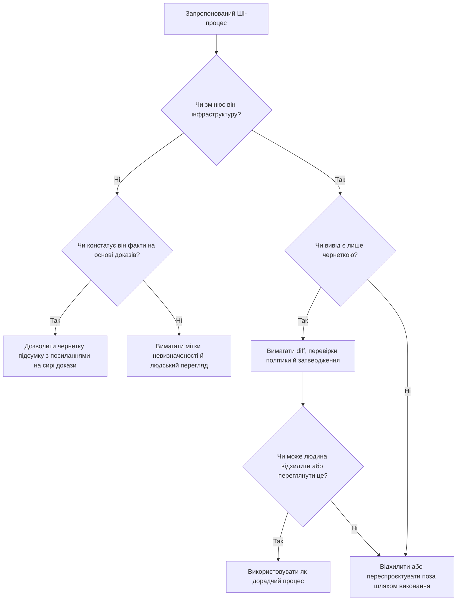

> **Складність**: `[MEDIUM]`
>
> **Час на проходження**: 40-55 хв
>
> **Передумови**: основи Kubernetes, базовий словник реагування на інциденти, вміння читати вивід `kubectl` та завершення попереднього модуля про використання ШІ в роботі з платформою Kubernetes

---

## Що ви зможете робити

- Діагностувати безпечні межі допомоги ШІ для процесів реагування на інциденти в Kubernetes, розділяючи збір доказів, підготовку рекомендацій, затвердження, виконання та прийняття ризику.
- Проєктувати процеси роботи з runbook (інструкцією з реагування) та постмортемами за участю людини (human-in-the-loop), де ШІ покращує ясність викладу, зберігаючи відповідальне володіння платформою за людьми.
- Оцінювати згенеровані ШІ підсумки сповіщень, пропозиції з усунення проблем та нотатки про інциденти на предмет невизначеності, відсутнього контексту та небезпечних операційних припущень.
- Реалізувати макет SRE-процесу, у якому ШІ допомагає з переглядом доказів у Kubernetes, впорядкуванням документації та формулюванням варіантів усунення проблем, не керуючи інфраструктурою.

## Чому цей модуль важливий

Гіпотетичний сценарій: команда платформи на Kubernetes 1.35 отримує шквал сповіщень після того, як розгортання зачіпає API-шлюз, сервіс оформлення замовлень і спільний пул вузлів. Система моніторингу майже одночасно повідомляє про `CrashLoopBackOff`, тиск на пам'ять, поди у стані очікування (pending) та спалювання SLO, а чат заповнюється уривчастими спостереженнями кількох відповідальних. ШІ-асистент може підсумувати сповіщення, порівняти симптоми зі старими нотатками та скласти чіткіший хронологічний виклад швидше, ніж стомлена людина встигне скопіювати рядки між інструментами, — але той самий асистент може перетворити непевні докази на впевнену історію, яка звучить повнішою, ніж є насправді.

Ця напруга і є практичною причиною, чому SRE-командам потрібна модель робочого процесу, а не гасло. Правильне запитання — не чи може ШІ допомагати з платформною роботою, бо очевидно, що може допомагати із завданнями, насиченими текстом і повторюваними патернами. Гостріше запитання — де ШІ змінює саму роботу, не змінюючи володіння нею, особливо коли робота близька до продакшен-ризику. Якщо модель складає чернетку постмортему, людина-рецензент може її виправити; якщо модель схвалює відкат, виводить вузол з експлуатації (drain) або переписує політику під час неоднозначного інциденту, команда перейшла межу від допомоги до делегованого судження.

Цей модуль вчить операційній межі. Ви збережете сильні сторони наявного уроку: ШІ добре підсумовує повторюваний контекст сповіщень, складає чернетки нотаток про інциденти, порівнює поточні симптоми з відомими патернами, покращує читабельність runbook і виявляє відсутні кроки перевірки. Ви також опрацюєте обмеження, яке робить ці переваги безпечними: люди й далі визначають серйозність, затверджують продакшен-зміни, виконують команди та приймають ризик. Результат — робочий процес, який можна пояснити іншому інженеру, перевірити після інциденту та вдосконалити, не вдаючи, що переконливий текст дорівнює операційним повноваженням.

## Хороші цілі для робочого процесу починаються з доказів, а не з повноважень

Найкращі SRE-процеси за участю ШІ починаються там, де модель може знизити когнітивне навантаження, не перебираючи контроль над системою. Перегляд сповіщень, підсумовування логів, редагування runbook і складання чернеток постмортемів цінні, бо вони насичені доказами й мовою. Вони також оборотні так, як продакшен-дії — ні. Поганий абзац можна виправити до того, як він потрапить у постмортем; погана команда, виконана на API-сервері, може перетворити збій зі стану "незрозуміло" на стан "шкода вже завдана".

Уявіть ШІ як дуже швидкого секретаря інциденту з незвично широкою пам'яттю, а не як командира інциденту. Секретар може зібрати нотатки, підсвітити суперечності й нагадати кімнаті, що на питання ще не відповіли. Секретар не повинен оголошувати серйозність, схвалювати зміну чи вирішувати, що один ризик важить менше за інший. Ця аналогія недосконала, але вона зберігає ключовий розподіл: модель допомагає людям бачити роботу, а відповідальні люди й далі обирають, що робити.

У Kubernetes ця відмінність важлива, бо сигнали розкидані між контролерами, подами, подіями, логами, рішеннями допуску (admission), виводом планувальника та зовнішніми системами моніторингу. Один симптом, як-от поди у стані `Pending`, може вказувати на тиск на ресурси, taint-позначки вузлів, обмеження розподілу за топологією, ліміт квоти або розгортання, яке запросило більше потужності, ніж мав кластер. ШІ може допомогти зібрати ці можливі пояснення в читабельну карту. Він не повинен згортати цю карту в кореневу причину до того, як команда перевірить докази.

Тож хороші цілі мають три спільні властивості. По-перше, вони використовують дані, які команда може перевірити безпосередньо, як-от події, логи, runbook, нотатки про інциденти, маніфести чи заявки на зміну. По-друге, вони видають чернетки, підсумки, порівняння чи запитання, які людина може переглянути. По-третє, вони залишають незворотні кроки поза моделлю, включно зі схваленнями, операціями запису в продакшені, змінами політики та публічними висновками про інцидент. Саме ця межа дозволяє команді рухатися швидше, не ховаючи відповідальність усередині чат-стенограми.

Цю роботу можна назвати "контекстним збагаченням". Традиційне групування сповіщень може пов'язувати сигнали через мітки, часові вікна та статичні правила маршрутизації. Мовна модель може додати семантичну кореляцію, помітивши, що подія пода у стані очікування, подія `OOMKilled` та збій запуску застосунку можуть належати до одного пакета розслідування, навіть якщо мітки не збігаються ідеально. Цінність тут не в магічній діагностиці — вона в швидшому складанні першого узгодженого набору гіпотез.

Наступний приклад зберігає цю дорадчу роль. Команда збирає події Kubernetes для одного об'єкта і надсилає JSON в інтегрований з LLM CLI-інструмент для аналізу, але запит просить кореляції, а не дію. Це навмисно сформульовано як вхідні дані для перевірки гіпотез людиною. Відповідальному все одно потрібно оглянути події, порівняти їх зі станом вузла й логами та вирішити, який крок перевірки наступний.

```bash
# Приклад: використання інтегрованого з LLM CLI-інструмента для діагностики CrashLoopBackOff
kubectl get events --field-selector involvedObject.name=api-gateway-v2 -o json | \
llm-cli "Проаналізуй ці події та визнач, чи корелюють перезапуски з 
тиском на вузол, відмовами контролера допуску чи помилками на рівні застосунку."
```

Зупиніться і спрогнозуйте: перш ніж запускати такий робочий процес, яка відповідь була б небезпечною, навіть якщо звучала б правдоподібно? Безпечна відповідь могла б сказати, що перезапуски корелюють із тиском на пам'ять і що далі варто перевірити метрики вузла. Небезпечна відповідь сказала б, що сервіс слід негайно виправити патчем, що відкат точно не потрібен, або що коренева причина доведена, тоді як докази показують лише кореляцію. Що впевненіше звучить модель, то усвідомленіше варто розділяти спостережені факти й запропоновані пояснення.

Та сама межа стосується й перегляду логів. Практики можуть подати вивід `kubectl describe pod` і останні логи контейнера у спеціалізований запит, щоб знайти зв'язки, які статичний лінтер може пропустити, наприклад невідповідність між `targetPort` сервісу (Service) і портом, який відкриває Helm-чарт. Асистент може вказати, чому ці деталі варто розглядати разом. Інженер все одно підтверджує маніфест, перевіряє ендпоінти, читає історію розгортання та вирішує, чи належить виправлення до конфігурації застосунку, значень чарта чи політики платформи.

Це змінює роль SRE від отримання даних до підготовки рішення. Без допомоги перша частина інциденту часто перетворюється на хаотичний пошук по терміналах, дашбордах, старих постмортемах і чаті. З обмеженим асистентом відповідальні можуть витрачати більше часу на кращі запитання: які симптоми з'явилися першими, який сигнал є авторитетним, яка зміна внесла новий ризик і який крок перевірки найшвидше знижує невизначеність. Система безпечніша, коли модель прискорює ці запитання, а не замінює їх.

Інституційна пам'ять — ще одна сильна ціль. Постмортеми, runbook, нотатки з розбору інцидентів і проєктна документація часто містять саме ті крайні випадки, які команда забуває під тиском. ШІ з retrieval-augmented підходом може виводити на поверхню споріднені матеріали під час нового інциденту, але має подавати їх як контекст із цитатами чи посиланнями, а не як вердикт. Корисний асистент каже: "Це нагадує квітневе розгортання, де тиск на пам'ять і поди у стані очікування з'явилися разом; ось нотатки для перевірки". Він не каже: "Це та сама коренева причина, тож застосуйте попереднє виправлення".

Найбезпечніші платформні команди роблять цей дорадчий статус видимим у самому робочому процесі. Вони позначають вивід моделі як чернетку, додають поля невизначеності, вимагають нотаток людського перегляду та тримають виконання в детермінованих інструментах чи шляхах ручного затвердження. Ці деталі можуть здаватися бюрократичними, доки інцидент не стане напруженим. Під час стресу видимі межі робочого процесу заважають команді сприймати відшліфований підсумок як перевірений висновок.

## Слабкі цілі для робочого процесу перетинають межу відповідальності

Слабкі цілі для ШІ-процесу зазвичай спокусливі, бо межують із повторюваною роботою, але приховують судження. Схвалення продакшен-зміни, визначення серйозності інциденту, вибір між відкатом і виправленням вперед, переписування політики чи пряма дія на інфраструктурі можуть містити багато тексту, але складна частина — не виробництво тексту. Складна частина — це володіння ризиком за неповної інформації. Модель може імітувати мову цього володіння, фактично не несучи його.

Kubernetes робить цю небезпеку конкретною. Рекомендація вивести вузол (drain) може бути розумною, якщо у навантажень здорові репліки, бюджети переривань і немає локального стану. Та сама рекомендація може спричинити простій, якщо вузол приймає крихкі навантаження, якщо `PodDisruptionBudget` блокує витіснення або якщо запасна потужність недоступна. Модель може прочитати опис ситуації й скласти правдоподібний план, але вона не несе відповідальності за чергування, вплив на клієнтів чи слід аудиту.

Режим збою — не лише галюцинація. Навіть коли модель фактично права щодо ресурсу, вона може оптимізувати не ту ціль. Під час збою збільшення ліміту пам'яті може знизити перезапуски для одного розгортання, вичерпавши потужність вузла для навантажень нижчого пріоритету. Відкат може відновити затримку, повторно внісши регресію безпеки. Виправлення вперед може бути швидшим, збільшивши складність зміни. Це компроміси, а не дрібниці, тож рішення про них належить відповідальним за реагування та усталеним механізмам контролю змін.

Ось чому ШІ належить дорадчому рівню, а не виконавчому рівню платформного робочого процесу. Дорадчий рівень може аналізувати вхідні дані, готувати варіанти чернеток і запитувати, чи не бракує захисного бар'єра. Виконавчий рівень застосовує зміни через `kubectl`, GitOps-контролери, CI/CD-системи, контролери допуску (admission) чи хмарні API. Якщо дорадчий рівень може безпосередньо змінювати стан продакшену без бар'єра людського затвердження й детермінованої перевірки політики, команда зробила переконливу генерацію частиною площини керування.

Наступний збережений приклад показує, як пропозицію з усунення проблем, згенеровану ШІ, слід трактувати як чернетку. Він записує файл патча, а потім використовує `kubectl diff`, щоб практик міг порівняти пропозицію з поточним станом. Важлива деталь — коментар: не застосовувати пропозицію автоматично. Блок команд корисний тим, що він тримає пропозицію моделі доступною для перевірки й рецензування до того, як зміна дійде до API-сервера.

```bash
# Пропозиція з усунення проблем, згенерована ШІ (НЕ ЗАСТОСОВУВАТИ АВТОМАТИЧНО)
# Причина: виявлено 90% використання пам'яті в 'auth-service'
# Запропонована дія: пропатчити розгортання, щоб збільшити ліміт пам'яті

cat <<EOF > remediation-patch.yaml
spec:
  template:
    spec:
      containers:
      - name: auth-service
        resources:
          limits:
            memory: "2Gi"
EOF

# Примітка практика: завжди звіряйте пропозицію з поточним станом через diff
kubectl diff -f remediation-patch.yaml
```

Перш ніж запускати це, який вивід ви очікуєте від `kubectl diff` і що змусило б вас зупинитися? Вам слід очікувати різницю в маніфесті, а не доказ, що зміна безпечна. Вам слід зупинитися, якщо diff зачіпає неочікуване навантаження, якщо він пропускає запити на ресурси, якщо він суперечить квотам чи потужності вузла, або якщо докази інциденту насправді не підтверджують пам'ять як найкорисніший наступний крок перевірки. Diff — це вхідні дані для перегляду; це не схвалення.

Human-in-the-loop іноді подають як розмиту заспокійливу фразу, тож зробіть її операційною. Змістовний людський бар'єр має названого рецензента, достатньо контексту, щоб оцінити ризик, видимий запис затвердження та спосіб відхилити чи переглянути вивід моделі. Слабкий бар'єр — це кнопка, яку хтось натискає, бо модель уже написала впевнене пояснення. Якщо рецензент не бачить доказів і не може змінити план, команда додала церемонію, а не контроль.

Механізми політик і контроль допуску (admission) доповнюють цю межу, але не замінюють її. Open Policy Agent Gatekeeper, ValidatingAdmissionPolicy, квоти ресурсів і RBAC можуть запобігти класам поганих змін, перш ніж вони дійдуть до кластера. Вони не можуть вирішити, чи виправдане ризиковане розгортання під час конкретного інциденту. Детермінована політика має ловити заборонені форми; людський перегляд має вирішувати контекстно-залежний ризик; ШІ має допомагати готувати докази для обох.

Можливість аудиту — ще одна причина тримати ШІ поза кінцевими повноваженнями. Багатьом платформним командам потрібно пояснювати, хто схвалив продакшен-зміну, які докази були доступні, які альтернативи розглядалися і чому обрана дія була прийнятною. Стенограма зі словами "модель порекомендувала це" — не ланцюжок відповідальності. Слід аудиту має показувати, що модель склала чернетку, людина переглянула чернетку, спрацювали детерміновані перевірки, а затверджений робочий процес застосував зміну.

Ця межа стає особливо важливою, коли серйозність неоднозначна. Серйозність — не просто мітка; вона визначає виклик чергового, комунікації, ескалацію, повідомлення клієнтам, а іноді й контрактні зобов'язання. ШІ може підсумувати симптоми, релевантні для серйозності, як-от постраждалі сервіси, спалювання SLO, бюджети помилок і спостережений вплив на клієнтів. Він не повинен ухвалювати кінцеве рішення про серйозність, якщо тільки команда не закодувала це рішення в детермінованій політиці й не прийняла управлінські наслідки.

Та сама обережність стосується висновків постмортему. ШІ дуже добре перетворює безладні нотатки на чіткий наратив, що може випадково стерти невизначеність. Якщо в команди часткові логи й неповні дані про час, асистент може скласти речення про кореневу причину, яке звучить краще, ніж заслуговують докази. Надійний робочий процес вимагає таких полів, як "спостережені симптоми", "підтверджені причини", "супутні фактори" та "невідоме", щоб модель не могла приховати прогалину, обійшовши її текстом.

Є ще одна слабка ціль, яка заслуговує на увагу: дозволити ШІ стати прихованим двигуном пріоритизації для платформної роботи. Триаж беклогу, впорядкування подальших дій після інциденту та рішення щодо дорожньої карти надійності часто виглядають як класифікація тексту, але вони кодують вплив на бізнес, шкоду користувачам, інженерну ємність і стратегічний ризик. ШІ може групувати схожі подальші пункти або виявляти дублікати, але кінцевий пріоритет має визначати відповідальний власник, який розуміє зобов'язання перед сервісом і організаційний контекст. Інакше команда може випадково оптимізувати найлегшу для пояснення роботу замість найважливішої.

Практичний тест — чи міг би розсудливий рецензент оскаржити вивід. Якщо відповідь — рейтинговий список ризиків, рецензент повинен бачити критерії й докази, що стоять за рейтингом. Якщо відповідь — запропонована зміна, рецензент повинен бачити diff, передумови та шлях відкату. Якщо відповідь — висновок постмортему, рецензент повинен бачити, які факти його підтверджують, а які лишаються невизначеними. Можливість перегляду — це різниця між використанням ШІ, щоб зробити судження видимим, і використанням ШІ, щоб сховати судження за плавністю тексту.

## Трьохетапний SRE-патерн зберігає корисність ШІ

Практичний ШІ-процес для SRE-роботи має три етапи: до роботи, під час роботи та після роботи. Цей патерн достатньо простий, щоб використовувати під час реального інциденту, але достатньо строгий, щоб запобігти плутанині ролей. До роботи ШІ допомагає прояснити цілі, виявити припущення й скласти чернетку контрольного списку. Під час роботи ШІ допомагає підсумовувати докази, порівнювати симптоми й вести структуровані нотатки. Після роботи ШІ допомагає перетворити сирий матеріал на документацію, придатну для перегляду, і подальші пункти.

Етап "до" — це там, де ШІ може зменшити сліпі зони, не створюючи операційного імпульсу. Для міграції, розгортання чи навчання з відпрацювання інциденту попросіть асистента переформулювати ціль, перелічити припущення, виявити відсутні кроки перевірки й запропонувати передпольотний контрольний список. Модель не запитують, чи слід схвалити зміну. Її запитують, щоб зробити поверхню перегляду ширшою, аби команда бачила, де все ще потрібне людське рішення.

Наприклад, перед платформною міграцією хороший запит може попросити асистента порівняти задуманий робочий процес з runbook команди й виявити неясні передумови. Результатом має бути артефакт для перегляду: відсутні критерії відкату, неоднозначне володіння, відсутні перевірки моніторингу чи неясні кроки комунікації. Якщо асистент пропонує команду, цю команду слід перемістити в розділ чернетки й переглянути, як і будь-яку іншу зміну. Мета — краща підготовка, а не обхід контролю змін.

Етап "під час" — це там, де швидкість має найбільше значення і межі мають найбільше значення. Асистент може перетворювати вхідні докази на живий пакет: хронологію, симптоми, гіпотези, відхилені пояснення, відкриті запитання й наступні перевірки. Це цінно, бо канали інцидентів шумні, а люди втрачають контекст під тиском. Пакет має явно позначати невизначеність, бо охайна хронологія без невизначеності може стати оманливішою, ніж сирий чат, який вона замінила.

Запит для нотаток про інцидент фіксує цю дисципліну. Він просить структуру, але також каже моделі не виводити непідтверджену кореневу причину. Ця остання інструкція — не декоративна фраза безпеки. Вона перетворює вивід із двигуна висновків на асистента документування, а це саме та роль, яку ми хочемо під час роботи.

```text
Перетворіть ці сирі нотатки про інцидент на:
1. хронологію
2. спостережені симптоми
3. вжиті дії
4. відкриті запитання
5. можливі подальші пункти

Не виводьте непідтверджену кореневу причину.
Чітко позначайте невідоме.
```

Під час інциденту цей запит слід поєднувати з кроком людського перегляду. Рецензент перевіряє, чи не вигадав асистент часові мітки, чи не об'єднав окремі симптоми, чи не пропустив невдалу дію і чи не перетворив гіпотезу на факт. Корисна практика — додати примітку "перевірено ким" з одним чи двома виправленнями внизу чернетки. Це заважає кінцевому артефакту вдавати, що перший прохід моделі був авторитетним.

Етап "після" — це там, де ШІ може підвищити швидкість навчання. Постмортеми часто починаються як безладні нотатки, експорти чатів, фрагменти команд і часткові спогади. ШІ може зібрати ці вхідні дані в чернетку хронології, витягнути пункти дій, виявити неясні кроки runbook і згрупувати подальшу роботу за власником чи системою. Далі люди вирішують, який саме висновок робить постмортем, які пункти дій варті виконання і які ризики лишаються прийнятими.

Покращення runbook — сильна ціль для етапу "після", бо завдання редакційне, але операційно важливе. Слабкий запит каже: "Напиши мені runbook для затримки бази даних". Це просить модель вигадати операційні рішення з недостатньо визначеного запиту. Сильніший запит каже: "Перегляньте цей наявний runbook на неоднозначність, приховані припущення й відсутні кроки перевірки. Не переписуйте операційні рішення. Вкажіть, де молодший відповідальний міг би неправильно прочитати послідовність". Це зберігає рішення команди, покращуючи документ.

Той самий патерн стосується правил сповіщень. ШІ може переглядати описи сповіщень на відсутній контекст, неясні мітки й відсутні посилання на runbook. Він може підказати, чи виклику може бракувати достатньої діагностичної інформації для відповідального. Він не повинен самостійно змінювати пороги сповіщень, політики глушення чи маршрути ескалації. Ці вибори стосуються SLO, ємності команди, впливу на клієнтів і навантаження чергування, тож вони потребують людського перегляду та звичайних процесів зміни.

ШІ також може допомагати порівнювати поточні симптоми з попередніми інцидентами, але порівняння має лишатися доказовим. Безпечний вивід каже, що два інциденти мають спільні симптоми, постраждалі сервіси чи форми хронології, а потім посилається на попередні нотатки. Небезпечний вивід каже, що слід застосувати попереднє усунення проблем, бо симптоми схожі. Схожість корисна для пошуку й генерації гіпотез, але не є доказом, що застосовна та сама причина чи те саме виправлення.

Цей трьохетапний патерн масштабується, бо його можна вбудувати в наявні інструменти команди. Шаблон заявки може містити поля для складених ШІ припущень і переглянутих людиною рішень. Шаблон постмортему може містити поле "чернетка за участю ШІ, перевірено ким". ChatOps-бот може створювати підсумки, відмовляючись виконувати команди. GitOps-процес може приймати згенеровані моделлю коментарі до pull request, залишаючи злиття захищеним гілкам і обов'язковим рецензентам.

## Побудова виводів ШІ, придатних для перегляду

Вивід ШІ придатний для перегляду, коли він розкриває свої вхідні дані, відокремлює факти від гіпотез, позначає невизначеність і уникає незворотної дії. Це звучить просто, але вимагає, щоб проєктування запиту й проєктування робочого процесу узгоджувалися. Якщо запит просить "виправлення", модель схилятиметься до створення виправлення. Якщо в робочому процесі немає місця для запису невизначеності, невизначеність витісняється з артефакту. Безпечна платформна робота з ШІ починається з формування виводу так, щоб рецензенти могли його оскаржити.

Для підсумків сповіщень використовуйте розділи, що віддзеркалюють міркування про інцидент. Просіть спостережені симптоми, скорельовані сигнали, відсутні дані, можливі пояснення й негайні перевірки. Не просіть кореневу причину, якщо вхідні дані не містять підтверджених доказів. Не просіть команду, якщо ця команда не трактуватиметься як чернетка й не буде звірена через diff чи переглянута. Ця структура виводу полегшує стомленому відповідальному пошук наступного запитання, а не просте прийняття відповіді моделі.

Для варіантів усунення проблем вимагайте передумови, ризики, перевірки та поле "коли не використовувати цей варіант". Це останнє поле особливо корисне, бо воно змушує модель описати межу кожної пропозиції. Рекомендація, яка не може сказати, коли вона небезпечна, не готова до перегляду. У продакшен-роботі негативний простір навколо зміни часто важливіший за щасливий шлях.

Для переглядів runbook просіть коментарі, а не переписування. Коментар може вказати на неоднозначність, відсутні передумови, приховані припущення чи місця, де молодший відповідальний міг би вжити неправильну дію. Переписування може покращити текст, змінивши сенс. Якщо ви таки дозволяєте ШІ пропонувати зміни формулювань, вимагайте порівняльного перегляду й тримайте текст операційних рішень під людським володінням. Хороший текст корисний лише тоді, коли він зберігає намір процедури.

Для постмортемів відокремлюйте "підтверджено", "підозрюється" і "невідомо". Це заважає моделі перетворити хронологію на судовий аргумент. Постмортем має зберігати неоднозначність, доки команда її не вирішить, бо майбутнім відповідальним потрібно знати, що було відомо і коли. Якщо ШІ робить інцидент охайнішим, ніж він був, організація вивчає неправильний урок і може побудувати неправильний захисний бар'єр.

Один корисний дизайн — "пакет чернетки" (draft packet). Пакет чернетки містить підсумок ШІ, сирі вхідні дані чи посилання на них, нотатки людського перегляду й межу рішення. Він може жити в теці інциденту, заявці чи pull request. Пакет не мусить бути складним. Його мета — зробити внесок асистента доступним для перевірки після інциденту, щоб рецензенти бачили, на що вплинула модель і що вирішили люди.

Пакет також повинен уникати прихованих повноважень. Якщо модель запропонувала усунення проблем, пакет має вказувати, чи ухвалили цю пропозицію, відхилили чи залишили без вибору. Якщо модель виявила невідоме, пакет має вказувати, як команда це вирішила чи чому воно лишилося відкритим. Якщо модель переглянула runbook, пакет має зберегти коментарі перегляду, щоб майбутні читачі знали, чому формулювання змінилося. Простежуваність — це те, що перетворює допомогу ШІ з приватного чату на операційний артефакт.

Який підхід ви б обрали і чому: бот, що публікує один впевнений підсумок інциденту кожні кілька хвилин, чи бот, що публікує структуровану чернетку з явним невідомим і посиланнями на сирі докази? Другий дизайн менш ефектний, але безпечніший. Він дає лідеру інциденту матеріал для перегляду й доопрацювання, а також заважає команді плутати літературну відшліфованість із перевіркою.

Найсильніші виводи, придатні для перегляду, використовують дієслова, які тримають модель у своїй смузі. "Підсумувати", "порівняти", "скласти чернетку", "підсвітити", "класифікувати" й "запитати" зазвичай безпечніші за "вирішити", "схвалити", "виконати", "виправити" чи "володіти". Ці дієслова не магічні, бо необережний запит все одно може видати небезпечну пораду. Але вони нагадують користувачу й асистенту, що вивід — це вхідні дані для людського судження.

Тут же вступає в дію дисципліна джерел. Коли асистент цитує поведінку Kubernetes, поведінку політики чи семантику інструмента, надавайте перевагу первинній документації й посиланням на конкретний об'єкт чи правило. Модель може підсумувати модель логування Kubernetes, але команда повинна мати змогу перевірити першоджерельну документацію з логування. Модель може згадати `PodDisruptionBudget`, але рецензент повинен перевірити, як він впливає на добровільні переривання в поточній версії Kubernetes. Посилання на джерела перетворюють підсумок на відправну точку для доказів.

Дизайн виводу, придатного для перегляду, стосується не лише уникнення помилок. Він також покращує навчання й введення в курс справи. Молодші відповідальні навчаються швидше, коли пакет показує, як докази стали гіпотезами, як гіпотези стали перевірками, а перевірки — людськими рішеннями. ШІ може допомогти написати цей пакет, але навчальна цінність з'являється лише тоді, коли робочий процес зберігає міркування, а не ховає їх за кінцевою відповіддю.

## Захисні бар'єри для інтеграції з платформою Kubernetes

Коли ШІ переходить із зовнішнього вікна чату в платформний інструментарій, захисні бар'єри мають бути явними. Локальний асистент, що підсумовує вставлені логи, має малий радіус ураження, бо не може змінювати стан кластера. Інтеграція ChatOps, плагін IDE чи агент, вбудований у CI/CD, можуть впливати на реальні робочі процеси. Що ближче асистент до облікових даних Kubernetes, репозиторіїв GitOps чи продакшен-автоматизації, то більше команда мусить обмежувати вхідні дані, виводи, права доступу та затвердження.

Почніть з ідентичності та прав доступу. Якщо ШІ-інструменту потрібен доступ до Kubernetes, надайте йому найвужчий доступ лише для читання, який підтримує його завдання, і надавайте перевагу сервісним обліковим записам, які не можуть записувати ресурси. Для багатьох робочих процесів асистенту взагалі не потрібні облікові дані кластера — він може споживати експортовані події, логи, маніфести й текст заявок. Доступ лише для читання не позбавлений ризику, бо логи можуть містити чутливу інформацію, але це все одно менший ризик, ніж надати генеративному інструменту доступ на запис до навантажень.

Далі відокремте канали пропозицій від каналів виконання. Канал пропозицій може публікувати підсумок, створювати чернетку заявки чи коментувати pull request. Канал виконання застосовує маніфести, зливає зміни, масштабує розгортання чи перезапускає навантаження. Якщо та сама інтеграція може і написати переконливу рекомендацію, і виконати її, межа перегляду крихка. Безпечніший дизайн надсилає рекомендації в наявні системи, які вже забезпечують обов'язкових рецензентів, перевірки політики й сліди аудиту.

Потім застосуйте детерміновані перевірки після генеративного виводу. Якщо ШІ складає чернетку патча маніфесту, запустіть валідацію схеми, перевірки політики, `kubectl diff` і звичайні CI-тести. Якщо ШІ коментує runbook, вимагайте людського рецензента. Якщо ШІ підсумовує сповіщення, звірте його вивід із сирими даними, перш ніж використовувати їх у зовнішніх комунікаціях. Детерміновані перевірки не можуть довести, що план мудрий, але вони можуть виловити пошкоджений YAML, заборонені форми ресурсів, відсутні мітки та зміни поза очікуваним namespace.

Наступна таблиця підсумовує межу в компактній формі. Вона навмисно побудована навколо володіння робочим процесом, а не можливостей моделі, бо сама лише можливість — неправильна змінна для дизайну. Модель може бути здатною скласти команду, яка працює. Питання в тому, чи слід дозволити цій команді дійти до продакшену без тих самих контролів, які ви вимагали б від людини-інженера.

| Область робочого процесу | Хороша роль ШІ | Рішення, яке належить людині | Обов'язковий захисний бар'єр |
|---|---|---|---|
| Перегляд шквалу сповіщень | Підсумувати симптоми, згрупувати пов'язані сигнали, виявити відсутні дані | Визначити серйозність інциденту й стратегію реагування | Посилання на сирі докази та перевірений людиною підсумок |
| Покращення runbook | Коментувати неоднозначність і відсутні кроки перевірки | Затвердити зміни операційної процедури | Перегляд pull request або задокументоване затвердження власника |
| Планування усунення проблем | Скласти чернетку варіантів із ризиками й передумовами | Обрати відкат, виправлення вперед, очікування чи ескалацію | Заявка на зміну, взаємний перегляд і детерміновані перевірки політики |
| Складання чернетки постмортему | Створити хронологію та кандидатів на подальші дії | Підтвердити кореневу причину й володіння пунктами дій | Нотатки людського перегляду та явне невідоме |
| Написання політики | Пояснити наявну політику й скласти чернетку прикладів | Ухвалити, впровадити чи послабити політику | Набір тестів, поетапне впровадження та затвердження власника |

Захисні бар'єри також потребують гігієни даних. Вхідні дані інциденту можуть містити ідентифікатори клієнтів, внутрішні URL-адреси, персональні дані, секрети, випадково виведені в логи, та деталі, специфічні для постачальника. Перш ніж надсилати дані будь-якій зовнішній моделі чи розміщеному сервісу, команди повинні дотримуватися своєї політики поводження з даними. Для локальних чи приватних розгортань той самий принцип усе одно застосовується: мінімізуйте вхідні дані, маскуйте або вилучайте секрети та уникайте режимів навчання чи зберігання, які суперечать правилам вашої організації.

Специфічні для Kubernetes захисні бар'єри мають включати обмеження за namespace, перегляд RBAC, аудитне логування та контроль допуску (admission control). Наприклад, ШІ-асистенту лише для читання можна дозволити оглядати події в staging namespace, тоді як продакшен-докази експортуються через контрольований робочий процес. Патч, згенерований моделлю, може бути зобов'язаний пройти `kubectl diff`, тести політики й перегляд pull request, перш ніж GitOps-контролер його узгодить (reconcile). Ці контролі заважають моделі стати непомітним обходом навколо звичайного дизайну безпеки платформи.

Ключове операційне правило — ШІ не повинен бути єдиним, що стоїть між невизначеністю та дією. Якщо модель каже, що розгортання безпечне, робочий процес все одно повинен вимагати тести, diff, перевірки політики й людське затвердження. Якщо модель каже, що коренева причина ймовірна, пакет інциденту все одно повинен показувати докази й невідоме. Якщо модель каже, що runbook зрозумілий, відповідальні все одно повинні перевірити runbook на навчанні з відпрацювання. Безпека походить від багатошарового контролю, а не від одного впевненого асистента.

Зберігання й петлі зворотного зв'язку теж потребують захисних бар'єрів. Якщо відповідальні регулярно вставляють вивід моделі назад у бази знань без перегляду, майбутній пошук може підсилювати попередні помилки й робити їх авторитетними на вигляд. Безпечніший робочий процес зберігає перевірений кінцевий артефакт окремо від сирої чернетки ШІ, а потім записує, що змінилося під час людського перегляду. Це дає майбутнім асистентам кращий матеріал для пошуку, а майбутнім людям — спосіб перевірити, чи допомогла модель команді, чи ввела її в оману.

Нарешті, визначте, від чого асистент мусить відмовлятися. Платформний асистент повинен мати змогу сказати, що не може схвалити продакшен-зміну, не може виконати команду, не може оголосити кореневу причину з неповних доказів і не може використовувати незамасковані секрети як вхідні дані. Поведінка відмови — частина дизайну продукту, а не лише налаштування моделі. Коли відмова явна, відповідальні дізнаються про межу робочого процесу до того, як інцидент змусить їх виявити її під тиском.

## Патерни та антипатерни

Надійні патерни тримають ШІ близько до доказів і далеко від кінцевих повноважень. Вони також створюють артефакти, які команда може перевірити пізніше: чернетки, коментарі, diff, нотатки перегляду й записи рішень. Це важливо, бо платформна робота колективна й асинхронна. Людина, яка вчитиметься з інциденту наступного місяця, могла не бути в каналі інциденту, тож робочий процес повинен зберігати міркування в тривкій формі.

| Патерн | Коли використовувати | Чому це працює | Міркування щодо масштабування |
|---|---|---|---|
| Спершу пакет доказів | Шквали сповіщень, неоднозначні інциденти, шумні розгортання | ШІ впорядковує симптоми, невідоме й перевірки, не обираючи виправлення | Стандартизуйте поля пакета, щоб кілька команд могли переглядати ту саму форму |
| Режим лише чернетки для усунення проблем | Ризиковані продакшен-зміни або незрозуміла коренева причина | Модель пропонує варіанти, поки люди затверджують, відхиляють чи переглядають | Скеровуйте чернетки через наявні заявки на зміну чи pull request |
| Режим коментарів до runbook | Наявна процедура неясна, але операційні рішення належать власникам | ШІ знаходить неоднозначність, не змінюючи намір мовчки | Відстежуйте коментарі як результати перегляду, а не автоматичні правки |
| Структурування постмортему | Сирі нотатки безладні після тривалого інциденту | ШІ перетворює матеріал на хронологію, відкриті запитання й кандидатів на дії | Вимагайте людських власників для кінцевих причин і зобов'язань щодо подальших дій |

Антипатерни зазвичай з'являються, коли команда приймає приріст продуктивності за зміну управління. Модель, що швидко пише, може зробити слабкий процес схожим на зрілий, бо артефакти чисті й впевнені. Чисті артефакти — недостатньо. Якщо робочий процес приховує невизначеність, прибирає рецензентів чи надає асистенту облікові дані, які йому не потрібні, команда збільшила операційний ризик, покращивши поверхневий вигляд реагування.

| Антипатерн | Що йде не так | Чому команди в це впадають | Краща альтернатива |
|---|---|---|---|
| ШІ-командир інциденту | Модель призначає серйозність, обирає стратегію й тисне на відповідальних у бік свого плану | Канали інцидентів напружені, а впевнені підсумки відчуваються стабілізуюче | Використовуйте ШІ як секретаря й асистента з гіпотез, поки лідер інциденту володіє рішеннями |
| Автоматичне застосування усунення проблем | Згенерована команда доходить до продакшену без звичайного перегляду | Зміна виглядає малою, а модель добре її пояснює | Вимагайте diff, перевірки політики й людське затвердження перед виконанням |
| Оповідач кореневої причини | Постмортем стає впевненішим, ніж докази | Охайну історію легше поширювати, ніж безладний набір невідомого | Тримайте розділи підтвердженого, підозрюваного й невідомого окремо |
| Заміна runbook | ШІ переписує процедури й випадково змінює операційний сенс | Переписування здається швидшим за перегляд старого тексту | Просіть коментарі перегляду, а потім дайте власникам редагувати й затверджувати |

Використовуйте ці патерни як контрольний список дизайну, а не контрольний список відповідності. Мета не в тому, щоб заборонити будь-яку просунуту інтеграцію. Мета — запитати, чи інтеграція все ще зберігає докази, придатні для перегляду, права людини на рішення, детерміновані захисні бар'єри й тривкі записи перегляду. Якщо ці умови присутні, ШІ може покращити робочий процес, тихо не ставши власником цього процесу.

## Модель ухвалення рішень

Вирішуючи, чи належить ШІ у платформному чи SRE-процесі, оцінюйте завдання за двома осями: оборотність і відповідальність. Оборотні завдання видають артефакти, які можна відредагувати до того, як вони вплинуть на систему, як-от підсумки, коментарі й чернетки контрольних списків. Відповідальні завдання визначають ризик, схвалюють зміну чи змінюють стан. ШІ природно підходить для оборотних допоміжних завдань і вимагає важких захисних бар'єрів поблизу відповідальних завдань.

Використовуйте цю схему рішень, коли переглядаєте запропоновану інтеграцію. Якщо завдання — збір доказів чи складання чернетки документа, дозвольте допомогу ШІ з контролем вхідних даних і людським переглядом. Якщо завдання пропонує продакшен-дію, вимагайте виводу лише як чернетки плюс детерміновану валідацію. Якщо завдання схвалює чи виконує продакшен-дію, тримайте ШІ поза кінцевим шляхом повноважень, якщо тільки організація явно не спроєктувала, не протестувала й не перевірила аудитом цю автоматизацію як компонент площини керування. Більшості команд слід зупинитися задовго до цієї точки.



Блок-схема навмисно запитує про зміну стану раніше, ніж про якість моделі. Дуже здібна модель усе одно потребує захисних бар'єрів, якщо вона може впливати на інфраструктуру. Слабша модель усе ще може бути корисною, якщо вона лише підсумовує експортовані логи для рецензента. Здатність визначає, наскільки корисний асистент; повноваження визначають, наскільки він може бути небезпечним. Тримайте ці два питання окремими, проєктуючи робочий процес.

| Завдання | Використовувати ШІ безпосередньо | Використовувати ШІ з важким переглядом | Тримати ШІ лише дорадчим |
|---|---|---|---|
| Підсумувати логи й події | Так, з маскуванням (або вилученням) чутливих даних і посиланнями на докази | Потрібно для чутливих даних | Не застосовується |
| Скласти чернетку хронології інциденту | Так, якщо невідоме позначене | Потрібно для зовнішніх звітів | Не застосовується |
| Запропонувати варіанти усунення проблем | Не як кінцева відповідь | Так, з ризиками й передумовами | Так |
| Схвалити відкат чи виправлення вперед | Ні | Лише через встановлене людське затвердження | Так |
| Виконати зміни `kubectl` | Ні | Лише якщо згенерований вивід стає переглянутим артефактом зміни | Так |
| Переписати продакшен-політику | Ні | Так, як переглянута чернетка pull request | Так |

Останнє запитання — чи покращує робочий процес навчання. Якщо ШІ приховує міркування, відповідальні можуть рухатися швидше один раз, але вчаться менше. Якщо ШІ розкриває докази, невизначеність, альтернативи й нотатки перегляду, команда може покращити і негайне реагування, і майбутню готовність. Найкращі платформні ШІ-процеси відчуваються трохи повільнішими на межі, бо змушують до перегляду там, де перегляд важливий, а потім набагато швидшими всюди інде, бо усувають повторюване сортування й складання чернеток.

Ви також можете використовувати цю модель як контрольний список перед злиттям для нового внутрішнього інструментарію. Запитайте, чи має запропонований асистент мінімально необхідні права доступу, чи його вивід лише чернетка, чи людина може відхилити або переглянути вивід, чи детерміновані перевірки спрацьовують перед зміною стану, і чи слід аудиту показує вплив моделі. Робочий процес, що проходить ці запитання, не обов'язково ідеальний, але його набагато легше осмислити, ніж той, де модель тихо сидить між сповіщенням і дією.

## Чи знали ви?

- Події Kubernetes — це API-об'єкти зі своєю структурою, часовими мітками, залученими об'єктами й причинами, що робить їх корисними вхідними даними для підсумків ШІ лише тоді, коли асистент зберігає розрізнення між спостереженими даними події та висновними поясненнями.
- NIST AI Risk Management Framework 1.0 вийшов у січні 2023 року й наголошує на управлінні, вимірюванні та керуванні ризиком ШІ, що напряму відповідає збереженню продакшен-затверджень і прийняття ризику за відповідальними людьми.
- `PodDisruptionBudget` захищає від добровільних переривань, а не від кожного можливого режиму збою, тож рекомендація ШІ дренувати вузли все одно вимагає людського перегляду дизайну навантажень, потужності й семантики переривань перед дією.
- Постмортеми SRE найцінніші, коли зберігають навчання, а не звинувачення, тому чернетки за участю ШІ повинні тримати підтверджені причини, підозрювані фактори й невирішене невідоме окремо, доки рецензенти не закриють прогалини.

## Типові помилки

| Помилка | Чому вона трапляється | Як її виправити |
|---|---|---|
| Трактування написаного ШІ runbook як перевіреного runbook | Чіткий текст відчувається як операційна правильність, особливо коли модель використовує впевнену мову процедури | Вимагайте перегляду власника, прогону кроків насухо та тримайте коментарі ШІ окремо від затвердженого тексту процедури |
| Дозвіл ШІ опускати важливу невизначеність під час підсумовування | Канали інцидентів шумні, а стисла історія відчувається корисною під тиском | Додайте обов'язкові розділи невідомого, припущень і доказів до кожного згенерованого ШІ пакета інциденту |
| Запит планів дій до збору доказів | Відповідальні хочуть швидке виправлення, а запити часто винагороджують рішучі відповіді | Спершу просіть спостережені симптоми, кореляції, відсутні дані та перевірки |
| Використання ШІ для створення політики без операційного рецензента | Приклади політики виглядають як звичайні фрагменти YAML чи Rego, тож команди недооцінюють ризик | Скеровуйте чернетки політики через тести, поетапне впровадження й людське затвердження від команди-власника платформи |
| Припущення, що хороший текст дорівнює хорошому операційному міркуванню | Моделі можуть створювати відшліфовані пояснення, які приховують неповний контекст | Перевіряйте ланцюжок доказів, а не лише граматику чи форматування відповіді |
| Надання асистенту широких облікових даних Kubernetes | Інтеграція інструментів простіша, коли один сервісний обліковий запис може читати й писати все | Надавайте перевагу експортованим доказам або вузько обмеженому доступу лише для читання, а записи тримайте в наявних затверджених процесах |
| Дозвіл виводу моделі обходити перегляд GitOps | Згенеровані патчі можуть виглядати як рутинні дрібні зміни | Перетворюйте згенеровані патчі на pull request із diff, перевірками політики й обов'язковими рецензентами |
| Забування зберегти сирі вхідні дані | Команди тримають підсумок ШІ, але втрачають події, логи й нотатки, які його породили | Зберігайте посилання чи копії сирих доказів поруч із чернеткою ШІ та нотатками людського перегляду |

## Тест

<details><summary>Питання 1: Вашу команду накрив шквал шумних сповіщень після того, як пул вузлів почав поводитися дивно. Один SRE хоче використати ШІ, щоб скорелювати поди у стані `Pending`, недавні події `OOMKilled` та пов'язані логи в різних namespace, щоб команда могла швидше формувати гіпотези. Інший SRE пропонує дозволити ШІ самому обрати й виконати виправлення негайно. Який підхід відповідає безпечним межам допомоги ШІ для процесу реагування на інциденти в Kubernetes?</summary>

Використовуйте ШІ, щоб підсумувати й скорелювати докази, але не дозволяйте йому самостійно обирати чи виконувати усунення проблем. Завдання кореляції — хороша ціль для робочого процесу, бо воно впорядковує сигнали для перевірки гіпотез людиною. Завдання виконання перетинає межу відповідальності, бо продакшен-зміни вимагають людського затвердження, детермінованих перевірок і володіння ризиком. Безпечний пакет відповіді включав би спостережені симптоми, ймовірні кореляції, невідоме й негайні перевірки.
</details>

<details><summary>Питання 2: Молодший відповідальний бореться з runbook щодо затримки бази даних, у якому розмите формулювання й неясні кроки перевірки. Лідер вашої команди просить ШІ написати новий runbook з нуля. Як би ви натомість спроєктували процес роботи з runbook за участю людини (human-in-the-loop)?</summary>

Попросіть ШІ переглянути наявний runbook на неоднозначність, приховані припущення, відсутні кроки перевірки й місця, де молодший відповідальний міг би неправильно прочитати послідовність. Модель повинна повернути коментарі чи запропоновані правки, поки власник runbook вирішує, які зміни зберігають задуману процедуру. Цей дизайн зберігає корисність ШІ для ясності, не передаючи йому операційне авторство. Кінцевий runbook усе ще потребує людського перегляду, затвердження й, бажано, навчання чи прогону насухо.
</details>

<details><summary>Питання 3: Під час продакшен-інциденту ШІ-асистент видає впевнений підсумок, що називає кореневу причину, хоча в команди лише часткові логи й неповні дані про час. Як лідеру інциденту слід оцінити цю згенеровану ШІ нотатку про інцидент?</summary>

Лідеру інциденту слід трактувати вивід як чернетку й прибрати чи перепозначити непідтверджену кореневу причину. Корисні частини — це хронологія, спостережені симптоми, вжиті дії, відкриті запитання й можливі подальші пункти. Небезпечна частина — перетворення неповних доказів на кінцевий висновок. Надійний робочий процес вимагає, щоб рецензент чітко позначив невідоме й зберіг докази, потрібні для підтвердження чи відхилення кожної гіпотези.
</details>

<details><summary>Питання 4: Ваша платформна команда переглядає запропонований продакшен-патч під час неоднозначного збою. ШІ-інструмент рекомендує негайно збільшити ліміти пам'яті й каже, що впевненість висока. Зміна може вплинути на потужність вузла й стабільність навантажень. Що має зробити команда?</summary>

Команді слід тримати рекомендацію дорадчою, створити diff чи pull request і переглянути ризики перед затвердженням. Модель могла помітити корисні докази, але зміни пам'яті можуть впливати на планування, квоти, потужність вузла та інші навантаження. Людина-рецензент повинна перевірити передумови й вирішити, чи доречні відкат, виправлення вперед, масштабування чи очікування. Впевненість моделі не замінює затвердження чи прийняття ризику.
</details>

<details><summary>Питання 5: Після тривалого конференц-дзвінка щодо інциденту ваші нотатки безладні й розкидані по логах чату, часових мітках і часткових спостереженнях. Ви хочете використати ШІ перед зустріччю з розбору постмортему. Який робочий процес постмортему був би доречним?</summary>

Використовуйте ШІ, щоб перетворити сирі нотатки на чернетку постмортему з хронологією, симптомами, вжитими діями, відкритими запитаннями й кандидатами на подальші дії. Потім нехай люди переглянуть чернетку, підтвердять кореневу причину, призначать власників пунктів дій і позначать усе, що лишається невідомим. Цей робочий процес підвищує швидкість документування, зберігаючи відповідальність за висновки. Він також створює тривкий навчальний артефакт замість того, щоб залишати знання похованими в чаті.
</details>

<details><summary>Питання 6: Команда хоче побудувати ШІ-командира інциденту, який читає сповіщення, призначає серйозність, обирає між відкатом і виправленням вперед та автоматично надсилає команди усунення проблем. Обґрунтування таке: модель пише чіткі пояснення й заощадить час. У чому основна проблема цього дизайну?</summary>

Він перетинає межу від допомоги до аутсорсингу судження. Призначення серйозності, вибір стратегії, схвалення продакшен-дії та виконання команд — це відповідальні рішення, а не просто завдання генерації тексту. Чіткі пояснення можуть зробити дизайн безпечнішим на вигляд, приховуючи те, що перегляд і прийняття ризику прибрали. Безпечніший дизайн використовує ШІ як секретаря й асистента з гіпотез, поки лідер інциденту володіє рішеннями, а виконання залишається під контролем.
</details>

<details><summary>Питання 7: Перед ризикованою платформною міграцією ваша команда хоче залучити ШІ, зберігаючи сувору дисципліну перегляду. Як слід використовувати ШІ протягом усього життєвого циклу роботи?</summary>

Використовуйте ШІ до роботи, щоб прояснити цілі, виявити припущення й скласти чернетку контрольного списку; під час роботи, щоб підсумувати докази, порівняти симптоми з відомими патернами й вести структуровані нотатки; і після роботи, щоб скласти чернетку постмортему, витягнути кандидатів на дії й підсвітити неясні кроки runbook. Цей трьохетапний патерн тримає асистента близько до оборотних артефактів. Він також дає людям видимі місця для перегляду, доопрацювання, затвердження чи відхилення виводу. Важливий момент дизайну в тому, що ШІ підтримує робочий процес, не володіючи рішеннями.
</details>

## Практичне завдання

Сценарій завдання: ви побудуєте макет робочого простору інциденту, де ШІ дозволено підсумовувати докази, покращувати документацію й формулювати варіанти усунення проблем, але не дозволено схвалювати чи виконувати продакшен-дії. Завдання використовує локальні текстові файли замість живого кластера, щоб ви могли зосередитися на дизайні робочого процесу, дисципліні перегляду й межах відповідальності. Якщо ви пізніше адаптуєте цей патерн до реального середовища Kubernetes 1.35+, зберігайте той самий поділ між експортованими доказами, чернетками ШІ, людським переглядом і затвердженим виконанням.

- [ ] Створіть робочу теку з макетними вхідними даними інциденту.
  ```bash
  mkdir -p sre-ai-workflow-lab
  cd sre-ai-workflow-lab

  cat > alerts.txt <<'EOF'
  [CRITICAL] api-gateway-v2: 12 pods restarting across 3 namespaces
  [WARNING] nodepool-a memory pressure on 2 nodes
  [WARNING] checkout-api p95 latency above SLO for 18m
  [INFO] 6 pods in Pending state after rollout
  EOF

  cat > events.txt <<'EOF'
  Warning  FailedScheduling  pod/checkout-api-7d9c8  0/5 nodes available: 2 Insufficient memory
  Warning  BackOff           pod/api-gateway-v2      Back-off restarting failed container
  Normal   Pulled            pod/api-gateway-v2      Container image already present
  Warning  OOMKilled         pod/api-gateway-v2      Container terminated due to OOM
  EOF

  cat > logs.txt <<'EOF'
  2026-04-21T10:11:03Z ERROR failed to bind on port 8081
  2026-04-21T10:11:05Z ERROR health check failed
  2026-04-21T10:11:07Z INFO retrying startup
  EOF

  cat > runbook.md <<'EOF'
  If latency is high, restart affected services if needed.
  Check cluster health.
  Scale the deployment if appropriate.
  EOF

  cat > raw-notes.md <<'EOF'
  10:07 alert fired for latency
  10:10 more restarts noticed
  someone mentioned memory pressure
  not sure if rollout caused it
  pods pending in another namespace too
  EOF
  ```

  - Команди перевірки:
  ```bash
  ls -1
  rg -n "OOMKilled|Pending|latency" .
  ```

- [ ] Діагностуйте безпечні межі допомоги ШІ, розділяючи дорадчі завдання й рішення, які належать лише людині, у файлі `decision-boundary.md`.
  Запишіть два списки в `decision-boundary.md`: `AI may assist with` і `Human must decide`.
  ```bash
  cat > decision-boundary.md <<'EOF'
  AI may assist with:
  - summarizing alerts and logs
  - turning raw notes into a structured timeline
  - reviewing runbook wording for ambiguity
  - suggesting questions and missing verification steps

  Human must decide:
  - incident severity
  - rollback vs forward-fix
  - production approval
  - command execution against infrastructure
  EOF
  ```

  - Команди перевірки:
  ```bash
  cat decision-boundary.md
  rg -n "Human must decide|AI may assist" decision-boundary.md
  ```

- [ ] Оцініть згенеровані ШІ підсумки сповіщень, запитавши невизначеність, кореляції й перевірки без виведеної кореневої причини.
  Запит для використання:
  ```text
  Підсумуйте ці вхідні дані інциденту в:
  1. спостережені симптоми
  2. ймовірні кореляції
  3. невідоме
  4. негайні перевірки

  Не виводьте кореневу причину.
  Не рекомендуйте виконання продакшен-змін.
  Чітко позначайте невизначеність.

  Вхідні дані:
  <вставте alerts.txt, events.txt, logs.txt>
  ```
  Збережіть результат як `ai-summary.md`.

  - Команди перевірки:
  ```bash
  test -f ai-summary.md && echo "ai-summary.md present"
  rg -n "невідом|невизначен|перевір" ai-summary.md
  ```

- [ ] Спроєктуйте документування інциденту за участю людини (human-in-the-loop), перетворивши сирі нотатки на переглянуту структуровану чернетку.
  Запит для використання:
  ```text
  Перетворіть ці сирі нотатки на:
  1. хронологію
  2. спостережені симптоми
  3. вжиті дії
  4. відкриті запитання
  5. подальші пункти

  Не вигадуйте часові мітки чи кореневу причину.
  Чітко позначайте відсутню інформацію.

  Нотатки:
  <вставте raw-notes.md>
  ```
  Збережіть результат як `incident-draft.md`, а потім додайте одну примітку людського перегляду внизу, вказавши все, що ШІ лишив неоднозначним.

  - Команди перевірки:
  ```bash
  rg -n "хронолог|відкриті запитання|подальш" incident-draft.md
  tail -n 5 incident-draft.md
  ```

- [ ] Реалізуйте процес перегляду runbook, де ШІ коментує неоднозначність, не змінюючи операційні рішення.
  Запит для використання:
  ```text
  Перегляньте цей runbook на:
  - неоднозначне формулювання
  - приховані припущення
  - відсутні кроки перевірки
  - місця, де молодший відповідальний міг би неправильно прочитати послідовність

  Не переписуйте операційні рішення.
  Поверніть результати як коментарі перегляду.

  Runbook:
  <вставте runbook.md>
  ```
  Збережіть вивід як `runbook-review.md`, а потім вручну оновіть `runbook.md`, зробивши формулювання чіткішим, залишаючи затвердження й виконання за людьми.

  - Команди перевірки:
  ```bash
  rg -n "неоднознач|відсутні.*перевір|припущ" runbook-review.md
  cat runbook.md
  ```

- [ ] Оцініть варіанти усунення проблем як вивід лише у форматі чернетки, а потім додайте бар'єр людського затвердження.
  Запит для використання:
  ```text
  На основі цих симптомів запропонуйте 2 можливих шляхи усунення проблем із:
  - передумовами
  - ризиками
  - перевірками
  - умовами, коли не варто використовувати кожен варіант

  Не обирайте один із них.
  Не схвалюйте жоден із них.
  Не створюйте команди для автоматичного виконання.
  ```
  Збережіть результат як `remediation-options.md`, а потім додайте короткий розділ `Human decision:`, пояснивши, який варіант потребуватиме людського затвердження і чому.

  - Команди перевірки:
  ```bash
  rg -n "ризик|перевір|коли не варто|Human decision" remediation-options.md
  ```

- [ ] Зберіть підсумковий пакет інциденту, який показує, що ШІ залишався в допоміжній ролі.
  Створіть `final-brief.md` з:
  - коротким підсумком інциденту
  - ключовим невідомим
  - переглянутими змінами runbook
  - точками рішень, що належать людині
  - наступними подальшими діями

  - Команди перевірки:
  ```bash
  rg -n "невідом|рішен|подальш|runbook" final-brief.md
  ls -1 *.md
  ```

Завдання завершено, коли підсумковий пакет доводить, що ШІ залишався в допоміжній ролі, рішення, що належать людині, видимі, а кожен згенерований артефакт можна звірити з макетними доказами, а не приймати лише на основі стилю.
- [ ] Існує повний макетний робочий простір інциденту зі сповіщеннями, подіями, логами, нотатками й вхідними даними runbook.
- [ ] Згенеровані ШІ виводи збережені як чернетки й чітко позначають невизначеність.
- [ ] Runbook покращено для ясності, не надаючи ШІ операційних повноважень.
- [ ] Варіанти усунення проблем лишаються дорадчими та включають ризики й перевірки.
- [ ] Людське затвердження, виконання й прийняття ризику явно задокументовані як відповідальність людини.

## Джерела

- [Kubernetes Logging Architecture](https://kubernetes.io/docs/concepts/cluster-administration/logging/)
- [Kubernetes Debug a Cluster](https://kubernetes.io/docs/tasks/debug/debug-cluster/)
- [Kubernetes Events Reference](https://kubernetes.io/docs/reference/kubernetes-api/cluster-resources/event-v1/)
- [Kubernetes Resource Management for Pods and Containers](https://kubernetes.io/docs/concepts/configuration/manage-resources-containers/)
- [Kubernetes Pod Disruption Budgets](https://kubernetes.io/docs/tasks/run-application/configure-pdb/)
- [Kubernetes RBAC Authorization](https://kubernetes.io/docs/reference/access-authn-authz/rbac/)
- [Kubernetes Auditing](https://kubernetes.io/docs/tasks/debug/debug-cluster/audit/)
- [Kubernetes Validating Admission Policy](https://kubernetes.io/docs/reference/access-authn-authz/validating-admission-policy/)
- [Open Policy Agent Gatekeeper Documentation](https://open-policy-agent.github.io/gatekeeper/website/docs/)
- [Prometheus Alerting Overview](https://prometheus.io/docs/alerting/latest/overview/)
- [Google SRE Book: Postmortem Culture](https://sre.google/sre-book/postmortem-culture/)
- [NIST AI Risk Management Framework](https://www.nist.gov/itl/ai-risk-management-framework)

## Наступний модуль

Перейдіть до [Довірчі межі для використання ШІ в інфраструктурі](../module-1.4-trust-boundaries-for-infrastructure-ai-use/), де ви перетворите цю межу робочого процесу на конкретну модель довіри для інфраструктурних ШІ-інструментів.
