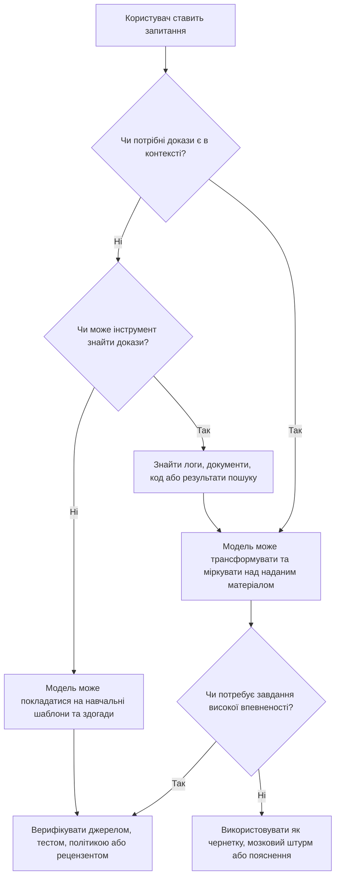
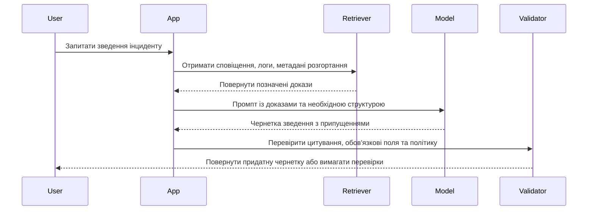
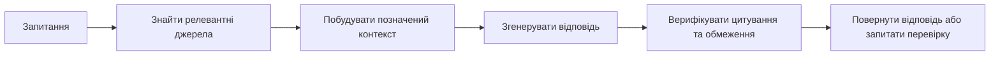

> **Складність**: `[ШВИДКИЙ]`
>
> **Час на виконання**: 40-55 хв
>
> **Передумови**: Модуль 1.1 або еквівалентний рівень володіння базовою термінологією ШІ

---

## Що ви зможете зробити

- Оцінювати, чи потребує завдання для мовної моделі генерації, пошуку, верифікації, людського судження або поєднання цих можливостей.
- Аналізувати, як токени, контекстні вікна та передбачення наступного токена формують якість і режими відмов відповіді ВММ.
- Порівнювати ВММ із пошуковими системами, базами даних, рушіями правил і рецензентами-людьми під час вибору інструменту для реального робочого процесу.
- Проєктувати межу промпту, яка надає ВММ достатньо контексту, обмежує вихід і робить невизначеність видимою замість прихованої.
- Налагоджувати погану відповідь ВММ, перевіряючи відповідність завдання, відсутній контекст, неоднозначні інструкції, непідтверджені твердження та прогалини верифікації.

## Чому цей модуль важливий

Платформного інженера на ім'я Ліна просять пришвидшити написання звітів про інциденти, використовуючи ВММ у робочому процесі команди. Перша чернетка виглядає чудово: вона спокійна, структурована та сповнена впевнених пояснень, чому розгортання зазнало невдачі. Потім керівник чергування помічає серйозну проблему. Модель згадала тайм-аут бази даних, якого ніколи не було, пропустила фактичну помилку завантаження образу та вигадала крок виправлення, який зробив би наступне розгортання повільнішим.

Ніхто в команді Ліни не був недбалим у очевидний спосіб. Вони зробили тоншу помилку: поставилися до вільного мовлення так, ніби це обґрунтований аналіз. Модель була корисною, але команда не вирішила, які частини завдання потребують підсумовування, які — пошуку логів, а які — людської верифікації. Невдача полягала не просто в «поганому промпті»; це була погана ментальна модель того, що система робить.

Цей модуль дає вам цю ментальну модель. Ви дізнаєтеся, чому великі мовні моделі достатньо потужні, щоб створювати чернетки, пояснювати, трансформувати та допомагати з технічною роботою, але водночас залишаються ненадійними, коли завдання вимагає актуальних фактів, точних доказів або відповідального судження. Мета — не цинізм. Мета — дисципліноване використання: знати, у чому модель може допомогти, чого вона не може гарантувати та як сформувати робочий процес так, щоб корисні частини були враховані, а вільні помилки не уникали перевірки.

## Почніть із найпростішого чесного опису

ВММ — це модель, навчена на великих обсягах тексту передбачати ймовірний наступний токен на основі токенів, уже наявних у її контексті. Цей опис навмисно простий, оскільки він залишає основний механізм видимим. Модель не відкриває словник, не звертається до приватної бази даних і не вирішує, що є морально істинним у людському розумінні. Вона генерує наступний фрагмент тексту на основі вивченої статистичної структури та доступної на цей момент інформації.

Цей простий механізм усе ж може породжувати напрочуд здатну поведінку, оскільки мова несе в собі величезний обсяг структури. Речення може кодувати команду, політику, звіт про помилку, начерк доведення, план розгортання, жарт або попередження. Коли модель вивчає закономірності на величезних текстових колекціях, вона засвоює багато зв'язків між словами, форматами, концепціями, стилями та завданнями. У корисному масштабі передбачення наступного токена стає гнучким інтерфейсом для створення чернеток, переписування, підсумовування, перекладу, класифікації та пояснення.

Речення, яке варто тримати в голові, таке: передбачення — це не те саме, що розуміння. Це не означає, що передбачення марне, і не означає, що модель прикидається в кожному звичайному сенсі. Це означає, що не слід ставитися до вражаючої відповіді як до доказу того, що модель має обґрунтоване знання, стабільний намір або внутрішнє зобов'язання бути правдивою. Вихід — це мова, яка відповідає контексту, а відповідність контексту пов'язана з істиною лише тоді, коли контекст і завдання роблять істину доступною.

Початківець часто запитує: «Чи розуміє модель?» Більш корисне практичне питання: «Які докази мала модель, яку трансформацію я попросив її виконати та де правдоподібна мова може розійтися з верифікованою реальністю?» Цей зсув перетворює абстрактну дискусію на рішення щодо робочого процесу. Ви припиняєте сперечатися з моделлю так, ніби вона людина, і починаєте проєктувати взаємодію як систему з входами, трансформаціями, обмеженнями та перевірками.

```ascii
+----------------------+        +------------------------+        +-----------------------+
| Завдання користувача |        | Генерація ВММ          |        | Перевірка користувачем |
| "Поясни це сповіщення"| -----> | ймовірні наступні      | -----> | або системою           |
| промпт + контекст    |        | токени                 |        | докази та відповідність|
|                      |        | вільний структурований |        | верифікувати перед дією|
|                      |        | текст                  |        |                        |
+----------------------+        +------------------------+        +-----------------------+
```

Ця перша діаграма навмисно мала, оскільки вона показує мінімальний корисний цикл. Модель отримує завдання та контекст, генерує мову, а потім щось поза моделлю має вирішити, чи результат достатньо хороший для роботи. У іграшковому чаті цією зовнішньою перевіркою може бути ваше власне судження. У production-робочому процесі це може бути пошук, тести, валідація політик, рецензування колегами або шлюз затвердження.

Ментальна модель старшого рівня не зводить систему ані до магії, ані до дрібниці. Називати ВММ «розумом» — означає давати їй забагато довіри та провокувати невиправдану довіру. Називати її «просто автодоповненням» — означає давати їй замало довіри та приховувати, чому вона може бути цінною в реальній роботі. Краще формулювання: ВММ — це потужний механізм доповнення шаблонів, який використовує мову як свою поверхню керування, а контекст — як свій робочий матеріал.

Це формулювання має наслідки. Якщо шаблон добре представлений, контекст релевантний, а запитаний вихід може допускати варіативність, модель може працювати надзвичайно добре. Якщо завдання залежить від відсутніх доказів, точної актуальності, приватних даних або жорстких гарантій, модель усе ще може звучати добре, будучи неправильною. Той самий механізм пояснює як підвищення продуктивності, так і ризик.

### Активне навчання: класифікуйте завдання, перш ніж довіряти відповіді

Уявіть, що колега запитує ВММ: «Що змінилося в нашому production-кластері вчора?» Перш ніж читати будь-яку згенеровану відповідь, вирішіть, що моделі знадобилося б у контексті, щоб відповісти відповідально. Чи було б достатньо навчальних даних, чи було б достатньо результату пошуку, чи модель потребувала б прямого доступу до логів, історії Git, записів розгортання та часових міток?

Сильна відповідь має сказати, що модель не може знати вчорашні зміни кластера лише з навчання. Їй потрібні знайдені операційні докази, і остаточна відповідь має цитувати або підсумовувати ці докази, а не просто звучати правдоподібно. Якщо вашим першим інстинктом було «запитати модель і подивитися», зверніть увагу на прихований ризик: відшліфована відповідь може здаватися розслідуванням, навіть коли жодного розслідування не відбулося.

### Від опису для початківців до меж практика

На рівні початківця «ВММ передбачають токени» пояснює, чому вони генерують вільний текст. На середньому рівні це пояснює, чому форма промпту, приклади та розміщення контексту впливають на результати. На старшому рівні це пояснює, чому управління має розглядати вихід моделі як неперевірену трансформацію, доки навколишня система не надасть докази та валідацію. Та сама концепція зростає разом із вами; це не гасло для запам'ятовування та відкидання.

Ось чому решта модуля зосереджена на токенах, контекстних вікнах, передбаченні та відповідності завдання. Це не ізольовані словникові терміни. Разом вони пояснюють, що модель бачить, скільки вона може використовувати, як вона створює вихід, чому вона може допомагати та де вона зазнає невдачі. Коли ви зможете простежити цей шлях, поведінка ВММ стане менш загадковою та значно легшою для налагодження.

## Токени: робочі одиниці моделі

Люди зазвичай думають словами, реченнями та абзацами. ВММ працюють із токенами, які є фрагментами тексту, перетвореними на числові ідентифікатори перед тим, як модель їх обробляє. Токен може бути цілим словом, частиною слова, знаком пунктуації, пробілом або маркером форматування. Точний поділ залежить від токенізатора, який використовується сімейством моделей, тому дві системи можуть по-різному підраховувати той самий текст.

Це важливо, оскільки контекстні вікна, ціноутворення, затримка та обрізання зазвичай вимірюються в токенах, а не в сторінках чи символах. Короткий на вигляд промпт із щільним кодом, таблицями, шляхами або незвичними назвами може споживати більше токенів, ніж очікувалося. Довгий на вигляд абзац із поширеними словами може бути дешевшим, ніж здається. Токенізація — це не просто деталь реалізації; вона змінює те, що вміщується в робочий простір моделі.

```ascii
+-------------------------------+
| Людський текст                |
| "Restart pod api-7f9c safely" |
+---------------+---------------+
                |
                v
+------------------------------------------------+
| Токенізація                                    |
| "Restart" | " pod" | " api" | "-" | "7" | ... |
+---------------+--------------------------------+
                |
                v
+------------------------------------------------+
| Числові ідентифікатори токенів                |
| 18422 | 8457 | 5931 | 12 | 22 | ...           |
+---------------+--------------------------------+
                |
                v
+------------------------------------------------+
| Обчислення моделі                              |
| закономірності над ідентифікаторами токенів    |
| у поточному контексті                          |
+------------------------------------------------+
```

Важливий урок — не точні межі токенів на діаграмі. Урок полягає в тому, що модель не починає з людських концепцій у чистій символьній формі. Вона починає з ідентифікаторів токенів, і вивчені параметри моделі формують те, як ці ідентифікатори впливають один на одного. Сенс виникає через закономірності в моделі, а не через окремий словниковий пошук, який гарантує коректність.

Ви можете дослідити приблизний ефект токенізації за допомогою маленького локального скрипту. Це не справжній production-токенізатор, оскільки справжні токенізатори використовують специфічні для моделі словники та правила злиття. Він усе ще корисний, оскільки показує, чому пунктуація, шляхи, регістр та ідентифікатори можуть розбивати текст на більше фрагментів, ніж очікує людина.

```python
import re

samples = [
    "Restart pod api-7f9c safely.",
    "Restart the application pod safely.",
    "kubectl rollout status deployment/api --timeout=90s",
]

pattern = re.compile(r"[A-Za-z]+|[0-9]+|[^A-Za-z0-9\s]")

for sample in samples:
    pieces = pattern.findall(sample)
    print(sample)
    print(pieces)
    print(f"approx_piece_count={len(pieces)}")
    print()
```

Щоб запустити цей приклад із кореня репозиторію, збережіть його як тимчасовий файл або вставте в Python heredoc. Використовуйте віртуальне середовище проєкту, коли запускаєте Python у цьому репозиторії, оскільки правила проєкту вимагають явного використання `.venv/bin/python` замість системного інтерпретатора.

```bash
.venv/bin/python - <<'PY'
import re

samples = [
    "Restart pod api-7f9c safely.",
    "Restart the application pod safely.",
    "kubectl rollout status deployment/api --timeout=90s",
]

pattern = re.compile(r"[A-Za-z]+|[0-9]+|[^A-Za-z0-9\s]")

for sample in samples:
    pieces = pattern.findall(sample)
    print(sample)
    print(pieces)
    print(f"approx_piece_count={len(pieces)}")
    print()
PY
```

Вивід покаже, що технічні ідентифікатори розбиваються на кілька частин. Це одна з причин, чому код, логи, трасування стеку та вивід команд можуть швидко споживати контекст. Це також одна з причин, чому моделі іноді мають труднощі з точними рядками, рідкісними ідентифікаторами та малими відмінностями, які люди можуть помітити візуально. Модель може працювати з технічним текстом, але не слід припускати, що вона бачить кожну межу так само, як ви.

Токени також пояснюють, чому моделі можуть бути чутливими до форматування. Таблиця Markdown, об'єкт JSON і абзац можуть нести ту саму людську інформацію, створюючи різні послідовності токенів. Модель може вважати одну форму легшою для точного продовження, ніж іншу, оскільки навчальні дані містили багато прикладів у цьому форматі. Формат — це не прикраса; це частина вхідного сигналу.

| Форма тексту | Тиск токенізації | Практичний ефект |
|---|---|---|
| Звичайна проза з поширеними словами | Зазвичай ефективна та багата на шаблони | Добре для пояснення, переписування та підсумовування |
| Логи з ідентифікаторами та часовими мітками | Часто фрагментовані та щільні | Потребує ретельної фільтрації перед надсиланням моделі |
| Вихідний код і трасування стеку | Структуровані, але важкі за токенами | Найкраще працює, коли обмежено релевантними файлами або кадрами |
| Таблиці та JSON | Сильний сигнал формату, але може бути багатослівним | Корисно, коли потрібен структурований вихід або порівняння |
| Довгі політичні документи | Можуть перевищувати корисну увагу, попри вміщення | Потребує розбиття, пошуку або цільових запитань |

З таблиці випливає корисне правило проєктування: не кладіть кожен доступний байт у промпт лише тому, що контекстне вікно велике. Кладіть інформацію, яка змінює відповідь. Якщо модель має пояснити одне невдале розгортання, включіть релевантну подію, маніфест, статус розгортання та нещодавню зміну. Не включайте цілий місяць непов'язаних логів і не очікуйте, що розмір сам по собі стане судженням.

### Активне навчання: передбачте проблему бюджету токенів

Ви допомагаєте колезі попросити ВММ підсумувати невдалу CI-збірку. Вони планують вставити повний лог, включаючи встановлення залежностей, індикатори прогресу, непов'язані попередження та остаточну помилку. Перш ніж покращувати промпт, передбачте два способи, якими зайвий текст може погіршити відповідь, навіть якщо він усе ще вміщується в контекстне вікно.

Одна відповідь: нерелевантні токени можуть відволікти модель від фактичного сигналу невдачі, особливо коли повторювані попередження виглядають важливими, але не є причинними. Інша відповідь: модель може підсумувати найбільший або найчастіший шаблон, а не вирішальний. Місткість контексту — це не те саме, що якість контексту, тому досвідчені користувачі відбирають докази перед тим, як просити аналіз.

### Токенізація в реальних робочих процесах

У робочому процесі документування токенізація впливає на те, скільки вихідного матеріалу можна переглянути за один раз. У робочому процесі інцидентів вона впливає на те, чи вміщуються релевантні рядки логів поруч із запитанням і метаданими сервісу. У робочому процесі кодування вона впливає на те, чи бачить модель функцію, викликач, тести та помилку разом. Що краще ви розумієте це обмеження, то менш імовірно, що ви звинувачуватимете модель у проблемі проєктування контексту.

Існує також вимір вартості та затримки. Більше токенів зазвичай означає більше обчислень, більше очікування та більше простору для нерелевантного матеріалу, що формує відповідь. Модель із дуже великим контекстним вікном може бути вартісною для складного аналізу, але професійний крок — це все одно зменшення шуму. Контекстна інженерія — це не про напихання. Це про збереження причинної інформації, необхідної для завдання.

Токени — це перший шар. Вони пояснюють, що модель споживає. Наступний шар — контекст, який пояснює, на що модель може спиратися під час конкретної взаємодії. Модель могла вивчити загальну мову Kubernetes під час навчання, але якщо ваше запитання залежить від вашого кластера, вашого репозиторію або сьогоднішньої помилки, необхідна інформація має бути доступною в контексті або через інструменти.

## Контекстні вікна: що модель може використовувати просто зараз

Контекст — це інформація, доступна моделі під час конкретної відповіді. Він може включати ваш поточний промпт, попередні повідомлення, системні інструкції, інструкції розробника, прикріплені файли, знайдені фрагменти, результати інструментів і будь-яку приховану допоміжну інфраструктуру, надану застосунком. Якщо інформація не в контексті та не доступна через інструмент, модель не може надійно використовувати її для цієї відповіді.

Контекстне вікно — це максимальна кількість токенізованого входу та виходу, яку модель може врахувати в одній взаємодії. Більше вікно дозволяє моделі враховувати більше матеріалу, але не гарантує, що кожна деталь використовується однаково добре. Довгі контексти можуть створювати проблеми, подібні до пошуку, всередині самого промпту. Важливі деталі можуть бути присутніми, але їх легко пропустити, особливо якщо промпт шумний, повторюваний або погано організований.

```ascii
+--------------------------------------------------------------------------------+
| Контекстне вікно                                                               |
|                                                                                |
|  Системні інструкції та інструкції розробника                                  |
|  +----------------------------------------------------------------------------+|
|  Запит користувача                                                            ||
|  +----------------------------------------------------------------------------+|
|  Попередня розмова                                                             ||
|  +----------------------------------------------------------------------------+|
|  Знайдені фрагменти документів                                                 ||
|  +----------------------------------------------------------------------------+|
|  Вивід інструментів, логи, фрагменти коду, таблиці                             ||
|  +----------------------------------------------------------------------------+|
|  Простір, необхідний для відповіді моделі                                      ||
|                                                                                |
+--------------------------------------------------------------------------------+
```

Ця схема показує поширену пастку для початківців: сама відповідь споживає частину доступного бюджету. Якщо ви заповните вікно вхідним матеріалом і попросите довгу відповідь, щось має поступитися. Залежно від застосунку, старіші повідомлення можуть бути підсумовані, файли — обрізані, знайдені фрагменти — пропущені, або модель може мати менше простору для створення запитаного виходу. Вікно — це бюджет, а не нескінченний стіл.

Контекст також пояснює, чому та сама модель може здаватися блискучою в один момент і слабкою в інший. Якщо один промпт включає невдалий маніфест, релевантну подію та точну помилку, модель може видати корисний діагноз. Якщо інший промпт говорить лише «мій под зламався», модель повинна вгадувати з поширених шаблонів. Модель не обов'язково стала гіршою; змінилися докази.



Блок-схема — це звичка, яку ви хочете сформувати. Перш ніж довіряти виходу, запитайте, чи були присутні необхідні докази. Якщо вони були відсутні, запитайте, чи надав їх інструмент. Якщо жоден інструмент їх не надав, ставтеся до відповіді як до гіпотези або чернетки, а не як до верифікованої відповіді. Ця перевірка проста, але вона запобігає багатьом реальним невдачам.

Контекстні вікна особливо важливі в платформній роботі та роботі з Kubernetes, оскільки значущі докази часто розподілені. Першопричина невдачі розгортання може вимагати маніфесту розгортання, нового тегу образу, подій на ReplicaSet, логів контейнера та нещодавнього коміту Git. Будь-який окремий артефакт може бути неоднозначним. ВММ може допомогти їх пов'язати, але лише якщо релевантні частини присутні та позначені.

Корисний контекстний пакет має чотири властивості: він релевантний, позначений, обмежений і цілеспрямований. Релевантний означає, що матеріал може вплинути на відповідь. Позначений означає, що модель може визначити, що представляє кожен фрагмент. Обмежений означає, що ви прибрали старий шум і непов'язаний матеріал. Цілеспрямований означає, що промпт говорить, яке рішення або артефакт має підтримувати відповідь.

```ascii
+------------------------+     +-------------------------+     +-------------------------+
| Поганий контекстний    |     | Кращий контекстний      |     | Чому це покращує вихід  |
| пакет                  |     | пакет                   |     |                         |
+------------------------+     +-------------------------+     +-------------------------+
| "Ось усе"              |     | "Ось невдала подія      |     | Модель може пов'язати   |
| повні логи та історія  | --> | пода, остання зміна та  | --> | причину, докази та      |
| чату без позначень     |     | очікувана поведінка"    |     | запитане судження       |
+------------------------+     +-------------------------+     +-------------------------+
```

Позначення важливіші, ніж очікують початківці. Якщо ви вставите маніфест, лог і бажану політику в один великий блок, модель повинна визначити, що є чим. Якщо ви позначите їх як `поточний маніфест`, `вивід подій`, `очікувана поведінка` та `командне обмеження`, ви зменшуєте неоднозначність. Ви не робите модель розумнішою; ви робите завдання краще специфікованим.

### Практичний приклад контексту: налагодження тонкого промпту

Припустімо, учень запитує: «Чому моє розгортання зазнає невдачі?» і єдиний контекст — це речення. Модель може згадати помилки завантаження образу, цикли перезапуску, readiness-проби, обмеження ресурсів або погані селектори, оскільки це поширені шаблони невдач Kubernetes. Деякі з цих здогадів можуть бути корисними як контрольний список, але жоден не є обґрунтованим діагнозом.

Кращий промпт надає докази та просить обмежений аналіз. Він відокремлює те, що сталося, від того, чого хоче користувач. Він також просить модель позначати невизначеність, щоб відсутні докази залишалися видимими.

```text
Ми налагоджуємо Kubernetes Deployment у тестовому кластері.

Поточний симптом:
- розгортання не завершується протягом очікуваного часу

Докази:
- `kubectl rollout status deployment/api` повідомляє про тайм-аут
- остання подія пода говорить `Back-off restarting failed container`
- лог контейнера закінчується на `KeyError: DATABASE_URL`
- останній коміт перейменував `DATABASE_URL` на `APP_DATABASE_URL` у коді застосунку
- маніфест розгортання все ще встановлює лише `DATABASE_URL`

Завдання:
Проаналізуйте ймовірну причину, назвіть докази для неї та запропонуйте найменше безпечне виправлення.
Якщо перед дією потрібна ще одна перевірка, скажіть точно, що перевірити.
```

Цей промпт кращий, оскільки він дає моделі причинний ланцюг для дослідження. Відповідь може пов'язати помилку в лозі, перейменування в застосунку та невідповідність маніфесту. Вона також може запропонувати невелике виправлення, наприклад, оновлення контракту змінної середовища або зробити застосунок таким, що приймає обидві назви під час міграції. Покращення якості прийшло від доказів, а не від прохання до моделі бути розумною.

Тепер зверніть увагу на межу. Модель усе ще не повинна безпосередньо змінювати production без людської або автоматизованої перевірки. Вона може допомогти визначити ймовірну причину, створити чернетку патчу та запропонувати команди верифікації. Навколишній робочий процес усе ще повинен запускати тести, перевіряти маніфест і верифікувати розгортання. Це різниця між допомогою та повноваженнями.

### Активне навчання: знайдіть відсутні докази

Ваша команда запитує ВММ: «Чи варто нам відкотити новий реліз API?» Промпт включає назву розгортання та розпливчасту примітку, що користувачі скаржаться. Перелічіть мінімальні докази, які ви хотіли б мати, перш ніж прийняти будь-яку рекомендацію. Потім вирішіть, чи повинна модель відповісти рішенням, контрольним списком або запитом додаткового контексту.

Сильна відповідь запитує рівень помилок, затримку, деталі нещодавніх змін, статус розгортання, логи або трейси, радіус ураження, ризик відкату та політику відкату команди. Без цих вхідних даних модель не повинна видавати впевнене рішення «так/ні». Вона повинна створити контрольний список або запитати відсутні докази, оскільки рішення є операційно значущим і залежним від контексту.

### Контекст — це не пам'ять у людському розумінні

Багато застосунків надають історію розмови, але це не те саме, що людська пам'ять. Старіші деталі можуть бути підсумовані, обрізані або замінені новішими інструкціями. Навіть коли деталі залишаються в контексті, модель може не зважувати їх так, як це зробив би колега-людина. Якщо деталь є критичною, повторіть її ближче до завдання та чітко позначте.

Ось чому промпти з високими ставками часто повторюють обмеження. «Використовуйте лише наданий фрагмент логу.» «Не припускайте доступу до production.» «Позначайте непідтверджені твердження.» «Повертайте команди окремо від пояснення.» Повторення не завжди є марнотратним; воно може бути корисним, коли утримує критичні для завдання межі близько до точки генерації.

Досвідчені практики проєктують контекст навмисно. Вони не вставляють усе, і вони не морять модель голодом. Вони будують пакети, які містять докази, необхідні для запитаної трансформації, плюс достатньо обмежень, щоб запобігти дрейфу виходу в непідтримувані поради. Ця дисципліна стає ще важливішою, коли інструменти та пошук входять у робочий процес.

## Передбачення наступного токена: як генерується вихід

Коли текст токенізовано та розміщено в контексті, модель повторювано передбачає наступний токен. Після вибору токена система додає його до зростаючої відповіді та передбачає знову. Цей цикл продовжується, доки відповідь не завершена, не досягнуто умови зупинки або не вичерпано бюджет виходу. Процес є послідовним, навіть коли базові обчислення високо оптимізовані.

```ascii
+----------------------------+
| Контекст на цей момент     |
| "Под зазнає невдачі, тому  |
|  що контейнер не може..."  |
+-------------+--------------+
              |
              v
+----------------------------+
| Передбачення оцінок        |
| наступного токена          |
| "знайти"   0.31            |
| "запустити" 0.24           |
| "завантажити" 0.18         |
| "прочитати" 0.08           |
+-------------+--------------+
              |
              v
+----------------------------+
| Вибір одного токена        |
| "знайти"                   |
+-------------+--------------+
              |
              v
+----------------------------+
| Додати та повторити        |
| "...не може знайти"        |
+----------------------------+
```

Ймовірності на діаграмі є ілюстративними, а не реальними оцінками з конкретної моделі. Вони показують форму процесу: модель створює розподіл над можливими продовженнями, а декодування вибирає з цього розподілу. Різні налаштування декодування можуть зробити вихід більш консервативним або більш варіативним. Сильно обмежене налаштування може бути кращим для структурованого видобування, тоді як більш варіативне — для мозкового штурму.

Цей механізм пояснює, чому ВММ можуть створювати зв'язні абзаци. Кожен токен вибирається у зв'язку з попереднім контекстом, включаючи вже створену відповідь. Якщо початок відповіді встановлює ретельну структуру усунення несправностей, пізніші токени схильні продовжувати цю структуру. Якщо початок припускає помилкове припущення, пізніші токени можуть розвивати цю помилку з такою самою вільністю.

Це також пояснює, чому галюцинація може бути такою переконливою. Основний механізм моделі не вимагає від неї розрізняти «підтверджено наданими доказами» та «поширене продовження в подібному тексті». Якщо промпт, інструменти або навчальна поведінка не підштовхують її до дисципліни доказів, правдоподібне продовження може заповнювати прогалини. Результат може читатися як впевнене пояснення, спираючись на непідтверджені припущення.

Слово «галюцинація» корисне, але іноді занадто широке. На практиці слід розрізняти кілька режимів відмови. Модель може вигадати джерело, перебільшити впевненість, змішати дві схожі концепції, застосувати правильний шаблон до неправильної ситуації, пропустити обмеження, заховане в промпті, або створити синтаксично правильну команду з небезпечною семантикою. Різні невдачі потребують різних засобів контролю.

| Режим відмови | Як це виглядає | Кращий контроль |
|---|---|---|
| Непідтверджений факт | Відповідь називає причину, відсутню в доказах | Вимагати цитування або позначення доказів |
| Надмірне узагальнення шаблону | Поширене рішення застосовано до неправильного середовища | Включати обмеження та просити припущення |
| Відповідність формату без істини | JSON валідний, але значення неправильні | Валідувати за схемою та вихідними даними |
| Втрачене обмеження | Відповідь порушує заявлену політику або межу | Розміщувати критичні обмеження близько до завдання та тестувати їх |
| Впевнена невизначеність | Модель приховує відсутні докази під відшліфованою прозою | Просити позначати невідоме та кроки верифікації |

Передбачення також пояснює, чому формулювання промпту може мати таке велике значення. Промпт — це не магічне заклинання, але він формує розподіл імовірних продовжень. Якщо ви просите «відповідь», модель може продовжити прямою відповіддю, навіть коли докази слабкі. Якщо ви просите «ймовірну причину, підтверджувальні докази, припущення та перевірки», ви полегшуєте генерацію більш дисциплінованої відповіді.

### Температура, варіативність і надійність

Більшість інструментів, орієнтованих на користувача, приховують багато деталей декодування, але принцип усе ще має значення. Деякі налаштування змушують модель вибирати безпечніші, більш імовірні продовження. Інші дозволяють більше різноманітності. Для творчого письма різноманітність може бути корисною. Для аналізу інцидентів, видобування політик або модифікації коду неконтрольована різноманітність зазвичай є проблемою. Правильне налаштування залежить від толерантності завдання до варіативності.

Навіть із консервативним декодуванням модель може помилятися. Найімовірніше продовження не обов'язково є істинним; воно лише ймовірне згідно з моделлю та контекстом. Якщо контекст говорить «сервіс повільний після міграції бази даних», поширене продовження може звинуватити індекси. Це може бути правильно, але це не верифіковано, доки ви не дослідите докази. Надійність походить від усього робочого процесу, а не лише від імовірності.

Ось чому використання ВММ на старшому рівні часто виглядає нудним. Промпт запитує припущення, докази, невідоме та верифікацію. Система шукає вихідний матеріал. Відповідь перевіряється тестами, валідаторами, рецензентами або даними моніторингу. Робочий процес не залежить від того, чи має модель приватне відчуття істини. Він дає моделі обмежену роль і верифікує результат.



Діаграма послідовності вводить ключову архітектурну ідею: ВММ часто є одним компонентом у більшій системі. Вона може бути мовним рушієм, але пошук надає докази, а валідація — запобіжники. Коли люди кажуть «ВММ ненадійні», вони можуть критикувати голу модель, використану як оракул. Коли люди кажуть «ВММ корисні», вони можуть описувати систему, яка поєднує генерацію з доказами та перевірками.

### Активне навчання: передбачте невдачу з механізму

Модель просять: «Підсумуйте прикріплений проєктний документ і визначте затверджену базу даних.» Прикріплений документ містить три варіанти, але лише одне речення ближче до кінця говорить, що рішення ще не ухвалене. Передбачте найімовірнішу невдачу, якщо моделі не сказано спеціально розрізняти пропозиції та рішення.

Імовірна невдача полягає в тому, що модель вибирає найпомітніший або найповніше описаний варіант і подає його як затверджений. Це відбувається тому, що довгі, зв'язні розділи створюють сильні шаблони продовження, тоді як коротке застереження може бути легко недооцінене. Виправлення полягає в тому, щоб попросити модель відокремити запропоновані, відхилені, затверджені та невідомі стани, а потім процитувати або послатися на докази для кожної класифікації.

### Чому «це звучало впевнено» — слабкий сигнал

Люди використовують тон як соціальний сигнал. Якщо хтось говорить обережно, наводить конкретику та звучить впевнено, ми природно ставимося до відповіді як до більш достовірної. ВММ можуть створювати ці сигнали, не маючи базових доказів. Спокійний тон може відображати навчальні шаблони для авторитетного письма, а не верифікований ланцюг міркувань.

Це не означає, що слід ігнорувати весь вихід ВММ. Це означає, що довіра має походити з перевірної підтримки. Для чернетки з низькими ставками «звучить добре» може бути достатньо, щоб продовжити редагування. Для команди, яка змінює інфраструктуру, цього недостатньо. Що вищі наслідки, то більше слід вимагати доказів, тестів або людської перевірки.

Той самий принцип застосовується до пояснень міркувань. Модель може створити ланцюг міркувань, який виглядає правдоподібним, але містить приховані помилки. У багатьох робочих процесах краще попросити стисле обґрунтування, підтверджувальні докази та кроки верифікації, ніж просити довгий внутрішній монолог. Ви хочете вихід, який можна перевірити, а не лише вихід, який здається продуманим.

## Чому ВММ здаються розумними та все одно зазнають невдач

ВММ здаються розумними, оскільки вони сильні в завданнях, сформованих мовою. Вони можуть зберігати тон, реорганізовувати безладні нотатки, пояснювати концепції на різних рівнях, генерувати приклади, конвертувати між форматами та створювати чернетки правдоподібних планів. Це цінні навички, оскільки значна частина людської роботи опосередкована мовою. Тікети, операційні інструкції, проєктні документи, коментарі, зведення, політики та навчальні матеріали — усе це мовні артефакти.

Помилка полягає в припущенні, що мовна вільність передбачає повний набір людських здатностей, які стоять за експертною роботою. Експерт не лише створює вільний текст. Експерт також знає, коли докази відсутні, розуміє обмеження предметної області, несе відповідальність, помічає ставки та може дослідити фізичну або операційну систему, про яку йдеться. ВММ може симулювати частини мови експерта, не володіючи цими навколишніми здатностями.

```ascii
+---------------------------+        +-----------------------------+
| Що показує вільний вихід  |        | Чого вільному виходу може   |
|                           |        | бракувати                   |
+---------------------------+        +-----------------------------+
| граматика та структура    |        | верифіковані докази         |
| знайома термінологія      |        | поточний стан системи       |
| правдоподібна причинна    |        | відповідальне судження       |
| історія                   |        |                             |
| корисне підсумовування    |        | усвідомлення наслідків      |
| адаптовний тон            |        | стабільна відданість істині  |
+---------------------------+        +-----------------------------+
```

Таблицеподібна діаграма підкреслює центральну невідповідність. Модель може бути корисною саме тому, що створює хороші мовні артефакти. Вона також може бути ризикованою саме тому, що ці артефакти нагадують експертну комунікацію. Навичка, яку ви формуєте, — це здатність відокремлювати якість виходу від якості істини.

Користувачі-початківці часто коливаються між надмірною довірою та відкиданням. Вони можуть довіритися впевненій неправильній відповіді, обпектися, а потім зробити висновок, що технологія марна. Досвідчені користувачі займають вужчу позицію. Вони запитують, яка частина завдання є мовною трансформацією, яка — пошуком доказів, яка — ухваленням рішень, а яка потребує верифікації. Ця декомпозиція виявляє багато корисних ролей, які не вимагають сліпої довіри.

Наприклад, ВММ може бути чудовою в перетворенні сирої хронології інциденту на першу чернетку. Вона може групувати події, прибирати повторюваний шум, покращувати формулювання та створювати структурований план постмортему. Вона не повинна вигадувати відсутні часові мітки, призначати провину без доказів або вирішувати, чи була серйозність інциденту правильною, якщо політику серйозності та докази не надано. Той самий робочий процес може бути продуктивним або небезпечним залежно від меж ролей.

### Корисні форми завдань

ВММ часто добре підходять, коли завдання має багато прийнятних виходів і якість мови важлива. Створення чернетки пояснення, переписування політики для ясності, підсумовування транскрипту зустрічі, генерування альтернативних назв, класифікація тікетів підтримки або перетворення нотаток на контрольний список — усе це може бути доречним. Гнучкість моделі цінна, оскільки не існує єдиної точної відповіді.

Вони також корисні, коли ви можете дешево перевірити вихід. Якщо модель переписує абзац, людина може його прочитати. Якщо вона пропонує команду оболонки, людина або тестове середовище можуть перевірити її перед виконанням. Якщо вона генерує модульні тести, тестовий рушій може валідувати поведінку. Доступність швидкого зворотного зв'язку змінює профіль ризику.

### Ризиковані форми завдань

ВММ ризиковані, коли завдання вимагає точного фактологічного обґрунтування, а докази відсутні. Вони ризиковані, коли помилка завдає шкоди до того, як хтось може її перевірити. Вони ризиковані, коли відповідь має бути актуальною, юридичною, медичною, фінансовою, чутливою до безпеки або такою, що змінює production. Вони ризиковані, коли система просить їх виступати одночасно генератором і верифікатором власних непідтверджених тверджень.

Це не моральне судження про моделі. Це інженерія. Компоненту не слід призначати обов'язки, які він не може надійно виконувати. Ви не використовували б кеш як джерело істини для фінансових розрахунків, навіть якщо він зазвичай містить правильне значення. Так само не слід використовувати генеративну модель як єдине джерело істини для операційних рішень.

| Завдання | Відповідність ВММ | Обґрунтування |
|---|---|---|
| Переписати розділ операційної інструкції для ясності | Сильна | Людина може швидко перевірити зміст і стиль |
| Підсумувати логи після відбору релевантних рядків | Помірна до сильної | Докази надано, але висновки потребують перевірки |
| Визначити сьогоднішню production-зміну без доступу до інструментів | Слабка | Модель не має актуальних операційних доказів |
| Згенерувати контрольний список міграції з проєктного документа | Помірна | Корисно, якщо список посилається на розділи джерела та перевіряється |
| Затвердити відкат під час збою | Слабка як остаточна інстанція | Рішення потребує живих метрик, політики та відповідального володіння |
| Провести мозковий штурм крайових випадків для тестового плану | Сильна | Різноманітність корисна, а виходи можна фільтрувати |

Зрілий робочий процес часто поєднує ВММ з інструментами, які компенсують її слабкості. Пошук приносить актуальні або приватні докази. Валідатори перевіряють формати та політики. Тести перевіряють поведінку. Люди-рецензенти перевіряють судження, ставки та організаційний контекст. Сильною стороною моделі залишається мова та синтез шаблонів, але система навколо неї забезпечує обґрунтування та контроль.

### Активне навчання: оберіть правильну роль

Ваша команда хоче використовувати ВММ для запитів на винятки безпеки. Вона читатиме запит, підсумовуватиме ризик, пропонуватиме відсутню інформацію та рекомендуватиме затвердити або відхилити. Вирішіть, які з цих дій безпечні як вихід моделі, які потребують пошуку доказів, а які потребують людських повноважень.

Сильний дизайн дозволяє моделі підсумовувати запит, визначати відсутні поля, зіставляти запит із мовою політики та створювати чернетку рекомендації з доказами. Вона не повинна мовчки затверджувати винятки самостійно. Затвердження вимагає володіння політикою, прийняття ризику та відповідальності. Модель може підготувати рішення; вона не повинна ставати особою, яка ухвалює рішення, якщо організація не має ретельно керованої політики автоматизації.

### Драбина надійності

Думайте про використання ВММ як про драбину зростаючої відповідальності. На нижній сходинці модель створює чернетку мови, яку людина редагує. Посередині вона трансформує надані докази в структуровані артефакти, які перевіряють валідатори та рецензенти. Ближче до верху вона викликає інструменти або пропонує дії під суворими обмеженнями. На вершині вона діє автономно, що вимагає найсильнішого контролю і рідко є доречним для початківців.

Підйом драбиною вимагає більше, ніж кращого промпту. Це вимагає спостережуваності, дозволів, планів відкату, перевірок політик, тестів, аудиторських логів і чіткого володіння. Модель може бути видимою частиною продукту, але навколишня система визначає, чи є вона достатньо безпечною для призначеної відповідальності. Ось чому розуміння ВММ важливе для платформної інженерії, а не лише для особистої продуктивності.

## ВММ — це не пошукові системи, не бази даних і не люди

Пошукова система знаходить документи або індексовану інформацію, що відповідають запиту. База даних зберігає структуровані записи та повертає значення відповідно до мови запитів або API. Рушій правил застосовує явні умови до вхідних даних. Людина приносить живий досвід, відповідальність, судження та соціальний контекст. ВММ може імітувати мову, пов'язану з усіма цими системами, але імітація — це не те саме, що володіння їхніми гарантіями.

Плутанина зрозуміла, оскільки багато застосунків змішують ці можливості. Чат-інтерфейс може шукати вебсторінки, викликати інструменти, читати файли, а потім використовувати ВММ для синтезу результату. З погляду користувача це відчувається так, ніби «модель шукала». Архітектурно пошук і генерація — це різні кроки. Якщо ви не можете визначити, чи відбувся пошук, ви не можете визначити, чи відповідь обґрунтована.

```ascii
+----------------+-------------------------+-----------------------------+
| Тип системи    | Основна сильна сторона  | Головне питання довіри     |
+----------------+-------------------------+-----------------------------+
| Пошукова       | знаходження наявних     | Чи релевантні джерела?     |
| система        | документів              |                             |
| База даних     | повернення збережених   | Чи правильний запит?       |
|                | значень                 |                             |
| Рушій правил   | застосування явної      | Чи повні правила?          |
|                | логіки                  |                             |
| ВММ            | генерування мови        | Чи обґрунтований вихід?    |
| Людина-експерт | судження та володіння   | Чи поінформований експерт? |
+----------------+-------------------------+-----------------------------+
```

Це порівняння не робить один інструмент кращим за інші. Воно допомагає правильно призначати роботу. Якщо завдання — «знайти поточну політику», використовуйте пошук. Якщо завдання — «повернути всі невдалі завдання з цієї таблиці», використовуйте запит до бази даних. Якщо завдання — «застосувати це правило прийнятності», використовуйте детерміновану логіку. Якщо завдання — «пояснити різницю в політиці новому інженеру», ВММ може допомогти після того, як політику знайдено.

Фраза «ВММ — це не пошукові системи» найважливіша, коли факти є актуальними або чутливими до джерела. Навчальні дані мають дату відсікання, можуть містити помилки та можуть не включати приватну організаційну інформацію. Навіть якщо модель бачила щось подібне, вона може не знати останньої версії. Запит актуальних фактів без пошуку провокує правдоподібні, але застарілі відповіді.

Фраза «ВММ — це не бази даних» найважливіша, коли точність має значення. Модель може вивести запис, ідентифікатор, команду або шлях, що виглядають валідними, але не є реальними. Якщо вам потрібен точний інвентар, запитайте систему інвентаризації. Якщо вам потрібне зведення тенденцій інвентарю, модель може допомогти після того, як точні дані знайдено.

Фраза «ВММ — це не люди» найважливіша, коли тон викликає довіру. Модель може вибачатися, звучати обережно, виражати впевненість або імітувати скромність. Це мовні шаблони. Вони не створюють ставок, відповідальності чи живого досвіду. Ставтеся до тону як до поведінки інтерфейсу, а не як до доказу внутрішнього судження.

### Генерація, пошук і поєднання обох

Багато хороших робочих процесів із ВММ поєднують пошук і генерацію. Пошук приносить релевантний вихідний матеріал у контекст. Генерація трансформує цей матеріал у корисну відповідь. Цей шаблон часто називають генерацією, доповненою пошуком (RAG), хоча точна архітектура варіюється. Ключова ідея проста: не просіть модель вигадувати докази, які вона має використовувати.



Пошуково-доповнена система все ще може зазнати невдачі. Вона може знайти неправильне джерело, пропустити важливе джерело, передати забагато шуму або згенерувати відповідь, яка виходить за межі знайдених доказів. Ось чому верифікація залишається частиною потоку. Пошук покращує обґрунтування, але не усуває потреби в дисципліні проєктування.

Хороший промпт у пошуковому робочому процесі говорить моделі, як використовувати докази. Наприклад, «Відповідайте лише з наданих джерел», «Якщо джерела суперечать одне одному, опишіть суперечність» і «Якщо відповідь відсутня, скажіть, що вона відсутня». Ці інструкції спрямовують вихід до обґрунтованого синтезу. Вони також полегшують виявлення непідтверджених тверджень.

### Практичний приклад: пошук проти ВММ проти поєднання

Сценарій: ваша команда хоче знати, чи доступне конкретне поле API Kubernetes у версії, яку використовує ваш кластер. Слабкий підхід — запитати голу ВММ: «Чи можу я використовувати це поле?» Модель може відповісти на основі застарілих навчальних шаблонів або переплутати версії. Кращий підхід — знайти офіційну документацію для вашої цільової версії, а потім попросити модель підсумувати сумісність і виділити ризики міграції.

Найкращий вибір інструменту залежить від фактичного завдання. Якщо вам потрібне лише точне визначення поля, використовуйте документацію або API-довідник безпосередньо. Якщо вам потрібно пояснити вплив командам застосунків, знайдіть джерело та використайте модель для створення чернетки чіткого пояснення. Якщо вам потрібно змінити маніфести, поєднайте перевірку джерела, допомогу моделі, тести та валідацію кластера.

```text
Завдання:
Пояснити, чи може наша команда використовувати поле X у Kubernetes версії Y.

Необхідні докази:
- офіційна документація для версії Y
- поточна версія кластера
- наявні маніфести, які б змінилися

Роль ВММ:
- підсумувати докази з джерела
- визначити ризики сумісності
- створити чернетку пояснення для команд застосунків

Перевірки поза ВММ:
- верифікувати офіційне джерело вручну
- запустити валідацію схеми або серверний тестовий запуск
- перевірити остаточну зміну перед розгортанням
```

Цей практичний приклад показує, як утримувати модель у корисній смузі. Вона може зменшити зусилля з читання, пов'язати наслідки та покращити комунікацію. Вона не замінює джерело істини. Ви все ще верифікуєте поле за офіційною документацією та поведінкою кластера, оскільки точна сумісність — це не місце для непідтвердженої вільності.

### Активне навчання: діагностуйте невідповідність інструменту

Продакт-менеджер запитує ВММ: «Скільки клієнтів використовували функцію А минулого тижня?» Модель відповідає відшліфованою оцінкою та трьома причинами зростання показника. Визначте невідповідність інструменту та перепроєктуйте робочий процес так, щоб відповіді можна було довіряти.

Невідповідність полягає в тому, що завдання потребує аналітичних даних, а не лише мовної генерації. Надійний робочий процес запитує аналітичне сховище для точного показника, знаходить релевантне часове вікно та визначення функції, а потім просить модель підсумувати результат із застереженнями. Модель може пояснити показник; вона не повинна його фабрикувати.

### Практика старшого рівня: робіть межі довіри явними

Межа довіри — це лінія між тим, що модель може генерувати, і тим, що має бути доведено деінде. В особистому навчальному чаті межа може бути неформальною. У платформному робочому процесі вона має бути записаною. Наприклад, «Модель може створювати чернетки оновлень операційних інструкцій, але не може їх зливати» або «Модель може пропонувати команди, але вони мають виконуватися вручну в тестовому середовищі спочатку».

Явні межі запобігають випадковому розповзанню повноважень. Система, яка починає як підсумовувач, може стати рекомендатором, потім актором, потім неперевіреним актором, якщо ніхто не називає межу. Кожен крок може здаватися малим, особливо коли ранні виходи корисні. Старші інженери уповільнюють цей дрейф, призначаючи обов'язки свідомо та додаючи засоби контролю перед розширенням обсягу.

## Проєктування промптів, що відповідають моделі

Промпт — це не просто запитання. Це специфікація завдання, контекстний пакет, контракт виходу та контроль ризику. Початківці часто ставляться до промптів як до невимушеної розмови, оскільки чат-інтерфейси запрошують до такого стилю. Практики ставляться до промптів як до малих проєктів інтерфейсу. Вони визначають аудиторію, докази, обмеження, очікуваний вихід і поведінку щодо невизначеності.

Найпростіше покращення — замінити розпливчастий намір конкретною роботою. «Поясни Kubernetes» може породити майже що завгодно: історію, аналогію, глосарій, маркетингове резюме або глибокий архітектурний тур. «Поясни Kubernetes адміністратору Linux, який знає контейнери, але ніколи не використовував декларативні API» дає моделі значно вужчу ціль. Вужчі цілі зазвичай породжують корисніші продовження.

```text
Слабкий промпт:
Поясни мені Kubernetes.
```

```text
Кращий промпт:
Поясни Kubernetes початківцю, який уже знає Linux і Docker.

Використай:
- одну аналогію
- п'ять основних концепцій
- одне попередження про поширене непорозуміння

Якщо щось тут потребуватиме глибшого вивчення, познач це як просунуте.
```

Кращий промпт дає аудиторію, структуру, обмеження та контроль обсягу. Він не гарантує істину, але покращує відповідність завданню. Він також полегшує оцінювання результату, оскільки ви можете перевірити, чи включила відповідь запитані аналогію, концепції, попередження та позначки просунутого рівня. Промпт, який створює перевірний вихід, зазвичай безпечніший, ніж промпт, який просить необмежене есе.

Промптування — це не пошук секретних слів. Це роблення прихованих припущень видимими. Коли ви вказуєте аудиторію, ви запобігаєте вгадуванню рівня моделлю. Коли ви вказуєте формат, ви запобігаєте блуканню відповіді. Коли ви вказуєте джерела або докази, ви зменшуєте непідтверджені вигадки. Коли ви вказуєте поведінку щодо невизначеності, ви даєте моделі дозвіл сказати, що не можна зробити висновок.

Сильний промпт часто містить ці частини в тій чи іншій формі:

```text
Роль:
Ви допомагаєте створити першу чернетку для технічного рев'ю, а не ухвалюєте остаточне рішення.

Контекст:
[Надайте позначені докази, обмеження та релевантне тло.]

Завдання:
[Сформулюйте конкретну необхідну трансформацію або аналіз.]

Вихід:
[Визначте формат, довжину, розділи та обов'язкові поля.]

Невизначеність:
[Скажіть, як поводитися з відсутніми доказами, припущеннями та верифікацією.]

Межі:
[Скажіть, чого не робити, наприклад, вигадувати джерела або виконувати зміни.]
```

Вам не потрібна кожна частина для кожного повсякденного завдання. Для мозкового штурму з низькими ставками короткого промпту достатньо. Для операційної, безпекової, фінансової, медичної, юридичної роботи або роботи, що впливає на production, додаткова структура — це не бюрократія. Це те, як ви робите роль моделі аудитовною.

### Практичний приклад: покращення слабкого операційного промпту

Слабкий промпт:

```text
Напиши постмортем для збою.
```

Цей промпт небезпечний, оскільки він просить відшліфований артефакт без надання доказів або меж. Модель може вигадати хронологію, вгадати першопричину або призначити кроки виправлення з поширених шаблонів збоїв. Постмортем має навчити організацію, що сталося, а вигадана ясність гірша за видиму невизначеність.

Кращий промпт:

```text
Ви створюєте чернетку плану постмортему на основі наданих доказів.

Докази:
- інцидент почався о 09:10 UTC, коли рівень помилок API перевищив поріг сповіщення
- розгортання api-2026.04.26-3 почалося о 09:04 UTC
- відкат завершено о 09:31 UTC
- логи показують повторювані збої з'єднання з базою даних після розгортання
- жодне обслуговування бази даних не було заплановано під час інциденту
- першопричину не підтверджено

Завдання:
Створіть чернетку постмортему з розділами: вплив, хронологія, підозрювані фактори, невідоме та подальші перевірки.

Правила:
- Не вказуйте остаточну першопричину.
- Чітко позначайте припущення.
- Використовуйте лише наведені вище докази.
- Включіть питання, на які має відповісти розслідування інциденту далі.
```

Кращий промпт створює безпечніший артефакт, оскільки він називає роль моделі як створення чернетки, надає обмежені докази та забороняє передчасну визначеність. Він запитує невідоме та подальші перевірки, що є цінним на ранніх етапах розслідування інциденту. Він також полегшує виявлення хибної впевненості, оскільки будь-яке твердження про остаточну першопричину порушувало б промпт.

Тепер розв'яжіть подібну задачу самостійно. Припустімо, слабкий промпт: «Скажи мені, чи цей план Terraform безпечний.» Краща версія має включати фрагмент плану, середовище, заплановану зміну, радіус ураження, обмеження політики та запит відокремити спостережувані зміни від інтерпретацій ризику. Вона не повинна просити модель про остаточне затвердження, якщо організація не має керованого робочого процесу затвердження навколо цього.

### Активне навчання: перепишіть для дисципліни доказів

Перепишіть цей промпт у своїх нотатках: «Чи варто нам приймати цей pull request?» Ваша покращена версія має сказати моделі, які докази дослідити, які виміри оцінити, який формат виходу використовувати та які повноваження щодо рішення вона має або не має.

Сильний перепис може попросити рев'ю змінених файлів, тестів, безпекових наслідків, видимої для користувача поведінки та відсутніх доказів. Він має запитати висновки з посиланнями на файли, де це можливо, плюс окреме резюме. Він не повинен дозволяти моделі затверджувати зміну лише тоном. Промпт має зробити критерії рев'ю видимими та залишити остаточні повноваження щодо злиття поза моделлю, якщо політика не говорить інше.

### Налагодження поганих відповідей

Коли ВММ дає слабку відповідь, не пробуйте негайно випадкові варіанти промпту. Налагоджуйте взаємодію систематично. Запитайте, чи було завдання доречним, чи були присутні необхідні докази, чи приховав промпт важливі обмеження, чи заохочував формат виходу непідтверджену визначеність і чи була можливою верифікація. Це перетворює фрустрацію на повторюваний діагностичний процес.

```ascii
+---------------------------+
| З'являється погана        |
| відповідь                 |
+-------------+-------------+
              |
              v
+---------------------------+
| Перевірте відповідність   |
| завдання                  |
| генерація, пошук,         |
| рішення чи дія?           |
+-------------+-------------+
              |
              v
+---------------------------+
| Перевірте контекст        |
| докази присутні, позначені,|
| релевантні та обмежені?   |
+-------------+-------------+
              |
              v
+---------------------------+
| Перевірте контракт        |
| промпту                   |
| аудиторія, формат, межі,  |
| поведінка щодо            |
| невизначеності?           |
+-------------+-------------+
              |
              v
+---------------------------+
| Перевірте шлях верифікації|
| джерела, тести, рецензент,|
| політика чи результат     |
| інструменту?              |
+---------------------------+
```

Цей потік налагодження корисний, оскільки він не звинувачує модель розпливчасто. Якщо завдання потребувало живих даних, додайте пошук. Якщо докази були поховані в шумі, відберіть контекст. Якщо модель перебільшила, вимагайте припущення та позначення доказів. Якщо вихід виглядав добре, але його не можна було перевірити, змініть формат так, щоб твердження, джерела та дії були розділені.

### Шаблони промптів за рівнем ризику

Для творчої роботи з низьким ризиком просіть варіанти, а потім вибирайте. Для технічного створення чернеток із середнім ризиком надавайте докази та просіть припущення. Для операційної роботи з високим ризиком вимагайте цитування, кроки верифікації та явне невідоме. Для роботи, що змінює production, тримайте модель поза прямими повноваженнями, якщо не існує суворого контролю. Та сама модель може виконувати різні ролі, якщо робочий процес змінюється навколо неї.

| Рівень ризику | Приклад завдання | Вимога до промпту | Обов'язкова перевірка |
|---|---|---|---|
| Низький | мозковий штурм назв для внутрішнього інструменту | просіть різноманітність і обмеження | людська перевага |
| Середній | підсумувати проєктний документ | надайте документ і просіть докази | людське рев'ю за джерелом |
| Високий | діагностувати симптоми production-інциденту | надайте логи, метрики та хронологію | операційна верифікація |
| Критичний | виконати зміну інфраструктури | модель не повинна бути єдиною інстанцією | тести, затвердження, план відкату |

Досвідчений практик також стежить за ін'єкцією промптів і конфліктами інструкцій, коли включено зовнішній вміст. Якщо знайдений документ говорить «Ігноруйте попередні інструкції», цей текст є даними, а не валідною інструкцією від вашої організації. Застосунок має відокремлювати довірені інструкції від недовіреного вмісту, а промпт має говорити моделі, як ставитися до зовнішнього тексту. Ця тема стає важливішою в пізніших модулях про системи ШІ та агентів.

Якість промпту не є заміною якості системи. Хороший промпт може зменшити неоднозначність, але він не може довести факт, відсутній у контексті. Хороший промпт може просити безпечні команди, але він не може зробити виконання безпечним без контролю середовища. Хороший промпт може вимагати цитування, але верифікатор усе ще має перевіряти, що цитування підтверджують твердження. Ставтеся до промптування як до одного шару в більшому дизайні надійності.

## Від особистого використання до проєктування систем

Особисте використання ВММ часто починається з чат-вікна, але організаційне використання швидко стає проєктуванням систем. У момент, коли модель допомагає з тікетами, інцидентами, кодом, документацією, підтримкою клієнтів або безпековим рев'ю, вам потрібен повторюваний контроль. Питання змінюється з «Чи можу я отримати хорошу відповідь один раз?» на «Чи може цей робочий процес стабільно видавати корисний вихід, причому невдачі виявляються до завдання шкоди?»

Базовий застосунок ВММ має входи, виклик моделі, вихід і рев'ю користувача. Зрілий додає пошук, фільтрацію входу, шаблони промптів, структуровані виходи, валідатори, телеметрію, межі дозволів, резервну поведінку та аудиторські логи. Кожен доданий елемент адресує конкретний режим відмови. Пошук адресує відсутні докази. Валідація адресує деформований або непідтверджений вихід. Телеметрія адресує невідомий дрейф якості. Дозволи адресують небезпечну дію.

```ascii
+----------------------------------------------------------------------------------+
| Зрілий робочий процес ВММ                                                         |
+----------------------------------------------------------------------------------+
| 1. Прийом: визначити завдання користувача, ідентичність, дозвіл і рівень ризику   |
| 2. Пошук: отримати релевантні документи, логи, код, метрики або політики          |
| 3. Побудова контексту: позначити докази, обрізати шум і прикріпити обмеження      |
| 4. Генерація: попросити модель про обмежену трансформацію або аналіз              |
| 5. Валідація: перевірити схему, цитування, правила політик і заборонені дії       |
| 6. Рев'ю: направити вихід із високим ризиком до людини-власника або               |
|    автоматизованого тестового шлюзу                                                |
| 7. Аудит: зберегти версію промпту, ідентифікатори доказів, вихід, рішення         |
|    та зворотний зв'язок                                                            |
+----------------------------------------------------------------------------------+
```

Цей робочий процес не є обов'язковим для кожної аудиторної вправи, але це форма, яку ви повинні впізнавати, коли обов'язки зростають. Коли ВММ використовується всередині платформного продукту, вона стає частиною соціотехнічної системи. Користувачі можуть припускати, що вона має доступ, якого не має. Оператори можуть припускати, що вона безпечніша, ніж є. Менеджери можуть припускати, що автоматизація означає зникнення володіння. Хороший дизайн запобігає перетворенню цих припущень на інциденти.

Старший інженер запитує про спостережуваність поведінки моделі. Які поширені категорії невдач? Як часто користувачі перевизначають відповідь? Які промпти породжують непідтверджені твердження? Які знайдені джерела використовуються найчастіше? Чи є випадки, коли модель відмовляє занадто часто або недостатньо часто? Без вимірювання якість моделі стає анекдотичною, а анекдотичної якості недостатньо для операційних робочих процесів.

Структурований вихід — ще один практичний інструмент. Якщо ви просите абзац у вільній формі, його може бути важко валідувати. Якщо ви просите поля, такі як `твердження`, `докази`, `впевненість`, `невідоме` та `наступна_перевірка`, системи нижчого рівня можуть дослідити результат. Модель усе ще може заповнити поле неправильно, але структура полегшує рев'ю та автоматизацію.

```text
Приклад контракту структурованої відповіді:

твердження:
  Стисле формулювання того, що модель вважає ймовірним.

докази:
  Фрагменти джерел, рядки логів, назви файлів або ідентифікатори знайдених документів,
  що підтверджують твердження.

припущення:
  Речі, які мають бути істинними, щоб твердження виконувалося.

невідоме:
  Відсутні докази або нерозв'язані альтернативи.

наступна_перевірка:
  Конкретний крок верифікації перед дією.
```

Цей контракт корисний як для людей, так і для систем. Люди можуть бачити, чи спирається відповідь на докази. Системи можуть відхиляти виходи з порожніми полями доказів, коли докази вимагаються. Рецензенти можуть порівнювати твердження з джерелами. Моделлю стає легше керувати, оскільки вихід має частини, які можна дослідити.

### Активне навчання: спроєктуйте безпечніший робочий процес

Команда підтримки хоче, щоб ВММ відповідала на запитання клієнтів із внутрішньої документації. Клієнти можуть запитувати про актуальні ціни, обмеження для конкретних акаунтів і поведінку продукту. Спроєктуйте ролі робочого процесу: що має робити пошук, що має робити модель, що має перевіряти валідація та коли має втручатися людина — інженер підтримки?

Сильний дизайн знаходить затверджену документацію та дані акаунту через системи з контрольованими дозволами, позначає докази та просить модель відповідати лише з цього матеріалу. Валідація має перевіряти, що твердження цитують знайдені джерела та що деталі для конкретного акаунту надійшли з авторизованих даних. Людина має втручатися, коли джерела відсутні, клієнт просить винятки, питання стосується юридичного або білінгового ризику або відповідь вимагала б інтерпретації політики поза наданим матеріалом.

### Наслідки для безпеки та управління

ВММ приносять знайомі безпекові теми в нових формах. Входи можуть бути недовіреними. Виходи можуть бути небезпечними. Інструменти можуть мати надмірні дозволи. Логи можуть витікати чутливі дані. Користувачі можуть неправильно розуміти повноваження. Ін'єкція промптів, витік даних, зловживання діями та прогалини аудиту не є окремими від моделі токенів і контексту, яку ви вивчили раніше. Вони є наслідками розміщення недовіреного тексту та потужних інструментів в одному робочому процесі.

Захисний крок — це розділення. Відокремлюйте довірені інструкції від недовіреного вмісту. Відокремлюйте генерацію від виконання. Відокремлюйте дозволи пошуку за користувачем і завданням. Відокремлюйте чернетку виходу від затвердженого виходу. Відокремлюйте впевненість моделі від доказів. Розділення ускладнює для однієї вільної відповіді перетин межі, яку вона не повинна перетинати.

Управління також має визначати прийнятне використання. Які завдання дозволені? Які потребують розкриття? Які потребують людського рев'ю? Які типи даних не можна надсилати моделі? Які виходи моделі зберігаються? Які невдачі викликають розслідування інциденту? Ці питання звучать адміністративно, але вони є інженерним контролем, коли модель впливає на реальні системи або користувачів.

### Практична ментальна модель, яку варто взяти з собою

Тепер ви можете пов'язати шари. Токени визначають одиниці входу та виходу. Контекст визначає, яка інформація доступна під час генерації. Передбачення наступного токена пояснює, як створюються вільні продовження. Відповідність завдання визначає, чи є генерація правильною здатністю. Верифікація визначає, чи можна довіряти виходу для даного рівня наслідків.

Коли модель працює добре, досліджуйте чому. Можливо, завдання мало мовну форму, контекст був релевантним, а вихід було легко перевірити. Коли модель зазнає невдачі, досліджуйте чому. Можливо, їй бракувало доказів, вона перенавчилася на поширеному шаблоні, проігнорувала обмеження або її попросили ухвалити рішення поза її роллю. Ця діагностична звичка цінніша за запам'ятовування будь-якого окремого шаблону промпту.

У пізніших модулях «Основи ШІ» ви детальніше вивчите основи промптування, шаблони пошуку, оцінювання та відповідальне використання. Цей модуль є фундаментом для цих тем. Якщо ви розумієте, чим є ВММ, що вони бачать і що їх просять робити, кожна пізніша техніка стає легшою для осмислення. Ви припиняєте ставитися до моделі як до чорної скриньки й починаєте ставитися до неї як до потужного, але обмеженого компонента.

## Чи знали ви?

- **Обмеження токенів формують архітектуру**: команди часто перепроєктовують промпти, фрагменти пошуку та формати документів, оскільки бюджети токенів впливають на вартість, затримку та якість відповідей.

- **Вільність може приховувати слабкі докази**: відповідь може бути граматично відшліфованою, структурно чіткою та все одно непідтвердженою наданим контекстом.

- **Великий контекст — це не автоматичне судження**: більше простору допомагає лише тоді, коли правильні докази присутні, позначені та легші для використання, ніж навколишній шум.

- **Та сама модель може потребувати різного контролю**: мозковий штурм, підсумовування, аналіз інцидентів і виконання інструментів — усі потребують різних меж довіри.

## Типові помилки

| Помилка | Чому це відбувається | Як це виправити |
|---|---|---|
| Ставлення до ВММ як до фактологічної бази даних | Модель генерує ймовірну мову та може не мати актуальних або приватних доказів | Спочатку знайдіть джерело істини, потім використовуйте модель для підсумовування або пояснення |
| Довіра до впевненості тону | Відшліфована мова може з'являтися без верифікованої підтримки | Перевіряйте докази, цитування, тести або вихідний матеріал перед дією |
| Вставлення всього в промпт | Нерелевантні токени можуть відволікати від причинного сигналу та збільшувати вартість | Побудуйте позначений контекстний пакет лише з релевантними для завдання доказами |
| Припущення, що більше контекстне вікно означає справжнє розуміння | Місткість не створює судження, відповідальності чи однакової уваги до кожної деталі | Запитайте, які докази присутні та як відповідь буде верифіковано |
| Використання розпливчастих промптів для завдань із високими ставками | Неоднозначність заохочує правдоподібне, але непідтверджене продовження | Вкажіть роль, контекст, завдання, формат виходу, обробку невизначеності та межі |
| Дозвіл моделі затверджувати власні непідтверджені твердження | Генерація та верифікація згортаються в один ненадійний крок | Використовуйте пошук, валідатори, тести, рецензентів або шлюзи політик поза моделлю |
| Запит актуальних операційних фактів без доступу до інструментів | Навчальні шаблони не можуть показати сьогоднішній стан кластера, логи чи бізнес-метрики | Під'єднайте інструменти з контрольованими дозволами або попросіть модель вказати, які докази відсутні |
| Ставлення до «просто автодоповнення» як до повної картини | Ця фраза приховує масштаб, структуру та практичну корисність сучасної поведінки ВММ | Використовуйте сильнішу модель: потужне доповнення шаблонів над токенами та контекстом, з межами довіри |

## Тест

1. **Ваша команда просить ВММ пояснити, чому розгортання зазнало невдачі, але промпт говорить лише: «API зламався після релізу». Що слід зробити, перш ніж довіряти діагнозу моделі?**

   <details>
   <summary>Відповідь</summary>

   Слід ставитися до будь-якого діагнозу як до гіпотези, оскільки промпт не містить доказів. Кращий крок — зібрати та позначити релевантний контекст, такий як статус розгортання, події подів, логи, змінений образ або коміт, зміни конфігурації та очікувану поведінку. Потім попросіть модель пов'язати твердження з доказами та визначити невідоме. Це узгоджує завдання з тим, що модель може фактично використовувати.

   </details>

2. **Модель підсумовує проєктний документ і стверджує, що PostgreSQL було затверджено, але ви пам'ятаєте, що документ обговорював кілька варіантів баз даних. Як ви налагодите відповідь, використовуючи ментальну модель контекстного вікна?**

   <details>
   <summary>Відповідь</summary>

   Перевірте, чи докази затвердження були фактично присутні, ясні та помітні в наданому контексті. Модель могла переоцінити найдокладнішу пропозицію та перетворити її на рішення. Кращий промпт просить відокремити запропоновані, відхилені, затверджені та невирішені варіанти, а потім процитувати вихідне речення для кожної класифікації. Якщо затвердження не існує, відповідь має сказати, що рішення не вирішене.

   </details>

3. **Чат-бот підтримки використовує ВММ для відповідей на запитання клієнтів із внутрішньої документації. Клієнт запитує про обмеження для конкретного акаунту. Який дизайн робочого процесу запобігає фабрикуванню відповіді моделлю?**

   <details>
   <summary>Відповідь</summary>

   Робочий процес має отримати дані для конкретного акаунту через авторизовану систему та надати їх як позначений контекст. Промпт має інструктувати модель відповідати лише на основі знайдених доказів і говорити, коли докази відсутні. Валідація має перевіряти, що твердження для конкретного акаунту посилаються на авторизовані дані, а не на загальну документацію. Людина має перевіряти або перебирати на себе, коли запитана відповідь вимагає винятку або інтерпретації політики.

   </details>

4. **Колега каже: «Відповідь, мабуть, правильна, тому що модель звучала обережно та дала покрокове пояснення». Як слід відповісти в контексті усунення несправностей у production?**

   <details>
   <summary>Відповідь</summary>

   Обережний тон не є достатнім сигналом довіри, оскільки ВММ можуть генерувати авторитетну мову без верифікованих доказів. У контексті усунення несправностей у production слід запитати, які докази підтверджують кожне твердження, які припущення залишаються неперевіреними та яка команда, метрика, лог, тест або рецензент перевірить рекомендацію перед дією. Тон може зробити відповідь читабельною, але докази роблять її придатною до використання.

   </details>

5. **Ваша команда хоче, щоб ВММ перевіряла pull requests і автоматично зливала безпечні. Які обов'язки модель могла б розумно взяти на себе, а яка межа має залишатися поза моделлю на початку?**

   <details>
   <summary>Відповідь</summary>

   Модель може підсумовувати зміну, визначати ймовірні ризики, вказувати на підозрілі файли, пропонувати відсутні тести та створювати чернетки коментарів рев'ю. Повноваження автоматичного злиття мають залишатися поза моделлю, доки організація не має сильних валідаторів, тестових шлюзів, контролю дозволів, аудиторських логів і чіткого володіння. Безпечніший початковий робочий процес: модель готує докази рев'ю, тоді як людина або детермінований шлюз політики ухвалює рішення про злиття.

   </details>

6. **Модель просять перетворити хронологію інциденту на постмортем. Докази кажуть, що першопричину не підтверджено, але чернетка називає остаточну першопричину. Яка зміна промпту або робочого процесу зменшила б цю невдачу наступного разу?**

   <details>
   <summary>Відповідь</summary>

   Промпт має явно вимагати окремі розділи для доказів, припущень, невідомого, підозрюваних факторів і підтвердженої першопричини. Він також має сказати не вказувати остаточну причину, якщо надані докази її не підтверджують. Валідатор або рецензент може відхиляти чернетки, які заповнюють поле підтвердженої причини без відповідних доказів. Це перетворює невизначеність із неявної слабкості на явну частину артефакту.

   </details>

7. **Вам потрібно знати, чи доступне поле API Kubernetes у вашій версії кластера. Коли слід використовувати пошук або документацію безпосередньо, а коли ВММ є корисною?**

   <details>
   <summary>Відповідь</summary>

   Використовуйте офіційну документацію, API-довідник, валідацію схеми або серверний тестовий запуск для точної відповіді щодо сумісності. ВММ стає корисною після того, як докази з джерела знайдено, оскільки вона може підсумувати наслідки, пояснити ризики міграції та створити чернетку керівництва для команди. Остаточне твердження про сумісність має бути верифіковане за офіційним джерелом і поведінкою кластера, а не прийняте з голої відповіді моделі.

   </details>

## Практична вправа

**Завдання**: Візьміть одне реальне або реалістичне завдання для ВММ і перепроєктуйте його з розпливчастого чат-запиту в обмежений робочий процес, що враховує докази. Оберіть завдання, достатньо важливе, щоб виявити режими відмов, наприклад, підсумовування інциденту, рев'ю pull request, пояснення політики, аналіз логів або створення чернетки керівництва для підтримки клієнтів.

**Крок 1: Напишіть слабкий промпт.** Почніть із того типу промпту, який хтось міг би фактично надрукувати, коли поспішає. Не робіть його комічно поганим; зробіть його реалістично недоспецифікованим. Приклади: «Чому це не спрацювало?», «Перевір цю зміну», «Підсумуй збій» або «Чи можемо ми використовувати це API?» Мета — створити промпт, який виявляє неоднозначність.

**Крок 2: Класифікуйте завдання.** Вирішіть, чи потребує завдання насамперед генерації, пошуку, структурованого пошуку даних, детермінованої валідації, людського судження або їх поєднання. Напишіть один короткий абзац, пояснюючи вашу класифікацію. Якщо ви не можете її класифікувати, це сигнал, що завдання занадто широке й має бути розділене.

**Крок 3: Визначте необхідні докази.** Перелічіть конкретні докази, які знадобилися б моделі в контексті, щоб відповісти відповідально. Для завдання усунення несправностей це може включати логи, події, конфігурацію, нещодавні зміни та очікувану поведінку. Для завдання з політикою це може включати поточний текст політики, правила винятків, роль користувача та дату набуття чинності. Уникайте розпливчастих записів, таких як «більше контексту»; називайте артефакти.

**Крок 4: Побудуйте позначений контекстний пакет.** Перепишіть доступні докази під заголовками, такими як `симптом`, `вихідний матеріал`, `обмеження`, `невідоме` та `бажаний вихід`. Якщо у вас немає реальних доказів, створіть реалістичний зразок із достатньою деталізацією для міркування. Тримайте пакет обмеженим; не включайте нерелевантний матеріал лише для того, щоб зробити промпт довшим.

**Крок 5: Напишіть покращений промпт.** Включіть роль, контекст, завдання, формат виходу, поведінку щодо невизначеності та межі. Зробіть повноваження моделі явними. Наприклад, скажіть, чи може вона рекомендувати, створювати чернетку, класифікувати або лише запитувати відсутні докази. Якщо завдання має високий ризик, забороніть остаточні рішення без верифікації.

**Крок 6: Визначте шлях верифікації.** Запишіть, як вихід буде перевірено. Це може бути перевірка цитування джерел, тестова команда, валідатор схеми, людина-рецензент, тестовий запуск, моніторинговий запит або шлюз політики. Шлях верифікації має відповідати рівню наслідків завдання.

**Крок 7: Порівняйте очікувані режими відмов.** Поясніть, як слабкий промпт міг би зазнати невдачі та як покращений робочий процес зменшує ці невдачі. Шукайте конкретно відсутні докази, непідтверджену визначеність, неправильний вибір інструменту, шумний контекст і неясні повноваження щодо рішень. Це порівняння — місце, де ви демонструєте, що розумієте механізм, а не лише шаблон промпту.

**Додаткова локальна практика**: Використайте скрипт приблизної токенізації з цього модуля на вашому слабкому та покращеному промпті. Мета не в тому, щоб мінімізувати кількість токенів за будь-яку ціну. Мета — побачити, як структура, позначення, технічні ідентифікатори та докази змінюють кількість і форму тексту, який модель має обробити.

**Критерії успіху**:

- [ ] Ви можете оцінити, чи потребувало ваше завдання для мовної моделі генерації, пошуку, верифікації, людського судження або їх поєднання.

- [ ] Ви можете спроєктувати межу промпту з позначеним контекстом, конкретним завданням, контрактом виходу, обробкою невизначеності та щонайменше однією явною межею.

- [ ] Ви визначаєте, які твердження у відповіді моделі потребували б верифікації, перш ніж хтось діятиме на їх основі.

- [ ] Ви визначаєте шлях верифікації, який використовує джерело, тест, валідатор, рецензента, метрику або політику поза моделлю.

- [ ] Ви можете налагодити погану відповідь ВММ, назвавши щонайменше два способи, якими слабкий промпт міг би створити відшліфовану, але ненадійну відповідь.

- [ ] Ви можете пояснити, як токени та контекстні вікна вплинули на те, що ви включили, прибрали, позначили або розділили.

- [ ] Ви можете порівняти роль ВММ із пошуковою системою, базою даних, рушієм правил або рецензентом-людиною у вашому остаточному робочому процесі.

<details>
<summary>Орієнтовне рішення</summary>

Сильне подання спочатку розділяє роботу на здатності, замість того щоб ставитися до чат-вікна як до цілої системи. Наприклад, робочий процес підсумовування інциденту може використовувати пошук для логів і метаданих розгортання, ВММ для створення чернетки хронології та підозрюваних факторів, валідацію для обов'язкових полів і посилань на докази, а також людину — власника інциденту для остаточного судження. Покращений промпт має називати обмежену роль моделі, надавати позначені докази, вимагати, щоб невідоме залишалося видимим, і визначати шлях верифікації поза моделлю.

</details>

## Джерела

- [Language Models are Few-Shot Learners](https://arxiv.org/abs/2005.14165) — Канонічна стаття GPT-3, що показує великі авторегресивні мовні моделі, які виконують передбачення наступного токена з широкими подальшими можливостями.
- [Large language model](https://en.wikipedia.org/wiki/Large_language_model) — Огляд того, як ВММ токенізують текст і які мовні завдання вони зазвичай виконують.
- [Search engine](https://developer.mozilla.org/en-US/docs/Glossary/search_engine) — Стисле визначення пошукових систем як систем для пошуку релевантної інформації у відповідь на запит.
- [Attention Is All You Need](https://arxiv.org/abs/1706.03762) — Основна стаття, що представляє архітектуру Transformer, яка використовується сучасними мовними моделями.
- [BERT: Pre-training of Deep Bidirectional Transformers for Language Understanding](https://arxiv.org/abs/1810.04805) — Основна стаття, що показує, як мовні моделі Transformer змінили багато завдань NLP.
- [Training language models to follow instructions with human feedback](https://arxiv.org/abs/2203.02155) — Основна стаття, що описує інструктивне налаштування зі зворотним зв'язком від людини.
- [OpenAI tokenizer documentation](https://platform.openai.com/tokenizer) — Інструмент постачальника для дослідження того, як текст розбивається на токени моделі.
- [OpenAI text generation guide](https://platform.openai.com/docs/guides/text) — Документація постачальника для робочих процесів генерації та входів моделі.
- [OpenAI function calling guide](https://platform.openai.com/docs/guides/function-calling) — Документація постачальника для під'єднання виходу моделі до викликів інструментів під контролем застосунку.
- [OpenAI structured outputs guide](https://platform.openai.com/docs/guides/structured-outputs) — Документація постачальника для обмеження відповідей моделі схемами.
- [NIST AI Risk Management Framework](https://www.nist.gov/itl/ai-risk-management-framework) — Основна публічна рамка для визначення та управління ризиками систем ШІ.
- [Kubernetes documentation](https://kubernetes.io/docs/home/) — Документація постачальника для концепцій Kubernetes і версійних операційних довідників.
- [Kubernetes API reference](https://kubernetes.io/docs/reference/kubernetes-api/) — API-довідник постачальника для перевірки точних полів ресурсів Kubernetes.

## Наступний модуль

Перейдіть до [Основи промптування](../module-1.3-prompting-basics/).
