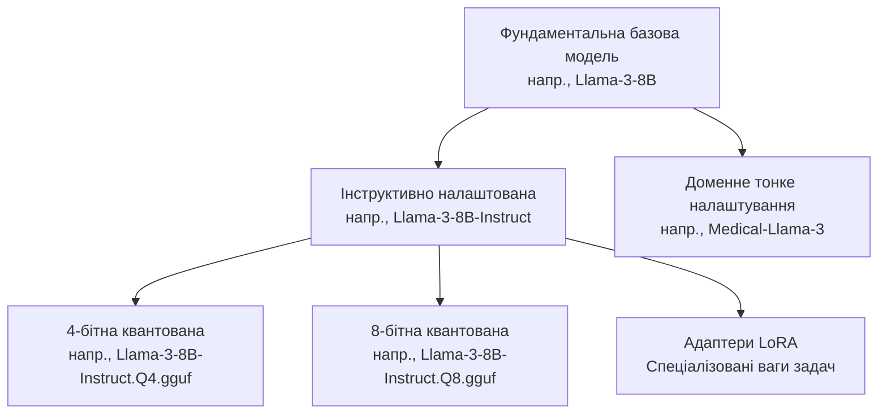

> **Складність**: `[MEDIUM]`
>
> **Час на виконання**: 45–60 хв
>
> **Передумови**: Базова впевненість у роботі з командним рядком, загальне розуміння робочих навантажень Kubernetes 1.35+ та обізнаність з обмеженнями розгортання застосунків

---

## Результати навчання

- Оцінювати ліцензійні обмеження та обмежений доступ перед схваленням відкритої моделі для комерційного використання.
- Діагностувати ризики, пов'язані з карткою моделі, апаратним забезпеченням, токенізатором і модальністю, перед завантаженням файлів контрольних точок.
- Порівнювати базові, інструктивно налаштовані та квантовані варіанти з огляду на обмеження локального інференсу.
- Формувати короткий список сімейств моделей на основі контекстного вікна, вимог до багатомовності та обсягу параметрів.

## Чому цей модуль важливий

Гіпотетичний сценарій: інженера просять додати автоматичне реферування документів до продукту, який уже працює в кластері Kubernetes 1.35+. Він шукає в хабі моделей, знаходить популярний репозиторій із вражаючими показниками бенчмарків, завантажує величезну контрольну точку та спрямовує сервер інференсу на ці файли. Перше розгортання зазнає невдачі не тому, що штучний інтелект загадковий; воно провалюється тому, що обраний артефакт потребує більше пам'яті прискорювача, ніж може надати будь-який вузол у кластері, токенізатор не було завантажено разом із вагами, а ліцензія вимагає додаткового схвалення, перш ніж модель зможе підтримувати комерційну функцію.

Такий сценарій поширений, бо хаби моделей виглядають оманливо знайомими для інженерів-програмістів. Сторінка репозиторію водночас нагадує реєстр пакетів, реєстр контейнерів і сайт документації, тому виникає спокуса сприймати кнопку завантаження як початок роботи. Насправді ж завантаження — це майже завершення прийняття рішення. Перш ніж переміщувати будь-який файл ваг, потрібно прочитати ліцензію, дослідити картку моделі, підтвердити тип моделі, порівняти варіанти та вирішити, чи зможе ваше середовище виконання обслуговувати модель, не створюючи юридичних ризиків, ризиків безпеки чи надійності.

Цей модуль навчає робочому процесу оцінювання, що стоїть за таким рішенням. Ви навчитеся відрізняти «відкриті ваги» від програмного забезпечення з відкритим кодом, читати репозиторій хабу як операційний артефакт, вибирати між базовими, інструктивно налаштованими та квантованими варіантами, а також складати короткий список сімейств моделей на основі фактичного завдання, а не найновішої таблиці лідерів. Мета — не запам'ятати назви моделей. Мета — виробити звичку ставити питання рівня розгортання, перш ніж модель потрапить у вашу архітектуру.

## Розвінчання ілюзії відкритості

Програмне забезпечення з відкритим кодом має відносно стале значення, оскільки вихідний код, ліцензія, процес збирання та похідні права зазвичай видимі в межах одного проєкту. Відкриті моделі менш однорідні. Реліз моделі може містити ваги, доступні для завантаження, та визначення архітектури, але не розкривати повні навчальні дані, точний рецепт навчання, процес фільтрації та обчислювальне середовище, використане для створення моделі. Такий реліз усе одно може бути цінним, але це не те саме, що отримати відтворюваний програмний проєкт, у якому ви можете відновити артефакт із перших принципів.

Практична відмінність — між відкритим кодом, відкритими вагами та відкритим доступом. Відкритий код передбачає, що програмна ліцензія надає широкі права переглядати, змінювати та повторно поширювати реалізацію. Відкриті ваги означають, що навчені числові параметри доступні для інференсу чи тонкого налаштування за певною ліцензією, але початковий навчальний корпус і система навчання можуть залишатися закритими. Відкритий доступ означає, що сторінка репозиторію видима або її можна запросити, але завантаження все одно може вимагати схвалення, перевірки особи, підтвердження ознайомлення з ліцензією чи прийняття умов допустимого використання.

Оскільки навчання фундаментальних ваг коштує дорого, видавці моделей часто використовують власні ліцензії замість стандартних програмних ліцензій. Деякі ліцензії дозволяють комерційне використання з атрибуцією та обмеженнями політики використання. Інші дозволяють лише дослідження, вимагають окремої угоди в разі перевищення порогу використання, забороняють використовувати вихідні дані для навчання конкурентних моделей або обмежують розгортання в регульованих галузях. Системний інженер повинен ставитися до цих умов як до умов постачальника, а не як до декоративного тексту внизу readme, бо ліцензія визначає, чи може модель легально перебувати всередині платного продукту, внутрішнього бізнес-процесу чи сервісу, орієнтованого на клієнтів.

Фраза «комерційне використання» заслуговує на особливу увагу, бо багато команд тлумачать її надто вузько. Модель не обов'язково має продаватися напряму, щоб приносити комерційну вигоду. Якщо вона забезпечує роботу приватного асистента підтримки, допомагає працівникам сортувати клієнтські звернення, складає чернетки документації продукту, ранжує потенційних клієнтів або реферує контракти для компанії, що генерує дохід, така робота все одно може підпадати під комерційне використання. Юридичний аналіз має відбутися до того, як доказ концепції стане операційною залежністю, бо пізня зміна моделі може знецінити оцінювання, промпти, бюджети затримки та перевірки безпеки.

Обмежений доступ — ще одне джерело непорозумінь. Публічна сторінка хабу моделей не гарантує анонімного чи необмеженого завантаження. Деякі репозиторії вимагають від користувача [запросити доступ, прийняти умови або дочекатися схвалення видавця](https://huggingface.co/docs/hub/models-gated). Цей бар'єр — не просто адміністративна перешкода; це частина межі відповідності вимогам. Якщо ваша автоматизація розгортання припускає, що модель можна отримати під час збирання без облікових даних чи схвалення, конвеєр може зламатися в найгірший момент, а походження вашого артефакту стане важче пояснити під час перевірки.

Зупиніться та спрогнозуйте: якщо модель видима в публічному хабі, але вимагає погодження ліцензійної угоди перед завантаженням, чи має ваш продакшен-скрипт збирання динамічно отримувати її під час розгортання? Безпечніша відповідь — ні. Продакшен-системи мають фіксувати схвалені артефакти, кешувати їх у контрольованому внутрішньому реєстрі, коли ліцензія це дозволяє, та фіксувати прийняті умови як частину доказів релізу. Динамічні завантаження розмивають межу між протестованим артефактом і тим, що хаб віддає під час розгортання.

Ось чому перше питання під час оцінювання ніколи не звучить як «Чи можу я це завантажити?». Перше питання — «Чи можемо ми використовувати це для цієї мети, у цій організації, із цими даними, за цією моделлю розгортання?». Лише після того, як ця відповідь стане обґрунтованою, слід розглядати пам'ять, пропускну здатність і топологію обслуговування. Невелика модель із дозвільною ліцензією, яку легко перевірити, може бути кращим інженерним вибором, ніж більша модель, чиї юридичні та операційні межі незрозумілі.

Перевірка відповідності вимогам також має враховувати переміщення даних. Локальний інференс часто приваблює тим, що промпти, ембединги та згенерований текст можуть залишатися в межах організації, але ця перевага зникає, якщо сам артефакт моделі отримано через некерований обліковий запис, якщо журнали доступу розкривають конфіденційні назви проєктів або якщо дані оцінювання завантажено в стороннє демонстраційне середовище. Відкриті моделі зменшують один вид залежності, але не знімають потреби у звичайному управлінні даними. Сприймайте модель, дані промптів, журнали оцінювання та згенеровані вихідні дані як єдину систему.

Ще одна корисна звичка — відділяти дозвіл від схвалення. Ліцензія може дозволяти розгортання, тоді як картка моделі все одно попереджає, що модель погано підходить для цієї галузі. І навпаки, модель може виглядати технічно чудовою, тоді як її ліцензія блокує передбачуване використання. Схвалення вимагає, щоб обидва напрями пройшли перевірку. Така дводоріжкова перевірка не дає командам стверджувати, що сильний бенчмарк компенсує слабкі права або що дозвільна ліцензія компенсує відсутність доказів безпеки.

## Читання хабу моделей як реєстру розгортання

Хаб моделей слугує центральним реєстром і системою контролю версій для артефактів машинного навчання, функціонуючи багато в чому так само, як реєстр контейнерів для мікросервісів. Проте, якщо реєстр контейнерів переважно містить незмінні шари образів, які виконуються послідовно, репозиторій хабу моделей містить складне сузір'я взаємозалежних конфігураційних файлів. Коли ви переглядаєте репозиторій на платформі на кшталт Hugging Face, ви бачите не просто звичайне посилання для завантаження величезного бінарного файлу. Ви бачите весь стан конфігурації, необхідний для інстанціювання складної нейронної мережі безпосередньо в системну пам'ять.

Усередині стандартного репозиторію моделі ви знайдете ваги, серіалізовані у формати на кшталт Safetensors або бінарних файлів PyTorch, зазвичай розділені на кілька частин, щоб упоратися з перериваннями мережі під час масштабних завантажень. Поряд із вагами лежить основний конфігураційний файл, що визначає форми тензорів, головки уваги та шари нейронної мережі. Що важливо, репозиторій також містить конфігурацію токенізатора, яка диктує, як саме необроблені текстові рядки перетворюються на числові токени, що їх модель насправді розуміє. Якщо ви спробуєте запустити ваги з невідповідним або відсутнім токенізатором, модель видасть непередбачувану нісенітницю, що якраз і підкреслює, чому хаб трактує ці файли як нероздільний пакет.

```ascii
+-------------------------------------------------------------+
|                 Model Hub Repository                        |
|                                                             |
|  +--------------------+   +------------------------------+  |
|  | Documentation      |   | Configuration Artifacts      |  |
|  |                    |   |                              |  |
|  | - README.md        |   | - config.json                |  |
|  |   (Model Card)     |   | - tokenizer_config.json      |  |
|  | - license.txt      |   | - generation_config.json     |  |
|  +--------------------+   +------------------------------+  |
|                                                             |
|  +-------------------------------------------------------+  |
|  |                 Weight Artifacts                      |  |
|  |                                                       |  |
|  | - model-00001-of-00004.safetensors  (4.5 GB)          |  |
|  | - model-00002-of-00004.safetensors  (4.5 GB)          |  |
|  | - model-00003-of-00004.safetensors  (4.5 GB)          |  |
|  | - model-00004-of-00004.safetensors  (1.2 GB)          |  |
|  +-------------------------------------------------------+  |
+-------------------------------------------------------------+
```

Ця діаграма навмисно схожа на інвентаризацію артефактів релізу. Картка моделі та ліцензія пояснюють, чи придатний артефакт. Конфігураційні файли пояснюють, як має бути сконструйована нейронна мережа. Файли токенізатора пояснюють, як текст перетворюється на ідентифікатори токенів. Шарди ваг містять великі тензори. Якщо якась частина відсутня, застаріла чи невідповідна, система все одно може запуститися, але поведінка може бути хибною так, що це виглядатиме радше як помилки застосунку, ніж помилки пакування.

Хаби моделей також несуть соціальні сигнали, і ці сигнали корисні лише тоді, коли ви розумієте їхні межі. Кількість завантажень може свідчити, що модель має широку базу користувачів, але це не доводить, що вона безпечна для вашої галузі. Уподобання можуть вказувати на інтерес спільноти, але не замінюють оцінювання. Репозиторій із частими комітами може бути активним, але він також може змінюватися швидше, ніж ваш цикл валідації. Сприймайте метадані хабу як інформацію для сортування, а потім перевіряйте фактичні файли, зафіксовані версії та документацію, перш ніж перетворювати інтерес на рішення про розгортання.

Формат файлу має значення, бо завантаження моделі — це рішення про довіру. Safetensors було розроблено як безпечніший формат серіалізації тензорних даних, бо він [уникає ризику виконання довільного коду, пов'язаного з форматами на основі pickle](https://huggingface.co/docs/hub/security-pickle). Це не робить кожну модель безпечною, але звужує один клас ризиків ланцюга постачання. Коли репозиторій пропонує і Safetensors, і старіші бінарні формати, віддавайте перевагу безпечнішому формату, якщо тільки обмеження середовища виконання не дає вам конкретної причини вчинити інакше, — і зафіксуйте цю причину в нотатках про розгортання.

Версіонування заслуговує на ту саму дисципліну, яку ви застосовуєте до контейнерів. Репозиторій моделі може змінитися після вашого першого тесту, а назва гілки на кшталт `main` не є надійним продакшен-посиланням. Зафіксуйте ревізію, записуйте точні назви файлів і контрольні суми, коли ваш інструментарій це підтримує, та дзеркальте схвалені артефакти в інфраструктуру, яку ви контролюєте, коли умови ліцензії дозволяють повторне поширення всередині вашої організації. Це уможливлює відкат і аналіз інцидентів, бо ви можете довести, які саме біти моделі працювали, коли спостерігалася певна поведінка.

Перш ніж це запускати, який результат ви очікуєте від моделі, завантаженої з неправильним токенізатором: чисту помилку, збій чи правдоподібну на вигляд нісенітницю? Багато середовищ виконання не знатимуть, що семантичний зв'язок порушено. Вони можуть безтурботно перетворювати вхідний текст на ідентифікатори токенів, використовуючи неправильний словник, і генерувати вихідні дані з цих спотворених входів. Це небезпечніше за збій, бо може пройти поверхневі димові тести, водночас псуючи поведінку, видиму для користувача.

## Опрацювання картки моделі

Найважливіший файл у будь-якому репозиторії моделі — це картка моделі, яка слугує архітектурним кресленням і паспортом безпеки для системи штучного інтелекту. Картка моделі принципово відрізняється від стандартного файлу readme програмного забезпечення. Вона документує емпіричні межі системи, деталізуючи, з якими даними модель мала справу (коли це розкрито), які упередження вона може виявляти та які бенчмарки пройшла. Пропустити картку моделі й одразу перейти до завантаження ваг — це найшвидший спосіб розгорнути неадекватний або небезпечний застосунок.

Досвідчена перевірка починається з передбачуваного використання. Цей розділ повідомляє, для чого, на думку видавця, призначена модель, і, що не менш важливо, чого видавець не стверджує, що вона може робити. Якщо картка каже, що модель призначена для загальної генерації тексту та діалогу англійською, то використання її для багатомовного юридичного перекладу — це не невелике припущення; це неперевірений сценарій використання. Якщо картка каже, що модель призначена лише для досліджень або виключає прийняття медичних, юридичних чи фінансових рішень, ці слова мають зупинити обговорення архітектури, доки не буде визначено іншу модель або керований виняток.

Наступний прохід — модальність. Деякі моделі приймають лише текст. Інші приймають зображення, аудіо, відеокадри або структуровані виклики інструментів через певний процесор. Візуально-мовна модель — це не просто мовна модель із зображенням, вставленим у промпт; вона має додаткові вимоги до попереднього оброблення, вбудовування та вирівнювання. Якщо репозиторій хабу чітко не описує підтримувані вхідні та вихідні модальності, ваша інтеграція будуватиметься на припущеннях. Ці припущення стають дорогими, коли команда застосунку вже спроєктувала користувацькі сценарії навколо непідтримуваних корисних навантажень.

Визначення розмірів апаратного забезпечення настає після мети й модальності, бо здатність запустити модель ще не робить її придатною. Кількість параметрів дає приблизне уявлення про обсяг пам'яті, але це не вся картина. Точність, довжина контексту, розмір пакета, розмір кешу ключ-значення, реалізація середовища виконання та тип прискорювача — усе це впливає на те, чи стабільний інференс. Модель на сім чи вісім мільярдів параметрів у напівточності може потребувати значно більше пам'яті під час реального обслуговування, ніж припускають самі ваги, особливо коли кілька одночасних запитів утримують у пам'яті довгі контексти.

Конфігурація токенізатора — це окремий пункт перевірки, а не примітка. Токенізатор визначає словник, спеціальні токени, шаблони чату, поведінку початку послідовності, поведінку кінця послідовності, а іноді й маркери ролей, що використовуються для форматування інструкцій. Інструктивно налаштована модель очікує, що промпти будуть [загорнуті в шаблон чату, на якому її навчали](https://huggingface.co/docs/transformers/chat_templating). Якщо ваш застосунок надсилає звичайний текст моделі, яка очікує реплік, відформатованих за ролями, модель може ігнорувати інструкції, пропускати артефакти форматування або поводитися як слабша базова модель.

Розділи з бенчмарками корисні, коли їх читати помірковано. Бенчмарк може сказати вам, що сімейство моделей має широку компетентність, але не може сказати, що модель упорається з вашою клієнтською лексикою, стилем документів, бюджетом затримки чи порогом безпеки. Команди часто надмірно підлаштовуються під позицію в таблиці лідерів, бо вона видається об'єктивною. Краща звичка — використовувати результати бенчмарків для складання короткого списку, а потім проводити невелике доменне оцінювання з репрезентативними промптами, рубриками очікуваних відповідей, випадками відмови та вимірюваннями затримки на тому самому апаратному забезпеченні, яке ви плануєте використовувати.

Розкриття обмежень та упереджень має безпосередньо впливати на вашу архітектуру. Якщо картка моделі попереджає, що модель може видавати хибні історичні твердження, небезпечний код чи шкідливий контент під час зловмисного промптингу, правильна реакція — не сподіватися, що ваші користувачі поводитимуться добре. Правильна реакція — спроєктувати навколо моделі захисні бар'єри, валідацію вихідних даних, межі пошуку, журналювання та шляхи ескалації. Картка не звільняє вас від ризику; вона підказує, звідки почати пошук.

Сценарій вправи: припустімо, картка візуально-мовної моделі каже, що вона призначена для досліджень підписування зображень, а розділ обмежень попереджає про ненадійну роботу з медичними зображеннями. Ідею продукту, що використовує модель для попереднього скринінгу зображень пацієнтів, слід відхилити на етапі вибору моделі. Цей висновок не потребує запуску бенчмарка. Видавець уже зазначив, що передбачуване використання та відомі обмеження суперечать запропонованому розгортанню.

Сприймайте картку моделі як вступну співбесіду з кандидатною системою. Ви б не найняли базу даних, не запитавши про довговічність, резервні копії, патерни запитів і межі підтримки. Не приймайте модель, не запитавши про [ліцензію, передбачуване використання, модальність, токенізатор, довжину контексту, обмеження навчання та апаратне забезпечення](https://huggingface.co/docs/hub/en/model-card-annotated). Питання відрізняються від звичайного вибору програмного забезпечення, але дисципліна та сама: перевірте контракт, перш ніж інтегрувати залежність.

Гарна перевірка картки моделі дає інженерну нотатку, а не просто «так» чи «ні». Нотатка має визначати, які факти взято безпосередньо з репозиторію, які факти виведено зі суміжної документації, а які питання залишаються без відповіді. Якщо апаратні вимоги оцінено за кількістю параметрів, а не вказано видавцем, позначте це як оцінку. Якщо багатомовну поведінку заявляє спільнота, але ваша команда її не оцінювала, позначте це як неперевірене. Таке формулювання зберігає чесність перевірки й полегшує оскарження подальших рішень.

Ця нотатка стає особливо важливою, коли модель передається від дослідницької команди чи команди застосунку до платформної команди. Платформним інженерам потрібно знати, чи очікує модель тривалого виділення прискорювача, чи витримує холодні старти, чи потребує постійного локального сховища та чи можуть кілька реплік спільно використовувати кешовані артефакти. Інженери застосунків можуть зосереджуватися на якості відповідей, але платформні інженери успадковують планування, перевірки справності, спостережуваність і поведінку розгортання. Картка моделі рідко відповідає на кожне платформне питання, тож перевірка має перетворювати факти про модель на операційні питання.

## Вибір між базовими, інструктивно налаштованими та квантованими варіантами

Базова модель, яку ви спершу знаходите в хабі, рідко є саме тим варіантом моделі, який ви зрештою розгорнете в продакшен-середовищі. Відкриту екосистему визначає величезний вторинний ринок модифікацій, де єдиний фундаментальний реліз розгалужується на сотні спеціалізованих варіантів. Розуміння цієї структури розгалуження критично важливе, бо базова модель, випущена дослідницькою лабораторією, — це, по суті, сирий рушій автодоповнення. Вона не призначена виконувати інструкції, відповідати на питання чи форматувати код; вона призначена [передбачати наступний правдоподібний токен у послідовності](https://huggingface.co/docs/transformers/chat_templating) на основі свого навчального корпусу.

Щоб зробити ці нейронні мережі корисними для розробки застосунків, вони мають пройти вторинну фазу навчання, яка називається інструктивним налаштуванням. Отриманий варіант Instruct або Chat — це те, що вам зазвичай потрібно для розмовних агентів, інструментів підтримки, засобів реферування та застосункових систем, що розв'язують задачі. Якщо ви випадково завантажите фундаментальну базову модель і поставите їй питання у промпті, вона може у відповідь згенерувати ще десяток схожих питань замість того, щоб надати структуровану відповідь. Ви завжди повинні перевіряти, чи назва репозиторію або картка моделі явно вказує, що ваги було налаштовано для діалогу чи виконання інструкцій.



Інструктивне налаштування змінює поведінку, тоді як квантування змінює представлення. Квантована модель зберігає або обчислює ваги з нижчою числовою точністю, наприклад у восьмибітних чи чотирибітних форматах, замість повної чи напівточності. Перевагою є [зменшення обсягу пам'яті й часто швидший локальний інференс на обмеженому апаратному забезпеченні](https://huggingface.co/docs/transformers/quantization/overview). Ціною є те, що частина інформації стискається й втрачається, що може знизити якість міркувань, узгодженість форматування, надійність використання інструментів або продуктивність у граничних випадках. Квантування — це не магічне налаштування; це компроміс, який ви тестуєте стосовно конкретної задачі.

Формат GGUF поширений у робочих процесах локального інференсу, бо він [оптимізований для середовищ виконання на кшталт llama.cpp](https://github.com/ggml-org/ggml/blob/master/docs/gguf.md) та для середовищ, де центральні процесори чи уніфікована пам'ять реалістичніші, ніж великі виділені прискорювачі. Артефакт GGUF може бути правильним вибором для ноутбука, робочої станції чи периферійного вузла, особливо коли застосунок може миритися з нижчою пропускною здатністю та помірною втратою якості. Той самий артефакт може бути неправильним вибором для сервісу з високою пропускною здатністю, плануванням прискорювачів, суворими цілями щодо затримки та ретельним пакетуванням, де тензорний формат, який обслуговує спеціалізований рушій інференсу, працює краще.

Тонкі налаштування та адаптери додають ще один шар. Доменне тонке налаштування може покращити продуктивність у вузькій задачі, але воно також успадковує ліцензію базової моделі й додає питання щодо набору даних для тонкого налаштування. Адаптер LoRA може бути ефективним, бо зберігає менший набір навчених змін, а не повну копію моделі, але середовище виконання має [поєднати адаптер із правильною базою](https://huggingface.co/docs/peft/developer_guides/lora). Якщо базова ревізія, токенізатор чи шаблон чату відрізняються від того, що очікує адаптер, модель може деградувати непомітними способами.

Який підхід ви обрали б тут і чому: інструктивну модель повної точності з чудовими показниками бенчмарків чи чотирибітну квантовану інструктивну модель, яка комфортно вміщується на доступному вам класі вузлів? Якщо сервіс має працювати на цьому класі вузлів, модель повної точності не є кандидатом, доки не зміниться інфраструктура. Модель, яка не вміщується в пам'ять, не є «кращою» для вашої системи; вона недоступна. Порівняння якості мають значення лише серед моделей, які ви можете обслуговувати легально й операційно.

Найбезпечніший процес вибору починається із задачі, а не з артефакту. Для чату та виконання інструкцій починайте з інструктивно налаштованих варіантів. Для досліджень із продовження сирого тексту можуть підійти базові моделі. Для обмеженого локального інференсу оцінюйте квантовані варіанти й вимірюйте втрату якості. Для доменно-специфічної поведінки розглядайте тонкі налаштування лише після підтвердження походження, сумісності ліцензій і покриття оцінювання. Кожна гілка існує тому, що різні користувачі оптимізують різні обмеження, і ваше завдання — назвати свої обмеження, перш ніж вибирати гілку.

## Оцінювання основних сімейств моделей

У ландшафті відкритих моделей домінує кілька архітектурних сімейств, кожне з яких підтримується різними організаціями та оптимізоване під різні операційні сценарії використання. Ви не повинні за замовчуванням обирати одне сімейство через відданість бренду чи ринковий шум. Натомість оцінюйте їх за умовами ліцензії, контекстним вікном, поведінкою токенізатора, багатомовним покриттям, екосистемою інструментів, обсягом параметрів, підтримкою квантування та сумісністю з обслуговуванням. Найкраща стартова модель для локального асистента з програмування може відрізнятися від найкращої моделі для багатомовного пошуку, і обидві можуть відрізнятися від найкращої моделі для регульованого внутрішнього засобу реферування.

Сімейство Llama від Meta часто розглядають як базову точку відліку для роботи з відкритими вагами, бо воно має широку підтримку спільноти. Інструментарій, квантовані варіанти, адаптери, приклади та інтеграції для обслуговування зазвичай швидко з'являються навколо релізів Llama. Ця глибина екосистеми має значення, коли вам потрібна продакшен-підтримка, бо вашій команді доведеться винаходити менше складових. Компроміс полягає в тому, що умови ліцензії, політики допустимого використання та вимоги, специфічні для версії, все одно потребують ретельної перевірки, а не побіжного припущення.

Екосистема Mistral відома [ефективними моделями та сильною продуктивністю відносно кількості параметрів](https://huggingface.co/docs/transformers/model_doc/mistral). Це робить її привабливою, коли пам'ять і пропускна здатність є основними обмеженнями. Менші моделі можуть бути дешевшими в обслуговуванні, простішими для реплікації та простішими для розміщення на пулах вузлів з обмеженою ємністю прискорювачів. Інженерне питання полягає в тому, чи зберігається ця ефективність для ваших реальних промптів, бо компактна модель, яка не справляється з вашою галуззю, може змусити робити більше повторних спроб, використовувати більший контекст пошуку чи важче постоброблення.

Сімейство Qwen часто є сильним кандидатом для [багатомовних і насичених кодуванням робочих навантажень](https://github.com/QwenLM/Qwen/blob/main/README.md). Багатомовна продуктивність залежить від складу навчальних даних, покриття токенізатора та оцінювання, а не лише від того, чи може модель видавати слова іншою мовою. Якщо продукт має обробляти англійську, мандаринську, арабську та інші писемності в одній сесії, вам слід тестувати сімейства моделей, побудовані на широких багатомовних даних, а не припускати, що кожна загальна модель поводитиметься однаково добре. Перемикання контексту між мовами — це здатність, яку ви перевіряєте, а не гасло, яке ви приймаєте на віру.

[Сімейство Gemma від Google пропонує ще один варіант](https://huggingface.co/google/gemma-2-2b-it), особливо для команд, які хочуть відкриті моделі, пов'язані з дослідницьким родоводом і патернами інструментарію екосистеми Google. Релізи Gemma часто мають чіткі картки моделей, задокументоване передбачуване використання та шляхи інтеграції з поширеними фреймворками машинного навчання. Як і з кожним сімейством, цінність — не лише в сирій якості; це поєднання ліцензії, документації, вказівок з безпеки, підтримки середовища виконання та операційної обізнаності вашої команди.

Розмір контекстного вікна — один із найбільш хибно тлумачених пунктів порівняння. Довше контекстне вікно дозволяє моделі враховувати більше токенів одночасно, але не гарантує кращих міркувань на всьому цьому проміжку. Довгі контексти збільшують використання пам'яті, бо [середовище виконання має підтримувати стан уваги та кеш ключ-значення для активних запитів](https://huggingface.co/docs/transformers/v4.52.3/en/kv_cache). Модель із величезним контекстним вікном може бути повільнішою та дорожчою в обслуговуванні, ніж модель із меншим контекстом у поєднанні з пошуком, розбиттям на частини та реферуванням. Обирайте потрібну вам довжину контексту, а потім перевіряйте, чи справді модель добре її використовує.

Кількість параметрів — це теж непрямий показник, а не рішення. Більші моделі зазвичай мають більшу ємність, але їх дорожче завантажувати, обслуговувати, масштабувати та налагоджувати. Менші моделі можуть перемагати, коли задача вузька, промпти добре структуровані або система використовує пошук для забезпечення обґрунтування. Практичний короткий список часто містить одну більшу модель як еталон якості, одну ефективну модель для чутливого до вартості обслуговування та одну квантовану локальну модель для офлайн- чи периферійного використання. Порівняння цих варіантів на одному наборі для оцінювання навчить вас більшого, ніж читання чергової таблиці лідерів.

Коли в архітектуру входить Kubernetes, вибір сімейства моделей також впливає на стратегію планування. Більша модель на прискорювачах може потребувати міток вузлів, плагінів пристроїв, taints, толерацій і ретельних вікон розгортання, тоді як менша квантована модель може працювати на звичайних вузлах, але вимагати інших очікувань щодо затримки. Жоден варіант не є автоматично кращим. Правильне питання — чи вписується ресурсний профіль моделі в решту платформи. Модель, яка змушує створити окремий пул вузлів заради однієї функції, може бути виправданою, але лише якщо цінність функції та операційна відповідальність зрозумілі.

Зрілість екосистеми обслуговування — частина порівняння сімейств моделей. Модель, яка працює в багатьох середовищах виконання, дає вам більше запасних виходів, якщо один шлях обслуговування стає надто дорогим чи надто повільним. Модель, яка залежить від вузького власного середовища виконання, все одно може бути вартою використання, але вона підвищує вартість налагодження та переносимості. Перевірте, чи має сімейство задокументовану обробку токенізатора, рецепти квантування, підтримку адаптерів, вказівки з пакетування та приклади від спільноти, що відповідають вашому стилю розгортання. Ці сигнали підтримки часто важать не менше, ніж невеликий розрив у бенчмарках.

Ви також маєте порівнювати поведінку за збоїв, а не лише успішні відповіді. Деякі сімейства багатослівніші за невизначеності, деякі охочіше відмовляють, деякі вигадують цитати, а деякі надійніше зберігають структуровані вихідні дані під тиском. Ці відмінності формують застосунок, що оточує модель. Модель, яка видає чистий JSON у звичайних випадках, але ламає формат за довгих промптів, може потребувати суворішого циклу валідації. Модель, яка впевнено відповідає на кожне питання, може потребувати сильнішого оброблення невизначеності. Надійність — це поєднання поведінки моделі та засобів контролю застосунку.

## Патерни та антипатерни

### Патерни

Почніть із патерну приймання, орієнтованого насамперед на ліцензію. Кожна модель-кандидат має потрапляти до вашої системи відстеження з зафіксованими ліцензією, статусом обмеженого доступу, видавцем, передбачуваним використанням, умовами допустимого використання, припущеннями щодо повторного поширення та обмеженнями комерційного використання ще до початку технічного тестування. Цей патерн працює, бо він не дає командам емоційно прив'язатися до моделі, яку не можна використовувати. Він також створює повторно використовувані докази для тих, хто перевіряє безпеку, юридичні та платформні аспекти, тож кожній команді застосунку не доведеться заново відкривати ті самі обмеження.

Використовуйте контрольний список перевірки картки моделі перед будь-яким бенчмарком продуктивності. Контрольний список має охоплювати передбачуване використання, модальність, токенізатор, шаблон чату, контекстне вікно, розкриття навчання, обмеження, вказівки щодо апаратного забезпечення та нотатки з безпеки. Цей патерн масштабується, бо відокремлює жорсткі дискваліфікатори від настроюваних застережень. Модель, яка виключає вашу галузь або не має потрібної модальності, можна швидко відхилити, тоді як модель із прийнятними межами може перейти до глибшого оцінювання з меншою кількістю несподіванок.

Побудуйте драбину варіантів для локального інференсу. Для кожного перспективного сімейства визначте базову модель, інструктивно налаштовану модель, бажаний артефакт обслуговування повної чи напівточності та один-два квантовані альтернативні варіанти. Цей патерн допомагає команді зрозуміти, який компроміс тестується. Якщо квантована версія не проходить тест форматування, ви можете порівняти її з неквантованою інструктивною моделлю, а не гадати, чи проблема виникла через сімейство, тонке налаштування, промпт чи стиснення.

Фіксуйте ревізії та дзеркальте схвалені артефакти, коли це дозволено. Хаб моделей чудово підходить для пошуку, але продакшен-системи потребують відтворюваності. Фіксація точної ревізії та зберігання схвалених артефактів у контрольованому середовищі значно спрощує відкати, аудити та реагування на інциденти. Цей патерн також захищає системи збирання від проблем із зовнішньою доступністю та від випадкових змін у гілці репозиторію, яка ніколи не мала слугувати продакшен-контрактом.

### Антипатерни

Не обирайте модель лише за позицією в таблиці лідерів. Таблиці лідерів використовують бенчмаркові задачі, які можуть бути корисними сигналами, але вони рідко відповідають вашій галузі, цілі щодо затримки, чутливості даних чи формі промпта. Команди потрапляють у цей антипатерн, бо позиція здається об'єктивним коротким шляхом. Краща альтернатива — створити невеликий набір для оцінювання з реалістичних користувацьких задач, включити випадки збоїв і порівняти моделі з короткого списку за однакових умов середовища виконання.

Не сприймайте «відкрите» як синонім необмеженого. Цей антипатерн виникає, коли інженери ототожнюють публічну видимість із юридичним дозволом. Публічний репозиторій усе одно може мати комерційні пороги, обмеження використання, ліміти повторного поширення чи завантаження з обмеженим доступом. Краща альтернатива — зробити перевірку ліцензії першим кроком приймання та зафіксувати рішення, перш ніж експерименти створять організаційний імпульс навколо моделі, яку не можна випустити.

Не змішуйте токенізатори, шаблони чату, адаптери та ревізії ваг абияк. Багато збоїв моделей — це збої пакування, замасковані під слабкий інтелект. Команди потрапляють у цей патерн, коли копіюють файл ваг з одного репозиторію, шаблон промпта з іншого, а адаптер із третього. Краща альтернатива — сприймати репозиторій моделі як атомарний набір артефактів, якщо тільки видавець чи автор адаптера явно не документує сумісну базу та шаблон.

Не розгортайте найбільшу модель, яку ваше апаратне забезпечення ледь може завантажити. Модель, яка вміщується лише без запасу для одночасних запитів, зростання кешу ключ-значення, накладних витрат на спостережуваність чи поетапних оновлень, зазнає невдачі під реальним трафіком. Команди потрапляють у цей антипатерн, бо успішне локальне завантаження здається доказом готовності. Краща альтернатива — визначати розмір з огляду на поведінку обслуговування, зокрема довжину контексту, розмір пакета, ізоляцію збоїв та операційний буфер, потрібний вашій платформі.

## Фреймворк прийняття рішень

Почніть прийняття рішення з короткого письмового опису робочого навантаження. Назвіть користувача, вхідну модальність, очікувані вихідні дані, рівень ризику, ціль щодо затримки, чутливість даних і середовище розгортання. Це виводить приховані припущення назовні. Модель, обрана для офлайнової допомоги розробникам, може миритися з іншими обмеженнями щодо приватності, затримки та ліцензії, ніж модель, вбудована в орієнтований на клієнтів процес підтримки, навіть якщо обидві використовують той самий промпт під час демонстрації.

Далі відсійте кандидатів, які не проходять непорушні межі. Конфлікт ліцензій, непідтримувана модальність, відсутність комерційних прав, неприйнятні умови обмеженого доступу чи явні попередження в картці моделі для цільової галузі мають вилучати модель ще до того, як ви витратите час на роботу з бенчмарками. Цей крок може здаватися консервативним, але він захищає команду від безповоротних витрат. Легше відхилити модель на ранньому етапі, ніж замінити її після того, як навколо неї побудовано промпти, оцінювання, інформаційні панелі та плани ємності.

Потім оберіть сімейство та набір варіантів для оцінювання. Включіть найімовірнішого інструктивно налаштованого кандидата, меншу чи ефективнішу альтернативу та квантований локальний варіант, якщо локальний інференс є частиною мети. Використовуйте однакові репрезентативні промпти, документи та випадки безпеки для кожного кандидата. Вимірюйте якість, поведінку відмови, узгодженість форматування, затримку, використання пам'яті та операційну складність. Модель, яка видає трохи кращі відповіді, але потребує нестабільної архітектури обслуговування, може програти простішій моделі, яка надійно задовольняє потребу продукту.

Нарешті, перетворіть оцінювання на операційну рекомендацію. Рекомендація має вказувати, яку модель і ревізію використовувати, які токенізатор і шаблон чату потрібні, які ліцензійні обмеження застосовуються, яке середовище виконання очікується, який апаратний діапазон було протестовано, які обмеження залишаються та що спричинить повторне оцінювання. Цей останній пункт важливий, бо екосистема відкритих моделей швидко змінюється. Гарний запис рішення пояснює, чому обрана модель правильна сьогодні і як команда дізнається, коли настане час порівнювати знову.

Рекомендація має містити резервний шлях. Системи локального інференсу можуть давати збій, бо обрана модель перевищує пам'ять під реальним трафіком, бо квантований артефакт втрачає забагато якості, бо змінюється результат перевірки ліцензії або бо середовище виконання не може досягти цілей щодо затримки. Резервним варіантом може бути менша модель, розміщена модель за суворішою межею даних, дизайн із пріоритетом пошуку та меншою генерацією або відкладений запуск, поки інфраструктура наздоганяє. Раннє визначення резервного варіанту робить проєкт менш крихким, коли перший кандидат розчаровує.

Вартість слід записувати в операційних термінах, а не лише в цінах на апаратне забезпечення. Модель, яка потребує виділеного вузла з прискорювачем, впливає на планування ємності, оновлення кластера, реагування на інциденти та доступ розробників. Модель, яка працює на центральних процесорах, може бути дешевшою в забезпеченні, але повільнішою на запит, що може збільшити чергування та видиму для користувача затримку. Модель, яка вміщується на ноутбуках, може бути чудовою для офлайнових інструментів розробника, але непридатною для спільного продакшен-трафіку. Фреймворк прийняття рішень має порівнювати загальний операційний профіль, а не лише розмір моделі.

Перевірка безпеки замикає цикл. Артефакти моделей — це залежності, а залежності потребують походження, схвалення, моніторингу вразливостей і планів видалення. Контейнер обслуговування, файли токенізатора, ваги моделі, шаблони промптів і код постоброблення — усе це бере участь у межі безпеки. Якщо репозиторій хабу змінює власника, змінюється ліцензія або з'являється безпечніший формат артефакту, команда має знати, хто оцінює цю зміну. Прийняття відкритих моделей — це не одноразове завантаження; це постійна практика управління залежностями.

## А чи знали ви?

- Чи знали ви, що Safetensors створили для зберігання тензорів без поведінки виконання довільного коду, пов'язаної із завантаженням на основі pickle, що робить вибір формату файлу частиною управління ризиками ланцюга постачання, а не просто питанням зручності?
- Чи знали ви, що контекстне вікно — це жорсткий ліміт на токени, які модель може враховувати одночасно, тож [зайвий вхід зазвичай обрізається, розбивається на частини, реферується або відхиляється](https://huggingface.co/docs/transformers/v4.44.1/pad_truncation), а не магічно запам'ятовується?
- Чи знали ви, що чотирибітна квантована модель може бути достатньо малою для локального інференсу, але все одно потребувати ретельного тестування, бо стиснення може по-різному впливати на міркування, форматування та поведінку в граничних випадках залежно від задачі?
- Чи знали ви, що токенізатор незалежний від ваг нейронної мережі, тож заміна токенізаторів між несумісними репозиторіями може спричиняти правдоподібні на вигляд збої, які набагато важче діагностувати, ніж чисту помилку запуску?

## Поширені помилки

| Помилка | Чому вона трапляється | Як її виправити |
|---|---|---|
| Вибір моделей лише за позицією в таблиці лідерів | Таблиці лідерів вимірюють академічні бенчмарки, які рідко переносяться на продуктивність у конкретній продакшен-галузі. | Оцінюйте моделі за допомогою власних, доменно-специфічних наборів даних, що відображають ваші реальні користувацькі входи, очікування щодо вихідних даних і бюджет затримки. |
| Завантаження базових моделей для чат-застосунків | Базові моделі лише передбачають наступний токен і часто продовжують патерн замість того, щоб відповісти користувачеві. | Перевірте, що репозиторій явно містить інструктивно налаштований або оптимізований для чату варіант, перш ніж будувати контракт промпта. |
| Ігнорування обмежень комерційної ліцензії | Команди бачать публічний репозиторій і припускають, що публічна видимість означає необмежене бізнес-використання. | Перевірте файл ліцензії, умови обмеженого доступу та політику допустимого використання, перш ніж запускати перший експеримент із розгортання. |
| Спроба завантажити неквантовані моделі на периферійних вузлах | Артефакти повної чи напівточності можуть вичерпати пам'ять ще до того, як сервіс обробить реальні одночасні запити. | Обирайте квантовані варіанти, розроблені для обмеженого апаратного забезпечення, а потім вимірюйте втрату якості порівняно з повною інструктивною моделлю. |
| Припущення, що відкриті ваги означають відкриті навчальні дані | Багато релізів розкривають ваги, не розкриваючи повного корпусу, конвеєра фільтрації чи рецепта навчання. | Використовуйте обмеження з картки моделі, оцінювання безпеки та доменні тести, щоб компенсувати ті частини походження, які ви не можете перевірити. |
| Нехтування відповідними файлами токенізатора | Середовище виконання може прийняти невідповідні ідентифікатори токенів і згенерувати поганий результат замість того, щоб чітко дати збій. | Завантажуйте токенізатор, процесор, шаблон чату та конфігурацію генерації з тієї самої схваленої ревізії репозиторію. |
| Недооцінка обмежень контекстного вікна | Довгі документи можуть обрізатися або ставати дорогими, бо кеш ключ-значення зростає з активним контекстом. | Обчислюйте очікувану кількість токенів і тестуйте пошук, розбиття на частини чи моделі з довгим контекстом на реалістичних документах. |
| Неспроможність перевірити вхідну модальність | Команди припускають, що модель може обробляти зображення, аудіо чи інструменти, бо схоже сімейство моделей це вміє. | Підтвердьте точні вхідні та вихідні модальності в картці моделі та конфігурації репозиторію, перш ніж проєктувати корисне навантаження API. |

## Тест

<details><summary>Сценарій: Ваша команда хоче оцінити ліцензійні обмеження та обмежений доступ для відкритої моделі, яка реферуватиме клієнтські звернення всередині платного продукту підтримки. Сторінка моделі публічна, але завантаження вимагає прийняття громадської ліцензії з комерційними умовами. Що вам слід зробити, перш ніж тестувати її в середовищі продукту?</summary>
Вам слід призупинити продуктовий експеримент і спершу завершити перевірку ліцензії, бо публічна видимість не доводить комерційного дозволу. Команда має зафіксувати прийняті умови, процес обмеженого доступу, межі комерційного використання та припущення щодо повторного поширення, перш ніж модель стане частиною архітектури. Якщо умови суперечать продукту, оберіть дозвільну альтернативу або отримайте потрібну угоду. Тестування може продовжуватися лише після того, як юридична та операційна межа стане зрозумілою.</details>

<details><summary>Сценарій: Розгорнутий реферувальник успішно завантажує свої шарди ваг, але кожна відповідь містить дивні символи й ігнорує очікувані ролі чату. Вам потрібно діагностувати ризики картки моделі, апаратного забезпечення, токенізатора та модальності з набору артефактів. Яка найімовірніша помилка пакування?</summary>
Імовірна помилка — невідповідний токенізатор або шаблон чату. Файли ваг можуть завантажитися правильно, тоді як зіставлення тексту з токенами все одно хибне, а середовище виконання може не розуміти, що семантичний контракт порушено. Вам слід перевірити, що `tokenizer_config.json`, файли токенізатора, конфігурація генерації та шаблон чату — усі походять із тієї самої схваленої ревізії, що й ваги. Якщо якийсь компонент узято з іншого репозиторію, перезберіть набір артефактів із узгодженого джерела.</details>

<details><summary>Сценарій: Інженер порівнює базові, інструктивно налаштовані та квантовані варіанти для локального інференсу на робочій станції з обмеженою уніфікованою пам'яттю. Базова модель має найкращу сторінку сирих бенчмарків, тоді як чотирибітний інструктивний варіант комфортно вміщується. Який варіант слід протестувати першим для чат-асистента?</summary>
Першим слід протестувати інструктивно налаштований квантований варіант, бо робоче навантаження — це чат-асистування, а апаратне забезпечення обмежене. Базова модель не навчена надійно виконувати інструкції, тож її показник бенчмарка не розв'язує поведінкової вимоги. Квантований варіант жертвує певною точністю заради обсягу пам'яті, який справді може працювати в цільовому середовищі. Ви все одно маєте порівнювати якість із менш стиснутою інструктивною моделлю, коли це можливо, але базова модель — неправильна відправна точка для чат-поведінки.</details>

<details><summary>Сценарій: Продукт має сформувати короткий список сімейств моделей на основі контекстного вікна, вимог до багатомовності та обсягу параметрів для звітів про відповідність вимогам англійською, мандаринською та арабською. На чому має наголошувати короткий список?</summary>
Короткий список має наголошувати на сімействах із сильними доказами багатомовності, придатним покриттям токенізатора для цільових писемностей та контекстною поведінкою, здатною впоратися з розмірами документів без надмірної вартості обслуговування. Qwen може заслуговувати на раннє оцінювання, бо багатомовне покриття — його відома сильна сторона, тоді як варіанти Llama, Mistral чи Gemma можуть слугувати корисними базовими точками відліку залежно від потреб щодо ліцензії та середовища виконання. Обсяг параметрів слід тестувати поряд із якістю, бо менша модель, яка добре обробляє мови, може бути простішою в обслуговуванні. Остаточний вибір має походити з репрезентативного набору для оцінювання, а не зі знайомості з брендом.</details>

<details><summary>Сценарій: Ваша команда знаходить доменне тонке налаштування, яке заявляє про чудове реферування юридичних текстів, але репозиторій не вказує базову ревізію чи токенізатор. Як вам слід оцінювати цього кандидата?</summary>
Сприймайте його як високоризикового, доки сумісність і походження не стануть зрозумілими. Тонке налаштування чи адаптер залежить від правильної базової моделі, токенізатора та формату промпта, тож відсутність інформації про сумісність може призвести до непомітних збоїв. Вам слід запитати або знайти базову ревізію, успадкування ліцензії, вимоги до токенізатора та деталі оцінювання, перш ніж запускати його в серйозному тесті. Якщо цю інформацію неможливо встановити, вилучіть його з короткого списку.</details>

<details><summary>Сценарій: Картка моделі попереджає, що модель призначена лише для досліджень підписування зображень і ненадійна на медичних зображеннях. Зацікавлена сторона хоче використати її для попереднього скринінгу знімків пацієнтів, бо демонстрація виглядає вражаюче. Яка правильна інженерна рекомендація?</summary>
Відхиліть цей шлях розгортання. Картка моделі явно каже, що передбачуване використання та профіль обмежень не відповідають запропонованому процесу медичного скринінгу. Демонстрація не скасовує визначених видавцем меж, а використання, що впливає на пацієнтів, потребує набагато сильнішої валідації, керування та галузевого схвалення. Натомість команда має шукати модель і процес, розроблені для регульованого медичного контексту.</details>

<details><summary>Сценарій: Платформна команда хоче, щоб продакшен-поди завантажували ваги моделі з публічного хабу під час запуску, щоб кожне розгортання завжди використовувало найновіші файли. Які операційні ризики вам слід підняти?</summary>
Динамічні завантаження під час запуску послаблюють відтворюваність і можуть ускладнити відкати, бо робочий артефакт може змінюватися без зміни коду. Вони також наражають розгортання на проблеми з доступністю хабу, збої обмеженого доступу, ліміти частоти та неперевірені оновлення репозиторію. Кращий патерн — зафіксувати ревізію, схвалити набір артефактів, дзеркалити його всередині, коли це дозволено, і розгортати з цього контрольованого джерела. Це дає тим, хто реагує на інциденти, чітку відповідь про те, яка модель обслуговувала трафік.</details>

## Практична вправа

Сценарій вправи: ваше завдання — оцінити репозиторій хабу моделей так, ніби ви готуєте перевірку розгортання для локального інференсу. Вам не потрібно запускати модель, і вам не слід завантажувати великі файли ваг для цієї вправи. Мета — попрактикуватися читати артефакти репозиторію, умови ліцензії та екосистему варіантів, перш ніж у обговорення ввійде вартість обчислень. Використайте актуальний репозиторій відкритої моделі з великого хабу, наприклад інструктивну модель Llama, Mistral, Qwen чи Gemma, і задокументуйте свої висновки в короткій нотатці рішення.

### Підготовка

Відкрийте хаб моделей у браузері та оберіть один інструктивно налаштований репозиторій, який виглядає придатним для робочого навантаження загального асистента чи реферування. Тримайте відкритою нотатку з п'ятьма заголовками: ліцензія, картка моделі, інвентаризація артефактів, варіанти та рекомендація щодо розгортання. Досліджуючи репозиторій, записуйте точні назви файлів і розділи сторінки, а не покладайтеся на пам'ять. Це відображає, як інженерна перевірка має зберігати докази для наступних рецензентів.

### Завдання

- [ ] Оцініть ліцензійні обмеження та обмежений доступ для обраного репозиторію, зокрема чи дозволено комерційне використання та чи вимагають завантаження схвалення або прийняття умов.
- [ ] Діагностуйте ризики картки моделі, апаратного забезпечення, токенізатора та модальності, записавши передбачуване використання, підтримувані входи та виходи, контекстне вікно, нотатки про токенізатор чи шаблон чату та вказівки щодо апаратного забезпечення.
- [ ] Порівняйте базові, інструктивно налаштовані та квантовані варіанти, знайшовши найближчу базову модель, обрану вами інструктивну модель і щонайменше один артефакт квантованого локального інференсу, якщо такий доступний.
- [ ] Сформуйте короткий список сімейств моделей на основі контекстного вікна, вимог до багатомовності та обсягу параметрів для гіпотетичного сервісу реферування документів.
- [ ] Напишіть рекомендацію щодо розгортання, яка називає точну ревізію моделі чи джерело артефакту, яке ви протестували б першим, і пояснює компроміс, на який ви йдете.

### Розв'язання

<details><summary>Орієнтир розв'язання для завдання 1</summary>
Ваша нотатка про ліцензію має називати ліцензію чи власну громадську угоду, описувати будь-які умови комерційного використання та зазначати, чи існує обмежений доступ. Якщо сторінка вимагає схвалення чи прийняття умов, зафіксуйте це як операційну залежність. Сильна відповідь також каже, чи можна дзеркалити артефакт усередині та хто має схвалити це рішення.</details>

<details><summary>Орієнтир розв'язання для завдання 2</summary>
Ваша нотатка про картку моделі має пов'язувати передбачуване використання з вашим запропонованим робочим навантаженням. Вона має визначати текстову, зображувальну, аудіо- чи інші модальності, а також довжину контексту та вимоги до токенізатора чи шаблону чату. Якщо вказівок щодо апаратного забезпечення бракує, зазначте це як ризик, а не вигадуйте число. Перевірка має відрізняти відомі факти від припущень.</details>

<details><summary>Орієнтир розв'язання для завдання 3</summary>
Ваше порівняння варіантів має показувати, що базові, інструктивно налаштовані та квантовані артефакти розв'язують різні проблеми. Базова модель корисна для розуміння родоводу, інструктивна модель зазвичай є кандидатом для застосунку, а квантований артефакт — це компроміс локального інференсу. Зазначте формат, приблизний розмір файлу та очікуваний компроміс щодо якості чи пам'яті.</details>

<details><summary>Орієнтир розв'язання для завдання 4</summary>
Ваш короткий список має містити більше ніж одне сімейство, коли робоче навантаження має багатомовні, довгоконтекстні чи апаратні обмеження. Поясніть, чому кожне сімейство належить до порівняння і що його дискваліфікувало б. Корисний короткий список достатньо малий, щоб його протестувати, але достатньо різноманітний, щоб виявити, що є обмежувальним чинником — якість, пам'ять чи ліцензія.</details>

<details><summary>Орієнтир розв'язання для завдання 5</summary>
Ваша рекомендація має бути достатньо конкретною, щоб інший інженер міг відтворити наступне оцінювання. Назвіть репозиторій моделі, стратегію ревізій, вимогу до токенізатора, кандидатне середовище виконання, апаратне припущення та найбільший невирішений ризик. Уникайте фраз на кшталт «використовуйте найкращу модель»; рекомендація щодо розгортання — це обґрунтований компроміс, а не голосування за популярність.</details>

### Критерії успіху

- [ ] Ви можете пояснити, чи можна легально використовувати обрану модель для цільового комерційного чи внутрішнього бізнес-процесу.
- [ ] Ви можете визначити факти про токенізатор, шаблон чату, модальність і контекстне вікно, що впливають на інтеграцію.
- [ ] Ви можете обґрунтувати обраний варіант як базовий, інструктивно налаштований, квантований, тонко налаштований чи на основі адаптера.
- [ ] Ви можете порівняти щонайменше два сімейства моделей за контекстним вікном, багатомовною здатністю та обсягом параметрів.
- [ ] Ви можете назвати перший артефакт, який ви протестували б, та операційні докази, потрібні перед продакшен-схваленням.

## Джерела

- [Hugging Face Hub model cards](https://huggingface.co/docs/hub/model-cards)
- [Hugging Face Hub model repositories](https://huggingface.co/docs/hub/en/models-the-hub)
- [Hugging Face gated models](https://huggingface.co/docs/hub/en/models-gated)
- [Hugging Face Safetensors security audit](https://huggingface.co/docs/safetensors/audit)
- [Safetensors documentation](https://huggingface.co/docs/safetensors/index)
- [Meta Llama license](https://www.llama.com/llama3/license/)
- [Meta Llama acceptable use policy](https://www.llama.com/llama3/use-policy/)
- [Mistral AI documentation](https://docs.mistral.ai/)
- [Qwen model documentation](https://qwen.readthedocs.io/en/latest/)
- [Google Gemma model documentation](https://ai.google.dev/gemma/docs)
- [llama.cpp GGUF documentation](https://github.com/ggml-org/llama.cpp/blob/master/docs/gguf.md)
- [Annotated Model Card Template](https://huggingface.co/docs/hub/en/model-card-annotated) — Найкраще першоджерело щодо того, що інженерам слід видобувати з картки моделі під час приймання.
- [Hugging Face Gated Models](https://huggingface.co/docs/hub/models-gated) — Охоплює запити доступу, режими схвалення, автентифікацію та операційні наслідки завантаження моделей з обмеженим доступом.
- [Transformers Quantization Overview](https://huggingface.co/docs/transformers/quantization/overview) — Корисний фоновий матеріал для порівняння артефактів повної точності, 8-бітних і 4-бітних у плануванні локального інференсу.
- [GGUF Specification](https://github.com/ggml-org/ggml/blob/master/docs/gguf.md) — Першоджерело щодо того, що зберігає GGUF і чому він поширений у локальних стеках інференсу на основі GGML.

## Наступний модуль

Перейдіть до [Hugging Face для учнів](../module-1.2-hugging-face-for-learners/), щоб детальніше попрактикуватися в навігації інтерфейсом хабу, файлами репозиторію та робочими процесами облікового запису.
