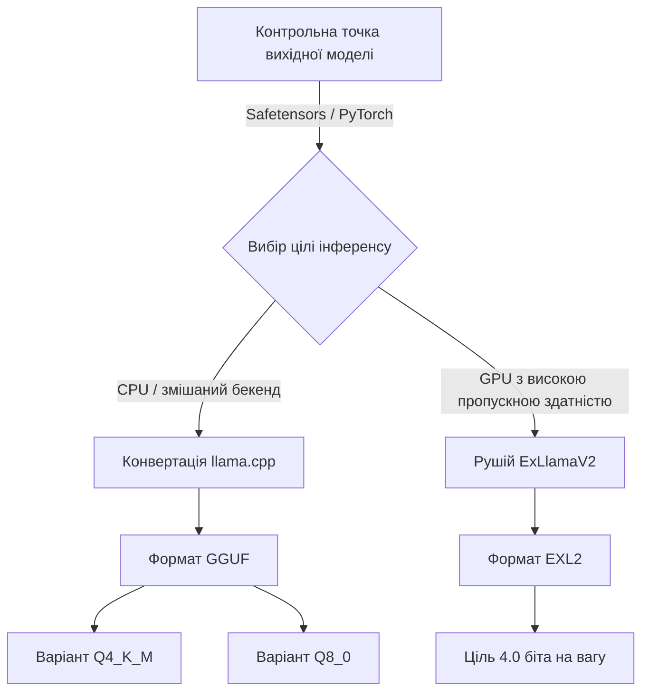

> **Складність**: `[MEDIUM]`
>
> **Час на виконання**: 60–75 хвилин
>
> **Передумови**: основи відкритих моделей, компроміси локального інференсу, базова впевненість у роботі з командним рядком

---

## Що ви зможете робити

- Оцінювати бюджети пам'яті моделі та KV-кешу перед вибором обладнання для локального інференсу.
- Порівнювати формати Safetensors, GGUF та EXL2 й обирати правильний шлях виконання для цільового середовища виконання.
- Проєктувати вибір квантування, що балансує ємність обладнання, пропускну здатність пам'яті, перплексію та якість вихідних даних.
- Діагностувати збої локального інференсу, спричинені невідповідністю формату, надмірною довжиною контексту або занадто агресивним квантуванням.

## Чому цей модуль важливий

Гіпотетичний сценарій: ваша команда хоче приватного асистента для підсумовування внутрішніх проєктних документів, а вимога безпеки каже, що промпти не можуть залишати робочу станцію чи контрольовану лабораторну мережу. Картка моделі рекламує потужну модель з відкритими вагами, сторінка завантаження перелічує кілька файлів з іменами на кшталт `Q4_K_M`, `Q8_0`, `safetensors` та `exl2`, а інвентар обладнання показує ноутбук зі спільною пам'яттю плюс одну старішу робочу станцію з дискретним GPU. Складність не в тому, щоб вирішити, чи привабливий локальний інференс; складність у тому, щоб вирішити, який артефакт моделі насправді зможе запуститися, не перетворюючи кожну відповідь на повільний, нестабільний експеримент.

Квантування — це практичний міст між дослідницькими моделями з відкритими вагами та локальними системами, якими можуть керувати звичайні інженери. Модель з мільярдами параметрів — це не просто хитрий алгоритм; це також фізичний об'єкт, виражений у байтах, що має вміститися в пам'ять, пройти через шину пам'яті та залишити місце для активного стану розмови. Якщо ви не обчислите ці обмеження перед розгортанням, середовище виконання обчислить їх за вас — падінням, витісненням у повільну пам'ять або генерацією тексту настільки повільно, що застосунок стане непридатним до використання.

Цей модуль навчає квантування як інженерного рішення, а не переліку термінів. Ви збережете різницю між контрольними точками для розповсюдження та форматами виконання, оцінюватимете вартість пам'яті для ваг і KV-кешу, розмірковуватимете, чому змішана точність часто перевершує єдину рівномірну бітову глибину, та обиратимете між квантуванням GGUF, EXL2 і квантуванням у середовищі виконання Transformers залежно від робочого навантаження. Приклади не потребують Kubernetes, але пізніші модулі платформи припускають Kubernetes 1.35 або новіший, коли ці патерни локального інференсу пакуються в сервіси.

## Ваги моделі — це проблема системи пам'яті

Перша корисна ментальна модель полягає в тому, що нейронна мережа — це велика колекція вивчених чисел, які потрібно багаторазово зчитувати під час інференсу. Кількість параметрів говорить, скільки існує вивчених ваг, тоді як числовий формат говорить, скільки байтів споживає кожна вага. Модель на сім мільярдів параметрів, збережена у FP16, використовує близько чотирнадцяти гігабайтів лише для ваг, бо кожен параметр споживає два байти, і ця оцінка з'являється ще до того, як у картину вступлять дані токенізатора, накладні витрати середовища виконання чи стан розмови.

Це обчислення пояснює, чому локальний інференс відчувається інакше, ніж звичайне розгортання застосунку. Вебсервіс часто можна «стиснути», зменшивши конкурентність або налаштувавши кеші, але мовна модель мусить завантажити великий статичний об'єкт, перш ніж узагалі зможе щось відповісти. Якщо ваги моделі не вміщаються у швидку пам'ять, під'єднану до прискорювача, чи в систему уніфікованої пам'яті, кожен згенерований токен стає заручником повільніших передач. Ємність вирішує, чи завантажиться модель, а пропускна здатність вирішує, чи відчуватиметься завантажена модель придатною до використання.

Квантування зменшує кількість бітів, що використовуються для представлення ваг моделі. Замість того, щоб зберігати кожне вивчене значення як шістнадцяти- чи тридцятидвобітне число з плаваючою комою, квантувальник відображає діапазон дійсних значень у менший цілочисельний діапазон і зберігає масштаб, потрібний для інтерпретації цих цілих чисел. Це стиснення з втратами, а не магія. [Модель стає меншою і часто швидшою, але це відображення вносить похибку округлення, яка може проявлятися як слабше міркування, крихке дотримання інструкцій або погіршена якість на граничних випадках.](https://huggingface.co/docs/transformers/en/quantization/concept_guide)

Причина, чому квантування працює напрочуд добре, у тому, що навчені нейронні мережі містять надлишковість. Багато ваг не потребують високої точності для збереження загальної поведінки моделі, і багато шарів терплять невеликі зміни округлення без помітної втрати якості. Причина, чому квантування може дати збій, у тому, що деякі шари чутливіші за інші, особливо структури уваги та прямого поширення (feed-forward), які несуть важливу поведінку маршрутизації чи міркування. Хороші формати використовують надлишковість, водночас захищаючи чутливі частини.

```ascii
Неперервний розподіл з плаваючою комою
[ -3.14159 ] . . . . . . . . [  0.00000  ] . . . . . . . . [ +3.14159 ]
      |                             |                             |
      |         Квантування         |         Квантування         |
      |        відображення         |        відображення         |
      v                             v                             v
[   -128   ] . . . . . . . . [     0     ] . . . . . . . . [   +127   ]
Дискретний 8-бітний цілочисельний діапазон
```

Діаграма показує центральний компроміс. Широкий неперервний розподіл стискається в менший набір представних значень, а середовище виконання використовує масштабні коефіцієнти для наближення оригінальних значень під час матричних операцій. За восьми бітів цілочисельний діапазон усе ще достатньо широкий, щоб багато шарів залишалися близькими до своєї початкової поведінки. За чотирьох бітів діапазон значно вужчий, тож квантувальник має бути обережнішим щодо блоків, викидів і того, які тензори заслуговують на додаткову точність.

Зупиніться та спрогнозуйте: якщо шар має значення, рівномірно розподілені навколо нуля, що станеться з нульовою точкою в схемі симетричного квантування? Корисна відповідь у тому, що [нульову точку можна зафіксувати на нулі](https://huggingface.co/docs/transformers/en/quantization/concept_guide), що прибирає операцію зсуву з гарячого шляху. Це може бути швидше й простіше, але добре працює лише тоді, коли розподіл даних насправді поводиться достатньо симетрично, щоб не марнувати половину цілочисельного діапазону.

Квантування після навчання (post-training quantization) — поширений шлях для локального інференсу з відкритими вагами, бо воно починається з уже навченої моделі та конвертує ваги після завершення навчання. Воно доступне, дешеве порівняно з навчанням і легке для спільнотних супровідників, щоб публікувати кілька варіантів. [Навчання з урахуванням квантування (quantization-aware training) — інше: воно симулює ефекти низької точності під час навчання чи тонкого налаштування, щоб модель могла адаптуватися до похибок, яких зазнає пізніше. QAT може давати сильніші низькобітні моделі](https://huggingface.co/docs/transformers/en/quantization/concept_guide), але воно потребує доступу до навчання та значних обчислень, тож більшість локальних практиків спершу стикаються з артефактами PTQ.

Ключ у тому, щоб ставитися до бітової глибини як до регулятора операційного ризику. Восьмибітне квантування зазвичай економить суттєвий обсяг пам'яті, залишаючись близьким до оригінальної якості. [П'ятибітні та чотирибітні змішані схеми часто є практичним оптимумом для ноутбуків і робочих станцій, бо зменшують розмір ваг достатньо, щоб вмістити корисні моделі локально.](https://huggingface.co/docs/transformers/en/quantization/concept_guide) Трибітні та нижчі варіанти можуть бути корисними для експериментів, але вони заслуговують на скептицизм, доки ваше оцінювальне навантаження не доведе, що втрата якості прийнятна.

Є ще один тонкий момент: квантування змінює представлення, що використовується для інференсу, а не абстрактну обіцянку моделі. Картка моделі може описувати потужну вихідну модель, але сильно стиснутий артефакт — це похідний інженерний вибір із власною поведінкою. Два файли, похідні від однієї контрольної точки, можуть відрізнятися за використанням пам'яті, швидкістю та якістю настільки, що їх слід розглядати як окремі релізні кандидати. Коли ви оцінюєте локальний інференс, записуйте точну назву артефакту, а не лише сімейство базової моделі.

Ця відмінність також допомагає пояснити, чому рекомендації спільноти можуть звучати суперечливо. Один інженер може сказати, що чотирибітна модель чудова, бо його навантаження — це невимушений чат на коротких промптах, тоді як інший може відкинути той самий артефакт, бо він не справляється зі структурованим видобуванням із довгих технічних документів. Обидва звіти можуть бути правдивими. Контекст розгортання вирішує, яка втрата прийнятна, тож ваше завдання — перетворити загальну репутацію моделі на виміряне рішення щодо артефакту для вашого навантаження.

## Обсяг ваг, KV-кеш і пропускна здатність

Найлегша помилка визначення розміру — обчислювати лише статичні ваги моделі. Під час генерації середовища виконання трансформерів також підтримують кеш ключ-значення, який зберігає проміжний стан уваги для токенів, уже опрацьованих у поточному контексті. [Цей кеш дає моделі змогу уникати перерахунку всієї історії промпту для кожного нового токена, але він зростає з довжиною контексту, розміром пакета, кількістю шарів, прихованою розмірністю та точністю кешу.](https://huggingface.co/docs/transformers/main/cache_explanation) Модель, яка чисто завантажується з коротким промптом, усе одно може вичерпати пам'ять, коли реальний користувач вставить довгий документ.

Накладні витрати KV-кешу мають значення, бо навантаження локального інференсу часто насичені контекстом. Асистент програмування, інструмент підсумовування документів чи робочий процес із пошуковим доповненням можуть надіслати тисячі токенів, перш ніж модель почне генерувати коротку відповідь. Якщо середовище виконання виділяє кеш у високій точності, кеш може споживати кілька гігабайтів навіть тоді, коли квантовані ваги виглядають скромно. [Деякі рушії підтримують налаштування квантованого KV-кешу, що може бути розумним компромісом, коли довжина контексту важливіша за максимальну точність вихідних даних.](https://huggingface.co/docs/transformers/kv_cache)

Пропускна здатність пам'яті — друга частина тієї самої проблеми. Генерація токена вимагає, щоб рушій інференсу передавав дані моделі через обчислювальні ядра, і стеля на токени за секунду часто ближча до межі пропускної здатності пам'яті, ніж до чистої арифметичної межі. Якщо тридцятигігабайтну модель потрібно багаторазово зчитувати на обладнанні з ефективною пропускною здатністю триста гігабайтів за секунду, теоретична верхня межа вже обмежена ще до врахування накладних витрат ПЗ, поведінки кешу чи передач між кількома GPU.

Ось чому витіснення через повільну межу таке шкідливе. VRAM дискретного GPU швидка, але передачі через PCIe в системну RAM набагато повільніші й додають накладні витрати на координацію. Модель, яка ледь перевищує VRAM, може працювати гірше за агресивніше квантовану модель, що повністю вміщається у VRAM, навіть якщо більша модель виглядає краще в таблиці бенчмарків. Для інтерактивного локального інференсу залишатися в межах швидкої пам'яті часто важливіше, ніж зберегти зайвий біт середньої точності.

Перш ніж це запускати, який результат ви очікуєте від аркуша визначення розмірів, що включає і ваги, і KV-кеш? Ви маєте очікувати рішення, яке інколи відкидає теоретично якісніший файл, бо він не залишає місця для контексту. Якщо восьмигігабайтний пристрій може вмістити шестигігабайтну квантовану модель, але після цього має лише невеликий буфер кешу, він може провалити реальне навантаження, навіть якщо сторінка завантаження каже, що файл вміщається.

Практичний аркуш достатньо простий, щоб зробити його ще до завантаження моделі. Почніть із кількості параметрів, помножте на кількість байтів на параметр для кандидатної точності, тоді додайте KV-кеш і запас середовища виконання. FP16 — це приблизно два байти на параметр, вісім бітів — приблизно один байт, а чотири біти — приблизно пів байта до метаданих формату та накладних витрат змішаної точності. Профілі K-quant — це середні значення, а не ідеально рівномірні бітові глибини, тож вам слід перевіряти фактичний розмір файлу та залишати операційний запас.

Сценарій вправи: припустімо, модель на сімдесят мільярдів параметрів розповсюджується у FP16, а ваш сервер має два GPU по двадцять чотири гігабайти. Самі лише неквантовані ваги потребують близько ста сорока гігабайтів, тож розгортання неможливе ще до врахування контексту. Змішаний чотирибітний профіль може опинитися ближче до верхньої частини діапазону тридцяти з чимось гігабайтів для ваг, а резерв кешу на чотири гігабайти все ще може вміститися в сукупний бюджет обладнання, якщо середовище виконання здатне ефективно розділяти шари. Це і є різниця між архітектурним планом і завантаженням із надією на краще.

Урок про пропускну здатність не менш прямий. Якщо ви можете обирати між файлом Q5, що витісняється в системну RAM, і файлом Q4, що повністю залишається в пам'яті прискорювача, файл Q4 може дати кращий досвід користувача попри нижчу номінальну точність. Модель має бути достатньо хорошою, але відповідь, що надходить у десять разів повільніше, може порушити вимогу продукту навіть тоді, коли вона трохи зв'язніша. Тому квантування — це водночас інструмент ємності пам'яті та інструмент контролю затримки.

Корисна звичка — складати два бюджети: один для холодного завантаження і один для активної сесії. Бюджет холодного завантаження охоплює ваги моделі, метадані токенізатора, бібліотеки середовища виконання та будь-який резерв, який рушій робить під час ініціалізації. Бюджет активної сесії додає приймання промпту, KV-кеш, буфери генерації та будь-яку конкурентність, яку ви плануєте підтримувати. Локальні демо часто зупиняються на бюджеті холодного завантаження, бо його легко спостерігати, але тести, наближені до продакшену, провалюються на фазі активної сесії, коли вікно контексту та кеш нарешті стають великими.

Конкурентність робить проблему кешу гострішою. Якщо локальний сервіс обслуговує одного користувача за раз, оцінку кешу можна прив'язати до одного промпту та одного потоку відповіді. Якщо він обслуговує кілька одночасних сесій, кожен активний контекст може потребувати власного виділення кешу чи стратегії планування. Вибір квантування, що працює для інтерактивного асистента з одним користувачем, може стати небезпечним, коли його загорнути в невеликий API-сервер. Ось чому вибір моделі належить до планування ємності, а не лише до блокнота розробника.

Та сама логіка стосується пакетної обробки. Деякі рушії підвищують пропускну здатність, пакуючи обробку промптів чи генерацію між запитами, але пакетна обробка змінює тиск на пам'ять і може взаємодіяти з розміщенням кешу. Якщо застосунок чутливий до затримок, більший пакет може підвищити сукупну кількість токенів за секунду, водночас погіршуючи відчуття від окремих відповідей. Якщо застосунок — це офлайн-підсумовування, пакетна обробка може бути варта додаткової пам'яті. Квантування дає вам простір для цих рішень щодо планування, але не усуває потреби їх вимірювати.

## Формати: контейнери розповсюдження проти артефактів виконання

Розширення файлу моделі — це не просто дрібниця пакування. Safetensors, GGUF та EXL2 відповідають на різні запитання, і плутанина між цими запитаннями спричиняє багато невдалих локальних розгортань. Safetensors — це передусім безпечний формат серіалізації тензорів, що використовується для розповсюдження контрольних точок моделей, особливо через робочі процеси Hugging Face. [Він уникає ризиків виконання коду, пов'язаних із файлами PyTorch на основі pickle](https://huggingface.co/blog/safetensors-security-audit), і підтримує ефективне відображення в пам'ять, але він не робить модель автоматично достатньо малою чи достатньо оптимізованою для конкретного локального середовища виконання.

[GGUF — це орієнтований на виконання формат, пов'язаний із llama.cpp і ширшою екосистемою інструментів локального інференсу для CPU, GPU та змішаних бекендів.](https://github.com/ggml-org/ggml/blob/master/docs/gguf.md) Файл GGUF може об'єднувати квантовані тензори разом із метаданими токенізатора, шаблонами чату, параметрами архітектури та іншими деталями, потрібними середовищу виконання для створення коректного тексту. Це пакування важливе, бо [модель без правильного токенізатора чи шаблону чату може технічно завантажитися, поводячись при цьому дивно](https://github.com/ggml-org/ggml/blob/master/docs/gguf.md). GGUF робить артефакт портативнішим, тримаючи ці деталі середовища виконання поруч із вагами.

EXL2 спеціалізованіший. [Він орієнтований на високопродуктивний інференс на GPU у стилі ExLlamaV2 і підтримує неперервне квантування з цільовим бітрейтом, де квантувальник прагне середнього бюджету бітів на вагу, а не невеликого фіксованого меню іменованих кошиків.](https://github.com/turboderp-org/exllamav2) Це робить EXL2 привабливим, коли конкретний бюджет пам'яті GPU потрібно заповнити щільно. Компроміс — портативність: артефакт налаштований під вужче сімейство середовищ виконання, тож він не є правильним типовим вибором, коли ваше розгортання потребує запасного варіанту на CPU чи широкої сумісності з рушіями.



Потік навмисно односпрямований для більшості практиків. Ви починаєте з вихідної контрольної точки, вирішуєте, яке сімейство середовищ виконання обслуговуватиме модель, а тоді обираєте чи створюєте артефакт, якого це середовище очікує. Контрольна точка Safetensors — хороше джерело істини для конвертації чи тонкого налаштування, а не гарантія ефективного локального виконання. Файл GGUF зазвичай є найпрактичнішим артефактом для llama.cpp, робочих процесів на кшталт Ollama та змішаного обладнання, тоді як EXL2 — гостріший інструмент для обслуговування насамперед на GPU за допомогою ExLlamaV2.

Який підхід ви б обрали тут і чому: парк ноутбуків розробників зі змішаними машинами на Apple Silicon та Linux CPU чи одну контрольовану робочу станцію інференсу із сучасним NVIDIA GPU? Для парку GGUF зазвичай безпечніший стандарт, бо він легше переноситься між рушіями та бекендами. Для окремої контрольованої робочої станції EXL2 може бути вартий вужчої сумісності, якщо навантаження чутливе до пропускної здатності, а команда може стандартизуватися на відповідному середовищі виконання.

Старий патерн контрольних точок PyTorch `.bin` додає ще одне джерело плутанини. Бачити багато шардів на кшталт `pytorch_model-00001-of-00042.bin` означає, що ви дивитеся на [шарди для розповсюдження, а не на єдиний артефакт виконання, готовий для llama.cpp](https://huggingface.co/docs/transformers/en/models). Ці файли можуть бути коректними вхідними даними для Python-стека завантаження чи процесу конвертації, але вони — не те саме, що квантований файл GGUF. Ставтеся до кожного переліку файлів як до контракту інтерфейсу: артефакт має відповідати середовищу виконання, очікуванням токенізатора та бюджету пам'яті.

```bash
# Перевірка метаданих і складних тензорних структур завантаженої моделі у форматі GGUF
# Ця діагностична команда показує точні профілі квантування, застосовані до окремих внутрішніх шарів
llama-gguf-metadata model-q4_k_m.gguf

# Запуск сильно квантованої моделі з явним визначенням динамічного розміру контексту KV-кешу
# Прапорець -c суворо задає точні межі VRAM, щоб запобігти катастрофічним помилкам браку пам'яті
llama-cli -m model-q4_k_m.gguf -c 4096 --temp 0.7 -p "Поясни квантування:"
```

Команди навмисно діагностичні, перш ніж стати святковими. Перевірка метаданих допомагає підтвердити, що файл справді є тим профілем квантування, який ви мали намір запустити, і що метадані токенізатора та шаблону чату присутні. Запуск із явним розміром контексту робить бюджет кешу видимим, а не випадковим. Якщо перший успішний запуск робиться з типовими налаштуваннями, ви можете нічого не дізнатися про те, як модель поводиться за довжини контексту, якої насправді потребує ваш застосунок.

Transformers разом із BitsAndBytes займає іншу частину ландшафту. Замість завантаження попередньо квантованого файлу виконання, [Python-застосунок може завантажити вихідну модель із налаштуваннями квантування в середовищі виконання, як-от восьмибітне чи чотирибітне завантаження. Цей шлях цінний для експериментів, дослідницьких блокнотів і технік тонкого налаштування, як-от QLoRA](https://huggingface.co/docs/transformers/main//quantization), де квантовані базові ваги заморожуються, тоді як невеликі навчувані адаптери несуть оновлення. Компроміс у тому, що квантування в середовищі виконання може потребувати більшої складності Python-стека і не завжди є найощаднішим шляхом обслуговування.

Тому рішення щодо формату слід записати як контракт розгортання. Назвіть вихідну контрольну точку, середовище виконання, профіль квантування, очікувану довжину контексту та запасний план на випадок, якщо середовище виконання не зможе виділити кеш. Команди потрапляють у халепу, коли пишуть лише «використовуйте чотирибітну модель», бо «чотирибітна» може означати кілька несумісних артефактів, різні припущення щодо метаданих і дуже різну поведінку середовища виконання. Точне рішення щодо артефакту легше тестувати, кешувати, відтворювати та замінювати.

Походження артефакту важить не менше за розширення. Файл GGUF може бути створений ретельним процесом конвертації з валідованими метаданими, а може бути застарілим завантаженням від спільноти, чиї налаштування токенізатора вже не відповідають поточному шаблону чату вихідної моделі. Відповідальне розгортання записує, звідки взявся файл, коли його завантажили та які нотатки щодо конвертації чи квантування було опубліковано разом із ним. Це не означає, що кожен локальний проєкт потребує формального реєстру моделей, але означає, що артефакт має бути достатньо простежуваним, щоб інший інженер міг відтворити рішення.

Для команд, що публікують внутрішні набори для локального інференсу, найчистіший патерн — тримати посилання на вихідну контрольну точку та посилання на артефакт виконання разом. Вихідна контрольна точка пояснює походження та ліцензування; артефакт виконання пояснює, як модель насправді обслуговується. Розділення цих записів запобігає двом поширеним помилкам: ставитися до конвертованого файлу так, ніби він є оригінальною контрольною точкою, і ставитися до оригінальної контрольної точки так, ніби вона готова для конкретного середовища виконання. Ця дисципліна документування стає важливішою, коли кілька квантованих варіантів схвалено для різних рівнів обладнання.

## Змішана точність і компроміси якості

Рівномірне квантування застосовує однакову бітову глибину всюди, що звучить просто, але ігнорує нерівномірну чутливість усередині трансформера. Деякі тензори можуть терпіти агресивне стиснення з ледь помітним ефектом, тоді як інші непропорційно важливі для зв'язності чи дотримання інструкцій. Схеми змішаної точності використовують більше бітів там, де модель чутлива, і менше бітів там, де модель толерантна. [Ось чому іменоване середнє на кшталт `Q4_K_M` слід читати як стратегію, а не як доказ того, що кожне значення в моделі зберігається рівно в чотирьох бітах.](https://github.com/ggml-org/llama.cpp/blob/master/docs/backend/OPENVINO.md)

Профілі K-quant у GGUF — практичний приклад цієї ідеї. Профіль на кшталт `Q4_K_M` тримає більшу частину моделі близько до чотирибітного зберігання, водночас зберігаючи окремі тензори чи блоки у вищій точності. Мета — захистити якість там, де похибка округлення шкодить найбільше, водночас усе ще стискаючи файл достатньо для локального обладнання. Профіль «M» — це золота середина, і правильний вибір залежить від того, чи навантаження — це чат, програмування, підсумовування, видобування чи інше завдання з власною чутливістю.

[Перплексію часто використовують для порівняння якості квантування, бо вона вимірює, наскільки добре мовна модель передбачає текст на оцінювальному наборі. Нижча перплексія — краще](https://huggingface.co/docs/transformers/perplexity), але це не вся історія. Модель може показати невелику зміну перплексії й усе одно втратити поведінку, важливу для вашого застосунку, як-от дотримання інструкцій щодо виводу JSON чи відокремлення цитат від підсумків. Вам слід поєднувати перплексію зі сценарними тестами, що нагадують реальні промпти, які ви маєте намір обслуговувати.

Саме тут багато планів локального інференсу стають надто оптимістичними. Бенчмарк може казати, що чотирибітна модель близька до базового рівня, але команда може використовувати промпт для видобування з довгим контекстом, сувору схему чи доменну лексику, яка не була представлена в бенчмарку. Похибки квантування накопичуються по-різному в різних завданнях. Правильна реакція — не відкинути квантування, а виміряти його щодо робочого процесу, який вирішить, чи буде розгортання успішним.

Для практичного вибору восьмибітні варіанти консервативні, чотирибітні та п'ятибітні змішані варіанти — поширені кандидати для продакшену, а двобітні чи дуже низькі трибітні артефакти слід розглядати як обмежені експерименти. Мала модель у вищій точності інколи може перевершити більшу модель, стиснуту надто агресивно для завдання. Рішення — не «найбільша можлива кількість параметрів»; це «найкраща поведінка моделі в межах обмежень пам'яті, пропускної здатності, затримки та якості».

Квантування також взаємодіє з архітектурою моделі. Дві моделі з однаковою кількістю параметрів можуть реагувати по-різному на однакову номінальну бітову глибину, бо їхні форми шарів, патерни активацій, словник і рецепт навчання відрізняються. Чотирибітний профіль, що зберігає здатність однієї моделі до програмування, може помітніше послабити міркування іншої моделі. Ось чому імена файлів мають скеровувати перший список кандидатів, а не замінювати тестування. Артефакт — це гіпотеза про прийнятне стиснення, а ваша батарея промптів — це експеримент, який її підтверджує чи відкидає.

Калібрувальні дані — ще одна прихована змінна. Деякі підходи до квантування використовують репрезентативні зразки, щоб вирішити, які діапазони, блоки чи ваги заслуговують на точність. Якщо калібрувальні дані нагадують цільове навантаження, отриманий артефакт може краще зберегти корисну поведінку. Якщо калібрувальний набір далекий від навантаження, математично охайне квантування все одно може пошкодити поведінку, яка вас турбує. Це особливо актуально для вузьких доменів, структурованих вихідних даних і насичених кодом промптів, де калібрування на загальному тексті може не задіювати важливі шляхи.

Вам також слід відрізняти видиму нісенітницю від тонкої деградації. Надмірно стиснута модель може очевидно розпливатися, суперечити собі чи ігнорувати інструкції, але небезпечніший збій — тихіший. Вона може створювати правдоподібні підсумки з пропущеними обмеженнями, коректний на вигляд JSON із неправильними полями чи код, що компілюється, але порушує запитувану поведінку. Оцінювання локального інференсу має включати перевірки, що виявляють ці тонкі похибки, бо збої квантування не завжди достатньо драматичні, щоб їх вловив швидкий тест у чаті.

Модель цільового бітрейту EXL2 робить цей компроміс детальнішим. Замість вибору з фіксованого набору назв, процес квантування може прагнути середньої цілі бітів на вагу, як-от чотири біти чи трохи нижче, а тоді розподіляти точність відповідно до калібрування та чутливості. Це може бути корисним, коли GPU має відомий придатний бюджет пам'яті після резервування кешу. Ціна в тому, що артефакт стає сильніше прив'язаним до свого рецепта квантування та середовища виконання.

Уніфікована пам'ять Apple Silicon змінює розмову про розгортання, не усуваючи потреби в квантуванні. Уніфікована пам'ять може дати моделі змогу використовувати більший спільний пул, ніж дискретний споживчий GPU надав би як VRAM, що робить більші локальні експерименти здійсненними. Однак пропускна здатність і поведінка кешу все ще мають значення, а операційна система все ще потребує пам'яті для всього іншого. Модель, яка технічно вміщається, може не бути тією моделлю, що дає найкращий інтерактивний досвід.

Дискретні GPU перевертають акцент. Їхня VRAM менша, але дуже швидка, і залишатися в її межах часто є головним пріоритетом для пропускної здатності за токенами. Конфігурації з кількома GPU додають ще один шар, бо не кожен пул пам'яті поводиться як єдиний безшовний швидкий пул; передачі через PCIe можуть стати вузьким місцем. Якщо розділена модель витрачає забагато часу на переміщення активацій чи шарів між пристроями, додаткова номінальна ємність може працювати гірше за менший варіант, що вміщається на одному пристрої.

## Розібраний приклад: вибір придатного до запуску артефакту

Почніть із кандидатної моделі та рамок обладнання, а не з посилання на завантаження. Припустімо, кандидат — це інструктивна модель на сім мільярдів параметрів, а перша ціль — ноутбук розробника з шістнадцятьма гігабайтами придатної до використання пам'яті для локального інференсу. Ваги FP16 — це близько чотирнадцяти гігабайтів до KV-кешу, тож неквантований артефакт майже не залишає місця для корисного вікна контексту. Висновок не тонкий: вихідна контрольна точка цінна, але це не той артефакт, який слід запускати на цьому ноутбуці.

Тепер порівняйте кандидатні квантовані файли. Восьмибітний артефакт може опинитися ближче до семи чи восьми гігабайтів для ваг, що залишає трохи місця для контексту і має добре зберігати якість. Артефакт у стилі `Q5_K_M` може ще зменшити обсяг, зберігаючи сильну поведінку для багатьох завдань. Артефакт `Q4_K_M` часто є тією точкою, де модель стає комфортною на обмеженому обладнанні, з достатнім місцем для кешу та накладних витрат середовища виконання. Правильна відповідь залежить від довжини контексту та тестів якості, а не лише від розміру файлу.

Той самий кандидат на двадцятичотиригігабайтному GPU змінює рішення. Якщо навантаження цінує максимальну пропускну здатність і залишається в межах помірного вікна контексту, GGUF вищої точності чи артефакт EXL2 можуть бути розумними. Якщо середовище виконання — це ExLlamaV2, а машина присвячена інференсу на GPU, EXL2 може щільно орієнтуватися на доступну пам'ять. Якщо той самий артефакт має також працювати на резервних машинах із CPU, GGUF може бути менш спеціалізованим, але операційно простішим.

Для моделі на сімдесят мільярдів параметрів арифметика стає драматичнішою. Ваги FP16 потребують приблизно ста сорока гігабайтів, що виключає звичайну споживчу VRAM. Чотирибітний змішаний артефакт може зменшити обсяг ваг до верхньої частини діапазону тридцяти з чимось гігабайтів, і інженер усе одно має зарезервувати пам'ять для KV-кешу. На двох двадцятичотиригігабайтних GPU це може бути здійсненним лише тоді, коли середовище виконання може розділити модель, не створюючи катастрофи пропускної здатності, а бюджет контексту залишається контрольованим.

Розібраний приклад також показує, чому «найкраща» модель — не завжди найбільша модель, яку ви ледь можете завантажити. Якщо артефакт на сімдесят мільярдів параметрів майже не залишає запасу кешу, розгортання може провалитися на реальних промптах. Менша модель із менш агресивним квантуванням інколи може давати кращі результати застосунку, бо вона залишається швидкою, зберігає більше точності та залишає місце для довгого контексту. Рішення про розгортання має порівнювати повну поведінку, а не лише кількість параметрів.

Останній крок — задокументувати вибір у відтворюваний спосіб. Запишіть вихідний репозиторій, назву обраного артефакту, сімейство квантування, розмір файлу, очікувану довжину контексту, виміряну пам'ять у спокої, виміряну пам'ять під час генерації та невеликий набір промптів для якості. Цей аркуш стає базовою лінією для майбутніх оновлень. Коли з'являється новіша модель, ви можете повторно виконати той самий аркуш, а не починати суперечку заново з маркетингових тверджень чи анекдотичних результатів таблиць лідерів.

Хороший аркуш також включає історію відхилень. Якщо ви протестували менший файл і відхилили його, бо дотримання схеми впало, запишіть це. Якщо файл вищої точності було відхилено, бо він витіснявся за межі VRAM під час промптів із довгим контекстом, запишіть і це. Тоді майбутні інженери бачитимуть граничні умови, замість того щоб повторювати ті самі тести. Це особливо корисно в локальному ШІ, бо екосистема рухається швидко, і імена файлів можуть змусити старі рішення виглядати довільними після того, як початковий контекст згасне.

Аркуш має бути достатньо коротким, щоб ним користувалися. Практична версія може вміститися в таблицю з одним рядком на кандидатний артефакт і стовпцями для середовища виконання, розміру файлу, припущення про кеш, виміряної пам'яті, швидкості, результату якості та рішення. Мета — не бюрократія; мета — збереження міркувань, що пов'язують факти про обладнання з поведінкою моделі. Щойно ці міркування стають видимими, квантування стає контрольованим компромісом, а не завантаженням із надією.

## Патерни та антипатерни

Найсильніший патерн — резервувати пам'ять для контексту перед вибором точності ваг. Багато команд запитують «яка модель вміститься», тоді як краще запитання — «яка модель вміститься після резервування цільового контексту та накладних витрат середовища виконання». Цей патерн працює, бо захищає навантаження, а не завантаження. Він добре масштабується, коли ви пізніше додаєте пошук, довші документи чи багатоходові розмови, бо бюджет кешу залишається першочерговою вимогою.

Другий патерн — стандартизувати артефакти за сімейством середовища виконання. Використовуйте GGUF, коли вам потрібна сумісність із llama.cpp, резервний варіант на CPU чи широка підтримка локального інструментарію. Використовуйте EXL2, коли ви контролюєте середовище виконання на GPU і потребуєте спеціалізації для високої пропускної здатності. Використовуйте Safetensors як вихідну контрольну точку для конвертації, навчання чи завантаження в Transformers. Команди, що називають і середовище виконання, і формат артефакту, уникають поширеної помилки — ставитися до кожного файлу моделі як до взаємозамінного.

Третій патерн — оцінювати квантування за допомогою промптів, за формою наближених до завдання. Перплексія та звіти спільноти — корисні сигнали, але вашому застосунку може бути важлива структура вихідних даних, коректність коду, вірність документу чи поведінка відмови. Невелика батарея репрезентативних промптів вловлює регресії, які пропускають загальні метрики. Цей патерн також робить оновлення безпечнішими, бо команда може порівнювати новий артефакт із поточною базовою лінією за тих самих операційних обмежень.

Перший антипатерн — гонитва за найменшим файлом без вимірювання якості. Екстремальне стиснення може змусити модель вміщатися майже на що завгодно, але придатна до запуску модель, яка втрачає здатність дотримуватися інструкцій, — не корисне розгортання. Кращою альтернативою є встановити мінімальну планку якості, а тоді шукати найменший артефакт, що її проходить. Таке формулювання тримає тиск на пам'ять видимим, не вдаючи, що всі квантовані файли рівноцінні.

Другий антипатерн — ігнорування метаданих формату. Модель може завантажитися з неправильним шаблоном чату, припущеннями токенізатора чи конфігурацією середовища виконання, а тоді видавати дивно відформатовані чи низькоякісні відповіді. Виправлення — перевірити метадані артефакту та запустити відомий промпт перед використанням моделі в застосунку. Пакування метаданих GGUF тут допомагає, але воно не знімає відповідальності за перевірку файлу, який ви завантажили.

Третій антипатерн — використання витіснення в системну RAM як звичайного режиму роботи для інтерактивного інференсу. Витіснення може бути прийнятним для одноразового експерименту, але це поганий типовий вибір для асистента, зверненого до користувача, бо пропускна здатність обвалюється, а затримка стає непередбачуваною. Кращий дизайн — обрати профіль квантування, довжину контексту та розміщення в середовищі виконання, що тримають гарячий шлях у швидкій пам'яті. Коли це неможливо, змініть модель чи вимогу, а не приховуйте вузьке місце.

| Патерн | Коли використовувати | Чому працює | Питання масштабування |
|---|---|---|---|
| Спершу резервуйте KV-кеш | Довжина контексту є частиною вимоги продукту | Запобігає тому, щоб модель вміщалася лише на іграшкових промптах | Перегляньте оцінку, коли додаються пошук чи довші чати |
| Стандартизуйте за середовищем виконання | Для однієї моделі існує кілька артефактів | Тримає узгодженими припущення щодо формату, токенізатора та рушія | Задокументуйте резервні середовища виконання перед публікацією стандарту |
| Тестуйте промптами за формою завдання | Якість важливіша за чисту швидкість токенів | Вловлює збої, які сама лише перплексія може пропустити | Тримайте набір промптів достатньо малим, щоб запускати його на кожному оновленні |
| Надавайте перевагу розміщенню у швидкій пам'яті | Модель ледь перевищує бюджет VRAM чи уніфікованої пам'яті | Уникає обвалу пропускної здатності через витіснення | Може вимагати згоди на нижчу точність чи меншу модель |

## Каркас прийняття рішень

Почніть рішення з визначення межі середовища виконання. Якщо навантаження має працювати на ноутбуках, машинах із CPU та змішаному обладнанні, обирайте шлях, зосереджений навколо GGUF, якщо конкретна причина не каже інакше. Якщо навантаження — це дослідницький робочий процес на Python чи тонке налаштування, розгляньте Safetensors плюс квантування в середовищі виконання Transformers. Якщо навантаження — це контрольований сервер обслуговування на GPU, оптимізований під ExLlamaV2, оцініть EXL2. Межа середовища виконання визначає, які артефакти взагалі є кандидатами.

Далі зарезервуйте пам'ять для контексту та накладних витрат. Визначте цільову довжину контексту, оцініть вартість KV-кешу та залиште буфер для операційної системи й середовища виконання. Лише тоді порівнюйте розміри артефактів. Якщо кандидатний файл разом із кешем не вміщається комфортно, перейдіть до стисненішого профілю чи меншої моделі. Ставтеся до «ледь вміщається» як до попередження, бо реальні промпти, налаштування пакетів і конкурентність часто споживають більше пам'яті, ніж перший димовий тест.

Тоді оберіть нижню планку якості. Якщо асистент має видавати надійні структуровані вихідні дані чи технічні підсумки, почніть із восьмибітних чи п'ятибітних кандидатів і доведіть, що чотирибітний проходить батарею завдань, перш ніж його ухвалювати. Якщо застосунок дослідницький, офлайновий чи чутливий до затримок із людською перевіркою, чотирибітна змішана точність може бути природною відправною точкою. Якщо дуже низькобітні артефакти — єдиний спосіб вміститися, запишіть очікуваний ризик якості, перш ніж хтось прийме результат за загальне оцінювання моделі.

Нарешті, перевіряйте артефакт у тому самому режимі, в якому ви його експлуатуватимете. Використовуйте реальне середовище виконання, реалістичний розмір контексту та репрезентативні промпти. Стежте за споживанням пам'яті під час фази приймання промпту та фази генерації, бо вони навантажують систему по-різному. Записуйте токени за секунду лише після підтвердження, що якість вихідних даних усе ще відповідає завданню. Швидка зіпсована відповідь — не перемога продуктивності.

Коли обидва кандидати проходять тести якості, надавайте перевагу тому, що залишає більший операційний запас, якщо різниця в затримці не є вирішальною. Запас захищає розгортання від довших промптів, дещо більших майбутніх системних промптів, фонового тиску на пам'ять і змін версій середовища виконання. Це звичайна системна інженерія, застосована до файлів моделей. Робота на межі ємності пам'яті може виглядати ефективною в таблиці, але може зробити сервіс крихким за першої реалістичної зміни навантаження.

Коли жоден кандидат не проходить одночасно обмеження якості та пам'яті, змініть одне з обмежень явно. Ви можете зменшити довжину контексту, обрати меншу базову модель, додати обладнання, використати пошук для скорочення промптів чи прийняти повільніший офлайновий робочий процес. Чого вам не слід робити — це вдавати, що невдалий артефакт достатньо хороший, бо він технічно один раз згенерував текст. Каркас прийняття рішень корисний, бо він робить ці компроміси видимими рано, коли змінити архітектуру все ще дешевше, ніж налагоджувати нестабільне локальне розгортання.

| Обмеження | Надавайте перевагу | Уникайте | Причина |
|---|---|---|---|
| Змішане локальне обладнання | GGUF із консервативними профілями K-quant | EXL2 як єдиний артефакт | GGUF дає ширшу сумісність із середовищами виконання |
| Пропускна здатність виділеного NVIDIA GPU | EXL2 чи оптимізований під GPU GGUF | Припущення про конвертацію лише під CPU | Артефакт має відповідати ядрам обслуговування |
| Підсумовування з довгим контекстом | Більший запас кешу, можливе квантування KV-кешу | Повне заповнення пам'яті вагами | Пам'ять контексту стає частиною коректності та стабільності |
| Сувора планка якості | Спершу кандидати в стилі Q8 чи Q5 | Стрибок одразу до дуже низькобітних файлів | Втрату якості слід виміряти, перш ніж економія пам'яті переможе |
| Тонке налаштування з адаптерами | Safetensors плюс Transformers і BitsAndBytes | Попередньо квантований GGUF як джерело для навчання | Робочі процеси з адаптерами зазвичай потребують Python-стека моделі |

## Чи знали ви?

- Safetensors було розроблено, щоб уникати довільного виконання коду під час завантаження тензорів, ось чому він став важливим, коли розповсюдження моделей вийшло за межі довірених локальних файлів.
- GGUF зберігає більше, ніж ваги; деталі токенізатора та метадані, пов'язані з шаблоном чату, можуть жити поруч із тензорами, зменшуючи ймовірність того, що середовище виконання використає неправильні супутні припущення.
- [QLoRA показала у 2023 році, що чотирибітні квантовані базові моделі можуть підтримувати практичне тонке налаштування адаптерів](https://arxiv.org/abs/2305.14314), що допомогло зробити експерименти з малою пам'яттю значно доступнішими.
- Модель, яка вміщається в пам'ять, усе одно може бути повільною, якщо перетинає межу пропускної здатності, тож «успішно завантажується» — це лише перший тест розгортання.

## Поширені помилки

| Помилка | Чому це стається | Як це виправити |
|---|---|---|
| Плутання сирих контейнерів Safetensors із квантуванням, оптимізованим для виконання | Сторінка завантаження перелічує файли моделі разом, тож інженери припускають, що кожен файл — придатний до запуску локальний артефакт. | Ставтеся до Safetensors як до безпечної контрольної точки для розповсюдження чи навчання, а тоді обирайте GGUF, EXL2 чи квантування в середовищі виконання залежно від рушія обслуговування. |
| Ігнорування динамічного зростання KV-кешу | Ранні димові тести використовують короткі промпти, тож модель здається стабільною, доки не надійдуть реальні вікна контексту. | Резервуйте пам'ять кешу під час визначення розмірів, тестуйте реалістичними промптами і розглядайте квантування KV-кешу лише після вимірювання якості. |
| Вибір формату, несумісного із середовищем виконання | Команда обирає найменше чи найновіше ім'я файлу, не перевіряючи, який рушій його створив. | Явно узгоджуйте артефакт і середовище виконання: GGUF для рушіїв у стилі llama.cpp, EXL2 для ExLlamaV2 та Safetensors для робочих процесів Transformers. |
| Гонитва за двобітною економією пам'яті для серйозних завдань міркування | Тиск обладнання робить найменший файл привабливим ще до запуску тестів якості. | Установіть нижню планку якості з репрезентативними промптами, а тоді ухвалюйте найнижчу точність, яка все ще проходить навантаження. |
| Оцінювання лише токенів за секунду | Швидкість легко виміряти, тоді як зв'язність, дисципліна схеми та вірність потребують кращих тестових промптів. | Поєднуйте вимірювання пропускної здатності з перевірками якості за формою завдання й записуйте обидва результати в аркуш вибору. |
| Чіпляння за застарілі чи погано задокументовані артефакти | Старі приклади та дзеркала можуть усе ще посилатися на формати, яким бракує сучасних метаданих чи підтримки середовищ виконання. | Надавайте перевагу актуальним шляхам GGUF, EXL2 чи задокументованим шляхам Transformers від активних проєктів і перевіряйте метадані перед розгортанням. |
| Легковажне розділення моделей через повільні межі пам'яті | Сукупна ємність виглядає достатньою на папері, тож вартість передач ігнорується. | Тримайте гарячий шлях у швидкій пам'яті, коли це можливо, і проводьте бенчмарк будь-якого розділення між кількома пристроями на реалістичних промптах. |

## Тест: перевірки за сценаріями

<details>
<summary>Ваша команда має ціль — ноутбук на шістнадцять гігабайтів і контрольну точку FP16 на сім мільярдів параметрів, яка потребує близько чотирнадцяти гігабайтів для ваг до KV-кешу. Що вам слід змінити, перш ніж називати розгортання здійсненним?</summary>

Оберіть квантований артефакт виконання й уключіть KV-кеш у рішення про визначення розмірів. Контрольна точка FP16 майже не залишає місця для контексту, тож вона може завантажитися на крихітному промпті, провалюючи фактичне навантаження. Кандидат GGUF `Q4_K_M` чи `Q5_K_M` — правдоподібніша відправна точка за умови, що він проходить перевірки якості за формою завдання. Важливе міркування полягає в тому, що здійсненність означає ваги плюс кеш плюс накладні витрати, а не лише статичний розмір моделі.

</details>

<details>
<summary>Ви завантажили репозиторій Safetensors і спробували запустити його напряму командою llama.cpp, але рушій очікує файл GGUF. Який діагноз?</summary>

Формат артефакту не відповідає контракту середовища виконання. Safetensors доречний як безпечний формат контрольної точки і як джерело для конвертації чи завантаження в Transformers, але виконання у стилі llama.cpp зазвичай очікує GGUF. Виправлення — отримати чи створити артефакт GGUF із потрібним профілем квантування та метаданими. Це не збій обладнання; це збій вибору формату.

</details>

<details>
<summary>Файл `Q5_K_M` ледь витісняється в системну RAM, тоді як файл `Q4_K_M` повністю залишається у VRAM GPU. Який із них вам слід протестувати першим для інтерактивного асистента?</summary>

Спершу протестуйте файл `Q4_K_M`, бо залишатися у швидкій VRAM часто важливіше для досвіду користувача, ніж зберегти невелику кількість додаткової точності. Файл `Q5_K_M` може бути якіснішим окремо взятий, але витіснення в системну RAM може обвалити швидкість генерації токенів і зробити затримку непередбачуваною. Правильна остаточна відповідь усе одно залежить від тестів якості вихідних даних, але перший операційний кандидат має уникати межі пропускної здатності. Якщо `Q4_K_M` не проходить нижню планку якості, тоді ви переглядаєте обладнання, довжину контексту чи розмір моделі.

</details>

<details>
<summary>Ваш GPU-сервер присвячений ExLlamaV2 і має відомий бюджет пам'яті після резервування кешу. Яке сімейство артефактів вам слід оцінити і чому?</summary>

EXL2 — природний кандидат, бо він розроблений для інференсу на GPU у стилі ExLlamaV2 і може щільно орієнтуватися на середній бюджет бітів на вагу. Це допомагає заповнити конкретні рамки пам'яті, не покладаючись лише на широкі фіксовані кошики. GGUF усе ще може бути корисним для сумісності, але він не є спеціалізованим типовим вибором для цього середовища виконання. Safetensors залишається шляхом вихідної контрольної точки, а не оптимізованим артефактом обслуговування.

</details>

<details>
<summary>Чотирибітна модель проходить загальні чат-промпти, але неодноразово ламає вашу обов'язкову схему JSON у робочому процесі видобування з документів. Що вам слід робити далі?</summary>

Розглядайте кандидата квантування як такого, що провалює навантаження застосунку, навіть якщо загальні бенчмарки виглядають прийнятно. Перейдіть до менш агресивного профілю, як-от п'ятибітний чи восьмибітний кандидат, зменшіть тиск контексту чи протестуйте меншу модель у вищій точності. Причина в тому, що дисципліна структурованих вихідних даних може деградувати ще до того, як якість невимушеного чату почне виглядати зіпсованою. Ваша нижня планка якості має ґрунтуватися на завданні, яке система насправді виконує.

</details>

<details>
<summary>Під час тесту з довгим документом швидкість генерації різко падає лише після зростання довжини промпту. Яка найімовірніша причина, пов'язана з пам'яттю?</summary>

KV-кеш, імовірно, розширився за межі бюджету швидкої пам'яті та спричинив витіснення чи сильний тиск на пам'ять. Статичні ваги можуть усе ще вміщатися, що пояснює, чому короткі промпти виглядали здоровими. Виправлення — зменшити довжину контексту, квантувати KV-кеш, якщо середовище виконання це підтримує, обрати меншу чи стисненішу модель або використати обладнання з відповіднішою пам'яттю. Цей діагноз випливає з того факту, що кеш зростає з активним контекстом, а не лише з кількістю параметрів моделі.

</details>

<details>
<summary>Колега хоче стандартизуватися на найменшому доступному файлі для кожної локальної моделі, бо це максимізує охоплення обладнання. Як вам слід відповісти?</summary>

Заперечте, відокремивши охоплення обладнання від якості застосунку. Найменший файл може працювати широко, але дуже агресивне квантування може пошкодити дотримання інструкцій, надійність схеми чи доменно-специфічне міркування. Кращий стандарт — це найменший артефакт, що проходить задокументовану батарею промптів у межах цільових рамок пам'яті та затримки. Це дає команді відтворюване інженерне правило, а не рефлекс щодо розміру файлу.

</details>

## Практична вправа

У цій вправі ви побудуєте невеликий аркуш вибору моделі для цілі локального інференсу. Вам не потрібно завантажувати велику модель, якщо ваша машина не може зробити це комфортно; мета — зробити процес прийняття рішень достатньо явним, щоб інший інженер міг його відтворити. Використовуйте реальну картку моделі, кандидатне середовище виконання та ваші фактичні обмеження обладнання, де це можливо, і чітко позначайте будь-яку оцінку, яку ви не можете виміряти напряму.

- [ ] Оберіть репозиторій вихідної моделі, визначте, чи є її основна контрольна точка Safetensors чи іншим форматом розповсюдження, і обчисліть приблизний обсяг ваг FP16 за кількістю параметрів.
- [ ] Визначте цільові рамки обладнання, зокрема ємність швидкої пам'яті, очікувану довжину контексту та зарезервований бюджет KV-кешу для навантаження.
- [ ] Порівняйте щонайменше три кандидатні артефакти чи шляхи завантаження, як-от GGUF `Q4_K_M`, GGUF `Q5_K_M`, EXL2 чи Transformers із квантуванням у середовищі виконання BitsAndBytes.
- [ ] Оберіть один артефакт для обмеженого ноутбука чи периферійного пристрою й обґрунтуйте вибір, використовуючи ваги, KV-кеш, пропускну здатність пам'яті та очікувану якість.
- [ ] Оберіть один артефакт для виділеної GPU-робочої станції та поясніть, чи GGUF, EXL2 чи квантування в середовищі виконання Transformers найкраще відповідає середовищу виконання.
- [ ] Запустіть короткий димовий тест інференсу, якщо у вас є сумісний локальний рушій, а тоді запишіть використання пам'яті, розмір контексту, токени за секунду та будь-які видимі проблеми з якістю.

<details>
<summary>Підказки до розв'язання</summary>

Сильний аркуш називає вихідну контрольну точку окремо від артефакту виконання. Наприклад, він може перелічити інструктивну модель на сім мільярдів параметрів у Safetensors як джерело, а тоді порівняти файл GGUF `Q4_K_M` для ноутбука, файл GGUF `Q5_K_M` для більшої машини з уніфікованою пам'яттю та файл EXL2 для контрольованого середовища виконання на NVIDIA GPU. Найкраща відповідь резервує кеш, перш ніж оголосити модель здійсненною, бо довгі промпти можуть знецінити план, що виглядав безпечним лише за розміром файлу.

</details>

Критерії успіху:

- [ ] Ваш аркуш відокремлює вихідні контрольні точки від артефактів виконання.
- [ ] Ваша оцінка пам'яті включає статичні ваги, KV-кеш і операційний запас.
- [ ] Обраний вами артефакт для обмеженого пристрою вміщається в бюджет швидкої пам'яті без запланованого витіснення.
- [ ] Обраний вами артефакт для робочої станції відповідає обраному сімейству середовища виконання.
- [ ] Ваші нотатки щодо якості включають щонайменше один промпт за формою завдання, а не лише вимірювання швидкості токенів.

## Джерела

- [Quantization concepts](https://huggingface.co/docs/transformers/en/quantization/concept_guide) — Пояснює, як представлення ваг у нижчій точності змінюють використання пам'яті, швидкість і компроміси якості.
- [GGUF](https://huggingface.co/docs/transformers/gguf) — Описує файловий формат GGUF та його роль у робочих процесах локального інференсу у стилі llama.cpp.
- [Transformers quantization](https://huggingface.co/docs/transformers/en/main_classes/quantization) — Документує практичну підтримку низькобітного квантування та варіанти завантаження для запуску моделей на обмеженому обладнанні.
- [QLoRA: Efficient Finetuning of Quantized LLMs](https://arxiv.org/abs/2305.14314) — Надає глибший контекст щодо того, чому 4-бітне квантування стало важливим для практичної роботи з більшими моделями.
- [llama.cpp GGUF documentation](https://github.com/ggml-org/llama.cpp/blob/master/docs/gguf.md) — Документує метадані GGUF та очікування формату llama.cpp.
- [llama.cpp project](https://github.com/ggml-org/llama.cpp) — Надає основне середовище виконання з відкритим кодом, що використовується багатьма робочими процесами локального інференсу на GGUF.
- [Safetensors repository](https://github.com/huggingface/safetensors) — Документує проєкт безпечної серіалізації тензорів, що використовується для розповсюдження контрольних точок.
- [Safetensors documentation](https://huggingface.co/docs/safetensors) — Пояснює використання Safetensors і поведінку відображення в пам'ять.
- [ExLlamaV2 repository](https://github.com/turboderp-org/exllamav2) — Документує орієнтоване на GPU середовище виконання, пов'язане з артефактами EXL2.
- [BitsAndBytes repository](https://github.com/bitsandbytes-foundation/bitsandbytes) — Надає бібліотеку, що зазвичай використовується для низькобітного завантаження в Transformers.
- [Transformers BitsAndBytes guide](https://huggingface.co/docs/transformers/en/quantization/bitsandbytes) — Показує практичну конфігурацію восьмибітного та чотирибітного завантаження у стеку Transformers.
- [huggingface.co: cache explanation](https://huggingface.co/docs/transformers/main/cache_explanation) — Сторінка пояснення кешу описує пошарове зберігання KV і показує, що довжина послідовності кешу зростає з генерацією.
- [huggingface.co: kv cache](https://huggingface.co/docs/transformers/kv_cache) — Посібник із KV-кешу Transformers явно документує QuantizedCache, його економію пам'яті та компроміс щодо затримки.
- [huggingface.co: safetensors security audit](https://huggingface.co/blog/safetensors-security-audit) — Офіційний допис про аудит safetensors прямо пояснює мотивацію щодо безпеки та ризик довільного виконання коду через pickle.
- [github.com: gguf.md](https://github.com/ggml-org/ggml/blob/master/docs/gguf.md) — Специфікація GGUF стверджує, що це однофайловий формат для інференсу з виконавцями GGML, який містить усю інформацію, потрібну для завантаження моделі.
- [huggingface.co: models](https://huggingface.co/docs/transformers/en/models) — Посібник із завантаження Transformers явно пояснює шардовані контрольні точки та показує патерн іменування шардів і зіставлення індексів.
- [huggingface.co: quantization](https://huggingface.co/docs/transformers/main//quantization) — Посібник із квантування Transformers документує 8-бітне та 4-бітне завантаження bitsandbytes і зазначає використання 4-біт із QLoRA.
- [github.com: OPENVINO.md](https://github.com/ggml-org/llama.cpp/blob/master/docs/backend/OPENVINO.md) — Документація бекенду OpenVINO для llama.cpp явно зазначає, що моделі `Q4_K_M` можуть містити як тензори `Q6_K`, так і `Q5_K`.
- [huggingface.co: perplexity](https://huggingface.co/docs/transformers/perplexity) — Посібник із перплексії Hugging Face визначає перплексію та пояснює її як стандартну метрику оцінювання для авторегресивних мовних моделей.

## Наступний модуль

Продовжуйте до [MLX на Apple Silicon](../module-1.4-mlx-on-apple-silicon/), щоб побачити, як уніфікована пам'ять і орієнтовані на Apple середовища виконання змінюють рішення щодо локального інференсу.
