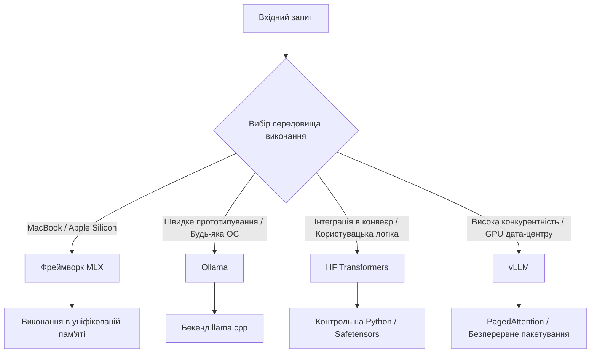

> **Складність**: `[MEDIUM]`
>
> **Час на виконання**: 45–60 хв
>
> **Передумови**: основи відкритих моделей, формати локальних моделей, базовий Python та робоча ментальна модель пам'яті GPU

---

## Що ви зможете робити

- Оцінювати архітектури середовищ виконання, зіставляючи Ollama, MLX, Transformers та vLLM з апаратними обмеженнями, цілями затримки та вимогами конкурентності.
- Порівнювати зручність на робочому столі, нативне виконання на Apple, експериментування з пріоритетом коду та продакшен-обслуговування, не сприймаючи їхні API як взаємозамінні обгортки.
- Проєктувати багатоетапний стек локального інференсу, який переходить від ноутбуків розробників до конвеєрів оцінювання й до продакшен-обслуговування на Kubernetes 1.35+.
- Діагностувати проблеми продуктивності та якості, простежуючи квантування, поведінку токенізатора, тиск KV-кешу, пакетування та вибір апаратного бекенду.

## Чому цей модуль важливий

Гіпотетичний сценарій: платформна команда прототипує внутрішнього асистента для програмування на ноутбуках за допомогою зручного інструменту для локальних моделей, а потім копіює те саме середовище виконання в спільне GPU-середовище, бо перша демонстрація виглядала переконливо. Локальна демонстрація здавалася швидкою, оскільки один розробник надсилав один запит за раз, але спільне середовище отримує сплески від багатьох інженерів, кожен промпт змагається за пам'ять KV-кешу, а середовище виконання не має серйозної стратегії планування для конкурентного трафіку.

Цей сценарій поширений, оскільки зовнішня поверхня виглядає оманливо схожою. Кожен інструмент приймає промпт, завантажує ваги моделі та повертає згенерований текст, тому виникає спокуса описати вибір як смак або пакування. На практиці середовище виконання володіє найскладнішими операційними рішеннями: як представлені ваги, як тензори рухаються в пам'яті, як пакетуються запити, скільки внутрішнього стану видимо та наскільки тісно програмне забезпечення пов'язане з конкретним бекендом прискорювача.

Цей модуль навчає обирати середовище виконання за роботою, яку воно виконує, а не за тим, яка команда першою дала задовільну відповідь. Ви дізнаєтеся, чому Ollama чудова для швидкого входження, чому MLX надзвичайно сильна на Apple Silicon, чому Hugging Face Transformers залишається площиною керування для кастомної роботи з моделями та чому vLLM існує для високопропускного обслуговування, а не для випадкового експериментування на ноутбуці.

Мета — не оголосити універсального переможця. Зріла стратегія інференсу часто використовує більше одного середовища виконання впродовж життєвого циклу тієї самої моделі, так само як програмна команда використовує редактор, засіб запуску тестів, менеджер пакетів і продакшен-оркестратор для різних частин того самого застосунку. Навичка полягає в тому, щоб знати, де кожне середовище виконання перестає бути корисним і де наступний рівень має перебрати естафету.

## Середовище виконання інференсу є частиною архітектури

Середовище виконання інференсу — це програмний рівень, який перетворює ваги моделі на згенеровані токени, але цей простий опис приховує більшу частину інженерної роботи. Середовище виконання має завантажити файли з диска, відобразити тензори на пристрої, скомпілювати або викликати апаратні ядра, виділити тимчасову пам'ять, підтримувати KV-кеш для активного контексту, застосувати правила семплування та надати інтерфейс, який можуть викликати застосунки. Два інструменти можуть запускати ту саму модель із відкритими вагами, роблячи радикально різні вибори на кожному з цих кроків.

Перше практичне питання — де середовище виконання знаходиться на спектрі абстракції. Середовище виконання для зручності на робочому столі оптимізує встановлення, виявлення моделей і стабільний API, який здається легким із будь-якої мови програмування. Фреймворк із пріоритетом коду оптимізує видимість і контроль, навіть коли розробник має керувати більшою кількістю деталей безпосередньо. Середовище виконання для обслуговування оптимізує форму продакшен-трафіку, коли багато запитів надходять одночасно, а утилізація GPU важливіша за одну чисту команду.

```ascii
+-----------------------------------------------------------------------+
|           Спектр абстракції середовища виконання інференсу            |
+----------------------+----------------------+-------------------------+
| Зручність на         | Інженерний контроль  | Продакшен-пропускна     |
| робочому столі       |                      | здатність               |
+----------------------+----------------------+-------------------------+
| - Ollama             | - HF Transformers    | - vLLM                  |
| - LM Studio          | - PyTorch Native     | - TGI (Text Gen Inf)    |
| - MLX (нативно Apple)| - JAX                | - TensorRT-LLM          |
+----------------------+----------------------+-------------------------+
| API-перші            | Код-перші            | Інфраструктура-перші    |
| Орієнтовані на       | Орієнтовані на       | Орієнтовані на SRE      |
| розробників          | дослідників          |                         |
| Абстраговані від     | Обізнані про         | Максимізовані під       |
| апаратного           | апаратне             | апаратне                |
| забезпечення         | забезпечення         | забезпечення            |
+----------------------+----------------------+-------------------------+
```

Діаграма корисна, оскільки вона відокремлює користувацький досвід від операційного наміру. Ollama та подібні інструменти роблять перший промпт легким, що є справжньою інженерною перевагою під час дослідження. Transformers робить внутрішні механізми доступними, що важливо, коли ви вимірюєте, адаптуєте або налагоджуєте модель. vLLM змушує сервер поводитися як рушій пропускної здатності, що важливо, коли простоююча VRAM і фрагментований KV-кеш перетворюються на реальні інфраструктурні витрати.

Заплутаним випадком є MLX, оскільки вона може здаватися і зручною, і з пріоритетом коду залежно від того, як ви її використовуєте. MLX — це не просто обгортка навколо загального бекенду; це [фреймворк машинного навчання, спроєктований навколо Apple Silicon та уніфікованої пам'яті](https://github.com/ml-explore/mlx). Коли цільовим обладнанням є Mac із чипом серії M, MLX може бути нативним шляхом, а не компромісом, особливо для розробників, яким потрібен контроль на рівні Python без боротьби з екосистемою, орієнтованою на CUDA.

Зупиніться та спрогнозуйте: якщо та сама модель дає прийнятні відповіді через хостингову кінцеву точку з повною точністю, але слабші відповіді через локальне середовище виконання на робочому столі, який рівень ви перевірили б першим? Початківець часто одразу звинувачує сімейство моделей, але кориснішими першими перевірками є формат квантування, довжина контексту, сумісність токенізатора, типові параметри семплування та те, чи не вибрав середовище виконання мовчки менший або стиснутіший артефакт.

Вибір середовища виконання також впливає на те, наскільки легко ви можете відтворити помилку. API-перший інструмент може приховати достатньо деталей, щоб дві машини, здавалося б, запускали ту саму модель, використовуючи різні квантовані файли або типові параметри. Інструмент із пріоритетом коду робить конфігурацію явною, але вимагає від інженера більше налаштувань. Інструмент обслуговування може додати безперервне пакетування та планування запитів, що чудово для пропускної здатності, але може зробити налагодження одного запиту менш прямим.

Думайте про середовище виконання як про кухню, а не лише як про офіціанта. Той самий рецепт може мати різний смак, коли його готують на похідній плитці, домашній індукційній плиті чи ресторанній лінії з кількома кухарями, що координують замовлення. Промпт — це замовлення, ваги моделі — це інгредієнти, а середовище виконання вирішує, наскільки швидко, стабільно та спостережувано готується страва.

Саме тому вибір середовища виконання належить до архітектурного огляду, а не лише до нотаток із налаштування розробника. Середовище виконання може зафіксувати формати файлів, вплинути на те, як збираються докази оцінювання, і визначити, чи можуть платформні команди спостерігати за системою під навантаженням. Якщо це рішення приймається недбало, перший серйозний інцидент із продуктивністю чи якістю стає важче пояснити, оскільки команда ніколи не записувала, який рівень за яку поведінку відповідальний.

Найкращі огляди включають питання як щасливого, так і відмовного шляху. Що станеться, коли промпт удвічі довший за демонстраційний, коли десять запитів надходять разом, коли артефакт моделі змінює ревізію або коли розробнику потрібні докази на рівні токенів? Ці питання звучать операційно, але вони також педагогічні, оскільки навчають команду, як середовище виконання насправді формує поведінку моделі.

Найбезпечніша архітектура починається з називання роботи, що стоїть перед вами. Чи намагаєтеся ви допомогти одному розробнику оцінити поведінку моделі сьогодні, дозволити дослідникам інспектувати тензори й адаптери завтра чи обслуговувати багатьох користувачів наступного місяця? Коли робота стає зрозумілою, рішення щодо середовища виконання перетворюється на набір компромісів, а не на дебати про брендові вподобання.

## Простота на робочому столі: Ollama та MLX

Ollama зазвичай є найшвидшим шляхом від цікавості до відповіді локальної моделі в змішаній команді. Вона пакує фоновий сервіс, інтерфейс командного рядка, [керування моделями та HTTP API](https://github.com/ollama/ollama/blob/main/docs/api.md) у робочий процес, що нагадує завантаження та запуск образу контейнера. Це важливо, бо раннє дослідження швидко вмирає, коли кожен розробник мусить налагоджувати драйвери, середовища Python, формати файлів моделей і прапорці бекенду GPU, перш ніж хтось зможе перевірити, чи корисна модель.

Абстракція навмисно товста. Розробник може завантажити модель, викликати локальну кінцеву точку та під'єднати застосунок до OpenAI-подібного потоку, не вивчаючи кожної деталі GGUF, квантування чи параметрів збирання `llama.cpp`. Це правильний компроміс, коли питання в тому, чи може клас моделей узагалі вирішити задачу, адже команді потрібен швидкий цикл зворотного зв'язку більше, ніж ідеальний контроль.

Та сама абстракція стає тягарем, коли дослідження переходить від «чи це виглядає перспективно» до «чому ця відповідь змінилася». Ollama може використовувати квантований артефакт, який комфортно вміщується в споживчу пам'ять, але не відповідає числовій поведінці контрольної точки з повною точністю. Вона також може надавати менше внутрішніх гачків, ніж потрібно досліднику для експериментів із токенізатором, обробки логітів, заміни адаптерів або аналізу прихованих станів.

Важливий урок у тому, що квантування — це не просто стиснення. [Формати з нижчою бітовою глибиною можуть зробити локальний інференс практичним, зменшуючи використання пам'яті та покращуючи пропускну здатність, але вони також змінюють те, наскільки точно представлені ваги.](https://huggingface.co/docs/transformers/en/quantization/bitsandbytes) Багато задач добре толерують цей компроміс, тоді як інші задачі, такі як крихке міркування, точна генерація коду або структуроване видобування за жорстких обмежень, можуть виявити відмінності в якості, які виглядають загадково, доки ви не порівняєте фактичні артефакти.

MLX вирішує іншу локальну проблему. [Машини на Apple Silicon ділять пам'ять між CPU та GPU](https://github.com/ml-explore/mlx), що означає, що стара ментальна модель копіювання тензорів із системної RAM в окремий пул VRAM GPU погано описує обладнання. MLX спирається на цей дизайн уніфікованої пам'яті та надає операції з масивами, утиліти для моделей і приклади, які здаються природними для розробників Python, водночас націлюючись на стек Metal від Apple.

Для команд, де багато Mac, MLX може бути різницею між сприйняттям ноутбука як іграшки та сприйняттям його як серйозної машини для локального експериментування. Mac із великим обсягом пам'яті може запускати навантаження, які були б незручними через загальне CPU-резервування або погано підібрані абстракції GPU. Розробник усе одно мусить поважати тиск пам'яті, теплову поведінку та розмір моделі, але середовище виконання принаймні узгоджене з машиною, а не вдає, що це маленький Linux-сервер із GPU.

Ollama та MLX можуть співіснувати в одній команді. Розробники на Windows і Linux можуть використовувати Ollama для спільного локального API, тоді як розробники на Mac використовують MLX для нативної продуктивності та глибших експериментів. Ризик не в тому, що є два інструменти; ризик у вдаванні, що їхні результати автоматично порівнянні, коли формати файлів, рівні квантування, обробка токенізатора та типові параметри семплування відрізняються.

Перш ніж запускати це локально, який результат ви очікуєте, якщо два розробники викличуть «ту саму» назву моделі з двох різних середовищ виконання? Запишіть, чи очікуєте ви ідентичні токени, схожий зміст або візуально відмінну поведінку, а потім визначте, які параметри мають збігатися, перш ніж результату оцінювання можна буде довіряти. Ця звичка прогнозування врятує вас від сприйняття невідповідності середовищ виконання як відмови моделі.

Практичне операційне правило просте: використовуйте Ollama, коли легкість доступу та стабільність API є головними обмеженнями, і використовуйте MLX, коли нативне виконання на Apple та контроль на рівні Python важливіші за крос-платформну однорідність. Жоден із цих виборів не зобов'язує вас до продакшен-обслуговування, і жоден не повинен використовуватися як єдиний доказ того, що модель готова до розгортання з високою конкурентністю.

Вправа-сценарій: команда юридичних досліджень має п'ять ноутбуків серії M, кілька настільних Windows і поки що жодного спільного кластера GPU. Розумний перший тиждень може використовувати Ollama, щоб дозволити кожному інженеру звертатися до локальної кінцевої точки, MLX, щоб дозволити фахівцям з даних на Mac досліджувати поведінку моделі з нативною продуктивністю, і письмовий контрольний список сумісності для запису точних файлів моделі, довжин контексту та параметрів семплування, використаних у кожному експерименті.

Цей контрольний список сумісності має бути нудним і явним. Він має називати дружню мітку моделі, базовий репозиторій або файл, рівень квантування, контекстне вікно, шаблон промпту та конфігурацію семплування. Коли два розробники не погоджуються щодо якості, контрольний список перетворює дискусію з суб'єктивних вражень на контрольоване порівняння, яке можна повторити.

Локальні середовища виконання також потребують бюджетів ресурсів, навіть якщо вони не є продакшен-системами. Ноутбук, що запускає модель, усе одно конкурує з редактором, вкладками браузера, контейнерними інструментами та відеодзвінками. Якщо середовище виконання агресивно використовує пам'ять, розробник може відчути тиск операційної системи, який виглядає як затримка моделі, але насправді це вся машина бореться за те, щоб залишатися чуйною.

Практичний компроміс — починати з малого й чесно вимірювати. Використовуйте меншу модель або важче квантування для службової логіки застосунку, а потім резервуйте більші або менш стиснуті артефакти для цільових перевірок якості. Це не дає команді переконати себе, що локальний інференс ненадійний, коли справжня проблема в тому, що кожен ноутбук просили поводитися як виділений сервер-прискорювач.

## Інженерний контроль: Hugging Face Transformers

Hugging Face Transformers знаходиться нижче в стеку, ніж API-перше локальне середовище виконання. Замість того, щоб просити демон «запустити цю модель», ви зазвичай [створюєте екземпляр токенізатора, завантажуєте клас моделі, розміщуєте тензори на пристрої, конфігуруєте генерацію та викликаєте модель безпосередньо з Python](https://huggingface.co/docs/transformers/en/quicktour). Ця додаткова церемонія не випадкова; саме вона дає інженеру здатність досліджувати та контролювати шлях моделі.

Transformers — правильний інструмент, коли ваше питання стосується механіки інференсу, а не лише результату застосунку. Ви можете перевірити, чи змінила токенізація межу промпту, [примусово встановити детерміновану генерацію для оцінювання](https://huggingface.co/docs/transformers/en/generation_strategies), захопити оцінки на рівні токенів, експериментувати зі стратегіями декодування та під'єднати виконання моделі до решти екосистеми машинного навчання Python. Ці можливості важливі, коли команда будує повторюваний конвеєр оцінювання або діагностує, чому модель не справляється з конкретними прикладами.

Ціною є те, що Transformers не є автоматично продакшен-сервером. Прямолінійний скрипт може бути зрозумілим і коректним, водночас обробляючи запити неефективно, залишаючи утилізацію GPU низькою, а поведінку пам'яті поганою за конкурентності. Це прийнятно для задач оцінювання, експериментів із тонким налаштуванням і контрольованого пакетного аналізу, але зазвичай це неправильна форма кінцевої точки для користувацького сервісу, який має обробляти багато перекривних розмов.

Transformers також стає незамінним, коли в гру входять адаптери та кастомізація. Якщо команда навчає адаптер LoRA для внутрішнього стилю SQL, мови контрактів або відповідей з усунення несправностей Kubernetes, хтось мусить [завантажити базову модель, приєднати або злити адаптер](https://huggingface.co/docs/peft/index) та оцінити, чи покращила зміна цільову поведінку без порушення базового рівня. Цей робочий процес потребує програмного доступу до моделі та токенізатора, а не лише загальної кінцевої точки для промптів.

Ось навмисно маленький приклад тієї явності, яку надає інференс із пріоритетом коду. Сенс не в тому, що кожен модуль має використовувати саме цю модель чи налаштування пристрою, а в тому, що середовище виконання робить вибори генерації видимими в коді. Рецензент може побачити ідентифікатор моделі, шлях токенізатора, максимальну кількість нових токенів, вибір детермінованого семплування та відображення пристрою замість того, щоб гадати, що вибрав фоновий сервіс.

```python
from transformers import AutoModelForCausalLM, AutoTokenizer

model_id = "Qwen/Qwen2.5-0.5B-Instruct"

tokenizer = AutoTokenizer.from_pretrained(model_id)
model = AutoModelForCausalLM.from_pretrained(model_id, device_map="auto")

prompt = "Поясніть, коли локальне середовище виконання інференсу слід змінювати між прототипом і продакшеном."
inputs = tokenizer(prompt, return_tensors="pt").to(model.device)

outputs = model.generate(
    **inputs,
    max_new_tokens=120,
    do_sample=False,
)

print(tokenizer.decode(outputs[0], skip_special_tokens=True))
```

Такого роду скрипт цінний для контрольованого вимірювання, оскільки кожен важливий вибір можна версіонувати разом із кодом оцінювання. Якщо відповідь моделі змінюється, команда може дослідити ревізію моделі, ревізію токенізатора, параметри генерації, версію бібліотеки та апаратне відображення. Це не усуває весь недетермінізм, але дає дослідженню площу поверхні, яка значно багатша за «кінцева точка сьогодні повернула інше речення».

Transformers — це також місце, де багато меж форматів стають явними. Репозиторії моделей можуть містити файли Safetensors, JSON токенізатора, конфігурацію моделі, конфігурацію генерації та файли адаптерів. Середовище виконання на робочому столі може натомість споживати конвертований файл GGUF, що корисно для локальної швидкості, але може приховати зв'язок між оригінальною контрольною точкою та тестованим артефактом.

Який підхід ви обрали б тут і чому: нічне завдання оцінювання, яке перевіряє фіксований набір промптів на трьох кандидатних адаптерах, чи кінцеву точку чату, яка має обслуговувати сотні користувачів протягом робочого дня? Перша задача потребує контролю, повторюваності та прозорого оцінювання, тому Transformers добре підходить. Друга задача потребує керування конкурентністю та серверної ергономіки, тому середовище виконання для обслуговування є кращою ціллю.

Зрілий патерн — дозволити Transformers володіти істиною оцінювання, навіть коли інше середовище виконання володіє зручністю розробника. Команда може прототипувати через Ollama, запускати експерименти з адаптерами через Transformers, а пізніше обслуговувати через vLLM, якщо вона записує, як саме артефакти переходять між цими рівнями. Без цього запису команда може несвідомо порівнювати квантований артефакт для робочого столу з неквантованою контрольною точкою оцінювання та зробити хибний висновок.

Transformers також дає рецензентам місце для кодування критеріїв прийняття. Шлюз якості може стверджувати, що модель генерує валідний JSON для структурованого видобування, уникає забороненого патерну відповіді або утримує оцінку вище порогу на курованому наборі даних. Ці перевірки значно легше підтримувати, коли шлях середовища виконання — це звичайний код із зафіксованими залежностями, а не ручна розмова з десктопним застосунком.

Компроміс — це супровід. Версії залежностей Python, бібліотеки прискорювачів і зміни репозиторіїв моделей можуть впливати на конвеєр із пріоритетом коду, тому команда має ставитися до середовища оцінювання як до інфраструктури, наближеної до продакшену. Файли блокувань, образи контейнерів, зафіксовані ревізії моделей і детерміновані набори тестових даних — це не бюрократія; це механізм, який робить порівняння моделей осмисленими в часі.

Ще один корисний патерн — відокремлювати дослідницькі ноутбуки від скриптів оцінювання. Ноутбук чудовий для навчання, візуалізації та швидких експериментів, але він може приховувати стан між комірками та ускладнювати відтворення результатів. Скрипт або невеликий пакет може імпортувати ті самі утиліти моделі, водночас змушуючи кожен вхід, вихід і вибір конфігурації бути видимими для рецензентів.

## Продакшен-пропускна здатність: vLLM

Продакшен-обслуговування змінює питання з «чи може ця модель відповісти на один промпт» на «чи може ця система підтримувати багато активних розмов без марнування прискорювача». Великі мовні моделі споживають пам'ять не лише для ваг; [кожен активний запит також споживає пам'ять KV-кешу, яка зростає з довжиною контексту та згенерованими токенами](https://arxiv.org/abs/2309.06180). Коли запити перекриваються, керування KV-кешем стає одним із головних визначників того, скільки користувачів може підтримувати GPU.

Наївне пакетування неефективне, оскільки запити мають різну довжину промптів і завершуються в різний час. Якщо сервер чекає, поки весь пакет завершиться, перш ніж приймати нову роботу, швидкі запити затримуються повільними. Якщо він резервує великі неперервні блоки KV-кешу для кожної можливої максимальної довжини контексту, короткі запити марнують пам'ять, яка могла б обслужити інших користувачів.

vLLM існує, щоб вирішити цю проблему обслуговування. Її найвідоміша ідея, [PagedAttention, запозичує з підходу сторінкової пам'яті операційних систем, зберігаючи KV-кеш у блоках, а не вимагаючи одного великого неперервного виділення на запит](https://arxiv.org/abs/2309.06180). Це дозволяє середовищу виконання зменшити фрагментацію та утримувати більше активних послідовностей у пам'яті, що є значною перевагою, коли продакшен-трафік включає суміш коротких питань, довгих документів і згенерованих наступних відповідей.

Безперервне пакетування — інша ключова концепція. Замість того, щоб розглядати пакет як статичну групу, що починається й завершується разом, сервер може [додавати нові запити в міру завершення інших](https://github.com/vllm-project/vllm). GPU витрачає більше часу на корисну роботу, а рівень обслуговування має кращі шанси згладити сплески, не змушуючи кожного клієнта чекати за найповільнішим промптом у старому пакеті.



Діаграма показує, чому vLLM — це не просто «швидший». Він оптимізований для висококонкурентного обслуговування на бекендах прискорювачів, які відповідають його припущенням щодо ядер і планування. Якщо ви змусите його в робочий процес на ноутбуці, де один розробник надсилає один промпт за раз, додаткова серверна механіка може додати складності, не показуючи переваг, які її виправдовують.

Це не означає, що розробники повинні ігнорувати vLLM до тижня запуску. Команди, які планують продакшен-обслуговування на Kubernetes 1.35+, повинні тестувати vLLM достатньо рано, щоб виявити сумісність моделей, профілі пам'яті, [образи контейнерів, поведінку OpenAI-сумісного API](https://github.com/vllm-project/vllm) та потреби спостережуваності. Помилка — використовувати vLLM як повсякденне середовище виконання для ноутбука, а не використовувати його як продакшен-кандидата.

Ось невеликий ескіз розгортання Kubernetes для контейнера обслуговування в стилі vLLM. Сприймайте його як форму для міркування, а не як універсальний маніфест, адже реальні кластери потребують селекторів вузлів, класів середовища виконання, політики образів, постійного сховища моделей, автентифікації, автомасштабування та рішень щодо спостережуваності, які залежать від платформи.

```yaml
apiVersion: apps/v1
kind: Deployment
metadata:
  name: coding-assistant-vllm
  labels:
    app: coding-assistant-vllm
spec:
  replicas: 1
  selector:
    matchLabels:
      app: coding-assistant-vllm
  template:
    metadata:
      labels:
        app: coding-assistant-vllm
    spec:
      containers:
        - name: vllm
          image: vllm/vllm-openai:latest
          args:
            - --model
            - Qwen/Qwen2.5-7B-Instruct
            - --max-model-len
            - "8192"
          ports:
            - containerPort: 8000
          resources:
            limits:
              nvidia.com/gpu: "1"
```

Маніфест виявляє ще один компроміс: продакшен-обслуговування більше не є лише рішенням на Python. Команда мусить думати про планування GPU, стратегію завантаження моделі, час запуску контейнера, автентифікацію запитів, безпеку розгортання, зонди готовності та те, як пам'ять моделі поводиться під час планових оновлень. vLLM допомагає з пропускною здатністю інференсу, але платформа все одно має керувати життєвим циклом навколо нього.

Налагодження vLLM також вимагає іншого інстинкту, ніж налагодження локальної обгортки. Коли затримка зростає під навантаженням, ви досліджуєте час у черзі, склад пакета, довжину промптів, максимальну довжину моделі, утилізацію KV-кешу, запас пам'яті GPU та те, чи клієнти стримлять відповіді чи чекають повних завершень. Це питання системи обслуговування, а не лише питання якості моделі.

Корисне правило — відокремлювати семантичну якість від якості обслуговування. Якщо модель дає неправильну відповідь за детермінованого оцінювання, vLLM, ймовірно, не є першим підозрюваним. Якщо та сама модель відповідає правильно під час оцінювання, але вилітає за тайм-аутом або падає під час конкурентного трафіку, тоді конфігурація vLLM, довжина моделі, тиск пам'яті та поведінка планування стають центральними для діагнозу.

Готовність до продакшену також вимагає спостереження за рівнем обслуговування в термінах, які розуміє середовище виконання. Запитів за секунду недостатньо, оскільки два запити можуть драматично відрізнятися за токенами промпту, згенерованими токенами та перебуванням у кеші. Кращі панелі розрізняють час попереднього заповнення, час декодування, час у черзі, пропускну здатність за токенами, категорії помилок і запас пам'яті, оскільки кожна метрика вказує на інше операційне виправлення.

Планування потужності має використовувати реалістичний трафік, а не лише бенчмаркові промпти. Синтетичний промпт із коротким питанням може зробити сервер здоровим на вигляд, тоді як реальний застосунок надсилає отримані пошуком документи, історію чату та інструкції з форматування в кожному запиті. Якщо цільовий застосунок важкий на витягування, навантажувальний тест має включати витягнуті блоки контексту та ті самі максимальні параметри генерації, які використовуватимуть продакшен-клієнти.

Обслуговування також змінює ризик розгортання. Випуск нової моделі може тимчасово подвоїти потреби в пам'яті, якщо старі та нові поди перекриваються, а повільний холодний старт може зробити автомасштабувальник неефективним на вигляд. Платформні інженери повинні планувати завантаження образів, завантаження моделей, поведінку готовності та стратегію відкату з тією ж серйозністю, яку вони приділяють будь-якому сервісу зі станом або важкому на ресурси.

## Практичний приклад: стратегія інференсу з кількома середовищами виконання

Вправа-сценарій: стартап будує асистента для юридичних документів із пошуковим доповненням. П'ять фахівців з даних використовують MacBook серії M, десять програмних інженерів використовують настільні Windows, а продакшен працюватиме в керованому кластері Kubernetes 1.35+ із GPU NVIDIA дата-центру. Команді потрібні локальна розробка, експерименти з адаптерами, детерміноване оцінювання та продакшен-обслуговування без вдавання, що одне середовище виконання найкраще для кожної фази.

Перша фаза — входження розробників. Інженерам на Windows потрібна швидка локальна кінцева точка, щоб вони могли будувати потоки застосунку, тестувати шаблони промптів і практикувати обробку відмов без очікування спільної потужності GPU. Ollama підходить, оскільки зменшує роботу з налаштування, дає застосунку передбачуваний локальний API і дозволяє інженерам завантажити достатньо малу квантовану модель, яка працює поруч із їхнім редактором і браузером.

Фахівці з даних на Mac отримують інший шлях. Вони використовують MLX для локального нативного експериментування на Apple, коли їм потрібна швидка ітерація на обладнанні серії M, особливо під час тестування менших моделей, конвертацій або циклів локального аналізу. Цей вибір поважає обладнання, а не змушує кожен ноутбук в одну абстракцію заради акуратності процесу.

Конвеєр оцінювання використовує Transformers, оскільки оцінювання — це місце, де приховані типові значення стають небезпечними. Команда фіксує ревізії моделей, ревізії токенізатора, параметри генерації, версії адаптерів і набори даних для оцінювання. Потім вона може порівнювати базову контрольну точку, контрольну точку з адаптером LoRA та квантований локальний артефакт, явно вказуючи, що змінилося.

Продакшен-шлях використовує vLLM, оскільки кластер має обслуговувати багатьох юридичних працівників та інженерів конкурентно. Довгі юридичні уривки створюють високий тиск KV-кешу, а використання може надходити сплесками навколо циклів перегляду документів. PagedAttention і безперервне пакетування безпосередньо адресують цю форму навантаження, тоді як Kubernetes обробляє планування та проблеми життєвого циклу навколо подів обслуговування.

Потік артефактів — це клей. Модель може починатися як файли Safetensors у репозиторії хабу моделей, проходити через навчання адаптера та оцінювання в Transformers, бути конвертованою в артефакт GGUF для експериментування на робочому столі та обслуговуватися з сумісної контрольної точки через vLLM у продакшені. Команда має документувати кожну конвертацію, оскільки артефакт є частиною вимірювання, а не виноскою.

```text
+----------------------+     +----------------------+     +----------------------+
| Mac фахівців з даних  |     | Конвеєр оцінювання   |     | Продакшен-кластер    |
| Експерименти MLX     | --> | Контроль Transformers| --> | Обслуговування vLLM  |
| локальні ноутбуки    |     | зафіксовані ревізії  |     | безперервне          |
+----------------------+     +----------------------+     | пакетування          |
          |                             ^                  +----------------------+
          v                             |
+----------------------+                |
| Робочі столи         |                |
| розробників          |                |
| Локальний API Ollama | ---------------+
| Димові тести GGUF    |
+----------------------+
```

Ця архітектура має очевидний ризик: дрейф оцінювання. Якщо розробники тестують квантований артефакт GGUF через Ollama, фахівці з даних досліджують конвертований артефакт MLX, а CI оцінює контрольну точку Safetensors через Transformers, команда може випадково порівнювати три пов'язані, але різні системи. Пом'якшенням є запис релізу, який називає вихідну контрольну точку, команди конвертації, рівень квантування, ревізію токенізатора, ревізію адаптера та специфічні для середовища виконання параметри генерації.

Ще один ризик — надмірне припасування плану розгортання до першої моделі. Модель на сім мільярдів параметрів може комфортно вміщатися в кількох середовищах виконання, тоді як значно більша модель може вимагати іншого квантування, тензорного паралелізму, обмежень контексту або апаратних виборів. Фреймворк рішень слід переглядати щоразу, коли змінюються розмір моделі, контекстне вікно, ціль конкурентності або парк обладнання.

Практичний приклад також показує, чому «стандартизувати одне середовище виконання» може бути хибним інстинктом управління. Стандартизуйте інтерфейси, записи оцінювання, іменування артефактів і критерії прийняття. Дозвольте середовищу виконання змінюватися там, де змінюється робота, і зробіть цю варіацію достатньо видимою, щоб інженери могли міркувати про якість, вартість і продуктивність без здогадок.

Команда також має визначити, що означає «та сама модель», перш ніж будь-який результат буде прийнято. У невимушеній розмові це може означати те саме сімейство моделей, але в інженерному огляді це має означати вихідну контрольну точку, файли токенізатора, стан адаптера, процес конвертації, вибір квантування та конфігурацію генерації. Це суворіше визначення не дає димовому тесту на робочому столі бути надмірно інтерпретованим як доказ продакшен-якості.

Нарешті, приклад демонструє, чому передача між ролями має значення. Інженерам застосунку потрібна кінцева точка, яка дає їм змогу рухатися далі, фахівцям з даних потрібен достатній внутрішній контроль для покращення поведінки, а платформним інженерам потрібен стек обслуговування, який може витримати реальний трафік. План середовищ виконання, який поважає всі три групи, виглядатиме дещо складнішим на папері, але створить менше сюрпризів під час постачання.

## Патерни й антипатерни

Хороший вибір середовища виконання починається з явної межі етапу. Прототипна робота цінує швидке встановлення та широкий доступ, оцінювання цінує відтворюваність і контроль, дослідження цінує внутрішні гачки, а продакшен цінує пропускну здатність та операційну видимість. Коли ці межі записані, команди можуть змінювати середовища виконання свідомо, а не виявляти невідповідність під час дедлайну.

| Патерн | Коли використовувати | Чому це працює | Міркування щодо масштабування |
|---|---|---|---|
| Прототипування зі зручним середовищем виконання | Раннє дослідження продукту та змішані робочі станції розробників | Мінімізує вартість налаштування та дозволяє швидко почати роботу над застосунком | Записуйте артефакт моделі, квантування, довжину контексту та типові параметри семплування перед порівнянням результатів |
| Оцінювання з контролем через код | Золоті набори даних, порівняння адаптерів, перевірки токенізатора, регресійні тести | Робить параметри генерації та ревізії моделей явними | Тримайте код оцінювання близько до набору даних і версіонуйте кожен конфігураційний файл |
| Обслуговування з середовищем виконання для пропускної здатності | Спільні API, конкурентні користувачі, довгі контексти, дорогі GPU | Оптимізує використання KV-кешу та планування запитів | Додайте платформну спостережуваність для часу в черзі, пропускної здатності за токенами, пам'яті та частоти помилок |
| Розділення форматів артефактів за призначенням | Димові тести на робочому столі, оцінювання в CI та продакшен-обслуговування | Кожен формат може відповідати цільовому середовищу виконання без вдавання, що всі файли еквівалентні | Ведіть запис релізу, який відображає кожен конвертований артефакт назад до вихідної контрольної точки |

Найсильніший антипатерн — обрати середовище виконання, яке зробило першу демонстрацію найлегшою, а потім захищати цей вибір назавжди. Раннє тертя має значення, але продакшен-обмеженням дозволено бути іншими. Хороший інженер може цінувати інструмент, який уможливив навчання, водночас замінюючи його, коли навантаження змінюється.

| Антипатерн | Що йде не так | Краща альтернатива |
|---|---|---|
| Сприйняття назв моделей як точних артефактів | Різні середовища виконання можуть розв'язуватися в різні файли, рівні квантування або ревізії | Фіксуйте точні ревізії та записуйте формати файлів у нотатках оцінювання |
| Використання vLLM як повсякденного середовища виконання для ноутбука | Механіка обслуговування додає складності без переваг конкурентності на рівні ноутбука | Використовуйте MLX на Apple Silicon або Transformers для локальних експериментів на рівні коду |
| Використання Ollama як єдиної істини оцінювання | Приховані типові значення та стиснуті артефакти можуть спотворювати порівняння якості | Відтворюйте важливі оцінки через Transformers із зафіксованими параметрами |
| Ігнорування відмінностей токенізаторів | Межі промптів і спеціальні токени можуть змінювати поведінку моделі | Тестуйте токенізацію безпосередньо, перш ніж звинувачувати сімейство моделей |
| Невимушене порівняння затримки стримінгу та нестримінгу | Затримка, яку сприймає користувач, і загальний час генерації відповідають на різні питання | Вимірюйте час до першого токена та загальну кількість токенів за секунду окремо |
| Обслуговування навантажень із довгим контекстом без планування KV-кешу | Тиск пам'яті з'являється лише тоді, коли приходять реальні промпти та конкурентні користувачі | Проводьте навантажувальне тестування з реалістичними довжинами промптів та перевіряйте утилізацію кешу |

Рішення не лише технічне; воно також впливає на те, як команди спілкуються. Якщо інженери продукту, фахівці з даних та платформні інженери всі кажуть «ми запустили модель», але мають на увазі три різні артефакти через три різні середовища виконання, розмова стає шумною. Спільна матриця середовищ виконання перетворює це розпливчасте твердження на конкретне, яке можна переглянути.

## Фреймворк прийняття рішень

Почніть вибір середовища виконання з чотирьох питань: яке обладнання доступне, скільки потрібно контролю, скільки конкурентних користувачів існує та які докази має надати результат. Якщо відповідь — «один розробник на змішаному парку ноутбуків тестує поведінку застосунку», Ollama зазвичай виграє. Якщо відповідь — «розробникам на Mac потрібні нативні локальні експерименти», MLX заслуговує на серйозний розгляд. Якщо відповідь — «ми мусимо досліджувати та оцінювати поведінку моделі», Transformers є типовим вибором. Якщо відповідь — «багато користувачів ділитимуть GPU», vLLM належить до дизайну.

| Сигнал для рішення | Надавайте перевагу Ollama | Надавайте перевагу MLX | Надавайте перевагу Transformers | Надавайте перевагу vLLM |
|---|---|---|---|---|
| Основне обладнання | Змішані ноутбуки та настільні комп'ютери | Apple Silicon | Будь-яка підтримувана ML-робоча станція або CI-робітник | Linux-сервери з GPU |
| Головна мета | Швидкий локальний API та входження | Нативна локальна продуктивність на Apple | Контроль, дослідження, оцінювання, адаптери | Конкурентне обслуговування та пропускна здатність |
| Стиль артефакту | Часто GGUF або керовані локальні завантаження | Сумісні з MLX ваги та конвертації | Контрольні точки хабу, Safetensors, адаптери | Підтримувані контрольні точки обслуговування |
| Ціль конкурентності | Один або кілька локальних користувачів | Один локальний користувач або цикл ноутбука | Пакетні завдання та контрольовані скрипти | Багато перекривних клієнтських запитів |
| Поверхня налагодження | Вхідні дані API, типові значення, вибір файлу моделі | Код Python і поведінка бекенду Apple | Токенізатор, тензори, логіти, адаптери | Черги, пакетування, KV-кеш, пам'ять GPU |

Фреймворк стає надійнішим, коли ви розділяєте типи затримки. Час до першого токена важливий для інтерактивного чату, оскільки користувачі гостро відчувають першу паузу. Загальна кількість токенів за секунду важлива під час генерації довгих відповідей. Хвостова затримка важлива для продакшену, оскільки найповільніші запити формують довіру користувачів, особливо коли промпти сильно відрізняються за довжиною.

Використовуйте Ollama, коли проблема — це доступ. Розробник повинен мати змогу запустити локального асистента, протестувати шаблон промпту та побудувати обробку помилок без подання заявки на GPU. Не використовуйте її як остаточний доказ якості, якщо не можете показати, що артефакт, токенізатор і параметри генерації збігаються з системою, яку ви збираєтеся випускати.

Використовуйте MLX, коли проблема — зробити Apple Silicon продуктивним. Розробники на Mac не повинні вдавати, що їхні машини є CUDA-серверами, і MLX дає їм фреймворк, який відповідає обладнанню більш безпосередньо. Не припускайте, що результати MLX автоматично порівнянні з продакшен-шляхом на Linux GPU, якщо конвертація та параметри генерації не задокументовані.

Використовуйте Transformers, коли проблема — це докази. Оцінювання, робота з адаптерами, кастомне декодування, дослідження токенізатора та відтворюваність — усе виграє від контролю на рівні коду. Не виставляйте простий скрипт як спільний продакшен-сервіс, якщо ви навмисно не побудували відсутній рівень обслуговування навколо нього.

Використовуйте vLLM, коли проблема — це спільна пропускна здатність. Середовище виконання спроєктоване навколо ефективного обслуговування багатьох запитів, особливо коли пам'ять KV-кешу та пакетування визначають вартість. Не обирайте його лише тому, що він звучить більш «продакшеново», якщо ваша поточна задача — це цикл локального дослідження для одного користувача.

Наведений нижче потік — це компактний спосіб переглянути пропозицію середовища виконання під час дизайн-рев'ю. Він навмисно запитує про навантаження перед уподобаннями, оскільки вподобання, сформовані під час успішної демонстрації, можуть бути липкими. Якщо дві гілки здаються правдоподібними, запустіть невеликий бенчмарк і невелике оцінювання якості, а не дебатуйте на основі лише інтуїції.

```text
Початок
  |
  +-- Потрібно багато конкурентних користувачів на спільних GPU-серверах?
  |       |
  |       +-- так --> кандидат vLLM, навантажувальний тест із реалістичними довжинами контексту
  |       |
  |       +-- ні
  |
  +-- Потрібен контроль токенізатора, адаптера, логітів або детермінованого оцінювання?
  |       |
  |       +-- так --> кандидат Transformers, зафіксуйте ревізії та конфігурацію генерації
  |       |
  |       +-- ні
  |
  +-- Основне локальне обладнання — Apple Silicon і важлива нативна продуктивність?
  |       |
  |       +-- так --> кандидат MLX, документуйте конвертацію та тиск пам'яті
  |       |
  |       +-- ні --> кандидат Ollama, запишіть артефакт і деталі квантування
```

Останнє питання дизайн-рев'ю — чи є межа середовища виконання оборотною. Здоровий прототип повинен мати змогу перейти в оцінювання та обслуговування без втрати відстежуваності вихідної контрольної точки. Якщо вибір інструменту унеможливлює назвати артефакт, відтворити шлях токенізатора або пояснити зміну якості, зручність стала технічним боргом.

Коли пропозиція близька, запустіть два невеликі експерименти замість сперечання на основі репутації інструменту. По-перше, запустіть порівняння якості з зафіксованими промптами та ідентичними параметрами генерації, де це можливо. По-друге, запустіть порівняння навантаження, використовуючи довжини промптів і конкурентність, що нагадують цільове середовище. Переможець — середовище виконання, яке надає потрібні вам докази на тому етапі, на якому ви перебуваєте.

Фреймворк прийняття рішень має жити разом із документацією сервісу, а не в приватному чаті. Майбутні супровідники мають знати, чому команда обрала Ollama для входження на робочому столі, MLX для експериментів на Mac, Transformers для оцінювання чи vLLM для обслуговування. Письмове обґрунтування полегшує пізніші міграції, оскільки команда може побачити, які з початкових припущень змінилися.

Ще одна фінальна звичка рев'ю — запитати, які докази змусили б вас скасувати рішення. Якщо зручне середовище виконання починає приховувати занадто багато деталей, перемістіть навантаження в бік Transformers. Якщо шлях оцінювання з пріоритетом коду випадково стає спільним сервісом, перемістіть кінцеву точку в бік vLLM. Якщо експерименти на Mac неодноразово розходяться з продакшен-доказами, посиліть відображення артефактів, а не сперечайтеся по пам'яті.

Ця звичка не дає рішенню щодо середовища виконання стати особистим. Інструменти швидко змінюються, парки обладнання еволюціонують, а формати моделей покращуються, тому довговічною навичкою є не запам'ятовування одного постійного рейтингу. Довговічна навичка — це зіставлення середовища виконання з доказами, навантаженням і обладнанням, що стоять перед вами, з подальшим залишенням достатньої документації, щоб наступний інженер міг перевірити цей вибір.

## Чи знали ви?

- Проєкт `llama.cpp`, який живить багато середовищ виконання для робочого столу, спочатку був написаний на чистому C/C++ одним розробником за лічені дні після початкового витоку ваг LLaMA.
- Фреймворк MLX від Apple навмисно [віддзеркалює дизайн API NumPy та PyTorch](https://github.com/ml-explore/mlx), що робить його відразу знайомим для розробників Python, водночас компілюючи операції для обладнання Apple під капотом.
- Hugging Face Transformers завантажує ваги моделей і кешує їх локально; інтенсивне експериментування з різними моделями без очищення цього кешу може мовчки спожити сотні гігабайтів дискового простору.
- Стаття про PagedAttention від vLLM повідомила, що ця техніка може [зменшити марнування пам'яті KV-кешу до менш ніж 4 відсотків в оцінених умовах обслуговування](https://arxiv.org/abs/2309.06180), змінюючи економіку хостингу моделей із відкритими вагами.

## Поширені помилки

Помилки середовища виконання зазвичай походять від відповіді на неправильне питання. Інструмент може бути чудовим для одного етапу і все одно бути неправильним для наступного, особливо коли команда переходить від одного розробника до повторюваного набору оцінювання, до спільного продакшен-сервісу. Таблиця нижче написана як контрольний список рев'ю, а не як список звинувачень, оскільки більшість цих невдач є нормальними побічними ефектами успішних прототипів.

| Помилка | Чому це трапляється | Як виправити |
|---|---|---|
| Вимога універсального переможця | Здається ефективним стандартизувати до того, як навантаження зрозуміле. | Обирайте за етапом: зручність для входження, контроль для оцінювання, пропускна здатність для обслуговування. |
| Порівняння назв моделей замість артефактів | Різні середовища виконання можуть розв'язувати ту саму дружню назву в різні файли або ревізії. | Записуйте вихідну контрольну точку, формат файлу, рівень квантування, ревізію токенізатора та конфігурацію генерації. |
| Сприйняття виводу Ollama як продакшен-доказу | Локальний артефакт може бути стиснутим і прихованим за типовими значеннями середовища виконання. | Повторно запускайте критичні оцінювання через зафіксований конвеєр Transformers, перш ніж робити заяви про якість. |
| Запуск vLLM там, де конкурентність не є проблемою | Продакшен-інструментарій звучить зріло, навіть коли локальний робочий процес є однокористувацьким. | Використовуйте vLLM для тестів обслуговування, а MLX або Transformers — для локального дослідження. |
| Ігнорування архітектури Apple Silicon | Загальні поради щодо GPU часто припускають окрему пам'ять CPU та поведінку NVIDIA CUDA. | Використовуйте MLX, коли нативне виконання на Mac і поведінка уніфікованої пам'яті є центральними для робочого процесу. |
| Забування про тиск KV-кешу | Модель вміщується під час одного тестового промпту, тому команда припускає, що продакшен-трафік теж вміститься. | Проводьте навантажувальне тестування з реалістичними довжинами промптів, довжинами генерації та конкурентними сесіями. |
| Змішування параметрів оцінювання між середовищами виконання | Типові значення для температури, top-p, шаблонів і спеціальних токенів відрізняються між інструментами. | Створіть матрицю середовищ виконання та зробіть так, щоб кожен рядок оцінювання називав свої точні параметри. |

## Тест

<details>
<summary>Питання 1: Ваша команда прототипувала асистента підтримки через Ollama, а потім CI-оцінювання з використанням Transformers видає інші відповіді на ті самі промпти. Що ви перевіряєте, перш ніж оголосити модель нестабільною?</summary>

Перевірте точні артефакти, ревізії токенізатора, шаблон промпту, рівень квантування та параметри генерації, використані в обох шляхах. Ollama може обслуговувати квантований файл GGUF із типовими значеннями, які відрізняються від повної контрольної точки, оціненої через Transformers. Правильна відповідь — зробити два запуски порівнянними, перш ніж судити про стабільність моделі, оскільки межа середовища виконання може змінювати поведінку, навіть коли дружня назва моделі виглядає однаково.
</details>

<details>
<summary>Питання 2: Команда фахівців з даних, де багато Mac, хоче локальні експерименти з моделями з контролем на Python і високою продуктивністю на Apple Silicon. Чому MLX є кращим першим кандидатом, ніж примусове нав'язування стеку обслуговування, орієнтованого на CUDA, на кожен ноутбук?</summary>

MLX спроєктована навколо Apple Silicon та уніфікованої пам'яті, тому вона узгоджується з обладнанням, яке команда насправді має. Стек обслуговування, орієнтований на CUDA, може бути цінним пізніше на Linux-серверах із GPU, але він додає тертя на ноутбуці, не надаючи переваги високої конкурентності, яка виправдовує його складність. Краще рішення — використовувати MLX для нативних локальних експериментів і документувати будь-який шлях конвертації, потрібний для пізнішого оцінювання чи обслуговування.
</details>

<details>
<summary>Питання 3: Інженер продукту просить виставити простий скрипт Transformers як продакшен-кінцеву точку команди, оскільки він дає найкращу видимість оцінювання. Яке архітектурне занепокоєння ви повинні висловити?</summary>

Transformers дає чудовий контроль, але прямолінійний скрипт не є автоматично високопропускним сервером. Продакшен-трафік потребує планування запитів, поведінки пакетування, керування пам'яттю, перевірок здоров'я, автентифікації та операційних метрик. Скрипт оцінювання може залишатися джерелом істини для якості, тоді як середовище виконання для обслуговування, таке як vLLM, обробляє конкурентну кінцеву точку.
</details>

<details>
<summary>Питання 4: Під час навантажувального тесту vLLM затримка зростає лише тоді, коли користувачі вставляють довгі документи, хоча ваги моделі легко вміщуються в пам'ять GPU. Що вам слід дослідити?</summary>

Дослідіть тиск KV-кешу, максимальну довжину моделі, розподіл довжини промптів, час у черзі, склад пакета та доступний запас пам'яті GPU. Те, що ваги вміщуються в пам'ять, доводить лише те, що статична модель може завантажитися; активні контексти споживають додаткову пам'ять у міру просування запитів. vLLM допомагає керувати цим через PagedAttention і безперервне пакетування, але конфігурація все одно має відповідати реальним довжинам промптів.
</details>

<details>
<summary>Питання 5: Менеджер хоче одне середовище виконання для робочих столів, оцінювання та продакшену, щоб спростити документацію. Як би ви аргументували стратегію з кількома середовищами виконання, не створюючи хаосу?</summary>

Подайте середовище виконання як інструмент для конкретного етапу та стандартизуйте записи передачі замість того, щоб примушувати до ідентичного виконання всюди. Робочим столам потрібен доступ, оцінюванню — контроль, а продакшену — пропускна здатність, тому одне середовище виконання може оптимізувати неправильну річ на двох із цих етапів. Механізмом проти хаосу є запис релізу, який називає артефакти, ревізії, конвертації, версії токенізатора та параметри генерації впродовж життєвого циклу.
</details>

<details>
<summary>Питання 6: Локальний результат Ollama має нижчу якість, ніж хостингова кінцева точка для того самого сімейства моделей. Яке пояснення більш імовірне, ніж «сімейство моделей погане», і як це перевірити?</summary>

Імовірне пояснення — локальне середовище виконання використовує більш агресивно квантований артефакт, інше обмеження контексту, інший шаблон промпту або інші типові параметри семплування. Перевірте це, визначивши точний локальний файл, порівнявши поведінку токенізатора, зафіксувавши параметри генерації та оцінивши найближчу доступну повну контрольну точку через Transformers. Якщо розрив у якості слідує за артефактом або параметрами, причиною був шлях середовища виконання.
</details>

<details>
<summary>Питання 7: Ваш продакшен-сервіс на Kubernetes 1.35+ використовує vLLM, але дослідникам потрібно дослідити оцінки на рівні токенів для проблемного промпту. Яке середовище виконання має вести дослідження і чому?</summary>

Дослідження має перейти в Transformers або еквівалентний шлях із пріоритетом коду, оскільки дослідникам потрібна внутрішня видимість, яку кінцева точка обслуговування може не надавати. vLLM може відтворити симптом продакшен-обслуговування, але оцінки токенів, дослідження токенізатора та кастомні діагностичні гачки легше контролювати в скрипті оцінювання на Python. Після того, як першопричину знайдено, команда може вирішити, чи потребує змін конфігурація обслуговування, чи артефакт моделі.
</details>

## Практична вправа

У цій вправі ви спроєктуєте стратегію локального інференсу з кількома етапами для гіпотетичного стартапу, який будує кастомізований застосунок із пошуковим доповненням для аналізу юридичних документів. Сенс — попрактикуватися в розділенні обов'язків середовищ виконання, зберігаючи простежуваність між артефактами. Вам не потрібно встановлювати кожне середовище виконання, щоб виконати вправу; результатом є архітектурна нотатка, яку міг би переглянути інший інженер.

Сценарій вправи: стартап має п'ять фахівців з даних, які використовують MacBook серії M, десять програмних інженерів, які використовують настільні Windows, і продакшен-середовище, розміщене на Kubernetes 1.35+ із GPU NVIDIA дата-центру. Їм потрібно тонко налаштувати або адаптувати модель, інтегрувати її в локальне середовище розробки, детерміновано оцінити її та обслуговувати в масштабі для внутрішніх робочих процесів юридичного перегляду.

- [ ] **Крок 1: Специфікація локальної розробки.** Вкажіть середовище виконання для інженерів на Windows та обґрунтуйте вибір на основі мінімізації тертя входження з одночасним записом деталей артефакту.
- [ ] **Крок 2: Специфікація досліджень на Apple Silicon.** Вкажіть середовище виконання, яке фахівці з даних мають використовувати на своїх MacBook для нативних локальних експериментів, і поясніть, як вони документуватимуть відмінності конвертації.
- [ ] **Крок 3: Специфікація оцінювання.** Вкажіть фреймворк середовища виконання для детермінованого оцінювання, порівняння адаптерів, дослідження токенізатора та контролю параметрів генерації.
- [ ] **Крок 4: Специфікація продакшен-обслуговування.** Вкажіть середовище виконання для продакшен-середовища Kubernetes і поясніть, як його керування пам'яттю допомагає з високим конкурентним навантаженням від довгих юридичних промптів.
- [ ] **Крок 5: Відображення залежностей.** Створіть текстову діаграму, яка показує, як ваги моделі переходять від вихідної контрольної точки до локального артефакту, до контрольної точки оцінювання, до артефакту продакшен-обслуговування.
- [ ] **Крок 6: Огляд ризиків.** Визначте один основний ризик у цій архітектурі з кількома середовищами виконання, наприклад несумісність форматів або дрейф оцінювання, і документуйте стратегію пом'якшення.

<details>
<summary>Пропоноване рішення</summary>

Інженери на Windows мають використовувати Ollama для локальної розробки, оскільки вона дає їм швидкий, стабільний локальний API без необхідності кожному ставати спеціалістом із прискорювачів. Фахівці з даних на MacBook серії M мають використовувати MLX для нативних локальних експериментів, коли їм потрібна продуктивність Apple Silicon і робочі процеси на рівні Python. Конвеєр оцінювання має використовувати Hugging Face Transformers, оскільки він може фіксувати ревізії моделей, ревізії токенізатора, параметри генерації та адаптери в коді. Продакшен має використовувати vLLM на пулі GPU Kubernetes, оскільки PagedAttention і безперервне пакетування створені для конкурентного обслуговування. Основним ризиком є дрейф оцінювання між форматами артефактів, тому запис релізу має відображати кожен GGUF, MLX, Safetensors та обслуговувану контрольну точку назад до тієї самої вихідної моделі та параметрів.
</details>

<details>
<summary>Контрольний список критеріїв успіху</summary>

- [ ] Ваш дизайн називає окреме середовище виконання для локальної розробки на Windows, експериментування на Apple Silicon, детермінованого оцінювання та продакшен-обслуговування.
- [ ] Ваше обґрунтування для кожного середовища виконання згадує навантаження, яке воно оптимізує, а не лише назву інструменту.
- [ ] Ваш потік артефактів розрізняє вихідні контрольні точки, конвертовані локальні файли, артефакти оцінювання та обслуговувані продакшен-артефакти.
- [ ] Ваше пояснення продакшену згадує тиск KV-кешу, пакетування або поведінку пам'яті GPU, а не лише каже «vLLM швидший».
- [ ] Ваш огляд ризиків включає конкретне пом'якшення, наприклад зафіксовані ревізії, журнал конвертації або матрицю середовищ виконання.
</details>

## Джерела

- [MLX LM README](https://github.com/ml-explore/mlx-lm)
- [Transformers Quickstart](https://huggingface.co/docs/transformers/en/quicktour)
- [Документація Ollama REST API](https://github.com/ollama/ollama/blob/main/docs/api.md)
- [Документація бібліотеки моделей Ollama](https://github.com/ollama/ollama/blob/main/docs/modelfile.md)
- [Репозиторій llama.cpp](https://github.com/ggerganov/llama.cpp)
- [Репозиторій Apple MLX](https://github.com/ml-explore/mlx)
- [Стратегії генерації Hugging Face Transformers](https://huggingface.co/docs/transformers/en/generation_strategies)
- [Документація Hugging Face PEFT](https://huggingface.co/docs/peft/index)
- [Документація vLLM](https://docs.vllm.ai/)
- [Документація OpenAI-сумісного сервера vLLM](https://docs.vllm.ai/en/latest/serving/openai_compatible_server.html)
- [Стаття про PagedAttention vLLM](https://arxiv.org/abs/2309.06180)
- [Документація планування GPU-ресурсів Kubernetes](https://kubernetes.io/docs/tasks/manage-gpus/scheduling-gpus/)
- [huggingface.co: bitsandbytes](https://huggingface.co/docs/transformers/en/quantization/bitsandbytes) — Посібник із квантування Transformers пояснює 8-бітне та 4-бітне квантування як завантаження зі зниженою точністю для економії пам'яті.
- [github.com: vllm](https://github.com/vllm-project/vllm) — Сторінка проєкту vLLM перелічує безперервне пакетування серед своїх можливостей обслуговування.

## Наступний модуль

Переходьте до [Gemma 4 і ландшафт відкритих моделей](../module-1.7-gemma-4-and-the-open-model-landscape/), щоб порівнювати сучасні сімейства відкритих моделей після того, як у вас є фреймворк вибору середовища виконання.
