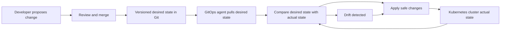
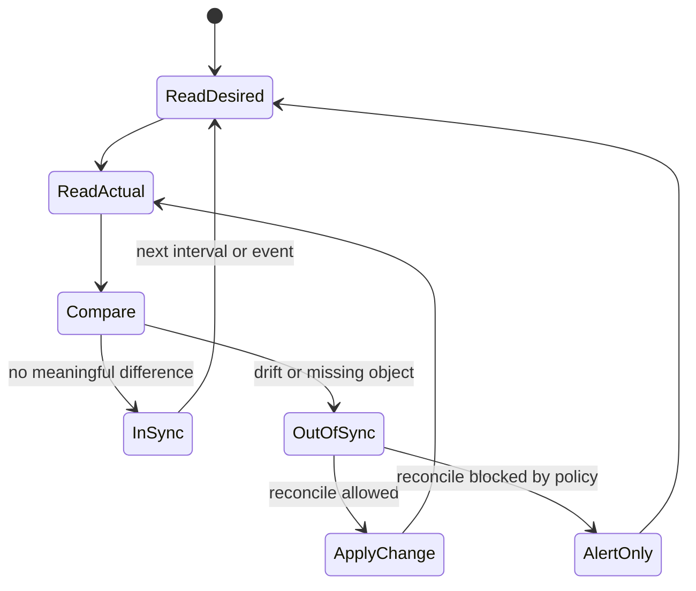

> **Складність**: `[СЕРЕДНЯ]`
>
> **Час на проходження**: 45-60 хвилин
>
> **Передумови**: Базовий робочий процес Git, концепції об'єктів Kubernetes та ідея контролерів, що узгоджують бажаний стан.

## Результати навчання

Після завершення цього модуля ви зможете:

1. **Порівняти** GitOps із push-орієнтованим CI/CD, конфігурацією як кодом та інфраструктурою як кодом у реалістичних сценаріях доставки.
2. **Проаналізувати** робочий процес розгортання та визначити, чи задовольняє він чотирьом принципам OpenGitOps, чи лише нагадує GitOps.
3. **Діагностувати** дрейф конфігурації, простежуючи бажаний стан, фактичний стан, поведінку узгодження та власність над джерелом істини.
4. **Оцінити** стратегії відкату й аудиту, що спираються на версіонований незмінний бажаний стан, а не на ручні зміни в кластері.
5. **Спроєктувати** мінімальний цикл керування GitOps для застосунку Kubernetes, включно зі структурою репозиторію, поведінкою агента та перевірками успіху.

## Чому цей модуль важливий

Платформна команда успадкувала кластер Kubernetes після напруженого запуску продукту, і перший серйозний інцидент оголив систему доставки, яку ніхто не міг пояснити. Застосунок працював, але продакшн відрізнявся від staging кількома дрібними деталями: інженер релізів терміново виправив один Деплоймент через `kubectl edit`, інженер безпеки змінив анотацію безпосередньо в кластері, а автоматизований конвеєр запушив новіший маніфест зі складального завдання вже після цього термінового виправлення. Кожен вважав, що в той момент зменшує ризик. Разом вони створили систему, де живому середовищу не можна було довіряти, репозиторію не можна було довіряти, а відкат означав вгадування, яка саме зміна мала значення, поки клієнти спостерігали, як зростає кількість помилок під час оформлення замовлення.

GitOps існує, щоб запобігти цьому операційному туману. Він не зводиться до того, щоб "покласти YAML у Git" або "запускати розгортання з pull request". Він стверджує, що бажаний стан має бути задекларований, збережений у версіонованій та незмінній системі, автоматично витягнутий програмними агентами й безперервно узгоджений із робочим середовищем. Ці чотири ідеї утворюють цикл керування, і саме цикл керування — це різниця між звичкою доставки та операційною моделлю. Коли цикл здоровий, команда може пояснити, що має існувати, хто це схвалив, який актор має право це застосувати та що відбувається, коли кластер перестає відповідати схваленому наміру.

Іспит CGOA перевіряє, чи здатні ви розпізнати цю операційну модель під тиском. Багато варіантів відповідей звучать правдоподібно, бо згадують Git, Kubernetes, конвеєри, автоматизацію, інфраструктуру як код чи сканування безпеки. Ваше завдання — визначити, у якому сценарії дійсно є джерело істини, який актор ініціює зміну, чи опрацьовується дрейф після першого розгортання та чи підтримує історія аудит і відновлення. Цей модуль трактує ці відмінності як операційні рішення, а не як картки зі словником, бо реальний продакшн-інцидент не просить вас процитувати визначення раніше, ніж просить обрати наступну дію.

## Ментальна модель GitOps

GitOps починається з простого питання про власність: де визначено бажаний стан системи? Якщо відповідь — "те, що зараз працює", то платформа не має тривкого джерела істини, бо живий стан змінюється щоразу, коли його торкається людина, контролер чи аварійний скрипт. Якщо відповідь — "те, що запушив останній конвеєр", то платформа може бути автоматизованою, але вона не обов'язково узгоджує стан після завершення цього конвеєра. Якщо відповідь — "версіонована декларація, яку агент безперервно порівнює з реальністю", то платформа рухається до GitOps, бо система доставки має стабільну ціль і повторюваний спосіб виправляти дрейф.

Найкраща ментальна модель — це термостат із журналом аудиту. Термостат не просто надсилає одну команду нагріти кімнату один раз; він зберігає бажану температуру, спостерігає за фактичною температурою та повторно діє, коли вони розходяться. GitOps застосовує цю ідею циклу керування до систем на кшталт кластерів Kubernetes, де бажаний стан може містити Деплойменти, Сервіси, ConfigMap, NetworkPolicy, політики допуску чи ресурси інфраструктури, керовані через нативні для Kubernetes контролери. Репозиторій — це місце, де записано ціль, а агент — це механізм, що постійно дивиться і на ціль, і на кімнату.

Цикл має значення, бо розподілені системи дрейфують навіть тоді, коли кожен учасник команди обережний. Люди роблять аварійні зміни, контролери Kubernetes додають типові поля, автомасштабувальники коригують кількість реплік, хмарні сервіси мутують поля статусу, вебхуки допуску впроваджують конфігурацію, а невдалі розгортання можуть лишати по собі частковий стан. GitOps не вдає, що зміни припиняються після злиття. Він припускає, що зміни безперервні, а тоді робить узгодження звичайним шляхом назад до задекларованої цілі, водночас даючи операторам достатньо інформації про статус, щоб помітити, коли узгодження слід заблокувати або дослідити.



Читайте діаграму зліва направо, доки не з'явиться кластер, а тоді зверніть увагу на цикл. Розробник і процес рецензування створюють бажаний стан, але вони безпосередньо не стають довготривалим механізмом керування. Агент витягує цей стан, а не отримує привілейований push від зовнішньої системи розгортання. Крок порівняння — це те, що робить систему операційно цікавою, бо він здатний виявити невідповідність уже після завершення початкового розгортання та може й далі повідомляти, чи цільове середовище синхронізоване, здорове, заблоковане чи дрейфує.

Зупиніться й передбачте: конвеєр збирає образ, оновлює маніфест Деплойменту в Git та успішно завершується. За п'ять хвилин хтось змінює образ живого Деплойменту командою `kubectl set image`. Що має зрештою статися в системі GitOps і яка частина циклу робить цей результат можливим? Відповідь — не "конвеєр запускається знову". Відповідь у тому, що агент GitOps помічає: живий Деплоймент більше не відповідає бажаному образу, записаному в Git, а потім узгоджує об'єкт назад до задекларованого образу, якщо політика не каже інакше. Саме тому GitOps зазвичай описують як безперервне узгодження, а не просто автоматизоване розгортання.

Для питань CGOA трактуйте кожен сценарій як аудит циклу керування. Визначте бажаний стан, фактичний стан, джерело істини, актора, що витягує чи пушить зміни, та поведінку після появи дрейфу. Якщо ви не можете знайти одну з цих частин, то ви знайшли слабке місце сценарію. Назви інструментів — корисні підказки, але самі по собі їх ніколи не досить, бо знайомий інструмент може бути налаштований у спосіб, що послаблює модель.

Для прикладів команд цей модуль використовує `k` як стандартне скорочення Kubernetes після введення аліаса оболонки `alias k=kubectl`. Аліас — це лише скорочення для друку повної команди `kubectl`. Він не змінює модель GitOps, і він не повинен робити людську сесію оболонки звичайним шляхом розгортання.

## Принцип 1: Декларативний бажаний стан

Перший принцип OpenGitOps каже, що системою слід керувати через декларативні описи. Декларативна конфігурація описує бажаний кінцевий стан, тоді як імперативні команди описують кроки, які треба виконати. У Kubernetes 1.35 і пізніших версіях маніфест Деплойменту декларує, що певне робоче навантаження має існувати з певним шаблоном, селектором і цільовою кількістю реплік. Контролери Kubernetes вирішують, як створити, замінити чи видалити Под'и, щоб фактичний стан відповідав цій декларації, — саме тому той самий маніфест лишається осмисленим між повторними узгодженнями.

Декларативність сама по собі не означає "написано в YAML". YAML може містити процедурні інструкції, а не-YAML формат може бути декларативним, якщо він описує бажаний результат, а не впорядковані кроки. Іспит часто перевіряє цю відмінність непрямо, описуючи репозиторій, повний скриптів, що по черзі запускають `k apply`, `k patch` і `k rollout restart`. Ці скрипти можуть бути цінною автоматизацією, але вони не те саме, що тривка декларація стану системи, яку контролер може порівняти з реальністю, не відтворюючи приховану історію попередніх побічних ефектів.

Корисна перевірка — чи можна застосувати декларацію повторно, не змінюючи сенсу бажаного результату. Якщо той самий маніфест узгоджується знову, система все одно має знати, якого стану вона намагається досягти. Імперативні команди часто залежать від таймінгу, попередніх побічних ефектів, змінних середовища та прихованих припущень про те, що вже існує. Декларативний стан дає циклу керування щось стабільне для порівняння, — саме тому ресурси Kubernetes, об'єкти політик та інфраструктурні власні ресурси природно вписуються в робочі процеси GitOps.

```yaml
apiVersion: apps/v1
kind: Deployment
metadata:
  name: checkout
  namespace: shop
  labels:
    app.kubernetes.io/name: checkout
spec:
  replicas: 3
  selector:
    matchLabels:
      app.kubernetes.io/name: checkout
  template:
    metadata:
      labels:
        app.kubernetes.io/name: checkout
    spec:
      containers:
        - name: checkout
          image: ghcr.io/example/checkout:1.8.2
          ports:
            - containerPort: 8080
```

Цей маніфест не каже "створи три Под'и, потім почекай, потім заміни Под'и, що відмовили". Він каже, що бажане робоче навантаження — це Деплоймент на ім'я `checkout` із цільовою кількістю реплік три та конкретним образом контейнера. Kubernetes і агент GitOps можуть порівняти цей намір із робочим кластером. Це порівняння вмикає виявлення дрейфу, оцінку здоров'я та повторюване відновлення, бо бажаний стан лишається видимим навіть тоді, коли кластер тимчасово від нього відхилився.

Нюанс рівня senior полягає в тому, що не кожне поле живого об'єкта слід трактувати як бажаний стан. Kubernetes додає поля статусу, керовані поля, типові значення, версії ресурсів та дані про спостережене покоління. Інші контролери можуть володіти полями, з якими Git не повинен боротися, — наприклад, кількістю реплік, керованою HorizontalPodAutoscaler, чи [сайдкарами, вставленими політикою](https://kubernetes.io/docs/concepts/cluster-administration/admission-webhooks-good-practices/). Інструменти GitOps мають порівнювати ті частини фактичного стану, що мають значення, ігноруючи поля, якими володіє API-сервер чи інші контролери; інакше узгодження стає шумним, і оператори перестають довіряти сигналу.

Перш ніж подумки це прогнати: який результат ви очікуєте, якщо живий Деплоймент має правильний образ, але інше поле умови статусу? Здорове порівняння GitOps зазвичай має ігнорувати статус, бо статус повідомляє про спостережену реальність, а не про бажаний намір. Якщо інструмент трактує кожне оновлення статусу як дрейф, команда бачитиме постійні хибні тривоги, а практичний урок у тому, що декларативна власність — про осмислені поля, а не про необроблену текстову рівність двох документів YAML.

## Принцип 2: Версіоноване й незмінне джерело істини

Другий принцип каже, що бажаний стан має зберігатися у версіонованому й незмінному джерелі істини. Git — поширена реалізація, бо коміти забезпечують історію, авторство, контекст рецензування, diff'и та точки відкату. Важлива властивість — не назва бренду. Важлива властивість у тому, що зміни записуються як тривкі версії, які можна переглянути, порівняти, підписати, захистити та відновити, не покладаючись на пам'ять чи скриншот дашборду.

Незмінність не означає, що репозиторій ніколи не змінюється. Вона означає, що попередні версії зберігаються, а не недбало перезаписуються. Гілка з примусовим push без захищеної історії послаблює модель, бо організація втрачає здатність відтворити те, що було задумано в конкретний момент. Захищена гілка main, обов'язкові рецензування, підписані коміти, теги релізів та чіткі правила просування середовищ посилюють претензію на джерело істини, бо роблять шлях від наміру до продакшну придатним для аудиту.

Відкат — це місце, де цей принцип стає практичним. У push-орієнтованій системі відкат може залежати від запам'ятовування, який скрипт запустився, який артефакт було розгорнуто та які ручні виправлення сталися потім. У системі GitOps відкат зазвичай має означати повернення до попереднього перевірено-доброго бажаного стану чи його вибір і передачу агенту узгодити середовище до нього. Це не усуває потреби в безпеці відкату на рівні застосунку, плануванні міграцій бази даних чи ретельному керуванні трафіком, але дає робочому процесу інфраструктури надійну опору.

```bash
mkdir -p /tmp/gitops-review/shop
cd /tmp/gitops-review
git init
cat > shop/deployment.yaml <<'YAML'
apiVersion: apps/v1
kind: Deployment
metadata:
  name: checkout
  namespace: shop
spec:
  replicas: 3
  selector:
    matchLabels:
      app: checkout
  template:
    metadata:
      labels:
        app: checkout
    spec:
      containers:
        - name: checkout
          image: ghcr.io/example/checkout:1.8.2
YAML
git add shop/deployment.yaml
git commit -m "Declare checkout deployment"
git log --oneline
```

Цей блок команд створює крихітне локальне джерело істини. Воно навмисно мале, бо концепцію легше оглянути, коли є лише один об'єкт. Тепер коміт — це відновлювана версія бажаного стану, а агент GitOps можна було б налаштувати спостерігати за цим шляхом репозиторію та узгоджувати кластер до маніфесту. У реальній команді та сама ідея масштабується через захист гілок, pull request'и, перевірки політик та просування релізів, а не через єдиний локальний коміт.

Зупиніться й передбачте: якщо команда зберігає маніфести в Git, але дозволяє виправлення в продакшні через прямі зміни в кластері, що є справжнім джерелом істини під час інциденту? Як зміниться відповідь, якщо кожне аварійне виправлення доводилося б перетворювати на відрецензований коміт, перш ніж воно стане тривким? Ця відмінність операційно серйозна, бо аварійний доступ до кластера може й далі існувати для ситуацій "розбити скло", але команди GitOps трактують його як виняток, який треба узгодити назад у задекларований стан чи навмисно перезаписати задекларованим станом. Якщо ручні зміни мовчки стають новою нормою, Git перестає бути джерелом істини й стає історичною декорацією.

Стратегія аудиту випливає з тієї самої логіки. Корисний журнал аудиту може відповісти, хто запропонував зміну, хто її відрецензував, який саме бажаний стан був активним, який агент намагався узгодити та який статус повідомило цільове середовище. Слабкий журнал аудиту каже лише, що завдання запустилося чи людина натиснула кнопку розгортання. Для міркувань CGOA версіонований бажаний стан — це різниця між відновлюваним операційним записом і пухкою колекцією подій доставки.

## Принцип 3: Автоматично витягується програмними агентами

Третій принцип каже, що програмні агенти автоматично витягують бажаний стан. Це одна з найчіткіших відмінностей між GitOps і багатьма традиційними конвеєрами розгортання. У push-моделі зовнішня система дотягується до цільового середовища та застосовує зміни. У pull-моделі агент, якому середовище вже довіряє, отримує бажаний стан і виконує узгодження зсередини периметра безпеки, що змінює і сценарій облікових даних, і поведінку при відмові.

Наслідки для безпеки важливі. Push-конвеєру часто потрібні облікові дані, достатньо потужні, щоб змінювати продакшн ззовні продакшну, тож компрометація конвеєра може стати компрометацією кластера. Pull-орієнтованому агенту GitOps можна надати вузько обмежені права всередині кластера та доступ до репозиторію лише для читання. Така конструкція зменшує кількість систем, здатних безпосередньо мутувати продакшн, що спрощує керування обліковими даними, мережеву політику, реагування на інциденти та аналіз радіуса ураження.

Автоматичне витягування також змінює те, як команди міркують про збої на шляху доставки. Якщо конвеєр недоступний після злиття коміту, pull-агент усе одно може помітити, що репозиторій змінився, коли опитує його чи отримує сповіщення. Якщо кластер тимчасово втрачає мережевий доступ до репозиторію, агент може повторити спробу без того, щоб людина перезапускала завдання розгортання. Система доставки стає контролером, який продовжує намагатися збігтися, а не одноразовим виконавцем команд, чий лог успіху може бути останнім спостереженням, яке хтось має.

| Модель | Ініціатор зміни | Типові облікові дані | Поведінка при дрейфі | Інтерпретація для іспиту |
|---|---|---|---|---|
| Push-орієнтований CD | Зовнішній конвеєр пушить у кластер | Конвеєру потрібен доступ на запис до цілі | Часто ігнорується після завершення завдання | Автоматизована доставка, не обов'язково GitOps |
| Pull-орієнтований GitOps | Агент у кластері чи в середовищі витягує з джерела | Агент має обмежений доступ на запис, доступ до репо може бути лише для читання | Виявляється під час узгодження | Відповідає принципу витягування OpenGitOps |
| Ручні операції | Людина запускає команди напряму | Людина має доступ до живого середовища | Залежить від ручних подальших дій | Сам по собі не GitOps |
| Скриптоване розгортання | Скрипт застосовує впорядковані кроки | Виконавцю скрипта потрібен доступ до цілі | Зазвичай не безперервна | Автоматизація, але не повний цикл керування |

Іспит може описати інструмент на кшталт Argo CD чи Flux, але назви інструментів менш важливі за поведінку. Погано налаштований інструмент може порушити дух GitOps, а власний контролер може задовольнити принципи, якщо він справді витягує, порівнює та узгоджує задекларований стан із версіонованого джерела. Тренуйтеся інспектувати робочий процес, а не впізнавати назви продуктів, особливо коли варіанти відповідей намагаються винагородити знайомство з брендом, а не операційне міркування.

Команда `kubectl` з'являється скрізь у вивченні Kubernetes, і багато практиків створюють `alias k=kubectl`, щоб заощадити час. У цьому модулі `k` означає саме цей аліас і нічого більше. Конструкція GitOps не повинна залежати від того, що людина раз за разом друкує `k apply` у продакшн, але вам усе одно треба розуміти ці операції, бо діагностика часто вимагає читати живі об'єкти, події та статус контролера, поки агент володіє збіжністю.

Який підхід ви обрали б тут і чому: CI-раннер із обліковими даними cluster-admin, що пушить кожне злиття, чи агент усередині кластера з правами, обмеженими простором імен, що витягує відрецензований бажаний стан? Другий підхід ближче відповідає GitOps, бо агент на боці середовища володіє узгодженням, а зовнішньому конвеєру не потрібен широкий доступ на запис до продакшну. Перший підхід може бути знайомим і швидким, але він лишає опрацювання дрейфу та вразливість облікових даних окремими проблемами.

## Принцип 4: Безперервно узгоджуваний фактичний стан

Четвертий принцип каже, що програмні агенти безперервно узгоджують фактичний стан до бажаного. Цей принцип завершує цикл. Без нього GitOps згортається до "розгортання з Git", що теж може бути корисним, але не дає такого ж виправлення дрейфу, самовідновлення чи операційного статусу. Безперервне узгодження означає, що система продовжує спостерігати після початкового застосування, а статус цього спостереження стає частиною того, як команда керує продакшном.

Фактичний стан — це поточний стан цільового середовища. У Kubernetes фактичний стан охоплює ресурси, які повертає API-сервер, та статус, повідомлений контролерами. Бажаний стан — це задумана конфігурація, збережена в джерелі істини. Дрейф — це осмислена різниця між цими двома для полів чи об'єктів, якими Git має володіти. Узгодження — це процес дії, спрямованої на зменшення чи усунення цієї різниці, або повідомлення, що різницю не можна виправити автоматично, бо політика, права чи перевірки здоров'я це блокують.

Не всі відмінності є дрейфом. HorizontalPodAutoscaler може змінювати кількість реплік, бо динамічне масштабування — це задумана поведінка. Контролер може додавати поля статусу, які ніколи не слід комітити в Git. Мутаційний вебхук допуску може впроваджувати сайдкар за політикою. Зріла конфігурація GitOps визначає, якими полями володіє Git, якими полями володіють інші контролери та які відмінності мають спричиняти сповіщення замість автоматичного перезапису. Ця модель власності не дає агенту GitOps боротися з рештою платформи.



Ця діаграма станів показує, чому GitOps — це більше, ніж подія розгортання. Система постійно повертається до `ReadDesired` і `ReadActual`. Вона може стати `InSync`, але не припиняє спостерігати. Якщо узгодження заблоковане політикою, правильною поведінкою може бути сповістити, а не форсувати зміну. Це все одно мислення GitOps, бо система ухвалила рішення на основі бажаного стану, фактичного стану та правил власності, а не покладалася на те, що людина пізніше повторно виявить невідповідність.

Senior-оператор також запитує, як узгодження опрацьовує відмови. Якщо застосування зміни зазнає невдачі, бо простір імен відсутній, політика забороняє об'єкт, образ неможливо витягнути чи полем володіє інший контролер, агент має показати статус, що вказує назад на задекларовану ціль. GitOps не означає, що кожен коміт магічно успішний. Він означає, що відмова прив'язана до видимого бажаного стану й може бути досліджена через узгоджений цикл, що включає ревізію джерела, статус синхронізації, статус здоров'я, події, права та рішення допуску.

## Розбір прикладу: чи це робочий процес GitOps?

Розгляньте команду, що керує сервісом `checkout`. Розробники відкривають pull request'и до репозиторію, що містить маніфести Kubernetes. Завдання CI валідує YAML, збирає образ контейнера та оновлює тег образу в маніфесті. Після злиття агент усередині кластера витягує репозиторій щохвилини, порівнює маніфести з живими об'єктами, застосовує зміни та повідомляє, чи застосунок синхронізований і здоровий. Цей робочий процес задовольняє основну модель GitOps, бо поєднує декларативний бажаний стан, версіоновану історію, автоматичне витягування та безперервне узгодження.

Тепер змініть одну деталь. Припустімо, завдання CI використовує продакшн-kubeconfig і запускає `k apply -f manifests/` зі складального раннера після кожного злиття. Репозиторій усе ще містить декларативний YAML, а робочий процес усе ще використовує Git, але цільове середовище змінюється зовнішнім push. Якщо потім ніщо не продовжує порівнювати бажаний і фактичний стан, ручний дрейф може лишатися назавжди. Це автоматизоване розгортання з Git, а не повний GitOps, навіть якщо логи збирання виглядають чистими, а репозиторій має чудову гігієну pull request'ів.

Тепер змініть іншу деталь. Припустімо, агент усередині кластера витягує з Git, але команда регулярно патчить продакшн через `k edit` і ніколи не комітить ці зміни назад. Цикл може перезаписати ручні зміни, або команда може налаштувати агента ігнорувати їх. У будь-якому разі команда має вирішити, хто володіє полем. GitOps працює лише тоді, коли власність достатньо явна, щоб оператори могли передбачити, чи буде дрейф виправлено, прийнято чи ескальовано під час реального інциденту.

| Сценарій | Декларативний | Версіонований і незмінний | Витягується автоматично | Безперервно узгоджується | Вердикт |
|---|---|---|---|---|---|
| Маніфести в Git, конвеєр пушить `kubectl apply`, без перевірок дрейфу | Так | Зазвичай | Ні | Ні | CI/CD з Git, не повний GitOps |
| Агент витягує відрецензовані маніфести й повідомляє статус синхронізації | Так | Так | Так | Так | GitOps |
| Стан Terraform в об'єктному сховищі, ручні зміни в консолі дозволені назавжди | Частково | Залежить | Ні | Можливо | IaC зі слабкою відповідністю GitOps |
| Скрипти в Git запускають упорядковані команди оболонки в продакшні | Ні | Так | Ні | Ні | Версіонована автоматизація |
| Агент витягує бажаний стан, але прямі зміни — це "розбити скло" й відкочуються чи комітяться | Так | Так | Так | Так | GitOps із опрацюванням операційних винятків |

Суть цього розбору прикладу в тому, що GitOps оцінюється як система. Одна добра властивість не компенсує відсутнього узгодження. Один знайомий інструмент не компенсує неясної власності. Коли ви бачите сценарій іспиту, подумки відзначте чотири принципи й запитайте, якого з них бракує. Якщо всі чотири присутні, то запитайте, чи повідомляє робочий процес також про здоров'я та чи опрацьовує винятки у спосіб, яким оператори можуть скористатися.

## GitOps у порівнянні із суміжними практиками

GitOps перетинається з інфраструктурою як кодом, конфігурацією як кодом, DevOps, DevSecOps і CI/CD. Перетин реальний, тож запам'ятовування жорсткої межі не допоможе. Сильніший підхід — визначити основну обіцянку кожної практики, а тоді вирішити, чи присутній цикл керування GitOps. Це також спосіб уникнути іспитових пасток, де варіант відповіді звучить сучасно, але йому бракує механізму, що робить GitOps особливим.

Інфраструктура як код зосереджена на визначенні інфраструктури через машинозчитувані файли, а не ручні операції в консолі. Конфігурація як код зосереджена на керуванні конфігурацією застосунку чи системи як версіонованими файлами. CI/CD зосереджений на збиранні, тестуванні, пакуванні та доставці змін через автоматизовані етапи. DevOps зосереджений на співпраці та швидкому зворотному зв'язку між розробкою й експлуатацією. DevSecOps інтегрує засоби контролю безпеки в цей життєвий цикл доставки. GitOps може використовувати всі ці практики, але додає конкретне операційне обмеження: бажаний стан у версіонованому сховищі витягується й узгоджується агентами.

CI-конвеєр може виробити образ і оновити маніфест, але агент GitOps має володіти збіжністю в цільовому середовищі. Сканер безпеки може заблокувати pull request, але цикл GitOps усе одно вирішує, чи живий стан відповідає схваленому наміру. Робочий процес Terraform може декларативно надавати інфраструктуру, але це автоматично не GitOps, якщо бажаний стан не версіонований, не витягується агентом і не узгоджується безперервно. Порівняння має значення, бо багато команд мають чудову автоматизацію, не маючи операційної моделі GitOps.

| Практика | Основне питання, на яке вона відповідає | Зв'язок із GitOps | Поширена пастка іспиту |
|---|---|---|---|
| Інфраструктура як код | Як описується й надається інфраструктура? | Часто дає декларативні входи для GitOps | Припущення, що будь-який IaC-репозиторій є GitOps |
| Конфігурація як код | Як зберігається й рецензується конфігурація? | Може постачати бажаний стан застосунку | Припущення, що сама лише версіонована конфігурація — це достатньо |
| CI/CD | Як зміни збираються, тестуються й випускаються? | CI може оновлювати бажаний стан; GitOps його узгоджує | Трактування push-розгортання як pull-узгодження |
| DevOps | Як команди співпрацюють, щоб надійно доставляти? | GitOps може реалізовувати практики DevOps | Ототожнення культури та циклу керування |
| DevSecOps | Як перевірки безпеки інтегровані в доставку? | GitOps може примушувати схвалений бажаний стан | Припущення, що сканування безпеки створює узгодження |

Є також тонка різниця між розгортанням і експлуатацією. Розгортання запитує: "Як ця версія випускається?" Експлуатація запитує: "Як середовище лишається коректним потім?" GitOps відповідає на обидва, але його особлива сила — друге питання. Цикл узгодження продовжує працювати після того, як подія розгортання минула, — саме тому питання про дрейф, відкат і аудит на іспиті часто виявляють, чи сценарій справді є GitOps, чи лише суміжний із ним.

## Читання дрейфу як оператор

Дрейф — це не просто "щось змінилося". Дрейф — це осмислена невідповідність між бажаним і фактичним станом для поля чи об'єкта, яким Git має володіти. Це уточнення має значення, бо кластери Kubernetes сповнені очікуваних змін. Под'и переплановуються, умови статусу оновлюються, контролери додають типові значення, а автомасштабувальники коригують кількість. Трактування кожної відмінності як дрейфу породжує шум, послаблює довіру до інструмента й може спричинити, що агент GitOps бореться з контролерами, які поводяться правильно.

Діагностуючи дрейф, починайте з власності перед дією. Запитайте, чи Git володіє об'єктом, чи інший контролер володіє полем і чи зробила людина пряму зміну. Тоді перевірте, чи агент GitOps виявляє відмінність, чи має він право її виправити та чи політика заважає автоматичному узгодженню. Ця послідовність утримує вас від трактування кожного статусу out-of-sync як простої відмови застосування й допомагає вирішити, чи правильне виправлення належить до Git, RBAC, політики допуску, автоматизації образів чи самого застосунку.

Компактний робочий процес оператора має чотири ходи. По-перше, визначте бажаний шлях джерела й коміт. По-друге, інспектуйте живий об'єкт і порівняйте поля, якими має володіти Git. По-третє, перевірте статус агента на помилки синхронізації, здоров'я, прав і політики. По-четверте, вирішіть, чи виправлення належить до Git, до прав кластера, до політики допуску чи до самого застосунку. Senior-практики уникають "просто натиснути sync", доки не знають, який рівень неправильний, бо форсована синхронізація може приховати справжню проблему власності.

```bash
mkdir -p /tmp/gitops-drift-demo
cd /tmp/gitops-drift-demo
cat > desired.yaml <<'YAML'
apiVersion: apps/v1
kind: Deployment
metadata:
  name: checkout
  namespace: shop
spec:
  replicas: 3
  template:
    spec:
      containers:
        - name: checkout
          image: ghcr.io/example/checkout:1.8.2
YAML
cat > actual.yaml <<'YAML'
apiVersion: apps/v1
kind: Deployment
metadata:
  name: checkout
  namespace: shop
spec:
  replicas: 1
  template:
    spec:
      containers:
        - name: checkout
          image: ghcr.io/example/checkout:debug
YAML
diff -u desired.yaml actual.yaml || true
```

Ця локальна демонстрація використовує `diff` замість кластера, щоб ви могли зосередитися на міркуванні. Фактичний стан відрізняється і кількістю реплік, і образом. Якщо Git володіє обома полями, агент GitOps має спробувати відновити три репліки й образ `1.8.2`. Якщо репліками володіє HPA, а образом володіє Git, то лише відмінність образу є дрейфом з погляду GitOps. Та сама видима відмінність може призвести до різних дій залежно від власності, — саме тому діагностика GitOps — це більше, ніж порівняння двох файлів.

Зупиніться й передбачте: ваша команда бачить застосунок, позначений `OutOfSync`, бо живих реплік п'ять, а Git каже три. Сервіс під великим навантаженням, і налаштований HPA. Перш ніж змінювати Git чи форсувати синхронізацію, на яке питання про власність ви маєте відповісти? Питання в тому, чи Git, чи HPA володіє `spec.replicas`. Якщо автомасштабувальник навмисно керує кількістю реплік, конфігурація GitOps може потребувати ігнорування цього поля чи його пропуску з бажаного маніфесту, залежно від інструмента й патерну. Якщо жоден автомасштабувальник ним не володіє, то відмінність може бути справжнім дрейфом, спричиненим ручним редагуванням чи несхваленим процесом.

Якщо агент GitOps налаштований трактувати кожен об'єкт out-of-sync як щось для перезапису, він може раз за разом скидати масштабоване робоче навантаження під час сплеску трафіку. Коли маніфест каже три репліки, але HPA потрібно більше, а агент налаштований трактувати поле реплік як належне Git, видимий конфлікт — це невідповідність власності в площині керування. Засіб — не відмова від GitOps. Зробіть власність над полями явною, тримайте автомасштабування під контролем автомасштабувальника, а образ, мітки, порти й запити ресурсів — під рецензуванням Git.

## Проєктування мінімального циклу керування GitOps

Мінімальна конструкція GitOps має п'ять частин: джерело істини, формат декларації, агент, права на цілі та зворотний зв'язок. Джерело істини зберігає бажаний стан. Формат декларації робить намір порівнюваним. Агент витягує та узгоджує. Права дозволяють лише ті зміни, які агент має робити. Зворотний зв'язок повідомляє людям, чи система синхронізована, здорова, заблокована чи дрейфує. Якщо хоч однієї з цих частин бракує, конструкція може й далі бути корисною, але вона слабша за модель GitOps, описану принципами OpenGitOps.

Починайте з малого, проєктуючи цикл. Використайте один шлях репозиторію, один простір імен і один застосунок. Захистіть гілку main, вимагайте рецензування й зробіть так, щоб агент читав цю гілку. Надайте агенту права лише в просторі імен, яким він керує. Додайте валідацію перед злиттям, щоб зламані маніфести не ставали бажаним станом. Тоді розширюйтеся до кількох середовищ після того, як команда зможе пояснити, як один коміт досягає одного кластера та як агент повідомляє про успіх чи відмову.

Поширена структура репозиторію відокремлює сирцевий код застосунку від бажаного стану середовища. Репозиторій застосунку збирає образи й запускає тести. Репозиторій середовища записує, який образ і конфігурація мають працювати в кожному середовищі. Деякі команди використовують один репозиторій з окремими каталогами; інші використовують кілька репозиторіїв для чіткішої власності. Іспит зазвичай менше цікавиться точним розкладанням і більше — тим, чи джерело істини версіоноване й узгоджується агентом із відповідними правами.

```text
gitops-repo/
├── apps/
│   └── checkout/
│       ├── base/
│       │   ├── deployment.yaml
│       │   └── service.yaml
│       └── overlays/
│           ├── staging/
│           │   └── kustomization.yaml
│           └── production/
│               └── kustomization.yaml
└── policies/
    └── namespace-rules.yaml
```

Це дерево каталогів показує типовий репозиторій бажаного стану. Каталог `base` несе спільні декларації застосунку. Оверлеї представляють специфічні для середовища вибори, як-от кількість реплік, ліміти ресурсів, теги образів чи прив'язки політик. Каталог policies нагадує, що GitOps може керувати більш ніж робочими навантаженнями, але власність має лишатися чіткою. Репозиторій, що змішує сирцевий код застосунку, згенерований вихід, оверлеї середовищ та аварійні патчі без меж, стає важким для рецензування, навіть якщо технічно задовольняє вимогу версіонованого джерела.

Зворотний зв'язок — це частина, яку забуває багато конструкцій початківців. Агент GitOps, що мовчки застосовує зміни, менш корисний за того, що повідомляє статус синхронізації, статус здоров'я, останню узгоджену ревізію, ресурси, що відмовили, та помилки політики. Операторам треба знати, чи бажаний стан застосовано, чи застосунок став здоровим, чи агент заблокований правами та чи дрейф продовжує повертатися. У сценаріях CGOA конструкція, що включає звітування про статус, зазвичай зріліша за ту, що каже лише "агент розгортає з Git".

## Патерни та антипатерни

Патерни корисні, бо принципи GitOps навмисно нейтральні щодо інструментів. Принципи кажуть, що має бути правдою, але не диктують, як упорядкувати репозиторії, просування, секрети чи аварійний доступ. Хороший патерн робить цикл керування легшим для осмислення під тиском. Слабкий патерн усе ще може містити Git, маніфести й автоматизацію, лишаючи операторів невпевненими, яка зміна схвалена чи який актор володіє продакшном.

| Патерн | Коли його застосовувати | Чому він працює | Міркування щодо масштабування |
|---|---|---|---|
| Репозиторій середовища | Командам потрібне чітке відокремлення коду застосунку від наміру середовища виконання | CI може оновлювати бажаний стан, поки агент GitOps володіє збіжністю кластера | Визначте правила власності, щоб команди застосунків і платформ не перезаписували одна одну |
| Pull-агент на межу довіри | Кластери, простори імен чи акаунти потребують окремих облікових даних | Кожен агент отримує обмежений доступ і витягує лише ті шляхи, якими володіє | Стандартизуйте мітки, звітування про статус і маршрутизацію сповіщень перед додаванням багатьох агентів |
| "Розбити скло" з політикою узгодження | Операторам потрібен аварійний доступ без втрати придатності до аудиту | Ручні виправлення обмежені в часі, потім або комітяться в Git, або відкочуються агентом | Задокументуйте, хто може призупиняти синхронізацію, на скільки й як рецензується пост-інцидентний коміт |

Патерн репозиторію середовища поширений, бо тримає вихід збирання окремо від схвалення середовища виконання. Завдання CI може зібрати образ, запустити тести, просканувати його, а тоді запропонувати зміну маніфесту чи оновлення тегу образу. Агенту GitOps не потрібні облікові дані збирання, а системі CI не потрібні широкі облікові дані на запис у продакшн. Це відокремлення особливо корисне, коли кілька сервісів спільно використовують кластер, бо команди платформ можуть захищати політику рівня середовища, поки команди застосунків усе ще володіють версіями свого сервісу.

Антипатерни зазвичай з'являються, коли команди переймають словник швидше за операційну модель. Репозиторію YAML без узгодження недостатньо. Порталу розгортання, що читає Git, але пушить ззовні кластера, недостатньо. Потужний агент, здатний мутувати все в кластері, може спрацювати спочатку, але він послаблює історію радіуса ураження, яку може дати pull-орієнтований GitOps. Ці невдачі поширені, бо кожне скорочення розв'язує локальну проблему, тихо прибираючи одну з властивостей, що робили модель цінною.

| Антипатерн | Що йде не так | Чому команди потрапляють у це | Краща альтернатива |
|---|---|---|---|
| Git як скринька пропозицій | Живий стан стає авторитетним під час інцидентів | Прямі зміни здаються швидшими за pull request'и | Перетворюйте аварійні виправлення на відрецензовані коміти або давайте агенту їх відкочувати |
| Продакшн, керований конвеєром | CI потрібні потужні облікові дані на цілі, а дрейф потім не перевіряється | Наявні системи CD уже вміють пушити | Нехай CI оновлює бажаний стан, а агент на боці середовища узгоджує |
| Агент GitOps з правами cluster-admin | Скомпрометований шлях може мутувати непов'язані робочі навантаження | Широкі права легші під час початкового налаштування | Обмежте RBAC керованими просторами імен, ресурсами та обов'язками узгодження |

Використовуйте патерни як докази для іспиту, а не як гасла. Якщо сценарій описує репозиторій середовища, захист гілок, pull-агента, обмежений RBAC і звітування про статус, він, імовірно, описує сильну конструкцію GitOps. Якщо він описує прямі ручні зміни, облікові дані для push чи скрипти, що запускаються один раз і зникають, він, імовірно, описує автоматизацію навколо Git, а не GitOps. Найсильніші відповіді пояснюють механізм і наслідок разом.

## Структура для ухвалення рішень

Використовуйте цю структуру, коли сценарій запитує, чи робочий процес є GitOps, CI/CD, конфігурацією як кодом, інфраструктурою як кодом чи змішаною конструкцією. Почніть із питання, чи бажаний стан декларативний, тоді — чи він версіонований і захищений, тоді — хто ініціює зміни в цільовому середовищі, тоді — чи продовжується узгодження після першого застосування. Не перестрибуйте до назви інструмента. Інструмент може бути присутнім, відсутнім чи оманливо налаштованим.

| Питання для рішення | Якщо відповідь "так" | Якщо відповідь "ні" | Імовірна класифікація |
|---|---|---|---|
| Чи задекларовано намір середовища виконання як бажаний стан? | Перейдіть до перевірок джерела істини | Автоматизація може бути лише імперативною | Скриптована доставка чи ручні операції |
| Чи версіонований бажаний стан із придатною до огляду історією? | Перейдіть до перевірок витягування та узгодження | Відкат і аудит слабкі | Файли конфігурації без гарантій GitOps |
| Чи витягує програмний агент із джерела? | Перейдіть до поведінки при дрейфі | Ціль може розгортатися через push | CI/CD з Git чи push-орієнтований CD |
| Чи безперервно агент узгоджує фактичний стан? | Модель GitOps присутня | Розгортання може припинятися після застосування | Автоматизоване розгортання, не повний GitOps |
| Чи власність і винятки явні? | Конструкція операційно зріла | Опрацювання дрейфу може дивувати | Принципи GitOps присутні, але ризик реалізації лишається |

Порівнюючи альтернативи, надавайте перевагу GitOps для середовищ Kubernetes, де задекларовані ресурси, придатна до огляду історія, обмежені агенти та виправлення дрейфу цінні. Надавайте перевагу звичайному CI/CD для етапів збирання, тестування, пакування та просування артефактів; GitOps не замінює ці етапи. Надавайте перевагу інструментам інфраструктури як коду, коли надання ресурсів поза Kubernetes вимагає планування провайдера, упорядкування залежностей чи керування станом, яким узгоджувач Kubernetes не володіє. У зрілих платформах ці підходи часто працюють разом, а не конкурують.

Практичне рішення — про власність. CI зазвичай має володіти створенням і валідацією артефактів. Git має володіти схваленим бажаним станом. Агент GitOps має володіти збіжністю в цільовому середовищі. Контролери Kubernetes мають володіти статусом, типовими значеннями та динамічною поведінкою на кшталт автомасштабування. Люди мають володіти рецензуванням, опрацюванням винятків та судженням під час інциденту. Коли ці межі власності явні, і міркування на іспиті, і реальна експлуатація стають простішими.

## Чи знали ви?

- **OpenGitOps відокремлює принцип від продукту**: Принципи описують властивості системи, тож сценарій іспиту може бути узгодженим із GitOps, навіть коли він не називає Argo CD, Flux чи будь-який конкретний вендорський інструмент.

- **Pull-орієнтований не означає пасивний**: Pull-агент усе ще може [швидко реагувати через вебхуки, опитування чи сповіщення про події](https://argo-cd.readthedocs.io/en/latest/operator-manual/webhook/), але довірений агент на боці середовища лишається відповідальним за витягування й узгодження бажаного стану.

- **Відкат — це подія узгодження**: У зрілому робочому процесі GitOps відкат зазвичай змінює бажаний стан на попередню перевірено-добру версію, а тоді дає циклу керування збігтися із середовищем, замість покладання на ручні команди ремонту.

- **Kubernetes продовжує змінюватися навколо ваших маніфестів**: Станом на Kubernetes 1.35 контролери, плагіни допуску, оновлення статусу й автомасштабувальники досі мутують живі об'єкти, тож аналіз дрейфу GitOps має відокремлювати очікувані зміни, належні контролеру, від дрейфу конфігурації, належної Git.

## Типові помилки

| Помилка | Чому вона трапляється | Як її виправити |
|---|---|---|
| Трактування "YAML у Git" як повного визначення GitOps | Репозиторій виглядає офіційно, тож команди оминають увагою поведінку витягування й безперервне узгодження | Перевіряйте кожен сценарій проти всіх чотирьох принципів, перш ніж називати його GitOps |
| Дозволяти CI пушити напряму в продакшн, називаючи робочий процес pull-орієнтованим | Наявні системи розгортання вже мають облікові дані до цілей, а зміна цієї моделі потребує зусиль | Нехай CI оновлює бажаний стан, а тоді агент GitOps узгоджує ціль |
| Припущення, що кожна жива відмінність — це шкідливий дрейф | Контролери та автомасштабувальники Kubernetes навмисно змінюють поля, якими Git може не володіти | Визначте власність над полями й ігноруйте очікувані відмінності, керовані контролером |
| Робити ручні термінові виправлення постійними, не комітячи їх | Тиск інциденту винагороджує найшвидше видиме виправлення, навіть коли воно ховає справжнє джерело істини | Перетворюйте аварійні зміни на відрецензовані коміти чи дозволяйте агенту їх відкочувати |
| Покладання на скрипти відкату замість версіонованого бажаного стану | Скрипти здаються конкретними, але вони можуть не представляти точний попередній намір продакшну | Поверніться до перевірено-доброго коміту чи виберіть його, а тоді спостерігайте узгодження й здоров'я |
| Надання агенту GitOps широких прав cluster-admin за замовчуванням | Широкі права полегшують ранні демонстрації й ховають відсутню конструкцію RBAC | Обмежте права керованими просторами імен та потрібними типами ресурсів |
| Ігнорування статусу невдалого узгодження після злиття | Злиття відчувається як завершення, особливо для команд, звиклих сприймати успіх конвеєра як остаточний сигнал | Моніторте статус синхронізації, статус здоров'я, події та помилки політики після змін |
| Запам'ятовування назв інструментів замість аналізу поведінки робочого процесу | Питання іспиту можуть називати інструменти у слабких конструкціях чи описувати GitOps без назв продуктів | Визначте бажаний стан, джерело істини, актора витягування й цикл узгодження |

## Тест

<details>
<summary>1. Ваша команда порівнює три робочі процеси: маніфести в Git, які пушить Jenkins; плани Terraform, збережені в об'єктному сховищі; та агент усередині кластера, що витягує відрецензовані маніфести Kubernetes. Який робочий процес найближчий до GitOps і як справедливо порівняти решту?</summary>

Агент усередині кластера, що витягує відрецензовані маніфести Kubernetes, найближчий до GitOps, бо він поєднує декларативний бажаний стан, версіоноване рецензування, поведінку витягування й безперервне узгодження. Робочий процес Jenkins може бути сильним CI/CD з Git, але push-розгортання й відсутнє опрацювання дрейфу заважають йому задовольнити повну модель. Робочий процес Terraform може бути інфраструктурою як кодом, але це автоматично не GitOps, доки програмний агент не витягує версіонований бажаний стан і не узгоджує безперервно фактичний стан.
</details>

<details>
<summary>2. Ваша команда зберігає маніфести Kubernetes у Git, а завдання Jenkins запускає `kubectl apply` проти продакшну після кожного злиття. Кластер ніколи не перевіряється знову, доки людина не відкриє дашборд. Якого принципу GitOps бракує й чому це має значення під час дрейфу?</summary>

Робочому процесу бракує pull-орієнтованого автоматичного узгодження й безперервного опрацювання дрейфу. Маніфести можуть бути декларативними й версіонованими, але зовнішній конвеєр пушить зміни в продакшн і потім зупиняється. Якщо хтось пізніше змінить живий об'єкт, жоден агент на боці середовища не продовжує порівнювати фактичний стан із джерелом істини Git, тож дрейф може лишатися невидимим чи невирішеним, доки людина не помітить невідповідність.
</details>

<details>
<summary>3. Агент GitOps повідомляє, що Деплоймент розсинхронізований, бо Git декларує три репліки, а живий об'єкт має шість. Застосунок використовує HPA під час сплесків трафіку. Що вам слід перевірити перед тим, як форсувати синхронізацію агента, і яке рішення може випливти?</summary>

Перевірте, чи HPA навмисно володіє кількістю реплік. Якщо автомасштабувальник володіє цим полем, відмінність може бути очікуваною динамічною поведінкою, а не шкідливим дрейфом. Кращим виправленням може бути налаштування інструмента GitOps чи патерну маніфесту так, щоб він не боровся з HPA за репліки, водночас узгоджуючи поля, якими має володіти Git, як-от образ, мітки, порти чи запити ресурсів.
</details>

<details>
<summary>4. Платформна команда каже, що відкат легкий, бо вони можуть перезапустити старий скрипт розгортання зі спільної теки. Скрипт не прив'язаний до відрецензованого коміту, а кілька ручних виправлень було зроблено після його останнього запуску. Як ви оцінили б цей підхід до відкату з погляду GitOps?</summary>

Підхід слабкий, бо він не надійно відновлює версіонований бажаний стан. Відкат GitOps має бути закріплений у незмінній історії, як-от повернення до перевірено-доброго коміту, що представляє задуману конфігурацію, чи його вибір. Скрипт може бути корисною автоматизацією, але без тривкої версії джерела істини його важко аудитувати, порівнювати чи безпечно узгоджувати після пізніших ручних змін.
</details>

<details>
<summary>5. Команда безпеки хоче зменшити продакшн-облікові дані в CI. Запропоновано дві конструкції: дати системі CI доступ cluster-admin, щоб вона могла розгортати швидше, чи дозволити CI публікувати теги образів у Git, поки агент усередині кластера застосовує схвалений бажаний стан. Яка конструкція краще підтримує GitOps і чому?</summary>

Друга конструкція краще підтримує GitOps. CI усе ще може збирати й тестувати артефакти, але бажаний стан середовища виконання записується в Git і витягується агентом усередині цільового середовища. Це зменшує зовнішні облікові дані на запис у продакшн, тримає збіжність прив'язаною до версіонованого джерела істини й дозволяє агенту повідомляти, чи цільове середовище дійсно досягло схваленого стану.
</details>

<details>
<summary>6. Розробник комітить маніфест із недійсним ім'ям простору імен. Агент GitOps витягує коміт, але не може застосувати об'єкт. Чи система все ще дотримується принципів GitOps і що команді слід інспектувати далі?</summary>

Система може все ще дотримуватися принципів GitOps, навіть попри те, що узгодження зазнало невдачі. GitOps не гарантує, що кожен бажаний стан дійсний; він забезпечує цикл, що повідомляє про збіжність чи відмову. Команді слід інспектувати статус синхронізації агента, повідомлення про помилки, бар'єри валідації, відповіді політики допуску та коміт, що ввів недійсну декларацію, щоб виправлення можна було зробити через джерело істини.
</details>

<details>
<summary>7. Під час інциденту оператор патчить живий ConfigMap, щоб відновити сервіс. За десять хвилин агент GitOps відкочує патч, і збій повертається. Який провал процесу це виявляє і як команді опрацьовувати майбутні зміни "розбити скло"?</summary>

Провал процесу — це неясне опрацювання аварійних змін проти бажаного стану, належного Git. Агент повівся згідно з джерелом істини, але команді треба було або одразу закомітити аварійне виправлення, або призупинити узгодження через явну процедуру інциденту. Майбутні зміни "розбити скло" мають бути обмежені в часі, задокументовані й перетворені на відрецензований бажаний стан чи навмисно відкочені після інциденту.
</details>

<details>
<summary>8. Сценарій іспиту каже, що компанія використовує Git, pull request'и, автоматизовані тести й збирання артефактів, але продакшн оновлюється менеджером релізів, який натискає кнопку в порталі розгортання. Портал не виявляє пізніших ручних змін. Яка відповідь найкраще класифікує цей робочий процес?</summary>

Це сильний робочий процес CI/CD з контролем версій і рецензуванням, але це не повний GitOps. Бракує автоматичного витягування програмним агентом і безперервного узгодження фактичного стану з бажаним. Кнопка менеджера релізів може запустити кероване розгортання, але система потім не працює як цикл керування GitOps.
</details>

## Практична вправа

**Завдання**: Проаналізуйте й полагодьте мініатюрний робочий процес GitOps на своєму локальному комп'ютері. Ви створите репозиторій бажаного стану, симулюєте дрейф, класифікуєте робочий процес проти чотирьох принципів і напишете зміну, що відновила б Git як джерело істини. Ця вправа не вимагає кластера Kubernetes, бо навчальна мета — попрактикувати міркування GitOps, перш ніж додавати специфічні для інструмента команди.

**Крок 1: Створіть локальний репозиторій бажаного стану.** Цей крок будує найменше корисне версіоноване джерело істини: один репозиторій, один каталог середовища, один Деплоймент Kubernetes та один коміт. Об'єкт навмисно простий, але він усе одно декларативний, бо констатує бажане робоче навантаження, а не послідовність імперативних дій ремонту.

```bash
rm -rf /tmp/cgoa-gitops-review
mkdir -p /tmp/cgoa-gitops-review/environments/prod
cd /tmp/cgoa-gitops-review
git init
cat > environments/prod/deployment.yaml <<'YAML'
apiVersion: apps/v1
kind: Deployment
metadata:
  name: checkout
  namespace: shop
  labels:
    app.kubernetes.io/name: checkout
spec:
  replicas: 3
  selector:
    matchLabels:
      app.kubernetes.io/name: checkout
  template:
    metadata:
      labels:
        app.kubernetes.io/name: checkout
    spec:
      containers:
        - name: checkout
          image: ghcr.io/example/checkout:1.8.2
          ports:
            - containerPort: 8080
YAML
git add environments/prod/deployment.yaml
git commit -m "Declare production checkout state"
```

<details>
<summary>Нотатки до розв'язку для кроку 1</summary>

Ви маєте отримати репозиторій Git із закомітованим маніфестом Деплойменту під `environments/prod/`. Це доводить перші два принципи в мініатюрі: декларативний бажаний стан і версіоновану історію. Це ще не доводить автоматичного витягування чи безперервного узгодження, бо жоден програмний агент не спостерігає за репозиторієм.
</details>

**Крок 2: Симулюйте фактичний стан кластера, що відхилився від Git.** Скопійований файл представляє те, що міг би повернути API-сервер, якби людина чи інший процес змінили живий об'єкт. Вивід `diff` — це ваш замінник порівняння агента GitOps, а ваше завдання — вирішити, які відмінності осмислені, замість припущення, що кожен рядок однаково важливий.

```bash
cp environments/prod/deployment.yaml actual-live.yaml
sed -i.bak 's/replicas: 3/replicas: 1/' actual-live.yaml
sed -i.bak 's/checkout:1.8.2/checkout:debug/' actual-live.yaml
rm -f actual-live.yaml.bak
diff -u environments/prod/deployment.yaml actual-live.yaml || true
```

<details>
<summary>Нотатки до розв'язку для кроку 2</summary>

Diff має показати, що `replicas` змінилося з трьох на один, а образ змінився з `checkout:1.8.2` на `checkout:debug`. У цій вправі не задекларовано жодного автомасштабувальника чи контролера автоматизації образів, тож обидві відмінності слід трактувати як дрейф, належний Git. У реальному кластері ви підтвердили б власність перед форсуванням узгодження.
</details>

**Крок 3: Класифікуйте дрейф.** Напишіть коротку нотатку в `analysis.md`, що пов'язує видиму відмінність файлів із чотирма принципами GitOps. Це найважливіша частина вправи, бо питання CGOA часто просять вас класифікувати робочий процес, а не просто видати команду.

```bash
cat > analysis.md <<'EOF'
Desired state and actual state differ in replica count and container image.
In this scenario, Git owns both fields because no autoscaler or separate image automation controller has been defined.
A GitOps agent should reconcile the live object back to three replicas and image ghcr.io/example/checkout:1.8.2, or report an error if policy blocks the change.
The repository demonstrates declarative desired state and versioned history, but it does not yet demonstrate automatic pull or continuous reconciliation.
A real GitOps agent with target permissions and status reporting would be required to complete the control loop.
EOF
```

<details>
<summary>Нотатки до розв'язку для кроку 3</summary>

Ваша нотатка має назвати бажаний стан, фактичний стан, дрейф, власність і відсутнього агента. Якщо ваша відповідь каже лише "файли відрізняються", переробіть її, доки вона не пояснить, хто володіє полем і що має зробити узгоджувач. Саме це міркування відрізняє діагностику GitOps від звичайного порівняння тексту.
</details>

**Крок 4: Полагодьте робочий процес через бажаний стан, а не живі зміни.** Припустімо, образ debug був аварійним виправленням, що має стати схваленим продакшн-станом, але зменшення реплік було випадковим. Оновіть Git так, щоб бажаний образ тепер був образом debug, зберігаючи три репліки. Це моделює перетворення зміни "розбити скло" на відрецензований бажаний стан, замість того щоб лишати живий кластер прихованим джерелом істини.

```bash
sed -i.bak 's/checkout:1.8.2/checkout:debug/' environments/prod/deployment.yaml
rm -f environments/prod/deployment.yaml.bak
git diff
git add environments/prod/deployment.yaml analysis.md
git commit -m "Record approved emergency checkout image"
```

<details>
<summary>Нотатки до розв'язку для кроку 4</summary>

Бажаний маніфест тепер має використовувати образ debug, зберігаючи `replicas: 3`. Цей результат важливий, бо лише схвалений аварійний образ перейшов у Git; випадкове зменшення реплік не стало тривким бажаним станом. Це основний патерн інциденту GitOps: або закомітьте навмисне виправлення, або дозвольте агенту відкотити живу зміну.
</details>

**Крок 5: Переконайтеся, що ваше міркування відповідає циклу керування.** Ці перевірки показують, що історія існує, образ змінився через Git, кількість реплік лишилася під контролем бажаного стану, а ваш аналіз називає відсутнього узгоджувача. У реальному кластері ви також інспектували б статус агента, здоров'я ресурсів і події Kubernetes за допомогою `k get`, `k describe` та специфічних для інструмента команд.

```bash
git log --oneline --decorate -n 3
grep -n "image:" environments/prod/deployment.yaml
grep -n "replicas:" environments/prod/deployment.yaml
grep -n "GitOps agent" analysis.md
```

<details>
<summary>Нотатки до розв'язку для кроку 5</summary>

Лог має показати щонайменше два коміти, маніфест має показати образ debug, а кількість реплік має лишитися три. Ваш аналіз має явно сказати, що агент GitOps потрібен для завершення автоматичного витягування й безперервного узгодження. Без цього агента вправа з репозиторієм демонструє лише частину моделі.
</details>

**Критерії успіху**:

- [ ] Репозиторій містить закомітований декларативний маніфест Деплойменту під `environments/prod/`.
- [ ] `actual-live.yaml` показує симульований дрейф від початкового бажаного стану.
- [ ] `analysis.md` визначає бажаний стан, фактичний стан, дрейф, поведінку узгодження та відсутнього агента.
- [ ] Фінальний бажаний маніфест зберігає `replicas: 3`, змінюючи образ лише через історію Git.
- [ ] `git log --oneline` показує щонайменше два коміти, доводячи, що відкат і аудит мають версіоновану опору.
- [ ] Ви можете пояснити, чому ця вправа демонструє лише два принципи, доки не додано узгоджувача з автоматичним витягуванням.

## Джерела

- https://opengitops.dev/
- https://opengitops.dev/#principles
- https://argo-cd.readthedocs.io/en/stable/core_concepts/
- https://argo-cd.readthedocs.io/en/stable/user-guide/sync-options/
- https://argo-cd.readthedocs.io/en/stable/operator-manual/rbac/
- https://fluxcd.io/flux/concepts/
- https://fluxcd.io/flux/components/source/gitrepositories/
- https://fluxcd.io/flux/components/kustomize/kustomizations/
- https://kubernetes.io/docs/concepts/overview/working-with-objects/declarative-config/
- https://kubernetes.io/docs/concepts/overview/working-with-objects/object-management/
- https://kubernetes.io/docs/tasks/run-application/horizontal-pod-autoscale/
- https://kubernetes.io/docs/reference/kubectl/
- [argo-cd.readthedocs.io: webhook](https://argo-cd.readthedocs.io/en/latest/operator-manual/webhook/) — Документація вебхуків Argo CD прямо описує опитування плюс оновлення, спричинене вебхуком, що безпосередньо підтримує це твердження.
- [Argo CD Core Concepts](https://argo-cd.readthedocs.io/en/stable/core_concepts/) — Показує конкретну модель контролера GitOps із бажаним станом, живим станом, синхронізацією та здоров'ям.
- [Flux Kustomizations](https://fluxcd.io/flux/components/kustomize/kustomizations/) — Дає конкретний приклад від upstream безперервного узгодження з бажаного стану, керованого Git.

## Наступний модуль

Продовжте з [Огляд патернів та інструментів CGOA](../module-1.3-patterns-and-tooling-review/).


