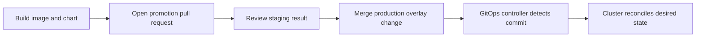
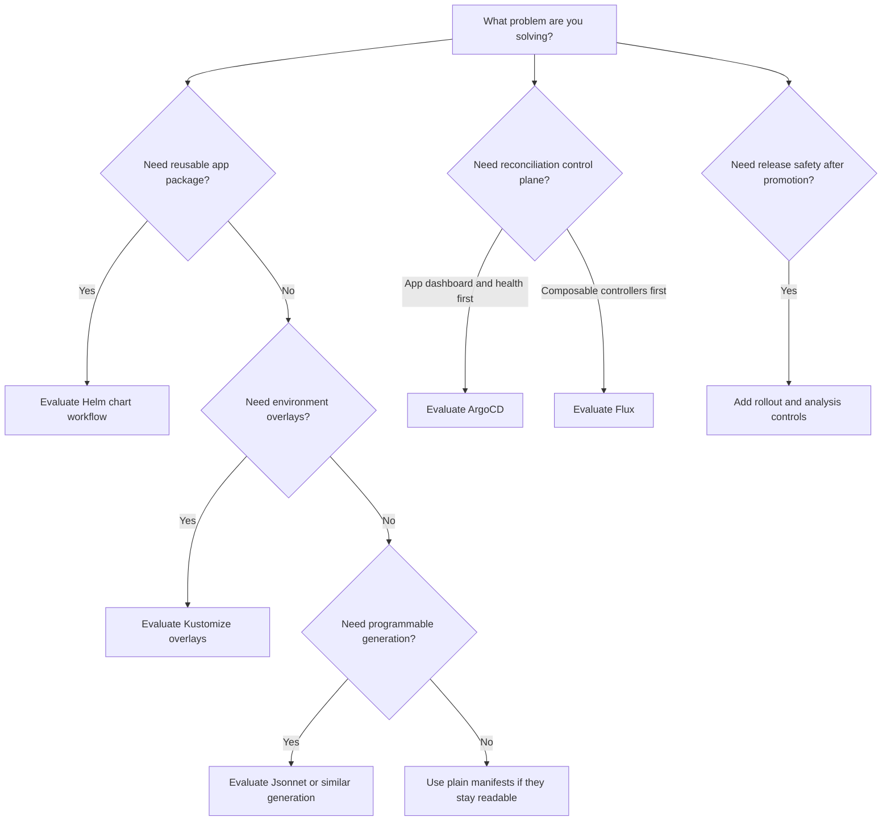

> **Напрямок CGOA** | Складність: **СЕРЕДНЯ** | Час: **75 хвилин** | Передумови: принципи GitOps, об'єкти Kubernetes, базовий словник CI/CD | Цільова версія Kubernetes: **1.35+**

## Результати навчання

Після цього модуля ви зможете:

- Порівнювати операційні моделі ArgoCD та Flux під час вибору інструментів GitOps для кластерів Kubernetes 1.35+.
- Проєктувати схеми просування репозиторіїв, які відокремлюють джерело істини, оверлеї середовищ та цілі для багатьох кластерів.
- Діагностувати помилки просування, розгортання та секретів, розмежовуючи відповідальності за рендеринг, узгодження та безпеку релізу.
- Реалізувати локальний робочий процес перевірки, що використовує `kubectl`, Helm, Kustomize та команди diff для огляду згенерованих маніфестів перед узгодженням.

## Чому цей модуль важливий

Коли команди ставляться до інструментів GitOps як до вправи з найменування під час термінової міграції платформи, виробничий збій може легко тривати годинами, якщо зміна чарта, оверлей середовища та політика автоматичної синхронізації зрушать одночасно. Глибша шкода є операційною: ніхто не може відповісти, що саме було неправильним — кластер, репозиторій, згенеровані маніфести чи процес просування, який пропустив якийсь контроль.

Той інцидент має форму багатьох збоїв GitOps. Команди впроваджують контролер, кладуть маніфести в Git і вважають, що архітектуру вирішено, бо слово GitOps з'являється на дашборді. Іспит не вимагатиме запам'ятати кожен прапорець у кожному інструменті, але запитає, чи здатні ви розпізнати операційний патерн за інструментом: що є джерелом істини, де відбувається рендеринг, як контролюється просування, який компонент узгоджує стан і де люди мають оцінити ризик перед тим, як контролер застосує зміни.

Цей модуль перетворює назви інструментів на архітектурні рішення. ArgoCD, Flux, Helm, Kustomize, Jsonnet, контролери розгортання, схеми репозиторіїв та патерни для багатьох кластерів — кожен із них вирішує окрему частину задачі доставляння. Коли ви можете розмістити кожен інструмент на шляху від наміру до робочого навантаження, відповіді з варіантами стають простішими, бо хибні відповіді зазвичай розмивають межі, які реальні системи мусять тримати окремо.

## Джерело істини, рендеринг та узгодження

GitOps починається з простої обіцянки: бажаний стан системи живе у версіонованому джерелі істини, а автоматизований цикл управління підводить живу систему до цього бажаного стану. Обіцянка звучить скромно, але вона змінює операційну модель, бо кластер більше не повинен залежати від людини, яка запускає одноразову команду з ноутбука. Контролер має вміти відновлюватися після дрейфу, доводити, що саме змінилося, і робити розгорнутий стан простежуваним до коміту, який пройшов огляд.

Найпростіший спосіб міркувати про інструменти GitOps — це розділити три відповідальності, які команди часто змішують. Репозиторій зберігає намір, інструмент рендерингу перетворює намір на конкретні об'єкти Kubernetes, а узгоджувач порівнює ці об'єкти зі станом кластера. Helm, Kustomize та Jsonnet зазвичай належать до простору рендерингу, тоді як ArgoCD та Flux належать до простору узгодження, хоча вони й можуть викликати інструменти рендерингу як частину свого робочого процесу.

```text
+---------------------+       ++---------------------+       ++---------------------+
| Git source of truth | ----> | Manifest rendering   | ----> | Cluster reconcile    |
| commits and reviews |       | Helm/Kustomize/etc.  |       | ArgoCD or Flux       |
+---------------------+       ++---------------------+       ++---------------------+
          |                              |                              |
          v                              v                              v
   Audit trail and                 Concrete YAML                 Live objects and
   promotion history               for Kubernetes                drift correction
```

Діаграма важлива, бо дає вам чіткий спосіб відкинути розмиті екзаменаційні відповіді. Якщо відповідь каже, що Helm "робить GitOps" сам по собі, вона пропускає безперервний цикл управління. Якщо відповідь каже, що CI має заштовхувати згенерований YAML напряму в кожен кластер, це все ще може бути автоматизацією, але це не pull-модель узгодження, якій GitOps зазвичай надає перевагу. Якщо відповідь каже, що Git має тримати лише сирцевий код застосунку, тоді як конфігурація кластера живе в коментарях до тікетів, вона втратила властивість джерела істини.

Перед запуском команд використовуйте явні команди, щоб приклади залишалися зрозумілими та відтворюваними. Питання у стилі CGOA може показувати або прямі виклики `kubectl`, або скорочення; важливо те, що дія перевіряє стан Kubernetes і не обходить непомітно робочий процес GitOps.

```bash
kubectl version --client
kubectl get namespaces
```

Скорочені команди не роблять систему сумісною з GitOps. Вони лише дають вам стислий спосіб перевірити те, що контролер уже зробив, а це інша відповідальність, ніж зміна бажаного стану. Дисциплінований оператор використовує `kubectl`, щоб спостерігати, діагностувати та підтверджувати, а потім змінює Git, коли бажаний стан мусить змінитися, бо пряма мутація кластера створює дрейф, який контролер може скасувати або приховати.

Зробіть паузу та спрогнозуйте: якщо колега запускає `kubectl edit deployment checkout-api` у продакшені, поки ArgoCD або Flux узгоджує стан із Git, який стан має перемогти після наступного циклу узгодження і чому? Правильне міркування — не "перемагає найшвидша команда"; бажаний стан у Git має перемогти, якщо тільки контролер не призупинено, не налаштовано хибно або не спрямовано на хибне джерело. Саме тому GitOps — це операційна модель, а не просто скорочення для розгортання.

Існують законні місця для CI/CD у системі GitOps, але CI/CD зазвичай готує вхідні дані, а не стає остаточним авторитетом над станом кластера. CI збирає образи, виконує тести, підписує артефакти і може відкрити pull request, що змінює тег образу чи значення чарта. Контролер GitOps потім помічає схвалену зміну в репозиторії та узгоджує кластер, що прив'язує історію розгортань до огляду в Git, а не ховає її в журналі конвеєра.

Інфраструктура як код також перетинається з GitOps, але цей перетин не є тотожністю. Інструменти IaC, такі як Terraform чи Pulumi, зазвичай створюють хмарні ресурси, мережі, кластери, бази даних та прив'язки ідентичності. Інструменти GitOps зазвичай узгоджують об'єкти Kubernetes та стан доставляння застосунків після того, як платформа вже існує. Деякі команди керують інфраструктурними контролерами всередині Kubernetes через GitOps, але іспит зазвичай хоче, щоб ви розпізнавали різницю між створенням інфраструктури та безперервним узгодженням бажаного стану.

Найкорисніша ментальна модель — це ресторанна кухня. Книга рецептів — це Git, станція підготовки — це рендеринг, а експедитор — це узгодження. Helm може перетворити багаторазовий рецепт на план страв, Kustomize може скоригувати цей план для локальної гілки, а ArgoCD чи Flux постійно порівнюють замовлення з тим, що покидає кухню. Якщо до експедитора, рецепта та станції підготовки ставляться як до одного цілого, ніхто не може сказати, де саме у процес закралася помилка.

## Патерни репозиторіїв та просування

Схема репозиторію — це не питання моди; це те, як команда кодує власність, межі огляду та потік просування. Монорепозиторій може зробити крос-застосункові зміни видимими в одному огляді, тоді як модель полірепозиторіїв може тримати власність чистою для незалежних команд. Жоден патерн не є автоматично правильним, тож іспит схильний питати, який макет пасує до сценарію, а не який макет універсально найкращий.

Базова перевірка полягає в тому, чи зберігає макет одне джерело істини, явне просування, відтворюваний рендеринг та контрольоване узгодження. Якщо те саме виробниче значення вручну скопійовано у три репозиторії, ви маєте проблему дрейфу, що чекає свого часу. Якщо staging та production вказують на плаваючі гілки без межі огляду, ви послабили просування. Якщо кожен кластер має окрему теку, але ніхто не може сказати, який коміт дійшов до якого кластера, макет видимий, але не придатний до експлуатації.

```text
repo/
  apps/
    checkout/
      base/
      overlays/
        dev/
        staging/
        prod/
  clusters/
    us-east/
      checkout.yaml
    eu-west/
      checkout.yaml
```

Ця проста структура ілюструє поширений поділ між конфігурацією застосунку та прив'язкою до кластера. Тека застосунку містить базу та оверлеї середовищ, тоді як тека кластера каже контролеру GitOps, що застосовувати до конкретної цілі. Менша команда може об'єднати ці теки, а більша платформна група може розділити їх між репозиторіями, але ті самі питання залишаються: хто схвалює зміни бази, хто схвалює виробничі оверлеї та який контролер стежить за кожним шляхом?

Просування означає переміщення відомої версії конфігурації або артефакту з одного етапу на інший під контролем. Розгортання — це акт застосування бажаного стану до цілі. Ці слова пов'язані, але плутання їх спричиняє погані рішення, бо розгортання може відбутися автоматично після просування, тоді як просування зазвичай має містити рішення, що проходить огляд. Команда, яка "просуває", перезбираючи образ із тим самим тегом, не просунула той самий артефакт; вона створила новий артефакт, що лише поділяє назву.



Наведена послідовність навмисно нудна, і це її перевага. Вона дає людям точку огляду перед зміною виробничого стану, дає автоматизації детермінований коміт для узгодження і дає тим, хто реагує на інциденти, чіткий шлях назад крізь історію Git. Коли екзаменаційне питання пропонує патерн, що обходить огляд, дозволяючи CI заштовхувати зміни напряму у виробничі кластери, шукайте, чи питає сценарій про принципи GitOps, чи про загальну швидкість автоматизації.

Оверлеї середовищ — поширений спосіб виразити відмінності без дублювання всього. Розробка може використовувати менше реплік, staging може вмикати додаткову діагностику, а production може вимагати суворіших запитів ресурсів, PodDisruptionBudgets та засобів контролю доступності. Kustomize природно обробляє цей стиль, бо компонує базу з патчами, тоді як Helm може виражати відмінності середовищ через файли значень. Будь-який підхід може спрацювати, але важливим є відтворюваний рендеринг із вхідних даних, що пройшли огляд.

```yaml
apiVersion: kustomize.config.k8s.io/v1beta1
kind: Kustomization
resources:
  - ../../base
patches:
  - target:
      kind: Deployment
      name: checkout-api
    patch: |-
      - op: replace
        path: /spec/replicas
        value: 3
```

Перед запуском цього: який результат ви очікуєте від команди рендерингу, якщо базовий Деплоймент відсутній або ім'я цілі патча неправильне? Сильна відповідь прогнозує помилку або незмінений рендер ще до того, як ви торкнетеся кластера, бо валідація під час рендерингу має ловити багато помилок раніше за узгодження. Ця звичка важлива і під час іспитів, і під час реальних інцидентів, бо вона відокремлює "маніфест було згенеровано неправильно" від "контролер не зміг застосувати правильний маніфест".

Макет для багатьох кластерів додає ще один вимір, бо кожен кластер може мати власну межу довіри, регіон, вимогу відповідності та домен відмов. Деякі команди використовують один репозиторій із текою `clusters/` для кожної цілі, тоді як інші використовують платформний репозиторій, що визначає спільні компоненти, та окремі репозиторії орендарів, що визначають застосунки. Безпечніший патерн — той, що дозволяє оператору відповісти, який коміт керує яким кластером, не відкриваючи таблицю.

Секрети ускладнюють проєктування репозиторіїв, бо Git — чудовий журнал аудиту і жахливе місце для облікових даних у відкритому вигляді. Команди GitOps зазвичай використовують зашифровані секрети, зовнішні оператори секретів, sealed secrets або хмарні менеджери секретів, щоб репозиторій містив посилання чи зашифрований матеріал, а не придатні до використання значення секретів. Іспит може не вимагати деталей конкретного інструмента, але він очікує, що ви уникатимете антипатерну, коли Kubernetes Secrets у відкритому вигляді комітять і називають репозиторій безпечним лише тому, що він приватний.

```yaml
apiVersion: external-secrets.io/v1beta1
kind: ExternalSecret
metadata:
  name: checkout-db
  namespace: checkout
spec:
  refreshInterval: 1h
  secretStoreRef:
    name: platform-secrets
    kind: ClusterSecretStore
  target:
    name: checkout-db
  data:
    - secretKey: password
      remoteRef:
        key: checkout/prod/db-password
```

Цей приклад тримає бажаний об'єкт Kubernetes у Git, залишаючи чутливе значення в бекенді секретів. Модель контролера й далі є декларативною, бо кластер зрештою має містити Secret з ім'ям `checkout-db`, але Git не містить пароля бази даних. У реальному огляді ви також перевірили б RBAC, межі простору імен, журнали аудиту та поведінку ротації, бо доставляння секретів безпечне лише тоді, коли довколишні дозволи відповідають передбаченому радіусу ураження.

Початковий модуль виділяв кілька навчальних опор, і вони залишаються корисними, бо цей оглядовий модуль CGOA є хабом, а не повноцінною заміною глибших уроків. Використовуйте ці посилання, коли хочете розгорнутий розгляд конкретного інструмента чи патерну:

- [ArgoCD](../../../platform/toolkits/cicd-delivery/gitops-deployments/module-2.1-argocd/)
- [Argo Rollouts](../../../platform/toolkits/cicd-delivery/gitops-deployments/module-2.2-argo-rollouts/)
- [Flux](../../../platform/toolkits/cicd-delivery/gitops-deployments/module-2.3-flux/)
- [Helm & Kustomize](../../../platform/toolkits/cicd-delivery/gitops-deployments/module-2.4-helm-kustomize/)
- [Стратегії репозиторіїв](../../../platform/disciplines/delivery-automation/gitops/module-3.2-repository-strategies/)
- [Просування середовищ](../../../platform/disciplines/delivery-automation/gitops/module-3.3-environment-promotion/)
- [Багатокластерний GitOps](../../../platform/disciplines/delivery-automation/gitops/module-3.6-multi-cluster/)
- [Безпека CI/CD](../../../platform/disciplines/reliability-security/devsecops/module-4.3-security-cicd/)

Один практичний спосіб переглянути макет репозиторію — оповісти шлях однієї зміни. Уявіть, що сервісу checkout потрібна нова версія образу у продакшені. Зміна має початися як артефакт, зібраний CI, з'явитися як переглянута зміна тега, дайджесту, значення чарта чи поля оверлею, а потім стати видимою для контролера GitOps після злиття. Якщо ви не можете оповісти цей шлях, не сказавши "хтось також запускає цю задачу" чи "хтось пам'ятає оновити ту іншу теку", макет покладається на пам'ять, а не на архітектуру.

Та сама оповідь викриває помилки власності. Команди застосунків зазвичай знають, чи готова версія `1.35.0` до продакшену, але вони можуть не володіти квотою простору імен, класом інгресу, сховищем зовнішніх секретів чи ресурсами початкового завантаження кластера, що роблять робоче навантаження безпечним для запуску. Платформні команди зазвичай володіють цими спільними засобами контролю, але їм не треба схвалювати кожне підвищення версії образу застосунку. Зріла стратегія репозиторію дозволяє обом групам переглядати власний шар, не даючи жодній групі випадкового контролю над усім господарством.

Проєктування просування також має часовий вимір. Деякі організації просувають, зливаючи pull request зі значень оверлею `staging` у значення оверлею `prod`, тоді як інші просувають, переміщуючи вказівник середовища на тег релізу. Обидва підходи можуть бути слушними, коли вони зберігають відомий артефакт та рішення, придатне до аудиту. Небезпечна версія — це конвеєр, що перезбирає образ під час "просування", бо тепер staging та production не виконували те саме, навіть якщо мітка версії виглядає схожою.

У багатокластерних системах найбезпечніші рішення роблять націлювання на кластери нудним. Рецензент має могти побачити, чи впливає зміна на один кластер, один регіон, одне середовище чи на кожен кластер, за яким стежить контролер початкового завантаження. Саме тому широкі батьківські застосунки, спільні значення Helm та глобальні бази Kustomize вимагають суворішого огляду, ніж оверлей одного орендаря. Що більше кластерів контролює шлях, то ретельніше слід оберігати доступ та просування.

Явне просування також має перевагу для відновлення. Під час інциденту ті, хто реагує, можуть запитати, який коміт впровадив виробничий бажаний стан, на який артефакт він посилався і який контролер його узгодив. Якщо відповідь доступна в Git та статусі контролера, відкат стає контрольованою зміною, а не детективною роботою. Якщо відповідь живе в журналах конвеєра, повідомленнях чату та ручних командах, команда може витратити найдорожчі хвилини на реконструкцію історії.

## Порівняння інструментальних моделей ArgoCD та Flux

ArgoCD часто є найлегшим інструментом GitOps для пояснення, бо він пропонує застосунко-центричну модель. Ви визначаєте Application, що вказує на джерело, шлях чи чарт та цільовий кластер або простір імен. ArgoCD потім генерує бажані маніфести, порівнює їх із живим станом, повідомляє статус синхронізації та справність і за бажанням застосовує зміни автоматично. Його інтерфейс користувача та CLI роблять цикл узгодження видимим, що цінно для команд, яким потрібна спільна операційна площина управління.

Flux підходить до тієї самої задачі GitOps як набір спеціалізованих контролерів. Контролер джерел отримує джерела, контролер kustomize застосовує Kustomizations, контролер helm керує релізами Helm, а контролери сповіщень та автоматизації образів обробляють суміжні робочі процеси. Ця модульність може відчуватися менше як єдиний продуктовий дашборд і більше як Kubernetes-нативна композиція контролерів. Це потужно, коли платформна команда хоче малих компонованих будівельних блоків, але вимагає від операторів розуміння того, як контролери взаємодіють.

```text
+---------------------------+     ++---------------------------+
| ArgoCD application view    |     | Flux controller toolkit    |
| Application owns source,   |     | Source, Kustomization,     |
| render, destination, sync  |     | HelmRelease, notification  |
+---------------------------+     ++---------------------------+
| Strong visual operations   |     | Strong composable objects  |
| App-level health model     |     | Kubernetes-native pieces   |
+---------------------------+     ++---------------------------+
```

Жодна з моделей не є за своєю суттю "більш GitOps", ніж інша. ArgoCD може бути декларативним і pull-орієнтованим, і Flux може бути декларативним і pull-орієнтованим. Практична різниця в тому, як команди експлуатують систему: ArgoCD схильний робити застосунки першокласними операційними об'єктами, тоді як Flux схильний робити ресурси контролерів першокласними будівельними блоками. Гарна екзаменаційна відповідь порівнює ці моделі, не вдаючи, що один інструмент володіє концепцією GitOps.

Збережена порівняльна таблиця з початкового модуля фіксує ключові відмінності, що залишаються релевантними для іспиту:

| Порівняння | Що варто запам'ятати |
|---|---|
| GitOps проти CI/CD | GitOps керує бажаним станом; CI/CD збирає та постачає артефакти |
| GitOps проти IaC | IaC стосується створення інфраструктури; GitOps стосується циклу управління та моделі узгодження |
| ArgoCD проти Flux | ArgoCD застосунко-центричний; Flux контролеро-центричний і модульніший |
| Helm проти Kustomize | Helm шаблонізує, Kustomize патчить |
| Push проти pull | GitOps надає перевагу pull-узгодженню зсередини цільового середовища |

Операційно ArgoCD сяє, коли команда виграє від видимого інвентарю застосунків, кнопок синхронізації, перевірок справності та застосунко-орієнтованого словника огляду. Інженер підтримки може оглянути Application, побачити, чи він синхронізований, та порівняти живий стан із цільовим. Ця видимість може скоротити час інциденту, бо площина управління дає спільну мову розробникам, платформним інженерам та менеджерам релізів.

Flux сяє, коли команда хоче, щоб ресурси GitOps відчувалися як звичайні об'єкти Kubernetes API, які можна компонувати, делегувати та спостерігати тими самими патернами, що використовуються деінде в кластері. Платформна команда може визначити джерела, Kustomizations, HelmReleases та сповіщення як окремі частини з різними межами власності. Це робить Flux привабливим у середовищах із багатьма орендарями чи високоавтоматизованих середовищах, де композиція контролерів важливіша за центральний дашборд застосунків.

ArgoCD та Flux обидва підтримують робочі процеси Helm та Kustomize, але деталі інтеграції відрізняються. ArgoCD може генерувати чарти Helm та оверлеї Kustomize як частину Application, тоді як Flux надає контролер helm та контролер kustomize із виділеними кастомними ресурсами. Коли питання запитує, який інструмент "використовує Helm", кращою відповіддю може бути те, що обидва можуть, а вирішальним чинником є те, чи наголошує сценарій на досвіді застосункової площини управління, чи на модульних ресурсах контролерів.

Іспит також може згадати сповіщення, спостережуваність та автоматизацію образів. Це не декоративні додатки; вони вирішують, чи буде система GitOps придатною до експлуатації після першої вдалої синхронізації. Контролер, що мовчки не може отримати репозиторій або повторно застосовує зламаний маніфест, усе ще автоматизований, але він недружній до людей. Гарне проєктування GitOps робить спостережуваними статус узгодження, дрейф, справність та історію просування.

Поширений режим відмови виникає, коли команди вдало впроваджують контролер GitOps для одного кластера, а потім копіюють патерн у регіональні кластери, не вирішивши, хто володіє сповіщеннями. Маніфести можуть бути технічно правильними, але невдалі узгодження доходять лише до каналу чату, який ніхто не моніторить після робочих годин. Ліки — не новий інструмент розгортання; це призначення власності, підключення сповіщень до правильної команди та ставлення до невдалого узгодження як до операційної події, а не до дашбордної цікавинки.

Який підхід ви обрали б тут і чому: мала продуктова команда хоче видимий дашборд застосунків для десяти сервісів, тоді як платформна команда хоче, щоб команди-орендарі володіли окремими ресурсами Kubernetes у багатьох кластерах? Перший сценарій часто схиляється до ArgoCD, бо важлива видимість застосунків, а другий часто схиляється до Flux, бо компоновані ресурси контролерів пасують до делегування. Відповідь — не вподобання бренду; це відповідність між операційною формою та моделлю інструмента.

Порівнюючи ці інструменти під екзаменаційним тиском, стережіться відповідей, що описують досвід користувача так, ніби він є архітектурою. Інтерфейс користувача може зробити ArgoCD легшим в експлуатації для багатьох команд, але UI — це не принцип GitOps. Так само декомпозиція контролерів Flux може зробити його більш Kubernetes-нативним на відчуття, але декомпозиція контролерів не є автоматично кращою, якщо команда не може налагодити взаємозв'язки. Архітектурне питання полягає в тому, як бажаний стан отримується, генерується, застосовується, спостерігається та керується.

Вам також слід відокремити топологію встановлення від операційної моделі. ArgoCD може керувати багатьма кластерами з однієї площини управління, а Flux можна встановити на кожен кластер або в патернах, що підтримують керування флотом. Ці вибори впливають на облікові дані, мережеві шляхи та радіус ураження. Централізована площина управління може спростити видимість, але концентрує довіру, тоді як контролери на кожен кластер зменшують спільний радіус ураження, але вимагають узгодженого початкового завантаження та сповіщень для багатьох цілей.

Ще одна точка порівняння — як кожен інструмент виражає залежності. Команди ArgoCD часто моделюють упорядкування за допомогою хвиль синхронізації, гачків та структур app-of-apps, тоді як команди Flux можуть моделювати залежності між Kustomizations чи HelmReleases. `ApplicationSet` генерує `Application` ArgoCD з генераторів (наприклад, списку кластерів, Git-тек чи pull request'ів), що є стандартним патерном для багатьох кластерів / флоту — на відміну від ручного підтримання одного `Application` на кожну ціль. Обидва підходи можуть спрацювати, і обома можна зловживати. Якщо оператор бази даних, політика простору імен та розгортання застосунку узгоджуються у неправильному порядку, проблема в проєктуванні залежностей, а не в самій наявності GitOps.

Нарешті, поміркуйте, як кожен інструмент обробляє дрейф у людських робочих процесах. Візуальний diff ArgoCD може зробити дрейф очевидним для того, хто реагує, тоді як ресурси Kubernetes у Flux можуть зробити дрейф видимим через знайомі стани та події об'єктів. У будь-якій моделі команді все одно потрібне правило для ручних змін: спостерігати командами кластера, лагодити бажаний стан у Git та залишати пряму мутацію для задокументованих надзвичайних ситуацій. Без цього правила інструмент лише автоматизує конфлікт між людьми та контролерами.

## Межі Helm, Kustomize, Jsonnet та розгортань

Helm, Kustomize та Jsonnet найкраще розуміти як способи виробництва маніфестів Kubernetes, а не як заміну узгодженню. Helm пакує та шаблонізує застосунки, Kustomize патчить та накладає оверлеї на сирий YAML без шаблонів, а Jsonnet генерує конфігурацію через мову програмування. Кожен інструмент може зменшити повторення, але кожен інструмент також додає режим відмови ще до того, як контролер заговорить із Kubernetes API.

Helm корисний, коли застосунку потрібне багаторазове пакування, параметри, залежності чартів та знайомий формат розповсюдження. Багато сторонніх застосунків публікують чарти Helm, бо чарт може поєднати шаблони, значення за замовчуванням та опції під час встановлення в одному артефакті. Компроміс у тому, що шаблонізація може стати непрозорою, коли файли значень, допоміжні шаблони та умовні конструкції взаємодіють. Огляд GitOps має перевіряти згенерований вивід, а не лише вхідні дані чарта.

```bash
helm template checkout ./charts/checkout \
  --namespace checkout \
  --values environments/prod/values.yaml > /tmp/checkout-prod.yaml
```

Наведена команда сама по собі не є розгортанням. Вона генерує чарт, щоб ви могли оглянути об'єкти Kubernetes, які контролер GitOps узгодив би згодом. Ця відмінність — справжній екзаменаційний скарб, бо вона відокремлює пакування від поведінки циклу управління. Якщо згенерований Деплоймент містить неправильний тег образу, проблема у значеннях чи шаблонах чарта; якщо згенерований Деплоймент правильний, але живий стан відрізняється, розслідування зміщується до узгодження, дозволів чи дрейфу.

Kustomize корисний, коли базові маніфести вже близькі до того, що вам потрібно, а відмінності середовищ можна виразити як патчі, згенеровані ConfigMaps, перевизначення образів чи композицію ресурсів. Він уникає окремої мови шаблонів, що тримає прості оверлеї читабельними. Компроміс у тому, що складна умовна логіка природно не належить Kustomize, тож команди іноді розтягують патчі, доки структура не стане складнішою для розуміння, ніж був би чарт.

```bash
kustomize build apps/checkout/overlays/prod > /tmp/checkout-kustomize-prod.yaml
kubectl diff -f /tmp/checkout-kustomize-prod.yaml
```

Крок `kubectl diff` — цінна звичка огляду, бо він порівнює згенерований бажаний стан із живим станом кластера перед застосуванням. У робочому процесі GitOps ви можете не застосовувати зі свого терміналу, але ви все одно можете використовувати diff-мислення під час огляду чи інциденту. Якщо diff показує несподіване видалення ServiceAccount, правильною реакцією є виправити Git перед узгодженням, а не чекати, поки контролер здивує продакшен.

Jsonnet пасує, коли генерація конфігурації потребує сильнішої абстракції, ніж надають патчі Kustomize чи шаблони Helm. Він може моделювати багаторазові бібліотеки, обчислені об'єкти та спільні домовленості у великих господарствах. Ціна в тому, що він вносить мову програмування у шлях маніфестів, тож рецензентам потрібно достатньо навичок, щоб міркувати про згенерований вивід. Для CGOA ключовим є знати, чому команди використовують Jsonnet, а не запам'ятовувати його синтаксис.

Інструменти розгортання сидять на іншій межі. Argo Rollouts, контролери прогресивного доставляння, зсув трафіку сервісної сітки та інструменти канаркового аналізу допомагають вирішити, як нова версія досягає користувачів після зміни бажаного стану. Вони не замінюють Git як джерело істини чи контролер GitOps як узгоджувач. Вони додають безпеку релізу всередині кластера, керуючи такими кроками, як канаркові ваги, перевірки аналізу, паузи та поведінка відкату.

```yaml
apiVersion: argoproj.io/v1alpha1
kind: Rollout
metadata:
  name: checkout-api
  namespace: checkout
spec:
  replicas: 3
  strategy:
    canary:
      steps:
        - setWeight: 20
        - pause:
            duration: 10m
        - setWeight: 50
        - pause:
            duration: 10m
  selector:
    matchLabels:
      app: checkout-api
  template:
    metadata:
      labels:
        app: checkout-api
    spec:
      containers:
        - name: checkout-api
          image: ghcr.io/example/checkout-api:1.35.0
          ports:
            - containerPort: 8080
```

Цей маніфест Rollout належить у Git, як і будь-який інший бажаний стан, але він змінює те, що відбувається під час узгодження. Замість заміни всіх подів одразу контролер розгортання дотримується канаркового плану і може призупинитися для аналізу чи людського схвалення. Саме тому просування та розгортання — пов'язані, але окремі концепції: просування схвалює бажану версію для етапу, тоді як розгортання контролює експозицію всередині цільового середовища.

Та сама відмінність допомагає із секретами. Файл значень Helm, що містить пароль бази даних, генератор секретів Kustomize, що комітить літерали у відкритому вигляді, чи бібліотека Jsonnet, що вбудовує облікові дані, створює проблему безпеки ще до того, як залучено контролер GitOps. Безпечніша архітектура тримає посилання на секрети, зашифровані значення чи декларації зовнішніх секретів у Git, а потім дозволяє компоненту на боці кластера матеріалізувати робочий Secret під контрольованими дозволами.

Межі інструментів також впливають на усунення несправностей. Якщо Application GitOps не синхронізований, бо патч Kustomize падає, заміна контролера не виправить патч. Якщо чарт Helm генерується нормально, але кластер відхиляє об'єкт, ви досліджуєте валідацію Kubernetes API, політики допуску, RBAC чи сумісність версій. Якщо розгортання призупинилося, бо метрики не пройшли, бажаний стан може бути правильним, тоді як безпека релізу виконує свою роботу.

У середовищах Kubernetes 1.35+ ця обізнаність про межі стає важливішою, бо політики платформи, засоби контролю допуску та екосистеми контролерів зазвичай зрілі. Платформа може мати рушії політик, що відхиляють небезпечні поди, мережеві політики, що впливають на проби, чи квоти простору імен, що заважають масштабуванню. GitOps не прибирає ці засоби контролю; він дає вам простежуваний спосіб побачити, який бажаний стан зіткнувся з ними.

Інструменти рендерингу заслуговують на тести з тієї самої причини, з якої коду застосунку потрібні тести: рецензентам не слід подумки виконувати кожен шаблон, патч чи згенерований об'єкт. Легка команда огляду, що генерує виробничий шлях та запускає перевірки схеми, політики чи diff, може зловити помилки раніше, ніж контролер спробує їх узгодити. Контролер залишається актором, що застосовує бажаний стан, але процес огляду стає розумнішим, бо він бачить остаточний YAML, а не лише вхідні дані.

Значення чартів Helm вимагають особливої дисципліни, бо мале значення може запустити велике розгалуження шаблону. Один булевий прапорець може створити інгрес, вимкнути контекст безпеки, змінити тип Сервісу чи прибрати монтування тома. Ця гнучкість і робить чарти корисними, але саме тому рецензент GitOps має просити згенерований вивід, коли чарт нетривіальний. Питання не в тому, чи довіряють Helm; питання в тому, чи безпечний конкретний згенерований стан.

Патчі Kustomize мають протилежний режим відмови. Вони часто прозорі спочатку, а потім стають важкими для розуміння, коли оверлеї нагромаджують патчі поверх баз, компонентів, трансформацій образів та згенерованих ресурсів. Виробничий оверлей, що потребує багатьох JSON-патчів, може казати вам, що база більше не представляє гарну спільну абстракцію. Практичним виправленням може бути розділення бази, спрощення власності чи перехід до підходу пакування, що краще пасує до варіацій.

Jsonnet та подібні системи генерації піднімають планку огляду, бо репозиторій тепер містить код, що пише конфігурацію. Це може бути правильним вибором для великої платформи з повторюваними патернами, але він має супроводжуватися оглядом згенерованого виводу, власністю бібліотек та правилами стилю. Інакше команда обмінює дубльований YAML на кастомне середовище програмування, яке розуміють лише кілька людей. GitOps усе ще працює, але джерело істини стало абстрактнішим.

Контролери розгортання слід оцінювати з тією самою дисципліною меж. Канаркова стратегія корисна лише тоді, коли метрики, поведінка пауз, шар маршрутизації та очікування щодо відкату належать комусь та спостерігаються. Якщо ніхто не знає, хто реагує на невдалий запуск аналізу, контролер розгортання може перетворити поганий реліз на довгу неоднозначну паузу. Гарне прогресивне доставляння робить реліз безпечнішим, а режим відмови — чіткішим.

## Патерни та антипатерни

Гарний патерн GitOps робить важливе рішення придатним до огляду перед тим, як контролер діє. Це не означає, що кожна дрібна зміна потребує наради; це означає, що виробничий намір, просування, поводження із секретами та націлювання на кластери мають бути видимими в системі контролю версій. Найсильніші патерни також створюють вузьке інцидентне питання: якщо система неправильна, що ми виправляємо — джерело, рендеринг, узгодження, політику розгортання чи дозволи кластера?

| Патерн | Коли його використовувати | Чому він працює | Міркування щодо масштабування |
|---|---|---|---|
| Оверлеї середовищ | Розробка, staging та production поділяють базу, але потребують контрольованих відмінностей | Рецензенти можуть бачити точно, що відрізняється за етапом | Тримайте патчі досить малими, щоб згенерований вивід залишався зрозумілим |
| App-of-apps чи початкове завантаження кластера | Багато застосунків мають реєструватися узгоджено | Батьківський об'єкт може оголосити дочірні застосунки чи узгодження | Захищайте батьківські репозиторії, бо вони контролюють широкий радіус ураження |
| Pull-узгодження | Кластери не повинні довіряти прямий доступ до розгортання зовнішнім раннерам CI | Контролер діє зсередини цільового середовища з обмеженими дозволами | Проєктуйте мережевий доступ, облікові дані та сповіщення для кожного кластера |
| Прогресивне доставляння | Експозиція користувачів має зростати поступово після просування версії | Контролери розгортання додають канаркову поведінку, паузи та аналіз | Зробіть власність метриками явною, інакше паузи стають заплутаними |

Патерни зазнають невдачі, коли команди копіюють видиму форму, але не межу контролю. Репозиторій із багатьма теками не є стратегією просування, якщо production стежить за тією самою змінюваною гілкою, що й розробка. Дашборд не є спостережуваністю, якщо невдалі узгодження нікого не сповіщають. Чарт не є багаторазовим, якщо кожне середовище форкає шаблон і змінює його вручну.

| Антипатерн | Що йде не так | Чому команди в це потрапляють | Краща альтернатива |
|---|---|---|---|
| CI заштовхує напряму в кластери | Історія розгортань ховається в запусках конвеєра, а облікові дані кластера поширюються | Це відчувається швидше, ніж навчати команди просуванню GitOps | CI відкриває переглянуті зміни; контролери тягнуть з Git |
| Плаваючі теги образів у продакшені | Той самий коміт Git може з часом давати інший робочий код | Команди хочуть автоматичних оновлень без роботи з просування | Просувайте незмінні теги чи дайджести через переглянуті коміти |
| Секрети у відкритому вигляді в Git | Приватні репозиторії все одно розкривають облікові дані під час клонів, у журналах та форках | YAML Kubernetes Secret виглядає нешкідливим, бо значення закодовані | Використовуйте зовнішні чи зашифровані робочі процеси секретів з обмеженим доступом |
| Розповзання інструментів без меж | Інциденти стають суперечками про те, який інструмент володіє станом | Кожна команда додає інструмент для одного болю | Задокументуйте власність джерела, рендерингу, узгодження та розгортання |

Початковий модуль також виділяв поширені пастки, що й досі заслуговують збереження, бо вони прямо відображаються на екзаменаційні дистрактори:

| Помилка | Чому вона шкодить | Краща відповідь |
|---|---|---|
| Ставлення до ArgoCD та Flux як до одного продукту | Вони перетинаються, але їхні архітектури відрізняються | Поясніть різні операційні моделі |
| Думка, що Helm дорівнює GitOps | Helm — це пакування, а не цикл управління | Відокремте час рендерингу від часу узгодження |
| Плутання просування з розгортанням | Просування — це контрольоване переміщення відомого артефакту/конфігурації | Використовуйте словник обережно |
| Забування про сповіщення та спостережуваність | Офіційний домен CGOA включає взаємодію з цими інструментами | Згадуйте їх як частину операційної моделі |

У багатьох екзаменаційних сценаріях ховається тонкий антипатерн: команда використовує словник GitOps, але все одно покладається на ручну мутацію кластера під час інцидентів. Аварійний доступ іноді необхідний, особливо коли зламано сам контролер, але за ним має йти узгодження назад у Git. Інакше живий кластер стає другим джерелом істини, і наступна автоматична синхронізація може стерти аварійне виправлення без контексту.

Ще один патерн, який варто розпізнавати, — це шарувата власність. Команди застосунків можуть володіти тегами образів та конфігурацією, специфічною для сервісу, тоді як платформні команди володіють політикою простору імен, стандартами інгресу, сховищами секретів та початковим завантаженням кластера. GitOps добре працює, коли ці шари власності відображені в дозволах репозиторію та правилах огляду. Він працює погано, коли кожна команда може змінити кожен об'єкт кластера, бо репозиторій легше відкрити, ніж виробничий кластер.

Нарешті, не плутайте чисте дерево репозиторію з чистою операційною моделлю. Гарний макет тек усе одно може зазнати невдачі, якщо ніхто не валідує згенеровані маніфести, якщо сповіщення ігнорують або якщо виробниче просування — це просто злиття з особистої гілки. Архітектура GitOps доводиться під час нудних оглядів та стресових інцидентів, а не лише на архітектурних діаграмах.

Найстійкіші команди ставляться до патернів GitOps як до контрактів між людьми та автоматизацією. Контракт репозиторію каже, де живе бажаний стан і хто може його змінювати. Контракт рендерингу каже, як виробляються та валідуються остаточні маніфести. Контракт узгодження каже, який контролер застосовує стан і як виринають збої. Контракт розгортання каже, як користувачі піддаються зміні. Коли ці контракти записані, міграції інструментів та передачі під час інцидентів стають менш особистими та механічнішими.

Антипатерни зазвичай з'являються, коли один із цих контрактів неявний. Старший інженер може знати, що виробничі оверлеї вимагають додаткового огляду, але новий колега може бачити лише теку та кнопку злиття. Власник платформи може знати, що прямі правки кластера перезаписуються, але той, хто реагує на інцидент, може сприймати `kubectl edit` як звичайне виправлення. GitOps зменшує прихований стан лише тоді, коли команди також зменшують прихований процес.

Масштабування додає ще одне джерело тиску. Макет, що працює для трьох сервісів, може стати ризикованим для тридцяти команд, якщо кожне просування торкається того самого спільного файлу чи вимагає того самого платформного схвалювача. І навпаки, сильно розділена модель репозиторіїв може стати повільною, якщо малі зміни вимагають синхронізованих pull request'ів у надто багатьох місцях. Найкращий патерн — це найменша структура, що зберігає власність, придатність до огляду та простежуваність на поточному масштабі.

## Рамка прийняття рішень

Обираючи патерн чи інструмент GitOps, почніть із локалізації рішення на шляху доставляння. Якщо ви обираєте, як генеруються маніфести, порівняйте Helm, Kustomize, Jsonnet чи чистий YAML. Якщо ви обираєте, як кластери сходяться до бажаного стану, порівняйте ArgoCD та Flux. Якщо ви обираєте, як версія поступово досягає користувачів, оцініть інструменти розгортання. Змішування цих питань зазвичай дає відповіді, що звучать упевнено, але вирішують не ту задачу.



Використовуйте цю рамку як інструмент міркування, а не як жорсткий чек-лист закупівлі. Команда може використовувати Helm з ArgoCD, Kustomize з Flux, ресурси HelmRelease у Flux чи оверлеї Kustomize, згенеровані ArgoCD. Слушні комбінації менш важливі за межі: одна частина генерує, інша узгоджує, а розгортання контролює експозицію релізу після прийняття бажаного стану.

| Сценарій | Надати перевагу | Обґрунтування |
|---|---|---|
| Команда хоче видимий інвентар застосунків та ручні засоби контролю синхронізації | ArgoCD | Статус застосунку, справність, diff та концепції синхронізації є першокласними |
| Платформа хоче компоновані Kubernetes-нативні ресурси GitOps | Flux | Контролери source, Kustomization, HelmRelease, сповіщень та автоматизації можна делегувати |
| Сторонній застосунок постачає зрілий пакет | Helm | Пакування чартів та значення дають багаторазову поверхню встановлення |
| Тому ж застосунку потрібні малі зміни на середовище | Kustomize | База плюс оверлеї тримають відмінності явними без логіки шаблонів |
| Виробнича експозиція має наростати поступово | Контролер розгортання | Канаркові кроки та аналіз керують експозицією користувачів після просування |

Для екзаменаційних питань читайте сценарій на предмет власності та режиму відмови перед тим, як читати відповіді. Якщо проблема в тому, що production та staging відрізняються лише трьома полями, відповідь про заміну контролера GitOps, ймовірно, надто широка. Якщо проблема в тому, що оператори не бачать справності синхронізації, відповідь про переписування кожного чарта може промахнутися повз операційний біль. Якщо проблема в тому, що розгортання миттєво відправило весь трафік на погану версію, відсутнім елементом може бути прогресивне доставляння, а не макет репозиторію.

Найсильніша відповідь часто згадує компроміси. Видима площина управління ArgoCD може бути легшою в експлуатації для змішаних команд, але вона вносить центральний погляд на застосунки, яким треба керувати. Модульність Flux може пасувати до просунутих платформних рішень, але команда має розуміти кілька контролерів та кастомних ресурсів. Helm може запакувати складне ПЗ, але непрямість шаблонів може приховати ризикований вивід. Kustomize тримає оверлеї простими, але він може стати незручним для сильно умовної генерації.

Коли сумніваєтеся, ставте чотири питання по порядку. По-перше, де зберігається та переглядається бажаний стан? По-друге, як виробляється остаточний YAML Kubernetes? По-третє, який контролер узгоджує цей YAML у кожен кластер? По-четверте, як обробляються ризик, секрети, безпека розгортання та спостережуваність після початку узгодження? Запропонована архітектура, що не може відповісти на ці питання, не готова, навіть якщо вона використовує популярну назву інструмента.

Для швидкого екзаменаційного проходу підкресліть дієслово в сценарії. Якщо команді треба запакувати застосунок, думайте Helm. Якщо команді треба налаштувати базу на кожне середовище, думайте Kustomize. Якщо команді треба безперервне виправлення з Git, думайте ArgoCD чи Flux. Якщо команді треба безпечніша експозиція після прийняття версії, думайте про патерни розгортання. Варіанти відповідей часто намагаються заманити вас до розв'язання іншого дієслова, ніж те, яке справді використав сценарій.

Для реального огляду проєктування додайте п'яте питання: що станеться, коли це піде не так о 03:00? Найкраща архітектура дає черговому інженеру короткий слід від сповіщення до статусу контролера, від статусу контролера до згенерованого об'єкта, від згенерованого об'єкта до коміту Git і від коміту Git до людського огляду. Якщо слід перетинає надто багато інструментів без власності, система може бути елегантною під час демонстрацій та болісною під час інцидентів.

Також варто запитати, як проєкт обробляє навмисний дрейф. Деякі об'єкти кластера можуть створюватися операторами, контролерами допуску, сервісними сітками чи хмарними інтеграціями після того, як контролер GitOps застосував базовий об'єкт. Зрілий налаштунок GitOps відрізняє нешкідливі відмінності керованих полів від небезпечного дрейфу в бажаних полях. Без цієї відмінності команди або ігнорують реальний дрейф, або борються з контролерами, що лише повідомляють про очікувані мутації.

Остаточне рішення рідко є постійним. Команди часто починають з одного репозиторію, оверлеїв Kustomize та видимої площини управління ArgoCD, бо цю комбінацію легко навчати. Згодом вони можуть запровадити композицію контролерів у стилі Flux, власність HelmRelease, оператори зовнішніх секретів чи формальніші репозиторії просування. Важливо еволюціонувати модель свідомо, зберігаючи межі джерело-рендеринг-узгодження в міру зростання складності.

## Чи знали ви?

- ArgoCD почався як проєкт з відкритим кодом в Intuit у 2018 році. Проєкт Argo досяг статусу Graduated у CNCF у грудні 2022 року (того самого року, коли Flux став Graduated); Argo CD є його найвідомішим підпроєктом.
- Flux досяг статусу Graduated у CNCF у 2022 році, що відображає широке впровадження та зрілість проєкту, а не зміну базової ідеї циклу управління GitOps.
- Kustomize вже багато років доступний через `kubectl kustomize`, тож команди можуть генерувати оверлеї за допомогою Kubernetes-нативного інструментарію, навіть коли вони не запускають контролер GitOps локально.
- Kubernetes Secrets за замовчуванням лише закодовані в base64, а не зашифровані для кожного, хто читає репозиторій, тому рішенням GitOps потрібні свідомі патерни керування секретами.

## Типові помилки

| Помилка | Чому вона трапляється | Як її виправити |
|---|---|---|
| Вибір ArgoCD чи Flux за популярністю замість операційної моделі | Назви інструментів легше порівнювати, ніж власність, видимість та композицію контролерів | Порівняйте, чи потрібна сценарію застосунко-центрична площина управління, чи модульні Kubernetes-нативні контролери |
| Ставлення до рендерингу Helm як до узгодження | Команди Helm можуть встановлювати ресурси, тож учні розмивають пакування з безперервним циклом управління | Відокремте рендеринг чарта від контролера GitOps, що стежить за Git та виправляє дрейф |
| Просування змінюваних тегів образів між середовищами | Команди хочуть автоматичних оновлень і обирають теги, як-от `latest` чи `main`, для зручності | Просувайте незмінні теги чи дайджести через переглянуті коміти, щоб кожне середовище вказувало на відомий артефакт |
| Копіювання маніфестів Secret у відкритому вигляді в приватний репозиторій | Вивід base64 виглядає закодованим, а репозиторій відчувається захищеним контролем доступу | Використовуйте зашифровані секрети, оператори зовнішніх секретів чи керовані сховища секретів з обмеженими дозволами кластера |
| Проєктування оверлеїв, що приховують виробничі відмінності | Малі патчі з часом ростуть, доки рецензенти не можуть передбачити згенерований вивід | Регулярно генеруйте та переглядайте остаточний YAML, потім рефакторте бази чи розділяйте оверлеї, коли diff стає неясним |
| Дозвіл CI заштовхувати напряму в кожен кластер | Розгортання через конвеєр відчуваються знайомими, особливо перед тим, як команди довіряють pull-узгодженню | Дозвольте CI збирати та пропонувати зміни, а потім дозвольте ArgoCD чи Flux узгоджувати схвалений бажаний стан з Git |
| Ігнорування сповіщень про узгодження після першої вдалої синхронізації | Команди святкують початкове розгортання та забувають, що контролери теж падають | Спрямовуйте сповіщення про синхронізацію, справність, отримання джерела та дрейф до власників, які можуть змінити репозиторій чи конфігурацію контролера |

## Тест

<details><summary>Ваша команда використовує чарти Helm у Git, а задача CI запускає `helm upgrade` проти продакшену після кожного злиття. Якої межі GitOps бракує?</summary>

Бракує безперервного pull-узгодження з оголошеного джерела істини в кластер. Helm — це пакування та рендеринг, і `helm upgrade` може розгортати ресурси, але задача CI діє як прямий авторитет розгортання. Відповідь у дусі GitOps зазвичай мала б CI, що збирає чи пропонує переглянуту зміну, а потім ArgoCD чи Flux узгоджували б схвалений стан з Git. Це відображається на результат щодо діагностики відповідальностей за рендеринг проти узгодження.

</details>

<details><summary>Платформна команда хоче, щоб команди-орендарі володіли окремими об'єктами GitOps у багатьох кластерах, і вона надає перевагу малим Kubernetes-нативним контролерам перед центральним дашбордом застосунків. Яка модель інструмента пасує найкраще і який компроміс вони мають прийняти?</summary>

Flux часто пасує до цього сценарію, бо його контролери source, kustomize, helm, сповіщень та автоматизації можна компонувати як ресурси Kubernetes. Компроміс у тому, що операторам треба розуміти кілька типів контролерів замість покладання на один застосунко-центричний погляд. ArgoCD усе ще міг би спрацювати, але сценарій наголошує на модульному делегуванні, а не на спільних дашбордних операціях. Це перевіряє результат щодо порівняння операційних моделей ArgoCD та Flux.

</details>

<details><summary>Виробничий оверлей змінює кількість реплік, запити ресурсів та ендпоінт бази даних, але рецензенти не можуть сказати, який остаточний YAML дійде до кластера. Що команді слід оглянути перед узгодженням?</summary>

Команді слід згенерувати остаточні маніфести та оглянути diff перед тим, як контролер застосує їх. З Kustomize це може означати `kustomize build`, а з Helm — `helm template` із файлом виробничих значень. Мета — зловити помилки часу рендерингу, перш ніж вони стануть проблемами узгодження. Це перевіряє результат щодо проєктування схем просування репозиторіїв та реалізації локальних робочих процесів огляду.

</details>

<details><summary>Той, хто реагує на інцидент, запускає `kubectl edit deployment checkout-api`, щоб гарячим виправленням полагодити продакшен, поки увімкнена автоматична синхронізація ArgoCD. Зміна зникає за кілька хвилин. Що сталося?</summary>

Пряма правка кластера створила дрейф від бажаного стану, що зберігається в Git, і контролер GitOps узгодив живий Деплоймент назад до версії з репозиторію. Це очікувана поведінка, якщо тільки контролер не призупинено або бажаний стан не змінено в Git. Тривале виправлення — закомітити передбачений стан чи записати аварійну зміну назад у джерело GitOps після стабілізації сервісу. Це перевіряє діагностику поведінки узгодження.

</details>

<details><summary>Команда зберігає закодований у base64 YAML Kubernetes Secret у тому самому репозиторії, що й маніфести розгортання, і каже, що значення безпечні, бо репозиторій приватний. Який кращий патерн GitOps?</summary>

Кращий патерн — уникати комітів придатного до використання матеріалу секретів у відкритому вигляді, навіть якщо він закодований у base64, а репозиторій приватний. Рішення GitOps зазвичай використовують зашифровані секрети, оператори зовнішніх секретів, робочі процеси sealed secrets чи хмарні менеджери секретів, щоб Git містив посилання чи зашифровані дані. Контролер на боці кластера може матеріалізувати робочий Secret під обмеженими дозволами. Це перевіряє результат щодо діагностики помилок із секретами.

</details>

<details><summary>І staging, і production стежать за тією самою гілкою, і production оновлюється щоразу, коли staging змінюється. Команда називає це просуванням. Що не так із цим твердженням?</summary>

Просування має бути контрольованим переміщенням відомої версії чи конфігурації з одного етапу на інший, зазвичай через рішення, придатне до огляду. Якщо обидва середовища стежать за тією самою гілкою, production не має окремої межі просування; він просто йде слідом за змінами staging. Безпечніший макет дає production явний коміт, тег, шлях чи pull request, що фіксує рішення рухатися далі. Це перевіряє проєктування просування репозиторіїв.

</details>

<details><summary>Канаркове розгортання призупиняється, бо аналіз рівня помилок не проходить, але Git, рендеринг та дозволи кластера виглядають правильними. Чи слід команді замінити контролер GitOps?</summary>

Заміна контролера GitOps, ймовірно, розв'язує не ту задачу. Призупинена канарка може означати, що контролер розгортання забезпечує безпеку релізу точно так, як спроєктовано, бо живі метрики не пройшли крок аналізу. Команді слід оглянути статус розгортання, запуски аналізу, маршрутизацію сервісу та поведінку нової версії, перш ніж змінювати узгодження GitOps. Це перевіряє діагностику меж розгортання та відповідальностей за безпеку релізу.

</details>

## Практична вправа

У цій вправі ви виконаєте робочий процес огляду, не застосовуючи несподіваної зміни до кластера. Ви можете використати локальний лабораторний кластер Kubernetes 1.35+, якщо він у вас є, але важлива навчальна ціль — це послідовність: спершу генеруйте, по-друге робіть diff, по-третє міркуйте про узгодження, і лише потім вирішуйте, що належить у Git. Приклади використовують малий сервіс checkout, щоб ви могли зосередитися на межах, а не на складності застосунку.

Почніть зі створення тимчасового робочого простору поза репозиторієм, який ви редагуєте. Це тримає вихідний код модуля чистим, водночас даючи вам місце для експериментів з Helm, Kustomize та командами diff Kubernetes. Переконайтеся, що ваша оболонка вказує `kubectl` на той самий контекст kubeconfig, який ви маєте намір оглянути.

```bash
mkdir -p /tmp/cgoa-gitops-review/apps/checkout/base
mkdir -p /tmp/cgoa-gitops-review/apps/checkout/overlays/prod
cd /tmp/cgoa-gitops-review
```

- [ ] Завдання 1: Створіть базовий Деплоймент та Сервіс для `checkout-api`, потім поясніть, які поля мають бути спільними між середовищами, а які поля мають перейти в оверлеї.
- [ ] Завдання 2: Створіть виробничий оверлей Kustomize, що змінює кількість реплік на 3 і встановлює явний тег образу, потім згенеруйте його перед тим, як думати про узгодження.
- [ ] Завдання 3: Запустіть diff-інспекцію за допомогою `kubectl diff -f` проти згенерованого маніфесту або опишіть очікуваний diff, якщо у вас немає живого кластера.
- [ ] Завдання 4: Вирішіть, чи має за цим макетом стежити ArgoCD як за Application, чи Flux як за Kustomization, та обґрунтуйте вибір операційними потребами.
- [ ] Завдання 5: Додайте коротку нотатку про просування, що зазначає, який коміт, тег чи зміну оверлею було б переглянуто перед виробничим узгодженням.

<details><summary>Контур розв'язання для Завдань 1 та 2</summary>

Створіть базу, що містить стабільну ідентичність застосунку: мітки, селектор, порт контейнера та Сервіс. Покладіть специфічні для середовища рішення про масштаб та образ в оверлей, щоб виробничі зміни були придатними до огляду без переписування бази. Мінімальна база та оверлей можуть виглядати так:

```yaml
apiVersion: apps/v1
kind: Deployment
metadata:
  name: checkout-api
  labels:
    app: checkout-api
spec:
  replicas: 1
  selector:
    matchLabels:
      app: checkout-api
  template:
    metadata:
      labels:
        app: checkout-api
    spec:
      containers:
        - name: checkout-api
          image: ghcr.io/example/checkout-api:dev
          ports:
            - containerPort: 8080
---
apiVersion: v1
kind: Service
metadata:
  name: checkout-api
spec:
  selector:
    app: checkout-api
  ports:
    - port: 80
      targetPort: 8080
```

```yaml
apiVersion: kustomize.config.k8s.io/v1beta1
kind: Kustomization
resources:
  - ../../base
images:
  - name: ghcr.io/example/checkout-api
    newTag: "1.35.0"
patches:
  - target:
      kind: Deployment
      name: checkout-api
    patch: |-
      - op: replace
        path: /spec/replicas
        value: 3
```

</details>

<details><summary>Контур розв'язання для Завдань 3–5</summary>

Спершу згенеруйте оверлей за допомогою `kustomize build apps/checkout/overlays/prod > /tmp/checkout-prod.yaml`, потім огляньте його як рецензент. Якщо у вас є кластер, запустіть `kubectl diff -f /tmp/checkout-prod.yaml`; якщо ні, поясніть, які об'єкти було б створено чи змінено і чому. Оберіть ArgoCD, коли команді потрібен застосунко-центричний погляд, видима справність синхронізації та спільні дашбордні операції; оберіть Flux, коли команді потрібні модульні Kubernetes-нативні ресурси та делеговану композицію контролерів. Нотатка про просування має назвати переглянуту зміну виробничого оверлею та незмінний тег чи дайджест образу, що рухається далі.

</details>

Критерії успіху:

- [ ] Ви можете вказати на файли джерела істини, що визначають виробничий бажаний стан.
- [ ] Ви можете показати згенерований YAML Kubernetes перед тим, як контролер його узгодить.
- [ ] Ви можете пояснити, чи належить проблема рендерингу, узгодженню, безпеці розгортання чи політиці кластера.
- [ ] Ви можете обґрунтувати ArgoCD чи Flux на основі операційної моделі, а не популярності.
- [ ] Ви можете зазначити, як виробниче просування переглядається та простежується.

## Перевірка для учня

> `ApplicationSet` генерує `Application` ArgoCD з генераторів (наприклад, списку кластерів, Git-тек чи pull request'ів), що є стандартним патерном для багатьох кластерів / флоту — на відміну від ручного підтримання одного `Application` на кожну ціль.

## Джерела

- [Документація ArgoCD](https://argo-cd.readthedocs.io/en/stable/)
- [Декларативне налаштування ArgoCD](https://argo-cd.readthedocs.io/en/stable/operator-manual/declarative-setup/)
- [Посібник користувача ArgoCD з Helm](https://argo-cd.readthedocs.io/en/stable/user-guide/helm/)
- [Посібник користувача ArgoCD з Kustomize](https://argo-cd.readthedocs.io/en/stable/user-guide/kustomize/)
- [Документація Flux](https://fluxcd.io/flux/)
- [Компоненти Flux](https://fluxcd.io/flux/components/)
- [Джерело GitRepository у Flux](https://fluxcd.io/flux/components/source/gitrepositories/)
- [Kustomizations у Flux](https://fluxcd.io/flux/components/kustomize/kustomizations/)
- [Документація Helm](https://helm.sh/docs/)
- [Довідник Kustomize](https://kubectl.docs.kubernetes.io/references/kustomize/)
- [Об'єкти Kubernetes](https://kubernetes.io/docs/concepts/overview/working-with-objects/kubernetes-objects/)
- [Kubernetes Secrets](https://kubernetes.io/docs/concepts/configuration/secret/)

## Наступний модуль

Продовжіть з [CGOA: набір практичних питань 1](../module-1.4-practice-questions-set-1/), щоб перетворити ці патерни на екзаменаційне міркування під тиском часу.


