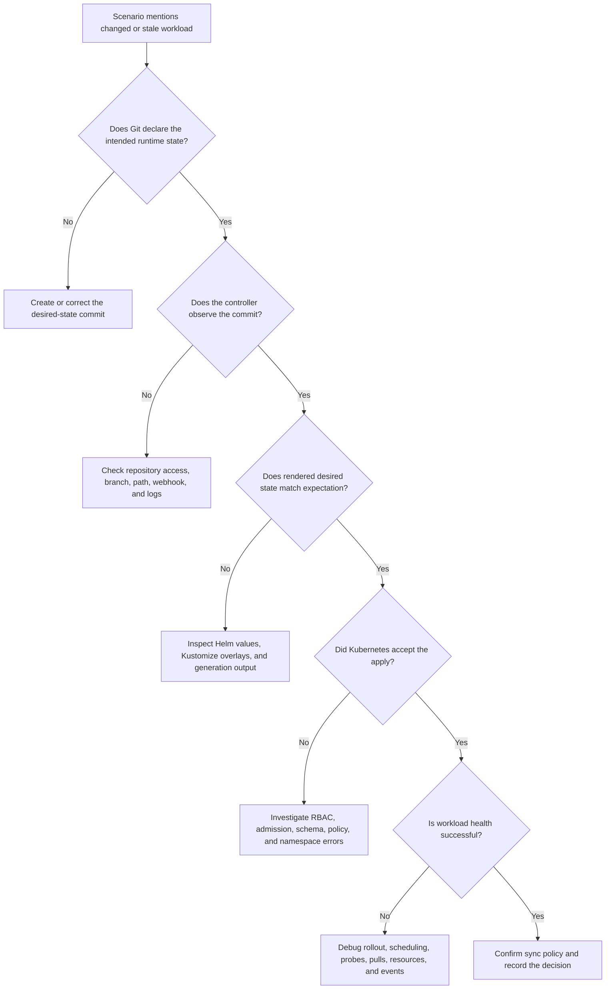

> **Напрямок CGOA** | Практичні запитання | Набір 1
> **Складність:** від початкового до середнього рівня
> **Орієнтовний час:** 45–60 хвилин
> **Передумови:** базові об'єкти Kubernetes, pull request'и Git, маніфести YAML та вступні модулі CGOA

## Результати навчання

Після завершення цього модуля ви зможете:

1. **Застосовувати** модель узгодження GitOps, щоб вирішити, чи слід вносити зміну до кластера через Git, CI чи контролер.
2. **Аналізувати** сценарії дрейфу, порівнюючи бажаний стан у Git із фактичним станом у кластері Kubernetes.
3. **Порівнювати** обов'язки Helm, Kustomize, Argo CD, Flux та CI/CD під час проєктування робочого процесу доставки.
4. **Оцінювати**, який патерн розгортання — на основі витягування (pull) чи проштовхування (push) — безпечніший для конкретного середовища.
5. **Діагностувати** типові пастки практичних запитань GitOps, пояснюючи, чому правдоподібні відповіді є неповними або оманливими.

## Чому цей модуль важливий

Коли команда сприймає свій перший інцидент GitOps як збій контролера, тому що видимий симптом виглядає абсурдно — екстрене термінове виправлення спрацьовує, трафік відновлюється, а потім кластер тихо повертається до зламаного образу — операційний канал часто наповнюється здогадками про час кешування, історію релізів Helm та нібито застряглу задачу розгортання. Справжня причина може бути простішою: командир інциденту змінив активний Деплоймент під час збою, Git і далі оголошував старий образ, а контролер відновив оголошений бажаний стан під час наступного циклу узгодження.

Ця історія — причина, чому цей практичний набір не є тривіальною контрольною точкою з ерудиції. Запитання GitOps у CGOA зазвичай ховають важливу концепцію всередині звичайного операційного формулювання: pull request злито, робоче навантаження дрейфувало, контролер повідомив про неузгодженість, або задача CI завершилася успішно, тоді як кластер залишився незмінним. Той, хто запам'ятав, що «GitOps зберігає YAML у Git», все одно може вибрати неправильну відповідь, бо ця фраза опускає цикл узгодження, межу володіння та різницю між тимчасовою дією під час виконання й сталим бажаним станом. Іспит перевіряє, чи можете ви міркувати про ці відмінності під тиском.

Цей модуль перетворює перший набір практичних запитань на керований діагностичний урок. Ви поєднаєте бажаний стан, фактичний стан, дрейф, передачу естафети CI/CD, межі безпеки моделі pull та обов'язки інструментів в одну операційну модель для середовищ Kubernetes 1.35+. Мета не в тому, щоб ви декламували назви продуктів. Мета — допомогти вам прочитати сценарій, визначити, яка система володіє кожним рішенням, та обрати реакцію, яка зберігає можливість аудиту, водночас поважаючи реальну роботу з інцидентами.

## Основний матеріал

### 1. GitOps — це операційна модель, а не тека з YAML

Найкоротше слабке визначення GitOps — це «YAML Kubernetes, що зберігається в Git». Цей опис не є цілком хибним, але він неповний так само, як неповним є складський інвентарний список, якщо ніхто не перевіряє полиці. Зберігання в Git допомагає з історією, оглядом і порівнянням, проте GitOps починає мати значення, коли контролер безперервно порівнює те, що, за словами Git, має існувати, з тим, що насправді є в кластері. Цикл узгодження — це та частина, яка перетворює Git із картотеки на операційну модель.

Корисне визначення рівня CGOA полягає в тому, що GitOps — це орієнтована на витягування операційна модель, де бажаний стан оголошується в Git, переглядається через звичайні робочі процеси Git і безперервно узгоджується з цільовим середовищем автоматизованим контролером. Кожна фраза має значення, бо кожна фраза виключає поширену неправильну відповідь. «Бажаний стан» означає, що Git містить очікуваний результат під час виконання, а не просто резервну копію маніфестів. «Переглядається через робочі процеси Git» означає, що зміни входять через коміти, pull request'и, правила гілок та історію аудиту. «Безперервно узгоджується» означає, що система постійно перевіряє наявність розбіжностей, замість того щоб трактувати розгортання як одноразову команду.

Важливий наслідок полягає в тому, що Git стає місцем, де оператори пояснюють сталий намір. Якщо хтось змінює кількість реплік Деплойменту безпосередньо в кластері, ця дія може бути корисною під час екстреної ситуації, але вона ще не є бажаним станом згідно з Git. Контролер GitOps має помітити розбіжність і або повідомити про неї, або виправити її — залежно від політики й конфігурації. Така поведінка — не несподівана функція; це основа задуму.

```ascii
+------------------------+        +------------------------+
| Git repository         |        | Kubernetes cluster     |
|                        |        |                        |
| desired Deployment     |        | live Deployment        |
| replicas: 3            |        | replicas: 2            |
| image: app:v1.8        |        | image: app:v1.8        |
+-----------+------------+        +------------+-----------+
            |                                  ^
            | controller compares desired      |
            | state with live state            |
            v                                  |
+------------------------+                     |
| GitOps controller      |---------------------+
| detects drift          |
| plans reconciliation   |
+------------------------+
```

Діаграма показує невелику проблему дрейфу з великими операційними наслідками. Git каже, що Деплоймент має мати три репліки, тоді як у кластері наразі їх дві. Цю розбіжність могло спричинити ручне редагування, невдале розгортання, тимчасовий експеримент або часткове відновлення після збою. Контролеру GitOps не потрібно знати людську історію, перш ніж він зможе виявити технічну розбіжність, але команда має зрозуміти людську історію, перш ніж вирішувати, чи має контролер синхронізувати негайно, чекати на схвалення, чи бути призупиненим під час процедури аварійного доступу.

**Підказка для активного навчання:** зробіть паузу й передбачте, що має статися, якщо в активному кластері `replicas: 2`, але в Git досі `replicas: 3`. Чи має контролер залишити кластер у спокої, бо робоче навантаження наразі працює, чи має він відновити оголошене в Git значення? Сильна відповідь відокремлює екстрене реагування від керування сталим бажаним станом, бо тимчасова ручна дія може бути виправданою під час інциденту, водночас залишаючись дрейфом з погляду системи GitOps.

Саме тому практичні запитання, що згадують «pull request злито, але кластер не змінився», перевіряють більше, ніж знання Git. Вони просять вас міркувати про ланцюжок: коміт, спостереження контролера, рендеринг маніфестів, авторизація, застосування до кластера, оцінка стану та звітування про статус. Пропуск будь-якої ланки може призвести до збою доставки, тоді як репозиторій усе ще виглядає правильним, а відповідь, що каже лише «перевірте Git», зазвичай надто поверхова.

### 2. Бажаний стан, фактичний стан і дрейф

Бажаний стан — це конфігурація, яка, за словами організації, має існувати, тоді як фактичний стан — це те, що кластер виконує зараз. У GitOps бажаний стан зазвичай живе як маніфести Kubernetes, значення Helm, накладки (overlays) Kustomize, файли політик або визначення застосунків усередині репозиторію Git. Фактичний стан надходить від сервера API Kubernetes, контролерів робочих навантажень, рішень допуску, статусу під час виконання та інколи людської екстреної дії. Дрейф — це розрив між цими двома станами, але значення цього розриву залежить від володіння полем.

Дрейф може бути нешкідливим, навмисним, небезпечним або просто хибно зрозумілим. [HorizontalPodAutoscaler, що змінює кількість Под'ів](https://kubernetes.io/docs/concepts/workloads/autoscaling/horizontal-pod-autoscale/) — це не той самий вид відмінності, що й людина, яка вручну змінює образ контейнера. Контролер, що оновлює поле статусу — це не той самий вид відмінності, що й непереглянута зміна типу Сервісу. Добра практика GitOps залежить від знання того, які поля належать Git, які поля належать контролерам Kubernetes, а які відмінності мають запускати синхронізацію, розслідування чи явне правило ігнорування.

```yaml
apiVersion: apps/v1
kind: Deployment
metadata:
  name: checkout
  namespace: shop
spec:
  replicas: 3
  selector:
    matchLabels:
      app: checkout
  template:
    metadata:
      labels:
        app: checkout
    spec:
      containers:
        - name: checkout
          image: registry.example.com/checkout:v1.8
          ports:
            - containerPort: 8080
```

Уявіть, що цей Деплоймент — версія, збережена в Git. Якщо колега запускає `kubectl scale deployment/checkout --replicas=2 -n shop`, активне поле `spec.replicas` змінюється, тоді як Git залишається незмінним. Контролер GitOps, який керує цим Деплойментом, може виявити відмінність, бо `spec.replicas` є частиною оголошеної конфігурації. Залежно від конфігурації, він може [позначити застосунок як неузгоджений, автоматично відновити три репліки або чекати, поки людина схвалить синхронізацію](https://argo-cd.readthedocs.io/en/stable/).

Тепер уявіть, що Деплоймент створює Под'и, а Kubernetes згодом записує інформацію про статус, як-от [доступні репліки, спостережене покоління (observed generation) та умови (conditions)](https://kubernetes.io/docs/concepts/workloads/controllers/deployment/). Ці поля зазвичай не оголошуються в Git, бо вони є спостереженнями під час виконання. Трактування кожної відмінності статусу як дрейфу створювало б шум і плутанину, особливо в завантаженому кластері, де контролери постійно оновлюють поля стану та прогресу. GitOps потужний, бо він точний щодо володіння; це не сліпе текстове порівняння між файлом YAML та дампом активного об'єкта.

Практичне розслідування дрейфу починається з трьох запитань. Перше: який об'єкт і яке поле відрізняються між Git і кластером? Друге: хто має володіти цим полем — Git, контролер Kubernetes, HPA чи людина-оператор під час події аварійного доступу? Третє: що має зробити система узгодження зараз — повідомити, синхронізувати, призупинити чи ескалувати? Ці запитання перетворюють розпливчасту скаргу «GitOps зламано» на конкретний діагноз.

У модулях KubeDojo команди показуються з повним викликом `kubectl`, щоб відповідати стилю курсу та перевіркам проти аліасів:

```bash
kubectl -n shop get deployment checkout -o yaml
```

Опрацьований приклад робить різницю чіткішою. Припустимо, Git містить `registry.example.com/checkout:v1.8`, але активний Деплоймент використовує `registry.example.com/checkout:v1.9-hotfix`. Команда має з'ясувати, чи це термінове виправлення було застосовано безпосередньо під час інциденту, відрендерено новішим чартом Helm чи створено контролером автоматизації образів, який оновлює маніфести через коміти. Правильний наступний крок — не автоматично «відкотити» чи «примусово синхронізувати»; правильний наступний крок — визначити власника та походження зміни.

Якщо термінове виправлення застосували безпосередньо й воно має стати постійним, команда повинна створити коміт Git, який оголошує образ термінового виправлення та фіксує причину. Якщо термінове виправлення було небезпечним або несхваленим, команда може синхронізувати назад до версії Git після підтвердження операційного впливу. Якщо образ змінив контролер автоматизації, команда має перевірити конфігурацію цього контролера, поведінку щодо комітів та межі політики. У всіх випадках ментальна модель GitOps дає команді дисциплінований спосіб міркувати про стан замість того, щоб трактувати кластер як єдину істину.

**Підказка для активного навчання:** ваш кластер виконує образ `checkout:v1.9-hotfix`, але Git досі оголошує `checkout:v1.8`. Назвіть дві безпечні реакції та одну небезпечну. Безпечні реакції мають зберігати можливість аудиту, тоді як небезпечна реакція має пояснити, як команда могла б ускладнити розуміння майбутнього дрейфу.

### 3. GitOps та CI/CD розв'язують різні задачі

CI/CD та GitOps часто використовуються разом, і саме тому практичні запитання намагаються їх розмити. CI/CD зазвичай відповідає на те, як команди збирають, тестують, пакують, сканують, підписують та публікують зміни програмного забезпечення. GitOps відповідає на те, як команди оголошують бажаний стан під час виконання й підтримують середовище узгодженим із ним. Здорова платформа може використовувати обидва, але заміна одного терміна іншим спричиняє помилки проєктування та проштовхує облікові дані не туди, куди слід.

Конвеєр CI може компілювати код, запускати тести, збирати образ контейнера, сканувати його на вразливості й публікувати в реєстр. Потім він може відкрити pull request, який оновлює маніфест Kubernetes, файл значень Helm або тег образу Kustomize новим артефактом. На цьому етапі естафету перебирає GitOps: контролер помічає злиту зміну, рендерить бажані маніфести за потреби, порівнює їх із кластером і застосовує зміни згідно з політикою.

```ascii
+-------------------+      +-------------------+      +-------------------+
| Source commit     |      | CI pipeline       |      | GitOps repo       |
| app code changes  |----->| test, build, scan |----->| desired runtime   |
|                   |      | publish image     |      | state changes     |
+-------------------+      +-------------------+      +---------+---------+
                                                                  |
                                                                  v
                                                        +-------------------+
                                                        | GitOps controller |
                                                        | reconcile cluster |
                                                        +---------+---------+
                                                                  |
                                                                  v
                                                        +-------------------+
                                                        | Kubernetes        |
                                                        | actual runtime    |
                                                        +-------------------+
```

Розділення має значення, бо облікові дані та відповідальність відрізняються. Системі CI часто потрібен доступ до сирцевого коду, тестових сервісів, реєстрів артефактів, інструментів підписання та систем сканування. Контролеру GitOps потрібен дозвіл читати репозиторій бажаного стану й застосовувати обмежений набір змін Kubernetes усередині цільового кластера. Надання системі CI прямого доступу рівня cluster-admin до продакшену, бо «вона ж розгортає речі», руйнує ці межі й збільшує радіус ураження, коли зовнішній виконавець, токен чи плагін зламано.

| Аспект | Конвеєр CI/CD | Контролер GitOps |
|---|---|---|
| Основне завдання | Збирати, тестувати, пакувати, сканувати та просувати артефакти | Узгоджувати оголошений стан виконання із середовищем |
| Типовий тригер | Коміт у код, тег, pull request або подія релізу | Зміна в Git, інтервал опитування, вебхук або ручна синхронізація |
| Форма облікових даних | Доступ до коду, секретів збірки, реєстрів та тестових систем | Обмежений доступ до ресурсів цільового кластера та репозиторію Git |
| Сигнал збою | Невдалий тест, невдала збірка, невдале сканування, невдала публікація | Неузгоджений застосунок, невдале застосування, погіршення стану, дрейф |
| Фокус аудиту | Як артефакт було вироблено та просунуто | Хто змінив бажаний стан і що узгодив кластер |

Існують легітимні системи розгортання на основі проштовхування, де CI застосовує маніфести безпосередньо до кластера. Такі системи можуть працювати, і багато організацій використовували їх до переходу на GitOps. Відмінність CGOA не в тому, що CI на основі проштовхування неможливий або завжди необачний. Відмінність у тому, що GitOps наголошує на оголошеному бажаному стані та циклі узгодження, зазвичай із контролером, що працює всередині або поруч із цільовим середовищем.

Поширена екзаменаційна пастка каже, що GitOps — це «заміна CI/CD». Ця відповідь надто широка. GitOps може замінити крок розгортання конвеєра на основі проштовхування, але він не замінює компіляцію коду, запуск тестів, підписання артефактів чи сканування образів. У зрілій платформі CI/CD та GitOps співпрацюють: CI виробляє надійні артефакти й пропонує зміни бажаного стану, тоді як GitOps узгоджує ці зміни з Kubernetes.

Практичне питання проєктування — де має відбуватися передача естафети. Якщо CI оновлює маніфест у Git і зупиняється, контролер GitOps стає відповідальним за застосування цієї оголошеної зміни. Якщо CI водночас оновлює Git і безпосередньо застосовує до кластера, команда має двох записувачів для того самого стану виконання, що може створювати стани гонки та заплутані сліди аудиту. Чистіший дизайн дає одній системі володіння кожним обов'язком, а потім робить передачу естафети спостережуваною через коміти, статус контролера, події та перевірки стану.

Ця передача естафети також пояснює, чому теги образів та репозиторії маніфестів заслуговують на ретельне проєктування. Деякі команди оновлюють репозиторій розгортання незмінними дайджестами образів, тоді як інші оновлюють семантичні теги, що вказують на підписані артефакти. Будь-який підхід може працювати, але операційне питання — чи є зміна маніфесту переглядуваною, відтворюваною та пов'язаною з артефактом, який виробив CI. Якщо кластер виконує образ, який ніхто не може простежити назад до збірки, сканування та коміту, команда втратила частину ланцюжка аудиту, який GitOps покликаний захищати.

Ще одна корисна звичка — відокремлювати «просування» від «застосування». Просування означає, що організація вирішила, що збірці дозволено рухатися до середовища, часто через оновлення шляху Git або файлу значень. Застосування означає, що цільове середовище справді отримує відрендерені об'єкти Kubernetes і досягає очікуваного стану справності. Практичні запитання часто стискають обидві ідеї в одне речення, але реальні інциденти стають легшими, коли ви тримаєте їх окремими. Просунута зміна може не застосуватися, а застосована зміна може не пройти перевірку стану, тож правильне розслідування йде за доказами, а не припускає, що успішна задача CI доводить успішне розгортання.

### 4. Узгодження на основі витягування та межі безпеки

GitOps на основі витягування означає, що цільове середовище — або контролер, якому це середовище довіряє — отримує бажаний стан і узгоджує його. Цей патерн популярний, бо він уникає надання зовнішньому виконавцю CI широкого вхідного доступу до кластера. Замість того щоб проштовхувати команди в кластер ззовні, контролер витягує схвалену конфігурацію з Git і застосовує її зсередини контрольованої межі. Цей напрямок керування змінює розмову про безпеку, особливо для продакшен-кластерів, що сидять за приватними мережевими засобами контролю.

Перевага в безпеці не є магією. Модель на основі витягування все одно потребує облікових даних, доступу до репозиторію, RBAC Kubernetes, мережевого з'єднання, доступу до артефактів та обережного поводження із секретами. Поліпшення полягає в зменшенні того, де живуть потужні облікові дані, та обмеженні того, які системи можуть безпосередньо змінювати продакшен. Якщо сервіс CI зламано, зловмисник не має автоматично отримувати прямий доступ до продакшен-кластера лише тому, що сервіс може збирати образи застосунків.

```ascii
Push-oriented deployment
------------------------

+-------------------+        cluster credentials        +-------------------+
| External CI       |----------------------------------->| Kubernetes API    |
| runner            |        apply manifests            | production        |
+-------------------+                                   +-------------------+


Pull-oriented GitOps
--------------------

+-------------------+        reads desired state         +-------------------+
| GitOps controller |----------------------------------->| Git repository    |
| in target env     |                                   | reviewed changes  |
+---------+---------+                                   +-------------------+
          |
          | scoped Kubernetes RBAC
          v
+-------------------+
| Kubernetes API    |
| production        |
+-------------------+
```

Досвідчений практик оцінює цей патерн за моделлю загроз, а не за гаслом. Якщо кластер не може дістатися до репозиторію Git, модель витягування потребує мережевого проєктування. Якщо контролер GitOps має надмірний RBAC, він усе одно може завдати серйозної шкоди. Якщо секрети зберігаються незашифрованими в Git, модель не пройшла важливу вимогу безпеки. GitOps на основі витягування безпечніший, коли він поєднаний із найменшими привілеями, захищеними гілками, підписаними комітами чи тегами там, де це доречно, засобами контролю допуску та засобами керування секретами, що тримають чутливі значення поза звичайними маніфестами.

Операційна перевага теж значна, бо контролер може продовжувати узгодження, коли ніхто активно не запускає задачу розгортання. Він може повідомити, що застосунок неузгоджений, повторити тимчасові збої та оприлюднити статус стану. Він дає операторам стабільне місце, щоб запитати: «Що це середовище вважає таким, що має виконуватися?» На це запитання важче відповісти, коли кілька зовнішніх систем можуть проштовхувати зміни незалежно й залишати часткову історію в логах, на сторінках збірок, у сеансах оболонки та в подіях кластера.

Розгляньте продакшен-кластер за межею приватної мережі. За моделлю проштовхування команда має дозволити виконавцю CI дістатися до сервера API або створити тунель, що фактично робить те саме. За моделлю витягування контролеру на стороні кластера потрібно лише дістатися до репозиторію та будь-яких потрібних джерел артефактів, тоді як облікові дані Kubernetes залишаються обмеженими всередині середовища. Точне мережеве проєктування різниться залежно від організації, але напрямок довіри змінює обговорення ризиків у спосіб, який CGOA очікує, що ви розпізнаєте.

**Підказка для активного навчання:** який підхід ви обрали б для регульованого продакшен-кластера, де зовнішні виконавці CI спільні для багатьох команд, і чому? Не відповідайте лише «витягування безпечніше». Включіть, де живуть облікові дані, що має дозволяти RBAC, як огляд Git захищає бажаний стан та які залишкові ризики ще потребують засобів контролю.

Залишкові ризики — не виноски, бо погана реалізація на основі витягування все одно може бути крихкою. Контролер із дозволами cluster-admin, репозиторій, що приймає непереглянуті коміти, та секрети відкритим текстом у маніфестах можуть створити небезпечну систему, навіть якщо архітектура технічно є моделлю витягування. Безпечніший патерн звужує контролер до просторів імен та видів ресурсів, якими він володіє, захищає гілку, що визначає продакшен, і використовує дизайн керування секретами, який тримає чутливі значення поза звичайною історією Git. На практиці контролер стає однією частиною більшої системи контролю, а не замінником інженерії безпеки.

Саме тому процедура аварійного доступу (break-glass) належить до дизайну ще до збою. Команді може знадобитися призупинити синхронізацію, внести пряму екстрену зміну або тимчасово перевизначити значення, поки вона досліджує вплив на клієнтів. Ці дії можуть бути легітимними, якщо вони обмежені в часі, залоговані, схвалені згідно з політикою інцидентів і за ними йде коміт Git або синхронізація назад до попереднього бажаного стану. Вони стають небезпечними, коли команда трактує виняток як невидимий чи постійний, бо наступний цикл узгодження виявить розбіжність у найгірший можливий момент.

### 5. Обов'язки інструментів: Helm, Kustomize, Argo CD та Flux

Запитання про інструменти стають легшими, коли ви відокремлюєте інструменти рендерингу від контролерів узгодження. Helm пакує й шаблонізує ресурси Kubernetes, зазвичай через чарти та значення. [Kustomize кастомізує звичайний YAML через бази, накладки, патчі, мітки, перетворення імен та підстановки образів, не вимагаючи мови шаблонів](https://github.com/kubernetes-sigs/kustomize). Argo CD та Flux — це контролери GitOps, які можуть стежити за репозиторіями, рендерити маніфести через підтримувані інструменти, порівнювати бажаний та активний стан і узгоджувати зміни з кластерами.

Інструменти можна комбінувати, не роблячи їх взаємозамінними. Репозиторій може містити чарт Helm для спільного сервісу, накладки Kustomize для специфічних для середовища патчів та Application Argo CD, що вказує на продакшен-шлях. Інша платформа може використовувати Flux із ресурсами HelmRelease для керування релізами чартів. Важлива екзаменаційна навичка — не запам'ятовування кожної функції; це визначення того, який рівень інструмент переважно займає в дизайні доставки, та відмова від відповідей, що приписують одному інструменту кожен обов'язок.

```ascii
+--------------------------+
| Desired-state repository |
|                          |
| charts/                  |
| overlays/                |
| apps/                    |
+------------+-------------+
             |
             v
+--------------------------+
| Render or customize      |
| Helm templates           |
| Kustomize overlays       |
+------------+-------------+
             |
             v
+--------------------------+
| GitOps reconciliation    |
| Argo CD or Flux          |
+------------+-------------+
             |
             v
+--------------------------+
| Kubernetes cluster       |
| live resources           |
+--------------------------+
```

Helm часто обирають, коли застосунку потрібні багаторазове пакування, конфігуровані значення, керування залежностями та конвенції релізів. Чарт може визначати Деплоймент, Сервіс, ConfigMap та інші ресурси зі значеннями, що різняться залежно від середовища. Ризик у тому, що складні шаблони можуть приховувати, які об'єкти Kubernetes насправді буде вироблено, тож командам потрібні перевірки рендерингу, тести чартів, дисципліна огляду та чітке володіння файлами значень. У робочому процесі GitOps Helm може бути рендерером, тоді як контролер GitOps залишається узгоджувачем.

Kustomize часто обирають, коли команда хоче почати з читабельного базового YAML і застосовувати специфічні для середовища зміни як накладки. Наприклад, базовий Деплоймент може бути спільним для всіх середовищ, тоді як продакшен додає вищу кількість реплік, суворіші запити ресурсів та інший тег образу. Перевага в тому, що кінцевий результат залишається близьким до YAML Kubernetes, але великі стоси накладок усе одно можуть стати важкими для осмислення, якщо патчі розкидані. У практичних запитаннях обирайте відповіді, що описують Kustomize як кастомізацію, а не як цілу операційну модель GitOps.

Argo CD та Flux обидва використовуються для узгодження GitOps, але їхній досвід користувача та моделі ресурсів відрізняються. На рівні CGOA вам не потрібно перетворювати кожне порівняння на дебати про продукти. Ви маєте вміти сказати, що [обидва можуть узгоджувати бажаний стан із Git у Kubernetes, обидва можуть працювати зі звичайними інструментами генерації маніфестів, і обидва є частиною рівня контролерів, а не просто інструментами шаблонізації YAML](https://argo-cd.readthedocs.io/en/stable/). Рівень контролерів — це місце, де порівнюються бажаний та активний стан, а не лише місце, де форматується YAML.

Поширена неправильна відповідь каже «Helm узгоджує дрейф». Helm може встановити чи оновити реліз, і Helm має історію релізів, але [сам по собі звичайний Helm не є тим самим, що й контролер узгодження GitOps, який безперервно працює](https://helm.sh/docs/). Контролер GitOps може використовувати Helm для рендерингу маніфестів, а потім виконувати порівняння та синхронізацію. Ця відмінність достатньо тонка, щоб з'явитися в практичних запитаннях, і достатньо важлива, щоб мати значення в проєктуванні платформи.

Інша поширена неправильна відповідь каже «Kustomize керує секретами». Kustomize може генерувати маніфести Secret із локальних вхідних даних, але керування секретами в продакшені зазвичай потребує сильнішого патерну, як-от sealed secrets, оператори зовнішніх секретів, хмарні сховища секретів чи інший схвалений механізм. Пастка екзаменаційного рівня — переприписування обов'язків інструменту, бо інструмент може торкатися типу ресурсу. Уміння відрендерити об'єкт Secret — не те саме, що бути повноцінною системою керування секретами.

Коли ви порівнюєте інструменти, запитуйте, які докази кожен із них може надати під час збою. Helm може показати відрендерений вивід та пов'язаний із релізом контекст, коли він використовується як рівень пакування. Kustomize може показати, як бази та накладки поєднуються в кінцевий YAML. Argo CD та Flux можуть показати статус синхронізації, результати порівняння, помилки узгодження та сигнали стану залежно від конфігурації. CI/CD може показати логи збірки, результати тестів, сканування, підписи та коміт чи pull request, що просунув артефакт. Правильний діагноз часто походить від вишикування цих джерел доказів по порядку.

Для екзаменаційних цілей ця звичка «спочатку докази» запобігає поширеній пастці: вибору найзнайомішої назви інструмента замість найточнішого обов'язку. Якщо сценарій каже, що образ зібрано успішно, але контролер не може застосувати маніфест, відповідь, імовірно, не «полагодити CI», якщо тільки сам артефакт не порушує політику. Якщо сценарій каже, що файл значень Helm відрендерив неправильний тег, відповідь не «перезапустити Argo CD», поки ви не перевірите джерело значення та відрендерений вивід. Назва інструмента має менше значення, ніж етап, на якому докази показують, що ланцюжок зламався.

### 6. Опрацьований приклад: діагностика практичного сценарію GitOps

Наступний сценарій поєднує основні ідеї цього модуля. Команда зливає pull request, що змінює тег образу для сервісу `checkout` з `v1.8` на `v1.9`. Конвеєр CI уже зібрав і просканував образ. Через десять хвилин команда бачить, що кластер досі виконує `v1.8`, а дашборд GitOps позначає застосунок як неузгоджений. Слабка реакція — сказати «Запустіть `kubectl set image` і полагодьте це», бо це оновлює симптом, обходячи операційну модель.

Сильніша реакція починається з ланцюжка узгодження. Чи отримав репозиторій бажаного стану правильний тег образу? Чи спостеріг контролер новий коміт? Чи відрендерився маніфест правильно? Чи відхилив Kubernetes застосування через RBAC, політику допуску, відсутній секрет для витягування образу, недійсний YAML чи невідповідність простору імен? Чи застосувалося робоче навантаження, але не пройшло перевірки стану? Докази визначають, чи лежить збій у спостереженні Git, рендерингу, допуску Kubernetes, стані розгортання чи плануванні під час виконання.

```bash
kubectl -n argocd get applications
kubectl -n shop get deployment checkout -o wide
kubectl -n shop describe deployment checkout
kubectl -n shop get events --sort-by=.lastTimestamp
```

Ці команди — приклади того виду доказів, які зібрав би оператор. Точний простір імен для контролера GitOps може відрізнятися, а Flux використовує інші користувацькі ресурси, ніж Argo CD, тож команди не є універсальним скриптом. Навчальний момент — у послідовності: перевірте статус контролера, перевірте робоче навантаження, перевірте події та порівняйте активний стан з оголошеним. Перехід безпосередньо до ручної зміни пропускає діагностику й може ускладнити інтерпретацію наступного циклу узгодження.

Припустимо, статус Application каже, що відрендерений маніфест містить `v1.9`, але події Kubernetes показують, що [контролер допуску відхилив оновлення, бо образу бракує потрібного підпису](https://kubernetes.io/docs/reference/access-authn-authz/admission-controllers/). Контролер GitOps зазнає невдачі не тому, що він забув коміт. Він зазнає невдачі, бо політика кластера відхилила бажаний стан. Правильне виправлення — задовольнити політику, оновити артефакт чи процес підписання й дати узгодженню продовжитися. Ручне примусове застосування образу порушило б засіб контролю, який організація навмисно встановила.

Тепер припустимо, статус контролера каже, що він ніколи не спостерігав новий коміт. Імовірне розслідування рухається в бік доступу до репозиторію, конфігурації гілки, конфігурації шляху, доставки вебхука, інтервалу опитування чи логів контролера. У цьому випадку сам Деплоймент може бути справним, але застарілим, і перезапуск робочого навантаження не усуне справжню причину. Виправлення інше, бо збій стався до допуску Kubernetes чи розгортання робочого навантаження.

Опрацьований приклад ілюструє, чому запитання на основі сценаріїв кращі за запитання на пригадування. Реальні операції GitOps передбачають визначення того, де в ланцюжку лежить збій. Правильна відповідь залежить від доказів, володіння та різниці між бажаним і фактичним станом. Коли ви практикуєтеся, пояснюйте, чому кожен неправильний варіант неправильний, бо це тренує порівняння замість упізнавання й готує вас до відволікальних варіантів, які частково правдиві.

**Підказка для активного навчання:** перш ніж рухатися далі, створіть нотатку з двох стовпців: «докази вказують на репозиторій/контролер» з одного боку та «докази вказують на Kubernetes/робоче навантаження» з іншого. Покладіть щонайменше три спостереження в кожен стовпець. Це змушує вас відокремити збій синхронізації від збою під час виконання, що є навичкою за кількома практичними сценаріями CGOA.

### 7. Читання практичних запитань CGOA без потрапляння в пастки

Практичні запитання з цієї теми зазвичай містять одну правильну відповідь та кілька відповідей, що частково правдиві. Частково правдиві варіанти — небезпечні. «GitOps зберігає YAML у Git» — частково правда. «Залучено pull request» — частково правда. «Helm допомагає розгортати застосунки» — частково правда. Іспит просить найточнішу відповідь, тож вам потрібно обрати варіант, що включає механізм, граничні умови та наслідок.

Надійний метод — підкреслити операційне дієслово в запитанні. Якщо запитання питає, чим GitOps «є», шукайте бажаний стан та узгодження. Якщо воно питає, що «означає» дрейф, шукайте розбіжність між бажаним і фактичним станом. Якщо воно питає, чому операція на основі витягування є кращою, шукайте межі облікових даних та узгодження, ініційоване контролером. Якщо воно питає, чим GitOps відрізняється від CI/CD, шукайте узгодження стану виконання, а не автоматизацію збірки й тестування.

Ви також маєте відкидати відповіді, що використовують абсолютні твердження без підтримки. «GitOps усуває всі мережеві питання» — неправильно, бо контролеру все одно потрібен мережевий доступ до Git, реєстрів та API Kubernetes. «GitOps не використовує CI/CD» — неправильно, бо ці два патерни зазвичай співпрацюють. «Argo CD рендерить лише JSON» — неправильно, бо це вигадує штучне обмеження. Більшість низькоякісних відволікальних варіантів або перебільшують, або міняють обов'язки інструментів місцями, або прибирають цикл узгодження.

Коли ви переглядаєте власні неправильні відповіді, не зупиняйтеся на правильному варіанті. Поясніть, чому кожен неправильний варіант неправильний, а потім пов'яжіть причину назад з одним із результатів навчання. Це один із найшвидших способів збудувати готовність до іспиту, бо він тренує порівняння замість упізнавання. У реальних операціях здатність відкинути правдоподібний, але неправильний діагноз часто цінніша за запам'ятовування гасла, і та сама звичка допомагає вам уникати небезпечних виправлень під тиском продакшену.

Практичний патерн огляду — позначати кожен варіант відповіді як повний, неповний, неправильний рівень чи небезпечний. Повна відповідь називає механізм і поважає межу в сценарії. Неповна відповідь каже щось правдиве, але опускає бажаний стан, узгодження, володіння чи докази. Відповідь неправильного рівня приписує роботу зі збірки контролеру, роботу з узгодження рендереру чи прийняття рішень щодо інциденту інструменту автоматизації. Небезпечна відповідь обходить огляд, розширює облікові дані чи приховує дрейф, не пояснюючи, як команда повертається до сталого стану.

Використовуйте ті самі позначки, коли готуєте власні пояснення. Якщо ви кажете «GitOps використовує pull request'и», додайте відсутній механізм: переглянутий стан Git узгоджується контролером із середовищем. Якщо ви кажете «кластер дрейфував», додайте доказ: активний об'єкт відрізняється від поля spec, яким володіє Git. Якщо ви кажете «використовуйте розгортання на основі витягування», додайте межу: контролер тримає обмежені дозволи кластера, тоді як зовнішній CI не змінює продакшен безпосередньо. Це додаткове речення часто є різницею між поверхневою відповіддю та прохідною відповіддю на сценарій.

## Патерни та антипатерни

Наведені нижче патерни працюють, бо вони роблять володіння явним ще до того, як стаються інциденти. GitOps безпечніший не лише тому, що залучено Git; він безпечніший, коли кожна система має чіткий обов'язок, кожна стала зміна має шлях, придатний для аудиту, і кожен екстрений виняток має шлях повернення до оголошеного стану. Використовуйте ці патерни як контрольний список під час читання сценаріїв та як настанову з проєктування під час побудови платформи.

| Патерн | Коли використовувати | Чому працює | Міркування щодо масштабування |
|---|---|---|---|
| Git як стале джерело влади бажаного стану | Використовуйте, коли конфігурація виконання Kubernetes потребує огляду, історії, відкату та відтворюваності між середовищами. | Оператори можуть порівнювати активний стан з переглянутим оголошенням замість того, щоб трактувати поточний кластер як єдину істину. | Репозиторіям потрібні правила володіння, захист гілок, чіткі шляхи середовищ та очікування щодо огляду в міру зростання команд. |
| Передача естафети CI-до-GitOps | Використовуйте, коли CI збирає артефакти, але контролер має володіти узгодженням під час виконання. | CI може оновлювати маніфести чи значення через pull request, тоді як контролер застосовує злитий бажаний стан. | Просування артефактів, підписання образів та оновлення маніфестів мають бути спостережуваними, щоб команди знали, де ланцюжок зламався. |
| Обмежені дозволи контролера на основі витягування | Використовуйте для продакшен- чи регульованих середовищ, де зовнішні облікові дані розгортання збільшують ризик. | Контролер працює всередині чи поруч із середовищем і використовує вузько обмежений RBAC замість надання широкого доступу до кластера спільному CI. | Кільком кластерам можуть знадобитися окремі облікові дані, шляхи репозиторіїв та політики узгодження, щоб уникнути випадкових записів між середовищами. |

Антипатерни зазвичай походять зі спроби зробити GitOps схожим на швидшу версію ручного розгортання. Команди обходять Git під тиском, дають кожному інструменту широкі облікові дані або припускають, що успішна збірка означає, що кластер має бути правильним. Ці зрізані шляхи можуть спрацювати один раз і все одно зашкодити операційній моделі, бо наступна людина бачить заплутаний стан без надійного запису, чому він існує.

| Антипатерн | Чому команди в нього потрапляють | Краща альтернатива | Операційний ризик |
|---|---|---|---|
| Ручні виправлення кластера як кінцевий стан | Виправлення швидке, видиме й емоційно задовольняє під час збою. | Використовуйте процедури аварійного доступу, а потім зафіксуйте чи відкотіть сталий бажаний стан у Git. | Контролер може перезаписати виправлення, або майбутні відповідачі можуть довіряти застарілому Git. |
| Два записувачі для одного об'єкта виконання | CI вже має скрипти розгортання, тож команди тримають їх, додаючи контролер GitOps. | Нехай CI виробляє артефакти та зміни бажаного стану, тоді як контролер володіє узгодженням. | Стани гонки та неясне володіння дрейфом ускладнюють діагностику інцидентів. |
| Відповіді з назвами інструментів замість відповідей про обов'язки | Учні запам'ятовують Helm, Kustomize, Argo CD та Flux як ізольовані факти. | Запитайте, який інструмент рендерить, який інструмент узгоджує, яка система зберігає намір і який процес володіє рішеннями. | Екзаменаційні відповіді стають вгадуванням, а дизайни платформ — надмірно привілейованими. |

## Структура прийняття рішень

Використовуйте цю структуру, коли практичне запитання описує змінений кластер, успішний конвеєр чи неузгоджений контролер. Перше рішення — не яку команду запустити; це де докази розміщують проблему. Щойно ви визначите власника зміненого поля та невдалий крок у ланцюжку, безпечна реакція зазвичай стає набагато чіткішою.



Структура також допомагає порівняти підходи на основі проштовхування й витягування без гасел. Використовуйте CI на основі проштовхування, коли середовище має низький ризик, організація приймає зовнішні облікові дані розгортання, а процес має сильні засоби контролю аудиту й відкату. Використовуйте GitOps на основі витягування, коли зміна продакшену має ініціюватися зсередини середовища, бажаний стан потребує безперервного порівняння, а прямі облікові дані кластера не мають широко жити в зовнішній автоматизації. У будь-якому разі Kubernetes 1.35+ усе одно вимагає звичайної операційної гігієни: RBAC, політик допуску, засобів контролю секретів, походження образів та чітких процедур інцидентів.

| Сигнал сценарію | Імовірний фокус | Безпечніше перше запитання | Типова стала реакція |
|---|---|---|---|
| Активний об'єкт відрізняється від Git | Дрейф і володіння | Яке поле змінилося і хто ним володіє? | Зафіксувати намір, синхронізувати назад до Git або задокументувати тимчасову паузу. |
| CI пройшов, але кластер залишився застарілим | Передача естафети та узгодження | Чи спостеріг і відрендерив контролер злитий бажаний стан? | Полагодити доступ до репозиторію, конфігурацію шляху, рендеринг чи політику контролера. |
| Контролер відрендерив правильно, але застосування не вдалося | API Kubernetes чи політика | Що відхилили події, допуск, RBAC чи валідація? | Полагодити бажаний стан чи відповідність артефакта, потім узгодити знову. |
| Робоче навантаження застосовано, але воно несправне | Стан під час виконання | Чи Под'и заплановані, витягують образи, проходять перевірки та отримують трафік? | Діагностувати стан робочого навантаження, тримаючи бажаний стан придатним для аудиту. |

## Чи знали ви?

1. Принципи OpenGitOps наголошують на декларативному бажаному стані, версіонованому й незмінному зберіганні, автоматичному витягуванні (агенти витягують бажаний стан) та безперервному узгодженні.
2. Контролер GitOps може повідомляти про дрейф, не виправляючи його автоматично, якщо платформу налаштовано на ручну синхронізацію чи ворота схвалення.
3. Helm та Kustomize обидва можуть виробляти маніфести Kubernetes, і контролери GitOps можуть використовувати будь-який із них як частину кроку рендерингу.
4. GitOps на основі витягування зменшує потребу зовнішніх систем тримати прямі облікові дані кластера, але він усе одно вимагає ретельного проєктування RBAC та керування секретами.

## Типові помилки

| Помилка | Чому вона стається | Як її виправити |
|---|---|---|
| Визначення GitOps лише як «YAML у Git» | Ця відповідь звучить близько, бо Git справді зберігає переглянуті маніфести, але вона пропускає цикл узгодження, що тримає кластер вирівняним з оголошеним наміром. | Включайте бажаний стан, огляд Git та безперервне узгодження щоразу, коли визначаєте модель чи обираєте екзаменаційну відповідь. |
| Трактування CI/CD та GitOps як одного й того самого | Обидва з'являються в робочих процесах доставки, тож команди розмивають виробництво артефактів із узгодженням під час виконання. | Спроєктуйте явну передачу естафети, де CI збирає й пропонує зміни бажаного стану, тоді як контролер GitOps узгоджує середовище. |
| Ручне виправлення дрейфу без оновлення Git | Пряма зміна здається швидшою під час інцидентів, особливо коли застосунок несправний і команда хоче негайного доказу прогресу. | Робіть сталі зміни через Git або навмисно призупиняйте узгодження під час роботи з аварійним доступом і фіксуйте шлях повернення. |
| Надання CI широких облікових даних продакшен-кластера | Наявні задачі розгортання часто вже мають доступ, і команди можуть зберегти ці дозволи після додавання GitOps. | Віддавайте перевагу обмеженим обліковим даним контролера та узгодженню на основі витягування для продакшену, коли модель загроз це підтримує. |
| Припущення, що кожна активна відмінність є поганим дрейфом | Контролери Kubernetes, HPA та оновлення статусу легітимно володіють деякими полями, які не слід трактувати як зміни spec, якими володіє Git. | Визначте володіння полем, перш ніж вирішувати, чи синхронізувати, ігнорувати, призупинити чи дослідити відмінність. |
| Твердження, що Helm чи Kustomize є контролером GitOps | Інструменти рендерингу видимі в репозиторії, тож учні можуть приписати їм усю роботу доставки. | Поєднуйте інструменти рендерингу з контролером, як-от Argo CD чи Flux, коли вимога — безперервне узгодження. |
| Ігнорування сигналів невдалого стану чи допуску | Зміна репозиторію може бути правильною, тоді як кластер відхиляє чи не може запустити отримане робоче навантаження. | Простежте ланцюжок від коміту Git до рендерингу, застосування, допуску, розгортання, подій та стану, перш ніж обирати виправлення. |

## Тест

**Запитання 1.** Розробник змінює образ Деплойменту безпосередньо за допомогою `kubectl set image` під час інциденту. Контролер GitOps згодом змінює його назад на старіший образ із Git. Яке найкраще пояснення?

1. Контролер правильно узгодив кластер назад до бажаного стану, оголошеного в Git, який є сталим джерелом наміру.
2. Ручне термінове виправлення завжди тимчасове й тому автоматично відкидається Kubernetes через 10 хвилин.
3. Контролер застосовує лише зміни з конвеєра CI й ніколи не застосовує історію Git безпосередньо.
4. Образ Деплойменту змінився, бо `kubectl set image` скидає `spec.image` до типового значення репозиторію після кожного узгодження.

<details>
<summary>Відповідь + обґрунтування</summary>

Правильна відповідь — **1**. Пряма команда кластера змінила активний стан без оновлення Git, тож контролер виявив дрейф щодо Git і відновив оголошений образ. Варіант 2 неправильний, бо Kubernetes не автовідкочує зміну за таймером; вона зберігається, поки інший актор не виправить її. Варіант 3 хибний, бо цей приклад покладається на Git як на джерело влади бажаного стану, а не на CI як на узгоджувач. Варіант 4 неправильний, бо `kubectl set image` застосовує саме те, що оператор запросив, а повернення прийшло від узгодження Git, а не від типових значень `kubectl`.

</details>

**Запитання 2.** Ваш конвеєр CI успішно збирає й сканує образ, потім відкриває pull request, що оновлює файл значень Helm. Після злиття pull request кластер не змінюється. Яка послідовність розслідування найкраще відповідає ментальній моделі GitOps?

1. Перезапустити сканування образу, і якщо воно пройде, запустити `kubectl rollout undo` на робочому навантаженні.
2. Перевірити, що контролер спостеріг злиття, потім по порядку перевірити рендеринг маніфестів, спроби застосування, відповіді допуску та стан робочого навантаження.
3. Перезапустити модульні тести CI й припустити, що злиття неправильне, якщо будь-який тест не проходить.
4. Вручну пропатчити активне робоче навантаження, щоб трафік спочатку повернувся, а потім переглянути інцидент пізніше.

<details>
<summary>Відповідь + обґрунтування</summary>

Правильна відповідь — **2**. Розслідування GitOps йде за ланцюжком доставки від стану репозиторію до відрендереного маніфесту, застосування до кластера й стану. Варіант 1 неправильний, бо команда відкату розгортання усуває симптоми, але не перевіряє, де почався розрив між Git та активним станом. Варіант 3 неправильний, бо статус тестів CI не є вирішальним сигналом після злиття; він охоплює лише попередні етапи ланцюжка. Варіант 4 неправильний як перший хід, бо обхід узгодження може приховати, чи контролеру бракує коміту, чи він заблокований на етапах рендерингу/застосування.

</details>

**Запитання 3.** Команда платформи вирішує між розгортанням CI на основі проштовхування та контролером GitOps на основі витягування для продакшену. Їхня головна турбота — зменшення прямих облікових даних продакшену в зовнішніх системах. Яка рекомендація найсильніша?

1. Використовувати CI на основі проштовхування, щоб збірки залишалися тими самими, а облікові дані були сконцентровані в одному місці.
2. Використовувати GitOps на основі витягування, щоб довірений кластером контролер узгоджував переглянутий бажаний стан з обмеженими дозволами Kubernetes.
3. Уникати Git цілком і запускати всі розгортання з токенів CI, що ротуються щотижня.
4. Розгортати лише з Helm і вимкнути історію Git, щоб зменшити операційні накладні витрати.

<details>
<summary>Відповідь + обґрунтування</summary>

Правильна відповідь — **2**. GitOps на основі витягування переміщує владу зміни в цільове середовище з обмеженим RBAC, що саме й є запитаним зменшенням облікових даних продакшену, що тримаються ззовні. Варіант 1 неправильний, бо концентрація облікових даних проштовхування в CI — це патерн, який збільшує радіус ураження облікових даних у цьому сценарії. Варіант 3 хибний, бо вилучення Git робить можливість аудиту та огляду слабшою, і все одно залишає іншу систему, що потребує прямих привілеїв кластера. Варіант 4 неправильний, бо Helm — це інструмент шаблонізації/розгортання в багатьох робочих процесах, а не самостійний засіб контролю безпеки, що замінює керування бажаним станом на основі Git.

</details>

**Запитання 4.** Ваша команда бачить, що дашборд GitOps позначає застосунок як неузгоджений, але робоче навантаження справне. Git оголошує `replicas: 3`, тоді як активний Деплоймент має `replicas: 2`, бо хтось масштабував його під час спаду трафіку. Що команда має зробити спочатку?

1. Ігнорувати попередження, бо робоче навантаження справне й негайних дій не потрібно.
2. Видалити й заново створити Деплоймент, щоб примусово виконати чисте скидання неузгодженості.
3. Спочатку визначити володіння полем, а потім оновити Git чи політику, перш ніж вирішувати, чи синхронізувати, чи призупинити.
4. Масштабувати Деплоймент назад до 3 за допомогою `kubectl scale` і на цьому зупинитися.

<details>
<summary>Відповідь + обґрунтування</summary>

Правильна відповідь — **3**. Неузгодженість не є автоматично екстреною дією; це сигнал спочатку перевірити володіння та намір. Варіант 1 неправильний, бо справне робоче навантаження все одно може представляти некерований дрейф, якщо сталий намір залишається в Git. Варіант 2 хибний, бо видалення ресурсів небезпечне й обходить слід аудиту заради незначної розбіжності. Варіант 4 неправильний як перша дія, бо сліпе примусове застосування одного цільового значення пропускає рішення щодо політики/володіння й може закодувати неправильний довгостроковий намір.

</details>

**Запитання 5.** Практичне запитання питає, яке поєднання є найточнішим для поширених інструментів доставки Kubernetes. Який варіант вам слід обрати?

1. Helm безперервно узгоджує бажаний стан усередині кластера, а Argo CD лише рендерить шаблони.
2. Kustomize та Git взаємозамінні, бо обидва є контролерами узгодження.
3. CI/CD збирає артефакти; Helm та Kustomize більше не потрібні, щойно додано GitOps.
4. Helm/Kustomize генерують чи кастомізують маніфести, тоді як Argo CD чи Flux безперервно узгоджують Git із кластером.

<details>
<summary>Відповідь + обґрунтування</summary>

Правильна відповідь — **4**. Цей варіант відокремлює генерацію від узгодження й відповідає поширеній практиці. Варіант 1 неправильний, бо Helm — це насамперед інструмент пакування/рендерингу та релізів, а не безперервний контролер у всіх конфігураціях. Варіант 2 хибний, бо Git — це механізм зберігання й співпраці; він сам по собі не функціонує як контролер узгодження. Варіант 3 неправильний, бо вилучення Helm/Kustomize з ланцюжка не випливає з GitOps і зламало б багато дійсних робочих процесів пакування й кастомізації.

</details>

**Запитання 6.** Контролер GitOps повідомляє, що бажаний маніфест використовує образ `payments:v2.3`, але події Kubernetes показують, що оновлення відхилено політикою допуску, яка вимагає підписаних образів. Яка найкраща наступна дія?

1. Примусити `kubectl` застосувати непідписаний образ усе одно за допомогою `--force` і продовжити усунення проблем пізніше.
2. Спочатку полагодити підпис артефакта чи відповідність політиці, потім дати узгодженню продовжитися.
3. Відредагувати бажаний стан у кластері безпосередньо, щоб обійти допуск до наступного релізу.
4. Тимчасово вимкнути політику допуску, бо вона блокує розгортання.

<details>
<summary>Відповідь + обґрунтування</summary>

Правильна відповідь — **2**. Контролер і репозиторій можуть бути правильними, але політика Kubernetes заблокувала застосування; розв'язання відповідності підпису/політиці тримає ланцюжок надійним. Варіант 1 неправильний, бо примусове застосування не обходить допуск і підриває цілі контролю. Варіант 3 хибний, бо пряме редагування активного стану маскує приховану прогалину у відповідності й послаблює сталість. Варіант 4 неправильний, бо вимкнення політики послаблює межі довіри й не вирішує, чому бажаний маніфест не був відповідним.

</details>

**Запитання 7.** Команда використовує CI, щоб збирати образи, оновлювати репозиторій маніфестів, а потім безпосередньо застосовувати ті самі маніфести до кластера, тоді як Argo CD теж стежить за репозиторієм. Який головний ризик дизайну?

1. Підвищена ймовірність того, що два записувачі спричинять неясне володіння, стани гонки та заплутану поведінку дрейфу.
2. Швидше реагування на інциденти, бо обидві системи можуть узгоджувати одночасно.
3. Краща можливість аудиту, бо кожна зміна задокументована щонайменше один раз.
4. Жодного ризику, бо CI та GitOps спроєктовано сходитися без перекриття.

<details>
<summary>Відповідь + обґрунтування</summary>

Правильна відповідь — **1**. Коли CI застосовує безпосередньо, а Argo CD спостерігає за Git, створюється два шляхи зміни для того самого наміру виконання, що вносить неоднозначність володіння та проблеми впорядкування. Варіант 2 неправильний, бо швидкість — не властивість безпеки, а записувачі, що перекриваються, зазвичай створюють більше плутанини, а не ясності. Варіант 3 хибний, бо застосування з CI само по собі не поліпшує можливість аудиту, якщо політика очікує, що GitOps буде власником узгодження. Варіант 4 неправильний, бо перекриття без суворих меж — це саме ризик, а не нейтральний стан.

</details>

**Запитання 8.** Ви діагностуєте практичне запитання, де один варіант каже «GitOps — це pull request'и», інший каже «GitOps — це чарти Helm», а третій каже «GitOps — це бажаний стан у Git, що безперервно узгоджується з кластером». Як вам оцінити відволікальні варіанти?

1. Обрати найкоротший варіант, бо CGOA полюбляє стислі відповіді.
2. Прийняти всі три варіанти як рівноцінні, бо кожен з'являється в робочих процесах доставки.
3. Вибрати варіант, що стосується лише операцій із репозиторієм, та ігнорувати узгодження.
4. Вибрати варіант, що явно включає бажаний стан, огляд Git та поведінку безперервного циклу узгодження.

<details>
<summary>Відповідь + обґрунтування</summary>

Правильна відповідь — **4**. Найсильніша реакція — та, що формулює механізм та межі, а не лише компонент. Варіант 1 неправильний, бо стислість не є критерієм правильності, а найкоротший варіант часто неповний. Варіант 2 хибний, бо ці три описи не є рівноцінними; лише один охоплює обов'язки GitOps від початку до кінця. Варіант 3 неправильний, бо «лише операції з репозиторієм» опускають безперервний цикл порівняння-і-застосування, що робить GitOps суттєво відмінним від самого лише контролю версій.

</details>

## Практична вправа

У цій вправі ви потренуєтеся діагностувати сценарій GitOps без потреби в реальному кластері. Мета — міркувати від доказів, визначати дрейф та обирати реакцію, що зберігає операційну модель. Ви можете виконати її в текстовому редакторі, але показані раніше команди можна запускати в середовищі Kubernetes, якщо ви захочете адаптувати сценарій пізніше.

### Сценарій

Сервісом `checkout` керує контролер GitOps. Бажаний стан у Git оголошує три репліки та образ `registry.example.com/checkout:v1.8`. Під час інциденту з трафіком оператор вручну змінив активний Деплоймент на дві репліки та образ `registry.example.com/checkout:v1.9-hotfix`. Застосунок наразі відповідає на трафік, але дашборд GitOps повідомляє про застосунок як неузгоджений.

### Крок 1: запишіть бажаний та фактичний стан

Створіть коротке порівняння за такою структурою. Сенс не в тому, щоб виробити ідеальний YAML; сенс у тому, щоб визначити поля, які мають значення, та класифікувати розбіжність.

```yaml
desired_state:
  source: Git
  deployment: checkout
  namespace: shop
  replicas: 3
  image: registry.example.com/checkout:v1.8

actual_state:
  source: Kubernetes API
  deployment: checkout
  namespace: shop
  replicas: 2
  image: registry.example.com/checkout:v1.9-hotfix
```

- [ ] Ви визначили щонайменше два поля, що відрізняються між бажаним і фактичним станом.
- [ ] Ви позначили Git як джерело бажаного стану.
- [ ] Ви позначили API Kubernetes як джерело фактичного стану.
- [ ] Ви уникли називання активного стану «правильним» лише тому, що застосунок наразі відповідає.

<details>
<summary>Настанова з розв'язання для кроку 1</summary>

Важливі розбіжності — `replicas` та `image`, бо обидва з'являються у spec Деплойменту, яким Git зазвичай володіє в цьому сценарії. Те, що застосунок відповідає на трафік, є корисним доказом стану, але це не доводить узгодженості бажаного стану. Ваше порівняння має зберігати різницю між репозиторієм Git як джерелом бажаного стану та API Kubernetes як джерелом фактичного стану.
</details>

### Крок 2: класифікуйте дрейф

Напишіть три речення, що пояснюють, чи слід вважати кожне змінене поле дрейфом. Ваша відповідь має згадувати володіння полем. Наприклад, вручну змінений образ зазвичай є дрейфом, якщо Git володіє spec Деплойменту. Вручну змінена кількість реплік теж є дрейфом, якщо Git володіє `spec.replicas`, окрім випадку, коли команда навмисно делегувала володіння репліками HPA чи іншому схваленому процесу.

- [ ] Ви пояснили, чому відмінність образу операційно важлива.
- [ ] Ви пояснили, чому відмінність реплік може потребувати іншої реакції, якщо HPA володіє кількістю реплік.
- [ ] Ви відокремили стан під час виконання від узгодженості бажаного стану.

<details>
<summary>Настанова з розв'язання для кроку 2</summary>

Відмінність образу має високий вплив, бо вона змінює виконуваний код, а пряма зміна без коміту Git ускладнює аудит і відкат. Відмінність реплік теж є дрейфом, якщо Git володіє полем, але відповідь має визнати, що HPA чи інший схвалений контролер може легітимно володіти рішеннями про масштабування. Сильна відповідь каже, що робоче навантаження може бути справним і все одно неузгодженим.
</details>

### Крок 3: оберіть безпечну реакцію

Оберіть один із наведених шляхів реакції та обґрунтуйте його у чотирьох-шести реченнях.

1. Зафіксувати `v1.9-hotfix` та рішення про репліки в Git після прискореного огляду.
2. Синхронізувати кластер назад до Git, бо ручну зміну не було схвалено й вона не має зберігатися.
3. Коротко призупинити узгодження, дослідити інцидент, а потім або зафіксувати бажану зміну, або відкотити до Git.

Сильна відповідь пояснює, чому обраний шлях зберігає можливість аудиту. Вона також пояснює, що могло б піти не так, якби команда мовчки зберігала ручні зміни кластера без оновлення Git. Якщо ви обираєте призупинити узгодження, включіть умову, що каже команді, коли його відновити.

- [ ] Ваша реакція включає сталу дію на основі Git або чіткий відкат до Git.
- [ ] Ваша реакція уникає прямої зміни як кінцевого довгострокового виправлення.
- [ ] Ваша реакція називає операційний ризик залишення Git застарілим.
- [ ] Ваша реакція включає те, як команда повідомляє чи фіксує рішення.

<details>
<summary>Настанова з розв'язання для кроку 3</summary>

Будь-який із трьох шляхів може бути виправданим, якщо пояснення поважає докази та володіння. Фіксація термінового виправлення доречна, коли виправлення інциденту дійсне й має зберігатися, тоді як синхронізація назад доречна, коли ручна зміна була небезпечною чи непотрібною. Призупинення узгодження — це тимчасова дія контролю інциденту, а не постійна стратегія розгортання, і команда має відновити узгодження після того, як Git зафіксує сталу домовленість або кластер повернеться до оголошеного стану.
</details>

### Крок 4: зіставте обов'язки інструментів

Для того самого сценарію призначте кожен обов'язок CI/CD, Helm чи Kustomize та контролеру GitOps. Якщо обов'язок не належить інструменту, скажіть про це прямо.

| Обов'язок | Найкращий власник |
|---|---|
| Зібрати й просканувати образ контейнера | Конвеєр CI/CD |
| Зберігати переглянутий бажаний стан виконання | Репозиторій Git |
| Відрендерити шаблони чартів чи накладки | Helm або Kustomize |
| Порівняти бажаний стан з активним | Контролер GitOps |
| Застосувати схвалений бажаний стан до кластера | Контролер GitOps |
| Володіти екстреним людським прийняттям рішень | Процес інцидентів, а не інструмент |

- [ ] Ви не призначили збірку образу контролеру GitOps.
- [ ] Ви не описали Helm чи Kustomize як повноцінні контролери узгодження самі по собі.
- [ ] Ви описали Git як сховище переглянутого бажаного стану.
- [ ] Ви описали контролер як систему, що порівнює й узгоджує.

<details>
<summary>Настанова з розв'язання для кроку 4</summary>

Зіставлення навмисно нудне, бо нудне володіння операційно корисне. CI/CD збирає й валідує артефакти, Git зберігає переглянутий бажаний стан, Helm чи Kustomize рендерять чи кастомізують маніфести, а контролер GitOps порівнює й узгоджує. Людські рішення щодо інцидентів не належать інструменту, навіть коли інструмент фіксує чи забезпечує кінцевий стан.
</details>

### Крок 5: перетворіть сценарій на пояснення, готове до іспиту

Напишіть фінальну відповідь так, ніби ви пояснюєте сценарій колезі, що готується до CGOA. Ваше пояснення має визначити GitOps, визначити дрейф, відрізнити GitOps від CI/CD та пояснити, чому узгодження на основі витягування допомагає з межами безпеки. Тримайте пояснення практичним, а не на основі гасел.

- [ ] Ваше пояснення включає бажаний стан та безперервне узгодження.
- [ ] Ваше пояснення визначає дрейф як розбіжність між бажаним і фактичним станом.
- [ ] Ваше пояснення відрізняє роботу CI з артефактами від узгодження виконання GitOps.
- [ ] Ваше пояснення пояснює переваги безпеки на основі витягування, не стверджуючи, що воно усуває всі ризики.
- [ ] Ваше пояснення використовує докази сценарію, а не лише загальні визначення.

<details>
<summary>Настанова з розв'язання для кроку 5</summary>

Сильне фінальне пояснення каже, що GitOps використовує Git як джерело переглянутого бажаного стану та контролер для безперервного узгодження кластера до цього стану. Воно визначає дрейф як розбіжність між станом, оголошеним у Git, та активним станом кластера, потім пояснює, що CI/CD може збирати й сканувати образ термінового виправлення, тоді як GitOps володіє узгодженням виконання. Воно також зазначає, що узгодження на основі витягування може зменшити прямі облікові дані продакшену в зовнішніх системах, але воно все одно вимагає RBAC, доступу до репозиторію та засобів контролю секретів.
</details>

## Перевірка для того, хто навчається

> Принципи OpenGitOps наголошують на декларативному бажаному стані, версіонованому й незмінному зберіганні, автоматичному витягуванні (агенти витягують бажаний стан) та безперервному узгодженні.

## Джерела

- https://opengitops.dev/
- https://argo-cd.readthedocs.io/en/stable/
- https://fluxcd.io/flux/concepts/
- https://helm.sh/docs/
- https://kubectl.docs.kubernetes.io/references/kustomize/
- https://kubernetes.io/docs/concepts/workloads/controllers/deployment/
- https://kubernetes.io/docs/tasks/run-application/horizontal-pod-autoscale/
- https://kubernetes.io/docs/reference/access-authn-authz/rbac/
- https://kubernetes.io/docs/reference/access-authn-authz/admission-controllers/
- https://kubernetes.io/docs/concepts/configuration/secret/
- https://kubernetes.io/docs/reference/kubectl/
- [Огляд Argo CD](https://argo-cd.readthedocs.io/en/stable/) — Корисний для розуміння узгодження GitOps, статусу OutOfSync та ручної проти автоматичної синхронізації.
- [Основні концепції Flux](https://fluxcd.io/flux/concepts/) — Надає стисле визначення GitOps та показує, як Flux моделює джерела й узгодження.
- [Використання авторизації RBAC](https://kubernetes.io/docs/reference/access-authn-authz/rbac/) — Безпосередньо стосується обговорення в модулі обмежених дозволів контролера та меж доступу до продакшену.

## Наступний модуль

Продовжте з [CGOA: практичні запитання, набір 2](../module-1.5-practice-questions-set-2/), де ви застосуєте те саме міркування GitOps до другого набору запитань на основі сценаріїв.
