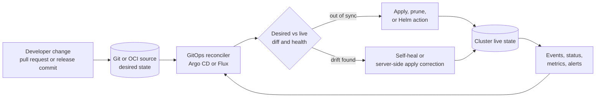
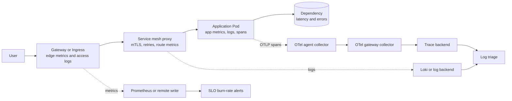

> **Напрямок CNPA** | Огляд для платформного інженера | **Доставка, API, спостережуваність та контракти надійності**
>
> **Час на проходження**: 55–65 хвилин
>
> **Передумови**: основи платформної інженерії, базові знання Kubernetes Services та Ingress, а також перше знайомство з термінологією GitOps або
> SRE

## Що ви зможете зробити

Завершивши цей модуль, ви зможете розглядати доставку, надання доступу через API та спостережуваність як один платформний контракт, а не як три окремі категорії інструментів. CNPA не вимагає від вас адмініструвати кожен контролер з пам'яті; він перевіряє,
чи здатні ви розпізнати цикл керування, контракт із користувачем та сигнал збою, які повинна забезпечувати хмарна платформа.

1. **Проаналізувати** запит користувача, що деградував, і класифікувати перший домен збою як дрейф доставки, маршрутизацію шлюзу чи сервісної мережі, втрату телеметрії або збій оповіщення за SLO.
2. **Спроєктувати** контракт доставки GitOps, що відокремлює джерело істини, узгодження, виявлення дрейфу, просування, згенеровані застосунки, володіння Helm-релізами та семантику відкату.
3. **Реалізувати** патерн надання платформних API, який обирає Ingress, Gateway API, HTTPRoute, GRPCRoute, TCPRoute або політику сервісної мережі на правильній межі відповідальності.
4. **Оцінити** базову лінію спостережуваності, яка дає продуктовим командам корисні метрики, логи, трейси, шляхи збору OpenTelemetry, дашборди та оповіщення за швидкістю вигоряння SLO.
5. **Порівняти** Argo CD, Flux CD, Istio, Linkerd, Prometheus, Loki, Vector та OpenTelemetry за операційним контрактом, який вони надають користувачам платформи, а не за прихильністю до бренду.

## Чому цей модуль важливий

Версія доставки, API та спостережуваності в CNPA — це платформна робота, а не сертифікаційні дрібниці про кожне поле об'єкта Kubernetes. Продуктова команда повинна мати змогу подати зміну, побачити, чи прийняла її платформа, отримувати трафік
через підтримуваний крайовий контракт і розуміти вплив на користувачів, коли сервіс відмовляє. Платформна команда володіє рівнем, який робить ці кроки відтворюваними: Git — це довговічний намір доставки, реалізація Ingress або Gateway API перетворює
зовнішні запити на трафік усередині кластера, політика сервісної мережі обробляє поведінку «сервіс-до-сервісу» за потреби, а спостережуваність перетворює поведінку під час виконання на рішення. Kubernetes v1.35 документує Ingress як стабільний, але заморожений API, а Gateway
API — як рольового наступника для динамічного провізіювання інфраструктури та розширеної маршрутизації трафіку, що є саме тим операторським розрізненням, яке CNPA схильний перевіряти. ([Kubernetes v1.35:
Ingress](https://v1-35.docs.kubernetes.io/docs/concepts/services-networking/ingress/), [Kubernetes v1.35: Gateway API](https://v1-35.docs.kubernetes.io/docs/concepts/services-networking/gateway/))

Корисна ментальна модель — це ланцюг контрактів. Доставка відповідає на запитання «яку версію та конфігурацію ми мали намір запустити?». Рівень API відповідає на запитання «які запити мають досягати якого бекенду й за якими правилами трафіку?». Спостережуваність відповідає на запитання «що
сталося, наскільки це погано для користувачів і хто має діяти?». Якщо бракує хоча б одного контракту, інші стає важче експлуатувати. Ідеальний GitOps-репозиторій не допоможе, якщо маршрут Gateway мовчки вказує на хибний бекенд. Багата система
трейсингу не допоможе, якщо оповіщення, що мало б викликати на чергування через вигоряння бюджету помилок, видимого користувачам, так і не спрацює. Політика повторних спроб у сервісній мережі може дати змогу системі пережити перехідний збій, але вона також може посилити навантаження, якщо платформа не визначає, де повторні спроби
дозволені та як вони вимірюються. ([Gateway API: API Overview](https://gateway-api.sigs.k8s.io/docs/concepts/api-overview/), [Google SRE Workbook: Alerting on SLOs](https://sre.google/workbook/alerting-on-slos/))

У цьому модулі *платформний API* означає контракт надання доступу «північ–південь» (Gateway API / Ingress / HTTPRoute). Платформні API *провізіювання* в CNPA — Crossplane XRD/Composition/Claim та патерни CRD+оператор — розглянуто в модулі 1.2 та в напрямку платформної інженерії; не плутайте ці два поняття на іспиті.

Платформним інженерам потрібна грамотність на всьому шляху, тому що саме вони є перекладачами між продуктовими командами та реалізаціями інфраструктури. Команда застосунку не повинна знати, який контролер спостерігає за `HelmRelease`, яка
реалізація Gateway запрограмувала зовнішній проксі або який рівень колектора експортує трейси до бекенду. Їм потрібен стабільний інтерфейс, чіткі межі володіння та спосіб діагностувати, чи належить сьогоднішній інцидент доставці,
маршрутизації чи телеметрії. Flux описує узгодження як забезпечення відповідності фактичного стану декларативному бажаному стану, Argo CD описує автоматичну синхронізацію та самовідновлення в термінах застосунків, що розсинхронізувалися, а Протокол OpenTelemetry описує
доставку телеметрії між джерелами, колекторами та бекендами. Платформа, яка приховує всі ці механізми від користувачів, але все одно надає їхній статус, виконує правильну абстракцію. ([Flux: Core Concepts](https://fluxcd.io/flux/concepts/),
[Argo CD: Automated Sync Policy](https://argo-cd.readthedocs.io/en/stable/user-guide/auto_sync/), [OpenTelemetry: OTLP Specification](https://opentelemetry.io/docs/specs/otlp/))

Питання CNPA часто описують симптоми, а не називають інструмент. Новий реліз збільшує кількість помилок, але Git все ще показує попередній тег образу. Заголовок канарки надсилає тестових користувачів до хибної версії. SLO вигоряє надто
швидко, проте чергового так і не викликають. Ці сценарії вимагають класифікації та наступної дії: оглянути узгоджувач і бажаний стан для збою доставки, оглянути правила Gateway або сервісної мережі для збою на шляху запиту, оглянути конвеєри телеметрії та правила оповіщень
для збою спостережуваності. Іспит винагороджує оператора, який здатен знайти зламаний контракт, перш ніж змінювати випадковий YAML.

## Платформний контракт через доставку, трафік і сигнали

Починайте з запиту користувача, а не з інструментів. Запит виконується успішно лише тоді, коли кілька обіцянок платформи виконуються одночасно: запущено заплановану версію навантаження, крайовий маршрут пропускає запит, політика «сервіс-до-сервісу» дозволяє та
формує внутрішній перехід, а телеметрія записує достатньо контексту, щоб пояснити результат. Кожна обіцянка має різного власника та артефакт. Доставка зазвичай вказує на Git, об'єкт застосунку, Flux `Kustomization` або Flux `HelmRelease`.
Надання доступу до трафіку вказує на Ingress, Gateway, HTTPRoute, GRPCRoute, TCPRoute або політику сервісної мережі. Сигнали вказують на часові ряди Prometheus, потоки логів Loki, трейси OpenTelemetry та оповіщення SLO. Платформний огляд поєднує ці артефакти в
один шлях, щоб ті, хто реагує, не плутали збій розгортання зі збоєм шлюзу або збоєм телеметрії. ([Kubernetes v1.35: Gateway API](https://v1-35.docs.kubernetes.io/docs/concepts/services-networking/gateway/), [Prometheus: Data
Model](https://prometheus.io/docs/concepts/data_model/), [Grafana Loki: Labels](https://grafana.com/docs/loki/latest/get-started/labels/))

На платформному рівні абстракція — це не приховування. Продуктова команда не повинна потребувати привілейованого доступу до кластера, щоб дізнатися, чи синхронізовано реліз, чи прийнято маршрут, чи існує трейс, чи вигоряє бюджет
помилок. Платформа має надавати узагальнений статус через портал, CLI, перевірку в pull request, дашборд або runbook, зберігаючи при цьому базовий статус контролера для глибшої підтримки. Gateway API явно моделює межі ролей
між постачальниками інфраструктури, операторами кластера та розробниками застосунків; контролери GitOps так само відокремлюють авторів репозиторію від узгоджувачів, які застосовують зміни. Саме через цей поділ платформні інженери дбають про API та
умови статусу: це місце, де незалежні команди зустрічаються, не ділячись кожною деталлю реалізації. ([Kubernetes v1.35: Gateway API](https://v1-35.docs.kubernetes.io/docs/concepts/services-networking/gateway/), [Gateway API: API
Overview](https://gateway-api.sigs.k8s.io/docs/concepts/api-overview/))

Зупиніться та класифікуйте: якщо запит на оформлення замовлення досягає старої версії, хоча pull request було злито п'ять хвилин тому, не починайте з сервісної мережі. Спершу запитайте, чи змінився бажаний стан, чи узгодив контролер GitOps цю
ревізію та чи відхилився живий стан від Git. Якщо новий Под запущено, але збій лише в користувачів, для яких збігся заголовок, рухайтеся вниз шляхом запиту та оглядайте збіги HTTPRoute, ваги, дзеркалювання або політику маршрутизації сервісної мережі. Якщо користувачі стикаються зі збоями, але
платформа не має оповіщення, оглядайте SLI, запит Prometheus, шлях семплювання трейсів і маршрут оповіщення.

Ця звичка класифікувати важливіша за запам'ятовування вендорних команд. Argo CD, Flux, Istio, Linkerd, Prometheus, Loki, Vector та OpenTelemetry — кожен має різні ресурси, але їхні платформні контракти стабільні: узгодити
бажаний стан, запрограмувати політику трафіку, зібрати сигнали та оповістити про вплив на користувачів. Відповідь CNPA має назвати зламаний контракт, а потім назвати сімейство ресурсів, яке доведе або спростує це. Саме це і є навичкою операторського рівня.

## Цикл доставки GitOps

Доставка GitOps — це система узгодження, а не кнопка, що виконує `kubectl apply`. Запланований стан живе в репозиторії або джерелі артефактів, контролер порівнює цей стан із кластером, і контролер діє, доки живий стан
не збіжиться або не повідомить, чому він не може. Argo CD описує автоматичну синхронізацію як дію над застосунками у стані OutOfSync, а самовідновлення — як реакцію на те, що живий стан кластера відхиляється від Git. Flux описує джерела, що виробляють артефакти, та
об'єкти `Kustomization`, що узгоджують маніфести з цих артефактів, включно з періодичним виявленням «насухо» (dry-run) та корекцією дрейфу. Спільна ідея — це довговічний бажаний стан плюс повторюване порівняння, тому ручне редагування кластера зазвичай є
дрейфом, а не підтримуваним шляхом розгортання. ([Argo CD: Automated Sync Policy](https://argo-cd.readthedocs.io/en/stable/user-guide/auto_sync/), [Argo CD: Diff Strategies](https://argo-cd.readthedocs.io/en/stable/user-guide/diff-strategies/),
[Flux: Kustomization](https://fluxcd.io/flux/components/kustomize/kustomizations/))

GitOps-інструменти на кшталт Argo CD та Flux узгоджують *маніфести* до бажаного стану; контролери прогресивної доставки на кшталт Argo Rollouts та Flagger обробляють стратегії розгортання *навантаження* (канаркові, blue-green) поверх цього синхронізованого стану.



Цикл узгодження дає платформній команді важіль для аудиту. Коли реліз іде не так, перше запитання — чи був поганий стан запланованим, застосованим чи випадковим. Якщо Git містить поганий тег образу або правило маршруту, відкат — це
новий бажаний стан або специфічний для контролера відкат до попередньої ревізії. Якщо Git правильний, але живий стан відрізняється, питання стає про дрейф, права контролера, збій допуску або перевірки справності. Argo CD обчислює різницю
між бажаним і живим станом, щоб визначити статус OutOfSync, а Flux `Kustomization` узгоджує через інтервал, перевіряє об'єкти, застосовує їх і може видаляти зайві об'єкти, коли це ввімкнено. Ці поверхні статусу дають платформному інженеру змогу показати
продуктовим командам, чи прийняла платформа їхню зміну, чи заблокувала її. ([Argo CD: Diff Strategies](https://argo-cd.readthedocs.io/en/stable/user-guide/diff-strategies/), [Flux:
Kustomization](https://fluxcd.io/flux/components/kustomize/kustomizations/))

І Argo CD, і Flux розв'язують задачу доставки GitOps, але вони надають різні операційні поверхні. Argo CD зосереджений на об'єкті `Application` та моделі застосунків, керованій через UI/API; він підтримує автоматичну синхронізацію, самовідновлення, видалення зайвого, налаштування різниці,
хвилі синхронізації та ApplicationSet для генерування багатьох застосунків. Flux зосереджений на контролерах GitOps Toolkit та власних ресурсах, рідних для Kubernetes, як-от `GitRepository`, `Kustomization`, `HelmRelease` та `OCIRepository`; він компонує
джерела та узгоджувачі безпосередньо всередині кластера. Платформна команда може досягти успіху з будь-яким із них, але вибір має відповідати тому, як користувачі виявляють релізи, як розбито кластери та яку частину
робочого процесу слід виражати як ресурси Kubernetes. ([Argo CD: ApplicationSet](https://argo-cd.readthedocs.io/en/stable/user-guide/application-set/), [Flux: Core Concepts](https://fluxcd.io/flux/concepts/), [Flux: Manage Helm
Releases](https://fluxcd.io/flux/guides/helmreleases/))

| Точка рішення             | Відповідність платформі Argo CD                                                                                     | Відповідність платформі Flux CD                                                                       | Операторське запитання                                                            |
| ------------------------- | ------------------------------------------------------------------------------------------------------------------ | ----------------------------------------------------------------------------------------------------- | --------------------------------------------------------------------------------- |
| Видимий користувачу огляд доставки | Потужний дашборд застосунків і статус синхронізації для команд, яким потрібна центральна поверхня доставки           | Рідний для Kubernetes статус через ресурси й події toolkit для команд, яким зручно з CRD             | Де продуктові команди перевірятимуть справність релізу без доступу cluster-admin? |
| Багатокластерна генерація | ApplicationSet може шаблонувати Application зі списку, кластера, Git та інших генераторів                           | Кілька джерел і Kustomization можуть націлюватися на локальні чи віддалені кластери з явними графами ресурсів | Платформа генерує об'єкти застосунків чи компонує ресурси контролера? |
| Упорядковане розгортання  | Фази синхронізації та хвилі синхронізації впорядковують ресурси всередині синхронізації Argo CD                    | `dependsOn` та модель упорядкування контролера задають залежності між ресурсами Flux                | Яку залежність потрібно зробити явною до того, як почнеться трафік застосунку?    |
| Володіння Helm            | Argo CD рендерить Helm через `helm template` і порівнює відрендерені маніфести з живим станом                       | Flux `HelmRelease` делегує Helm-дії до helm-controller і підтримує опції відновлення               | Чи слід трактувати Helm як вхідні дані для рендерингу, чи як узгоджений об'єкт релізу? |
| Корекція дрейфу           | Автоматичне самовідновлення може повторно синхронізувати, коли живий стан відхиляється від Git                     | Узгодження Kustomization виявляє та коригує дрейф через інтервал; керовані ресурси можна призупинити | Які ручні зміни дозволено та як записуються винятки? |
| Семантика відкату         | `argocd app rollback` відкочує до попереднього розгорнутого запису історії, але для відкату автоматичну синхронізацію має бути вимкнено | Helm-контролер може виконувати автоматичне відновлення для невдалих дій install, upgrade або test     | Відкат — це Git-revert, дія з історії контролера чи відновлення Helm?       |

Хвилі синхронізації — гарний приклад того, чому грамотність у доставці важлива на платформному рівні. Argo CD упорядковує ресурси за фазою, хвилею, видом та іменем; анотація `argocd.argoproj.io/sync-wave` призначає цілочисельний порядок хвиль, де нижчі хвилі
застосовуються першими. Це корисно для CRD перед власними ресурсами, просторів імен перед об'єктами з простором імен або Job навколо синхронізації застосунку. Це не загальна відповідь на справність сервісу, маршрутизацію трафіку чи безпеку міграції схеми. Якщо нижча
хвиля залишається несправною, застосунок ніколи не може досягти справного стану, тому платформний патерн має визначати, яка залежність насправді належить усередині синхронізації, а яка — runbook'у релізу чи системі прогресивної доставки. ([Argo CD: Sync
Phases and Waves](https://argo-cd.readthedocs.io/en/stable/user-guide/sync-waves/))

ApplicationSet та Helm-релізи Flux демонструють ще одне платформне розрізнення. ApplicationSet дозволяє оператору генерувати багато Application Argo CD з шаблону та вхідних даних генератора, як-от кластери чи каталоги Git. Flux `HelmRelease` дозволяє
команді оголосити реліз Helm-чарту як власний ресурс Kubernetes із джерелами чарта та значеннями, керованими контролерами. Обидва зменшують повторювану ручну конфігурацію, але вони відмовляють по-різному: помилки ApplicationSet можуть згенерувати чи оновити
хибний набір Application, тоді як помилки HelmRelease можуть призвести до невдалої Helm-дії навіть тоді, коли джерело артефакта правильне. Сценарії CNPA зазвичай не вимагають повної специфікації; вони вимагають розпізнати, де платформа згенерувала
намір, а де контролер виконав дію релізу. ([Argo CD: ApplicationSet](https://argo-cd.readthedocs.io/en/stable/user-guide/application-set/), [Flux: Manage Helm Releases](https://fluxcd.io/flux/guides/helmreleases/))

Відкат — це теж питання семантики, а не лише команда. У GitOps-системі Git-revert є найчистішим довгостроковим вираженням бажаного стану, бо він робить репозиторій відповідним до запланованого стану кластера. Argo CD також має команду `argocd
app rollback`, яка відкочує до попереднього розгорнутого ID історії, але його документація з автоматичної синхронізації зазначає, що відкат не можна виконати, доки ввімкнено автоматичну синхронізацію. Підтримка Helm у Flux включає опції автоматичного відновлення, як-от
відкат, видалення або повтор для невдалих Helm-дій. Runbook платформи має повідомляти користувачам, який шлях відкату підтримується для маніфестів застосунків, Helm-релізів, згенерованих Application та прогресивних змін трафіку. ([Argo CD:
App Rollback Command](https://argo-cd.readthedocs.io/en/stable/user-guide/commands/argocd_app_rollback/), [Argo CD: Automated Sync Policy](https://argo-cd.readthedocs.io/en/stable/user-guide/auto_sync/), [Flux: Helm
Controller](https://fluxcd.io/flux/components/helm/))

Політика просування — це місце, де платформа перетворює узгодження на безпечний робочий процес доставки. Pull request може просунути версію зі staging до production, тег може спрямувати Flux на новий артефакт, або Application Argo CD може синхронізуватися після
шлюзу схвалення. Контракт платформи має казати, яке середовище є авторитетним, які перевірки блокують просування і якому статусу продуктова команда може довіряти після злиття. Інакше команди трактують «злито» як «розгорнуто» та пропускають розрив між
системою контролю версій, узгодженням контролера, допуском, справністю розгортання та переміщенням трафіку. І Argo CD, і Flux надають статус, бо цей розрив є нормальним. Хороші платформи роблять розрив видимим, а не вдають, що його не існує. ([Argo
CD: Automated Sync Policy](https://argo-cd.readthedocs.io/en/stable/user-guide/auto_sync/), [Flux: Kustomization](https://fluxcd.io/flux/components/kustomize/kustomizations/))

Згенеровані об'єкти доставки теж потребують правила володіння. Якщо ApplicationSet створює Application Argo CD, користувачі мають редагувати вхідні дані генератора, а не латати згенеровані Application вручну. Якщо Flux створює Helm-релізи з джерел чарта
та значень, користувачі мають знати, що володіє зміною — файл значень, `HelmRelease` чи спільний об'єкт джерела. Це звучить адміністративно, але запобігає плутанині під час інциденту. Ручна латка згенерованого об'єкта може зникнути на
наступному циклі узгодження, тоді як поганий шаблон генератора може відштампувати той самий хибний маршрут, простір імен чи значення в багатьох кластерах. Сценарії CNPA часто ховають це у фразах на кшталт «усі кластери змінилися після одного оновлення репозиторію». ([Argo CD:
ApplicationSet](https://argo-cd.readthedocs.io/en/stable/user-guide/application-set/), [Flux: Manage Helm Releases](https://fluxcd.io/flux/guides/helmreleases/))

## API шлюзу, Ingress та маршрутів

Ingress усе ще є частиною Kubernetes і досі важливий у production, але саме тут більше не з'являються нові ідеї сервісної мережі. Kubernetes v1.35 позначає Ingress як стабільний з Kubernetes v1.19, зазначає, що проєкт Kubernetes
рекомендує Gateway замість Ingress, і каже, що Ingress API заморожено, хоча він залишається загальнодоступним. Ingress надає HTTP- та HTTPS-маршрути до Services з правилами хоста й шляху, термінацією TLS, балансуванням навантаження та
специфічним для реалізації контролером. Це робить Ingress розумним контрактом для простого надання доступу HTTP, коли організація вже експлуатує контролер і не потребує багатшого володіння маршрутами чи формування трафіку. ([Kubernetes v1.35:
Ingress](https://v1-35.docs.kubernetes.io/docs/concepts/services-networking/ingress/))

Gateway API є наступником платформного рівня, бо він явно розділяє відповідальності. Сторінка Gateway API в Kubernetes v1.35 описує Gateway API як надбудову з власних ресурсів для динамічного провізіювання інфраструктури та розширеної
маршрутизації з рольовими ресурсами для постачальників інфраструктури, операторів кластера та розробників застосунків. Вона перелічує чотири стабільні види API: `GatewayClass`, `Gateway`, `HTTPRoute` та `GRPCRoute`. Проєкт Gateway API окремо
документує `HTTPRoute` як такий, що перебуває у Standard-каналі з v0.5.0 і просунутий до GA (v1) у v1.0.0. Він документує `GRPCRoute` як GA з v1.1.0, тоді як `TCPRoute` та `UDPRoute` залишаються Alpha в Experimental-каналі. Тож відповідь CNPA
має уникати твердження «усі типи маршрутів Gateway є GA»; стабільний контракт вужчий за повне меню протоколу. ([Kubernetes v1.35: Gateway API](https://v1-35.docs.kubernetes.io/docs/concepts/services-networking/gateway/), [Gateway API: API
Overview](https://gateway-api.sigs.k8s.io/docs/concepts/api-overview/), [Gateway API: HTTPRoute](https://gateway-api.sigs.k8s.io/reference/api-types/httproute/), [Gateway API:
GRPCRoute](https://gateway-api.sigs.k8s.io/reference/api-types/grpcroute/))

Вибір ресурсу на шляху запиту випливає з протоколу та межі володіння. Використовуйте Ingress, коли платформа пропонує звичні вхідні двері HTTP чи HTTPS і специфічні для контролера анотації вже прийнято. Використовуйте Gateway плюс HTTPRoute, коли
команда інфраструктури володіє політикою слухача, а команди застосунків володіють приєднанням маршруту, іменами хостів, збігами шляхів, фільтрами та вагами бекендів. Використовуйте GRPCRoute, коли важливі збіг gRPC-сервісу та методу, політика з урахуванням gRPC або
орієнтована на gRPC спостережуваність. Використовуйте TCPRoute лише тоді, коли обрана реалізація та платформа приймають ризик Experimental-каналу для пересилання потоків L4. Питання не в тому, який об'єкт модніший; питання в тому, який API виражає
намір користувача, не приховуючи критичної поведінки контролера. ([Gateway API: HTTPRoute](https://gateway-api.sigs.k8s.io/reference/api-types/httproute/), [Gateway API: GRPCRoute](https://gateway-api.sigs.k8s.io/reference/api-types/grpcroute/))

Gateway API також дає платформним командам примітиви формування трафіку, які раніше жили в анотаціях контролера або ресурсах сервісної мережі. Розподіл HTTP-трафіку використовує зважені `backendRefs` усередині правил HTTPRoute, а офіційний посібник показує
ваги на кшталт 90 і 10, щоб поступово зміщувати трафік між версіями сервісу. Маршрутизація на основі заголовків може надсилати синтетичний чи тестовий трафік до канарки до того, як переміститься користувацький трафік, а дзеркалювання запитів може пересилати копію production-запитів до
вторинного бекенду, ігноруючи дзеркальні відповіді. Ці можливості є рішеннями контракту маршруту: їх слід прив'язувати до шлюзів просування, володіння та спостережуваності, щоб канарку вимірювали, а не просто конфігурували. ([Gateway API:
HTTP Traffic Splitting](https://gateway-api.sigs.k8s.io/guides/user-guides/traffic-splitting/), [Gateway API: HTTP Request Mirroring](https://gateway-api.sigs.k8s.io/guides/user-guides/http-request-mirroring/), [Gateway API: HTTP Header
Modifiers](https://gateway-api.sigs.k8s.io/guides/user-guides/http-header-modifier/))

Сценарій вправи: платформна команда мігрує спільний край з Ingress на Gateway API і надає кожному продуктовому простору імен дозвіл приєднувати HTTPRoute до спільного слухача Gateway. Платформа тепер має задокументувати, які імена хостів дозволено,
які простори імен можуть приєднувати маршрути, як повідомляється про конфлікти, які фільтри підтримує обрана реалізація і де з'являється статус маршруту для команд застосунків. Двонаправлена модель приєднання Gateway API — корисна концепція: маршрут
посилається на батьківський Gateway, а слухач має прийняти форму цього маршруту. Якщо маршрут відхилено, збій належить контракту API раніше, ніж навантаженню. ([Gateway API: API
Overview](https://gateway-api.sigs.k8s.io/docs/concepts/api-overview/))

```yaml
apiVersion: gateway.networking.k8s.io/v1
kind: HTTPRoute
metadata:
  name: checkout-canary
spec:
  parentRefs:
    - name: shared-edge
      namespace: platform-ingress
  hostnames:
    - checkout.example.com
  rules:
    - matches:
        - headers:
            - name: traffic
              value: test
      backendRefs:
        - name: checkout-v2
          port: 8080
    - backendRefs:
        - name: checkout-v1
          port: 8080
          weight: 90
        - name: checkout-v2
          port: 8080
          weight: 10
```

Цей YAML навмисно малий, бо CNPA дбає про контракт, а не про маніфест, вивчений напам'ять. Перше правило надсилає трафік із заголовком test до `checkout-v2`, а друге правило розподіляє звичайний трафік між двома Services. Платформа
має поєднати цей маршрут із дашбордом, що показує частоту запитів, частоту успіху та затримку за маршрутом і бекендом, а потім з оповіщенням SLO, що вловлює вплив на користувачів до того, як канарка перетвориться на повний збій. Формування трафіку без спостережуваності — це
просто складніший спосіб зламати production.

Статус маршруту є частиною API, а не запізнілою думкою. Ресурси Gateway API повідомляють, чи прийнято маршрут батьком, чи розв'язано посилання та чи специфічні для реалізації умови дозволяють трафіку текти. Цей статус
є першим місцем, куди слід заглянути, коли команда каже «мій маршрут існує, але трафік до нього не доходить». Платформа має виводити стани accepted, programmed, conflicted та unsupported у тому самому користувацькому процесі, що показує синхронізацію GitOps. Якщо єдиний спосіб
налагодити відхилений маршрут — попросити адміністратора кластера про сирі події контролера, платформа не завершила абстракцію. ([Gateway API: API Overview](https://gateway-api.sigs.k8s.io/docs/concepts/api-overview/), [Gateway API:
HTTPRoute](https://gateway-api.sigs.k8s.io/reference/api-types/httproute/))

Міграцію з Ingress на Gateway теж слід трактувати як міграцію контракту. Старий контракт міг ховати поведінку в анотаціях, специфічних для контролера правилах перезапису, конвенціях TLS-секретів або стандартних бекендах. Новий контракт
має казати, яка поведінка перейшла до слухачів Gateway, яка перейшла до фільтрів HTTPRoute, яка поведінка більше не підтримується і яка команда схвалює спільні імена хостів. Kubernetes v1.35 тримає Ingress стабільним і замороженим, тож платформа може
мігрувати поступово. Хибна відповідь — переписати кожен крайовий маршрут до того, як буде готова модель підтримки, дашборди статусу та шлях відкату. ([Kubernetes v1.35:
Ingress](https://v1-35.docs.kubernetes.io/docs/concepts/services-networking/ingress/), [Kubernetes v1.35: Gateway API](https://v1-35.docs.kubernetes.io/docs/concepts/services-networking/gateway/))

## Контракт сервісної мережі

Сервісна мережа додає політику й телеметрію між сервісами після того, як трафік уже всередині платформи. Istio та Linkerd обидва забезпечують поведінку «сервіс-до-сервісу», яку застосунки інакше реалізовували б самі: ідентичність, взаємний TLS,
повторні спроби, тайм-аути, розмикання кола (circuit breaking), політику трафіку та спостережуваність. Питання платформного рівня — чи виправдовують ці переваги операційні витрати і чи достатньо зрозумілий обраний контракт сервісної мережі для продуктових команд. Документація Istio з
керування трафіком описує маршрутизацію на основі Envoy, повторні спроби, розмикачі кола, тайм-аути, канаркові розгортання та розподіли трафіку; Linkerd документує автоматичний mTLS між меш-подами, повторні спроби й тайм-аути на ресурсах HTTPRoute або GRPCRoute,
а також розмикання кола на рівні ендпоінтів у проксі. ([Istio: Traffic Management](https://istio.io/latest/docs/concepts/traffic-management/), [Istio:
PeerAuthentication](https://istio.io/latest/docs/reference/config/security/peer_authentication/), [Linkerd: Automatic mTLS](https://linkerd.io/2.19/features/automatic-mtls/), [Linkerd: Retries and
Timeouts](https://linkerd.io/2.19/features/retries-and-timeouts/), [Linkerd: Circuit Breaking](https://linkerd.io/2.19/reference/circuit-breaking/))

| Платформне рішення   | Сигнал Istio                                                                                                         | Сигнал Linkerd                                                                                | Інтерпретація рівня CNPA                                                                         |
| -------------------- | -------------------------------------------------------------------------------------------------------------------- | -------------------------------------------------------------------------------------------- | ------------------------------------------------------------------------------------------------ |
| Позиція взаємного TLS | `PeerAuthentication` може вимагати STRICT mTLS, а Istio підтримує режими безпеки sidecar та ambient                | Автоматичний mTLS застосовується між меш-подами і використовує ідентичність сервісного акаунта   | Обирайте сервісну мережу, коли ідентичність сервісу та зашифрований трафік «под-до-пода» є вимогами платформи |
| Глибина політики трафіку | Багатий контроль трафіку VirtualService і DestinationRule, повторні спроби, тайм-аути, виявлення викидів та розмикання кола | Орієнтовані на Gateway API повторні спроби, тайм-аути та розмикання кола на рівні ендпоінтів із меншою кількістю важелів | Віддавайте перевагу простішому контракту, якщо складна політика трафіку не є реальною вимогою                 |
| Операційна модель    | Більше поверхні політики, поведінка Envoy, повідомлення аналізатора та кілька режимів розгортання                  | Менша концептуальна поверхня, зосереджена на прозорому проксіюванні та стандартних значеннях mTLS  | Підбирайте інструмент до спроможності підтримки, а не лише до кількості можливостей             |
| Інтеграція з Gateway | Istio може діяти як реалізація ingress і mesh та підтримує патерни Gateway API                                     | Linkerd інтегрується з ресурсами Gateway API для політики на кшталт повторних спроб і тайм-аутів     | Вирішіть, чи край і меш мають бути одним стеком чи окремими платформними рівнями                |
| Режим збою           | Неправильно налаштовані маршрути, destination rules, ін'єкція sidecar чи політика mTLS можуть створювати несподівані 503 | Немеш-трафік, пропущені порти, прогалини в політиці та зловживання повторними спробами можуть послабити припущення | Задокументуйте, як користувачі доводять, що трафік меш, і яка команда володіє справністю проксі |
| Цінність спостережуваності | Телеметрія мешу може показувати обсяг запитів, помилки, затримку та поведінку політики через проксі              | Телеметрія мешу може показувати поведінку на рівні маршруту й сервісу з меншою інструменталізацією застосунку | Телеметрія мешу доповнює телеметрію застосунку; вона не замінює спанів і логів застосунку |

Не відповідайте на питання про сервісну мережу словами «Istio потужний» чи «Linkerd простіший» і на цьому не зупиняйтеся. Платформна команда має обирати Istio, коли їй потрібна широка поверхня політики трафіку, суворий контроль над складними графами сервісів
або реалізація, яка може поєднати ingress, mesh та розширену маршрутизацію в одній операційній моделі. Вона має обирати Linkerd, коли автоматичний mTLS, прозоре проксіювання, повторні спроби, тайм-аути та нижче конфігураційне навантаження відповідають
фактичним потребам платформи. Вона має обирати відсутність мешу, коли Kubernetes NetworkPolicy, Gateway API, телеметрія застосунку та стійкість на рівні бібліотек уже задовольняють контракт. Кожен меш додає перехід площини даних, площину керування, операції з сертифікатами
та поверхню налагодження, тож вигода має бути прив'язана до названої обіцянки платформи. ([Istio: Traffic Management](https://istio.io/latest/docs/concepts/traffic-management/), [Linkerd: Automatic
mTLS](https://linkerd.io/2.19/features/automatic-mtls/))

Авторизація — це окрема точка рішення від mTLS. Коли вимога — це L7 RBAC між сервісами, оцініть `AuthorizationPolicy` від Istio або `policy.linkerd.io/Server` плюс `ServerAuthorization` від Linkerd як важелі операторського рівня.
([Istio: AuthorizationPolicy](https://istio.io/latest/docs/reference/config/security/authorization-policy/), [Linkerd: Authorization Policy](https://linkerd.io/2.19/reference/authorization-policy/))

Повторні спроби та розмикачі кола — найлегші для зловживання можливості мешу. Повторна спроба для безпечного, ідемпотентного читання може приховати від користувачів перехідний збій бекенду; повторна спроба для запиту на оплату, що змінює стан, може дублювати роботу чи посилити навантаження.
Linkerd прямо попереджає, що повторні спроби слід використовувати обережно, бо вони можуть збільшити навантаження на систему, а Istio документує розмикання кола як спосіб обмежити вплив збоїв, сплесків затримки та інших мережевих ефектів. Контракт
платформи має казати, які методи чи маршрути можуть повторюватися, які межі тайм-аутів застосовуються, як встановлюються бюджети чи ліміти повторних спроб і яка метрика доводить, що політика допомагає, а не погіршує збій. ([Linkerd: Retries and
Timeouts](https://linkerd.io/2.19/features/retries-and-timeouts/), [Istio: Circuit Breaking](https://istio.io/latest/docs/tasks/traffic-management/circuit-breaking/))

## Базова лінія платформи спостережуваності

Спостережуваність на платформному рівні — це здатність ставити корисні запитання про вплив на користувачів, потік запитів та володіння системою, не вимагаючи від кожної продуктової команди будувати власний стек. Метрики показують числові тренди й індикатори
SLO, логи зберігають події й контекст, а трейси з'єднують роботу через межі сервісів. Тріада — це не список покупок із трьох інструментів. Це модель покриття: платформа має надавати стандартні конвенції інструменталізації, шляхи
збору, бекенди зберігання, дашборди, маршрути оповіщень та контроль доступу, щоб команди могли діагностувати через спільний словник. Prometheus зберігає часові ряди, ідентифіковані іменами метрик і мітками, Loki групує потоки логів за мітками, водночас
застерігаючи від міток високої кардинальності, а OpenTelemetry визначає спільні імена та протокол доставки OTLP для трейсів, метрик, логів і профілів. ([Prometheus: Data Model](https://prometheus.io/docs/concepts/data_model/), [Grafana
Loki: Labels](https://grafana.com/docs/loki/latest/get-started/labels/), [OpenTelemetry: Semantic Conventions](https://opentelemetry.io/docs/concepts/semantic-conventions/), [OpenTelemetry: OTLP
Specification](https://opentelemetry.io/docs/specs/otlp/))



Метрики потребують стабільних міток, бо кожне нове значення мітки створює новий часовий ряд у Prometheus. Це цінно для вимірів на кшталт сервісу, простору імен, маршруту, методу, класу статусу та кластера, але небезпечно для ID запитів, ID користувачів,
UID подів або необмежених шляхів. OpenMetrics визначає числові значення метрик, мітки, сімейства метрик, лічильники, gauge, гістограми та summary, а Prometheus дотримується вимірної моделі даних, що робить мітки центральними для фільтрації та
агрегації. Тож платформа має публікувати правила іменування метрик і кардинальності до того, як команди постачать інструменталізацію. Дашборд, що працює у staging, може стати непридатним у production, якщо канарка додасть мітку високої кардинальності до гарячого
лічильника запитів. ([Prometheus: Data Model](https://prometheus.io/docs/concepts/data_model/), [OpenMetrics Specification](https://github.com/prometheus/OpenMetrics/blob/main/specification/OpenMetrics.md))

Логи потребують достатньо структури, щоб відповідати на питання інцидентів, не перетворюючи кожне поле на індексну мітку. Документація Loki прямо каже, що вміст логу не індексується, як у традиційній повнотекстовій системі; записи групуються в потоки
за мітками, а мітки високої кардинальності можуть значно знизити продуктивність і економічну ефективність. Sink Loki у Vector може доставляти події логів до Loki, додавати мітки, додавати структуровані метадані та застерігає, що мітки високої кардинальності можуть
спричинити різке падіння продуктивності. Базова лінія платформи має визначати обов'язкові поля, як-от ім'я сервісу, середовище, простір імен, серйозність, trace ID та request ID, а потім вирішити, які з них є мітками, а які залишаються структурованими метаданими чи вмістом
логу. ([Grafana Loki: Labels](https://grafana.com/docs/loki/latest/get-started/labels/), [Vector: Loki Sink](https://vector.dev/docs/reference/configuration/sinks/loki/))

Трейси потребують узгодженого поширення та семантичного іменування. Семантичні конвенції OpenTelemetry визначають спільні імена для операцій, ресурсів, трейсів, метрик, логів і профілів, а OTLP визначає, як телеметрія рухається між джерелами,
проміжними колекторами та бекендами через gRPC або HTTP. Контракт платформи має зробити поширення трейсів частиною золотого шляху: ID запитів від ingress чи gateway, спани мешу за наявності, спани застосунку, спани залежностей та кореляція
логів мають зустрічатися в одному процесі інциденту. Семплювання теж належить контракту, бо агресивне head-семплювання може приховати рідкісні збої, тоді як необмежений трейсинг може перевантажити сховище. ([OpenTelemetry: Semantic
Conventions](https://opentelemetry.io/docs/concepts/semantic-conventions/), [OpenTelemetry: OTLP Specification](https://opentelemetry.io/docs/specs/otlp/))

Зберігання — ще одна обіцянка платформи. Метрики можуть потребувати коротких вікон високої роздільності та довшої знижено-дискретизованої історії. Логи можуть потребувати різного зберігання для журналів аудиту, потоків налагодження та регульованих даних. Трейси можуть потребувати tail-семплювання, щоб
рідкісні, повільні чи невдалі запити вижили навіть тоді, коли звичайні успішні запити відсіюються. Платформа має публікувати ці вибори, бо ті, хто реагує на інциденти, ухвалюватимуть рішення на основі того, що вони можуть запитати. Команда, яка під час
інциденту дізнається, що невдалі трейси було відкинуто через п'ять хвилин, отримала не контракт спостережуваності; вона отримала sink за принципом найкращих зусиль. ([Prometheus: Data Model](https://prometheus.io/docs/concepts/data_model/), [OpenTelemetry:
Agent-to-Gateway Pattern](https://opentelemetry.io/docs/collector/deploy/other/agent-to-gateway/))

Метадані володіння прив'язують три сигнали назад до реальних команд. Корисна платформа узгоджено додає ім'я сервісу, простір імен, середовище, кластер, версію, маршрут та власника через метрики, логи й трейси. Це не означає, що кожне поле
стає гарячою міткою. Це означає, що ту саму ідентичність сервісу можна знайти в запитах Prometheus, потоках чи структурованих метаданих Loki та атрибутах ресурсів OpenTelemetry. Без цієї ідентичності черговий інженер витрачає перші п'ятнадцять
хвилин на зіставлення імені пода з командою, маршрутом і релізом. З нею інцидент може швидко перейти від симптому до власника та відкату, виправлення маршруту чи виправлення телеметрії. ([Grafana Loki:
Labels](https://grafana.com/docs/loki/latest/get-started/labels/), [OpenTelemetry: Semantic Conventions](https://opentelemetry.io/docs/concepts/semantic-conventions/))

Зупиніться та класифікуйте знову: якщо Prometheus показує підвищені відповіді 5xx, у Loki немає відповідних логів, а трейси зупиняються на шлюзі, першим збоєм може бути покриття спостережуваності, а не сам застосунок. Платформа має запитати,
чи розгорнуто збір логів на тій ноді, чи можуть агенти OpenTelemetry досягти колектора шлюзу, чи змінилися мітки маршруту і чи семплювання відкинуло невдалі трейси. Хороша спостережуваність — це не лише обсяг даних; це
здатність корелювати сигнали через точний шлях запиту, який досліджується.

## SLO, SLI, SLA та оповіщення за швидкістю вигоряння

Мова SLO перетворює спостережуваність на систему ухвалення рішень. Книга Google SRE визначає SLI як вимірювання поведінки сервісу, SLO як цільове значення чи діапазон для цього рівня сервісу, а SLA як явну угоду з користувачами,
яка може мати наслідки за порушення. Платформна команда має використовувати цей фреймворк як для платформних можливостей, так і для продуктових сервісів. Приклади включають «99,9% успішних запитів на оформлення замовлення завершуються менш ніж за 300 мс за 30 днів», «99% синхронізацій
GitOps завершуються протягом 10 хвилин після злитої production-зміни» або «95% запитів на онбординг сервісу створюють готовий простір імен протягом 15 хвилин». Важлива властивість — кожне SLO називає видимий користувачу результат і
вікно вимірювання. ([Google SRE Book: Service Level Objectives](https://sre.google/sre-book/service-level-objectives/))

Бюджети помилок — це система дозволів для компромісів надійності. Якщо сервіс має SLO доступності 99,9% за 30-денним вікном, решта 0,1% — це бюджет помилок для цього вікна. Швидкість вигоряння описує, як швидко сервіс споживає
цей бюджет відносно SLO. SRE Workbook рекомендує оповіщати за вигорянням SLO, бо воно викликає на чергування при значних подіях впливу на користувачів до того, як бюджет вичерпано, і пояснює багатовіконні оповіщення з кількома швидкостями вигоряння як спосіб покращити
і час виявлення, і точність. CNPA не вимагає виводити кожну формулу з пам'яті, але очікує розпізнавання того, чому оповіщення за сирим CPU чи одним невдалим запитом слабше за оповіщення за впливом на користувачів, що споживає бюджет. ([Google SRE
Workbook: Alerting on SLOs](https://sre.google/workbook/alerting-on-slos/))

Робота платформного інженера — зробити SLO операбельними. Це означає, що каталог сервісів чи процес онбордингу має запитувати рівень, власника, користувацький шлях, запит SLI, ціль, маршрут оповіщення, посилання на дашборд і посилання на runbook. Prometheus може обчислити
чисельник і знаменник для SLI доступності чи затримки, коли інструменталізація узгоджена; трейси й логи пояснюють збої за метрикою; а маршрутизація оповіщень надсилає на чергування лише дієве вигоряння. Якщо оповіщення спрацьовує без
runbook'у, платформа створила шум. Якщо runbook існує, але мітка метрики змінилася під час релізу, платформа створила хибне відчуття покриття. ([Prometheus: Data Model](https://prometheus.io/docs/concepts/data_model/),
[Google SRE Workbook: Alerting on SLOs](https://sre.google/workbook/alerting-on-slos/))

SLA слід трактувати обережно у відповідях CNPA. Внутрішнє платформне SLO може бути суворішим за зовнішнє SLA, щоб команда мала простір виправити проблеми до того, як настане договірна шкода. Продуктова команда може не виконати внутрішнє SLO і запустити
заморожування надійності або постмортем навіть тоді, коли жодна компенсація за зовнішнім SLA не застосовується. І навпаки, SLA без надійного SLI не є операційно корисним, бо ті, хто реагує, не можуть знати, чи під загрозою контракт. Найкраща платформна відповідь
тримає терміни окремо: SLI — це вимірювання, SLO — це ціль, SLA — це угода, а бюджет помилок — це обсяг ненадійності, який ціль дозволяє. ([Google SRE Book: Service Level
Objectives](https://sre.google/sre-book/service-level-objectives/), [Google SRE Workbook: Error Budget Policy](https://sre.google/workbook/error-budget-policy/))

## Контракт розгортання колектора OpenTelemetry

Розміщення колектора OpenTelemetry — це платформний проєктний вибір, бо воно визначає, які втрати телеметрії є локальними, яка обробка централізується і які команди володіють конфігурацією. Патерн агента запускає колектор поруч або біля
застосунків, як-от sidecar чи DaemonSet, і надсилає телеметрію далі до бекендів. OpenTelemetry документує, що цей патерн простий і має чітке однозначне зіставлення між застосунком і колектором, але менш гнучкий
для складних чи еволюційних розгортань. Це робить агентів гарним стандартним вибором для нодо-локальних даних, метрик хоста, локальних приймачів і простих команд, але не завжди достатнім для централізованої фільтрації, tail-семплювання чи розгалуження до бекендів. ([OpenTelemetry:
Agent Deployment Pattern](https://opentelemetry.io/docs/collector/deploy/agent/))

Патерн агент-до-шлюзу додає рівень шлюзу. Агенти приймають локальну телеметрію та пересилають її до колекторів-шлюзів, тоді як колектори-шлюзи виконують централізовану обробку, як-от фільтрацію, семплювання, пакетування та експорт.
OpenTelemetry рекомендує OTLP для зв'язку між агентами та шлюзами і зазначає, що імена сервісів Kubernetes можна використовувати для конфігурації ендпоінтів. Він також застерігає, що масштабування колекторів-шлюзів потребує обережності, особливо для tail-
семплювання та поведінки single-writer для метрик. Контракт платформи має казати, які процесори належать агентам, які належать шлюзам, що відбувається під час відмов бекенду і як команди виявляють відкинуті спани, логи чи точки метрик.
([OpenTelemetry: Agent-to-Gateway Pattern](https://opentelemetry.io/docs/collector/deploy/other/agent-to-gateway/), [OpenTelemetry: Deploy the Collector](https://opentelemetry.io/docs/collector/deploy/))

Практичний поділ легко запам'ятати. Агенти мають залишатися близько до джерела сигналу, додавати локальні атрибути ресурсів, приймати OTLP застосунку, скрапити локальні чи нодо-рівневі дані за потреби та коротко буферизувати. Шлюзи мають централізувати
дорогі чи спільні рішення: tail-семплювання, маршрутизацію до кількох бекендів, фільтрацію на рівні орендаря, облікові дані експорту, більші черги та політику повторів бекенду. Якщо кожна команда редагує загальнокластерну конфігурацію шлюзу заради одного специфічного для сервісу
винятку, платформа стає вузьким місцем. Якщо кожна команда запускає власні колектори з унікальними правилами міток і семплювання, платформа втрачає кореляцію. Сценарії CNPA зазвичай запитують про цей компроміс, а не про ім'я кожного процесора колектора.

Поведінку колектора при збої слід зробити явною. Відмова бекенду може спричинити зростання черг, повтори експортерів, відкидання телеметрії через ліміти пам'яті чи відставання агентів. Питання, видиме користувачу, — який сигнал доводить, що шлях телеметрії
справний. Платформа має моніторити справність приймача, процесора, експортера та черги колектора, а потім оповіщати власників платформи до того, як продуктові команди виявлять відсутні спани під час інциденту. Вона також має казати, що дозволено деградувати
першим. Відкидання спанів налагодження може бути прийнятним; втрата потоку метрик SLO чи кожного логу помилок — ні. OTLP визначає семантику транспорту, але платформа володіє операційною поведінкою навколо повторів, зворотного тиску та відмови бекенду.
([OpenTelemetry: OTLP Specification](https://opentelemetry.io/docs/specs/otlp/), [OpenTelemetry: Deploy the Collector](https://opentelemetry.io/docs/collector/deploy/))

## Патерни іспиту CNPA

Коли в умові сказано «користувачі отримали стару версію після злиття», починайте з доставки. Перевірте, чи змінився бажаний стан, чи спостеріг контролер GitOps ревізію, чи було ввімкнено автоматичну синхронізацію, чи перевірки справності
заблокували завершення синхронізації, чи рендеринг Helm-чарту вніс недетерміновану різницю, чи відхилився живий стан від Git. Поверхні доказів — це поведінка автоматичної синхронізації Argo CD та інтервали узгодження Flux. Правило шлюзу
теж могло б надсилати трафік до старої версії, але не пропускайте статус контролера, коли симптом слідує за зміною релізу. ([Argo CD: Automated Sync Policy](https://argo-cd.readthedocs.io/en/stable/user-guide/auto_sync/), [Flux:
Kustomization](https://fluxcd.io/flux/components/kustomize/kustomizations/))

Коли в умові сказано «відмова лише в користувачів із заголовком, хостом, шляхом чи gRPC-методом», починайте зі шляху API. Огляньте правила Ingress, якщо платформа досі використовує Ingress, або статус Gateway, HTTPRoute, GRPCRoute та реалізації, якщо платформа
використовує Gateway API. Зважені бекенди, дзеркальні запити, модифікація заголовка запиту, збіг імені хоста та збіг методу GRPCRoute — усе це може створити збої, специфічні для запиту. Якщо запит досягає правильного Пода, але виклики
«сервіс-до-сервісу» відмовляють, переходьте до політики мешу, режиму mTLS, повторних спроб, розмикачів кола та авторизації. ([Gateway API: HTTP Traffic Splitting](https://gateway-api.sigs.k8s.io/guides/user-guides/traffic-splitting/), [Gateway API:
GRPCRoute](https://gateway-api.sigs.k8s.io/reference/api-types/grpcroute/), [Istio: PeerAuthentication](https://istio.io/latest/docs/reference/config/security/peer_authentication/))

Коли в умові сказано «нікого не оповістили» або «дашборди виглядали зеленими, поки користувачі стикалися зі збоями», починайте зі спостережуваності та дизайну SLO. Перевірте, чи вимірює SLI успіх користувача, чи мітки метрики досі відповідають запиту Prometheus,
чи відкидає шлях колектора OpenTelemetry дані, чи логи позначено в очікуваний потік, чи приховало семплювання трейсів збій і чи прив'язано маршрут оповіщення до вигоряння бюджету помилок, а не до сирих симптомів інфраструктури.
Це не означає, що застосунок справний; це означає, що платформа не помітила або не повідомила про вплив на користувачів. ([Google SRE Workbook: Alerting on SLOs](https://sre.google/workbook/alerting-on-slos/), [OpenTelemetry: OTLP
Specification](https://opentelemetry.io/docs/specs/otlp/), [Grafana Loki: Labels](https://grafana.com/docs/loki/latest/get-started/labels/))

Коли два рівні змінилися одночасно, ізолюйте їх за допомогою хронології. Чи Git змінився першим, потім маршрут, потім вигоряння бюджету помилок? Чи маршрут відхилив до того, як з'явилися нові поди? Чи телеметрія зникла в той самий момент, коли сталося розгортання
колектора? Найкорисніша відповідь CNPA часто є послідовністю: довести бажаний стан, довести живий стан, довести прийняття маршруту, довести політику мешу, довести сигнали, потім обрати відкат, виправлення маршруту, виправлення політики чи виправлення оповіщення. Ця
послідовність — це те, як платформний інженер перетворює широку грамотність у хмарних технологіях на надійну операційну відповідь.

## Чи знали ви?

- Власний огляд Gateway API наразі позначає `HTTPRoute` та `GRPCRoute` як GA-ресурси Standard-каналу, тоді як `TCPRoute` та `UDPRoute` залишаються Alpha-ресурсами Experimental-каналу; не вирівнюйте ці статуси у відповіді на іспиті. ([Gateway API: API Overview](https://gateway-api.sigs.k8s.io/docs/concepts/api-overview/))
- Автоматична синхронізація Argo CD не виконає відкат, доки ввімкнено автоматичну синхронізацію, тому runbook відкату має казати, чи підтримуваний хід — це вимкнення autosync, використання історії контролера чи Git-revert. ([Argo CD: Automated Sync Policy](https://argo-cd.readthedocs.io/en/stable/user-guide/auto_sync/))
- Loki навмисно індексує мітки, а не повний вміст логу, тож платформа, яка позначає кожен request ID чи екземпляр пода, може зробити логи важчими й дорожчими в експлуатації. ([Grafana Loki: Labels](https://grafana.com/docs/loki/latest/get-started/labels/))
- OpenTelemetry документує OTLP як стабільний для трейсів, метрик і логів, але наскрізні гарантії доставки через кілька колекторів і бекендів — поза межами OTLP. ([OpenTelemetry: OTLP Specification](https://opentelemetry.io/docs/specs/otlp/))

## Типові помилки

| Помилка                                                      | Чому це шкодить                                                                          | Кращий хід оператора                                                                                     |
| ------------------------------------------------------------ | --------------------------------------------------------------------------------------- | -------------------------------------------------------------------------------------------------------- |
| Трактування GitOps як «CI/CD з YAML»                         | Це приховує контракт узгодження, що виявляє дрейф, справність і невдале збігання        | Запитайте, який об'єкт записує бажаний стан, який контролер його узгоджує і де з'являється статус          |
| Твердження, що Gateway API просто негайно замінює кожен Ingress | Ingress стабільний і не видалений, тоді як Gateway API потребує CRD та реалізації   | Мігруйте, коли межі ролей, формування трафіку чи володіння маршрутами виправдовують зміну платформи            |
| Називання TCPRoute GA, бо HTTPRoute є GA                     | Типи маршрутів Gateway API мають різний статус релізного каналу                         | Кажіть, що HTTPRoute і GRPCRoute є GA-ресурсами Standard-каналу, тоді як TCPRoute залишається Experimental |
| Використання мешу для кожної проблеми надійності             | Меш додає сертифікати, проксі, політику та складність налагодження                      | Використовуйте меш, коли mTLS, ідентичність сервісу, повторні спроби, тайм-аути чи політика трафіку є вимогами платформи   |
| Побудова метрик без правил кардинальності                    | Необмежені мітки створюють багато часових рядів і можуть зробити запити дорогими чи непридатними     | Публікуйте конвенції міток і тримайте ID запитів, ID користувачів і нестабільні ID екземплярів поза гарячими мітками    |
| Трактування логів як єдиного сигналу спостережуваності       | Логи пояснюють події, але не показують напряму вигоряння SLO чи розподілені шляхи запитів | Поєднуйте метрики для оповіщень, логи для контексту й трейси для крос-сервісного потоку                        |
| Оповіщення лише за сирими симптомами інфраструктури          | Оповіщення за CPU чи перезапуском пода можуть пропустити вплив на користувачів чи викликати на чергування через нешкідливий шум | Викликайте на чергування за вигорянням SLO і тримайте інфраструктурні оповіщення спрямованими до правильної операційної черги   |

## Тест

<details>
<summary>Сценарій вправи: новий тег образу злито, але production досі обслуговує стару версію після того, як минув інтервал GitOps. Який домен слід оглянути першим?</summary>

Починайте з доставки. Доведіть, що Git містить запланований тег образу, потім перевірте, чи спостеріг Application Argo CD або Flux `Kustomization` ревізію, чи перебуває він у стані OutOfSync чи Ready, чи заблокували справність або допуск
збігання і чи відхилився живий стан від бажаного. Маршрут шлюзу все ще міг би надсилати трафік до старого Service, але час навколо злитого релізу робить узгоджувач і запис бажаного стану першою поверхнею доказів.

</details>

<details>
<summary>Сценарій вправи: звичайні користувачі справні, але запити з `traffic: test` відмовляють під час канарки. Це переважно доставка, маршрутизація API чи спостережуваність?</summary>

Класифікуйте це спочатку як маршрутизацію API. Симптом, специфічний для заголовка, вказує на збіг HTTPRoute, правила зважених бекендів або канарковий бекенд, обраний маршрутом. Доставка могла успішно створити обидві версії, а спостережуваність може
виявити частоту помилок, але умовна поведінка запиту належить контракту Gateway чи маршруту, доки не доведено інше.

</details>

<details>
<summary>Сценарій вправи: gRPC-сервіс відмовляє лише для одного методу після міграції маршруту. Який ресурс Gateway API слід розглянути і чому?</summary>

Розгляньте `GRPCRoute`, бо він може виразити специфічний для gRPC намір маршрутизації, як-от збіг сервісу й методу, тоді як `HTTPRoute` трактує базову gRPC-маршрутизацію як HTTP-шляхи. Якщо платформі потрібна політика з урахуванням gRPC, метрики чи збіг методу,
GRPCRoute є чіткішим контрактом. Також перевірте, що реалізація підтримує GRPCRoute і що імена хостів не конфліктують з приєднаними HTTPRoute.

</details>

<details>
<summary>Сценарій вправи: SLO вигоряє швидко, але бекенд трейсів показує лише кілька семплованих успішних запитів. Який проєктний недолік спостережуваності слід оцінити?</summary>

Оцініть контракт збору й семплювання спостережуваності. Метрика SLO каже, що користувачі стикаються зі збоями, тож семпл трейсів може приховувати невдалу популяцію. Перевірте потік агент-до-шлюзу OpenTelemetry, політику tail-семплювання, помилки експортера,
мітки маршруту і чи несуть логи trace ID чи request ID для кореляції. Відповідь — не довіряти бекенду трейсів понад SLO; вона полягає в тому, щоб пояснити, чому покриття трейсів не репрезентує невдалі запити.

</details>

<details>
<summary>Сценарій вправи: платформна команда хоче Linkerd чи Istio лише тому, що «mTLS — це добре». Яке порівняння має містити відповідь CNPA?</summary>

Порівняйте операційний контракт. Istio пропонує широку поверхню керування трафіком і політики безпеки, включно з контролем mTLS, повторними спробами, розмиканням кола та розширеною маршрутизацією, але він додає більше конфігурації та поведінки проксі для експлуатації.
Linkerd наголошує на автоматичному mTLS між меш-подами та меншій поверхні політики, але все одно вимагає володіння сертифікатами, проксі та меш-трафіком. Платформа має обирати меш лише тоді, коли ідентичність сервісу, шифрування, політика
стійкості чи телеметрія мешу є названою вимогою.

</details>

<details>
<summary>Сценарій вправи: оповіщення Prometheus мовчать, у Loki є логи з помилками, а користувачі повідомляють про збої. Який імовірний збій контракту спостережуваності?</summary>

SLI оповіщень, імовірно, не вимірює шлях збою користувача, або мітки метрики в запиті Prometheus більше не відповідають згенерованим даним. Логи можуть показувати помилки, не створюючи дієвого виклику на чергування, якщо платформа не з'єднала
логи, метрики та оповіщення SLO. Наступний хід — оглянути чисельник і знаменник SLI, фільтри міток, шлях скрапінгу чи remote-write та маршрут оповіщення до того, як змінювати застосунок.

</details>

## Практичні вправи

- [ ] Спроєктуйте контракт доставки GitOps для одного сервісу, що називає джерело істини, узгоджувач, шлях просування, політику дрейфу, шлях відкату та видиме команді поле статусу.
- [ ] Порівняйте Argo CD та Flux для багатокластерної платформи, вирішивши, чи має контракт користувача зосереджуватися на згенерованих Application, ресурсах Flux `Kustomization` чи ресурсах Flux `HelmRelease`.
- [ ] Реалізуйте «паперову» канарку HTTPRoute для сервісу з одним правилом, що збігається за заголовком, і одним правилом зваженого бекенду, потім укажіть, яка метрика доводить, що канарку безпечно розширювати.
- [ ] Оцініть, чи запропонована вимога сервісної мережі насправді про mTLS, повторні спроби, розмикання кола, авторизацію, телеметрію — чи про непідтримуване бажання «більше надійності».
- [ ] Побудуйте чек-лист спостережуваності для продуктової команди, що включає метрики SLI Prometheus, правила міток Loki, поширення трейсів OpenTelemetry, маршрут оповіщення, дашборд і власника runbook'у.
- [ ] Класифікуйте три нещодавні чи гіпотетичні інциденти на збої доставки, маршрутизації API, політики мешу, конвеєра телеметрії чи оповіщення SLO, потім запишіть перше джерело доказів для кожного.

## Наступний модуль

Продовжуйте з [Набором практичних запитань CNPA 1](../module-1.4-practice-questions-set-1/).

## Джерела

- [Kubernetes v1.35: Ingress](https://v1-35.docs.kubernetes.io/docs/concepts/services-networking/ingress/) — документує стабільність Ingress, статус замороженого API, обсяг HTTP- та HTTPS-маршрутизації, вимоги до контролера та обмеження Ingress.
- [Kubernetes v1.35: Gateway API](https://v1-35.docs.kubernetes.io/docs/concepts/services-networking/gateway/) — документує Gateway API як надбудову з рольових власних ресурсів, стабільні види API, потік запитів та настанови з міграції з Ingress.
- [Gateway API: API Overview](https://gateway-api.sigs.k8s.io/docs/concepts/api-overview/) — документує GatewayClass, Gateway, HTTPRoute, GRPCRoute, TCPRoute, канали маршрутів, відмінність слухачів та зв'язки приєднання маршрутів.
- [Gateway API: HTTPRoute](https://gateway-api.sigs.k8s.io/reference/api-types/httproute/) — документує статус HTTPRoute, батьківські посилання, імена хостів, правила, збіги, фільтри, backendRefs та статус маршруту.
- [Gateway API: GRPCRoute](https://gateway-api.sigs.k8s.io/reference/api-types/grpcroute/) — документує статус GA GRPCRoute, збіг gRPC-сервісу та методу, порівняння з HTTPRoute та поведінку приєднання маршрутів.
- [Gateway API: HTTP Traffic Splitting](https://gateway-api.sigs.k8s.io/guides/user-guides/traffic-splitting/) — документує зважені backendRefs, канаркову маршрутизацію за заголовком, кроки blue-green розгортання та пропорційне зміщення трафіку.
- [Gateway API: HTTP Request Mirroring](https://gateway-api.sigs.k8s.io/guides/user-guides/http-request-mirroring/) — документує фільтри RequestMirror, поведінку дзеркального бекенду та ігноровані відповіді від дзеркальних запитів.
- [Gateway API: HTTP Header Modifiers](https://gateway-api.sigs.k8s.io/guides/user-guides/http-header-modifier/) — документує фільтри RequestHeaderModifier та ResponseHeaderModifier для додавання, встановлення та видалення заголовків.
- [Argo CD: Automated Sync Policy](https://argo-cd.readthedocs.io/en/stable/user-guide/auto_sync/) — документує автоматичну синхронізацію, видалення зайвого, самовідновлення, семантику синхронізації, інтервал узгодження та обмеження відкату.
- [Argo CD: Sync Phases and Waves](https://argo-cd.readthedocs.io/en/stable/user-guide/sync-waves/) — документує хвилі синхронізації, пріоритет упорядкування, хуки, анотації хвиль та залежну від справності прогресію.
- [Argo CD: ApplicationSet](https://argo-cd.readthedocs.io/en/stable/user-guide/application-set/) — документує згенеровані ApplicationSet Application, генератори списку й кластера, поведінку шаблона та багатокластерне використання.
- [Argo CD: Diff Strategies](https://argo-cd.readthedocs.io/en/stable/user-guide/diff-strategies/) — документує обчислення різниці «бажаний-проти-живого», виявлення out-of-sync та поведінку серверної різниці.
- [Argo CD: App Rollback Command](https://argo-cd.readthedocs.io/en/stable/user-guide/commands/argocd_app_rollback/) — документує відкат до попередніх розгорнутих ID історії застосунку.
- [Flux: Core Concepts](https://fluxcd.io/flux/concepts/) — документує концепції GitOps Flux, джерела, артефакти, узгодження та компоненти GitOps Toolkit.
- [Flux: Kustomization](https://fluxcd.io/flux/components/kustomize/kustomizations/) — документує узгодження Flux Kustomization, поведінку інтервалу, корекцію дрейфу, видалення зайвого, ручне узгодження та призупинення.
- [Flux: Manage Helm Releases](https://fluxcd.io/flux/guides/helmreleases/) — документує декларативні Helm-релізи, джерела Helm-чартів, OCI-репозиторії, ресурси HelmRelease, посилання на чарти та обробку значень.
- [Flux: Helm Controller](https://fluxcd.io/flux/components/helm/) — документує поведінку helm-controller, автоматичні Helm-дії, відновлення, відкати, упорядкування, видалення зайвого та звітування про статус.
- [Istio: Traffic Management](https://istio.io/latest/docs/concepts/traffic-management/) — документує керування трафіком Istio, модель проксі Envoy, повторні спроби, тайм-аути, розмикачі кола та розподіл трафіку.
- [Istio: Circuit Breaking](https://istio.io/latest/docs/tasks/traffic-management/circuit-breaking/) — документує конфігурацію розмикання кола, стримування збоїв та концепції виявлення викидів.
- [Istio: PeerAuthentication](https://istio.io/latest/docs/reference/config/security/peer_authentication/) — документує режими політики mTLS, вимоги STRICT, обсяг селектора та поведінку mTLS на рівні порту.
- [Istio: AuthorizationPolicy](https://istio.io/latest/docs/reference/config/security/authorization-policy/) — документує дії політики авторизації «сервіс-до-сервісу», селектори навантажень, джерела, операції та умови.
- [Linkerd: Automatic mTLS](https://linkerd.io/2.19/features/automatic-mtls/) — документує автоматичний mTLS між меш-подами, ідентичність сервісного акаунта, видачу сертифікатів, ротацію та застереження.
- [Linkerd: Retries and Timeouts](https://linkerd.io/2.19/features/retries-and-timeouts/) — документує конфігурацію повторних спроб і тайм-аутів на ресурсах HTTPRoute, GRPCRoute та Service, а також застереження щодо безпеки повторних спроб.
- [Linkerd: Circuit Breaking](https://linkerd.io/2.19/reference/circuit-breaking/) — документує розмикання кола на рівні ендпоінтів та поведінку накопичення збоїв у Linkerd.
- [Linkerd: Authorization Policy](https://linkerd.io/2.19/reference/authorization-policy/) — документує ресурси `Server` та `ServerAuthorization` для контролю того, які клієнти можуть отримати доступ до захищених портів сервера.
- [Prometheus: Data Model](https://prometheus.io/docs/concepts/data_model/) — документує часові ряди, імена метрик, мітки, вимірні дані, семпли та наслідки кардинальності міток.
- [OpenMetrics Specification](https://github.com/prometheus/OpenMetrics/blob/main/specification/OpenMetrics.md) — документує модель даних OpenMetrics, сімейства метрик, мітки, числові значення, лічильники, gauge, гістограми, summary та очікування формату передачі.
- [Grafana Loki: Labels](https://grafana.com/docs/loki/latest/get-started/labels/) — документує потоки логів Loki, стратегію міток, стандартні мітки ресурсів OpenTelemetry, структуровані метадані та застереження щодо високої кардинальності.
- [Vector: Loki Sink](https://vector.dev/docs/reference/configuration/sinks/loki/) — документує доставку Vector подій логів до Loki, мітки, структуровані метадані, поведінку впорядкування та застереження щодо високої кардинальності.
- [OpenTelemetry: Semantic Conventions](https://opentelemetry.io/docs/concepts/semantic-conventions/) — документує спільні імена та семантичні атрибути для трейсів, метрик, логів, профілів та ресурсів.
- [OpenTelemetry: OTLP Specification](https://opentelemetry.io/docs/specs/otlp/) — документує кодування OTLP, транспорт, семантику запиту/відповіді експорту та стабільні сигнали трейсів, метрик і логів.
- [OpenTelemetry: Deploy the Collector](https://opentelemetry.io/docs/collector/deploy/) — документує поширені патерни розгортання колектора та компроміси розміщення колектора.
- [OpenTelemetry: Agent Deployment Pattern](https://opentelemetry.io/docs/collector/deploy/agent/) — документує локальні колектори-агенти, розміщення sidecar чи хоста та компроміси патерна.
- [OpenTelemetry: Agent-to-Gateway Pattern](https://opentelemetry.io/docs/collector/deploy/other/agent-to-gateway/) — документує відповідальності агента й шлюзу, зв'язок OTLP, масштабування, черги, tail-семплювання та міркування single-writer.
- [Google SRE Book: Service Level Objectives](https://sre.google/sre-book/service-level-objectives/) — документує SLI, SLO, SLA, орієнтоване на користувача вимірювання та визначення цілей.
- [Google SRE Workbook: Alerting on SLOs](https://sre.google/workbook/alerting-on-slos/) — документує оповіщення за SLO, бюджети помилок, швидкість вигоряння, багатовіконні оповіщення з кількома швидкостями вигоряння та застереження для низького трафіку.
- [Google SRE Workbook: Error Budget Policy](https://sre.google/workbook/error-budget-policy/) — документує бюджети помилок як механізм контролю надійності та інновацій.


