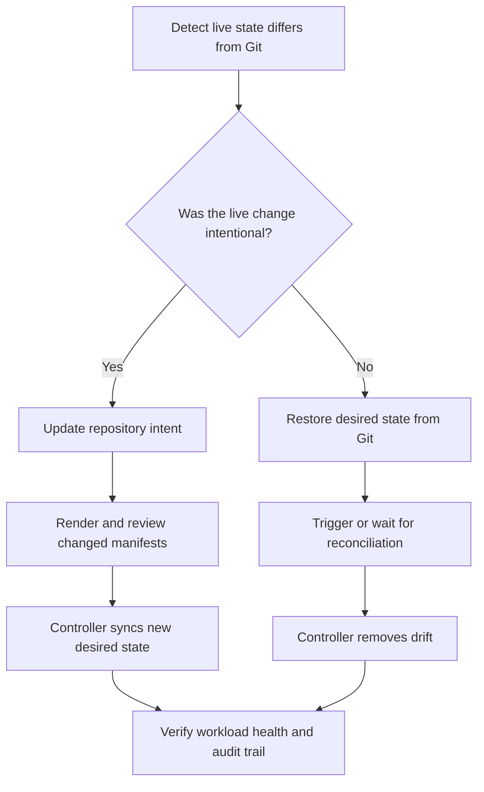
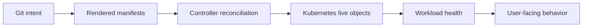

> **Напрямок CNPE** | Складність: `[СКЛАДНИЙ]` | Час на проходження: 90-120 хв
>
> **Передумови**: Стратегія іспиту CNPE та середовище, Deployment'и і Service'и Kubernetes, основи Git, базові знання Helm або Kustomize, основи Argo CD або Flux, перевірки стану розгортань

## Результати навчання

Після цього модуля ви зможете:

- **Спроєктувати** структуру GitOps-репозиторію, яка відділяє повторно використовуваний намір застосунку від рішень щодо доставки, специфічних для середовища.
- **Діагностувати** різницю між бажаним станом, живим станом, станом синхронізації, станом справності та станом розгортання під час інцидентів доставки.
- **Просунути** зміну робочого навантаження між середовищами, зберігаючи Git як джерело наміру й уникаючи невідстежуваних ручних патчів.
- **Оцінити**, яка стратегія — пряме розгортання, канаркове чи синьо-зелене — найкраще пасує сценарію доставки CNPE.
- **Перевірити** шлях GitOps-доставки наскрізно за допомогою стану контролера, стану виконання Kubernetes, подій і доказів відкату.

## Чому цей модуль важливий

Платформний інженер приєднується до телефонної конференції чергової зміни після того, як рутинна зміна конфігурації порушила трафік оформлення замовлення. CI-завдання зелене, GitOps-застосунок повідомляє, що синхронізувався, а Deployment звітує, що розгортання завершилося, проте клієнти все одно отримують помилки з одного середовища і застарілу поведінку з іншого. У команди є команди, дашборди й доступ до репозиторію, але ніхто не може одразу пояснити, яка система володіє істиною.

Саме тому CNPE розглядає доставку як операційну дисципліну, а не як перелік кроків з інструментом. Кандидат, який лише пам'ятає, як натиснути «sync» чи запустити `kubectl apply`, гнатиметься за симптомами. Кандидат, який розуміє GitOps як систему узгодження, може вирішити, де живе намір, який контролер відповідає за збіжність і які докази підтверджують, що живий кластер відповідає очікуваному релізу.

GitOps потужний, бо перетворює доставку на керований цикл зворотного зв'язку. Git записує намір, контролер порівнює цей намір із кластером, а узгодження закриває розрив, коли реальність відхиляється. Складна частина — не гасло. Складна частина — користуватися цим циклом під тиском часу, коли структура репозиторію недосконала, розгортання частково справне або ручна зміна створила дрейф, що виглядає як помилка розгортання.

> **Аналогія керованого циклу**
>
> GitOps менше схожий на вантажівку доставки і більше — на термостат. Бажана температура — це не те саме, що поточна температура, а зміна термостата — це не те саме, що махати віялом у кімнаті. Контролер постійно порівнює бажаний стан із живим, і ваша робота — знати, який вхідний параметр змінити, коли в кімнаті щось не так.

Цей модуль навчає шляху доставки від початкового до старшого рівня, будуючи ту саму ментальну модель шарами. Спершу ви відокремите стани, про які звітують GitOps-системи. Потім ви читатимете структуру репозиторію як операційний контракт. Після цього ви пройдете повну послідовність початкового налаштування, просування, відновлення після дрейфу й поступової доставки, перш ніж попрактикуєте те саме мислення самостійно.

## Основний зміст

## Частина 1: Модель станів GitOps

GitOps стає набагато простішим, щойно ви перестаєте трактувати «розгорнуто» як одне слово. У реальних системах зміна може бути закомічена, але не синхронізована; синхронізована, але несправна; справна, але з неправильним образом; або працювати коректно, тоді як репозиторій усе ще містить майбутню зміну, яку не просунули. Сценарії CNPE часто ховають справжню проблему в одному з цих розривів.

Перша професійна звичка — запитати, який стан ви спостерігаєте. Бажаний стан — це ціль, описана в Git і згенерованих маніфестах. Живий стан — це те, що наразі зберігає Kubernetes API. Стан синхронізації — це порівняння контролером бажаного й живого стану. Стан справності — це інтерпретація контролером того, чи придатні живі ресурси до використання. Стан розгортання — це поступ контролера робочого навантаження під час заміни Pod'ів.

| Стан | Власник | На яке питання відповідає | Приклад доказу | Поширена пастка |
|------|-------|---------------------|------------------|-------------|
| Бажаний стан | Git-репозиторій і інструмент рендерингу | Що має існувати після узгодження? | Kustomize-оверлей задає `replicas: 3` | Припущення, що локальне редагування вже є в Git до коміту |
| Відрендерений стан | Helm, Kustomize чи інший генератор | Які маніфести застосує контролер? | Вивід `kustomize build overlays/staging` | Налагодження сирих шаблонів без перевірки відрендереного YAML |
| Живий стан | Kubernetes API-сервер | Що існує в кластері просто зараз? | `kubectl get deploy payment-api -n payments-staging -o yaml` | Трактування ручного живого патча як нового джерела істини |
| Стан синхронізації | GitOps-контролер | Чи збігаються бажаний і живий стан з погляду контролера? | Argo CD `Synced`, Flux `Ready=True` | Припущення, що синхронізація означає справність застосунку |
| Стан справності | GitOps-контролер і статус робочого навантаження | Чи придатні ресурси до використання після того, як вони існують? | Умова доступності Deployment, готовність Pod'а | Пропуск поганої проби готовності після успішної синхронізації |
| Стан розгортання | Контролер робочого навантаження Kubernetes або контролер розгортання | Чи безпечно трафік переходить на нову ревізію? | `kubectl rollout status`, фаза Rollout, результат аналізу | Зупинка після появи ReplicaSet без перевірки доступності |

Коли запит каже «застосунок розгорнувся некоректно», не редагуйте YAML одразу. Спершу класифікуйте збій. Якщо бажаний стан неправильний, виправте репозиторій. Якщо відрендерений стан неправильний, виправте вхідні дані генератора чи оверлей. Якщо живий стан відрізняється від бажаного, дослідіть GitOps-контролер. Якщо синхронізація чиста, але справність погана, налагодьте робоче навантаження. Якщо справність добра, але користувачі бачать мішану поведінку, дослідіть стратегію розгортання й маршрутизацію трафіку.

```text
+------------------+        +-------------------+        +--------------------+
|      Git         |        |   GitOps Control  |        |    Kubernetes API  |
|  desired intent  | -----> |  render + compare | -----> |     live objects   |
+------------------+        +-------------------+        +--------------------+
        ^                             |                              |
        |                             v                              v
        |                    +-------------------+        +--------------------+
        |                    |  sync and health  |        |  pods and services |
        |                    |      signals      |        |   runtime state    |
        |                    +-------------------+        +--------------------+
        |                                                           |
        +----------------------- rollback or promotion evidence -----+
```

Діаграма показує, чому зеленого сигналу в одному блоці недостатньо. Git може бути коректним, тоді як контролеру бракує дозволу. Контролер може бути синхронізованим, тоді як Pod'и падають. Pod'и можуть бути готовими, тоді як селектор Service вказує на неправильні мітки. Старший платформний інженер перевіряє кожну межу, замість того щоб припускати, що одна успішна команда доводить увесь шлях.

> **Зупиніться й передбачте:** GitOps-застосунок повідомляє `Synced`, але в Deployment нуль доступних реплік. Який стан, імовірно, коректний, а який, імовірно, збоїть? Напишіть одне речення, перш ніж читати відповідь.

Імовірна відповідь полягає в тому, що бажаний і живий стан збігаються з погляду контролера, але стан справності чи розгортання збоїть. Контролер застосував маніфести, які мав намір застосувати, тож наступний доказ має надійти від умов Deployment, ReplicaSet'ів, Pod'ів, подій, проб і логів застосунку. Редагувати об'єкт Application першим було б передчасно, бо межа синхронізації — не там, куди вказують докази.

Другий поширений сценарій — зворотний: застосунок справний, але GitOps-контролер повідомляє `OutOfSync`. Це може статися, коли людина вручну масштабує Deployment, коли мутувальний контролер допуску додає поля, які GitOps-інструмент не ігнорує, або коли вивід рендерингу змінився після оновлення залежності. Справність каже, що застосунок наразі придатний до використання; синхронізація каже, що операційний контракт відхилився.

Для прикладів команд цей модуль використовує повну назву команди `kubectl`, навіть попри те, що багато інженерів скорочують її в інтерактивному режимі у власних оболонках. Цей вибір навмисний, бо скопійовані лабораторні блоки мають виконуватися в неінтерактивних терміналах, CI-завданнях і чернеткових скриптах іспиту без залежності від локальних файлів запуску оболонки. Надійність прикладів важлива для роботи з GitOps, бо учень має витрачати увагу на межі узгодження, а не на обгортку команди, що існує лише на одній робочій станції.

```bash
kubectl version --client
kubectl get namespaces
```

Використовуйте послідовний порядок огляду під час роботи на іспиті. Почніть з GitOps-об'єкта, потім огляньте робоче навантаження, потім огляньте Pod'и й події. Ця послідовність запобігає випадковому блуканню в налагодженні, бо кожна команда відповідає на інше питання. Якщо контролер каже, що не може відрендерити маніфести, логи Pod'а — це шум. Якщо Pod'и зациклюються в падінні після чистої синхронізації, структура репозиторію, ймовірно, не є першою проблемою.

```bash
APP_NAMESPACE="${APP_NAMESPACE:-argocd}"
APP_NAME="${APP_NAME:-payment-api-staging}"
WORKLOAD_NAMESPACE="${WORKLOAD_NAMESPACE:-payments-staging}"

kubectl get application "$APP_NAME" -n "$APP_NAMESPACE" -o wide
kubectl describe application "$APP_NAME" -n "$APP_NAMESPACE"
kubectl get deploy -n "$WORKLOAD_NAMESPACE"
kubectl get pods -n "$WORKLOAD_NAMESPACE" -o wide
kubectl get events -n "$WORKLOAD_NAMESPACE" --sort-by=.lastTimestamp
```

Якщо ваше середовище використовує Flux, а не Argo CD, іменники змінюються, але міркування — ні. Flux зазвичай надає [об'єкти `GitRepository`, `Kustomization`](https://fluxcd.io/flux/components/kustomize/kustomizations/), [`HelmRepository` та `HelmRelease`](https://fluxcd.io/flux/guides/helmreleases/). Argo CD зазвичай надає [об'єкти `Application` і може використовувати `ApplicationSet` для генерації](https://argo-cd.readthedocs.io/en/stable/operator-manual/applicationset/). Обидва — це системи узгодження, які порівнюють задекларований намір із живими ресурсами.

```bash
kubectl get applications.argoproj.io -A 2>/dev/null || true
kubectl get applicationsets.argoproj.io -A 2>/dev/null || true
kubectl get gitrepositories.source.toolkit.fluxcd.io -A 2>/dev/null || true
kubectl get kustomizations.kustomize.toolkit.fluxcd.io -A 2>/dev/null || true
kubectl get helmreleases.helm.toolkit.fluxcd.io -A 2>/dev/null || true
```

Патерн `2>/dev/null || true` корисний у навчальних середовищах, бо може бути встановлене лише одне сімейство контролерів. Це не спосіб приховати помилки у виробничій автоматизації. У лабораторії іспиту він дає змогу швидко з'ясувати, які типи API існують, не провалюючи всю послідовність команд, коли CRD відсутній.

## Частина 2: Структура репозиторію як операційний контракт

GitOps-репозиторій — це не лише місце зберігання YAML. Це операційний контракт, який каже супровідникам, як рухаються зміни, де належать відмінності середовищ і як пояснити живий кластер на основі історії версій. Чітка структура репозиторію зменшує когнітивне навантаження під час інцидентів, бо команда знає, куди дивитися, ще до того, як дізнається, що збоїло.

Практична структура відокремлює базовий намір застосунку від оверлеїв середовищ. База має описувати те, що загалом справедливо щодо робочого навантаження: імена контейнерів, порти, мітки й проби за замовчуванням. Оверлеї мають описувати те, що змінюється залежно від середовища: кількість реплік, тег образу, простір імен, обмеження ресурсів, посилання на конфігурацію чи політику поступової доставки.

```text
apps/
  payment-api/
    base/
      deployment.yaml
      service.yaml
      kustomization.yaml
    overlays/
      dev/
        kustomization.yaml
        patch-replicas.yaml
        patch-image.yaml
      staging/
        kustomization.yaml
        patch-replicas.yaml
        patch-image.yaml
      prod/
        kustomization.yaml
        patch-replicas.yaml
        patch-image.yaml
platform/
  clusters/
    dev/
      payment-api-application.yaml
    staging/
      payment-api-application.yaml
    prod/
      payment-api-application.yaml
```

Ця структура — не єдина правильна відповідь, але вона демонструє розділення, про яке CNPE очікує від вас міркувань. Дерево `apps` пояснює, як рендериться робоче навантаження. Дерево `platform/clusters` пояснює, який кластер чи середовище узгоджує який оверлей. Просування тоді можна подати як зміну в Git до оверлею або як переміщення гілки/тегу, залежно від обраної політики платформи.

| Область репозиторію | Що тут належить | Що зазвичай тут не належить | Тест на міркування |
|-----------------|--------------------|------------------------------------|----------------|
| `base/` | Спільні Deployment, Service, мітки, проби, форма контейнера за замовчуванням | Кількість реплік чи секрети лише для продакшну | Чи це й далі було б справедливим у dev і staging? |
| `overlays/dev/` | Малий масштаб, тег образу для dev, посилання на конфігурацію dev | Політика продакшн-трафіку | Чи робить це локальну перевірку дешевшою й безпечнішою? |
| `overlays/staging/` | Образ-кандидат на реліз, конфігурація staging, масштаб, близький до продакшну, де корисно | Неперевірені експериментальні патчі | Чи достатньо це віддзеркалює продакшн, щоб уловити ризик? |
| `overlays/prod/` | Затверджений образ, продакшн-масштаб, продакшн-політика розгортання | Сайдкари лише для налагодження, якщо явно не затверджені | Чи можна захистити цю зміну під час розбору інциденту? |
| `platform/clusters/` | GitOps Application чи Flux Kustomization, що вказує на оверлеї | Сирі маніфести робочого навантаження, продубльовані з apps | Чи визначає це узгодження, не приховуючи наміру застосунку? |

Ключова навичка — знати, коли дублювання шкідливе, а коли розділення навмисне. Повторення всього Deployment у кожному середовищі робить просування ризикованими, бо кожне середовище може мовчки розійтися. Зберігання невеликого патча в кожному оверлеї корисне, бо відмінності середовищ видимі й придатні до рецензування. Старший інженер не усуває все дублювання; він зберігає значущі межі.

> **Підказка для активного навчання:** Подивіться на дерево репозиторію вище й уявіть, що staging виконує образ `1.8.2`, тоді як продакшн виконує `1.8.1`. Де має з'явитися ця відмінність і що було б небезпечним у зміні базового Deployment безпосередньо?

Відмінність образу має з'явитися в оверлеях staging і продакшну або в механізмі просування, який ці оверлеї споживають. Зміна базового Deployment безпосередньо вплинула б на кожне середовище, що посилається на базу, що могло б ненавмисно просунути образ у продакшн. Небезпека не лише в тому, що продакшн змінюється; небезпека в тому, що історія Git більше не показує навмисне просування між середовищами.

Ось мінімальна база Kustomize для невеликого сервісу. Приклад навмисно звичайний, бо суть — у контракті доставки, а не в хитромудрому YAML. Мітки стабільні, Service вибирає ці мітки, а Deployment виставляє пробу готовності, тож справність можна перевірити після синхронізації.

```yaml
apiVersion: apps/v1
kind: Deployment
metadata:
  name: payment-api
  labels:
    app.kubernetes.io/name: payment-api
spec:
  replicas: 2
  selector:
    matchLabels:
      app.kubernetes.io/name: payment-api
  template:
    metadata:
      labels:
        app.kubernetes.io/name: payment-api
    spec:
      containers:
        - name: payment-api
          image: nginx:1.27.4
          ports:
            - containerPort: 80
          readinessProbe:
            httpGet:
              path: /
              port: 80
            initialDelaySeconds: 3
            periodSeconds: 5
```

```yaml
apiVersion: v1
kind: Service
metadata:
  name: payment-api
  labels:
    app.kubernetes.io/name: payment-api
spec:
  selector:
    app.kubernetes.io/name: payment-api
  ports:
    - name: http
      port: 80
      targetPort: 80
```

```yaml
apiVersion: kustomize.config.k8s.io/v1beta1
kind: Kustomization
resources:
  - deployment.yaml
  - service.yaml
```

Оверлей staging тоді може коригувати лише ті частини, що відрізняються. Оверлей посилається назад на базу, задає простір імен і застосовує патчі. У реальному репозиторії теги образів можуть керуватися контролером автоматизації образів або процесом релізу, але принцип той самий: намір середовища залишається видимим.

```yaml
apiVersion: kustomize.config.k8s.io/v1beta1
kind: Kustomization
namespace: payments-staging
resources:
  - ../../base
patches:
  - path: patch-replicas.yaml
  - path: patch-image.yaml
```

```yaml
apiVersion: apps/v1
kind: Deployment
metadata:
  name: payment-api
spec:
  replicas: 3
```

```yaml
apiVersion: apps/v1
kind: Deployment
metadata:
  name: payment-api
spec:
  template:
    spec:
      containers:
        - name: payment-api
          image: nginx:1.27.5
```

Перш ніж під'єднувати GitOps-контролер, рендерте оверлей локально щоразу, коли доступний інструментарій. Це вловлює помилки відступів, відсутні шляхи й випадкові міжсередовищні зміни раніше, ніж цикл узгодження контролера. Рендеринг — також корисна звичка на іспиті, бо він каже вам, чи продукує репозиторій той об'єкт, який ви думаєте, що він продукує.

```bash
kustomize build apps/payment-api/overlays/staging
```

Якщо `kustomize` не встановлено як окремий бінарник, нещодавні клієнти Kubernetes можуть [рендерити каталоги Kustomize через `kubectl`](https://kubernetes.io/docs/reference/kubectl/generated/kubectl_kustomize/). Вивід слід трактувати як згенерований доказ, а не як файл для ручного редагування. Якщо відрендерений вивід неправильний, виправте оверлей чи базовий вхід, що його продукував.

```bash
kubectl kustomize apps/payment-api/overlays/staging
```

Репозиторій на основі Helm дотримується тих самих операційних принципів, навіть попри те, що файли виглядають інакше. Чарт або залежність визначає повторно використовувану структуру. Значення середовища визначають відмінності. GitOps-об'єкт вказує на чарт і значення для цільового середовища. Найпоширеніша помилка — приховування поведінки, специфічної для середовища, всередині шаблонів чарту, доки рецензенти не зможуть побачити, що змінює просування.

```text
charts/
  payment-api/
    Chart.yaml
    templates/
      deployment.yaml
      service.yaml
environments/
  dev/
    payment-api-values.yaml
  staging/
    payment-api-values.yaml
  prod/
    payment-api-values.yaml
platform/
  clusters/
    staging/
      payment-api-helmrelease.yaml
```

Вибір між Helm і Kustomize має слідувати за формою проблеми. Kustomize сильний, коли у вас уже є звичайні маніфести Kubernetes і потрібні оверлеї. Helm сильний, коли вам потрібне параметризоване пакування, залежності й розповсюдження чартів. CNPE не винагороджує використання складнішого інструмента за замовчуванням; він винагороджує вибір найменшого інструмента, що зберігає надійну доставку.

| Точка рішення | Віддавайте перевагу Kustomize, коли | Віддавайте перевагу Helm, коли | Звичка перевірки |
|----------------|-----------------------|------------------|--------------------|
| Модель пакування | Маніфести вже існують, і оверлеїв достатньо | Вам потрібен повторно використовуваний чарт зі значеннями | Рендерте перед синхронізацією й оглядайте згенеровані об'єкти |
| Відмінності середовищ | Відмінності — це невеликі патчі | Відмінності визначаються значеннями в багатьох шаблонах | Порівнюйте відрендерені виводи dev і staging |
| Залежності | Застосунок самодостатній | Застосунок встановлює пов'язані ресурси як єдине ціле | Перевірте версію чарту й відрендерений вивід залежностей |
| Ясність рецензування | Рецензенти мають бачити прямі патчі Kubernetes | Рецензенти розуміють значення й шаблони чартів | Підтвердьте, що diff показує намір, а не шум |
| Швидкість на іспиті | Запит просить невелике виправлення доставки | Запит надає чарт чи HelmRelease | Уникайте міграції інструмента, якщо не потрібно |

Чистий репозиторій чистий не тому, що в ньому немає складності. Він чистий, бо складність має адресу. Базова поведінка живе в одному місці, відмінності середовищ — в іншому, а об'єкти узгодження кластера — там, де оператори очікують їх знайти. Коли модуль далі попросить вас відновитися після дрейфу, ця структура полегшить визначення правильного джерела істини.

Те саме правило діє, коли репозиторій розростається за межі одного сервісу. Спільні платформні ресурси, маніфести застосунків і реєстрації середовищ можуть жити в окремих каталогах чи навіть окремих репозиторіях, але рецензентам усе одно потрібен передбачуваний шлях від наміру до узгодження. Якщо зміну не можна простежити від коміту до відрендереного об'єкта, а потім до живого об'єкта, яким володіє контролер, структура, ймовірно, оптимізує зручність авторства замість операційної ясності.

## Частина 3: Опрацьований приклад A — Початкове налаштування сервісу через GitOps

Опрацьований приклад має показати весь шлях від наміру репозиторію до доказу часу виконання. У цьому сценарії платформна команда має ввести `payment-api` у середовище staging. Сервіс уже має маніфести, цільовий простір імен — `payments-staging`, а в кластері вже працює GitOps-контролер. Ваша мета — змусити контролер узгодити оверлей, а потім довести, що робоче навантаження доступне.

Приклад використовує Argo CD для об'єкта контролера, бо його ресурс `Application` поширений у GitOps-лабораторіях. Якщо ваша лабораторія використовує Flux, збережіть ті самі міркування й підставте ресурс контролера, показаний далі в цьому розділі. Важлива послідовність — це структура репозиторію, перевірка рендерингу, реєстрація контролера, спостереження за синхронізацією, перевірка часу виконання й готовність до відкату.

Почніть зі створення файлів застосунку в робочому просторі репозиторію. Ці команди можна виконати в порожньому каталозі, і вони продукують невелику структуру Kustomize. Вони ще нічого не застосовують до кластера, що навмисно, бо перша межа для перевірки — це відрендерений бажаний стан.

```bash
mkdir -p apps/payment-api/base
mkdir -p apps/payment-api/overlays/staging
mkdir -p platform/clusters/staging

cat > apps/payment-api/base/deployment.yaml <<'YAML'
apiVersion: apps/v1
kind: Deployment
metadata:
  name: payment-api
  labels:
    app.kubernetes.io/name: payment-api
spec:
  replicas: 2
  selector:
    matchLabels:
      app.kubernetes.io/name: payment-api
  template:
    metadata:
      labels:
        app.kubernetes.io/name: payment-api
    spec:
      containers:
        - name: payment-api
          image: nginx:1.27.4
          ports:
            - containerPort: 80
          readinessProbe:
            httpGet:
              path: /
              port: 80
            initialDelaySeconds: 3
            periodSeconds: 5
YAML

cat > apps/payment-api/base/service.yaml <<'YAML'
apiVersion: v1
kind: Service
metadata:
  name: payment-api
  labels:
    app.kubernetes.io/name: payment-api
spec:
  selector:
    app.kubernetes.io/name: payment-api
  ports:
    - name: http
      port: 80
      targetPort: 80
YAML

cat > apps/payment-api/base/kustomization.yaml <<'YAML'
apiVersion: kustomize.config.k8s.io/v1beta1
kind: Kustomization
resources:
  - deployment.yaml
  - service.yaml
YAML
```

Додайте оверлей staging. Декларація простору імен означає, що відрендерені об'єкти будуть націлені на `payments-staging` без дублювання полів простору імен у кожному маніфесті. Патч образу робить staging видимо відмінним від бази, що дає вам щось конкретне для перевірки після узгодження.

```bash
cat > apps/payment-api/overlays/staging/kustomization.yaml <<'YAML'
apiVersion: kustomize.config.k8s.io/v1beta1
kind: Kustomization
namespace: payments-staging
resources:
  - ../../base
patches:
  - path: patch-replicas.yaml
  - path: patch-image.yaml
YAML

cat > apps/payment-api/overlays/staging/patch-replicas.yaml <<'YAML'
apiVersion: apps/v1
kind: Deployment
metadata:
  name: payment-api
spec:
  replicas: 3
YAML

cat > apps/payment-api/overlays/staging/patch-image.yaml <<'YAML'
apiVersion: apps/v1
kind: Deployment
metadata:
  name: payment-api
spec:
  template:
    spec:
      containers:
        - name: payment-api
          image: nginx:1.27.5
YAML
```

Відрендерте оверлей перед створенням будь-якого GitOps-об'єкта. Це перша явна контрольна точка на шляху доставки. Якщо рендеринг провалиться, контролер теж провалиться б, але з більшою затримкою й більшим супутнім шумом. Якщо рендеринг успішний, огляньте вивід щодо простору імен, образу, міток, селектора Service і кількості реплік.

```bash
kubectl kustomize apps/payment-api/overlays/staging | grep -E 'name: payment-api|namespace: payments-staging|replicas:|image:|app.kubernetes.io/name'
```

Успішний рендеринг має показати Deployment і Service з ім'ям `payment-api`, простір імен `payments-staging`, образ `nginx:1.27.5` і кількість реплік staging. Якщо [селектор Service і мітка шаблону Pod'а відрізняються](https://kubernetes.io/docs/tasks/debug/debug-application/debug-service/), синхронізація все одно може бути успішною, тоді як трафік збоїть. Саме тому перевірки рендерингу мають включати поля зв'язків, а не лише існування об'єктів.

> **Зупиніться й передбачте:** Якщо оверлей змінює мітку Deployment, але не селектор Service, що, імовірно, повідомить GitOps-контролер і що, імовірно, відчують користувачі?

Контролер, імовірно, повідомить про успішну синхронізацію, бо маніфести валідні й застосовані. Користувачі все одно можуть відчути збій, бо Service більше не вибирає Pod'и. Це класичний приклад того, як стан синхронізації чистий, тоді як справність застосунку чи поведінка трафіку неправильна, і саме тому старша перевірка включає селектори, ендпоінти й готовність, а не лише статус контролера.

Тепер створіть Argo CD `Application`, який вказує на оверлей staging. Замініть `https://example.com/org/platform-repo.git` на фактичний URL репозиторію в реальній лабораторії. Це показує обов'язкові поля: [репозиторій-джерело, шлях, цільову ревізію, кластер призначення, простір імен призначення й політику синхронізації](https://argo-cd.readthedocs.io/en/stable/user-guide/application-specification/).

```yaml
apiVersion: argoproj.io/v1alpha1
kind: Application
metadata:
  name: payment-api-staging
  namespace: argocd
spec:
  project: default
  source:
    repoURL: https://example.com/org/platform-repo.git
    targetRevision: main
    path: apps/payment-api/overlays/staging
  destination:
    server: https://kubernetes.default.svc
    namespace: payments-staging
  syncPolicy:
    automated:
      prune: true
      selfHeal: true
    syncOptions:
      - CreateNamespace=true
```

У під'єднаному репозиторії закомітьте файли й дайте контролеру помітити зміну. Коміт є частиною доказу доставки, бо він записує намір. Якщо запит вимагає GitOps-шляху, застосування відрендереного YAML безпосередньо за допомогою `kubectl apply` обходить цей шлях і створює оманливий успіх.

```bash
git status --short
git add apps/payment-api platform/clusters/staging
git commit -m "feat(delivery): onboard payment-api staging"
```

У середовищі іспиту віддалений Git і дозволи контролера зазвичай попередньо налаштовані. Після пушу огляньте об'єкт контролера, а не припускайте, що пуш зійшовся. Коміт Git доводить, що бажаний стан змінився; він не доводить, що контролер витягнув, відрендерив, застосував чи досяг справності.

```bash
git push

kubectl get application payment-api-staging -n argocd -o wide
kubectl describe application payment-api-staging -n argocd
```

Читайте поля статусу як послідовність тверджень. [Статус синхронізації `Synced` означає, що бажані й живі ресурси збігаються згідно з Argo CD. Статус справності `Healthy` означає, що Argo CD вважає керовані ресурси придатними до використання](https://argo-cd.readthedocs.io/en/release-3.4/getting_started/). Поле ревізії каже вам, яку ревізію Git було узгоджено. Якщо ревізія стара, контролер може бути справним, але ще не діяти на ваш коміт.

Для Flux еквівалентним об'єктом може бути [`Kustomization`, що вказує на `GitRepository`](https://fluxcd.io/flux/components/kustomize/kustomizations/). Імена об'єктів відрізняються, але діє та сама послідовність доказів: джерело витягнуто, артефакт створено, kustomization узгоджено, ресурси застосовано, робоче навантаження справне. Наступний YAML показує форму узгодження в стилі Flux.

```yaml
apiVersion: source.toolkit.fluxcd.io/v1
kind: GitRepository
metadata:
  name: platform-repo
  namespace: flux-system
spec:
  interval: 1m
  url: https://example.com/org/platform-repo.git
  ref:
    branch: main
---
apiVersion: kustomize.toolkit.fluxcd.io/v1
kind: Kustomization
metadata:
  name: payment-api-staging
  namespace: flux-system
spec:
  interval: 1m
  sourceRef:
    kind: GitRepository
    name: platform-repo
  path: ./apps/payment-api/overlays/staging
  prune: true
  wait: true
  targetNamespace: payments-staging
  timeout: 3m
```

Після синхронізації контролера перевірте стан виконання Kubernetes. Саме тут багато слабких лабораторних відповідей зупиняються надто рано. Deployment може існувати ще до того, як стане доступним, Pod'и можуть існувати ще до того, як проба готовності пройде, а Service може існувати без ендпоінтів. CNPE очікує доказів, що робоче навантаження дійсно обслуговує через передбачений шлях.

```bash
kubectl get namespace payments-staging
kubectl get deploy payment-api -n payments-staging -o wide
kubectl rollout status deploy/payment-api -n payments-staging --timeout=120s
kubectl get rs,pods,svc,endpoints -n payments-staging -l app.kubernetes.io/name=payment-api
```

Якщо Deployment доступний, але ендпоінти порожні, порівняйте селектор Service з мітками Pod'ів. Це навчальний приклад використання моделі станів. Синхронізація може бути коректною, живі об'єкти можуть існувати, а розгортання може бути завершеним, проте трафік збоїть, бо зв'язки об'єктів неправильні. Виправлення належить до Git, бо неправильний зв'язок прийшов із бажаного стану.

```bash
kubectl get svc payment-api -n payments-staging -o jsonpath='{.spec.selector}{"\n"}'
kubectl get pods -n payments-staging -l app.kubernetes.io/name=payment-api --show-labels
```

Фінальна контрольна точка початкового налаштування — готовність до відкату. Безпечний шлях доставки включає шлях назад до відомої ревізії. Для щойно введеного сервісу відкат може означати реверт коміту, що ввів застосунок, або зміну оверлею назад на попередній образ. Вам не потрібно виконувати відкат щоразу, але ви маєте знати, яка ревізія Git відновила б попередній стан.

```bash
git log --oneline --decorate -n 5
git show --stat --oneline HEAD
```

Хороша відповідь на іспиті описує шлях і докази. Наприклад: «Я додав оверлей staging, відрендерив його локально, закомітив GitOps Application, підтвердив, що контролер узгодив поточний коміт, перевірив доступність Deployment, перевірив ендпоінти й визначив коміт для відкату». Така відповідь демонструє міркування про доставку. «Я застосував YAML, і Pod'и працюють» — ні.

## Частина 4: Опрацьований приклад B — Просування зміни без порушення контролю дрейфу

Просування — це місце, де багато помилок GitOps стають видимими. Команда оновлює образ у dev, перевіряє його, а потім хоче той самий реліз у staging. Небезпечне скорочення — пропатчити Deployment staging безпосередньо, бо це здається швидшим. Правильний підхід GitOps — провести намір релізу через шлях репозиторію, який узгоджує staging.

У цьому прикладі dev уже виконує `nginx:1.27.6`, а staging виконує `nginx:1.27.5`. Завдання — просунути образ до staging, зберігаючи історію Git, межі середовищ і власність контролера. Фактичний образ не важливий; важливі міркування про доставку.

Спершу огляньте поточну відмінність оверлеїв. Це надійніше, ніж вгадування з пам'яті, бо багато інцидентів починаються із застарілого припущення про те, яке середовище вже змінилося. Команда `grep` проста, але звичка професійна: перевірте вхід, перш ніж редагувати шлях.

```bash
grep -R "image:" apps/payment-api/overlays/dev apps/payment-api/overlays/staging
```

Припустимо, вивід показує, що dev попереду staging. Зміна просування належить до оверлею staging, а не до бази, бо завдання — не оновити кожне середовище. Якщо продакшн посилається на ту саму базу, зміна бази перетворила б просування staging на ширший реліз.

```bash
perl -0pi -e 's/nginx:1\.27\.5/nginx:1.27.6/g' apps/payment-api/overlays/staging/patch-image.yaml

git diff -- apps/payment-api/overlays/staging/patch-image.yaml
```

Відрендерте оверлей staging знову. Просування має продукувати невелику, пояснювану відрендерену відмінність. Якщо рендеринг показує зміни в мітках, просторах імен, пробах чи портах Service, ви випадково об'єднали непов'язані зміни з просуванням. Це проблема обсягу, а не проблема GitOps-контролера.

```bash
kubectl kustomize apps/payment-api/overlays/staging | grep -E 'image:|replicas:|namespace:'
```

Закомітьте просування з повідомленням, що ідентифікує середовище й робоче навантаження. Історія Git стає журналом аудиту наміру доставки, тож розпливчасті повідомлення на кшталт «виправив дещо» шкодять операціям, навіть коли YAML технічно коректний. Корисне повідомлення коміту дає рецензенту змогу зрозуміти радіус ураження, перш ніж відкривати diff.

```bash
git add apps/payment-api/overlays/staging/patch-image.yaml
git commit -m "chore(delivery): promote payment-api staging image"
git push
```

Тепер стежте за контролером і робочим навантаженням. Доказ контролера має показати, що staging узгодив нову ревізію. Доказ робочого навантаження має показати новий образ, поступ розгортання й доступні репліки. Якщо контролер повідомляє `Synced` проти старої ревізії, зачекайте або огляньте оновлення джерела, замість того щоб налагоджувати Pod'и.

```bash
kubectl get application payment-api-staging -n argocd -o wide
kubectl get deploy payment-api -n payments-staging -o jsonpath='{.spec.template.spec.containers[0].image}{"\n"}'
kubectl rollout status deploy/payment-api -n payments-staging --timeout=120s
kubectl get pods -n payments-staging -l app.kubernetes.io/name=payment-api -o jsonpath='{range .items[*]}{.metadata.name}{" "}{.spec.containers[0].image}{" "}{.status.phase}{"\n"}{end}'
```

Просування завершене лише тоді, коли докази узгоджуються. Git містить зміну оверлею staging. Контролер узгодив коміт. Kubernetes показує передбачений образ. Розгортання завершилося. Pod'и готові. Якщо будь-яке з цих тверджень хибне, повідомте точну межу, що збоїла, замість того щоб казати «розгортання провалилося».

> **Що сталося б, якби:** Ви вручну запустили `kubectl set image deploy/payment-api payment-api=nginx:1.27.6 -n payments-staging`, доки самовідновлення Argo CD ввімкнено, але не закомітили зміну оверлею?

Живий Deployment може ненадовго змінитися, але GitOps-контролер виявить дрейф і відновить образ із Git. Якщо самовідновлення вимкнено, живий об'єкт може залишитися пропатченим, тоді як контролер повідомляє про дрейф. Обидва результати операційно гірші за чисте просування, бо репозиторій більше не пояснює кластер.

Дизайн просування різниться залежно від організації. Деякі команди просувають, редагуючи оверлеї середовищ. Деякі просувають, змінюючи файл версії, який споживають кілька застосунків. Деякі просувають, переміщуючи Git-тег, який відстежує контролер. Механізм важить менше за інваріант: рецензент має бути здатним відповісти, що змінилося, де змінилося, хто схвалив і як живий кластер зійшовся.

| Стиль просування | Як працює | Сильна сторона | Ризик, за яким стежити |
|-----------------|--------------|----------|---------------|
| Патч оверлею | Оновити оверлей staging чи продакшну безпосередньо | Чіткий diff, специфічний для середовища | Повторні патчі можуть із часом стати шумними |
| Файл версії | Середовище читає теги образів із файлу релізу | Централізований вигляд релізу для багатьох застосунків | Інструментарій має робити згенеровані зміни придатними до рецензування |
| Просування гілки | Контролер відстежує гілку середовища | Звичний Git-процес для команд | Дрейф гілки може приховати відмінності, якщо не керувати ним |
| Просування тегу | Контролер відстежує тег чи версію чарту | Незмінне посилання на реліз за правильного використання | Переміщення змінних тегів може заплутати історію аудиту |
| Автоматизація образів | Контролер оновлює поля образу після збігу політики | Зменшує ручну рутину для частих релізів | Політика не має просувати неперевірені образи |

Старший підхід до просування включає явний план відкату. Для просування оверлею відкат — це зазвичай Git-реверт коміту просування. Для версії чарту відкат може означати відновлення попередньої версії чарту чи значень. Для поступової доставки відкат може включати переривання розгортання й реверт Git, щоб контролер не повторно ввів погану версію.

```bash
git log --oneline -n 5 -- apps/payment-api/overlays/staging/patch-image.yaml
git revert --no-edit HEAD
git diff --stat HEAD~1..HEAD
```

Не запускайте реверт необачно під час успішної вправи з просування; знайте, як би ви його запустили й який доказ підтвердив би відкат. Відкат не завершений, коли команда Git завершилася. Він завершений, коли контролер узгоджує реверсований бажаний стан і робоче навантаження повертається до відомої справної ревізії.

## Частина 5: Опрацьований приклад C — Відновлення після дрейфу

Дрейф означає, що живий стан відрізняється від бажаного стану поза передбаченим шляхом доставки. Причиною може бути ручний патч, аварійна зміна, мутація контролера допуску, невдалий прунінг чи проблема конфігурації контролера. Професійна відповідь — визначити, чи має жива зміна стати бажаним станом, чи бути перезаписаною бажаним станом.

Почніть із конкретного інциденту. Deployment staging має виконувати три репліки згідно з Git, але живий об'єкт показує п'ять реплік. Користувачі не зачеплені, тож це не пожежа. Питання в тому, чи хтось навмисно масштабував сервіс і забув закомітити зміну, чи випадковий ручний патч слід виправити узгодженням.

Огляньте живий Deployment. Кількість реплік — це доказ, але це ще не рішення. Огляньте також анотації, керовані поля за потреби, події й статус контролера. Деякі контролери чи автомасштабувальники можуть законно змінювати поля, які GitOps має ігнорувати чи якими має володіти інакше.

```bash
kubectl get deploy payment-api -n payments-staging -o jsonpath='{.spec.replicas}{"\n"}'
kubectl describe deploy payment-api -n payments-staging
kubectl get events -n payments-staging --sort-by=.lastTimestamp | tail -n 20
```

Огляньте бажаний стан із репозиторію. Якщо оверлей staging каже три репліки, намір Git зрозумілий. Якщо база каже два, а оверлей каже три, оверлей перемагає у відрендереному виводі. Завжди перевіряйте відрендерений бажаний стан, коли задіяні патчі, бо читання лише одного файлу може ввести в оману.

```bash
grep -R "replicas:" apps/payment-api/base apps/payment-api/overlays/staging

kubectl kustomize apps/payment-api/overlays/staging | grep -A 4 -B 2 "replicas:"
```

Тепер огляньте вигляд контролера. [Якщо Argo CD повідомляє `OutOfSync`, контролер бачить відмінність. Якщо самовідновлення ввімкнено, він може автоматично відновити три репліки. Якщо самовідновлення вимкнено, він може повідомляти про дрейф, доки не станеться синхронізація](https://argo-cd.readthedocs.io/en/stable/user-guide/auto_sync/). Якщо контролер повідомляє `Synced`, тоді як живі репліки відрізняються, перевірте, чи поле ігнорується чи ним керує інший контролер.

```bash
kubectl get application payment-api-staging -n argocd -o wide
kubectl describe application payment-api-staging -n argocd | sed -n '/Status:/,/Events:/p'
```

На цьому етапі оберіть джерело істини. Якщо п'ять реплік потрібні, бо навантажувальні тести staging вимагають більшої потужності, оновіть Git і дайте контролеру узгодити цей намір. Якщо п'ять реплік випадкові, дайте GitOps відновити три репліки через синхронізацію чи самовідновлення. Не продовжуйте патчити живий об'єкт, доки сповіщення не стихнуть, бо це привчає платформу брехати.



Якщо жива зміна має стати бажаним станом, зробіть оновлення репозиторію. Це зберігає придатність до аудиту й зупиняє боротьбу контролера з кластером. Код нижче змінює патч реплік staging на п'ять, рендерить його й показує diff для рецензування.

```bash
perl -0pi -e 's/replicas: 3/replicas: 5/g' apps/payment-api/overlays/staging/patch-replicas.yaml

git diff -- apps/payment-api/overlays/staging/patch-replicas.yaml

kubectl kustomize apps/payment-api/overlays/staging | grep -A 2 -B 2 "replicas:"
```

Якщо живу зміну слід видалити, не редагуйте Git. Натомість дайте GitOps-контролеру відновити бажаний стан. Залежно від політики контролера, ви можете зачекати на самовідновлення, запустити синхронізацію чи видалити живий патч, яким володіє інша система. Точна команда залежить від встановленого інструмента, але рішення залишається тим самим: Git залишається авторитетним.

```bash
kubectl annotate application payment-api-staging -n argocd argocd.argoproj.io/refresh=normal --overwrite
kubectl get deploy payment-api -n payments-staging -w
```

Якщо контролер — це Flux, ви зазвичай використовували б CLI Flux для узгодження, коли він доступний. Без CLI огляньте об'єкти Flux і їхні умови через ресурси Kubernetes. Знову ж таки, важлива частина — перевірка межі джерела й узгодження.

```bash
kubectl get gitrepositories.source.toolkit.fluxcd.io -n flux-system
kubectl get kustomizations.kustomize.toolkit.fluxcd.io -n flux-system
kubectl describe kustomization payment-api-staging -n flux-system
```

Деякий дрейф очікуваний, і його слід налаштувати навмисно. Наприклад, HPA може змінювати кількість реплік, інжектор сервісної мережі може додавати сайдкари, а рушій політик може додавати мітки чи значення за замовчуванням. Старший дизайн GitOps визначає, якими полями володіє контролер доставки, а якими — інший контролер. Помилка не в тому, щоб дозволити будь-яку мутацію; помилка в тому, щоб дозволити непояснену мутацію.

| Джерело дрейфу | Приклад симптому | Чи має Git цим володіти? | Старша відповідь |
|--------------|-----------------|--------------------|-----------------|
| Ручний хотфікс | Живий образ відрізняється від оверлею | Зазвичай так | Закомітити чи реверснути зміну через Git |
| Масштабування HPA | Живі репліки відрізняються від маніфесту | Часто ні після появи HPA | Прибрати фіксовану власність на репліки чи обережно налаштувати правила ігнорування |
| Мутація допуску | З'являються додаткові мітки, анотації чи сайдкари | Залежить від політики | Задокументувати мутувальний контролер і ігнорувати лише безпечні згенеровані поля |
| Невдалий прунінг | Видалений у Git об'єкт усе ще існує в кластері | Так | Перевірити налаштування прунінгу, фіналізатори й дозволи контролера |
| Ротація секретів | Дані Secret змінюються поза Git | Часто ні | Використовувати External Secrets чи запечатані процеси замість зберігання сирих даних Secret |
| Аварійний патч | Жива конфігурація змінюється під час інциденту | Тимчасово, можливо | Перетворити прийнятий патч на Git чи навмисно реверснути його |

Відновлення після дрейфу завершене лише після того, як три твердження стають істинними. Репозиторій відображає прийнятий бажаний стан. GitOps-контролер більше не повідомляє про некеровану відмінність для полів, якими володіє. Робоче навантаження залишається справним після узгодження. Якщо ви не можете довести всі три, ви не завершили інцидент, навіть якщо безпосередній симптом зник.

## Частина 6: Поступова доставка як контроль ризику

Поступова доставка — це практика поступового виставлення зміни, спостереження за поведінкою і просування чи переривання на основі доказів. Вона не є автоматично кращою за пряме розгортання. Вона краща, коли вартість поганого релізу достатньо висока, щоб виправдати додаткові об'єкти контролера, метрики, маршрутизацію трафіку й операційну складність.

Використовуйте пряме розгортання Kubernetes, коли робоче навантаження низькоризикове, зміна рутинна, радіус ураження малий, а платформа не потребує формування трафіку. Використовуйте канаркову доставку, коли вам потрібно, щоб невеликий відсоток трафіку протестував нову версію перед ширшим виставленням. Використовуйте синьо-зелену доставку, коли вам потрібен повний альтернативний стек і контрольована точка перемикання.

| Стратегія | Найкраще пасує | Операційна вартість | Фокус перевірки |
|----------|----------|------------------|--------------------|
| Пряме розгортання | Прості stateless-зміни з прийнятною швидкістю відкату | Найнижча | Доступність Deployment, ReplicaSet'и, події, логи |
| Канаркова | Поступове виставлення з упевненістю на основі метрик | Середня | Ваги трафіку, результати аналізу, частота помилок |
| Синьо-зелена | Швидке перемикання й швидкий відкат між повними версіями | Середня-висока | Селектор активного Service, попередній Service, готовність |
| Ручне просування | Людське схвалення між етапами | Середня | Доказ схвалення, точки утримання, стан середовища |
| Автоматизоване просування | Часті релізи з надійними сигналами | Вища | Шаблони аналізу, якість метрик, поведінка переривання |

Запит CNPE може не назвати стратегію. Натомість він може сказати, що лише невеликий відсоток користувачів має побачити нову версію, або що команда має бути здатна швидко повернутися після перевірки. Перекладіть ці слова на вимоги доставки. «Невеликий відсоток» вказує на канаркову. «Перемикання між двома повними версіями» вказує на синьо-зелену. «Просто оновити staging» може взагалі не потребувати поступової доставки.

> **Зупиніться й вирішіть:** Ваша команда змінює колір CSS на внутрішній адмін-сторінці, якою користуються десять людей. Інша команда змінює логіку авторизації платежів, якою користуються всі клієнти. Яка зміна заслуговує на поступову доставку і який доказ виправдав би це рішення?

Зміна авторизації платежів заслуговує на сильнішу поступову доставку, бо радіус ураження й бізнес-ризик вищі. Зміна CSS може бути безпечною з прямим розгортанням і звичайною перевіркою. Рішення базується не на тому, чи канарка звучить сучасно; воно базується на впливі збою, виявності, швидкості відкату та якості сигналів, доступних під час релізу.

Argo Rollouts — це один поширений Kubernetes-нативний спосіб виразити поступову доставку. Наступний канарковий приклад навмисно невеликий. [Він задає початкову вагу трафіку, робить паузу для спостереження, збільшує виставлення, робить паузу знову, а потім завершується, якщо розгортання залишається справним](https://argoproj.github.io/argo-rollouts/features/canary/). Реальні продакшн-конфігурації часто інтегрують маршрутизацію трафіку сервісної мережі чи інгресу та аналіз метрик. Argo Rollout замінює Deployment для цього робочого навантаження — не запускайте обидва проти одного селектора; як альтернатива, посилайтеся на наявний Deployment через `spec.workloadRef`.

```yaml
apiVersion: argoproj.io/v1alpha1
kind: Rollout
metadata:
  name: payment-api
  namespace: payments-staging
spec:
  replicas: 4
  strategy:
    canary:
      steps:
        - setWeight: 20
        - pause:
            duration: 2m
        - setWeight: 50
        - pause:
            duration: 3m
  selector:
    matchLabels:
      app.kubernetes.io/name: payment-api
  template:
    metadata:
      labels:
        app.kubernetes.io/name: payment-api
    spec:
      containers:
        - name: payment-api
          image: nginx:1.27.6
          ports:
            - containerPort: 80
```

Об'єктом поступової доставки усе одно слід керувати через GitOps. Не трактуйте Argo Rollouts як привід відмовитися від наміру репозиторію. GitOps-контролер узгоджує об'єкт Rollout, тоді як контролер розгортання керує поетапним виставленням і ReplicaSet'ами. Це означає, що тепер у вас є два цикли керування, і ви маєте перевірити обидва.

```text
+-------------------+       +---------------------+       +----------------------+
| Git desired state | ----> | GitOps controller   | ----> | Rollout custom object |
| Rollout YAML      |       | syncs Rollout spec  |       | desired strategy      |
+-------------------+       +---------------------+       +----------------------+
                                                               |
                                                               v
                                                    +----------------------+
                                                    | Rollout controller   |
                                                    | shifts exposure      |
                                                    +----------------------+
                                                               |
                                                               v
                                                    +----------------------+
                                                    | ReplicaSets and Pods |
                                                    | serve live traffic   |
                                                    +----------------------+
```

Перевірка для поступової доставки має включати більше, ніж доступність Deployment. Перевірте GitOps-застосунок, фазу Rollout, ReplicaSet'и та задіяний Service чи маршрутизатор трафіку. Якщо налаштовано аналіз, огляньте запуск аналізу й результат метрики. Канарку, що досягла нового ReplicaSet, але [провалила аналіз, не слід описувати як успішну](https://argoproj.github.io/argo-rollouts/features/analysis/).

```bash
kubectl get application payment-api-staging -n argocd -o wide
kubectl get rollout payment-api -n payments-staging -o wide
kubectl describe rollout payment-api -n payments-staging
kubectl get rs,pods -n payments-staging -l app.kubernetes.io/name=payment-api
kubectl get analysisruns -n payments-staging 2>/dev/null || true
```

Коли поступове розгортання провалюється, ваше перше рішення — чи перервати розгортання, виправити Git, чи зробити обидва. Якщо нова версія погана, переривання швидко захищає користувачів, але Git також слід реверснути чи оновити, щоб GitOps-контролер не повторно ввів той самий поганий бажаний стан. Якщо об'єкт Rollout неправильно налаштований, виправлення належить до Git і має бути узгоджене звичайним чином.

Збій прямого розгортання й збій канарки мають різні сліди доказів. Пряме розгортання фокусується на умовах Deployment і ReplicaSet'ах. Збій канарки додає кроки розгортання, ваги трафіку, паузи й аналіз. Збій синьо-зеленої додає активний і попередній Service'и. Не використовуйте той самий скрипт перевірки для кожної стратегії й не припускайте, що він доводить те саме.

## Частина 7: Старші патерни налагодження доставки

Старші платформні інженери налагоджують доставку, звужуючи межі, а не збираючи випадкові виводи. Вони запитують, який контролер володіє полем, який стан неправильний і який доказ спростував би їхню поточну гіпотезу. Це робить їх швидшими, бо вони зупиняються, щойно межу визначено.

Корисний метод — цикл «одна межа за раз». Спершу запитайте, чи Git містить передбачену зміну. Потім запитайте, чи рендеринг продукує передбачені маніфести. Потім запитайте, чи GitOps-контролер узгодив передбачену ревізію. Потім запитайте, чи Kubernetes створив передбачені об'єкти. Нарешті запитайте, чи робоче навантаження справне й обслуговує трафік. Кожна відповідь визначає наступну команду.



Якщо намір Git неправильний, не оглядайте Pod'и поки що. Якщо рендеринг неправильний, не перезапускайте контролер. Якщо узгодження неправильне, огляньте доступ до джерела, шлях, ревізію, дозволи й події контролера. Якщо живі об'єкти неправильні після синхронізації, огляньте прунінг, ігноровані поля й власність. Якщо справність робочого навантаження неправильна, огляньте проби, образи, конфігурацію, планування й логи застосунку.

Наступна таблиця сортування зіставляє симптоми з першим корисним дослідженням. Це не скрипт для запам'ятовування; це допоміжний засіб для міркування. Сценарії CNPE винагороджують вибір наступної найкращої перевірки, бо час обмежений, а шумні команди можуть затемнити справжню проблему.

| Симптом | Імовірна межа | Перша корисна перевірка | Уникайте цього скорочення |
|---------|-----------------|--------------------|---------------------|
| Контролер не може знайти шлях | Джерело Git чи структура репозиторію | Підтвердити, що `path` і цільова ревізія існують | Ручне відтворення робочих навантажень |
| Контролер каже, що рендеринг провалився | Вхід Helm чи Kustomize | Відрендерити локально й оглянути рядок помилки | Перезапуск Pod'ів, які ніколи не застосовувалися |
| `OutOfSync` після ручного патча | Дрейф живого стану | Порівняти поле об'єкта в Git і живому | Зробити ще один живий патч |
| `Synced`, але Pod'и падають | Справність робочого навантаження | Перевірити події, логи, проби, конфігурацію Pod'а | Редагувати специфікацію Application першим |
| Розгортання застрягло посеред канарки | Контролер поступової доставки | Описати Rollout і запуски аналізу | Масштабувати ReplicaSet'и вручну |
| Service не має ендпоінтів | Зв'язок об'єктів | Порівняти селектор Service і мітки Pod'а | Перебудувати весь репозиторій |
| Усе ще працює старий образ | Стан узгодження чи розгортання | Перевірити ревізію контролера й ReplicaSet'и | Припустити, що `git push` завершив розгортання |

Старша відповідь також відрізняє аварійне реагування від тривкого ремонту. Під час збою живий патч може бути прийнятним, якщо політика інцидентів платформи це дозволяє і команда документує відхилення. Після інциденту прийнятий стан має бути зафіксований у Git чи навмисно реверснутий. GitOps не означає, що люди ніколи не торкаються кластерів; він означає, що ручна дія трактується як виняткова й узгоджується назад в операційний контракт.

Безпека й контроль доступу мають значення в налагодженні доставки. Контролер може бути нездатним застосувати ресурси, бо його сервісному акаунту бракує дозволів. Репозиторій може бути приватним чи використовувати протерміновані облікові дані. Простір імен може бути заблокований політикою. Це все одно збої GitOps, але вони не є збоями синтаксису YAML. Завжди читайте події контролера, перш ніж переписувати маніфести.

```bash
kubectl get events -n argocd --sort-by=.lastTimestamp | tail -n 20
kubectl get events -n flux-system --sort-by=.lastTimestamp | tail -n 20 2>/dev/null || true
kubectl auth can-i create deployments --as system:serviceaccount:argocd:argocd-application-controller -n payments-staging
```

Приклад `kubectl auth can-i` залежить від кластера, бо імена сервісних акаунтів різняться залежно від встановлення. Використовуйте його як патерн: визначте ідентичність контролера, запитайте, чи може він виконати потрібну дію, і порівняйте відповідь із ресурсом, яким він не зміг керувати. Збої дозволів часто маскуються під збої доставки, доки ви не оглянете події.

Інша старша звичка — перевірка негативного простору. Якщо коміт Git видалив ресурс, перевірте, чи ресурс було пропрунено. Якщо просування мало зачепити лише staging, перевірте, що продакшн не змінився. Якщо відкат мав відновити старий образ, перевірте і поточні Pod'и, і бажаний оверлей. Відсутність і стримування є частиною доказу доставки.

```bash
kubectl get deploy payment-api -n payments-prod -o jsonpath='{.spec.template.spec.containers[0].image}{"\n"}' 2>/dev/null || true
kubectl get deploy old-payment-worker -n payments-staging 2>/dev/null || true
git diff --name-only HEAD~1..HEAD
```

До кінця дослідження доставки ви маєте бути здатними написати коротку нотатку про інцидент, що пояснює межу, причину, виправлення й перевірку. Наприклад: «Оверлей staging мав правильний образ, але Argo CD узгодив стару ревізію, бо Application відстежував застарілу гілку. Оновлення цільової ревізії й синхронізація узгодили коміт `abc123`; розгортання завершилося, а ендпоінти вказали на готові Pod'и». Це речення сильніше за стенограму команд, бо воно пояснює причинність.

## Чи знали ви?

- **GitOps було популяризовано через продакшн-уроки експлуатації, а не лише через автоматизацію розгортання**: ключова ідея в тому, що декларативний намір плюс узгодження дають командам придатний до аудиту спосіб керувати змінами, дрейфом і відновленням.

- **Синхронізований GitOps-застосунок усе одно може бути несправним застосунком**: синхронізація підтверджує, що керовані живі ресурси збігаються з бажаними ресурсами, але проби готовності, селектори Service, помилки конфігурації й залежності застосунку все одно потребують перевірки часу виконання.

- **Поступова доставка додає ще один цикл керування**: GitOps-контролер може синхронізувати об'єкт Rollout, тоді як контролер розгортання окремо керує перемиканням трафіку, паузами, аналізом і поведінкою переривання.

- **Структура репозиторію впливає на швидкість реагування на інциденти**: коли файли бази, оверлею й реєстрації кластера мають чіткі обов'язки, відповідальні особи можуть визначити, чи належить збій до наміру застосунку, політики середовища чи конфігурації контролера.

## Типові помилки

| Помилка | Проблема | Як це виправити |
|---------|----------------|---------------|
| Редагування живого кластера першим під час звичайної GitOps-зміни | Кластер може тимчасово виглядати виправленим, тоді як Git усе ще містить старий намір, спричиняючи дрейф чи реверс самовідновленням | Змініть шлях репозиторію, який узгоджує контролер, потім перевірте, що контролер застосував поточну ревізію |
| Трактування `Synced` як доказу, що користувачі в безпеці | Синхронізація не доводить, що Pod'и готові, ендпоінти існують, трафік перемкнувся чи застосунок поводиться правильно | Перевірте синхронізацію, справність, статус розгортання, Pod'и, ендпоінти й події перед оголошенням успіху |
| Розміщення специфічних для середовища змін у спільній базі | Просування лише для staging може просочитися в dev чи продакшн, бо кожен оверлей успадковує базу | Зберігайте спільний намір у базі, а відмінності середовищ — в оверлеях чи метаданих релізу |
| Перемикання інструментів доставки посеред завдання | Перехід із Kustomize на Helm чи з Argo CD на Flux під час невеликого виправлення збільшує ризик і приховує первинний збій | Використовуйте наявний шлях доставки, якщо запит явно не просить вас мігрувати чи спроєктувати новий шлях |
| Налагодження відрендереного виводу редагуванням згенерованого YAML | Згенеровані маніфести є симптомами входу шаблону чи оверлею, тож ручні правки не переживають наступний рендеринг | Виправте значення чарту, патчі Kustomize чи базові маніфести, потім відрендерте знову |
| Ігнорування подій і дозволів контролера | Проблема репозиторію чи RBAC може виглядати як поганий маніфест, доки контролер не пояснить, чого він не може зробити | Читайте статус, події, умови джерела й дозволи сервісного акаунту GitOps-контролера |
| Забування про доказ відкату | Зміна може здаватися успішною, доки команді не знадобиться швидко відновити попередню версію | Визначте попередню ревізію Git, версію чарту чи значення оверлею перед ризикованим просуванням і перевірте відкат після використання |

## Тест

1. **Ваша команда просуває `payment-api` з dev до staging, змінюючи оверлей staging, але GitOps-застосунок усе ще показує попередній коміт через кілька хвилин. Pod'и справні, проте вони виконують старий образ. Яку межу слід дослідити першою і чому?**

   <details>
   <summary>Відповідь</summary>

   Дослідіть межу джерела й ревізії контролера першою. Git містить передбачену зміну staging, але контролер не узгодив цей коміт, тож налагодження Pod'ів передчасне. Перевірте цільову ревізію Application чи Flux Kustomization, статус оновлення джерела, облікові дані репозиторію й події контролера. Старі справні Pod'и лише доводять, що попередній бажаний стан усе ще працює.

   </details>

2. **Сервіс має статус `Synced` і `Healthy` в Argo CD, але користувачі отримують збої з'єднання. Ви оглядаєте Service і виявляєте, що в нього немає ендпоінтів. Що слід порівняти далі і де має бути зроблене виправлення, якщо невідповідність прийшла з оверлею?**

   <details>
   <summary>Відповідь</summary>

   Порівняйте селектор Service із мітками на Pod'ах, створених Deployment чи Rollout. Якщо оверлей змінив мітки без оновлення селектора, виправлення належить до Git, бо неправильний зв'язок є частиною бажаного стану. Після коміту виправлення перевірте синхронізацію контролера, ендпоінти й готовність робочого навантаження.

   </details>

3. **Під час інциденту хтось вручну масштабує staging із трьох реплік до п'яти. Команда навантажувального тестування підтверджує, що п'ять реплік тепер потрібні до кінця дня. Argo CD повідомляє `OutOfSync`. Як слід відновити контроль дрейфу, не втрачаючи операційний намір?**

   <details>
   <summary>Відповідь</summary>

   Оновіть намір репозиторію staging до п'яти реплік, відрендерте оверлей, закомітьте зміну й дайте контролеру узгодити її. Це перетворює прийняту живу зміну на бажаний стан. Просте примусове повернення синхронізації до трьох реплік прибрало б потрібну операційну зміну, тоді як залишення живого патча незакоміченим залишило б платформу в дрейфі.

   </details>

4. **Запит CNPE каже, що новий реліз оформлення замовлення має досягти невеликого відсотка трафіку спочатку, зробити паузу для спостереження, а потім продовжити лише якщо метрики залишаються справними. Яка стратегія доставки пасує найкраще і який додатковий доказ ви маєте зібрати понад звичайний статус Deployment?**

   <details>
   <summary>Відповідь</summary>

   Канаркова доставка пасує найкраще, бо запит вимагає поступового виставлення й спостереження перед ширшим розгортанням. Понад звичайний статус Deployment огляньте об'єкт Rollout, кроки канарки, ваги трафіку, запуски аналізу чи перевірки метрик, ReplicaSet'и й статус переривання чи просування. Доступність Deployment недостатня, щоб довести, що контрольоване виставлення спрацювало.

   </details>

5. **Колега пропонує перемістити просування образу лише для staging у спільну базу Kustomize, бо це менше файлів для редагування. Продакшн також посилається на базу. Як ви оцінюєте цю пропозицію?**

   <details>
   <summary>Відповідь</summary>

   Відхиліть пропозицію, якщо наміром не є просування кожного середовища, що успадковує базу. Зміна спільної бази розширює радіус ураження й може мовчки оновити продакшн. Безпечніший дизайн — оновити оверлей staging чи специфічні для середовища метадані релізу, потім перевірити, що відрендерений вивід продакшну залишається незмінним.

   </details>

6. **Flux повідомляє, що узгодження Kustomization провалилося, бо шлях не існує, тоді як Kubernetes усе ще має старі Pod'и, що працюють із попереднього релізу. Що слід зробити, перш ніж змінювати маніфести робочого навантаження?**

   <details>
   <summary>Відповідь</summary>

   Виправте шлях, гілку чи конфігурацію джерела репозиторію, які використовує Flux, бо збій стається до того, як застосовуються маніфести робочого навантаження. Старі Pod'и лише показують, що попередній живий стан залишається. Відрендерте передбачений шлях локально, якщо можливо, виправте Flux Kustomization чи структуру репозиторію, а потім перевірте узгодження й справність робочого навантаження.

   </details>

7. **Поступове розгортання застрягло на півдорозі канарки. GitOps-застосунок має статус `Synced`, і новий ReplicaSet існує. Контролер розгортання показує невдалий запуск аналізу. Чи слід пропатчити ReplicaSet безпосередньо, реверснути Git, чи спершу оглянути політику розгортання? Поясніть рішення.**

   <details>
   <summary>Відповідь</summary>

   Огляньте політику розгортання й невдалий аналіз спершу, бо GitOps уже синхронізував об'єкт Rollout, а збій стається всередині циклу керування поступовою доставкою. Якщо нова версія погана, перервіть розгортання й реверсніть чи оновіть Git, щоб поганий бажаний стан не вводився повторно. Пряме патчення ReplicaSet'ів обходить контролер і залишає контракт доставки незрозумілим.

   </details>

## Практична вправа

**Завдання**: Відрепетируйте GitOps-зміну доставки наскрізно, потім доведіть, чи межа збою — це намір Git, відрендерений вивід, узгодження контролера, живий стан Kubernetes чи справність робочого навантаження.

**Сценарій**: Ви супроводжуєте `payment-api` у навчальному репозиторії. Staging наразі виконує відомий справний образ. Вам потрібно просунути новий образ, перевірити зміну через GitOps-шлях, симулювати умову дрейфу й вирішити, прийняти чи реверснути дрейф.

**Підготовка**: Використовуйте наявний лабораторний репозиторій і кластер, якщо ваше середовище CNPE його надає. Якщо GitOps-контролер не встановлено, усе одно виконайте частини з репозиторієм, рендерингом і міркуваннями, потім запишіть, які перевірки контролера були б потрібні в реальному середовищі.

### Кроки

1. Створіть або знайдіть Kustomize- чи Helm-шлях для непродакшн-середовища `payment-api`.

2. Визначте, які файли представляють спільний базовий намір, специфічний для середовища намір і реєстрацію кластера.

3. Відрендерте середовище локально й запишіть поточний образ, простір імен, кількість реплік, селектор Service і мітки Pod'а.

4. Змініть одне видиме значення доставки в специфічному для середовища шарі, наприклад тег образу чи кількість реплік.

5. Відрендерте знову й підтвердьте, що вивід змінився лише в передбаченому середовищі.

6. Закомітьте зміну репозиторію з повідомленням, що називає робоче навантаження й середовище.

7. Дайте GitOps-контролеру узгодити зміну або опишіть точний об'єкт контролера, який узгодив би її, якщо лабораторії бракує контролера.

8. Перевірте статус контролера, узгоджену ревізію, статус розгортання робочого навантаження, Pod'и, ендпоінти Service і нещодавні події.

9. Симулюйте дрейф, зробивши тимчасову живу зміну в непродакшн-середовищі, наприклад масштабування Deployment, якщо політика вашої лабораторії дозволяє ручні патчі.

10. Вирішіть, чи має дрейф стати бажаним станом, чи бути реверснутим, потім вживіть відповідну GitOps-безпечну дію.

11. Визначте шлях відкату для просування й поясніть, яка ревізія Git чи зміна значень відновила б попередній реліз.

12. Напишіть коротку нотатку про доставку, що зазначає межу, яку ви змінили, докази, які ви зібрали, і докази відкату, які ви знайшли.

### Пропоновані команди перевірки

```bash
WORKLOAD_NAMESPACE="${WORKLOAD_NAMESPACE:-payments-staging}"
APP_NAMESPACE="${APP_NAMESPACE:-argocd}"
APP_NAME="${APP_NAME:-payment-api-staging}"

git status --short
git diff --stat HEAD~1..HEAD

kubectl get application "$APP_NAME" -n "$APP_NAMESPACE" -o wide 2>/dev/null || true
kubectl get kustomizations.kustomize.toolkit.fluxcd.io -A 2>/dev/null || true
kubectl get deploy payment-api -n "$WORKLOAD_NAMESPACE" -o wide
kubectl rollout status deploy/payment-api -n "$WORKLOAD_NAMESPACE" --timeout=120s
kubectl get pods,svc,endpoints -n "$WORKLOAD_NAMESPACE" -l app.kubernetes.io/name=payment-api
kubectl get events -n "$WORKLOAD_NAMESPACE" --sort-by=.lastTimestamp | tail -n 20
```

### Критерії успіху

- [ ] Ви можете вказати на точний файл репозиторію, що представляє специфічну для середовища зміну доставки.

- [ ] Ви відрендерили маніфести перед узгодженням контролера й перевірили, що згенерований вивід відповідає вашому наміру.

- [ ] Ви перевірили об'єкт GitOps-контролера або чітко визначили, який об'єкт контролера володів би узгодженням у цільовому середовищі.

- [ ] Ви підтвердили справність робочого навантаження за допомогою статусу розгортання, готовності Pod'ів, ендпоінтів Service і нещодавніх подій.

- [ ] Ви впоралися зі сценарієм дрейфу, обравши або оновлення репозиторію, або узгодження контролера на основі рішення про джерело істини.

- [ ] Ви визначили шлях відкату й пояснили, який доказ підтвердив би завершення відкату.

- [ ] Ваша фінальна нотатка про доставку відрізняє бажаний стан, живий стан, стан синхронізації, стан справності й стан розгортання.

## Джерела

- [Документація Kubernetes: Deployments](https://kubernetes.io/docs/concepts/workloads/controllers/deployment/)
- [Документація Kubernetes: Services, Load Balancing, and Networking](https://kubernetes.io/docs/concepts/services-networking/service/)
- [Документація Kubernetes: kubectl rollout](https://kubernetes.io/docs/reference/kubectl/generated/kubectl_rollout/)
- [Документація Kubernetes: Kustomize](https://kubernetes.io/docs/tasks/manage-kubernetes-objects/kustomization/)
- [Документація Helm: Charts](https://helm.sh/docs/topics/charts/)
- [Документація Argo CD: Application specification](https://argo-cd.readthedocs.io/en/stable/user-guide/application-specification/)
- [Документація Argo CD: Auto Sync](https://argo-cd.readthedocs.io/en/stable/user-guide/auto_sync/)
- [Документація Flux: GitRepository](https://fluxcd.io/flux/components/source/gitrepositories/)
- [Документація Flux: Kustomization](https://fluxcd.io/flux/components/kustomize/kustomizations/)
- [Документація Argo Rollouts: Canary strategy](https://argo-rollouts.readthedocs.io/en/stable/features/canary/)
- [fluxcd.io: helmreleases](https://fluxcd.io/flux/guides/helmreleases/) — Гайд Flux Helm явно документує ресурси HelmRelease й типи джерел, на які вони посилаються.
- [argo-cd.readthedocs.io: applicationset](https://argo-cd.readthedocs.io/en/stable/operator-manual/applicationset/) — Документація ApplicationSet пояснює, що контролер керує Argo CD Application'ами й розширює звичайне встановлення Argo CD.
- [kubernetes.io: kubectl kustomize](https://kubernetes.io/docs/reference/kubectl/generated/kubectl_kustomize/) — Згенерована довідка kubectl документує `kubectl kustomize` як збирання ресурсів із каталогу kustomization.
- [kubernetes.io: debug service](https://kubernetes.io/docs/tasks/debug/debug-application/debug-service/) — Гайд Kubernetes із налагодження сервісів використовує перевірки селектора й ендпоінтів як основне пояснення для Service'ів, що не маршрутизують трафік.
- [argoproj.github.io: canary](https://argoproj.github.io/argo-rollouts/features/canary/) — Документація канарки Argo Rollouts визначає `setWeight` і `pause` як основні типи кроків канарки.
- [argoproj.github.io: analysis](https://argoproj.github.io/argo-rollouts/features/analysis/) — Документація аналізу Argo Rollouts описує гейтинг на основі аналізу й поведінку переривання для невдалих результатів аналізу.
- [argo-cd.readthedocs.io: getting started](https://argo-cd.readthedocs.io/en/release-3.4/getting_started/) — Процес початку роботи з Argo CD показує синхронізацію й справність як окремі поля статусу застосунку.

## Наступний модуль

Продовжте з [CNPE: Лабораторна робота з API платформи та самообслуговування](../module-1.3-platform-apis-and-self-service-lab/), де керований цикл стає орієнтованим на користувача контрактом платформи.


