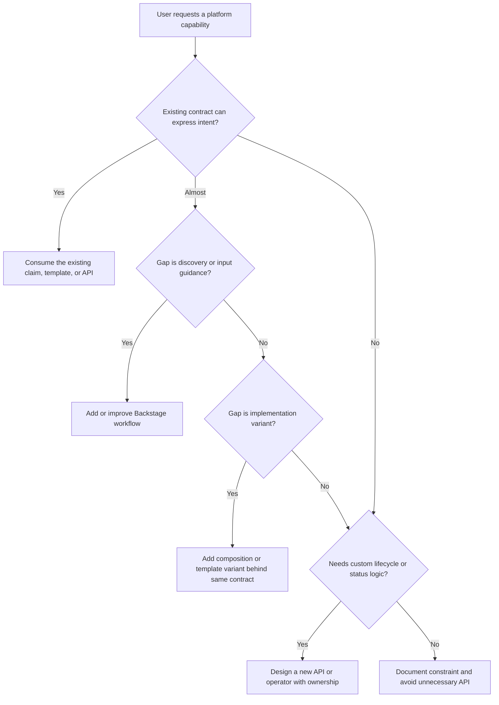

> **Напрямок CNPE** | Складність: `[СКЛАДНИЙ]` | Час на проходження: 75–90 хв
>
> **Передумови**: Стратегія та середовище іспиту CNPE, основи платформної інженерії, CRD та оператори, Backstage, Crossplane, Kubebuilder, vCluster

## Результати навчання

Після цього модуля ви зможете:

- відрізняти контракти платформних API від ресурсів реалізації, не порушуючи права власності контролерів
- оцінювати вибір інструментів самообслуговування серед Backstage, Crossplane, операторів Kubebuilder та vCluster
- діагностувати збої узгодження за допомогою полів `spec`, умов `status`, подій, RBAC та підлеглих ресурсів
- реалізувати кероване замовлення робочого простору через самообслуговування, зберігаючи безпечні значення за замовчуванням та зворотний зв'язок через `status`
- вирішувати, коли споживати наявний платформний контракт, а коли створювати новий платформний API

## Чому цей модуль важливий

Гіпотетичний сценарій: продуктовій команді потрібен тестовий робочий простір для нового сервісу до завершення спринту. Платформа вже має контракт самообслуговування, який може створити простір імен, прикріпити квоту, застосувати базову політику та прив'язати доступ команди, але інженер обходить цей контракт і вручну пише маніфести Namespace, RoleBinding, Secret, Service та Deployment. Застосунок начебто працює годину, а потім контролер прибирає некерований лейбл, перевірка політики відхиляє пізніше розгортання, і ніхто не може сказати, чи належить проблема продуктовій команді, чи платформній — адже початковий намір ніколи не був виражений через платформний API.

Питання про самообслуговування на CNPE перевіряють саме цю межу. Іспит не питає, чи можете ви видати більше YAML, ніж наступний кандидат; він питає, чи можете ви розпізнати контракт, який платформна команда призначила для споживання користувачами, працювати через цей контракт і усувати неполадки на шляху узгодження, коли задекларований намір не перетворюється на справне робоче навантаження. Хороша відповідь зазвичай змінює об'єкт найвищого рівня, який усе ще виражає бажаний результат, а потім читає `status` та події, перш ніж торкатися будь-чого згенерованого контролером.

Цей модуль перетворює платформні API на практичну модель усунення неполадок. Ви читатимете контракт на основі CRD як орієнтовану на користувача поверхню продукту, порівнюватимете шаблони порталу з замовленнями Crossplane, операторами та віртуальними кластерами і практикуватиметеся вирішувати, чи має запит споживати наявну абстракцію, чи виправдовувати створення нової. Тримайте в голові поведінку Kubernetes 1.35+ упродовж усього уроку: ті самі принципи контрольного циклу досі застосовні, але зрілі кластери дедалі більше очікують, що декларативні API, політики допуску та умови `status` нестимуть на собі операційну розмову.

## Платформні API як контракти, а не купи YAML

Платформний API — це обіцянка між людьми, яким потрібні результати, та платформою, яка ці результати створює. Користувач описує намір, API-сервер перевіряє форму цього наміру, а контролер узгоджує реальні ресурси, доки світ не збігатиметься із задекларованим контрактом. Це відрізняється від зручної обгортки навколо YAML, бо контракт також визначає право власності, значення за замовчуванням, зворотний зв'язок через `status` та безпечну межу, в якій користувачі можуть вносити зміни, не воюючи з реалізацією.

Найпростіший спосіб читати платформний API — відокремити меню від кухні. Меню — це ресурс, з якого користувач має замовляти: замовлення (claim), вхідні дані шаблону, кастомний ресурс чи форма порталу. Кухня — це реалізація за ним: простори імен, Деплойменти, Сервіси, Secret'и, політики, хмарні ресурси, згенеровані ConfigMap'и та прив'язки RBAC. Платформа може внутрішньо розкривати багато деталей реалізації, але учень спершу має запитати, який об'єкт є підтримуваною точкою входу.

```text
User Intent -> Platform Contract -> Platform Implementation

Example:
  Claim   -> Namespace + Policy + App Template -> Deployment, Service, Secret, RBAC
```

Ця ментальна модель навмисно коротка — вона є наскрізною лінією цього уроку. Намір користувача має перетікати в платформний контракт, а реалізація має узгоджуватися за контрактом, а не редагуватися як разовий артефакт. Коли контракт справний, користувач може пояснити бажаний стан простими словами, платформа може узгоджено створювати потрібні ресурси, і обидві сторони можуть подивитися на `status`, щоб вирішити, що сталося далі.

Тому перший крок на CNPE — це не `kubectl apply` проти кожного згенерованого ресурсу, який ви можете знайти. Перший крок — знайти об'єкт, якому належить орієнтований на користувача намір, а потім уважно його прочитати. У платформі на основі Crossplane це може бути замовлення, поля якого описують клас, регіон, розмір та власника-команду. В операторі Kubebuilder це може бути кастомний ресурс, чий `spec` декларує бажаний робочий простір. У Backstage це може починатися як шаблон на основі форми, який зрештою комітить або застосовує кастомний ресурс.

Зупиніться й передбачте: якщо згенерований Деплоймент має неправильну кількість реплік, що, на вашу думку, станеться, коли ви напряму пропатчите Деплоймент, тоді як кастомний ресурс-власник усе ще каже щось інше? Імовірна відповідь — наступне узгодження поверне Деплоймент назад, або пізніша перевірка дрейфу повідомить про невідповідність. Це не баг Kubernetes; це наслідок редагування кухні після замовлення з меню, і саме тому платформні API мають робити підтримувані точки зміни очевидними.

Хороші контракти зменшують кількість полів, які звичайні користувачі мусять розуміти, зберігаючи водночас достатньо контролю, щоб виразити реальні потреби. Контракт робочого простору може запитувати `team`, `environment`, `quotaClass` та `networkProfile`, замість того щоб розкривати кожен лейбл Namespace, селектор NetworkPolicy, налаштування LimitRange та суб'єкт RoleBinding. Це не приховування знань від користувачів; це переміщення повторюваної експертизи у протестований шлях контролера, щоб поширений запит був безпечним за замовчуванням, а незвичні запити отримували навмисний розгляд.

Погані контракти просочують деталі реалізації, не даючи користувачам змоги про них міркувати. Форма самообслуговування з двадцятьма погано задокументованими полями може бути гіршою за «сирий» Kubernetes, бо виглядає безпечнішою, ніж є насправді. Якщо користувач не може сказати, які поля обов'язкові, які значення за замовчуванням буде застосовано, які ресурси генеруються та де з'являється `status`, цей API ще не є поверхнею продукту. Це знімок реалізації, що носить приязне ім'я.

Сам по собі CRD теж не є цілим платформним API. CustomResourceDefinition визначає схему та сховище для виду (kind), але корисне самообслуговування потребує контролера, RBAC, поведінки допуску, документації та конвенцій `status`. Якщо замовлення існує, але ніщо його не узгоджує, API-сервер може зберігати об'єкт вічно, тоді як запитаний робочий простір так і не з'явиться. Саме тому усунення неполадок на CNPE завжди поєднує читання схеми з інспекцією контролера та `status`.

Умови (conditions) Kubernetes особливо важливі, бо вони перетворюють внутрішнє рішення контролера на читабельний для користувача сигнал. Умова на кшталт `Ready=False` з причиною `QuotaClassNotFound` набагато краща за мовчазний об'єкт, який сидить у кластері без жодних згенерованих ресурсів. Умови не ідеальні, і автори контролерів можуть писати розпливчасті повідомлення, але платформний API без корисного `status` змушує користувачів гадати, що зводить нанівець саму мету самообслуговування.

## Читання контракту на основі CRD

Коли ви отримуєте незнайомий кастомний ресурс, читайте його ззовні всередину. Почніть із виду (kind) та метаданих, бо вони повідомляють вам словник та контекст власності. Потім читайте `spec` як виклад наміру користувача, `status` як відповідь платформи, а `metadata.ownerReferences` або лейбли як підказки про згенеровані ресурси. Мета — не запам'ятати кожне поле; вона в тому, щоб визначити, які поля є безпечними вхідними даними користувача, а які — вихідними даними контролера.

Корисний контракт зазвичай має невеликий набір орієнтованих на користувача полів, які відображаються на рішення платформи. Наприклад, `team` може вибирати групу ідентифікації, `environment` — обирати силу політики, `quotaClass` — відображатися на об'єкти ResourceQuota та LimitRange, а `networkProfile` — обирати один із кількох базових шаблонів NetworkPolicy. Реалізація може бути складною, але контракт має читатися як запит, який відповідальна платформа могла б виконувати неодноразово.

```yaml
apiVersion: platform.example.com/v1alpha1
kind: TeamWorkspace
metadata:
  name: payments-dev
  namespace: platform-requests
spec:
  team: payments
  environment: dev
  quotaClass: small
  networkProfile: internal-only
  appTemplate: service-api
status:
  conditions:
    - type: Ready
      status: "False"
      reason: WaitingForNamespace
      message: Namespace payments-dev is being created
  generatedResources:
    - kind: Namespace
      name: payments-dev
```

Цей приклад навмисно скромний, але він містить патерн читання, який вам потрібен. `spec` каже, чого хоче користувач, а `status` каже, як далеко просунулася платформа. Учень має бути здатним пояснити, що запит — це робочий простір для розробки для команди payments із малою квотою, мережевим профілем «лише внутрішній» та шаблоном service API. Ніщо в цьому поясненні не вимагає відкривати вихідний код контролера.

Перш ніж запускати це, який вивід ви очікуєте від `kubectl get teamworkspace payments-dev -n platform-requests -o yaml` після того, як простір імен створено, але квоту ще не застосовано? Ви маєте очікувати той самий об'єкт з оновленим `status`, а не цілком інший орієнтований на користувача ресурс. Хороший контролер може змінити умову `Ready` на `False` з причиною на кшталт `WaitingForQuota` і може додати простір імен до списку згенерованих ресурсів, залишивши ресурси квоти в очікуванні.

Важлива відмінність полягає в тому, що `status` є описовим, а не другим місцем для декларування наміру. Користувачі не повинні редагувати `status`, щоб об'єкт виглядав справним, так само як вони не повинні змінювати медичну картку, щоб вилікувати пацієнта. У Kubernetes підресурси `status` існують для того, щоб контролери могли повідомляти спостережуваний стан окремо від бажаного. Для міркування у стилі CNPE це означає, що ви виправляєте недійсні вхідні дані `spec`, відсутні залежності або дозволи контролера, а не переписуєте табель.

Вам також варто інспектувати схему CRD, коли сам контракт неясний. Схема може розкрити дозволені значення enum, обов'язкові поля, поведінку значень за замовчуванням та правила валідації, яких приклад кастомного ресурсу не показує. Якщо `quotaClass` приймає лише `small`, `medium` та `large`, то замовлення, що використовує `experimental`, є проблемою вхідних даних користувача, а не загадкою контролера. Читання схеми — це швидкий спосіб уникнути гонитви за симптомами у згенерованих ресурсах.

```bash
kubectl get crd teamworkspaces.platform.example.com -o yaml
kubectl explain teamworkspace.spec
kubectl explain teamworkspace.status.conditions
```

Ці команди призначені для встановлення межі контракту. `kubectl get crd` показує зареєстровану поверхню API, а `kubectl explain` використовує опубліковану схему для опису полів. У реальній платформі точна назва ресурсу може відрізнятися, але діагностична послідовність лишається тією самою: інспектуйте тип, інспектуйте орієнтовані на користувача поля та інспектуйте поля `status`, які контролер записує назад.

Події доповнюють `status`, бо вони показують упорядковані за часом спостереження від контролерів, компонентів допуску та планувальника. `status` повідомляє вам поточне резюме; події часто повідомляють вам недавній шлях, що до нього призвів. Якщо замовлення робочого простору має `Ready=False`, події можуть розкрити, що простір імен було успішно створено, ResourceQuota було відхилено допуском, а RoleBinding не вдалося, бо сервісному акаунту бракувало дозволу. Ця послідовність набагато корисніша за повторне застосування того самого маніфесту.

Не плутайте виявлення згенерованих ресурсів із дозволом редагувати ці ресурси. Інспектувати підлеглі ресурси, коли на них указує `status`, доречно, бо вам потрібні докази. Патчити ці ресурси напряму ризиковано, якщо платформний контракт явно не каже, що вони керовані користувачем. Безпечніша звичка — зібрати факти зі згенерованих об'єктів, а потім повернутися до замовлення, композиції, шаблону чи конфігурації контролера, яким належить бажаний стан.

## Вибір поверхні самообслуговування

Самообслуговування не означає, що кожен користувач отримує доступ cluster-admin та купу прикладів. Воно означає, що платформа розкриває правильний рівень абстракції для завдання. Backstage, Crossplane, оператори Kubebuilder та vCluster — усі вони можуть брати участь у платформі самообслуговування, але вони розв'язують різні частини проблеми та створюють різні межі власності. Відповідь на CNPE покращується, коли ви можете описати, який рівень має обробляти запит і чому.

Backstage корисний, коли важливі виявлюваність та робочий процес розробника. Software Template може зібрати вхідні дані, згенерувати каркас репозиторію, зареєструвати компонент та запустити автоматизацію, яка створює чи оновлює платформні ресурси. Шаблон не обов'язково є джерелом істини для інфраструктури, що працює; він часто є парадними дверима, що допомагають користувачеві сформувати дійсний запит. Ставтеся до Backstage як до меню та робочого процесу замовлення, а не автоматично як до того, що узгоджує (reconciler) та підтримує справність кожного згенерованого ресурсу.

Crossplane корисний, коли платформі потрібні складені ресурси (composite resources) та замовлення, які з часом узгоджують інфраструктуру чи ресурси Kubernetes. Платформна команда може визначити `CompositeResourceDefinition (XRD)`, прив'язати його до композиції та розкрити замовлення, яке розробники споживають, не вивчаючи деталі провайдера під ним. Це потужно, бо відокремлює орієнтований на користувача контракт від рецепту реалізації, але це також означає, що усунення неполадок включає і замовлення, і складені ресурси.

> **Види API Crossplane на іспиті CNPE**
>
> Вигаданий CRD `TeamWorkspace` у цій лабораторній навчає патерну контракту; на іспиті ви також побачите реальні види Crossplane: `CompositeResourceDefinition (XRD)` = схема/контракт, `Composition` = як це реалізовано, а `Claim`/namespaced-XR = те, що подає користувач (v1 claim + cluster XR; v2 namespaced XR без окремого claim). Див. [модуль набору інструментів Crossplane](/platform/toolkits/infrastructure-networking/platforms/module-7.2-crossplane/) для повного зіставлення.

Kubebuilder та кастомні оператори корисні, коли домен має поведінку, яку не можна виразити чисто як шаблонізовані ресурси. Якщо створення робочого простору вимагає послідовності дій, зовнішніх перевірок, фіналізаторів, агрегації `status` чи постійного ремонту, контролер може закодувати ці правила. Компроміс — операційна відповідальність: щойно ви напишете контролер, ви володієте логікою узгодження, оновленнями, обробкою збоїв, RBAC, метриками та користувацьким досвідом повідомлень `status`.

vCluster корисний, коли бажаний результат самообслуговування — це ізольована площина управління Kubernetes, а не один простір імен чи каркас застосунку. Він може надавати ефемерні середовища, пісочниці для команд чи ізоляцію орендарів, поділяючи водночас базову робочу потужність. Компроміс у тому, що користувачі тепер можуть взаємодіяти з API віртуального кластера, а оператори платформи мусять міркувати про синхронізацію, обмеження ресурсів та про те, де примусово застосовується політика. Це сильний варіант для ізольованого експериментування, а не універсальна заміна платформних контрактів.

| Поверхня | Найкраще пасує | Власник контракту | Основні докази для усунення неполадок |
|---------|----------|----------------|-------------------------------|
| Шаблон Backstage | Виявлюваний робочий процес, каркас репозиторію, кероване створення запиту | Супровідники порталу та робочого процесу платформи | Вхідні дані шаблону, логи завдань, згенерований pull request чи ресурс |
| Замовлення Crossplane | Складена інфраструктура чи платформна можливість | Супровідники платформного API та композицій | `status` замовлення, `status` композита, готовність складених ресурсів |
| Оператор Kubebuilder | Кастомна доменна поведінка з постійним узгодженням | Автори контролерів та оператори платформи | `status` кастомного ресурсу, логи контролера, події, RBAC |
| vCluster | Ізоляція орендарів, пісочниці-кластери, ефемерні площини управління | Платформна команда, що запускає сервіс віртуальних кластерів | `status` віртуального кластера, справність синкера, ресурси хост-кластера |

Ця таблиця рішень важлива, бо багато неправильних варіантів відповіді на іспиті пропонують технічно можливе, але погано окреслене рішення. Ви можете написати кастомний контролер майже для будь-чого, але це не робить його правильним першим кроком. Ви можете поставити форму Backstage перед майже будь-чим, але форма без узгодження — це пускач запитів, а не довговічний платформний API. Ви можете створити віртуальний кластер для ізоляції, але це може бути надмірним для простого командного простору імен із квотою та політикою.

Який підхід ви обрали б тут і чому: команда просить такий самий простір імен, квоту та прив'язку доступу, які вже використовують п'ять інших команд, але хоче, щоб робочий процес було легше знайти? Консервативна відповідь зазвичай — спожити наявний контракт і покращити точку входу порталу, а не створювати новий CRD. Це зберігає один шлях реалізації, водночас покращуючи виявлюваність самообслуговування.

Зворотна ситуація теж трапляється в реальних платформах. Якщо багато команд раз у раз просять можливість, яка вимагає від платформних інженерів вручну зшивати кілька ресурсів разом, новий чи розширений контракт може бути виправданим. Сигнал — не сама по собі новизна; сигнал — повторюваний попит, стабільна межа політики, чіткий власник та достатньо операційної логіки, щоб централізація робочого процесу зменшувала ризик. Контракт має народжуватися з повторюваної рутинної праці, а не з цікавості.

Управління (governance) не є протилежністю самообслуговування. Найкращі платформи роблять відповідний вимогам шлях найлегшим, вбудовуючи політику в контракт. Для API робочого простору це може означати дозволені класи квот, обов'язкові лейбли власника, фіксовані мережеві профілі, відмову вхідного трафіку за замовчуванням та автоматичні RoleBinding'и зі схвалених груп ідентифікації. Користувачі все одно рухаються швидко, але роблять це всередині маршруту, який платформа може підтримувати, аудитувати та ремонтувати.

## Постачання без обходу управління

Самообслуговуване постачання починається із запиту, який платформа може перевірити. У зрілому кластері користувач має змогу подати невеликий об'єкт чи форму порталу й отримати чіткий зворотний зв'язок про те, чи платформа прийняла, відхилила чи частково виконала запит. Саме в цьому зворотному зв'язку управління стає видимим: недійсні команди відхиляються, непідтримувані класи квот дають зрозумілі помилки, а відсутні дозволи спливають як події чи умови, а не як мовчазні збої.

Сценарій вправи: вас просять створити командний робочий простір для середовища розробки. Платформна команда вже надала контракт `TeamWorkspace` із полями `team`, `environment`, `quotaClass` та `networkProfile`. Ваше завдання — не створити кожен підлеглий об'єкт вручну. Ваше завдання — виразити запит через контракт, перевірити відповідь контролера та уникати прямого редагування згенерованих ресурсів, якщо лабораторна явно не просить про дослідження.

```yaml
apiVersion: platform.example.com/v1alpha1
kind: TeamWorkspace
metadata:
  name: payments-dev
  namespace: platform-requests
spec:
  team: payments
  environment: dev
  quotaClass: small
  networkProfile: internal-only
```

Цей запит навмисно невеликий, бо платформний API має тримати поширений шлях вузьким. Контролер може перекласти `quotaClass: small` у конкретні об'єкти ResourceQuota та LimitRange, перекласти `networkProfile: internal-only` у політику й перекласти `team: payments` у прив'язки доступу. Якщо учень спокушається додати кожен згенерований лейбл, селектор та суб'єкт RoleBinding до запиту робочого простору, це ознака того, що абстракція протікає.

Застосуйте та інспектуйте запит через підтримуваний об'єкт спочатку. Команди нижче припускають, що CRD існує в лабораторному кластері; якщо його немає, використовуйте той самий патерн читання з будь-яким CRD чи шаблоном платформного напрямку, доступним у вашому середовищі. Суть — навчитися послідовності, а не залежати від цього конкретного вигаданого API.

```bash
kubectl apply -f teamworkspace.yaml
kubectl get teamworkspace payments-dev -n platform-requests -o yaml
kubectl describe teamworkspace payments-dev -n platform-requests
kubectl get events -n platform-requests --sort-by=.lastTimestamp
```

Справний шлях має показати прийняті вхідні дані, `status`, що просувається, і врешті умову готовності чи еквівалентний сигнал. Якщо контролер створює простір імен, квоту, політику та прив'язку доступу, інспектуйте їх як докази, але не сприймайте їх як основний інтерфейс. Згенеровані ресурси кажуть вам, що зробив контролер. Запит робочого простору каже вам, що платформа має продовжувати робити.

Кероване самообслуговування також залежить від RBAC. Користувачеві може бути дозволено створювати об'єкт платформного контракту в `platform-requests`, не маючи права створювати простори імен чи ролі рівня кластера напряму. Це функція, а не обмеження, яке слід обходити. Контролер платформи може тримати ширші дозволи, бо він узгоджено застосовує політику, тоді як користувачі отримують вузький дозвіл, потрібний для запиту схвалених результатів. Це утримує випадкове розширення привілеїв поза звичайним робочим процесом розробника.

```bash
kubectl auth can-i create teamworkspaces.platform.example.com -n platform-requests
kubectl auth can-i create namespaces
kubectl auth can-i create rolebindings -n payments-dev
```

Очікувана відповідь для багатьох користувачів — «так» для першої команди й «ні» для прямих команд реалізації. Цей результат показує, що платформа відокремила дозвіл на запит від дозволу на інфраструктуру. Якщо всі три команди повертають «так» для звичайних розробників, платформа може й далі працювати, але вона покладається на людську стриманість, а не на примусово застосовану межу контракту.

Політика допуску (admission policy) може додати ще один запобіжник, перш ніж контролер навіть запуститься. Правило валідації може відхилити невідомі класи квот, вимагати лейбл власника чи завадити робочим просторам у продакшені використовувати дозвільний мережевий профіль. Правило мутації може додати стандартні лейбли чи значення за замовчуванням. Допуск не замінює узгодження, бо не підтримує справність ресурсів у часі, але він не дає недійсному наміру потрапити в систему й дає користувачам швидший зворотний зв'язок.

Саме тут аналогія з рестораном, наведена раніше, досі допомагає. Хороший платформний API схожий на меню, а не на екскурсію кухнею. Замовник має замовляти результати, а платформа — займатися готуванням, сервіруванням та прибиранням. Якщо меню дозволяє кожному відвідувачеві переписувати інвентар кухні під час обіду, результат — не розширення можливостей; це провал у визначенні операційної межі.

## Діагностика збоїв узгодження

Збої узгодження стають керованими, коли ви тримаєте три питання окремими. Чи виразив користувач дійсний намір? Чи спостеріг контролер цей намір і прийняв його? Чи став кожен залежний ресурс справним? Змішування цих питань — ось що штовхає людей патчити випадкові об'єкти, перезапускати контролери без доказів чи звинувачувати RBAC, коли реальна проблема — непідтримуване значення поля.

Використовуйте ту саму послідовність щоразу, коли замовлення чи кастомний ресурс застрягає. Прочитайте кастомний ресурс, інспектуйте `status.conditions`, інспектуйте події, інспектуйте підлеглі ресурси, а потім перевірте RBAC чи правила допуску для актора, який має виконувати операцію. Ця послідовність починається з контракту й рухається вниз лише тоді, коли контракт вас туди вказує. Вона також зберігає докази для власника платформи, що важливо, коли виправлення належить композиції чи контролеру, а не запиту користувача.

```bash
kubectl get <custom-resource> -o yaml
kubectl describe <custom-resource>
kubectl get events -A --sort-by=.lastTimestamp | tail -n 15
```

Ці команди перевірки — правильна компактна відправна точка. `kubectl get` дозволяє порівняти `spec` та `status`, `kubectl describe` часто агрегує умови та недавні події, а відсортовані події розкривають недавні збої в різних просторах імен, коли об'єкт не прив'язаний до простору імен або коли згенеровані ресурси живуть деінде. У більшому кластері ви звузили б запит подій до відповідного простору імен чи задіяного об'єкта, щойно дізнаєтеся, де діє контролер.

Перша сім'я збоїв — недійсні вхідні дані. Поле може бути відсутнім, значення enum може бути непідтримуваним, посилання на секрет може не існувати, а значення середовища може порушувати політику. Недійсні вхідні дані слід виправляти в замовленні, вхідних даних шаблону чи `spec` кастомного ресурсу, бо саме там користувач виражає намір. Якщо контролер повідомляє `InvalidQuotaClass`, редагування згенерованої ResourceQuota уникає уроку й залишає наступне узгодження з тим самим поганим запитом.

Друга сім'я збоїв — заблокований контролер. Контролер може бути несправним, перебувати в циклі падінь (crash-loop), не мати RBAC, бути нездатним досягти зовнішнього API чи не спостерігати ресурс після оновлення. У цьому разі багато замовлень користувачів можуть застрягти одночасно, а їхні повідомлення `status` можуть припинити оновлюватися. Правильні докази зміщуються до справності Деплойменту контролера, логів, виборів лідера, дозволів сервісного акаунта та метрик, але ви все одно починаєте з об'єкта користувача, бо він каже вам, який шлях контролера має бути активним.

Третя сім'я збоїв — залежний ресурс, що зазнав збою після того, як контролер прийняв замовлення. Простір імен може існувати, але об'єкт політики може бути відхилено; складений ресурс може існувати, але один складений хмарний ресурс може бути недоступним; віртуальний кластер може бути створено, але його синкер може бути несправним. Саме тут інспекція підлеглих ресурсів корисна. Ви не редагуєте згенеровані об'єкти спершу; ви йдете слідом `status`, щоб знайти збійну залежність.

| Сигнал збою | Імовірний рівень | Докази для збору | Бажане місце виправлення |
|----------------|--------------|---------------------|------------------------|
| Валідація схеми відхиляє об'єкт | API-сервер чи допуск | Помилка від apply, схема CRD, повідомлення політики | Вхідні дані користувача чи документація валідації платформи |
| `Ready=False` з причиною про недійсне поле | Платформний контракт | `status` кастомного ресурсу, події | `spec` замовлення чи вхідні дані шаблону |
| Багато замовлень припиняють прогресувати | Реалізація контролера | Деплоймент контролера, логи, вибори лідера, метрики | Контролер, RBAC чи конфігурація середовища виконання |
| Один згенерований об'єкт відхиляється | Залежний ресурс | Посилання власника, події згенерованого об'єкта, вивід допуску | Композиція, шаблон чи поле замовлення, що його породило |
| Користувачу бракує дозволу на створення замовлення | Межа доступу | `kubectl auth can-i`, RoleBinding'и, зіставлення ідентифікації | RBAC для поверхні запиту |

Зверніть увагу, що бажане місце виправлення рідко є «пропатчити те, що виглядає зламаним». Контролери спроєктовані зводити керовані ресурси до бажаного стану, який вони розуміють. Якщо ви редагуєте керований ресурс поза контрактом, редагування може бути перезаписане, проігнороване чи збережене як прихований дрейф, що здивує наступне оновлення. Сильний платформний інженер ставиться до прямих патчів як до інструментів дослідження чи аварійних винятків, а потім ремонтує декларативне джерело істини.

Зупиніться й передбачте: замовлення робочого простору повідомляє `Ready=False`, бо згенерований RoleBinding заборонено для сервісного акаунта контролера. Чи має продуктова команда отримати cluster-admin, щоб створити RoleBinding вручну? Краща відповідь — ні; виправте RBAC контролера чи композицію платформи. Надання продуктовій команді широкого дозволу обходить контракт, послаблює управління і все одно залишає майбутні замовлення зламаними.

Події можуть бути шумними, тож читайте їх із контекстом. Подія планувальника про Под у стані очікування може бути наслідком проблеми з ResourceQuota. Відхилення допуску може з'явитися і на згенерованому об'єкті, і в лозі контролера. Відсутнє посилання власника може означати, що ресурс взагалі не був згенерований платформою. Уміння — не в зборі кожного можливого сигналу; воно в зборі найменшого набору доказів, що розрізняє помилку користувача, блокування контролера, збій залежного ресурсу та збій доступу.

## Рішення: будувати чи споживати

Рішення «будувати проти споживати» — це питання проєктування платформи, замасковане під лабораторне завдання. Якщо наявний платформний API може виразити бажаний результат, споживайте його. Якщо майже може, запитайте, чи закриє розрив конфігурація, документація чи шаблон порталу. Створення нового API має йти після того, як ви визначите стабільну потребу користувача, чітку межу абстракції та постійну поведінку узгодження, яку наявні контракти не можуть безпечно обробити.

Найдешевше правильне рішення часто перемагає в міркуванні CNPE. Шаблону Backstage може бути достатньо, коли бракує саме виявлюваності. Нової композиції Crossplane може бути достатньо, коли контракт існує, але потрібен новий «смак» реалізації. Новий тип замовлення може бути виправданим, коли користувачам потрібен окремий продукт із власним життєвим циклом, політикою та `status`. Кастомний оператор може бути виправданим, коли бажана поведінка включає послідовність дій, агрегацію справності, фіналізатори чи доменну логіку, яку проста композиція виразити не може.

Наявний API також несе соціальну та операційну цінність. У нього є документація, RBAC, приклади, дашборди, очікування щодо оновлень та користувачі, які вже його розуміють. Створення другого API для подібного запиту розколює цю екосистему. Безпосередній YAML може виглядати чистішим, але платформа тепер має два місця для застосування політики, дві конвенції `status` та два шляхи підтримки. Саме тому «чи має платформа вже контракт?» — не бюрократичне питання; це питання операційного ризику.

Існують реальні причини створювати новий контракт. Якщо користувачам раз у раз потрібна можливість, що має інші семантики життєвого циклу, інше право власності, інші правила відповідності чи інші режими збоїв, проштовхування її через старий контракт може бути гіршим за побудову нового. Замовлення продакшен-бази даних та ефемерний прев'ю-простір імен можуть обоє створювати ресурси Kubernetes, але їхні очікування щодо резервного копіювання, видалення, доступу та аудиту не однакові. Хороші платформні API поважають ці відмінності.

Використовуйте короткий проєктний тест, перш ніж щось додавати. Чи можете ви назвати користувача, намір, життєвий цикл, межу політики, власника, умови `status` та згенеровані ресурси? Чи можете ви пояснити, що відбувається, коли створення частково вдається, коли запитується видалення і коли зовнішня залежність зазнає збою? Якщо ці відповіді розпливчасті, API не готовий. Покращіть наявний шлях або напишіть внутрішню проєктну записку, перш ніж створювати публічний контракт.

Рішення також залежить від того, хто експлуатуватиме результат. Шаблон Backstage, що видає pull request, може супроводжувати команда досвіду розробників. Композицію Crossplane, що постачає хмарну інфраструктуру, може мати у власності команда інфраструктури платформи. Кастомний контролер може вимагати чергового супроводу від команди, якій комфортно дебажити цикли узгодження. Сервіс vCluster може включати життєвий цикл кластера, поведінку синкера, облік ресурсів хоста та примусове застосування політики. Право власності є частиною API, навіть коли воно не з'являється в YAML.

Одна корисна екзаменаційна звичка — описувати найменшу довговічну зміну. «Використати наявне замовлення робочого простору й додати шаблон Backstage, який його подає» — менша довговічна зміна, ніж «написати новий оператор для робочих просторів», коли контракт уже існує. «Додати варіант композиції за наявним замовленням» менше, ніж «створити другий вид замовлення», коли намір користувача незмінний. «Створити новий API» стає доречним, коли сам намір користувача достатньо інший, щоб старий контракт став заплутаним.

## Патерни та антипатерни

Сильні платформні API мають кілька практичних спільних патернів. Вони розкривають стабільну модель наміру, тримають деталі реалізації за межею контролера та публікують достатньо `status`, щоб користувачі могли діяти без привілейованих знань. Наведені нижче патерни — не естетичні вподобання. Це способи зменшити навантаження на підтримку, роблячи водночас самообслуговування безпечнішим та легшим для міркування під тиском.

| Патерн | Коли використовувати | Чому працює | Міркування щодо масштабування |
|---------|----------------|--------------|-----------------------|
| Споживання через замовлення (claim-first) | Користувачам потрібен повторюваний робочий простір, сервіс, база даних чи середовище | Замовлення фіксує намір, тоді як платформа володіє згенерованими ресурсами | Тримайте поля замовлення вузькими та версіонованими, щоб зміни реалізації не ламали старих користувачів |
| Парадні двері порталу | Користувачам важко виявити правильний API чи надати дійсні вхідні дані | Форма чи шаблон скеровує вхідні дані й може посилатися на документацію, власника та розгляд | Тримайте портал узгодженим із базовим контрактом, щоб він не став другим джерелом істини |
| Підтримка через `status` | Користувачам та операторам потрібен спільний огляд прогресу та збоїв | Умови, події та посилання на згенеровані ресурси зменшують здогадки | Стандартизуйте типи умов та причини між API, де можливо |
| Політика як шлях за замовчуванням | Управління має застосовуватися без ручного розгляду кожного запиту | Допуск, RBAC та значення контролера за замовчуванням роблять відповідне використання найлегшим маршрутом | Розглядайте винятки навмисно й уникайте прихованих обходів у шаблонах |

Перший антипатерн — пряме редагування згенерованих ресурсів як рутинний робочий процес. Команди потрапляють у нього, бо згенерований об'єкт видимий, а збійний симптом з'являється саме там. Краща альтернатива — знайти власника, прочитати замовлення чи композицію, що породили об'єкт, і змінити підтримуване вхідне значення чи реалізацію платформи. Прямі редагування можуть бути прийнятними під час реагування на інцидент, але вони мають ставати подальшим ремонтом контракту, а не звичкою.

Другий антипатерн — сприймати CRD як цілу платформу. CRD без робочого контролера, моделі RBAC, конвенції `status`, прикладів та відповідального за підтримку — це лише розширення сховища. Команди потрапляють у нього, бо реєстрація виду відчувається як випуск API. Краща альтернатива — визначити повний шлях користувача: хто може створювати об'єкт, які поля він задає, що його узгоджує, що означає `status` і як діагностуються збої.

Третій антипатерн — створювати новий API для кожного запиту, що відчувається трохи інакше. Команди потрапляють у нього, бо нові види можуть зробити демонстрації чистішими, але довгострокова ціна з'являється в документації, дублюванні політики, міграціях та підтримці. Краща альтернатива — розширити наявний контракт, коли намір користувача той самий, додати варіанти реалізації за ним, коли змінюється лише бекенд, і резервувати нові API для справді інших моделей життєвого циклу чи власності.

Четвертий антипатерн — ховати всі деталі збоїв за логом завдання порталу. Портал може покращити досвід, але платформа на основі Kubernetes усе одно потребує довговічного `status` на ресурсі, що представляє намір. Якщо завдання Backstage успішно подає замовлення, а замовлення згодом зазнає збою, користувач не повинен копатися в старому запуску завдання, щоб зрозуміти поточний стан. Краща альтернатива — зв'язати робочі процеси порталу з живим ресурсом і навчити користувачів, де живе `status`.

П'ятий антипатерн — надавати широкі дозволи, щоб зробити самообслуговування «легшим». Це може зменшити тертя в перший день, але прибирає здатність платформи гарантувати безпечні значення за замовчуванням та аудитувати шлях запиту. Краща альтернатива — вузький дозвіл на замовлення чи шаблони, ширший дозвіл лише для довірених контролерів та чіткі процедури «розбити скло» (break-glass) для виняткових випадків. Самообслуговування має передавати рутинну роботу контрольованому API, а не передавати продакшен-ризик кожному користувачеві.

## Рамка для ухвалення рішень

Використовуйте цю рамку щоразу, коли запит CNPE питає, як надати чи усунути неполадки самообслуговування. Почніть із визначення підтримуваного контракту, а потім оберіть найнижчий рівень, який може відповідально розв'язати проблему. Рамка навмисно консервативна, бо платформні API стають дорогими, коли множаться швидше, ніж команда здатна їх документувати, захищати та експлуатувати.



Ця блок-схема — не механічна заміна судженню, але вона запобігає поширеній надмірній реакції. Багато запитів звучать як нові API, бо користувач описує новий досвід, а не новий життєвий цикл. Якщо бажаний стан — усе ще «дайте моїй команді кероване робоче місце», кращого робочого процесу порталу може бути достатньо. Якщо бажаний стан — «дайте моїй команді ізольовану площину управління, яку можна видалити після тестового вікна», vCluster чи інший API середовища може пасувати краще, ніж розтягування замовлення простору імен.

| Питання рішення | Віддавайте перевагу наявному контракту, коли | Віддавайте перевагу новому чи розширеному API, коли |
|-------------------|-------------------------------|---------------------------------|
| Чи вже представлено намір користувача? | Поточні поля виражають результат із безпечними значеннями за замовчуванням | Користувачам потрібні інший життєвий цикл, власник чи модель політики |
| Чи проблема переважно у виявлюваності? | Шаблон порталу, оновлення документації чи приклад скерували б користувачів | Користувачам усе ще потрібна непідтримувана поведінка після покращення скерування |
| Чи реалізація змінюється за тією самою обіцянкою? | Варіант композиції чи шаблону може задовольнити запит | Сама обіцянка змінюється, і стара семантика `status` більше не пасує |
| Чи потрібне постійне узгодження? | Наявний контролер уже володіє бажаним станом | Потрібні нова послідовність дій, фіналізатори чи зовнішні перевірки справності |
| Чи може команда це експлуатувати? | Право власності та підтримка вже існують | Чіткий шлях чергування та оновлення профінансований до запуску |

Під час усунення неполадок використовуйте ту саму рамку у зворотному порядку. Якщо користувач спожив наявний контракт, а згенерований ресурс неправильний, інспектуйте замовлення та композицію, перш ніж патчити ресурс. Якщо завдання порталу зазнало збою до створення замовлення, інспектуйте вхідні дані шаблону та логи завдань. Якщо віртуальний кластер несправний, розрізняйте робоче навантаження користувача, віртуальну площину управління та компоненти синхронізації хост-кластера. Кожна поверхня має інший слід доказів, а правильний слід іде за правом власності.

Рамка також допомагає з формулюванням іспиту. Запити часто включають кілька правдоподібних інструментів, і неправильна відповідь часто та, що ігнорує поточну абстракцію. «Використати Kubebuilder, щоб створити новий контролер» може звучати технічно й справляти враження, але це не найкраща відповідь, коли замовлення Crossplane уже існує й потребує лише виправлення композиції. «Пропатчити згенерований Namespace» може бути швидким, але не поважає право власності контролера. «Прочитати `status`, події та RBAC, а потім виправити замовлення чи шлях контролера» зазвичай краще відображається на принципи платформної інженерії.

## Чи знали ви?

- CustomResourceDefinition'и Kubernetes досягли загальної доступності (GA) у Kubernetes 1.16, тому сучасні платформні API часто розглядають CRD як звичайні точки розширення кластера, а не як експериментальні додатки.
- Crossplane використовує складені ресурси та замовлення, щоб відокремити намір споживача від специфічної для провайдера реалізації, даючи платформним командам формальний спосіб публікувати API без розкриття кожного поля хмарного ресурсу.
- Software Template'и Backstage побудовані навколо визначення `template.yaml` та робочого процесу завдань, тому вони чудові для керованого створення, але все одно потребують довговічного джерела істини для постійного узгодження.
- vCluster створює віртуальні площини управління Kubernetes поверх спільних хост-кластерів, що робить його корисним для робочих процесів пісочниць та орендарів, де самої лише ізоляції простору імен недостатньо.

## Типові помилки

| Помилка | Чому вона трапляється | Як її виправити |
|---------|----------------|---------------|
| Пряме редагування згенерованих ресурсів | Згенерований Деплоймент, Сервіс, Secret, об'єкт RBAC чи політика видимі, тож це відчувається найшвидшим ремонтом, хоч ним володіє контролер | Виправте замовлення, шаблон, композицію чи вхідні дані контролера, що породили ресурс, а згенерований об'єкт використовуйте лише як доказ |
| Сприйняття CRD як цілого рішення | Реєстрація виду виглядає як випуск API, але без узгодження, дозволів, прикладів та зворотного зв'язку `status` нічого корисного не відбувається | Перевірте контролер, RBAC, шлях `status` та користувацьку документацію, перш ніж оголошувати платформний API готовим |
| Ігнорування умов | Команди зосереджуються на `spec` та згенерованих ресурсах, пропускаючи найпряміше пояснення прогресу чи збою від контролера | Прочитайте `status.conditions`, причини, повідомлення та недавні події, перш ніж змінювати ресурс |
| Перебудова платформного API з нуля | Запит звучить новим, і написати новий вид відчувається чистішим, ніж зрозуміти наявний контракт | Споживайте наявну абстракцію, коли вона виражає результат, і додавайте варіанти за нею, коли змінюється лише реалізація |
| Пропуск перевірок RBAC | Самообслуговування часто надає дозвіл запитувати результати, але не створювати базові ресурси напряму | Використовуйте `kubectl auth can-i` проти замовлення та згенерованих типів ресурсів, щоб межа доступу була явною |
| Приховування узгодження лише за порталом | Робочий процес Backstage створює початковий запит, але користувачам згодом потрібен поточний стан із живого об'єкта кластера | Зв'яжіть виходи порталу з довговічним замовленням чи кастомним ресурсом і навчіть користувачів читати `status` |
| Додавання забагато полів до контракту | Платформні команди намагаються задовольнити кожен крайній випадок, розкриваючи ручки реалізації безпосередньо користувачам | Тримайте поширені поля невеликими, надавайте задокументовані профілі та створіть явний процес винятку чи розширення для рідкісних випадків |

## Тест

<details>
<summary>Сценарій: розробник патчить кількість реплік згенерованого Деплойменту, але вона повертається назад за кілька хвилин. Як відрізнити контракт платформного API від ресурсів реалізації?</summary>

Згенерований Деплоймент, імовірно, належить контракту вищого рівня — замовленню, кастомному ресурсу, композиції чи виходу шаблону. Правильна реакція — знайти власника й інспектувати орієнтований на користувача `spec`, що декларує бажану поведінку реплік, а не повторно патчити реалізацію. Це правильно, бо контролери узгоджують згенеровані ресурси назад до стану, який вони розуміють. Патчення Деплойменту може бути корисним як тимчасовий доказ, але це неправильне довговічне виправлення, коли контракт усе ще декларує інше значення.
</details>

<details>
<summary>Сценарій: вашій команді потрібен керований робочий процес для наявного замовлення робочого простору, яке вже створює простори імен, квоту та RBAC. Як оцінити вибір інструментів самообслуговування?</summary>

Використовуйте наявне замовлення робочого простору як довговічний контракт і розгляньте Backstage як виявлювані парадні двері, що допомагають користувачам подавати дійсні вхідні дані. Crossplane чи оператор уже можуть відповідати за узгодження, тож створення другого API розкололо б право власності, не змінюючи наміру. vCluster був би доречним лише тоді, якщо команді потрібна ізольована площина управління, а не керований робочий простір на основі простору імен. Найкращий вибір — найменший рівень, що покращує досвід користувача, зберігаючи водночас наявний контракт.
</details>

<details>
<summary>Сценарій: замовлення застрягло з `Ready=False`, а події згадують заборонений RoleBinding. Як ви діагностуєте збій узгодження?</summary>

Почніть зі `spec` та `status` замовлення, а потім інспектуйте події та згенерований RoleBinding, щоб підтвердити, який сервісний акаунт намагався виконати дію. Заборонений згенерований RoleBinding зазвичай указує на RBAC контролера чи дизайн композиції, а не на потребу продуктової команди отримати широкі дозволи. Виправлення належить дозволам контролера платформи чи контракту, що породив RoleBinding. Це зберігає управління, бо користувачі утримують вузький дозвіл на запит, тоді як контролер виконує схвалену роботу з реалізації.
</details>

<details>
<summary>Сценарій: платформний запит використовує `quotaClass: experimental`, але схема CRD дозволяє лише `small`, `medium` та `large`. Що слід реалізувати чи змінити?</summary>

Це проблема недійсного наміру користувача, тож негайне виправлення — обрати підтримуваний клас квоти чи попросити власника платформи додати задокументований клас через контракт. Вам не слід патчити згенеровану ResourceQuota, щоб імітувати експериментальний клас, бо замовлення все ще містить непідтримуване значення. Якщо новий клас квоти представляє повторювану та схвалену потребу, платформна команда може реалізувати його за тим самим API. Цей підхід тримає валідацію, документацію та зворотний зв'язок `status` узгодженими.
</details>

<details>
<summary>Сценарій: кілька команд просять ізольовані площини управління Kubernetes для короткочасного тестування. Як вирішити, споживати наявний контракт чи створювати новий платформний API?</summary>

Спершу перевірте, чи платформа вже розкриває контракт віртуального кластера чи середовища, що фіксує ізольовані площини управління як підтримуваний результат. Якщо так, споживайте цей контракт і покращіть виявлюваність за потреби. Якщо наявний API робочого простору моделює лише простори імен і не може представити життєвий цикл, політику, видалення та `status` віртуальної площини управління, новий чи розширений платформний API може бути виправданим. Рішення залежить від життєвого циклу та права власності, а не від того, що обидва варіанти зрештою створюють ресурси Kubernetes.
</details>

<details>
<summary>Сценарій: завдання шаблону Backstage вдалося, але запитаний робочий простір згодом повідомляє про збійну умову в кластері. Куди підтримці дивитися далі?</summary>

Підтримка має йти за довговічним ресурсом, створеним шаблоном, — наприклад замовленням чи кастомним ресурсом, — бо цей об'єкт представляє постійний намір після завершення завдання порталу. Логи завдань Backstage пояснюють створення запиту, але не обов'язково описують пізніші збої узгодження. `status` замовлення, події та посилання на згенеровані ресурси дають поточні докази. Ця відмінність не дає порталу стати тупиковою поверхнею підтримки.
</details>

<details>
<summary>Сценарій: вас просять додати п'ять полів, що розкривають лейбли, селектори політики, деталі квоти та суб'єкти RoleBinding безпосередньо на замовленні робочого простору. Який ризик для проєктування платформи?</summary>

Ризик у тому, що контракт починає просочувати деталі реалізації й перестає захищати користувачів від низькорівневої складності політики. Деякі поля можуть бути виправданими, але розкриття кожної ручки згенерованого ресурсу робить API важчим для валідації, документування та підтримки. Кращий дизайн — пропонувати профілі, як-от класи квот та мережеві профілі, а потім дати контролеру перекладати їх у ресурси реалізації. Це тримає орієнтований на користувача намір стабільним, даючи водночас власникам платформи простір безпечно змінювати внутрішнє.
</details>

## Практична вправа

Сценарій вправи: ви побудуєте ментальну модель самообслуговування для CRD, замовлення, шаблону чи контракту віртуального середовища, що існує у вашому лабораторному кластері чи матеріалах платформного напрямку. Якщо ваш локальний кластер не надає точного зразка виду, використаного вище, оберіть інший платформний API та застосуйте той самий метод. Мета — попрактикувати читання контракту, кероване постачання та діагностику узгодження без обходу межі платформи.

Почніть із вибору однієї кандидатної платформної поверхні. Хороший кандидат має орієнтований на користувача `spec`, шлях `status` та принаймні один згенерований чи підлеглий ресурс. Якщо ви використовуєте шаблон Backstage, а не живий CRD, зіставте вхідні дані шаблону зі змінами ресурсу чи репозиторію, які він створює, а потім визначте, де записується постійний стан після завершення завдання шаблону.

- [ ] Визначте контракт платформного API та відрізніть його від принаймні двох ресурсів реалізації, які він створює чи налаштовує.
- [ ] Прочитайте схему CRD, визначення шаблону чи документацію замовлення та перелічіть орієнтовані на користувача поля `spec`, що виражають намір.
- [ ] Подайте чи інспектуйте кероване замовлення робочого простору через самообслуговування, не створюючи безпосередньо згенеровані об'єкти Namespace, квоти, політики чи RBAC.
- [ ] Діагностуйте стан узгодження, зібравши `spec`, умови `status`, події, перевірки RBAC та докази підлеглих ресурсів.
- [ ] Оцініть, чи Backstage, Crossplane, оператор Kubebuilder чи vCluster є правильною поверхнею самообслуговування для запиту.
- [ ] Вирішіть, чи має новий запит споживати наявний платформний контракт, чи виправдовувати створення нового платформного API.

### Запропоноване налаштування

Використовуйте непродакшен-кластер Kubernetes 1.35+ чи одноразовий навчальний простір імен. Якщо ваша лабораторна платформного напрямку надає зразкові CRD, використовуйте їх. Якщо ні, виконуйте частини «лише для читання» проти будь-якого встановленого кастомного ресурсу й розглядайте YAML-приклади в цьому модулі як проєктні артефакти, а не готові до кластера визначення. Не надавайте собі додаткових дозволів лише для того, щоб полегшити редагування згенерованих ресурсів; лабораторна про повагу до межі запиту.

### Завдання 1: Знайти контракт

Знайдіть об'єкт, який користувачі мають створювати чи подавати. Це може бути замовлення Crossplane, кастомний ресурс, керований оператором, вхідні дані шаблону Backstage чи запит vCluster. Напишіть одне речення, що називає намір користувача, та одне речення, що називає принаймні два ресурси реалізації за ним.

<details>
<summary>Орієнтир розв'язання</summary>

Сильна відповідь відокремлює парадні двері від згенерованих ресурсів. Наприклад: «Замовлення `TeamWorkspace` дозволяє команді запитати керований простір імен для розробки. Реалізація може створити Namespace, ResourceQuota, LimitRange, NetworkPolicy, RoleBinding та каркас застосунку.» Якщо ваша обрана поверхня — Backstage, назвіть шаблон парадними дверима, а потім назвіть довговічний ресурс чи зміни репозиторію, що тривають після завершення завдання.
</details>

### Завдання 2: Прочитати `spec` та `status`

Інспектуйте схему чи приклад маніфесту й позначте, які поля є наміром користувача, а які — зворотним зв'язком контролера. Зверніть особливу увагу на значення enum, обов'язкові поля, поля зі значеннями за замовчуванням, умови та посилання на згенеровані ресурси. Якщо `status` відсутній чи розпливчастий, занотуйте, про що повідомляв би кращий платформний API.

<details>
<summary>Орієнтир розв'язання</summary>

Намір користувача зазвичай живе в `spec`, параметрах шаблону чи формі замовлення. Зворотний зв'язок контролера зазвичай живе в `status.conditions`, подіях, логах завдань чи посиланнях на згенеровані ресурси. Не сприймайте `status` як те, що користувачі редагують. Зріла відповідь називає принаймні один тип умови, одну причину чи повідомлення та один згенерований ресурс, який можна інспектувати, не роблячи його новим джерелом істини.
</details>

### Завдання 3: Перевірити межі доступу

Перевірте, чи може передбачений користувач створити об'єкт запиту й чи може той самий користувач створювати базові ресурси напряму. Запишіть різницю. Керована платформа часто дозволяє запит і забороняє пряме створення інфраструктури, тоді як сервісний акаунт контролера тримає ширший дозвіл на реалізацію.

<details>
<summary>Орієнтир розв'язання</summary>

Використовуйте `kubectl auth can-i` для виду запиту та кількох видів згенерованих ресурсів. Якщо користувач може створювати замовлення, але не може створювати простори імен чи RoleBinding'и напряму, платформа примусово застосовує корисну межу. Якщо користувач може створювати все, запишіть ризик: самообслуговування може й далі працювати, але управління більше покладається на конвенцію, ніж на примусово застосовані дозволи.
</details>

### Завдання 4: Простежити збій узгодження

Знайдіть збійний об'єкт чи об'єкт, що просувається, якщо такий доступний. Якщо всі об'єкти справні, створіть безпечну гіпотетичну ситуацію, змінивши локальну копію маніфесту на непідтримуване значення, не застосовуючи його до спільного середовища. Поясніть, які докази визначили б недійсні вхідні дані, заблокований контролер, збій залежного ресурсу чи збій RBAC.

<details>
<summary>Орієнтир розв'язання</summary>

Для недійсних вхідних даних доказом є помилка apply, повідомлення допуску, невідповідність схемі чи причина умови, прив'язана до поля. Для заблокованого контролера шукайте багато замовлень, що застрягли разом, проблеми Деплойменту контролера, логи, вибори лідера чи RBAC сервісного акаунта. Для збою залежного ресурсу йдіть за посиланнями на згенеровані ресурси та подіями. Для RBAC порівняйте, що може робити користувач, із тим, що має робити сервісний акаунт контролера.
</details>

### Завдання 5: Ухвалити рішення «будувати чи споживати»

Напишіть коротку рекомендацію для одного нового платформного запиту. Зазначте, чи ви споживали б наявний контракт, додали б робочий процес порталу, додали б варіант реалізації, використали б vCluster чи створили б новий API. Включіть причину, власника та сигнал `status`, який, як ви очікуєте, читатимуть користувачі.

<details>
<summary>Орієнтир розв'язання</summary>

Сильна рекомендація включає найменшу довговічну зміну. Наприклад: «Спожити наявне замовлення робочого простору й додати шаблон Backstage, бо намір незмінний, а проблема — у виявлюваності.» Інша дійсна відповідь може бути: «Створити новий API віртуального середовища, бо простори імен робочих просторів не представляють життєвий цикл ізольованої площини управління чи `status` видалення.» Відповідь має завжди називати, хто експлуатує контракт і як користувачі дізнаються, чи він справний.
</details>

### Команди перевірки

Використовуйте команди нижче з реальними видом, ім'ям та простором імен із вашої лабораторної. Перший блок зберігає компактну послідовність перевірки, наведену вище; другий блок додає перевірки межі доступу, що роблять управління видимим.

```bash
kubectl get <custom-resource> -o yaml
kubectl describe <custom-resource>
kubectl get events -A --sort-by=.lastTimestamp | tail -n 15
```

```bash
kubectl auth can-i create teamworkspaces.platform.example.com -n platform-requests
kubectl auth can-i create namespaces
kubectl auth can-i create rolebindings -n payments-dev
kubectl get events -n platform-requests --sort-by=.lastTimestamp
```

### Критерії успіху

До кінця лабораторної ваші нотатки мають довести, що ви можете пояснити контракт простими словами, указати на живий чи спроєктований сигнал `status`, описати згенеровані ресурси, не відкриваючи код контролера, та порекомендувати, споживати чи створювати платформний API. Практичний стандарт простий: інший інженер має змогти прочитати ваші нотатки й дізнатися, який об'єкт редагувати, який об'єкт лише інспектувати та яка команда володіє наступним виправленням.

## Джерела

- https://kubernetes.io/docs/concepts/extend-kubernetes/api-extension/custom-resources/
- https://kubernetes.io/docs/tasks/extend-kubernetes/custom-resources/custom-resource-definitions/
- https://kubernetes.io/docs/concepts/architecture/controller/
- https://kubernetes.io/docs/reference/access-authn-authz/rbac/
- https://kubernetes.io/docs/reference/kubectl/generated/kubectl_get/
- https://kubernetes.io/docs/reference/kubectl/generated/kubectl_describe/
- https://kubernetes.io/docs/reference/kubectl/generated/kubectl_auth/kubectl_auth_can-i/
- https://docs.crossplane.io/latest/concepts/claims/
- https://docs.crossplane.io/latest/concepts/composite-resources/
- https://backstage.io/docs/features/software-templates/
- https://book.kubebuilder.io/introduction
- https://www.vcluster.com/docs/vcluster

## Наступний модуль

Продовжуйте з [CNPE: Спостережуваність, безпека та операції (лабораторна)](../module-1.4-observability-security-and-operations-lab/), де платформний контракт оцінюється за його сигналами, політиками та поведінкою реагування на інциденти.


