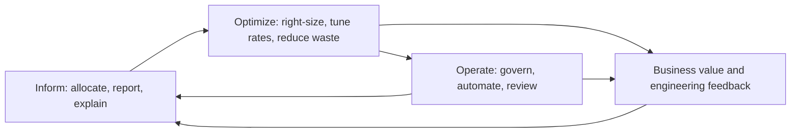
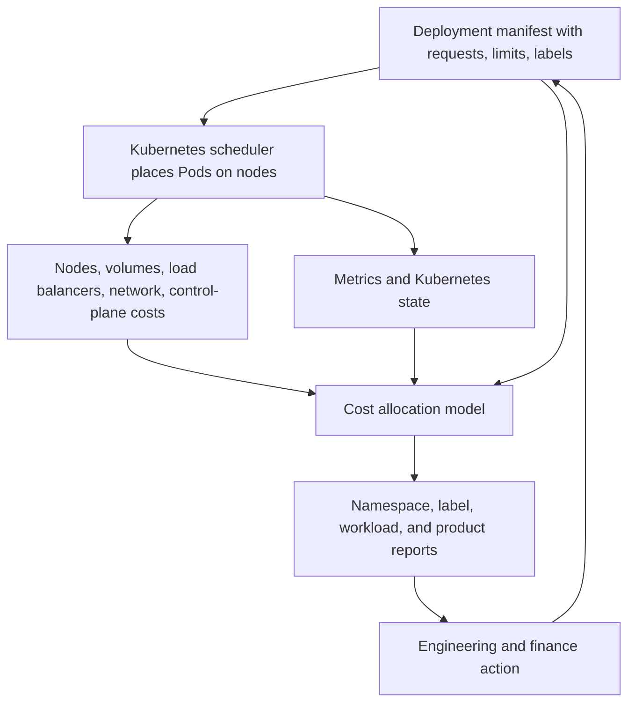

> **Сертифікаційний напрямок** | Складність: `[СЕРЕДНЯ]` | Час: 60 хвилин

## Огляд

FinOps — це операційна дисципліна, яка дає змогу інженерії, фінансам, продукту, закупівлям та керівництву ухвалювати зважені рішення щодо змінних витрат на технології. Для команд Kubernetes ця дисципліна дуже швидко набуває конкретики: кожен запит ресурсів Pod'а, простір імен, мітка, пул нод, персистентний том, балансувальник навантаження та рішення про автомасштабування можуть змінити рахунок. FinOps Foundation описує FinOps як операційну структуру та культурну практику для максимізації цінності технологій, що уможливлює своєчасні рішення на основі даних і створює фінансову відповідальність через співпрацю між інженерними, фінансовими та бізнес-командами. Цей модуль бере це офіційне визначення за відправну точку, а потім перекладає його мовою щоденних рішень, які ухвалює SRE або платформений інженер у спільному середовищі Kubernetes.

Мета не в тому, щоб перетворити інженерів на бухгалтерів чи змусити фінансові команди переглядати кожне розгортання. Мета — створити спільну систему керування, у якій вартість стає видимою достатньо рано, щоб мати значення, технічні команди можуть діяти, не чекаючи на місячні сюрпризи у виставленні рахунків, а бізнес-керівники можуть вирішувати, коли вищі витрати виправдані вищою цінністю. Kubernetes робить це одночасно важливішим і складнішим, тому що одиниця, яка створює бізнес-цінність, зазвичай є сервісом чи продуктом, тоді як одиниця, що отримує хмарний рахунок, часто є нодою, диском, мережевим інтерфейсом, керованою площиною управління або витратою на рівні акаунта.

Це фундаментальний модуль, тож він свідомо зупиняється на орієнтуванні, а не на опануванні інструментів. Ви вивчите [структуру FinOps](https://www.finops.org/framework/), модель зрілості Crawl/Walk/Run, чому хмарна економіка відрізняється від планування потужностей в локальній інфраструктурі та чому розподіл вартості в Kubernetes складніший, ніж проставлення тегів на віртуальній машині. Практичний розділ дає вам локальну лабораторію на основі kind з OpenCost, синтетичними робочими навантаженнями, порівнянням запитів і фактичного споживання та простим звітом за простором імен, який ви зможете пояснити фінансовим або продуктовим партнерам. Наступний модуль може заглибитися далі в прикладні практики, щойно ця ментальна модель буде сформована.

## Що ви зможете робити

- Пояснити офіційне визначення FinOps, життєвий цикл Inform/Optimize/Operate та модель зрілості Crawl/Walk/Run мовою, яку можуть використовувати всі учасники з боку інженерії, фінансів і продукту.
- Проаналізувати, чому вартість хмари та Kubernetes відрізняється від вартості локальної інфраструктури, пов'язавши змінне ціноутворення, спільну інфраструктуру, запити ресурсів, фактичне споживання, простори імен, мітки та невикористану потужність.
- Визначити основні персони FinOps і описати, як SRE, платформена інженерія, фінанси, продукт, закупівлі та керівництво співпрацюють, не перетворюючи керування вартістю на пошук винних.
- Виконати локальну вправу, орієнтовану на OpenCost, порівняти запитані ресурси зі спостережуваним споживанням і сформувати базовий звіт про вартість за простором імен на основі відповіді API.

## Чому цей модуль важливий

Kubernetes ховає вартість за абстракціями, які корисні для доставки, але небезпечні для відповідальності. Команда застосунку запитує `500m` CPU, планувальник розміщує Pod на ноді, автомасштабувальник кластера може додати потужність, керований сервіс Kubernetes може під'єднати диски та балансувальники навантаження, і хмарний провайдер зрештою виставляє рахунок акаунту, якому належить кластер. Без практики FinOps рахунок надходить як інфраструктурні витрати, тоді як причина лежить на кілька рівнів вище — у маніфестах розгортання, патернах релізів, належності сервісів і попиті на продукт.

Для SRE та платформених інженерів FinOps є частиною продакшн-інженерії, бо вартість — це обмеження ресурсів. Насичення CPU, тиск на пам'ять, затримка, бюджети помилок і дрейф вартості — це не однаковий сигнал, але вони впливають на ту саму архітектуру. Система може бути надійною та марнотратною, якщо кожен сервіс запитує значно більше потужності, ніж використовує. Система може бути дешевою та крихкою, якщо ліміти налаштовані без розуміння навантаження. Зріла платформена команда вчиться запитувати, чи витрачає робоче навантаження ресурси навмисно, чи відображають ці витрати цінність і чи достатньо швидкий цикл зворотного зв'язку, щоб команда-власник змінила поведінку.

Фінансові команди також потребують допомоги інженерії, бо сам по собі рахунок рідко пояснює робоче навантаження. Експорт даних про виставлення рахунків може показати, що витрати на обчислення зросли, але не завжди може показати, що розгортання подвоїло кількість реплік, змінилося значення запиту за замовчуванням, простір імен втратив мітки належності або пакетне завдання перейшло з нічного на щогодинне. Продуктові команди потребують такої самої співпраці, бо цінність продукту надає вартості контекст. Нова функція, яка збільшує вартість на десять відсотків, може бути вдалим компромісом, якщо подвоює конверсію, але те саме збільшення може бути марнуванням, якщо походить від середовищ розробки, що простоюють.

Структура FinOps Foundation корисна, бо вона запобігає згортанню розмов про вартість у єдине гасло на кшталт «скоротити витрати». Структура каже інформувати команди своєчасними даними, оптимізувати споживання та тарифи там, де це підтримує цінність, і діяти за допомогою політик, автоматизації та відповідальності. Це важливо в Kubernetes, бо той самий кластер може розміщувати сервіси, що приносять дохід, експерименти, спільні платформені компоненти, навантаження для відповідності вимогам і покинуті тестові Pod'и. Ставлення до всіх них як до рівноцінних рядків рахунка призводить до поганих рішень.

## Чи знали ви?

- Чинне визначення FinOps Foundation подає FinOps як операційну структуру та культурну практику для максимізації цінності технологій, а не просто як програму скорочення витрат.
- Офіційний життєвий цикл FinOps є ітеративним: Inform, Optimize та Operate — це фази, до яких команди постійно повертаються в міру зміни використання технологій, ціноутворення та бізнес-пріоритетів.
- OpenCost — це проєкт CNCF, який надає дані про розподіл вартості Kubernetes за такими вимірами, як простір імен, контролер, Pod, контейнер, мітки та кластер.
- Запити ресурсів у Kubernetes — це сигнали планування та розподілу, тоді як фактичне споживання — це спостережуваний сигнал часу виконання; плутання цих двох понять є одним із найшвидших способів неправильно прочитати витрати Kubernetes.

## Що таке FinOps

Визначення [FinOps Foundation](https://www.finops.org/) навмисно є міжфункціональним. FinOps — це не продукт-дашборд, не суто фінансовий процес звітності й не щоквартальне прибирання. Це операційна модель для ухвалення рішень про витрати на технології з достатньою кількістю даних, належністю та бізнес-контекстом, щоб обирати мудро. У чинній структурі визначення є також ширшим, ніж лише публічна хмара, бо та сама дисципліна дедалі більше застосовується до SaaS, ліцензій, платформ даних, систем ШІ, приватної хмари та витрат на центри обробки даних. У цьому напрямку Kubernetes ми зосереджуємося на контейнеризованій інфраструктурі, але патерн співпраці той самий.

Слово поєднує фінанси та операції, але практика ближча до DevOps, ніж до традиційного обліку. DevOps змінив, хто може розгортати й експлуатувати програмне забезпечення; FinOps змінює, хто може бачити витрати й діяти на їхній основі. Хмарний рахунок, яким керують лише фінанси, надходить запізно й позбавлений контексту робочого навантаження. Дашборд вартості, яким керує лише інженерія, може оптимізувати технічну ефективність, проминаючи реалії маржі, прогнозу, закупівель і ціноутворення продукту. FinOps працює, коли команди мають спільний словник і використовують ті самі факти, щоб ухвалювати компроміси між вартістю, швидкістю, якістю, надійністю та цінністю.

Найважливіша зміна мислення полягає в тому, що нижча вартість не завжди краща. Платформена команда може навмисно витрачати більше на резервування в кількох зонах, керовані бази даних, спостережуваність або швидшу інфраструктуру збирання, бо бізнес-цінність це виправдовує. Питання FinOps не «Як зробити число меншим?», а «Яку цінність створили ці витрати, хто за них відповідає, наскільки вони передбачувані та що б ми змінили, якби співвідношення вартості до цінності було поганим?». Це питання особливо доречне для Kubernetes, бо рішення про вартість вбудовані в маніфести, автомасштабувальники, класи сховища, пули нод і робочі процеси релізів.

Kubernetes також показує, чому фінансову відповідальність потрібно закладати в платформу як проєктне рішення. Простір імен може бути межею команди, межею середовища, межею продукту або тимчасовим робочим простором. Мітки можуть ідентифікувати власників, застосунки, компоненти, середовища та центри витрат, але Kubernetes не нав'язує бізнес-таксономію. Платформена команда, яка прагне надійного розподілу, мусить надати стандарти, політики допуску, шаблони, звіти та цикли виправлення, щоб метадані вартості пережили реальний тиск доставки. FinOps дає цим платформеним засобам контролю причину, що виходить за межі охайності: вони роблять цінність технологій вимірюваною.

## Принципи FinOps для інженерних команд

FinOps Foundation наводить шість принципів, які слугують дороговказом для практики: команди співпрацюють; бізнес-цінність керує технологічними рішеннями; кожен бере на себе відповідальність за використання технологій; дані FinOps доступні, своєчасні та точні; FinOps забезпечується централізовано; і команди користуються перевагами моделі змінної вартості хмари. Це закріплено у [принципах FinOps](https://www.finops.org/framework/principles/). Формулювання еволюціонувало разом зі структурою, але інженерний висновок стабільний: рішення про вартість не виштовхуються у віддалену фінансову чергу, а інженерні команди не залишаються наодинці з потребою вгадувати бізнес-пріоритети за рахунком.

Для команд Kubernetes співпраця означає, що платформений інженер може пояснити різницю між запитами та фактичним споживанням, фінанси можуть пояснити, чому амортизована вартість зобов'язань відрізняється від прейскурантної ціни on-demand, а продукт може пояснити, чи варто масштабувати сервіс. Належність означає, що команда, яка розгортає робоче навантаження, бачить його вартість на рівні простору імен або міток і має повноваження її покращити. Централізоване забезпечення означає, що платформена чи FinOps-функція постачає узгоджені дані про розподіл, конвенції звітності, підтримку оптимізації тарифів і запобіжники, тоді як команди сервісів ухвалюють багато локальних рішень.

Принцип про доступні, своєчасні та точні дані — це те, де платформи Kubernetes часто мають труднощі. Експорти хмарних рахунків можуть запізнюватися, а об'єкти Kubernetes недовговічні. Pod може працювати вісім хвилин, обробити сплеск роботи та зникнути ще до того, як з'явиться місячний звіт. OpenCost та споріднені інструменти вирішують це, поєднуючи стан Kubernetes, метрики ресурсів, дані ціноутворення та правила розподілу близько до кластера. Навіть коли числа є оцінками, вони створюють швидший цикл зворотного зв'язку, ніж очікування на рахунок.

Користування перевагами моделі змінної вартості теж виглядає в Kubernetes інакше, ніж в інвентарі віртуальних машин. Ви можете правильно встановлювати розмір запитів, використовувати горизонтальне автомасштабування, планувати непродакшн-простори імен, обирати форми нод, що відповідають профілям навантаження, використовувати ноди Spot або preemptible для толерантних до переривання навантажень і ділити базову потужність між тенантами. Ці вибори потребують перегляду надійності. FinOps не каже «використовуйте найдешевшу ноду»; він каже «зробіть компроміс видимим, навмисним і таким, що має власника».

## Життєвий цикл FinOps

Офіційний життєвий цикл має три фази: Inform, Optimize та Operate. Ці фази не є водоспадом. Команди проходять через них повторно, бо робочі навантаження, трафік, ціноутворення, зобов'язання та бізнес-пріоритети постійно змінюються. У Kubernetes цикл може виконуватися з різною швидкістю для різних команд. Платформена команда може оновлювати звіти про розподіл щодня, команда застосунку може переглядати правильність розмірів щотижня, а фінанси можуть оновлювати прогнози щомісяця. Спільний життєвий цикл тримає ці ритми пов'язаними. Цей потік описано в [життєвому циклі FinOps](https://www.finops.org/framework/phases/).



Inform відповідає на питання: «Куди йдуть наші гроші та хто може на це вплинути?». У середовищі Kubernetes Inform включає зіставлення вартості нод, дисків, балансувальників навантаження, мережі, площини управління та спільних платформених компонентів із просторами імен, мітками, контролерами та командами. Він також включає відрізнення розподіленої вартості від вартості простою, бо простір імен, що видається дешевим, може працювати всередині дорогого недозавантаженого кластера. Inform є успішним, коли власник сервісу може поглянути на звіт і впізнати робоче навантаження, власника, середовище та ймовірний драйвер вартості.

Optimize відповідає на питання: «Що нам слід змінити та на яку цінність чи ризик впливає ця зміна?». Оптимізація в Kubernetes часто починається із запитів, лімітів, кількості реплік, вибору нод, класів сховища та розкладів середовищ. Вона також може включати знижки за зобов'язання, потужність Spot, налаштування автомасштабувальника, покращення образів і запуску та усунення осиротілих ресурсів. Оптимізація зазнає невдачі, коли команди наосліп зменшують запити чи ліміти, не спостерігаючи за затримкою, тротлінгом, поведінкою пам'яті та вимогами до доступності. SRE, обізнаний з FinOps, ставиться до оптимізації як до контрольованої інженерної зміни.

Operate відповідає на питання: «Як зробити хорошу поведінку повторюваною?». У Kubernetes Operate включає політику міток, онбординг просторів імен, сповіщення про бюджет, перевірки pull-request для змін ресурсів, дашборди вартості, виявлення аномалій, обробку винятків і ритуали перегляду. Він також включає автоматизацію, як-от запити за замовчуванням, LimitRanges, ResourceQuotas, заплановані вимкнення та робочі процеси правильного встановлення розмірів навантажень. Operate — це місце, де FinOps стає частиною платформи, а не героїчним проєктом прибирання.

Цикл важливий, бо кожна фаза залежить від попередньої, але також може виявити в ній дефекти. Перегляд оптимізації може показати, що модель розподілу приховує спільну вартість ingress. Перегляд керування може показати, що команди обходять мітки під час створення аварійних ресурсів. Фінансовий прогноз може показати, що інженерії потрібні детальніші продуктові метрики. Правильною відповіддю є покращення системи, а не звинувачення останньої людини, яка торкалася маніфесту.

## Карта структури FinOps: фази, домени, можливості

Кандидати часто плутають фази життєвого циклу з доменами структури, але вони відповідають на різні
питання. Тримати їх окремо варто заради легких екзаменаційних балів.

- **Фази** (Inform → Optimize → Operate) — це *ітеративні режими роботи*, тобто де ви зараз перебуваєте в циклі.
- **Домени** — це *бізнес-результати* практики FinOps, і вони виконуються паралельно, а не як
  послідовні кроки. Чотири домени — це **Understand Usage & Cost**, **Quantify Business Value**,
  **Optimize Usage & Cost** та **Manage the FinOps Practice**.
- **Можливості** — це *функціональні активності* всередині кожного домену. Наприклад, Understand Usage &
  Cost включає Data Ingestion, Allocation, Reporting & Analytics та Anomaly Management. (Цей модуль
  називає домени; можливості відпрацьовуються в [Модулі 1.2](module-1.2-finops-practice/).)
- **Сфери (Scopes)** — це технологічні області, до яких застосовується структура: Cloud, SaaS, Datacenter та інші.

В один рядок: фази — це *коли*, домени — це *які результати*, можливості — це *як*, а сфери —
*де*. Джерела: [FinOps Framework — Domains](https://www.finops.org/framework/domains/),
[Capabilities](https://www.finops.org/framework/capabilities/),
[Scopes](https://www.finops.org/framework/scopes/).

## Модель зрілості FinOps

Модель зрілості FinOps Foundation використовує Crawl, Walk і Run, щоб описати, наскільки розвиненою є певна можливість у конкретній організації. Модель — це не сходи відзнак, де кожна команда має досягти Run для кожної можливості. Це практичний спосіб почати з малого, виміряти цінність і дорощувати зрілість там, де бізнес-потреби виправдовують зусилля. Цей нюанс важливий для команд Kubernetes, бо стартапу з одним кластером не потрібен такий самий механізм розподілу, як підприємству із сотнями кластерів у різних хмарах, і він узгоджений з [моделлю зрілості](https://www.finops.org/framework/maturity-model/).

На рівні зрілості Crawl організація має базову видимість і невелику кількість повторюваних звичок. Для Kubernetes Crawl може означати, що кожен простір імен має мітку власника, платформена команда може згенерувати приблизну місячну вартість за простором імен, а очевидне марнування на кшталт покинутих просторів імен розробки переглядається. Дані можуть бути неповними, а процес — ручним, але команди нарешті можуть обговорювати вартість, використовуючи назви робочих навантажень, а не один рахунок на рівні акаунта.

На рівні зрілості Walk організація має узгодженіший розподіл і повторювану оптимізацію. Зрілість Walk у Kubernetes може включати стандартні мітки в шаблонах, OpenCost або керований еквівалент у кожному кластері, звіти, розбиті за простором імен і продуктом, регулярний перегляд співвідношень запиту до споживання та задокументований процес для спільних витрат кластера. Команди починають порівнювати вартість із метриками цінності, як-от обслужені запити, підтримані клієнти або вироблені хвилини збирання. Фінанси можуть прогнозувати з кращими вхідними даними, бо інженерія може пояснити драйвери за змінами.

На рівні зрілості Run усвідомлення вартості інтегроване в інженерні робочі процеси та політику. Зрілість Run у Kubernetes може включати засоби контролю допуску, що вимагають метаданих належності, автоматизовані рекомендації з правильного встановлення розмірів з інженерним переглядом, бюджети просторів імен, сповіщення про аномалії, chargeback (пряме віднесення витрат до бюджету команди-власника) або showback (видимість вартості, що повідомляється командам без перенесення бюджету) та дашборди юніт-економіки, які пов'язують витрати платформи з продуктовими результатами. Автоматизація є кращою там, де вона надійна, але зрілі команди все одно залишають людину в циклі для компромісів, що впливають на надійність, безпеку чи клієнтський досвід.

Модель зрілості також корисна для уникнення надмірної інженерії. Команда на рівні Crawl не повинна витрачати місяці на побудову ідеальної моделі розподілу, перш ніж матиме базове покриття належності. Команда на рівні Walk не повинна автоматизувати правильне встановлення розмірів, доки не зможе пояснити, що рекомендація означає для затримки та ризику пам'яті. Команда на рівні Run не повинна вважати, що одна успішна політика кластера застосовна до кожного класу робочих навантажень. Зрілість FinOps має цінність лише тоді, коли вона покращує рішення.

## Чим хмарна вартість відрізняється від вартості локальної інфраструктури

Локальна інфраструктура має реальні змінні витрати, але багато команд сприймають її як фіксовану потужність. Сервери купуються, амортизуються, монтуються в стійки, живляться, охолоджуються та оновлюються довгими циклами. Маржинальна вартість того, що розробник розгортає ще один тестовий сервіс, може бути невидимою, якщо вільна потужність уже існує. Хмара змінює цей цикл зворотного зв'язку, бо кожна година обчислень, гігабайт сховища, балансувальник навантаження, керований сервіс, передавання мережею та опція підтримки можуть з'явитися в рахунку з набагато більшою деталізацією та набагато меншим тертям закупівель.

Перша відмінність — змінні витрати. Кластер Kubernetes у хмарному акаунті може зростати, коли автомасштабувальник кластера додає ноди, коли збільшується кількість реплік або коли робоче навантаження переходить до більшого пулу нод. Ця еластичність цінна, бо командам не потрібно купувати обладнання за місяці до появи попиту, але це також означає, що вартість може швидко дрейфувати. У локальних середовищах вичерпання потужності є видимим обмеженням. У хмарі обмеженням може бути бюджет, і попередження може надійти вже після того, як витрати відбулися.

Друга відмінність — деталізація. Хмарні провайдери можуть виставляти рахунки за секунду, годину, запит, байт, операцію чи виділену одиницю залежно від сервісу. Kubernetes додає ще один рівень, бо рядок рахунка може посилатися на ноду чи диск, тоді як бізнес хоче зрозуміти простір імен, застосунок чи продукт. Деталізація — це можливість, бо команди можуть вимірювати юніт-економіку, але це також проблема моделювання, бо кожне правило розподілу робить припущення щодо спільної інфраструктури.

Третя відмінність — децентралізація. У багатьох хмарних середовищах інженери можуть створювати витрати через інфраструктуру як код, конвеєри розгортання чи маніфести Kubernetes без замовлення на закупівлю. Це добре для швидкості доставки, але це означає, що відповідальність має наблизитися до рішення. FinOps — це практика, яка дає змогу фінансам зберігати передбачуваність, тоді як інженерія зберігає автономність. Спільна мета не в тому, щоб знову запровадити повільні погодження; вона в тому, щоб надати швидкий зворотний зв'язок і запобіжники.

Четверта відмінність — стратегія зобов'язань. У центрі обробки даних зобов'язання щодо потужності є фізичними та довговічними. У хмарі команди можуть змішувати on-demand, reserved, savings-plan, committed-use, Spot, preemptible та ціноутворення керованих сервісів. Kubernetes ускладнює ці вибори, бо зобов'язання щодо ноди може підтримувати багатьох тенантів, а робоче навантаження може переміщатися між пулами нод. Хороша практика FinOps відокремлює оптимізацію споживання, яка зменшує марнування, від оптимізації тарифів, яка купує правильну модель ціноутворення для споживання, що, як очікується, зберігатиметься.

## Потік розподілу вартості Kubernetes

Розподіл вартості Kubernetes починається із сигналів ресурсів і завершується звітом, на основі якого люди можуть діяти. Планувальник бачить запити, розміщує Pod'и на нодах, і кластер споживає активи, як-от CPU, пам'ять, сховище, мережу та балансувальники навантаження. Інструмент розподілу вартості спостерігає за об'єктами та метриками Kubernetes, застосовує правила ціноутворення й розподілу між тенантами, агрегує за такими вимірами, як простір імен чи мітка, і подає вартість назад власникам. Кожен крок може втратити точність, якщо метаданих бракує, метрики недоступні або зі спільними витратами поводяться недбало.



Запити є центральними, бо вони представляють потужність, зарезервовану для планування. [Документація з керування ресурсами](https://kubernetes.io/docs/concepts/configuration/manage-resources-containers/) Kubernetes пояснює, що планувальник використовує запити, щоб вирішити, де Pod може працювати, тоді як ліміти забезпечуються kubelet'ом для обмеження використання ресурсів. Ця відмінність важлива для розподілу вартості, бо багато моделей розподілу нараховують CPU та пам'ять на основі більшого зі значень — запитаного чи використаного. Якщо команда запитує один CPU й використовує п'ятдесят міллікорів, вона може зарезервувати потужність, що перешкоджає щільнішому пакуванню, навіть якщо фактичне споживання низьке.

Простори імен є поширеною межею розподілу, бо вони видимі, легкі для запитів і часто відображаються на команди чи середовища. Вони не є повною бізнес-моделлю. Один продукт може охоплювати багато просторів імен, а один простір імен може розміщувати багато сервісів. Мітки додають відсутні виміри, але лише якщо вони застосовуються узгоджено. [Рекомендовані мітки](https://kubernetes.io/docs/concepts/overview/working-with-objects/common-labels/) Kubernetes та [настанови щодо квот ресурсів](https://kubernetes.io/docs/concepts/policy/resource-quotas/) можуть допомогти інструментам пов'язати ресурси в подання застосунків, тоді як мітки, специфічні для організації, можуть фіксувати команду, центр витрат, середовище та продукт.

Спільні витрати — це місце, де спрощені звіти стають оманливими. Простір імен `kube-system`, контролери ingress, агенти спостережуваності, сервісні сітки, DNS, невикористана потужність нод та плати за керовану площину управління можуть приносити користь багатьом тенантам. Якщо звіт ігнорує спільні витрати, команди застосунків занижують свою повну вартість. Якщо звіт розподіляє спільні витрати рівномірно, малі навантаження можуть субсидувати великі. Якщо звіт розподіляє спільні витрати пропорційно, дорогі навантаження несуть більшу частину накладних витрат. FinOps вимагає згоди щодо правила та прозорості щодо того, що це правило означає.

Вартість простою особливо важлива в Kubernetes, бо ноди купуються чи орендуються з деталізацією на рівні ноди, тоді як Pod'и споживають лише частину ноди. Кластер може виглядати ефективним з погляду застосунку, водночас несучи невикористану потужність нод. Частина простою є навмисною, бо вона поглинає сплески, захищає доступність або забезпечує запас для планування. Завдання FinOps — відрізнити навмисний простій від випадкового та зробити власника цього компромісу явним.

### Виклик хмари в Kubernetes

Поширена пастка — припускати, що один сервіс акуратно відображається на один рядок рахунка. У багатотенантних кластерах Kubernetes один пул нод, спільний контролер ingress, площина управління чи стек спостережуваності часто обслуговують багато команд. У результаті вартість на один сервіс може бути затьмареною без явної політики спільних витрат. Це основний виклик, описаний у співпраці CNCF та FinOps щодо керування вартістю Kubernetes і у [звіті CNCF FinOps for Kubernetes](https://www.cncf.io/wp-content/uploads/2021/06/FINOPS_Kubernetes_Report.pdf).

На практиці простір імен зазвичай є першою межею розподілу, бо він видимий і легкий для запитів, але самого простору імен недостатньо для звітів, яким можна довіряти. Командам все одно потрібні узгоджене іменування та належність, стандартизовані мітки й надійні `requests` та `limits` на контейнерах, щоб інструменти розподілу могли пов'язати об'єкти Kubernetes із людьми, які можуть діяти на основі чисел. Щойно ці метадані на місці, модель вартості зазвичай складає три рівні: **витрати на рівні нод** для витрат на інстанси та площину управління, виміряних з деталізацією ноди чи пулу, **витрати на рівні Pod'ів** для розподілу навантаження між просторами імен і контролерами та **витрати на рівні контейнерів**, коли змішана поведінка всередині Pod'а вимагає тоншого розщеплення для showback чи chargeback.

`kubectl top` все ще корисний для виявлення поточного навантаження, але він не може відповісти на питання «скільки коштував Сервіс X минулого тижня?», бо повідомляє про споживання в певний момент часу, не застосовуючи цінових моделей, правил спільних витрат чи історичних вікон агрегації. Для цього використовуйте звіти про розподіл.

Наступний модуль, [Модуль 1.2: FinOps на практиці](../module-1.2-finops-practice/), усуває цю прогалину, порівнюючи підходи OpenCost і Kubecost у глибших сценаріях.

## Запити, ліміти та марнування

Запит — це не прогноз, а ліміт — це не бюджет. Запит CPU повідомляє Kubernetes, скільки потужності CPU зарезервувати для планування та якості обслуговування. Запит пам'яті надає сигнал планування та впливає на поведінку витіснення. Ліміт CPU обмежує час CPU та може спричинити тротлінг. Ліміт пам'яті може завершити контейнер, який його перевищує. Ці засоби контролю передусім є засобами контролю надійності, але вони також формують вартість, бо впливають на щільність пакування, поведінку автомасштабування та звіти про розподіл.

Поширена невдача FinOps — ставлення до запитів як до нешкідливих значень за замовчуванням. Платформені команди іноді встановлюють щедрі значення за замовчуванням, щоб робочі навантаження мали менше шансів зазнати збою під час онбордингу. З часом ці значення за замовчуванням стають прихованими резервуваннями. Якщо кожен малий сервіс запитує пів CPU й використовує двадцять міллікорів, планувальнику може знадобитися набагато більше нод, ніж потребує фактичний попит. Тоді рахунок відображає політику платформи, а не справжнє споживання продукту. Виправлення не в тому, щоб прибрати запити; виправлення — встановлювати їх на основі доказів і переглядати в міру зміни робочих навантажень.

Ліміти потребують подібної обережності. Низький ліміт CPU може зробити робоче навантаження дешевшим на папері, водночас додаючи затримку чи тротлінг під час сплесків. Ліміт пам'яті може захистити ноду від некерованого виділення, але також може створити цикли перезапусків, якщо застосунок має передбачувані сплески. Тому розмови FinOps мають включати SLO, бюджети помилок і профілі застосунків. Рекомендація, яка економить гроші, але порушує мету сервісу, не є оптимізацією. Рекомендація, яка покращує щільність, не шкодячи поведінці сервісу, нею є.

Найчистіша ментальна модель — порівнювати запитану, використану та розподілену вартість поруч. Запитані CPU та пам'ять показують, що планувальник мусить зарезервувати. Спостережуване споживання з Metrics Server чи Prometheus показує, що робоче навантаження фактично споживає з часом. Розподілена вартість показує, як модель вартості перетворює ці сигнали на гроші. Коли ці три не збігаються, незбіг є можливістю для навчання. Команді може знадобитися правильно встановити розмір, змінити автомасштабування, розділити навантаження, використати інший тип ноди або прийняти вартість як буфер надійності.

## Персони та співпраця

FinOps працює, бо різні персони приносять різні факти. Практик FinOps з'єднує фінанси та інженерію, підтримує структуру й допомагає командам ухвалювати рішення на основі доказів. Інженерія проєктує, будує та експлуатує системи, що споживають ресурси. Фінанси забезпечують бюджет, прогноз, облік і дисципліну звітності. Продукт пов'язує вартість технологій із клієнтською цінністю та маржею. Закупівлі керують відносинами з постачальниками, зобов'язаннями та механікою знижок. Керівництво встановлює пріоритети та спонсорує модель відповідальності.

У Kubernetes команда платформеної інженерії часто стає практичним містком між теорією FinOps і реальністю робочих навантажень. Платформені інженери володіють онбордингом просторів імен, шаблонами кластерів, мітками, політиками допуску, пулами нод та інтеграціями спостережуваності. Вони можуть зробити дані про вартість доступними там, де інженери вже працюють, як-от дашборди, pull-request'и, каталоги сервісів та розбори інцидентів. Вони також можуть запобігти тому, щоб робота з вартістю стала каральною, пояснюючи технічні причини за очевидним марнуванням.

Фінанси потребують цього перекладу, бо розподіл у Kubernetes — це модель, а не прямий рахунок. Якщо фінанси просять chargeback за продуктом, інженерія мусить пояснити, які витрати можна віднести безпосередньо, які витрати є спільними та які оцінки залежать від роздільності метрик чи конфігурації ціноутворення. Продукт потребує тієї самої прозорості, бо юніт-економіка вимагає і чисельника, і знаменника. Метрика вартості на транзакцію корисна лише тоді, коли кількість транзакцій і розподіл вартості відображаються на ту саму межу продукту.

Хороша співпраця має каденцію. Команда сервісу може переглядати дрейф запиту до споживання щоспринту. Платформена команда може переглядати вартість простою кластера та спільні сервіси щомісяця. Фінанси можуть переглядати відхилення прогнозу з інженерними лідерами. Продукт може переглядати юніт-вартість перед запуском. Важливо те, що кожна зустріч використовує ті самі джерельні дані й має чіткий шлях дій. Дашборд без власників створює спостереження. Звіт із власниками, порогами та подальшими діями створює практику FinOps.

## Ландшафт інструментів

OpenCost — це відкрита відправна точка для розподілу вартості Kubernetes. Проєкт надає специфікацію та реалізацію для вимірювання й розподілу інфраструктурних і контейнерних витрат у середовищах Kubernetes. Він може звітувати за простором імен, Pod'ом, контролером, міткою, анотацією, контейнером, нодою та кластером. У локальній лабораторії OpenCost може використовувати прейскурантне чи власне ціноутворення, щоб навчати механіки. У продакшні команди зазвичай інтегрують дані про виставлення рахунків провайдера чи погоджені тарифи, щоб звіти точніше відповідали очікуванням фінансів. Зверніться до [документації OpenCost](https://opencost.io/docs/) та [специфікації](https://opencost.io/docs/specification).

Kubecost будується на тій самій лінії розподілу вартості та додає комерційні функції навколо звітності, рекомендацій, керування, сповіщень, федерації та корпоративних робочих процесів. Для цього модуля вам потрібно лише знати про відмінність: OpenCost дає вам вендоронезалежний відкритий сигнал вартості, тоді як Kubecost пакує ширший продуктовий досвід навколо цього сигналу. Правильний вибір інструмента залежить від масштабу, потреб у підтримці, звітності для багатьох кластерів, узгодження виставлення рахунків і вимог до керування. Апстрим-проєкт відстежується за адресою [github.com/opencost/opencost](https://github.com/opencost/opencost).

Нативні інструменти хмарних провайдерів також є частиною ландшафту. AWS підтримує дані розщепленого розподілу вартості для Amazon EKS, які можуть надавати видимість на рівні Pod'а у звітах Cost and Usage Reports і агрегувати за примітивами Kubernetes, як-от простір імен і кластер, за допомогою [AWS Cost Explorer](https://docs.aws.amazon.com/aws-cost-management/latest/userguide/ce-what-is.html) та [AWS CE API](https://docs.aws.amazon.com/cost-management/latest/userguide/ce-api.html). Розподіл вартості Google Kubernetes Engine може розкривати виміри кластера, простору імен і мітки в Cloud Billing через [розподіли вартості GKE](https://cloud.google.com/kubernetes-engine/docs/how-to/cost-allocations). Microsoft Cost Management має подання вартості Kubernetes для AKS через [Azure Cost Management and Billing](https://learn.microsoft.com/en-us/azure/cost-management-billing/) та [подання вартості Kubernetes в Azure](https://learn.microsoft.com/en-us/azure/cost-management-billing/costs/view-kubernetes-costs), із ширшим контекстом в [огляді керування вартістю Azure](https://learn.microsoft.com/en-us/azure/cost-management-billing/costs/overview-cost-management). Ці нативні функції цінні, бо вони пов'язують розподіл Kubernetes із системами виставлення рахунків провайдера, але їхнє покриття, свіжість і виміри різняться.

Загальні провідники вартості, як-от AWS Cost Explorer, звіти Google Cloud Billing та Azure Cost Management, все ще потрібні, бо не кожна витрата народжується всередині Kubernetes. Контейнерні платформи залежать від реєстрів, об'єктного сховища, баз даних, черг, CDN, систем спостережуваності, інструментів безпеки та планів підтримки. Тому практика FinOps для Kubernetes має уникати тунельного зору на інструменти. Використовуйте інструменти, обізнані з кластером, для розподілу навантажень, інструменти провайдера для істини виставлення рахунків і зобов'язань та продуктові метрики для цінності.

## Від даних про вартість до інженерних рішень

Корисний звіт про вартість має чіткого власника, чітке часове вікно, чіткий метод розподілу та наступну дію. «Простір імен `payments-prod` витратив 450 доларів минулого тижня» — це початок, але це ще не інженерне рішення. Команді потрібно знати, чи вартість змінилася, чи зміна походить від CPU, пам'яті, сховища, мережі чи спільних накладних витрат, чи вона слідувала за трафіком або активністю релізів і чи вартість на корисну одиницю покращилася чи погіршилася.

Юніт-економіка пов'язує вартість із цінністю. Для API, орієнтованого на користувача, корисною одиницею може бути вартість на тисячу успішних запитів. Для конвеєра даних — вартість на оброблений терабайт. Для CI-платформи — вартість на хвилину збирання. Для тренувального кластера — вартість на експеримент. Розподіл Kubernetes постачає частину чисельника, але продуктова та платформена телеметрія постачають знаменник. Ось чому FinOps мусить включати продукт та інженерію, а не лише експорти виставлення рахунків.

Перші звіти мають бути простими. Платформена команда може почати з витрат за простором імен, покриття мітками власника, вартості простою, найбільших навантажень за вартістю та співвідношень запиту до споживання. Ці звіти швидко виявляють відсутні метадані, покинуті середовища, завеликі запити та питання спільних витрат. Щойно команди починають довіряти даним, платформа може додати тренди, сповіщення про аномалії та юніт-метрики. Довіра здобувається через пояснення невизначеності, узгодження з рахунками провайдера та виправлення очевидних дефектів метаданих.

Найкращі звіти також відрізняють рекомендації від рішень. Інструмент може рекомендувати зменшити запит із `500m` до `100m`, але команда-власник мусить розуміти пікове навантаження, поведінку запуску, пам'ять середовища виконання мови, пакетні вікна та чутливість SLO. Практика FinOps має зробити рекомендацію видимою, оцінити заощадження, додати докази та відстежити рішення. Команда може прийняти, відхилити, відкласти чи протестувати зміну. Усі чотири результати є дійсними, коли вони задокументовані.

## Типові помилки

| Помилка | Чому це шкодить | Кращий підхід |
|---|---|---|
| Ставлення до FinOps як до одноразового скорочення витрат | Команди роблять поспішні зміни, а потім дрейф повертається, щойно увага зміщується деінде. | Використовуйте цикл Inform, Optimize та Operate як повторюваний операційний ритм. |
| Початок із зобов'язань до отримання видимості споживання | Зарезервовані чи погоджені витрати можуть зафіксувати марнування, якщо форма навантаження погано зрозуміла. | Правильно встановіть розмір і класифікуйте стабільне споживання, перш ніж купувати довгострокові знижки на тарифи. |
| Нарахування кожної спільної витрати порівну | Малі тенанти можуть субсидувати великих тенантів, і команди втрачають довіру до звіту. | Задокументуйте правила спільних витрат і навмисно оберіть рівномірний, пропорційний чи власний розподіл. |
| Плутання запитів Kubernetes із фактичним споживанням | Високі запити можуть виглядати як виправдана вартість, навіть коли попит під час виконання низький. | Порівнюйте запити, спостережуване споживання та сигнали надійності, перш ніж змінювати маніфести. |
| Покладання лише на простори імен для належності | Простори імен часто представляють середовища чи технічні межі, а не продукти. | Поєднуйте простори імен зі стандартними мітками для команди, сервісу, продукту, середовища та центру витрат. |
| Оптимізація лімітів без перегляду SLO | Нижчі ліміти можуть створити тротлінг, перезапуски та видимі для користувача проблеми надійності. | Ставтеся до правильного встановлення розмірів як до інженерної зміни з перевірками продуктивності та бюджету помилок. |
| Дозволяти фінансам володіти всією практикою | Фінанси бачать рахунок, але не можуть вивести кожне рішення розгортання чи планувальника. | Надайте командам фінансів, продукту, інженерії та платформи спільні дані та спільні каденції перегляду. |

## Тест

<details>
<summary>Питання 1: Який опис найкраще характеризує FinOps у платформеній команді Kubernetes?</summary>

A) Суто фінансовий процес для зменшення місячного хмарного рахунка.
B) Культурна та операційна практика для того, щоб зробити витрати на технології видимими, такими, що мають власника, і пов'язаними з бізнес-цінністю.
C) Функція планувальника Kubernetes, яка автоматично обирає найдешевшу ноду.
D) Заміна SRE, планування потужностей і керування продуктом.

**Відповідь: B.** FinOps використовує співпрацю, своєчасні дані та відповідальність, щоб максимізувати цінність від витрат на технології. Він може зменшити марнування, але не обмежується скороченням витрат. У Kubernetes він допомагає командам пов'язати рішення щодо навантажень, як-от запити, мітки, простори імен і пули нод, із фінансовими та бізнес-результатами.
</details>

<details>
<summary>Питання 2: Яка активність найчіткіше належить до фази Inform?</summary>

A) Купівля трирічного зобов'язання на всі обчислення до вимірювання попиту навантажень.
B) Зменшення кожного запиту CPU вдвічі в усіх просторах імен.
C) Створення звіту на основі простору імен і міток, який показує власника, сервіс, середовище та вартість.
D) Видалення всіх середовищ розробки у п'ятницю ввечері.

**Відповідь: C.** Inform стосується видимості, розподілу, звітності та спільного розуміння. Інші варіанти можуть стосуватися оптимізації чи операцій, але вони ризиковані без попереднього знання того, які витрати належать яким командам і навантаженням.
</details>

<details>
<summary>Питання 3: Чому запити ресурсів Kubernetes можуть впливати на вартість, навіть коли фактичне споживання CPU низьке?</summary>

A) Планувальник використовує запити для розміщення Pod'ів, і великі запити можуть зарезервувати потужність ноди, яка залишається простоювати.
B) Запити завжди обмежують споживання CPU точно на запитаному значенні.
C) Запити нараховуються безпосередньо Kubernetes до створення рахунка хмарного провайдера.
D) Запити автоматично створюють виділену ноду для кожного Pod'а.

**Відповідь: A.** Запити — це сигнали планування. Коли запити більші за реалістичний попит, навантаження можуть споживати потужність планування, що змушує додавати ноди чи збільшує розподілену вартість у моделях вартості. Ліміти й фактичне споживання — це інші сигнали.
</details>

<details>
<summary>Питання 4: Що є здоровим використанням моделі зрілості Crawl/Walk/Run?</summary>

A) Вимагати, щоб кожна можливість FinOps досягла Run, перш ніж команди діятимуть на основі будь-яких даних про вартість.
B) Використовувати Crawl як відправну точку, а потім дорощувати конкретні можливості там, де бізнес-цінність виправдовує більше автоматизації та точності.
C) Ставитися до команд на рівні Crawl як до невдах і відбирати в них доступ до хмари.
D) Пропускати Inform і переходити безпосередньо до автоматизованої оптимізації.

**Відповідь: B.** Модель зрілості допомагає командам почати з малого та покращуватися з повторенням. Команда Kubernetes може почати з базової належності та звітів за простором імен, а потім дорощувати зрілість у бік автоматизації, політики та юніт-економіки в міру зростання цінності точності.
</details>

<details>
<summary>Питання 5: Який виклик розподілу є специфічним для спільних середовищ Kubernetes?</summary>

A) Кожен хмарний провайдер використовує однакову схему рахунка.
B) Одна нода, контролер ingress, агент моніторингу чи системний простір імен можуть одночасно підтримувати багато продуктових команд.
C) Kubernetes не дає командам застосовувати мітки до навантажень.
D) Фінанси завжди можуть відобразити рядок хмарного рахунка безпосередньо на один Deployment.

**Відповідь: B.** Спільна інфраструктура є нормою в Kubernetes, тож моделі вартості мусять вирішувати, як поводитися з невикористаною потужністю, системними навантаженнями, ingress, спостережуваністю та іншими витратами платформи. Правило має бути видимим, бо воно впливає на довіру до showback чи chargeback.
</details>

<details>
<summary>Питання 6: Яке поєднання інструментів є найточнішим для продакшн-процесу FinOps?</summary>

A) Використовувати лише Kubernetes Metrics Server, бо він містить повний хмарний рахунок.
B) Використовувати лише місячний рахунок, бо він містить кожну мітку Pod'а.
C) Використовувати інструменти розподілу, обізнані з кластером, для деталей навантажень та інструменти виставлення рахунків провайдера для рахунка, зобов'язань і контексту на рівні акаунта.
D) Не використовувати жодних інструментів, доки платформа не досягне зрілості Run.

**Відповідь: C.** Робота з вартістю Kubernetes потребує і контексту навантажень, і контексту виставлення рахунків. OpenCost чи Kubecost можуть пояснити розподіл кластера, тоді як AWS, Google Cloud, Azure та інші інструменти виставлення рахунків надають витрати провайдера, зобов'язання, експорти та фінансове узгодження.
</details>

## Практична лабораторія

Ця лабораторія запускає OpenCost на локальному кластері `kind` і створює подання розподілу за простором імен з API OpenCost. Ви створите одноразовий кластер, встановите OpenCost без ingress, прокинете UI та API на свою робочу станцію, розгорнете позначене мітками навантаження `nginx` із явними запитами та порівняєте вивід розподілу з `kubectl top` і полями ресурсів маніфесту. Сприймайте цю вправу як навчальний цикл для видимості фази Inform, а не як патерн продакшн-встановлення.

- [ ] Налаштувати `kind` і створити лабораторний кластер.
- [ ] Встановити OpenCost через `kubectl apply` (використовуючи вивід шаблону Helm).
- [ ] Прокинути UI OpenCost на `localhost:9090`.
- [ ] Розгорнути зразкове навантаження `nginx`, зачекати 2 хвилини й запитати API розподілу.
- [ ] Завершити контрольний список приймання та видалити лабораторний кластер.

### Крок 1 — Налаштування середовища

Створіть виділений кластер `kind` і два простори імен, щоб OpenCost і зразкове навантаження залишалися ізольованими. Перш ніж запускати команди, переконайтеся, що `kind` є у вашому PATH; якщо він ще не встановлений, дотримуйтеся [швидкого старту kind](https://kind.sigs.k8s.io/docs/user/quick-start/) і встановіть його спершу, щоб назва кластера `finops-lab` збігалася з командою очищення наприкінці лабораторії.

```bash
kind create cluster --name finops-lab
kubectl create namespace opencost
kubectl create namespace finops-lab
```

### Крок 2 — Встановлення OpenCost через `kubectl apply`

Згенеруйте з апстрим-чарта Helm маніфести й застосуйте їх за допомогою `kubectl`, щоб ви могли бачити кожен об'єкт, який створює OpenCost, не залишаючи реліз в історії вашої оболонки. Цей шлях відповідає настановам із [документації встановлення OpenCost](https://opencost.io/docs/installation/install/) та [інтеграції з Helm](https://opencost.io/docs/installation/helm/), а вимкнення ingress тримає лабораторію простою, бо ви досягнете UI через port-forward на наступному кроці.

```bash
helm repo add opencost https://opencost.github.io/opencost-helm-chart
helm repo update

helm template opencost opencost/opencost \
  --namespace opencost \
  --create-namespace \
  --set ingress.enabled=false \
  | kubectl apply -f -
```

Після успішного застосування зачекайте, доки Pod OpenCost не повідомить `Ready`, перш ніж прокидати порти чи розгортати навантаження, бо API розподілу може повертати порожні чи часткові результати, доки контролери ще запускаються.

```bash
kubectl -n opencost wait --for=condition=ready pod -l app.kubernetes.io/name=opencost --timeout=240s
kubectl -n opencost get pods
```

### Крок 3 — Запуск OpenCost і розгортання зразкового навантаження

Коли OpenCost готовий, прокиньте порти сервісу UI та API на свою робочу станцію, щоб ви могли відкрити дашборд у браузері та запитувати `/allocation` за допомогою `curl` із тієї самої машини. У другому терміналі розгорніть зразкове навантаження `nginx` із явними запитами CPU та пам'яті плюс мітками `team` і `environment`, щоб пізніший звіт за простором імен мав упізнавані метадані для агрегації.

```bash
kubectl -n opencost port-forward svc/opencost 9090:9090 9003:9003
```

```bash
kubectl apply -f - <<'YAML'
apiVersion: apps/v1
kind: Deployment
metadata:
  name: nginx-finops-lab
  namespace: finops-lab
  labels:
    app: nginx-finops-lab
    team: platform
    environment: lab
spec:
  replicas: 1
  selector:
    matchLabels:
      app: nginx-finops-lab
  template:
    metadata:
      labels:
        app: nginx-finops-lab
        team: platform
        environment: lab
    spec:
      containers:
      - name: nginx
        image: nginx:1.27-alpine
        resources:
          requests:
            cpu: "250m"
            memory: "256Mi"
          limits:
            cpu: "500m"
            memory: "512Mi"
        ports:
        - containerPort: 80
YAML

kubectl -n finops-lab rollout status deployment/nginx-finops-lab --timeout=120s
sleep 120
```

### Крок 4 — Запит розподілу OpenCost

Після того як розгортання попрацювало близько двох хвилин, переконайтеся, що UI відповідає локально, і витягніть вікно розподілу на рівні простору імен, яке включає вартість простою, щоб ви могли побачити і витрати тенанта, і накладні витрати кластера в одній відповіді. Той самий контракт API задокументовано в [прикладах API OpenCost](https://opencost.io/docs/integrations/api-examples/) та [специфікації OpenCost](https://opencost.io/docs/specification/).

```bash
curl -sSf http://127.0.0.1:9090/ | head -n 1
curl -sG 'http://127.0.0.1:9003/allocation' \
  --data-urlencode 'window=24h' \
  --data-urlencode 'aggregate=namespace' \
  --data-urlencode 'resolution=1m' \
  --data-urlencode 'includeIdle=true'
```

Відфільтруйте відповідь за `finops-lab` і порівняйте вартість простору імен із запитаними CPU та пам'яттю Pod'а, бо саме цей контраст є основним уроком FinOps у цій лабораторії.

```bash
curl -sG 'http://127.0.0.1:9003/allocation' \
  --data-urlencode 'window=24h' \
  --data-urlencode 'aggregate=namespace' \
  --data-urlencode 'namespace=finops-lab' \
  | jq '.data[0]."finops-lab"'
```

```bash
kubectl -n finops-lab get deployment/nginx-finops-lab -o jsonpath='{.spec.template.spec.containers[0].resources}'
kubectl -n finops-lab top pods
```

### Контрольний список приймання

- [ ] Pod `opencost` має стан `Running`.
- [ ] UI OpenCost доступний за адресою `http://127.0.0.1:9090`.
- [ ] `nginx-finops-lab` з'являється в результатах розподілу за простором імен / контейнером.
- [ ] Ви можете пояснити різницю між запитами та споживанням на основі `resources.requests` проти спостережуваного споживання (`kubectl top`) і виводу розподілу.

### Очищення

```bash
kind delete cluster --name finops-lab
```
## Перевірка для учня / Самооцінювання

Ви готові рухатися далі, коли можете пояснити різницю між FinOps як практикою цінності та скороченням витрат як короткостроковою тактикою. Ви маєте вміти описати, як Inform, Optimize та Operate утворюють цикл, чому зрілість Crawl/Walk/Run є специфічною для можливостей і чому розподіл у Kubernetes вимагає і даних планувальника, і бізнес-метаданих. Якщо ви ще не можете пояснити, як запит Pod'а може впливати на вартість ноди навіть за низького споживання, повторіть порівняння запиту до споживання з практичної лабораторії (крок `kubectl top` проти запиту Pod'а).

Ви також маєте вміти накреслити базову модель співпраці для вашої власної організації. Визначте, хто володіє стандартами просторів імен, хто отримує звіти про вартість, хто може схвалити зобов'язання щодо тарифів, хто розуміє цінність продукту та хто може змінювати маніфести навантажень. Якщо когось із цих власників бракує, ця прогалина важливіша за вибір досконалішого інструмента. FinOps починається з видимості та належності, бо оптимізація без належності перетворюється на суперечку щодо чисел.

## Джерела

- [Визначення FinOps](https://www.finops.org/introduction/what-is-finops/)
- [Структура FinOps](https://www.finops.org/framework/)
- [Життєвий цикл FinOps](https://www.finops.org/framework/phases/)
- [Принципи FinOps](https://www.finops.org/framework/principles/)
- [Модель зрілості FinOps](https://www.finops.org/framework/maturity-model/)
- [Біла книга CNCF FinOps for Kubernetes](https://www.cncf.io/wp-content/uploads/2021/06/FINOPS_Kubernetes_Report.pdf)
- [Документація OpenCost](https://opencost.io/docs/)
- [Документація встановлення OpenCost](https://opencost.io/docs/installation/install/)
- [Специфікація OpenCost](https://opencost.io/docs/specification/)
- [Інтеграція OpenCost з Helm](https://opencost.io/docs/installation/helm/)
- [Приклади API OpenCost](https://opencost.io/docs/integrations/api-examples/)
- [Репозиторій OpenCost](https://github.com/opencost/opencost)
- [Запити та ліміти ресурсів Kubernetes](https://kubernetes.io/docs/concepts/configuration/manage-resources-containers/)
- [Мітки Kubernetes](https://kubernetes.io/docs/concepts/overview/working-with-objects/labels/)
- [Квоти ресурсів Kubernetes](https://kubernetes.io/docs/concepts/policy/resource-quotas/)
- [Швидкий старт Kind](https://kind.sigs.k8s.io/docs/user/quick-start/)
- [Огляд AWS Cost Explorer](https://docs.aws.amazon.com/cost-management/latest/userguide/ce-what-is.html)
- [API AWS Cost Explorer](https://docs.aws.amazon.com/cost-management/latest/userguide/ce-api.html)
- [Розподіли вартості Kubernetes у Google Cloud](https://cloud.google.com/kubernetes-engine/docs/how-to/cost-allocations)
- [Подання вартості Kubernetes в Azure](https://learn.microsoft.com/en-us/azure/cost-management-billing/costs/view-kubernetes-costs)
- [Огляд керування вартістю Azure](https://learn.microsoft.com/en-us/azure/cost-management-billing/costs/overview-cost-management)

## Наступний модуль

Перейдіть до [Модуля 1.2: FinOps на практиці](../module-1.2-finops-practice/), щоб застосувати ці основи до стратегії розподілу, бюджетів, оптимізації тарифів, оптимізації навантажень і глибших робочих процесів керування вартістю Kubernetes.


