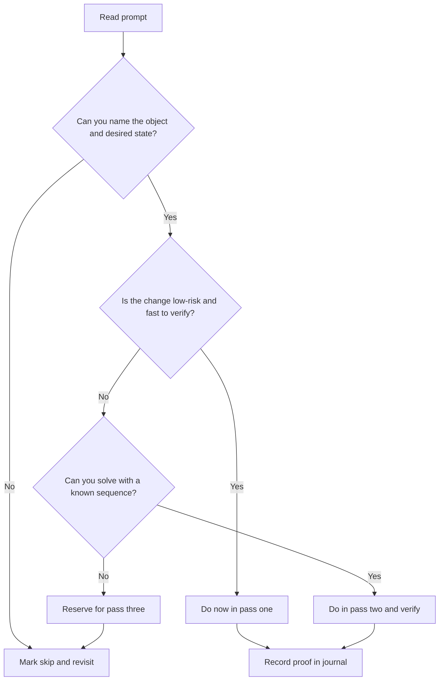

Складність: `[СЕРЕДНЯ]` | Час: 1–2 години | Передумови: знайомство з хабом LFCS, основи роботи в командному рядку Linux і достатня впевненість у роботі з оболонкою, щоб створювати файли, перевіряти служби та читати сторінки довідки без графічного помічника. Матеріали сертифікації Kubernetes від KubeDojo орієнтовані на Kubernetes 1.35+, але цей модуль LFCS зосереджено на звичках адміністрування Linux, які переносяться в кожен наступний напрямок із інтенсивною роботою в терміналі.

## Результати навчання

- Оцінювати завдання-промпти LFCS та обирати трипрохідну стратегію іспиту, яка захищає легкі бали перед важкою роботою.
- Проєктувати робочий процес практики, орієнтований на термінал, який перетворює читання матеріалів KubeDojo на адміністративні вправи Linux із обмеженням часу.
- Діагностувати прогалини у перевірці, зіставляючи кожну зміну конфігурації зі спостережуваним станом системи.
- Впроваджувати журнал завдань із обмеженням часу для пропущеної, виконаної роботи та роботи, що потребує перевірки, під час іспиту, орієнтованого на практику.

## Чому цей модуль важливий

Гіпотетичний сценарій: ви починаєте тренувальну сесію LFCS, почуваючись доволі підготовленими, бо прочитали напрямок Linux, переглянули кілька демонстрацій і впізнали більшість команд у конспектах для повторення. Перше завдання просить вас налаштувати власника та права доступу до дерева каталогів, друге — забезпечити, щоб служба переживала перезавантаження, а третє — зробити зміну сховища постійною. Жодна з цих ідей не є новою, проте сесія стає некомфортною, бо ви постійно перечитуєте промпти, перемикаєте команди без плану та рухаєтеся далі, перш ніж зможете довести, що машина справді перебуває в запитаному стані.

Цей сценарій передає центральну пастку LFCS. Іспит — це переважно не змагання з пам'яті, і це не теоретичний тест, де достатньо впізнавання. Linux Foundation описує LFCS як онлайн-іспит із наглядом, заснований на практиці, де кандидати розв'язують завдання в командному рядку на системах Linux, тож тиск під час оцінювання є операційним: створіть потрібний стан, перевірте його та витратьте час, що залишився, на наступний стан. Учень, який вміє чудово пояснити `systemd`, але не може швидко перевірити, чи увімкнено юніт, ще не перетворив знання на результативність на іспиті.

Цей модуль перетворює широкий напрямок LFCS на робочий метод для дня іспиту. Ви навчитеся сортувати промпти, вирішувати, які завдання заслуговують на негайну увагу, вести легкий чорновий журнал і використовувати команди перевірки як частину роботи, а не як необов'язковий етап прибирання. Результатом є не обхідний шлях навколо основ Linux; це спосіб зробити ваші основи такими, що піддаються оцінюванню в умовах термінального середовища з обмеженням часу.

## Що LFCS насправді винагороджує

Ментальна модель LFCS починається з різниці між упізнаванням відповіді та створенням стану. На іспиті з варіантами відповідей промпт і варіанти часто несуть достатньо контексту, щоб освіжити вашу пам'ять, а часткове впізнавання все одно може допомогти відсіяти невдалі варіанти. На іспиті, заснованому на практиці, машина є бланком відповідей. Якщо служба має бути увімкнена, користувач має належати до групи, а монтування має зберігатися після перезавантаження, оцінювача не цікавить, чи знали ви правильну концепцію в розмові. Він може лише перевірити кінцевий стан системи.

Саме тому операційний принцип звучить так: "зміни, перевір, рухайся далі". Фраза проста, але вона має формувати кожну хвилину вашої підготовки. Вам слід практикувати завдання так, щоб це змушувало пригадати, виконати та довести в одному циклі. Читання таблиці команд може запровадити лексику, але воно не навчить ваші руки відновлюватися після помилково набраної опції, розпізнавати оманливе повідомлення про успіх або вирішувати, чи достатньо перезавантаження конфігурації, коли промпт просив про постійність.

Офіційні інструкції LFCS також мають значення, бо вони роблять іспит більш схожим на обмежену адміністративну зміну, ніж на класну вправу. Поточні матеріали Linux Foundation для кандидатів описують сесію з віддаленим наглядом, дводинне обмеження часу та завдання в командному рядку, засновані на практиці. Ці обмеження означають, що ви маєте готуватися до керування увагою так само серйозно, як і до синтаксису команд. Кандидат, який витрачає забагато часу на відшліфовування одного крихкого завдання, може втратити бали в інших місцях, навіть якщо остаточне виправлення буде правильним.

Уявіть собі LFCS як чергу невеликих операційних тікетів. Кожен тікет називає об'єкт, як-от файл, користувача, службу, процес, налаштування мережі або запис файлової системи. Кожен тікет також передбачає бажаний стан, як-от наявний, відсутній, у власності користувача, виконуваний групою, запущений зараз, увімкнений на майбутнє, досяжний, змонтований або відновлюваний. Ваше завдання — перекласти промпт у цю пару "об'єкт–стан", обрати найбезпечнішу послідовність команд, а потім довести, що ця пара існує, перш ніж рухатися далі.

Незалежний від дистрибутива характер підготовки до LFCS підкріплює цей робочий процес. Ви можете практикуватися на одному дистрибутиві та натрапити на дещо інші назви пакетів, типові налаштування служб чи допоміжні інструменти в іншому, але іспит усе одно винагороджує загальну компетентність в адмініструванні Linux. Наприклад, звички роботи з `systemctl status` та `journalctl` переносяться між багатьма сучасними дистрибутивами, тоді як м'язова пам'ять менеджера пакетів може відрізнятися. Тому сильна підготовка врівноважує вільне володіння командами зі здатністю читати локальну довідку, перевіряти поточний стан і адаптуватися без паніки.

Ось чому вам слід уникати побудови плану навколо іспитового фольклору. Звіти кандидатів можуть бути корисними для розуміння стресу, але вони не є стабільним джерелом змісту завдань і можуть штовхнути вас до запам'ятовування чужої послідовності замість вивчення адаптивного робочого процесу. Тривкою навичкою є здатність увійти в будь-яке звичайне середовище Linux, спостерегти, що є істинним, і перевести систему до запитаного стану за допомогою команд, які ви можете обґрунтувати.

### Структура іспиту LFCS (домени та вагові коефіцієнти)

Поточний іспит LFCS (2-годинний, заснований на практиці, незалежний від дистрибутива) оцінюється за п'ятьма доменами:

| Домен | Вага |
|---|---|
| Розгортання операцій | 25% |
| Мережа | 25% |
| Сховище | 20% |
| Основні команди | 20% |
| Користувачі та групи | 10% |

Джерело: [Linux Foundation — сторінка сертифікації LFCS](https://training.linuxfoundation.org/certification/linux-foundation-certified-sysadmin-lfcs/) (перевірте актуальну структуру перед днем іспиту; Linux Foundation періодично оновлює домени).

Практичні модулі LFCS від KubeDojo перегруповують ці домени для зручного практичного потоку: основні команди (модуль 1.2), запущені системи + мережа (модуль 1.3), а також сховище + служби + користувачі (модуль 1.4).

Ось компактна операційна модель, яку вам слід тримати в голові під час навчання. Вона навмисно більше схожа на runbook, ніж на навчальну програму, бо підготовка до LFCS — це про дію, а не про збирання визначень.

```text
+------------------+     +-------------------+     +-------------------+
| Read the prompt  | --> | Name object/state | --> | Choose safe path  |
+------------------+     +-------------------+     +-------------------+
          |                         |                         |
          v                         v                         v
+------------------+     +-------------------+     +-------------------+
| Execute change   | --> | Verify observable | --> | Mark journal      |
+------------------+     +-------------------+     +-------------------+
```

Зупиніться та спрогнозуйте: якщо промпт каже, що служба має запускатися автоматично після перезавантаження, який спостережуваний стан переконав би вас, що вимога задоволена прямо зараз, і який другий спостережуваний стан переконав би вас, що вимога переживе майбутнє перезавантаження? Сильна відповідь відокремлює "запущено" від "увімкнено", бо вже запущену службу все одно може бути вимкнено, а ввімкнену службу все одно може бути зупинено в той момент, коли ви її перевіряєте.

## Читання промптів як вимог до стану

Більшість тривоги щодо LFCS починається, коли учень сприймає кожен промпт як пошук "правильної команди" замість запиту на кінцевий стан системи. Правильна команда залежить від поточного стану, а поточний стан часто є першим, що вам слід перевірити. Якщо промпт просить зробити каталог доступним для запису групою, вам потрібно знати, чи існує група, хто наразі володіє каталогом, чи має значення успадкування для нових файлів і чи стосується запитана поведінка негайного доступу чи майбутньої співпраці.

Найпростіша надійна звичка — подумки переписати промпт як "об'єкт плюс бажаний стан плюс доказ". Об'єктом може бути `/srv/app`, користувач `mira`, юніт `sshd.service`, процес `nginx`, інтерфейс `eth0` або рядок у `/etc/fstab`. Бажаний стан — це умова, яку може перевірити оцінювач. Доказ — це вивід команди, якому ви довіряли б, перш ніж рухатися далі. Ця звичка зменшує здогадки, бо змушує вас вирішити, який вигляд має успіх, перш ніж щось редагувати.

Розгляньмо завдання з правами доступу. Слабкий кандидат міг би одразу взятися за `chmod -R 777`, бо здається, що це швидко усуває проблеми з доступом, але ця команда часто створює проблему безпеки й може не задовольнити вимоги щодо власника. Сильніший кандидат визначає каталог, потрібного користувача чи групу, бажані права доступу та постійність майбутньої поведінки файлів. Потім кандидат використовує цілеспрямовані `chown`, `chmod`, `find` або команди керування доступом лише за потреби, після чого йдуть `ls -ld`, `namei -l` чи тест від імені відповідного користувача.

Та сама звичка "об'єкт–стан" застосовна до служб. Якщо промпт каже, що служба має бути активною зараз і ввімкненою під час завантаження, є два окремі стани для перевірки. Запуск `systemctl start` може задовольнити негайну умову, але не умову завантаження. Запуск `systemctl enable` може задовольнити умову завантаження, але не негайну умову. Формулювання промпту має керувати послідовністю команд, а перевірка має відповідати кожному стану, який запитувало формулювання.

Перш ніж запускати це, який вивід ви очікуєте від кожної команди, і який вивід змусив би вас зупинитися та перевірити логи, перш ніж щось іще змінювати?

```bash
systemctl is-active sshd.service
systemctl is-enabled sshd.service
journalctl -u sshd.service --no-pager -n 20
```

Ці команди — не магічні фрази для запам'ятовування. Вони є прикладами ширшого патерну перевірки: спочатку використовуйте прямий запит стану, а потім використовуйте логи лише тоді, коли стан не такий, як ви очікували. Якщо `is-active` повідомляє `active`, а промпт вимагав лише того, щоб служба була запущена зараз, ви, ймовірно, завершили. Якщо він повідомляє `failed`, наступним корисним питанням буде не "яку ще команду я можу спробувати?", а "що повідомила служба, коли вона зазнала збою?".

Завдання зі сховищем винагороджують ту саму дисципліну ще сильніше, бо тимчасовий успіх легко прийняти за повний успіх. Ручне монтування файлової системи може зробити шлях придатним для використання протягом сесії, але промпт, який згадує постійність, потребує запису в `/etc/fstab` або еквівалентного механізму, підтримуваного дистрибутивом. Тому звичка перевірки для сховища має охоплювати поточний стан монтування, ідентифікатори файлової системи, коли це доречно, і безпечний тест конфігурації постійності, перш ніж ви припустите, що завдання виконано.

Наступний невеликий чекліст варто засвоїти, бо він працює в різних доменах LFCS. Він тримає вашу увагу на доказі, а не на видовищі виконання команд.

| Сигнал промпту | Об'єкт для перевірки | Стан для доведення | Приклад команди-доказу |
|---|---|---|---|
| "Створити" | Користувач, група, файл, каталог, посилання | Об'єкт існує із запитаними атрибутами | `getent`, `ls -l`, `stat` |
| "Забезпечити запуск" | Служба або процес | Активна зараз | `systemctl is-active`, `ps`, `ss` |
| "Увімкнути під час завантаження" | Служба | Увімкнена для майбутнього завантаження | `systemctl is-enabled` |
| "Зробити монтування постійним" | Файлова система та точка монтування | Змонтовано зараз і оголошено для перезавантаження | `findmnt`, `mount -a --fake --verbose` |
| "Дозволити доступ" | Користувач, група, шлях, порт | Правильний дозвіл або стан слухача | `id`, `namei -l`, `ss -lntup` |
| "Запланувати" | Запис cron або таймера | Завдання існує в правильній області видимості | `crontab -l`, `systemctl list-timers` |

Зверніть увагу, що команда-доказ часто коротша за команду-зміну. Це корисно під тиском. Якщо ви вбудуєте доказ у свій звичний ритм, ви зможете залишати кожне завдання з чистішою совістю та охайнішим журналом. Якщо ви відкладете доказ до кінця, ви перетворите останні хвилини на стресову археологічну вправу, де вам доведеться заново з'ясовувати, що ви змінили, і чи машина досі узгоджується з вашою пам'яттю.

Читання промпту також допомагає вам вирішити, коли команди слід уникати. Якщо завдання просить конкретного власника, режим або зв'язок із групою, широка рекурсивна операція може випадково торкнутися об'єктів, які ніколи не були частиною вимоги. Якщо промпт просить, щоб служба була доступна, заміна всього файлу юніта зазвичай ризикованіша, ніж перевірка наявного юніта, його ввімкнення та читання першого повідомлення про збій. Безпечніший шлях часто вужчий за той, до якого тягнеться ваша пам'ять у першу чергу.

## Трипрохідна стратегія іспиту

До іспиту, заснованого на практиці, не слід підходити як до священної лінійної послідовності. Порядок питань може бути зручним, але він не обов'язково оптимізований під вашу впевненість, швидкість чи поточне пригадування. Трипрохідна стратегія — швидкі перемоги, середні завдання та важкі або крихкі завдання — захищає продуктивність, не заохочуючи до недбалого пропускання.

Перший прохід призначений для очевидної, низькоризикової роботи, яку швидко перевіряти. Ці завдання зазвичай передбачають створення користувачів чи груп, налаштування простих прав доступу, створення файлів чи посилань, перевірку запитаного стану або внесення невеликих змін у командному рядку, де поверхня збою обмежена. Мета — не лише емоційний комфорт, хоча впевненість має значення. Мета — швидко зменшити кількість незачеплених промптів, зібрати бали, які не варто залишати на столі, і розігріти ваше пригадування команд на завданнях, де помилку легко побачити.

Другий прохід призначений для завдань, які потребують кількох команд і одного навмисного кроку перевірки. Увімкнення служб, завдання cron, проста перевірка мережі, керування процесами, робота з архівами та рутинні операції з файловою системою часто живуть тут. Ці завдання не є жахливими, але вони заслуговують на достатню увагу, тож вам не слід поспішати з ними, поки ваш мозок усе ще пристосовується до інтерфейсу іспиту. Під час другого проходу ваш журнал стає важливим, бо ви можете позначити завдання як "потребує перевірки", коли зміна, ймовірно, правильна, але доказ потребує ще однієї перевірки.

Третій прохід призначений для важкої, неоднозначної чи крихкої роботи. Зміни сховища, складні мережеві виправлення, завдання з відновлення та все, що пов'язане з конфігураційним файлом зі суворим синтаксисом, можуть споживати час непередбачувано. Залишити ці завдання для зосередженої уваги — це не уникання. Це рішення щодо оцінювання. Якщо крихке завдання ламається й потребує прибирання, ви хочете, щоб це прибирання відбулося після того, як ви вже забезпечили завдання, які були для вас легкими та середніми.

Компроміс полягає в тому, що пропускання має бути дисциплінованим. Кандидат, який пропускає щоразу, коли завдання здається некомфортним, може створити останній прохід, повний середніх завдань, які слід було розв'язати раніше. Кандидат, який ніколи не пропускає, може віддати забагато часу першому заплутаному промпту. Мета — створити часовий проміжок, достатньо короткий, щоб запобігти фіксації, і достатньо довгий, щоб дозволити справжньому пригадуванню відбутися. Практичне правило — дати завданню одне спокійне прочитання, одну перевірку поточного стану та один розумний шлях команд, перш ніж вирішувати, чи належить воно до поточного проходу.

Трипрохідна стратегія стає сильнішою, коли ви репетируєте її перед іспитом, а не вигадуєте під тиском. Під час практики навмисно перемішуйте завдання з різних доменів, щоб сесія змушувала ухвалювати рішення про маршрутизацію. Якщо кожен блок практики згруповано за темою, ви завжди знаєте, який тип завдання буде наступним, і навичка перемикання контексту в день іспиту залишається недотренованою. Змішана практика навчає вас швидко визначати форму завдання та обирати прохід, не потребуючи назви супровідного уроку як підказки.

Використовуйте цей потік, коли вам потрібно вирішити, залишатися чи рухатися далі. Він навмисно консервативний, бо LFCS винагороджує завершені стани, а не героїчні муки.



Фраза "відома послідовність" потребує обережності. Вона не означає, що ви досконало пам'ятаєте кожну опцію. Вона означає, що ви знаєте форму розв'язку достатньо добре, щоб швидко переглянути локальну довідку, обрати безпечний шлях і перевірити результат. Якщо вам потрібно досліджувати базову модель об'єкта з нуля під час іспиту, завдання, ймовірно, належить до пізнішого етапу, якщо тільки воно не дуже мале. Якщо вам потрібно лише підтвердити один прапорець, це все одно може бути завдання другого проходу.

Ця стратегія також допомагає вам відновлюватися після помилок. Припустімо, ви редагуєте конфігураційний файл, перезавантажуєте службу, і перезавантаження зазнає невдачі. Без стратегії проходів ви можете продовжувати пробувати випадкові правки, бо піти здається невдачею. Зі стратегією проходів ви можете позначити завдання як "зламано, переглянути логи", відновити чи мінімізувати зміну за потреби та перейти до завдання, де ваші наступні п'ять хвилин з більшою ймовірністю принесуть бали. Це не здавання; це керування часом у стилі реагування на інциденти.

## Перевірка як справжня іспитова навичка

Багато кандидатів вважають, що підготовка до LFCS — це переважно про знання команд. Знання команд має значення, але воно неповне, бо команди є лише засобом зміни чи перевірки стану. Справжня іспитова навичка — це цикл, який перетворює промпт на доведений результат: прочитати, перевірити, змінити, підтвердити, записати та рухатися далі. Якщо будь-який крок відсутній, ви покладаєтеся на удачу чи пам'ять саме в той момент, коли іспит намагається виміряти результативність адміністрування.

Перевірка має бути специфічною для типу завдання. Після створення користувача `getent passwd username` доводить, що обліковий запис існує, тоді як `id username` допомагає довести членство в групі. Після зміни власника `stat` чи `ls -ld` доводить метадані об'єкта, якого ви торкнулися. Після ввімкнення служби `systemctl is-enabled` доводить намір щодо завантаження, а `systemctl is-active` доводить поточний стан виконання. Після редагування монтування `findmnt` доводить поточний стан монтування, тоді як обережний тест `mount -a` може виявити синтаксичні помилки перед перезавантаженням.

Ключ у тому, щоб перевіряти вимогу, а не команду. Команда може завершитися успішно, тоді як вимога залишається невиконаною. Наприклад, `usermod -aG wheel mira` може завершитися успішно, але промпт міг просити іншу групу, новостворену групу чи негайний доступ до оболонки, який потребує нового сеансу входу. `systemctl restart nginx` може завершитися успішно, але промпт міг просити ввімкнення під час завантаження. `chmod 640 file` може завершитися успішно, але шлях каталогу все одно може блокувати доступ, бо на батьківському каталозі відсутній дозвіл на виконання.

Корисна навчальна вправа — записати команду-доказ перед командою-зміною. Якщо ви не можете назвати доказ, ви не до кінця зрозуміли промпт. Це схоже на написання тесту перед зміною коду застосунку: тест прояснює очікувану поведінку, запобігає розпливчастому визначенню готовності та дає вам швидкий сигнал, коли ваша зміна спрацювала чи ні. У підготовці до LFCS команда-доказ є вашим крихітним набором тестів.

Ось мінімальний аркуш перевірки, який ви можете використовувати під час практики. Це не те, що варто приносити на іспит як зовнішні нотатки; це патерн для репетиції, доки він не стане природним.

```text
+----------------------+----------------------+----------------------+
| Prompt object        | Desired state        | Proof command        |
+----------------------+----------------------+----------------------+
| user or group        | exists, member, uid  | getent, id           |
| file or directory    | owner, mode, type    | stat, ls -ld         |
| service              | active, enabled      | systemctl is-*       |
| process or socket    | running, listening   | ps, pgrep, ss        |
| filesystem           | mounted, persistent  | findmnt, mount -a    |
| scheduled job        | installed, scoped    | crontab, timers      |
+----------------------+----------------------+----------------------+
```

Сценарій вправи: промпт просить вас забезпечити, щоб `backup.service` був увімкнений і запущений. Ви запускаєте `systemctl enable backup.service`, не отримуєте помилки й почуваєтеся готовими рухатися далі. Кращий робочий процес робить паузу, бо ввімкнення та виконання — це різні стани. Ви все одно перевірили б `systemctl is-enabled backup.service` та `systemctl is-active backup.service`, а якщо служба не активна, ви перевірили б `journalctl -u backup.service --no-pager -n 20`, перш ніж вгадувати виправлення.

Цей спосіб мислення запобігає як надмірній, так і недостатній перевірці. Вам не потрібно писати роман після кожного завдання. Вам потрібні одна-дві команди, які доводять саме те, що просив промпт. Під тиском часу надмірна перевірка може стати ще однією формою зволікання. Навичка полягає в тому, щоб обрати доказ, достатньо сильний, щоб йому довіряти, і достатньо малий, щоб уміститися в годинник.

Перевірка також показує, коли вам слід припинити змінювати машину. Якщо команда-доказ показує бажаний стан, рухайтеся далі, якщо тільки промпт не містить іншої вимоги. Не продовжуйте "покращувати" робочий розв'язок, додаючи широкі права доступу, зайві служби чи непов'язане прибирання. Завдання LFCS оцінюються за запитаними станами, а зайві зміни збільшують ймовірність того, що ви створите побічний ефект. Найбезпечніший розв'язок на іспиті зазвичай є найменшим, який задовольняє та доводить вимогу.

Одна корисна звичка практики — записувати невдалі докази, а не лише невдалі команди. Невдала команда може означати, що ви обрали хибний синтаксис, але невдалий доказ означає, що бажаний стан усе ще відсутній. Ця відмінність тримає ваш постмортем чесним. Якщо `systemctl restart` зазнав невдачі, вам, можливо, потрібне налагодження команди чи служби. Якщо `systemctl is-enabled` зазнав невдачі після успішного запуску, прогалина — у постійності. Доказ каже вам, яка концепція потребує практики, тож ваш наступний навчальний блок стає цілеспрямованим, а не розпливчастим.

## Побудова крихітного журналу завдань

Крихітний журнал завдань допомагає, бо когнітивне навантаження стає ворогом під час практичних іспитів. Цю пораду легко недооцінити, доки ви не зазнаєте обмеженого в часі сеансу в терміналі з кількома напівзавершеними завданнями. Ваша пам'ять починає змішувати номери промптів, шляхи до файлів, назви служб і підозрювані виправлення. Журнал дає вашій увазі панель керування, тож ви не марнуєте час на повторне з'ясування того, що вже вирішили.

Журнал має бути достатньо малим, щоб не стати другим іспитом. Вам потрібен лише ідентифікатор завдання, статус і одна корисна деталь, як-от шлях, юніт, користувач, пристрій чи прогалина в перевірці. Статуси можуть бути простими: `done`, `needs verify`, `skip` та `broken/revisit`. Деталь має бути тим, що дозволяє вам відновити завдання без повторного читання повного промпту з нуля. Якщо оновлення журналу займає більше кількох секунд, він занадто складний.

Оскільки правила іспиту можуть обмежувати зовнішні матеріали для запису, тренуйте звичку в спосіб, безпечний для термінала, і дотримуйтеся поточних інструкцій іспиту щодо того, що дозволено в реальному середовищі. Під час практики достатньо простого текстового файлу всередині вашої лабораторної ВМ. Суть не в самому файлі; суть у тому, щоб навчитися виносити стан завдання назовні, не втрачаючи темпу. Якщо реальний іспит надає внутрішню чорнову область або дозволяє локальні нотатки в терміналі, ви адаптуєте звичку там. Якщо ні, ті самі ментальні статуси все одно допомагають вам вирішити, що переглянути.

Ось формат журналу лише для практики, який залишається компактним і легким для перегляду.

```bash
cat > lfcs-journal.txt <<'EOF'
1 done user mira in wheel verified with id
2 needs verify backup.service active yes enabled unknown
3 skip fstab entry for /data review UUID
4 broken nginx reload failed inspect journal
EOF

sed -n '1,120p' lfcs-journal.txt
```

Вам слід практикувати ведення цього журналу під час виконання завдань, а не постфактум. Якщо ви чекаєте до кінця навчального сеансу, ви лише пишете підсумок. Іспитова цінність походить від використання журналу, щоб вирішити, куди піде ваша наступна хвилина. Хороший журнал каже вам, яке завдання можна закрити однією командою-доказом, яке завдання має залишитися пропущеним, а яке завдання може бути достатньо ризикованим, щоб залишити його до завершення легшої роботи.

Журнал також зменшує емоційну ціну пропускання. Без запису пропускання може здаватися скиданням завдання в порожнечу. Із записом пропускання стає запланованим поверненням. Ця різниця має значення, бо паніка часто з'являється, коли кандидат тлумачить заплутаний промпт як ознаку того, що весь іспит іде погано. Журнал замінює цю історію чергою: цей пункт припарковано, цей пункт виконано, цей пункт потребує одного доказу, а наступний пункт доступний.

Є й друга перевага, яка проявляється під час фінального огляду. Якщо у вас залишилося десять хвилин, журнал дозволяє вам націлитися на незавершену роботу замість того, щоб знову гортати кожен промпт. Ви можете швидко закрити пункти `needs verify`, переглянути пропущене завдання зі свіжою увагою або вирішити, що крихке завдання не варте дестабілізації переважно завершеної машини. Це кращий фінальний прохід, ніж випадкова перевірка останніх команд у вашій історії оболонки.

Дисципліна журналу також показує, чи збалансований ваш навчальний план. Якщо кожна тренувальна сесія закінчується пропущеним сховищем, сховище більше не є просто темою третього проходу; це пріоритет тренувань. Якщо кожне завдання служби позначено як `needs verify`, вашою слабкістю може бути не синтаксис `systemd`, а різниця між станами active, enabled, failed, masked та reloaded. Журнал дає вам докази про вашу підготовку, а докази корисніші за загальне відчуття, що з Linux усе йде добре чи погано.

## Перетворення KubeDojo на практику, орієнтовану на термінал

KubeDojo може дати вам охоплення тем, але готовність до LFCS походить від перетворення цього охоплення на повторювану роботу в терміналі. Сприймати хаб як єдиний підготовчий ресурс — це помилка, бо читання здається продуктивним навіть тоді, коли воно не будує пригадування. Система навчання для сертифікації має перетворювати кожен модуль на завдання, кожне завдання на команди, а кожну послідовність команд на перевірений стан системи.

Цикл практики має бути простим. Прочитайте чи перегляньте зіставлений модуль, видобудьте кілька конкретних адміністративних завдань, виконайте їх у чистій оболонці, перевірте кожен результат і повторіть завдання, які здалися повільними чи непевними. Якщо тема не стає завданням, вона залишається пасивним знанням. Якщо завдання не містить перевірки, воно тренує вас довіряти виводу команди замість стану системи. Якщо сеанс практики не має обмеження часу, він може будувати глибину, але не повністю підготує вас до темпу іспиту.

Наприклад, навчальний блок із користувачів та прав доступу не має закінчуватися на "я переглянув власність". Він має закінчуватися послідовністю на кшталт створення користувача, створення групи, додавання користувача до групи, підготовки спільного каталогу, застосування потрібного режиму, створення тестового файлу та доведення доступу. Блок служб не має закінчуватися на "я почитав про systemd". Він має закінчуватися запуском, зупинкою, увімкненням, вимкненням, перевіркою логів і поясненням різниці між станом виконання та станом завантаження.

Наступний план практики використовує тижневий цикл підготовки, зроблений операційним. Кожен сеанс поєднує огляд, виконання, хронометраж і постмортем, бо ці частини підкріплюють різні навички. Огляд дає вам лексику, виконання будує пригадування, хронометраж викриває вагання, а постмортем перетворює помилки на ціль наступного сеансу.

| Сеанс | Основна мета | Форма практики | Питання постмортему |
|---|---|---|---|
| Сеанс 1 | Огляд одного домену LFCS | Чотири невеликі завдання з командами-доказами | Який доказ я забув першим? |
| Сеанс 2 | Огляд іншого домену | Чотири завдання на чистій ВМ чи в контейнері | Яка команда потребувала пошуку? |
| Сеанс 3 | Хронометрований запуск зі змішаними доменами | Шість завдань у випадковому порядку | Яке завдання я мав пропустити раніше? |
| Сеанс 4 | Відновлення та слабкі місця | Повторення невдалих завдань з пам'яті | Який стан я не перевірив? |

Чисте середовище є цінним, бо воно усуває випадкову звичність. Якщо ви завжди практикуєтеся на одній і тій самій довговічній машині, минулі зміни можуть зробити завдання легшими, ніж вони мали б бути. Свіжа ВМ, хмарний інстанс чи одноразове лабораторне середовище змушують вас створювати стан з нуля та помічати відсутні передумови. Середовище не має бути вишуканим. Воно має бути достатньо реальним, щоб служби, користувачі, файлові системи, логи та перевірка мережі поводилися як Linux, а не як ізольовані фрагменти.

Офіційна навчальна екосистема Linux Foundation включає доступ до симулятора іспиту для кількох сертифікацій, заснованих на практиці, зокрема LFCS, і ця деталь є сигналом щодо підготовки. Цінність симулятора — це не лише схожість змісту; це знайомство з інтерфейсом і хронометражем. Використовуйте спроби симулятора навмисно. Перший запуск симулятора може викрити проблеми з темпом і робочим процесом, тоді як пізніший запуск має виміряти, чи покращилися ваша трипрохідна стратегія, звичка ведення журналу та цикл перевірки.

Який підхід ви обрали б тут і чому: витратити зайву годину на читання наступного розділу про сховище чи витратити цю годину на повторення трьох завдань зі сховищем з пам'яті на чистій машині? Якщо ваша мета — готовність до іспиту, другий варіант зазвичай кращий, щойно ви маєте достатньо теорії, щоб уникати деструктивних здогадок. Читання додає концепцій, але повторювана перевірена робота перетворює концепції на час реакції.

Вам усе одно слід читати сторінки довідки та встановлену документацію під час практики, бо середовище іспиту може дозволяти локальну документацію дистрибутива, обмежуючи при цьому непов'язані зовнішні ресурси. Мета — не запам'ятати кожен прапорець. Мета — стати швидким у звуженні виводу довідки до потрібної вам опції. Практикуйте команди на кшталт `man systemctl`, `/enable`, `n` та `q` всередині пейджера, щоб пошук довідки став відпрацьованою навичкою, а не стресовою затримкою.

Найважливіша метрика практики — не кількість спожитих сторінок. Це кількість завдань, які ви можете виконати з холодного промпту, з командою-доказом, у розумному часовому проміжку. Ведіть простий лог повільних завдань і повторюйте їх, доки вони не стануть рутинними. LFCS винагороджує операційну вправність, а вправність будується виконанням тих самих сімейств роботи, доки базові рухи більше не споживають усю вашу увагу.

Не плутайте повторення з бездумним зубрінням. Хороший повторний запуск змінює одну змінну за раз: інше ім'я користувача, інший каталог, іншу службу, свіжу машину чи жорсткіший часовий проміжок. Ця варіація запобігає тому, щоб ваші руки запам'ятали один точний транскрипт, тоді як ваше судження залишається слабким. Мета — зробити робочий процес переносним, тож коли промпт змінюється, ви все одно знаєте, як прочитати об'єкт, перевірити стан, обрати зміну, довести результат і записати підсумок.

## Робота з неоднозначністю та відновлення

Неоднозначні промпти не рідкість у реальному адмініструванні, а іспитові промпти можуть здаватися неоднозначними, коли ваша ментальна модель усе ще формується. Найкраща реакція — на мить сповільнитися, а не починати вгадувати. Перефразуйте потрібний кінцевий стан простими словами, визначте об'єкт, перевірте поточний стан і оберіть найменшу зміну, яка переводить об'єкт до запитаного стану. Якщо ви не можете назвати об'єкт, завдання належить до стовпця пропусків до наступного проходу.

Паніка часто перетворює неоднозначність на гарячкове перемикання команд. Кандидат пробує одну команду, бачить вивід, якого не очікував, пробує іншу команду, редагує файл, перезапускає службу, а потім забуває, яка зміна мала значення. Саме так керовне завдання стає зламаною системою. Кращий патерн відновлення — зупинитися після першого несподіваного результату й запитати, чи стосується збій синтаксису, прав доступу, відсутніх пакетів, поточного стану чи хибного припущення про об'єкт.

Логи є частиною відновлення, але їх слід використовувати з питанням на думці. Якщо служба зазнала збою, логи можуть сказати вам, чи конфігураційний файл недійсний, чи порт уже використовується, чи відсутній шлях, чи недоступна залежність. Якщо монтування зазнало збою, вивід помилок може відрізнити хибний тип файлової системи від відсутнього пристрою чи неправильно сформованого рядка `/etc/fstab`. Іспитова навичка — це не читання кожного рядка лога; це пошук рядка, який пояснює, чому бажаний стан не з'явився.

Резервні копії та мінімальні правки мають найбільше значення, коли ви торкаєтеся конфігураційних файлів. Вам не потрібна складна стратегія резервного копіювання під час іспитового завдання, але вам слід уникати перетворення зміни в один рядок на широке переписування. Копіювання конфігураційного файлу перед ризикованою правкою може бути корисним під час практики, а вміння перевіряти синтаксис перед перезапуском служби може зекономити час. Що важливіше, редагуйте з наміром. Якщо ви не можете пояснити, чому рядок змінюється, ви, можливо, розширюєте радіус ураження.

Ось компактна послідовність відновлення для завдання служби. Це не універсальна відповідь, але вона демонструє порядок думки: перевірте стан, прочитайте останні логи, перевірте ймовірну конфігурацію, внесіть найменше виправлення, а потім знову перевірте точний запитаний стан.

```bash
systemctl status example.service --no-pager
journalctl -u example.service --no-pager -n 30
systemctl cat example.service
systemctl restart example.service
systemctl is-active example.service
```

Назва-заповнювач юніта `example.service` навмисно є загальною. У реальній практиці підставте службу, яка існує у вашому лабораторному середовищі, як-от `sshd.service`, `cron.service`, `crond.service` чи інший наданий дистрибутивом юніт. Уникайте сліпого копіювання команд служби з модуля в машину, де назва юніта відрізняється. Підготовка до LFCS має навчати вас перевіряти локальну реальність, а не припускати, що кожен дистрибутив має однакові назви.

Відновлення також включає знання того, коли не продовжувати. Якщо завдання спожило кілька хвилин, і кожна команда розкриває глибшу передумову, позначте його для третього проходу та рухайтеся далі. Якщо завдання вже частково змінено, залиште собі нотатку в журналі, яка каже, що ви змінили та якого доказу бракує. Ця нотатка може дозволити вам швидко завершити його пізніше, або вона може застерегти вас не дестабілізувати робочу систему під час фінального огляду.

Спокійна звичка відновлення має бути частиною звичайної практики, а не чимось, зарезервованим для поганих днів. Навмисно включіть одне завдання, де ви очікуєте, що перша спроба зазнає невдачі, як-от перевірка назви служби, яка може відрізнятися залежно від дистрибутива, чи тестування запису монтування в одноразовому середовищі. Суть не в тому, щоб виробити хаос. Суть у тому, щоб навчити вашу нервову систему, що несподіваний вивід — це інформація, і що ця інформація може бути спрямована через той самий цикл перевірки, рішення, підтвердження та журналу, що й кожне інше завдання.

## Патерни та антипатерни

Патерни — це звички, які неодноразово покращують результативність на іспиті, бо вони зменшують невизначеність і захищають час. Антипатерни — це звички, які здаються продуктивними в моменті, але роблять систему важчою для осмислення. Сприймайте цю таблицю як практичний діагностичний інструмент для ваших навчальних сеансів. Якщо тренувальний запуск здається хаотичним, зазвичай присутній один із антипатернів.

| Патерн | Коли його використовувати | Чому він працює | Міркування щодо масштабування |
|---|---|---|---|
| Читання "об'єкт–стан–доказ" | Кожен промпт, особливо неоднозначний | Воно перетворює формулювання на перевірювану ціль до того, як починаються команди | Працює для користувачів, файлів, служб, мережі, сховища та планування |
| Трипрохідне сортування | Хронометровані сеанси зі змішаними доменами | Воно захищає легкі бали та резервує крихкі завдання для зосередженої уваги | Потребує чесних рішень про пропуск, а не уникання |
| Звичка "доказ перед рухом далі" | Після кожної значущої зміни | Воно запобігає тому, щоб тимчасовий чи частковий успіх прийняли за завершення | Тримайте команди-докази достатньо короткими для темпу іспиту |
| Крихітний журнал завдань | Будь-який сеанс із кількома завданнями | Воно виносить назовні пропущену роботу та роботу, що потребує перевірки | Використовуйте лаконічні статуси, щоб ведення нотаток не споживало сеанс |
| Повторення в чистому середовищі | Тижневі блоки практики | Воно запобігає тому, щоб старий стан лабораторії приховував відсутні кроки | Чергуйте домени, щоб звичність не стала запам'ятовуванням однієї машини |

Антипатерни зазвичай заходять через зрозумілий тиск. Під годинником широкі команди здаються швидшими, пропускання здається ризикованим, а зайві правки можуть здаватися старанністю. Кращою альтернативою рідко є більше зусиль. Зазвичай це менший цикл із чіткішим доказом.

| Антипатерн | Що йде не так | Чому кандидати в нього потрапляють | Краща альтернатива |
|---|---|---|---|
| Лінійна фіксація | Один важкий промпт споживає час, тоді як легші промпти залишаються незачепленими | Видимий порядок питань здається авторитетним | Використовуйте трипрохідну стратегію та навмисно позначайте пропуски |
| Мислення "спочатку команда" | Команди завершуються успішно, але запитаний стан залишається невиконаним | Упізнавання знайомої команди здається готовністю | Подумки записуйте команду-доказ перед зміною стану |
| Широкі виправлення прав доступу | Доступ працює випадково, тоді як вимоги до безпеки та власності не виконуються | `chmod -R` здається таким, що швидко розв'язує багато симптомів | Перевіряйте власність, обхід батьківських каталогів і точний запитаний доступ |
| Перевірка лише наприкінці | Фінальний огляд стає стресовим і неповним | Перевірка здається прибиранням, а не частиною завдання | Перевіряйте кожну значущу зміну, перш ніж рухатися далі |
| Складні нотатки | Журнал стає відволіканням | Детальні нотатки здаються безпечнішими під тиском | Записуйте лише завдання, статус і одну деталь для відновлення |
| Залежність від інструментів | Практика розпадається, коли середовище з підтримкою зникає | IDE та вебпошук приховують слабкості в терміналі | Практикуйтеся в середовищі, орієнтованому на термінал, без графічного інтерфейсу |

## Рамка прийняття рішень

Використовуйте цю рамку, коли вирішуєте, що робити з наступним промптом під час хронометрованого запуску LFCS. Вона поєднує сортування, ризик і перевірку в одне рішення, а не розглядає їх як окремі питання. Найважливіше питання — не "Чи зможу я зрештою це розв'язати?", а "Чи це найкраще наступне використання мого обмеженого іспитового часу?".

| Питання для рішення | Якщо так | Якщо ні | Ризик, за яким стежити |
|---|---|---|---|
| Чи можу я назвати об'єкт і бажаний стан? | Продовжуйте перевіряти поточний стан | Пропустіть і поверніться після легших промптів | Здогадки до ідентифікації об'єкта |
| Чи завдання низькоризикове та швидке для перевірки? | Зробіть його в першому проході | Розгляньте другий чи третій прохід | Недооцінка вимог до постійності |
| Чи знаю я безпечну послідовність команд? | Виконайте та перевірте зараз | Стисло скористайтеся локальною довідкою чи пропустіть | Перетворення пошуку довідки на дослідницький дрейф |
| Чи команда-доказ відповідає кожній вимозі? | Позначте як виконане | Позначте як таке, що потребує перевірки | Доведення стану виконання, але пропуск стану завантаження |
| Чи перша спроба несподівано зазнала невдачі? | Один раз перевірте логи чи поточний стан | Перейдіть до відновлення пізніше | Повторення випадкових варіацій команд |

Рамка навмисно відокремлює "пропуск" від "відмови". Пропуск — це рішення про маршрутизацію всередині черги. Відмова — це те, що стається, коли у вас закінчується час або ви вирішуєте не ризикувати крихкою зміною. Ви хочете багато навмисних пропусків на початку, якщо промпти змішані за складністю, але ви хочете дуже мало випадкових відмов, спричинених втратою контролю над роботою.

Для практики встановлюйте різний часовий проміжок для кожного сімейства промптів. Швидкі завдання з файлами та користувачами можуть заслуговувати лише на кілька хвилин до пропуску, тоді як завдання зі сховищем чи відновленням служб можуть заслуговувати на довший час, щойно швидкі перемоги забезпечено. Точні числа менш важливі за звичку вирішувати, перш ніж ви розчаруєтеся. Часовий проміжок, обраний спокійно, є стратегією; часовий проміжок, виявлений після десяти хвилин гарячкових спроб, є просто усуненням наслідків.

## Чи знали ви?

- Поточні інструкції Linux Foundation для LFCS описують іспит як 17–20 завдань, заснованих на практиці, що достатньо різноманітне за завданнями, щоб дисципліна черги мала таке саме значення, як і ізольоване пригадування команд.
- Прохідний бал LFCS вказано як 67 відсотків в інструкціях Linux Foundation для кандидатів, тож залишити легкі завдання незачепленими може бути шкідливіше, ніж зробити одне важке завдання ідеальним.
- Linux Foundation оголосила про включені спроби симулятора для LFCS та кількох сертифікацій Kubernetes у 2023 році, причому кожна активація симулятора надає 36 годин доступу.
- Матеріали сертифікації Linux Foundation описують сертифікати як дійсні протягом 24 місяців, що робить LFCS поновлюваним доказом робочих навичок, а не довічним значком.

## Типові помилки

| Помилка | Чому вона стається | Як її виправити |
|---|---|---|
| Ставлення до LFCS як до теоретичного тесту | Читання та перегляд відео здаються продуктивними, але іспит оцінює кінцевий стан машини | Перетворюйте кожну навчальну тему на живе завдання з командою-доказом |
| Початок із найважчого промпту | Перше видиме завдання здається обов'язковим першим завданням | Використовуйте три проходи: швидкі перемоги, середня робота, потім крихкі завдання |
| Перевірка лише коду завершення команди | Нульовий код завершення все одно може залишити частину вимоги невиконаною | Перевіряйте запитаний стан безпосередньо за допомогою `id`, `stat`, `systemctl`, `findmnt` чи подібних інструментів |
| Забування про постійність | Зміна під час виконання виглядає правильною протягом сесії, але зникає пізніше | Відокремлюйте негайний стан від стану завантаження чи перезавантаження у вашому доказі |
| Надмірне редагування конфігураційних файлів | Під тиском широкі переписування здаються рішучішими за цілеспрямовані зміни | Вносьте найменшу пояснювану правку та перевіряйте перед перезапуском, коли це можливо |
| Невелення журналу завдань | Короткочасна пам'ять перевантажується пропущеними промптами та напівзавершеною роботою | Відстежуйте номер завдання, статус і одну деталь для відновлення в крихітному чорновому процесі |
| Практика лише в середовищах із підтримкою | IDE, вебпошук і старий стан лабораторії приховують слабкості в терміналі | Використовуйте чисті сеанси, орієнтовані на термінал, і репетируйте пошук на локальних сторінках довідки |

## Тест

<details><summary>Питання 1: Ви читаєте промпт LFCS, який просить зробити службу активною зараз і ввімкненою після перезавантаження. Ви впевнено пам'ятаєте лише одну команду. Від чого має захищати ваш робочий процес?</summary>

Робочий процес має захищати від доведення лише одного з двох запитаних станів. Запуск служби не доводить ввімкнення під час завантаження, а ввімкнення служби не доводить, що вона активна прямо зараз. Сильна відповідь називає обидві перевірки-докази, як-от `systemctl is-active` та `systemctl is-enabled`, перш ніж вважати завдання виконаним. Це безпосередньо оцінює завдання-промпт LFCS: трипрохідна стратегія допомагає лише тоді, коли потрібні стани ясні — тут ці стани є "активна зараз" та "ввімкнена під час завантаження".

</details>

<details><summary>Питання 2: Під час хронометрованого тренувального запуску перше завдання зі сховищем виглядає ризикованим, і ви не впевнені, який ідентифікатор пристрою використовувати. Який найкращий наступний крок?</summary>

Найкращий наступний крок — перевірити достатньо поточного стану, щоб вирішити, чи розв'язне завдання зараз, а потім навмисно пропустити його, якщо воно залишається непевним. Робота зі сховищем може створювати час на прибирання, якщо її виконувати недбало, тож вона часто належить до третього проходу, якщо тільки шлях не ясний. Позначення завдання в журналі з пристроєм чи точкою монтування дозволяє вам повернутися пізніше, не втрачаючи контексту. Це не уникання; це обмежена в часі стратегія для захисту легших балів.

</details>

<details><summary>Питання 3: Ваш тренувальний сеанс містить завдання з керування користувачами, і команда завершується успішно. Яка прогалина в перевірці все одно може залишитися?</summary>

Команда могла змінити одну частину стану облікового запису, залишивши фактичну вимогу недоведеною. Наприклад, створення користувача не доводить членство в групі, вибір оболонки, стан домашнього каталогу чи власність файлів, запитану промптом. Вам слід зіставити команду-доказ із бажаним станом, використовуючи інструменти на кшталт `getent`, `id`, `ls -ld` чи `stat`. Урок у тому, щоб діагностувати прогалини в перевірці, а не довіряти успішній команді як повному доказу.

</details>

<details><summary>Питання 4: Цього тижня ви прочитали три модулі KubeDojo, але не торкнулися оболонки. Чому це слабка підготовка до LFCS?</summary>

Вона будує лексику без побудови хронометрованого виконання. LFCS заснований на практиці, тож готовність потребує пригадування команд, застосування їх до реального стану, опрацювання несподіваного виводу та доведення результату з термінала. Сильніший робочий процес видобуває конкретні завдання з кожного модуля та повторює їх у чистому середовищі. Цей задум перетворює KubeDojo з бібліотеки для читання на систему практики.

</details>

<details><summary>Питання 5: П'ять промптів завершено, два позначено як такі, що потребують перевірки, а один пропущено. У вас залишилося кілька хвилин у тренувальному запуску. Як журнал завдань має вас спрямувати?</summary>

Журнал має спершу скерувати вас до пунктів, які можна закрити швидкими командами-доказами, бо це, ймовірно, бали, що чекають на перевірку. Після цього ви можете вирішити, чи пропущений пункт усе ще варто спробувати, виходячи з ризику та часу, що залишився. Без журналу ви могли б перечитувати кожен промпт чи повторювати вже виконану роботу. Цінність журналу в тому, що він перетворює фінальний огляд на цілеспрямовану чергу.

</details>

<details><summary>Питання 6: Перезавантаження конфігурації зазнає невдачі після вашої правки, і вас спокушає продовжувати змінювати сусідні рядки. Яку поведінку відновлення вам слід використати?</summary>

Припиніть широке редагування та перевірте сигнал про збій. Використовуйте вивід статусу, останні логи чи команду перевірки конфігурації, коли служба її надає, потім внесіть найменше пояснюване виправлення. Якщо завдання починає споживати забагато часу, позначте його як зламане чи таке, що потребує повернення, і перейдіть до роботи з кращими шансами на бали. Ця поведінка запобігає тому, щоб гарячкове перемикання команд перетворило одне невдале перезавантаження на кілька невідомих змін.

</details>

<details><summary>Питання 7: Учень каже: "Я знаю команду, тож мені не потрібно практикувати середовище." Чого бракує в цьому міркуванні?</summary>

Середовище впливає на хронометраж, пошук довідки, назви служб, доступність пакетів і стрес роботи без зовнішньої допомоги. Знання команди в ізоляції не доводить, що учень може перевірити поточний стан, адаптуватися до локальних відмінностей і відновитися після помилок. Практика, орієнтована на термінал, додає ці відсутні навички, змушуючи виконувати та перевіряти в реалістичних умовах. Ось чому практика на симуляторі чи в чистій лабораторії має цінність, що виходить за межі огляду тем.

</details>

## Практична вправа

Ця вправа будує систему практики LFCS, а не просить вас запам'ятати нове сімейство команд. Використовуйте будь-яку одноразову ВМ Linux, хмарний інстанс чи локальну лабораторну машину, де вам дозволено створювати файли та перевіряти служби. Якщо команда посилається на службу, якої немає у вашому дистрибутиві, підставте реальну службу та запишіть підстановку у свій журнал. Мета — відрепетирувати читання промптів, вибір доказу, сортування та оновлення журналу.

Сценарій вправи: у вас є 35-хвилинний навчальний блок, і ви хочете попрактикувати робочий процес першого модуля, не залежачи від точного змісту іспиту. Ви створите невелику чергу завдань, класифікуєте кожне завдання за проходом, виконаєте безпечні завдання першими та запишете команди-докази, перш ніж щось позначати як завершене. Сприймайте вправу як репетицію керування увагою. Технічні завдання навмисно скромні, тож робочий процес залишається головною навичкою.

### Налаштування

Створіть тимчасовий каталог для практики та файл журналу. Ці команди уникають привілейованих шляхів, але деякі команди перевірки служб пізніше можуть потребувати службу, яка існує на вашій машині.

```bash
mkdir -p "$HOME/lfcs-workflow-practice"
cd "$HOME/lfcs-workflow-practice"
printf '%s\n' "task status detail" > journal.txt
```

### Завдання

- [ ] Оцініть завдання-промпти LFCS та класифікуйте наступні практичні завдання як швидкі, середні чи крихкі, перш ніж запускати команди.
- [ ] Спроєктуйте робочий процес практики, орієнтований на термінал, обравши чотири завдання з модуля Linux KubeDojo та записавши команду-доказ для кожного з них.
- [ ] Діагностуйте прогалини в перевірці, виконавши одне завдання з прав доступу до файлу та одне завдання з перевірки служби з явним виводом-доказом.
- [ ] Впровадьте обмежений у часі журнал завдань, який записує статуси `done`, `needs verify` та `skip` під час запуску.
- [ ] Поверніться до одного пропущеного пункту чи пункту, що потребує перевірки, і вирішіть, чи завершити його, відкласти чи позначити надто ризикованим для поточного часового проміжку.

<details><summary>Підказка до розв'язання</summary>

Почніть із запису об'єкта, бажаного стану та команди-доказу для кожного практичного завдання. Завдання з правами доступу до файлу може використовувати `mkdir`, `touch`, `chmod` та `stat`, тоді як завдання з перевірки служби може використовувати `systemctl is-active` та `systemctl is-enabled` проти юніта, який існує у вашому дистрибутиві. Тримайте журнал коротким: номер завдання, статус і одна деталь, як-от шлях до файлу чи назва юніта. Коли команда-доказ не відповідає промпту, позначте `needs verify`, а не вдавайте, що завдання виконано. Наприкінці перегляньте журнал і напишіть одне речення про те, яке завдання заслуговувало на раніший пропуск.

</details>

### Критерії успіху

- [ ] Кожне практичне завдання має об'єкт, бажаний стан і команду-доказ.
- [ ] Швидкі завдання спробувано перед крихкими завданнями.
- [ ] Принаймні одне завдання позначено як `needs verify` чи `skip` перед фінальним оглядом.
- [ ] Фінальний журнал дозволяє вам відновити незавершену роботу без перечитування кожного промпту.
- [ ] Ваш постмортем називає одну прогалину в перевірці та одне покращення темпу для наступного сеансу.

## Джерела

- [Linux Foundation Certified System Administrator LFCS](https://training.linuxfoundation.org/certification/lfcs)
- [Linux Foundation LFCS important instructions](https://docs.linuxfoundation.org/tc-docs/certification/instructions-lfcs-and-lfce)
- [Linux Foundation certification candidate handbook](https://docs.linuxfoundation.org/tc-docs/certification/lf-handbook1)
- [Linux Foundation candidate requirements](https://docs.linuxfoundation.org/tc-docs/certification/lf-handbook1/candidate-requirements)
- [Linux Foundation exam rules and policies](https://docs.linuxfoundation.org/tc-docs/certification/lf-handbook2/exam-rules-and-policies)
- [Linux Foundation certificates and certification](https://docs.linuxfoundation.org/tc-docs/certification/lf-handbook2/certificates-and-certification)
- [Linux Foundation exam simulators announcement](https://training.linuxfoundation.org/blog/exam-simulators/)
- [Linux man-pages chmod manual](https://man7.org/linux/man-pages/man1/chmod.1.html)
- [systemd systemctl manual](https://www.freedesktop.org/software/systemd/man/latest/systemctl.html)
- [systemd journalctl manual](https://www.freedesktop.org/software/systemd/man/latest/journalctl.html)
- [Linux man-pages ip manual](https://man7.org/linux/man-pages/man8/ip.8.html)
- [Linux man-pages fstab manual](https://man7.org/linux/man-pages/man5/fstab.5.html)

## Наступний модуль

Перейдіть до [Практики основних команд LFCS](../module-1.2-essential-commands-practice/), щоб перетворити цю стратегію на повторювані вправи з файлами, текстом, правами доступу та навігацією в оболонці.


