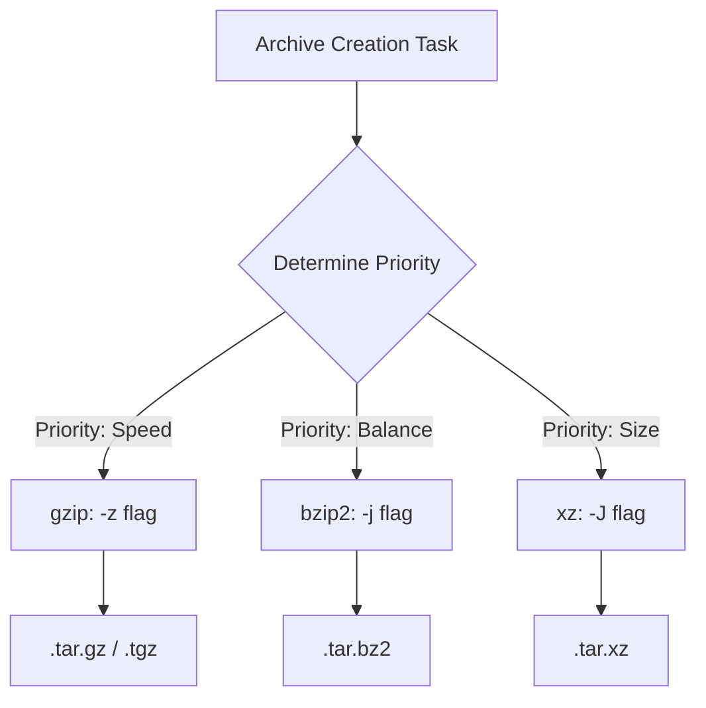

> **Напрямок LFCS** | Складність: `[СЕРЕДНЯ]` | Час: 45-60 хв | Контекст Kubernetes: 1.35+

## Передумови

- **Обов'язково**: [Стратегія та робочий процес іспиту LFCS](../module-1.1-exam-strategy-and-workflow/) для моделі розподілу часу
- **Обов'язково**: [Модуль 1.3: Ієрархія файлової системи](/linux/foundations/system-essentials/module-1.3-filesystem-hierarchy/) для шляхів, посилань та структури файлів
- **Корисно**: [Модуль 7.2: Обробка тексту](/linux/operations/shell-scripting/module-7.2-text-processing/) для конвеєрів, фільтрів та пошуку

## Результати навчання

- Оцінювати інструменти командного рядка, щоб обирати найшвидшу та найбезпечнішу утиліту для зміни стану системи під тиском.
- Реалізовувати надійний пошук файлів та перевірку метаданих за допомогою точних інструментів, як-от `find`, `grep` та `stat`.
- Діагностувати проблеми з порядком перенаправлення в оболонці та виправляти збої виводу в конвеєрах, перш ніж вони приховають помилки.
- Порівнювати алгоритми стиснення архівів, щоб збалансувати швидкість виконання, безпеку відновлення та ефективність зберігання.
- Виробити звички перевірки до та після виконання, які усувають припущення про стан системи.

## Чому цей модуль важливий

Цей модуль містить виробничий повчальний випадок про послідовність команд і перевірку під тиском. Його найкраще читати як нагадування про те, що рутинні команди стають дуже впливовими, коли час, обсяг і припущення починають розходитися. Канонічний опис інциденту та повний контекст уроку дивіться у [Модулі 0.2: Що таке термінал?](/prerequisites/zero-to-terminal/module-0.2-what-is-a-terminal/).

Іспит LFCS стискає той самий стиль тиску до контрольованого середовища. Вас не просять милуватися командами Linux здалеку; вас просять змінити живу систему, зберегти те, що має бути збережене, видалити лише те, що має бути видалене, і довести отриманий стан. Кандидат, який уміє декламувати прапорці `tar`, але не може перевірити, куди буде розпакований архів, усе одно ризикує наосліп. Кандидат, який знає `grep`, але запускає його рекурсивно з `/`, може змарнувати хвилини на читання нерелевантних даних, поки справжнє завдання залишається невиконаним.

Цей модуль перетворює набір основних команд на свідомий метод роботи. Ви попрактикуєтеся обирати між інструментами, брати шаблони в лапки, щоб оболонка не переінакшувала ваш намір, перевіряти метадані замість того, щоб вгадувати, перенаправляти вивід, не втрачаючи помилок, і будувати архіви, які справді можна відновити. Мета — не запам'ятати довгий каталог команд. Мета — виробити повторюваний ритм: перевір поточний стан, виконай найвужчу безпечну команду, а потім перевір результат, перш ніж переходити до наступного завдання.

## Стратегічний вибір інструмента: за станом, а не за звичкою

Більшість помилок з командами LFCS починається ще до того, як команду набрано. Кандидат бачить знайомий іменник, як-от «файл», «лог» чи «резервна копія», і хапається за перший інструмент, що спадає на думку. Досвідчені адміністратори починають на крок раніше: вони питають, яку саме частину стану системи вони намагаються змінити чи спостерегти. Якщо проблема — у метаданих каталогу, читати вміст файлів марнотратно. Якщо проблема — у вмісті всередині відомого набору файлів, обхід кожного inode на машині марнотратний. Якщо проблема — зберегти конфігураційний файл перед редагуванням, переміщення є хибною ментальною моделлю, бо воно видаляє оригінальний шлях.

Уявляйте командний рядок як набір інструментів, а не як один молоток. `cp` дублює дані й часто створює новий inode, тому він доречний, коли вам потрібна незалежна резервна копія або паралельна копія зі збереженим власником. `mv` змінює записи в каталозі, коли джерело та призначення на одній файловій системі, тому це правильний інструмент для перейменування та реструктуризації без читання вмісту файлу. Ця відмінність важлива, коли файл крихітний, але вона важить ще більше, коли файл сягає десятків гігабайтів, а годинник іспиту йде.

Операційна звичка — визначити межу, яка керує поведінкою команди. Для `mv` межа — це файлова система; у межах однієї файлової системи операція зазвичай є оновленням метаданих, а між файловими системами вона стає копіюванням з наступним видаленням. Для `cp` межа — це вимога до збереження; проста копія може втратити деталі власника та позначки часу, які важливі для служб. Для `find` межа — це корінь пошуку; занадто високий старт створює шум і ризик. Для `grep` межа — це обсяг вмісту; він потужний після того, як ви звузили каталог, але дорогий, коли його використовують як сліпий інструмент для виявлення.

```bash
pwd
ls -lah
cd /path/to/dir
mkdir -p /srv/app/{config,data,logs}
cp source.txt dest.txt
mv oldname.txt newname.txt
rm -r temp-dir
touch /tmp/checkpoint
```

Наведені вище команди настільки прості, що багато хто з тих, хто навчається, їх недооцінює. `pwd` захищає вас від дій у неправильному каталозі, `ls -lah` дає швидкий огляд прихованих імен та зрозумілих людині розмірів файлів, а `mkdir -p` дозволяє створювати вкладені шляхи, не зазнаючи збою, коли батьківський каталог відсутній. Розкриття дужок у `/srv/app/{config,data,logs}` — це можливість оболонки, а не можливість `mkdir`, тому оболонка розкриває її у три конкретні шляхи ще до запуску `mkdir`. Це зручно, коли ви цього прагнете, і небезпечно, коли забуваєте, що оболонка спершу редагує список аргументів.

Зробіть паузу й передбачте: якщо `/srv/app` не існує, що зміниться, коли ви приберете `-p` з наведеної вище команди `mkdir`? Команда більше не створює відсутніх батьківських каталогів, тому створення вкладеного каталогу зазнає збою ще до того, як з'явиться якийсь корисний стан. Цей крихітний прапорець — різниця між ідемпотентною командою налаштування та крихкою командою, яка працює лише після ручної підготовки. На іспиті віддавайте перевагу командам, які безпечно перезапускати, коли перезапуск має сенс, бо команди, які можна безпечно перезапускати, знижують вартість виправлення друкарської помилки чи повторення кроку лабораторної.

Копіювання та переміщення теж заслуговують на більшу точність, ніж натякають їхні назви. Проста команда `cp source.txt dest.txt` створює або перезаписує файл призначення в контексті користувача, що викликає команду, що цілком прийнятно для тимчасових даних, але ризиковано для конфігурації служби. Коли важать власник, права доступу, позначки часу, посилання та рекурсивний вміст каталогу, `cp -a` зазвичай є безпечнішою адміністративною копією, бо зберігає більше метаданих. Натомість `mv oldname.txt newname.txt` — це найчистіше перейменування в межах однієї файлової системи, але його не варто розглядати як резервну копію, бо оригінальний шлях зникає.

Швидке правило вибору — не «завжди використовуй коротшу команду». Використовуйте `mv`, коли бажаний стан — це один шлях, що замінює інший шлях. Використовуйте `cp`, коли бажаний стан — це два незалежні шляхи, особливо перед редагуванням файлу в `/etc`. Використовуйте `rm` лише після кроку перевірки шляху й віддавайте перевагу видаленню точно названого тестового каталогу, а не широких шаблонів. Система оцінювання LFCS бачить кінцевий стан, але ваш процес визначає, чи буде той кінцевий стан саме тим, який ви мали намір створити.

## Глобінг, екранування та перший хід оболонки

Перш ніж `ls`, `rm`, `find` чи майже будь-яка інша зовнішня команда отримає свої аргументи, перший хід робить оболонка. Вона розкриває символи підстановки, виконує розкриття дужок, прибирає лапки й передає програмі отриманий вектор аргументів. Цей порядок потужний, бо дозволяє стисло виражати багато шляхів. Він також є одним із найлегших способів видати команду, яка вже не означає того, що ви думали.

Важлива ментальна модель полягає в тому, що глоб — це не шаблон, що автоматично передається кожному інструменту. Неекранований `*.log` належить спершу оболонці. Якщо файли в поточному каталозі збігаються, оболонка замінює шаблон цими локальними іменами файлів ще до того, як `find` чи `tar` щось побачать. Якщо жоден файл не збігається, багато оболонок залишають буквальний шаблон на місці, а це означає, що та сама команда може поводитися по-різному залежно від поточного каталогу. Саме ця залежність від контексту й робить неекрановані шаблони частою пасткою на іспиті.

- `*`: Збігається з нулем або більше символів, але **не** з провідною крапкою. Наприклад, `*.log` збігається з `error.log`, але **не** з прихованим файлом `.log` — щоб збігатися з прихованими файлами, треба явно написати провідну крапку (наприклад, `.*log`).
- `?`: Збігається рівно з одним символом. Наприклад, `file?.txt` збігається з `file1.txt`, але не з `file10.txt`.
- `[abc]`: Збігається з будь-яким одним символом, наведеним усередині дужок.
- `[!abc]` або `[^abc]`: Збігається з будь-яким одним символом, не наведеним усередині дужок.

Коли ви набираєте `find /var/log -name *.log`, ви просите поточну оболонку вирішити, чи має `*.log` розкритися перед запуском `find`. Якщо ваш поточний каталог містить `local.log`, команда стає `find /var/log -name local.log`. Якщо він містить `alpha.log` та `beta.log`, команда стає `find /var/log -name alpha.log beta.log`, що може спричинити помилку, бо `find` не очікує кількох окремих аргументів після `-name`. Виправлення — брати в лапки шаблони, призначені для цільової команди: `find /var/log -name "*.log"`.

Та сама ідея пояснює, чому широкі команди видалення потребують кроку перевірки. Якщо каталог містить файли з іменами `app.js`, `server.js` та `-rf`, розкриття оболонки для `rm *` може поставити `-rf` у список аргументів так, ніби ви набрали опцію. Багато інструментів надають захисні прапорці, як-от `--`, щоб позначити кінець опцій, а обережні адміністратори також використовують `ls -la` або `printf '%s\n' ./*`, щоб переглянути імена перед видаленням. Практичний урок — не страх перед символами підстановки; це повага до того, хто інтерпретує їх першим.

Сценарій вправи: вас просять прибрати лише згенеровані логи в `/tmp/lfcs-glob`, а каталог містить файли з попереднього практичного запуску. Безпечний робочий процес — вивести збіги, брати шаблони в лапки, коли викликаний інструмент має сам виконувати зіставлення, і видаляти лише після того, як показані шляхи збіглися з вашим наміром. Це той самий робочий процес, який ви використаєте під час роботи з логами вузлів Kubernetes 1.35+ або файлами середовища виконання контейнерів на хості Linux: спершу зробіть розкриття оболонки видимим, потім дійте.

```bash
mkdir -p /tmp/lfcs-glob
touch /tmp/lfcs-glob/app.log /tmp/lfcs-glob/server.log /tmp/lfcs-glob/notes.txt
find /tmp/lfcs-glob -type f -name "*.log" -print
rm -- /tmp/lfcs-glob/app.log /tmp/lfcs-glob/server.log
```

Перш ніж це запустити, який вивід ви очікуєте від команди `find` і чому `rm --` містить подвійне тире? Очікуваний вивід — два файли `.log`, бо екранований шаблон обчислюється командою `find` щодо імен у `/tmp/lfcs-glob`, а не оболонкою щодо вашого поточного каталогу. `--` повідомляє `rm`, що подальші аргументи є операндами, а не опціями, що захищає вас, коли ім'я файлу починається з тире. Це маленька звичка з великою користю для безпеки.

Глобінг також взаємодіє з розкриттям дужок у спосіб, що допомагає швидко будувати структури. Команда `mkdir -p /srv/app/{config,data,logs}` — це не три виклики `mkdir`; це один виклик із трьома аргументами-шляхами, які створила оболонка. Це ефективно, коли вам потрібне передбачуване дерево. Це не заміна читанню отриманого дерева, бо оболонка радо розкриє саме те, що ви написали, включно з орфографічними помилками.

```bash
mkdir -p /tmp/drill1/{dir1,dir2,dir3}
touch /tmp/drill1/dir1/file1.txt /tmp/drill1/dir2/file2.txt /tmp/drill1/dir3/file3.txt
ln /tmp/drill1/dir1/file1.txt /tmp/drill1/dir1/hardlink.txt
ln -s /tmp/drill1/dir2/file2.txt /tmp/drill1/dir2/symlink.txt
ls -li /tmp/drill1/dir1  # Note identical inode numbers for file1 and hardlink
readlink /tmp/drill1/dir2/symlink.txt
```

Ця вправа робить більше, ніж створює іграшкове дерево. Вона дає вам побачити, як записи каталогу пов'язані з inode, що є основою для розуміння, чому жорсткі та символічні посилання поводяться по-різному. Коли `ls -li` показує однакові номери inode для `file1.txt` та `hardlink.txt`, ви дивитеся не на два незалежні вмісти файлів. Ви дивитеся на два імені для одного й того самого базового inode, і саме цей факт зумовлює як силу, так і обмеження жорстких посилань.

## Пошук, метадані та видобування тексту

Команди пошуку стають надійними, коли ви розділяєте три питання: де має починатися пошук, який тип об'єкта має збігатися і чи зіставляєте ви метадані, чи вміст файлу. `find` відповідає на питання про метадані, обходячи записи каталогу й перевіряючи імена, типи, розміри, час, власника та права доступу. `grep` відповідає на питання про вміст, відкриваючи файли й скануючи байти. `stat` відповідає на питання про ідентичність та метадані для конкретного шляху. Змішування цих ролей — ось як простий пошук перетворюється на повільне сканування всієї системи.

Коли ви не знаєте, де розташований файл, починайте з `find` і обмежте початковий шлях. Пошук від `/` може перетинати віртуальні файлові системи, як-от `/proc` та `/sys`, спускатися в точки монтування, які ви не збиралися чіпати, і друкувати багато помилок доступу. На іспиті цей шум випалює час і ховає сигнал. Початок із `/etc`, `/var/log`, `/srv` або з каталогу під конкретне завдання зазвичай дає достатнє охоплення, не перетворюючи виявлення на повномашинне сканування.

```bash
find /var/log -name "*.log"
find /etc -type f -mtime -1
grep -R "error" /var/log
sed -n '1,20p' /etc/fstab
awk -F':' '{print $1, $3}' /etc/passwd
```

Перші дві команди ставлять питання про метадані: які імена закінчуються на `.log` і які звичайні файли в `/etc` нещодавно змінилися. Команда `grep` ставить питання про вміст, тому вона відкриває файли в `/var/log` і шукає рядок `error`. Команда `sed` друкує контрольований діапазон рядків, не відкриваючи редактора, а команда `awk` друкує вибрані поля з кожного вхідного рядка. Ці інструменти перетинаються на межах, але їхні сильні сторони достатньо відмінні, щоб вдалий вибір заощаджував і час, і помилки.

Для роботи з LFCS `stat` — це інструмент, який перетворює підозру на доказ. `ls -l` створено для людського перегляду, а отже, його вивід може залежати від локалі та бути візуально стиснутим. `stat` відкриває точні режими прав доступу, номери inode, кількість посилань, власника, розмір та позначки часу у формі, яка набагато краща для перевірки. Коли завдання каже, що файл повинен мати режим `0640`, найшвидша надійна перевірка — не вдивлятися в `rw-r-----`; це попросити `stat` показати числовий режим.

```bash
ln file-a file-a.hardlink
ln -s /etc/systemd/system/my.service /tmp/my.service
stat /etc/hosts
file /bin/ls
```

Жорсткі та символічні посилання — корисна перевірка того, чи точно ви досліджуєте стан. Жорстке посилання — це ще один запис каталогу, що вказує на той самий inode, тому воно не може перетинати межі файлової системи, а звичайні користувачі не можуть створювати жорсткі посилання на каталоги. Символічне посилання — це окремий файл, вмістом якого є шлях до іншого шляху, тому воно може перетинати файлові системи й вказувати на каталоги, але може стати «висячим», якщо ціль переміститься. `readlink`, `ls -li` та `stat` дають змогу довести, який саме випадок ви бачите, замість того щоб вгадувати за іменем файлу.

Видобування тексту має той самий принцип: використовуйте інструмент, що відповідає обсягу потрібних змін. Відкривати великий файл в інтерактивному редакторі, щоб скопіювати рядки з 15 по 30, повільніше й ризикованіше, ніж передавати потоком вибраний діапазон через `sed`. Використовувати `awk`, щоб надрукувати поля зі структурованого файлу, зрозуміліше, ніж зчіплювати кілька крихких `cut`, коли роздільник відомий. Ці команди не просто коротші; вони зменшують кількість ручних рухів курсора та прихованих припущень у операції.

```bash
find /etc -name "*.conf"
grep -R "root" /var/log
sed -n '1,10p' /etc/passwd
awk -F':' '{print $1, $3}' /etc/passwd
```

Ця вправа навмисно звичайна, бо звичайні команди — це те, що ви виконуєте під тиском. Краща версія `grep -R "root" /var/log` часто додавала б `--binary-files=without-match` або ще більше звужувала б шлях, але головна думка залишається: використовуйте рекурсивний пошук вмісту лише після того, як каталог стане достатньо малим, щоб відкривати файли було виправдано. Якщо завдання — лише знайти імена конфігураційних файлів, `find /etc -name "*.conf"` уникає читання вмісту кожного конфігураційного файлу.

Зробіть паузу й передбачте: якщо `/etc` містить і файли, і каталоги, змінені протягом останньої доби, що поверне `find /etc -mtime -1` порівняно з `find /etc -type f -mtime -1`? Перша команда може повернути будь-який об'єкт файлової системи, що проходить перевірку часу, тоді як друга повертає лише звичайні файли. Цей предикат `-type f` маленький, але він прибирає хибні спрацювання й не дає пізнішим командам випадково трактувати каталоги як файли.

Іспитова звичка — ретельно зчіплювати виявлення та перевірку. Поширений патерн — `find`, щоб визначити кандидатів, `stat`, щоб дослідити конкретного кандидата, `sed` чи `awk`, щоб видобути маленький доказ, а потім фінальний `ls`, `stat` чи контрольну суму після зміни. Вам не потрібен складний скрипт для кожного завдання. Вам потрібна надійна послідовність, що звужує стан системи, доки наступна команда не стане очевидною.

## Перенаправлення та конвеєри без втрати доказів

Команди Linux спілкуються через файлові дескриптори, а перенаправлення змінює, куди ці дескриптори вказують. Стандартний вивід — це дескриптор 1, стандартна помилка — дескриптор 2, а стандартний ввід — дескриптор 0. Ця відмінність важлива, бо команда може водночас видавати корисні результати в stdout, повідомляючи про збої в stderr. Якщо ви захопите один потік і втратите інший, ваш лог може виглядати успішним, тоді як термінал тихо показав помилку, що пояснює збій.

```bash
command > out.txt
command 2> err.txt
command >> append.txt
command | grep -i warning
cat input.txt | sort | uniq -c | sort -nr
```

Оболонка обробляє перенаправлення зліва направо. `command > file.log 2>&1` спершу спрямовує stdout у `file.log`, потім спрямовує stderr туди, куди наразі вказує stdout, тобто теж у `file.log`. Візуально схожа `command 2>&1 > file.log` робить дещо інше. Вона спершу спрямовує stderr на поточний stdout, тобто на термінал, і лише потім спрямовує stdout у файл. Результат — лог, що захоплює звичайний вивід, тоді як помилки залишаються на екрані.

Це правило порядку — частe джерело хибної впевненості, бо файл існує й щось містить. Кандидат бачить `output.log`, припускає, що скрипт захоплено повністю, і рухається далі, поки значущий збій прокручувався повз. Безпечний робочий процес — вирішити, чи потрібні вам окремі потоки, об'єднані потоки або видимість на терміналі, ще до запуску команди. Для діагностики окремі файли можуть бути зрозумілішими; для журналів аудиту краще можуть бути об'єднані потоки в правильному порядку.

```bash
ls /tmp > output.txt
ls /fake-directory 2> error.txt
echo "More output" >> output.txt
cat output.txt | grep -i data | wc -l
```

Конвеєри вносять ще одну тонкість: за замовчуванням кожна команда отримує stdout попередньої команди, а не її stderr. Якщо ліва частина зазнає збою й пише лише в stderr, права частина може не обробити жодного вводу, тоді як загальний рядок усе одно залишить вас із оманливим враженням. У інтерактивній практиці це прикрість. У роботі на іспиті це може приховати причину, чому ваш пізніший файл порожній. Коли потік помилок важить, перенаправляйте його навмисно або досліджуйте окремо.

Приклад `cat output.txt | grep -i data | wc -l` навмисно простий, бо він навчає форми конвеєра. У щоденному адмініструванні ви часто написали б `grep -i data output.txt | wc -l` і пропустили б зайвий `cat`, але повний ланцюжок корисний, щоб побачити, як рухаються дані. Головне — кожен етап повинен мати причину. Якщо етап не перетворює, не фільтрує, не рахує й не форматує потік, приберіть його.

Перш ніж це запустити, чим відрізнятимуться `ls /fake-directory > both.log 2>&1` та `ls /fake-directory 2>&1 > both.log`? У першій команді повідомлення про помилку потрапляє в `both.log`; у другій повідомлення про помилку залишається на терміналі, бо stderr скопійовано перш ніж stdout перемістився. Це те саме правило «зліва направо» щоразу, і практикування його з нешкідливим відсутнім каталогом робить правило таким, що запам'ятовується, без шкоди для системи.

Конвеєри — це також місце, де перевірка має бути явною. Якщо ви будуєте звіт за допомогою `sort | uniq -c | sort -nr`, перевірте, чи отриманий файл непорожній, чи мають сенс верхні рядки і чи був stderr захоплений або переглянутий. Правильний конвеєр — це той, чиї входи, перетворення та виходи ви можете пояснити. Якщо ви не можете пояснити, куди поділися помилки, ви не завершили команду.

## Архіви, стиснення та безпека відновлення

Завдання з архівами перевіряють більше, ніж пам'ять про прапорці. Вони перевіряють, чи вмієте ви створити переносний пакунок, обрати доречний компроміс зі стисненням, переглянути вміст перед розпакуванням і відновити дані в потрібний каталог. `tar` об'єднує файли в один архів, але стиснення обирається окремо прапорцями, як-от `-z`, `-j` чи `-J`. Опція `-C` змінює каталог перед читанням чи записом шляхів архіву, що робить її одним із найважливіших прапорців безпеки в робочому процесі архівування LFCS.

```bash
# gzip (fastest, most common)
tar -czf backup.tar.gz /etc/myapp
tar -xzf backup.tar.gz -C /tmp/restore

# bzip2 (smaller archives, slower)
tar -cjf backup.tar.bz2 /etc/myapp
tar -xjf backup.tar.bz2 -C /tmp/restore

# xz (smallest archives, slowest)
tar -cJf backup.tar.xz /etc/myapp
tar -xJf backup.tar.xz -C /tmp/restore
```

Ці приклади показують три поширені родини стиснення, але команда виробничої якості зазвичай покращує обробку шляхів. Створення архіву з `/etc/myapp` може зберегти інформацію про абсолютний шлях або видавати попередження залежно від реалізації. Чистіший патерн — перейти в батьківський каталог і заархівувати відносне дочірнє ім'я: `tar -czf backup.tar.gz -C /etc myapp`. Так розпакування створює `myapp` під обраним каталогом відновлення, замість того щоб намагатися відтворити шлях, укорінений у `/`.

```bash
gzip file.txt          # produces file.txt.gz, removes original
gunzip file.txt.gz     # restores file.txt
bzip2 file.txt         # produces file.txt.bz2 (removes original)
bunzip2 file.txt.bz2
xz file.txt            # produces file.txt.xz
unxz file.txt.xz
```

Окремі інструменти стиснення перетворюють по одному файлу за раз і зазвичай замінюють оригінал стиснутою версією. Така поведінка дивує тих, хто навчається й очікував, що копія залишиться. `tar` інший, бо він створює окремий файл архіву, залишаючи дерево джерела недоторканим, якщо ви не додасте незвичних опцій. Коли збереження джерела важить, знайте, чи ваш інструмент об'єднує, стискає на місці, чи робить і те, і те.

```bash
zip -r backup.zip /srv/data
unzip backup.zip -d /tmp/restore
```

`zip` та `unzip` поширені у змішаних середовищах, бо формат широко зрозумілий за межами Unix-подібних систем. Вони зазвичай не є першим вибором для резервних копій служб Linux, але кандидати LFCS мають упізнавати синтаксис і знати, як спрямувати розпакування за допомогою `-d`. Призначення відновлення важить більше, ніж назва формату. Чистий шлях розпакування не дає вмісту архіву розлитися у ваш поточний робочий каталог.

```bash
find /etc/myapp -print | cpio -ov > backup.cpio
cpio -idv < backup.cpio
```

`cpio` трапляється рідше у щоденному адмініструванні, та все ж він залишається частиною традиційної родини архівів Unix і може з'являтися в цілях іспиту. Його ментальна модель орієнтована на конвеєр: одна команда постачає список імен шляхів, а `cpio` пише чи читає архів на основі цього списку. Це робить точність вводу критичною. Якщо команда `find` занадто широка, архів сумлінно міститиме забагато.

| Прапорець | Компресор | Розширення |
|------|-----------|-----------|
| `-z` | gzip | `.tar.gz` / `.tgz` |
| `-j` | bzip2 | `.tar.bz2` |
| `-J` | xz | `.tar.xz` |



Граф рішень навмисно простий, бо вибір архіву часто починається з єдиного домінантного обмеження. `gzip` зазвичай є найшвидшим практичним типовим вибором і широко підтримується. `bzip2` може давати менший вивід ціною швидкості. `xz` часто стискає ще менше, але час стиснення може бути помітно вищим. На іспиті потрібне розширення чи команда можуть вирішити за вас; у роботі час відновлення та доступний CPU важать так само, як і кінцевий розмір архіву.

```bash
tar -tzf backup.tar.gz             # list contents without extracting
tar -tjf backup.tar.bz2
tar -tJf backup.tar.xz
md5sum backup.tar.gz > backup.md5  # create checksum
md5sum -c backup.md5               # verify later
```

Перегляд перед розпакуванням — це архівний еквівалент перевірки `pwd` перед видаленням. Він каже вам, чи містить архів `myapp/file.conf`, `/etc/myapp/file.conf` чи несподіваний каталог верхнього рівня. Контрольні суми відповідають на інше питання: чи збігаються пізніше байти архіву з байтами архіву, які ви записали. Жоден крок сам по собі не доводить коректності на рівні застосунку, але разом вони ловлять багато усувних збоїв ще до того, як ви щось перезапишете чи відновите.

```bash
mkdir -p /tmp/drill3/source && echo "data" > /tmp/drill3/source/file1.txt
tar -czf /tmp/drill3/backup.tar.gz -C /tmp/drill3 source
tar -tzf /tmp/drill3/backup.tar.gz
mkdir -p /tmp/drill3/restore-gz
tar -xzf /tmp/drill3/backup.tar.gz -C /tmp/drill3/restore-gz
diff /tmp/drill3/source/file1.txt /tmp/drill3/restore-gz/source/file1.txt
```

Цей перший раунд відновлення тренує повний життєвий цикл, а не лише створення архіву. Комбінація `-C /tmp/drill3 source` зберігає в архіві відносний каталог `source`. Рядок `tar -tzf` доводить розкладку архіву перед розпакуванням, а рядок `diff` доводить відновлений вміст щодо оригінального файлу. Цей останній доказ — звичка, яку багато кандидатів пропускають, бо команда архівування начебто спрацювала успішно.

```bash
tar -cjf /tmp/drill3/backup.tar.bz2 -C /tmp/drill3 source
tar -tjf /tmp/drill3/backup.tar.bz2
mkdir -p /tmp/drill3/restore-bz2
tar -xjf /tmp/drill3/backup.tar.bz2 -C /tmp/drill3/restore-bz2
```

```bash
tar -cJf /tmp/drill3/backup.tar.xz -C /tmp/drill3 source
tar -tJf /tmp/drill3/backup.tar.xz
mkdir -p /tmp/drill3/restore-xz
tar -xJf /tmp/drill3/backup.tar.xz -C /tmp/drill3/restore-xz
```

```bash
find /tmp/drill3/restore-gz -type f | wc -l
md5sum /tmp/drill3/source/file1.txt /tmp/drill3/restore-gz/source/file1.txt
```

Раунди bzip2 та xz зберігають ту саму структуру, змінюючи лише прапорець стиснення та прапорець перегляду. Це повторення навмисне. Ви хочете, щоб ваші руки запам'ятали, що `-j` поєднується з bzip2, а `-J` поєднується з xz, тоді як ваш розум залишається зосередженим на розкладці архіву та перевірці. Фінальні команди підрахунку файлів та контрольної суми не є декоративними; вони змушують вас довести, що розпакування створило файли і що принаймні один відновлений вміст збігається з джерелом.

## Перевірка як операційний цикл

Перевірка — це не фінальний контрольний список, прикріплений до кінця системного адміністрування. Це цикл, що оточує кожну ризиковану команду: спостерегти стан, обрати вузьку команду, виконати, спостерегти стан знову й лише потім продовжити. Цей цикл особливо важливий для основних команд, бо вони часто руйнівні або мовчазні при успіху. `mv` може нічого не надрукувати, `rm` може нічого не надрукувати, а `tar` може створити архів, який виглядає правдоподібно, доки не настане час відновлення.

Для практики LFCS трактуйте кожну команду як таку, що має передумову й післяумову. Передумова для `rm -r temp-dir` — що `temp-dir` справді є наміченим каталогом, а не несподіванкою від розкриття глоба. Післяумова — що каталог зник і жоден непов'язаний шлях не змінився. Передумова для `tar -xzf backup.tar.gz -C /tmp/restore` — що `/tmp/restore` існує і архів містить розкладку, яку ви очікуєте. Післяумова — що відновлене дерево існує під каталогом відновлення й містить очікувані файли.

Ефективний цикл перевірки короткий і конкретний. Використовуйте `pwd`, щоб підтвердити робочий каталог, `ls -la`, щоб дослідити імена шляхів включно з прихованими файлами, `stat -c '%a %U %G %n'`, щоб перевірити режим та власника, `find ... -type f | wc -l`, щоб порахувати відновлені файли, та `diff` чи контрольні суми, щоб порівняти критичний вміст. Уникайте довгих команд перевірки, яким важче довіряти, ніж самій операції. Доказ має зменшувати невизначеність, а не створювати другу проблему з налагодженням.

Сценарій вправи: вам потрібно змінити конфігураційний файл служби й зберегти копію для відкату. Безпечний цикл — дослідити файл, скопіювати його зі збереженими метаданими, перевірити, що резервна копія існує, внести зміну й порівняти результат. Це не повільніше за імпровізацію, коли ви врахуєте вартість відновлення після поганого редагування. Це також віддзеркалює дисципліну, очікувану, коли ви згодом адмініструватимете вузли Kubernetes 1.35+, де зміна хоста Linux може вплинути на робочі навантаження над ним.

```bash
stat /etc/hosts
cp -p /etc/hosts /tmp/hosts.backup
stat /tmp/hosts.backup
sed -n '1,20p' /etc/hosts
```

Приклад використовує `/etc/hosts`, бо він існує на звичайних системах Linux і його безпечно досліджувати, тоді як резервна копія потрапляє в `/tmp`, а не замінює системну конфігурацію. `cp -p` зберігає режим, власника (де дозволено) та позначки часу ретельніше за просту копію. `stat` до й після дає вам доказ, що джерело та резервна копія існують із метаданими, які ви очікуєте. `sed -n '1,20p'` дає обмежений перегляд вмісту без відкриття редактора.

Цей цикл також захищає вас від спокусливої швидкості м'язової пам'яті. Швидкий набір корисний лише тоді, коли команда правильна для поточного хоста, шляху та файлової системи. Найкращі кандидати LFCS нарощують швидкість, зменшуючи кількість виборів, а не пропускаючи перевірки. Вони знають, яка команда-доказ має йти після кожної операції, тому перевірка стає частиною робочого процесу, а не окремою церемонією.

## Репетиція команд у темпі іспиту

Репетиція команд відрізняється від побіжного перегляду команд. Під час побіжного перегляду ви читаєте команду, киваєте, бо вона виглядає знайомою, і рухаєтеся далі. Під час репетиції ви змушуєте команду нести конкретне операційне питання: який стан існує до команди, який стан має існувати після неї і який доказ підтвердить зміну. Це обрамлення перетворює основні команди на компактну діагностичну мову, а не на купу ізольованих рецептів.

Гарний раунд репетиції починається з чистого робочого простору й таймера, але таймер тут не для того, щоб винагороджувати нерозважливу швидкість. Він існує, щоб виявити, які рішення все ще потребують надто багато свідомих зусиль. Якщо ви робите паузу щоразу, коли обираєте між `find` та `grep`, ліки — не запам'ятати більше прапорців; ліки — потренуватися класифікувати питання як метадані чи вміст. Якщо ви робите паузу щоразу, коли створюєте архів, ліки — потренуватися називати батьківський каталог та дочірній шлях перед набором `tar`.

Найсильніші сесії практики також навмисно включають дрібні збої. Запустіть нешкідливу команду зі зворотним порядком перенаправлення, дослідіть, куди потрапив stderr, потім виправте це. Створіть архів із незручною розкладкою шляхів, перегляньте його й поясніть, чому ви не відновлювали б його поверх важливого каталогу. Створіть символічне посилання, перемістіть ціль і використайте `readlink` плюс `stat`, щоб діагностувати висячий шлях. Контрольовані помилки будують розпізнавання, не перетворюючи вашу справжню систему на навчальний клас.

Коли практикуєте пошук файлів, шукайте не лише імена, що існують. Пошукайте ім'я, якого не існує, і спостерігайте форму чистого збою. Пошукайте під каталогом, що має і файли, і підкаталоги, потім додайте `-type f` і порівняйте набір кандидатів. Пошукайте вміст у навмисно малому каталозі логів, потім поясніть, чому той самий `grep -R` був би недоречним із `/`. Ці контрасти роблять межі рішень достатньо конкретними, щоб згадати їх під час іспиту.

Коли практикуєте перевірку метаданих, змушуйте себе сказати, що `stat` доведе, перш ніж ви його запустите. Він може довести, що два жорстко зв'язані імені поділяють inode, що скопійована резервна копія зберегла режим або що відновлений файл має очікуваного власника. Суть — уникати трактування інспекційних команд як декоративного виводу. Якщо доказ не відповідає на питання, загострюйте питання, доки результат команди не змінить вашу впевненість.

Репетиція архівів завжди має включати відновлення, бо саме лише створення — це лише половина роботи. Кандидат, який може створити `backup.tar.gz`, але не може передбачити розкладку його розпакування, не продемонстрував навичку резервного копіювання. Перегляньте архів, відновіть його у виділений каталог, порівняйте принаймні один файл і видаляйте практичне дерево лише після того, як зможете описати передумову й післяумову. Ця звичка запобігає хибному відчуттю безпеки навколо файлів, що просто мають правдоподібні імена.

Ви також можете репетирувати вибір команд, записуючи однорядкові наміри перед рядками команд. Наприклад: «перемістити цей шлях, не зберігаючи оригінал», «дублювати цю конфігурацію з метаданими», «знайти звичайні файли, змінені нещодавно» або «захопити stdout та stderr разом». Потім оберіть `mv`, `cp -p`, `find -type f -mtime` чи правильний синтаксис перенаправлення, щоб відповідати наміру. Ця вправа корисна, бо завдання LFCS часто описують бажаний стан прозою, а не іменами команд.

Не оминайте прибирання як частину репетиції. Безпечно видалити практичний каталог означає підтвердити шлях, використати точне ім'я каталогу й довести видалення після. Це та сама дисципліна, яка вам потрібна перед видаленням застарілих логів, тимчасових дерев відновлення чи каталогів невдалого розпакування. Прибирання — це місце, де втомлені кандидати часто використовують найширшу команду сесії, тому воно заслуговує на той самий цикл перевірки, що й налаштування та відновлення.

Нарешті, репетируйте з власними поясненнями. Після кожного раунду поясніть, чому кожна команда була найвужчим безпечним інструментом, яка межа керувала її поведінкою і що довела перевірка. Якщо пояснення звучить розпливчасто, повторіть раунд із меншим прикладом, доки воно не стане точним. Іспит LFCS не оцінює ваше пояснення, але пояснення — це те, як ви тренуєте ухвалення рішень, що породжує оцінюваний кінцевий стан.

Один корисний завершальний дриль — відтворити завдання з кінця назад до початку. Почніть із доказу, який ви хочете, як-от збіжна контрольна сума, очікувана кількість файлів чи рядок `stat`, що показує правильний режим, потім працюйте у зворотному напрямку до команди, яка створила б цей стан. Це зворотне планування виявляє відсутні каталоги, хибні корені архівів та слабкі предикати пошуку ще до того, як ви щось виконаєте. Воно також тренує вас бачити команди як переходи стану, що є основною навичкою за безпечним адмініструванням Linux. Коли доказ зрозумілий першим, команда стає контрольованим засобом для досягнення спостережуваного результату, а не сповненою надії здогадкою щоразу, коли ви практикуєтеся під тиском іспиту.

## Патерни та антипатерни

Патерни в цьому модулі маленькі, але вони масштабуються, бо кодують те, як думають надійні оператори. Безпечна команда `find` на практичному каталозі використовує те саме судження, що й безпечна команда `find` на виробничому вузлі: оберіть вузький корінь, чітко виразіть предикат і дослідіть вивід перед тим, як передавати його по конвеєру в руйнівну команду. Безпечний робочий процес архівування в `/tmp` використовує те саме судження, що й справжня резервна копія: контролюйте збережену розкладку шляхів, переглядайте перед розпакуванням і перевіряйте відновлений вміст.

| Патерн | Коли використовувати | Чому працює | Чинник масштабування |
|---------|-------------|--------------|-----------------------|
| Перевірка перед руйнівною дією | Перед `rm`, перезаписними перенаправленнями, розпакуванням архіву чи рекурсивними переміщеннями | Підтверджує ціль команди, поки виправлення ще дешеве | Використовуйте лаконічні команди-докази, щоб перевірка залишалася швидкою під тиском |
| Пошук за метаданими насамперед | Коли знаходите файли за іменем, віком, типом, власником чи розміром | `find` уникає читання вмісту файлів і може ефективно звужувати кандидатів | Починайте з найменшого правдоподібного каталогу, щоб уникнути віртуальних та віддалених файлових систем |
| Відносна розкладка архіву з `-C` | Коли створюєте переносні архіви для відновлення деінде | Зберігає передбачувані шляхи й уникає випадкового розпакування в абсолютні розташування | Стандартизуйте корені архівів, щоб дрилі відновлення та автоматизація збігалися |
| Потокове видобування для обмежених читань | Коли досліджуєте діапазони чи поля у великих файлах | `sed` та `awk` уникають ризику інтерактивного редактора й мають передбачуваний ввід/вивід | Додавайте роздільники та точні діапазони, щоб команди залишалися читабельними для рецензентів |

Антипатерни зазвичай походять зі спроби заощадити кілька секунд, витрачаючи прихований ризик. Запуск рекурсивного пошуку вмісту з `/` здається рішучим, але він просить систему відкрити набагато більше даних, ніж потребує завдання. Розпакування архіву в поточний каталог здається зручним, але воно ускладнює прибирання й доведення. Перенаправлення виводу без думки про stderr здається охайним, але воно може приховати єдине повідомлення, що пояснює збій.

| Антипатерн | Що йде не так | Краща альтернатива |
|--------------|-----------------|--------------------|
| Сліпий рекурсивний пошук від кореня | Команда марнує час на нерелевантні дерева й видає шумні помилки доступу | Починайте з `find` під каталогом, специфічним для завдання, і додавайте предикати |
| Неекрановані шаблони пошуку | Оболонка розкриває шаблони щодо поточного каталогу перед запуском інструмента | Беріть у лапки шаблони, призначені для інструментів, як-от `find . -name "*.conf"` |
| Створення архіву без доказу відновлення | Синтаксично коректний архів може містити хибний кореневий шлях або пропускати файли | Перегляньте через `tar -t...`, розпакуйте в тестовий каталог, потім порівняйте |
| Об'єднані логи з хибним порядком перенаправлення | Помилки залишаються на терміналі, тоді як stdout іде у файл | Використовуйте `> file.log 2>&1`, коли обидва потоки мають потрапити в один файл |

## Рамка ухвалення рішень

Використовуйте цю рамку, коли завдання здається таким, що треба «зробити щось із файлами», але не одразу розкриває найбезпечнішу команду. По-перше, класифікуйте бажаний стан: спостерегти, дублювати, перемістити, перетворити, видалити чи об'єднати. По-друге, визначте межу, що змінює поведінку: межа файлової системи для `mv`, збереження метаданих для `cp`, корінь пошуку для `find`, вибір потоку для перенаправлення та розкладка шляхів для `tar`. По-третє, оберіть команду-доказ перед тим, як виконати зміну, бо знання того, як ви перевірятимете, часто виявляє слабкий план.

| Форма завдання | Віддавати перевагу | Уникати | Перевірка |
|------------|--------|-------|--------------|
| Перейменувати чи реструктурувати в межах однієї файлової системи | `mv` | `cp` з наступним ручним прибиранням | `ls -li`, `stat` чи перевірки `test -e` за конкретним шляхом |
| Зберегти файл перед редагуванням | `cp -p` чи `cp -a` | `mv` як «резервну копію» | `stat` джерела та копії, потім порівняти вміст за потреби |
| Знайти шляхи за іменем, типом, віком, власником чи розміром | `find` | `grep -R` як виявлення | Спершу надрукувати кандидатів, потім звузити додатковими предикатами |
| Видобути відомі рядки чи поля | `sed`, `awk`, `grep` | Відкривати величезні файли інтерактивно | Порахувати чи показати обмежений вивід і навмисно перенаправити |
| Об'єднати й стиснути дерево | `tar -C parent -c... child` | Архівувати абсолютні шляхи без перевірки розкладки | `tar -t...`, тестове розпакування, кількість файлів, контрольна сума чи `diff` |

```text
+-------------------------------+
| Read the task as desired state |
+-------------------------------+
                |
                v
+-------------------------------+
| Pick the narrowest safe tool   |
| observe / copy / move / search |
| transform / archive / remove   |
+-------------------------------+
                |
                v
+-------------------------------+
| Identify the behavior boundary |
| filesystem / glob / stream /   |
| metadata / archive root        |
+-------------------------------+
                |
                v
+-------------------------------+
| Execute, then prove final state|
| with stat, find, tar -t, diff, |
| checksum, or bounded output    |
+-------------------------------+
```

Рамка навмисно компактна, бо ви маєте змогу застосувати її під час іспиту, не зупиняючись, щоб записати нотатки. Якщо завдання просить вас «перемістити» дані, перевірте, чи справді воно означає перемістити один шлях, чи зберегти копію. Якщо завдання просить вас «знайти» щось, вирішіть, чи ім'я, метадані, чи вміст є властивістю для пошуку. Якщо завдання просить вас «створити резервну копію» чогось, трактуйте доказ відновлення як частину завдання, а не як додатковий бал.

## Чи знали ви?

- У 1988 році формат `ustar` (Unix Standard TAR) було стандартизовано в POSIX.1 (IEEE Std 1003.1-1988), хоча програма Unix `tar` виникла наприкінці 1970-х для запису архівів на послідовну магнітну стрічку.
- Формат файлів `xz` з'явився у 2009 році й використовує алгоритм стиснення LZMA2, який часто покращує розмір порівняно з `gzip`, поступаючись швидкістю стиснення.
- Каталог Linux концептуально є відображенням імен файлів у номери inode, і саме тому жорстке посилання може зробити так, що два імені посилаються на один базовий файловий об'єкт.
- Стандартна команда `cp` була присутня на ранніх етапах історії Unix, а її сучасна адміністративна цінність походить від опцій, що зберігають метадані, як-от `-p` та `-a`.

## Типові помилки

| Помилка | Чому стається | Як виправити |
|---------|----------------|---------------|
| Неекрановані символи підстановки в `find` | Оболонка розкриває `*.txt` до локальних імен файлів перед запуском `find`, спричиняючи синтаксичні помилки чи хибні збіги, коли локально збігається кілька файлів. | Завжди беріть у лапки символи підстановки, що належать інструментам пошуку: `find . -name "*.txt"` |
| `tar` розпаковує абсолютні шляхи | Створення архіву без контролю робочого каталогу може зберегти незручну структуру шляхів, ускладнюючи чисте відновлення. | Використовуйте `tar -C /var/www -czf archive.tar.gz html/app` і перегляньте архів перед розпакуванням. |
| Порядок `2>&1 > file.log` | Розміщення `2>&1` перед перенаправленням виводу відправляє stderr на термінал, а stdout у файл. | Порядок важить: `> file.log 2>&1` забезпечує, що обидва потоки вказують на файл. |
| Жорстке посилання на каталоги | Користувачі намагаються створити жорстке посилання на каталог, щоб заощадити місце чи створити ярлик, але ОС блокує це, щоб запобігти циклам обходу. | Використовуйте символічні посилання для каталогів: `ln -s /source /dest` і перевіряйте ціль через `readlink`. |
| Використання `grep -R` від `/` | Спроба знайти загублений файл за вмістом від кореня змушує `grep` читати двійкові файли, віртуальні файлові системи та змонтовані дерева. | Звузьте обсяг через `find` або обмежте рекурсивний пошук вмісту правдоподібним каталогом, як-от `/etc`. |
| Припущення, що `cp` зберігає власника | Стандартне копіювання може створити новий файл, що належить користувачеві, який виконує команду, ламаючи служби, які залежать від конкретних метаданих. | Використовуйте `cp -p` чи `cp -a`, потім перевіряйте режим та власника через `stat`. |
| Розпакування архівів у поточний каталог | Архів може створити несподівані шляхи верхнього рівня чи перезаписати локальні файли там, де ви випадково працюєте. | Створіть виділений каталог відновлення, перегляньте вміст через `tar -t...`, потім розпакуйте з `-C`. |
| Трактування мовчазного успіху як доказу | Багато команд Unix нічого не друкують при успіху, тому оператор рухається далі, не підтвердивши кінцевого стану. | Поєднуйте кожну зміну з короткою командою-доказом, як-от `stat`, `find`, `diff`, `tar -t` чи контрольна сума. |

## Перевірка знань

<details>
<summary>1. Молодший інженер запускає `find /var/log -name *.log` і отримує помилку «find: paths must precede expression». Чому це сталося і як це виправити?</summary>

Ця помилка стається, бо оболонка розкриває неекранований глоб `*.log` у список імен файлів, наявних у поточному каталозі, перед виконанням `find`. Якщо поточний каталог містить `error.log` та `access.log`, команда може стати `find /var/log -name access.log error.log`, що дає `find` більше аргументів, ніж очікує предикат `-name`. Правильне виправлення — взяти глоб у лапки як `find /var/log -name "*.log"`, щоб `find` отримав шаблон і застосував його під `/var/log`. Це діагностує збій екранування, а не відсутній каталог логів.
</details>

<details>
<summary>2. Вам потрібно перемістити файл бази даних розміром 50 ГБ з `/data1` до `/data2`. Обидва каталоги розташовані на одному розділі XFS. Чи споживатиме ця операція багато CPU чи I/O, і чому?</summary>

Ні, операція має бути майже миттєвою порівняно з копіюванням вмісту, бо джерело та призначення на одній файловій системі. У такому разі `mv` оновлює записи каталогу, тож наявний inode стає досяжним за новим шляхом, замість читання та запису 50 ГБ файлових даних. Вам усе одно слід перевірити припущення про файлову систему, бо перетин межі монтування змінює поведінку на копіювання з наступним видаленням. Правильний доказ — дослідити монтування чи ідентифікатори пристроїв перед переміщенням і перевірити кінцевий шлях після нього.
</details>

<details>
<summary>3. Ви виконуєте скрипт резервного копіювання за допомогою `script.sh 2>&1 > output.log`. Ви очікуєте, що всі помилки виконання запишуться в лог, але помилки з'являються на вашому терміналі. Чому?</summary>

Оболонка обробляє перенаправлення зліва направо, тому `2>&1` спершу спрямовує stderr на поточний stdout, який усе ще є терміналом. Пізніший `> output.log` змінює лише stdout; він не повертається до stderr і не переміщує його у файл. Правильна форма об'єднаного логу — `script.sh > output.log 2>&1`, бо stdout перенаправляється першим, а stderr потім копіюється на нове призначення stdout. Це проблема порядку перенаправлення, а не проблема самого скрипта.
</details>

<details>
<summary>4. Ви під тиском часу маєте заархівувати вебкаталог, розташований у `/var/www/app`. Ви хочете, щоб архів розпаковувався чисто. Ви використовуєте `tar -czf backup.tar.gz -C /backup /var/www/app`. Чи спрацює це як задумано?</summary>

Оскільки `/var/www/app` абсолютний, `-C /backup` ігнорується для розв'язання шляху; `tar` усе одно архівує його, але прибирає провідний `/`, тож архів зберігає `var/www/app/…` (з попередженням *Removing leading /*) замість чистого відносного `app/`. Використовуйте `tar -czf backup.tar.gz -C /var/www app`, щоб він зберіг `app/`. Перегляньте через `tar -tzf backup.tar.gz`, щоб перевірити розкладку до того, як знадобиться відновлення.
</details>

<details>
<summary>5. Служба зазнає збою після того, як ви скопіювали її конфігураційний файл на місце. `ls -l` виглядає достатньо близько, але служба все одно не може прочитати файл. Що слід дослідити далі?</summary>

Використайте `stat`, щоб дослідити точний режим, власника, групу, inode та позначки часу для файлів джерела та призначення. `ls -l` корисний для людського перегляду, але це не найсильніший інструмент перевірки, коли служба залежить від точних метаданих. Якщо призначення було створене простим `cp`, власник чи режим можуть відрізнятися від оригіналу, тож може знадобитися копіювання зі збереженням метаданих, як-от `cp -p` чи `cp -a`. За виправленням має йти ще одна перевірка `stat`, а не ще одна візуальна здогадка.
</details>

<details>
<summary>6. Ви створюєте символічне посилання на конфігураційний файл, потім переміщуєте оригінальний файл у новий каталог. Посилання залишається видимим, але служба повідомляє, що файл відсутній. Що сталося?</summary>

Символічне посилання — це власний об'єкт файлової системи, що містить шлях до цілі, тому переміщення цілі може залишити посилання висячим. Видиме ім'я посилання не доводить, що цільовий шлях усе ще існує. Ви можете діагностувати це за допомогою `readlink`, щоб показати збережений шлях, та `stat` чи `test -e`, щоб перевірити ціль. Ремонт — відтворити символічне посилання з новим цільовим шляхом або перемістити ціль назад на шлях, на який посилається посилання.
</details>

<details>
<summary>7. Вам потрібно видобути конфігураційні рядки з 15 по 30 з величезного 10-ГБ файлу логу й перенаправити їх у новий файл. Чому слід використовувати `sed` замість відкриття файлу в інтерактивному редакторі?</summary>

Інтерактивний редактор може витратити час і пам'ять на побудову буферів для величезного файлу, а ручний вибір створює зайвий ризик помилки під тиском. Потоковий редактор, як-от `sed -n '15,30p' file.log > output.txt`, читає передбачувано й записує лише запитаний діапазон. Це реалізує видобування командою, яку можна повторити, переглянути й чисто перенаправити. Правильний наступний крок — перевірити вихідний файл через `wc -l` чи обмежений показ `sed -n`.
</details>

## Практична вправа

Ця вправа будує одноразову практичну область під `/tmp` і проводить вас через родини команд із цього модуля. Завдання прогресивні: створити й дослідити дерево, розрізнити типи посилань, безпечно шукати, попрактикувати перенаправлення та створити перевірені архіви. Запускайте ці команди на практичній машині чи лабораторній ВМ, а не на виробничому хості, і читайте кожне рішення лише після того, як спробуєте завдання самостійно.

### Налаштування

```bash
rm -rf /tmp/lfcs-essential-practice
mkdir -p /tmp/lfcs-essential-practice/{source,restore,logs}
printf 'alpha\nbeta\ngamma\n' > /tmp/lfcs-essential-practice/source/app.conf
printf 'error: disk\nwarning: cpu\ninfo: ready\n' > /tmp/lfcs-essential-practice/logs/app.log
```

### Завдання

- [ ] Оцініть інструменти командного рядка для практичного дерева, потім оберіть найбезпечнішу утиліту для створення каталогів, копіювання файлу для відкату, переміщення одного файлу та видалення лише точного тимчасового шляху.
- [ ] Знайдіть файли `.log` під практичним деревом за допомогою екранованого шаблону, потім пошукайте в цих логах слово `error`, не починаючи з `/`.
- [ ] Видобудьте обмежений діапазон з файлу за допомогою `sed`, видобудьте поля за допомогою `awk` і перенаправте звичайний вивід та помилки в окремі файли.
- [ ] Порівняйте алгоритми стиснення архівів, створивши архіви `tar` gzip, bzip2 та xz з `-C`, потім занотуйте компроміс зі швидкістю, безпекою відновлення та розміром файлу, який ви спостерегли.
- [ ] Перегляньте кожен архів перед розпакуванням, відновіть принаймні один архів у виділений каталог і доведіть, що відновлений файл збігається з джерелом.
- [ ] Напишіть собі коротку нотатку перевірки, яка називає передумову й післяумову для відновлення архіву.

<details>
<summary>Рішення: дерево файлів та посилання</summary>

```bash
mkdir -p /tmp/drill1/{dir1,dir2,dir3}
touch /tmp/drill1/dir1/file1.txt /tmp/drill1/dir2/file2.txt /tmp/drill1/dir3/file3.txt
ln /tmp/drill1/dir1/file1.txt /tmp/drill1/dir1/hardlink.txt
ln -s /tmp/drill1/dir2/file2.txt /tmp/drill1/dir2/symlink.txt
ls -li /tmp/drill1/dir1  # Note identical inode numbers for file1 and hardlink
readlink /tmp/drill1/dir2/symlink.txt
```

Жорстке посилання та оригінальний файл показують той самий номер inode, бо вони є двома записами каталогу для одного й того самого базового файлового об'єкта. Символічне посилання має власний inode і зберігає шлях до цілі, який показує `readlink`. Якщо цільовий шлях переміститься, символічне посилання може залишитися видимим, водночас більше не розв'язуючись успішно.
</details>

<details>
<summary>Рішення: пошук та видобування тексту</summary>

```bash
find /etc -name "*.conf"
grep -R "root" /var/log
sed -n '1,10p' /etc/passwd
awk -F':' '{print $1, $3}' /etc/passwd
```

Для одноразового практичного дерева адаптуйте той самий патерн, замінивши `/etc` та `/var/log` на `/tmp/lfcs-essential-practice`. Тримайте шаблон `*.conf` чи `*.log` у лапках, щоб оболонка не розкривала його з вашого поточного каталогу. Використовуйте `-type f`, коли хочете лише файли, особливо перед передаванням шляхів по конвеєру в команди, що очікують файлові операнди.
</details>

<details>
<summary>Рішення: дрилі перенаправлення</summary>

```bash
ls /tmp > output.txt
ls /fake-directory 2> error.txt
echo "More output" >> output.txt
cat output.txt | grep -i data | wc -l
```

Це рішення тримає stdout та stderr окремо, щоб ви могли навмисно дослідити кожен потік. Щоб об'єднати обидва потоки в один лог, використовуйте `ls /fake-directory > combined.log 2>&1`, зі stdout, перенаправленим перед копіюванням stderr. Перевіряйте, читаючи отримані файли, а не припускаючи, що тиша означає успіх.
</details>

<details>
<summary>Рішення: життєвий цикл архівування та відновлення</summary>

```bash
mkdir -p /tmp/drill3/source && echo "data" > /tmp/drill3/source/file1.txt
tar -czf /tmp/drill3/backup.tar.gz -C /tmp/drill3 source
tar -tzf /tmp/drill3/backup.tar.gz
mkdir -p /tmp/drill3/restore-gz
tar -xzf /tmp/drill3/backup.tar.gz -C /tmp/drill3/restore-gz
diff /tmp/drill3/source/file1.txt /tmp/drill3/restore-gz/source/file1.txt
```

```bash
tar -cjf /tmp/drill3/backup.tar.bz2 -C /tmp/drill3 source
tar -tjf /tmp/drill3/backup.tar.bz2
mkdir -p /tmp/drill3/restore-bz2
tar -xjf /tmp/drill3/backup.tar.bz2 -C /tmp/drill3/restore-bz2
```

```bash
tar -cJf /tmp/drill3/backup.tar.xz -C /tmp/drill3 source
tar -tJf /tmp/drill3/backup.tar.xz
mkdir -p /tmp/drill3/restore-xz
tar -xJf /tmp/drill3/backup.tar.xz -C /tmp/drill3/restore-xz
```

```bash
find /tmp/drill3/restore-gz -type f | wc -l
md5sum /tmp/drill3/source/file1.txt /tmp/drill3/restore-gz/source/file1.txt
```

Передумова — що каталог відновлення існує й перегляд архіву показує очікуваний відносний шлях `source`. Післяумова — що відновлене дерево існує під каталогом відновлення й принаймні один відновлений файл збігається з джерелом за порівнянням вмісту чи контрольною сумою. Повторіть той самий патерн доказу для архівів bzip2 та xz, якщо хочете більше практики.
</details>

## Джерела

- Канонічна довідка: [Модуль 0.2: Що таке термінал?](/prerequisites/zero-to-terminal/module-0.2-what-is-a-terminal/) для розбору виробничого інциденту.
- [Посібник GNU Coreutils: виклик cp](https://www.gnu.org/software/coreutils/manual/html_node/cp-invocation.html)
- [Посібник GNU Coreutils: виклик mv](https://www.gnu.org/software/coreutils/manual/html_node/mv-invocation.html)
- [Посібник GNU Coreutils: виклик ln](https://www.gnu.org/software/coreutils/manual/html_node/ln-invocation.html)
- [Посібник GNU Coreutils: виклик stat](https://www.gnu.org/software/coreutils/manual/html_node/stat-invocation.html)
- [Посібник GNU Findutils: вирази find](https://www.gnu.org/software/findutils/manual/html_node/find_html/Find-Expressions.html)
- [Посібник GNU Grep](https://www.gnu.org/software/grep/manual/grep.html)
- [Посібник GNU Sed](https://www.gnu.org/software/sed/manual/sed.html)
- [Посібник GNU Gawk](https://www.gnu.org/software/gawk/manual/gawk.html)
- [Посібник GNU Tar](https://www.gnu.org/software/tar/manual/tar.html)
- [Посібник GNU Gzip](https://www.gnu.org/software/gzip/manual/gzip.html)
- Канонічна довідка: [Модуль 4.4: Загрози ланцюга постачання](/k8s/kcsa/part4-threat-model/module-4.4-supply-chain/) для контексту випадку з бекдором XZ.
- [Посібник GNU Cpio](https://www.gnu.org/software/cpio/manual/cpio.html)

## Наступний модуль

Далі застосуйте ці командні звички до самої файлової системи в [Модулі 1.3: Ієрархія файлової системи](/linux/foundations/system-essentials/module-1.3-filesystem-hierarchy/), де ви зіставите критичні шляхи Linux зі службами та даними, які вони містять.


